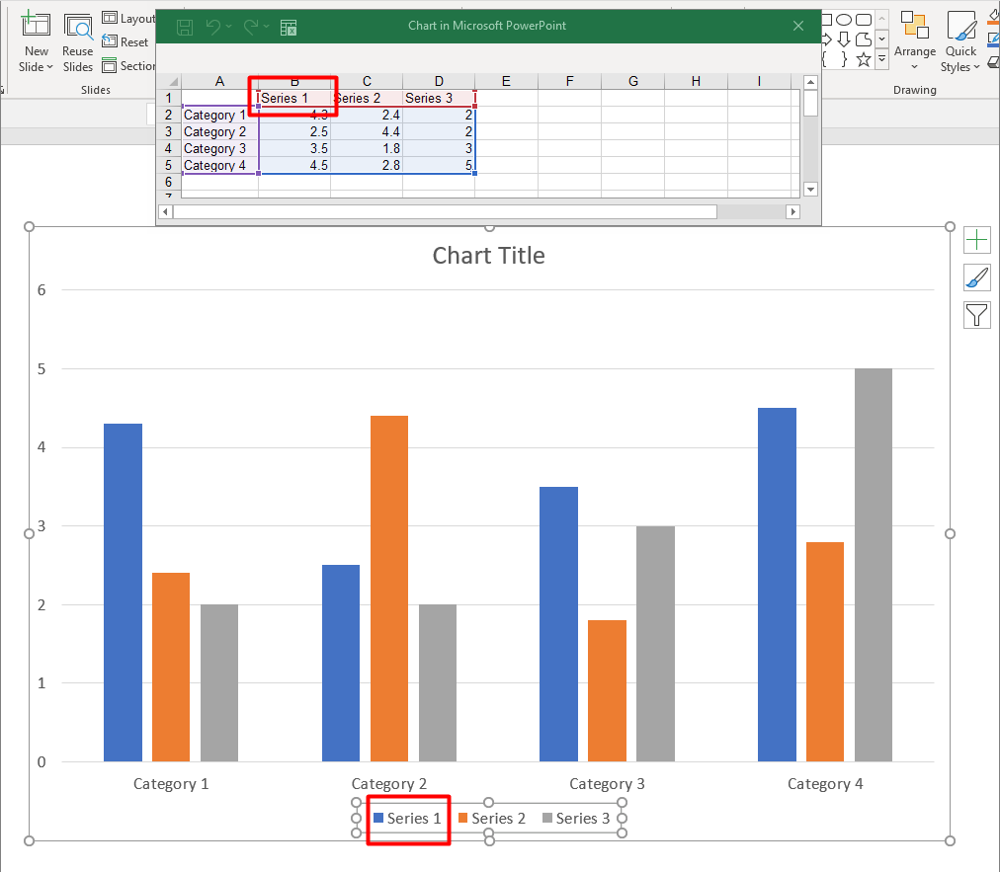

## **अवलोकन**

एक चार्ट अपने प्लॉट किए गए डेटा को चार्ट डेटा कार्यबुक में संग्रहीत करता है। एक [IChartSeries](https://reference.aspose.com/slides/hi/cpp/aspose.slides.charts/ichartseries/) एक संबंधित मानों के सेट का प्रतिनिधित्व करता है, और श्रृंखला में प्रत्येक [IChartDataPoint](https://reference.aspose.com/slides/hi/cpp/aspose.slides.charts/ichartdatapoint/) एक या अधिक कार्यबुक कोशिकाओं को संदर्भित करता है। [IChartCategory](https://reference.aspose.com/slides/hi/cpp/aspose.slides.charts/ichartcategory/) वस्तुएँ लेबल या समूह मान प्रदान करती हैं जो श्रृंखला द्वारा साझा किए जाते हैं। इसलिए श्रृंखला का नाम, श्रेणियां, और बिंदु मान [IChartDataCell](https://reference.aspose.com/slides/hi/cpp/aspose.slides.charts/ichartdatacell/) वस्तुओं से जुड़े होते हैं, न कि केवल प्रदर्शित पाठ के रूप में संग्रहीत होते हैं।

एक सामान्य श्रेणी चार्ट के लिए, डिफ़ॉल्ट कार्यबुक श्रृंखला नामों के लिए पंक्ति 0, श्रेणी नामों के लिए स्तंभ 0, और शेष कोशिकाएँ श्रृंखला मानों के लिए उपयोग करती है। कार्यपत्रक, पंक्ति, और स्तंभ सूचकांक जो [IChartDataWorkbook::GetCell](https://reference.aspose.com/slides/hi/cpp/aspose.slides.charts/ichartdataworkbook/getcell/) को पास किए जाते हैं शून्य‑आधारित होते हैं। यह लेआउट तब उपयोगी होता है जब आप डिफ़ॉल्ट डेटा के साथ एक चार्ट बनाते हैं, लेकिन यह न मानें कि प्रत्येक मौजूदा चार्ट इसका उपयोग करता है। लोड किए हुए प्रेजेंटेशन के लिए, कार्यबुक मानों को बदलने से पहले श्रृंखला, श्रेणियों, और डेटा बिंदुओं द्वारा संदर्भित कोशिकाओं का निरीक्षण करें।

चार्ट सेटिंग्स के तीन अलग-अलग स्कोप होते हैं:

- श्रृंखला‑स्तर की सेटिंग्स, जैसे [IChartSeries::get_Format](https://reference.aspose.com/slides/hi/cpp/aspose.slides.charts/ichartseries/get_format/), एक श्रृंखला के सभी बिंदुओं के लिए डिफ़ॉल्ट रूप प्रदान करती हैं।
- डेटा‑बिंदु सेटिंग्स, जैसे [IChartDataPoint::get_Format](https://reference.aspose.com/slides/hi/cpp/aspose.slides.charts/ichartdatapoint/get_format/), एक बिंदु के लिए श्रृंखला रूप को ओवरराइड करती हैं।
- समूह सेटिंग्स समान [IChartSeriesGroup](https://reference.aspose.com/slides/hi/cpp/aspose.slides.charts/ichartseriesgroup/) से संबंधित संगत श्रृंखलाओं पर लागू होती हैं। जब आपको ओवरलैप या गैप चौड़ाई जैसे विकल्प सेट करने की आवश्यकता हो तो समूह तक [IChartSeries::get_ParentSeriesGroup](https://reference.aspose.com/slides/hi/cpp/aspose.slides.charts/ichartseries/get_parentseriesgroup/) के माध्यम से पहुंचें।

जब कोई स्पष्ट बिंदु या श्रृंखला भराव सेट नहीं किया गया हो, तो चार्ट शैली और थीम स्वचालित रूप निर्धारित करती है। जब दोनों श्रृंखला और बिंदु स्वरूप मौजूद हों, तो बिंदु स्वरूप उस बिंदु के लिए प्राथमिकता लेता है।



## **चार्ट श्रृंखला ओवरलैप सेट करें**

[IChartSeries::get_Overlap](https://reference.aspose.com/slides/hi/cpp/aspose.slides.charts/ichartseries/get_overlap/) बताता है कि 2D चार्ट में बार या कॉलम कितनी प्रतिशत तक ओवरलैप होते हैं, -100 से 100 % तक। यह पैरेंट श्रृंखला समूह पर सेटिंग का केवल‑पढ़ने‑योग्य प्रक्षेपण है। उस समूह में प्रत्येक संगत श्रृंखला को अद्यतित करने के लिए [IChartSeriesGroup::set_Overlap](https://reference.aspose.com/slides/hi/cpp/aspose.slides.charts/ichartseriesgroup/set_overlap/) को कॉल करें। यह विकल्प उन चार्ट प्रकारों पर लागू होता है जो समूहित बार या कॉलम दिखाते हैं; यह संयोजन चार्ट में असंबंधित श्रृंखला समूहों को प्रभावित नहीं करता।

निम्नलिखित उदाहरण पहले श्रृंखला को शामिल करने वाले समूह के लिए ओवरलैप सेट करता है:

```cpp
#include <cstdint>
#include <DOM/Chart/ChartType.h>
#include <DOM/Chart/IChartData.h>
#include <DOM/Chart/IChartSeries.h>
#include <DOM/Chart/IChartSeriesCollection.h>
#include <DOM/Chart/IChartSeriesGroup.h>
#include <DOM/IChart.h>
#include <DOM/IShapeCollection.h>
#include <DOM/ISlide.h>
#include <DOM/Presentation.h>
#include <Export/SaveFormat.h>
#include <system/shared_ptr.h>

using Aspose::Slides::Charts::ChartType;
using Aspose::Slides::Export::SaveFormat;
using Aspose::Slides::Presentation;

const int firstSlideIndex = 0;
const int firstSeriesIndex = 0;
const int8_t overlapPercent = 30;

auto presentation = System::MakeObject<Presentation>();
auto slide = presentation->get_Slide(firstSlideIndex);

// नया चार्ट नमूना श्रृंखलाएँ, श्रेणियाँ और मान शामिल करता है.
auto chart = slide->get_Shapes()->AddChart(ChartType::ClusteredColumn, 20.0f, 20.0f, 500.0f, 200.0f);

auto seriesCollection = chart->get_ChartData()->get_Series();
auto series = seriesCollection->idx_get(firstSeriesIndex);
series->get_ParentSeriesGroup()->set_Overlap(overlapPercent);

presentation->Save(u"series_overlap.pptx", SaveFormat::Pptx);
presentation->Dispose();
```

परिणाम:


## **श्रृंखला भराव रंग बदलें**

पूरा श्रृंखला के लिए डिफ़ॉल्ट भराव सेट करने हेतु [IChartSeries::get_Format](https://reference.aspose.com/slides/hi/cpp/aspose.slides.charts/ichartseries/get_format/) का उपयोग करें। यदि किसी बिंदु का पहले से स्पष्ट भराव है, तो उसका [IChartDataPoint::get_Format](https://reference.aspose.com/slides/hi/cpp/aspose.slides.charts/ichartdatapoint/get_format/) सेटिंग उस बिंदु के लिए श्रृंखला भराव को ओवरराइड करती है।

निम्नलिखित उदाहरण पहली श्रृंखला पर ठोस नीला भराव लागू करता है:

```cpp
#include <DOM/Chart/ChartType.h>
#include <DOM/Chart/IChartData.h>
#include <DOM/Chart/IChartSeries.h>
#include <DOM/Chart/IChartSeriesCollection.h>
#include <DOM/Chart/IFormat.h>
#include <DOM/FillType.h>
#include <DOM/IChart.h>
#include <DOM/IColorFormat.h>
#include <DOM/IFillFormat.h>
#include <DOM/IShapeCollection.h>
#include <DOM/ISlide.h>
#include <DOM/Presentation.h>
#include <Export/SaveFormat.h>
#include <drawing/color.h>
#include <system/shared_ptr.h>

using Aspose::Slides::Charts::ChartType;
using Aspose::Slides::Export::SaveFormat;
using Aspose::Slides::FillType;
using Aspose::Slides::Presentation;
using System::Drawing::Color;

const int firstSlideIndex = 0;
const int firstSeriesIndex = 0;

auto presentation = System::MakeObject<Presentation>();
auto slide = presentation->get_Slide(firstSlideIndex);

auto chart = slide->get_Shapes()->AddChart(ChartType::ClusteredColumn, 20.0f, 20.0f, 500.0f, 200.0f);

auto seriesCollection = chart->get_ChartData()->get_Series();
auto series = seriesCollection->idx_get(firstSeriesIndex);
auto seriesColor = Color::get_Blue();
series->get_Format()->get_Fill()->set_FillType(FillType::Solid);
series->get_Format()->get_Fill()->get_SolidFillColor()->set_Color(seriesColor);

presentation->Save(u"series_color.pptx", SaveFormat::Pptx);
presentation->Dispose();
```

परिणाम:


## **श्रृंखला का नाम बदलें**

श्रृंखला का नाम चार्ट डेटा कार्यबुक में संग्रहीत होता है और सामान्यतः लेजेंड में दिखाया जाता है। क्लस्टर्ड कॉलम चार्ट के लिए निर्मित डिफ़ॉल्ट कार्यबुक में, सेल B1 पंक्ति 0, स्तंभ 1 पर स्थित है और पहली श्रृंखला का नाम रखता है। निम्न उदाहरण में नामित स्थिरांक इस संरचना को स्पष्ट करते हैं:

```cpp
#include <DOM/Chart/ChartType.h>
#include <DOM/Chart/IChartData.h>
#include <DOM/Chart/IChartDataCell.h>
#include <DOM/Chart/IChartDataWorkbook.h>
#include <DOM/IChart.h>
#include <DOM/IShapeCollection.h>
#include <DOM/ISlide.h>
#include <DOM/Presentation.h>
#include <Export/SaveFormat.h>
#include <system/object_ext.h>
#include <system/shared_ptr.h>
#include <system/string.h>

using Aspose::Slides::Charts::ChartType;
using Aspose::Slides::Export::SaveFormat;
using Aspose::Slides::Presentation;
using System::ObjectExt;
using System::String;

const int firstSlideIndex = 0;
const int worksheetIndex = 0;
const int seriesNameRowIndex = 0;
const int firstSeriesColumnIndex = 1;

auto presentation = System::MakeObject<Presentation>();
auto slide = presentation->get_Slide(firstSlideIndex);

auto chart = slide->get_Shapes()->AddChart(ChartType::ClusteredColumn, 20.0f, 20.0f, 500.0f, 200.0f);

auto workbook = chart->get_ChartData()->get_ChartDataWorkbook();
auto seriesNameCell = workbook->GetCell(worksheetIndex, seriesNameRowIndex, firstSeriesColumnIndex);
auto seriesName = ObjectExt::Box<String>(u"Revenue");
seriesNameCell->set_Value(seriesName);

presentation->Save(u"series_name.pptx", SaveFormat::Pptx);
presentation->Dispose();
```

आप [IChartSeries::get_Name](https://reference.aspose.com/slides/hi/cpp/aspose.slides.charts/ichartseries/get_name/) द्वारा पहले से संदर्भित सेल को भी अपडेट कर सकते हैं। यह दृष्टिकोण मौजूदा चार्ट में किसी विशिष्ट पंक्ति और स्तंभ को मानने से बचता है:

```cpp
#include <DOM/Chart/ChartType.h>
#include <DOM/Chart/IChartCellCollection.h>
#include <DOM/Chart/IChartData.h>
#include <DOM/Chart/IChartDataCell.h>
#include <DOM/Chart/IChartSeries.h>
#include <DOM/Chart/IChartSeriesCollection.h>
#include <DOM/Chart/IStringChartValue.h>
#include <DOM/IChart.h>
#include <DOM/IShapeCollection.h>
#include <DOM/ISlide.h>
#include <DOM/Presentation.h>
#include <Export/SaveFormat.h>
#include <system/object_ext.h>
#include <system/shared_ptr.h>
#include <system/string.h>

using Aspose::Slides::Charts::ChartType;
using Aspose::Slides::Export::SaveFormat;
using Aspose::Slides::Presentation;
using System::ObjectExt;
using System::String;

const int firstSlideIndex = 0;
const int firstSeriesIndex = 0;
const int firstNameCellIndex = 0;

auto presentation = System::MakeObject<Presentation>();
auto slide = presentation->get_Slide(firstSlideIndex);

auto chart = slide->get_Shapes()->AddChart(ChartType::ClusteredColumn, 20.0f, 20.0f, 500.0f, 200.0f);

auto seriesCollection = chart->get_ChartData()->get_Series();
auto series = seriesCollection->idx_get(firstSeriesIndex);
auto seriesNameCells = series->get_Name()->get_AsCells();
auto seriesNameCell = seriesNameCells->idx_get(firstNameCellIndex);
auto seriesName = ObjectExt::Box<String>(u"Revenue");
seriesNameCell->set_Value(seriesName);

presentation->Save(u"series_name.pptx", SaveFormat::Pptx);
presentation->Dispose();
```

परिणाम:


## **स्वचालित श्रृंखला भराव रंग प्राप्त करें**

[IChartSeries::GetAutomaticSeriesColor](https://reference.aspose.com/slides/hi/cpp/aspose.slides.charts/ichartseries/getautomaticseriescolor/) श्रृंखला सूचकांक और चार्ट शैली से गणना किया गया रंग लौटाता है। यह वह रंग है जो तब उपयोग होता है जब श्रृंखला भराव स्पष्ट रूप से परिभाषित नहीं किया गया हो। इस मेथड को कॉल करने से केवल गणना किया गया रंग पढ़ा जाता है; यह नया भराव नहीं सेट करता।

निम्नलिखित उदाहरण प्रत्येक डिफ़ॉल्ट श्रृंखला का स्वचालित रंग प्रिंट करता है:

```cpp
#include <DOM/Chart/ChartType.h>
#include <DOM/Chart/IChartData.h>
#include <DOM/Chart/IChartSeries.h>
#include <DOM/Chart/IChartSeriesCollection.h>
#include <DOM/IChart.h>
#include <DOM/IShapeCollection.h>
#include <DOM/ISlide.h>
#include <DOM/Presentation.h>
#include <drawing/color.h>
#include <system/console.h>
#include <system/shared_ptr.h>
#include <system/string.h>

using Aspose::Slides::Charts::ChartType;
using Aspose::Slides::Presentation;
using System::Console;
using System::String;

const int firstSlideIndex = 0;

auto presentation = System::MakeObject<Presentation>();
auto slide = presentation->get_Slide(firstSlideIndex);

auto chart = slide->get_Shapes()->AddChart(ChartType::ClusteredColumn, 20.0f, 20.0f, 500.0f, 200.0f);

auto seriesCollection = chart->get_ChartData()->get_Series();
const int seriesCount = seriesCollection->get_Count();
for (int seriesIndex = 0; seriesIndex < seriesCount; seriesIndex++)
{
    auto series = seriesCollection->idx_get(seriesIndex);
    auto automaticColor = series->GetAutomaticSeriesColor();
    auto colorName = automaticColor.get_Name();
    auto outputLine = String::Format(u"Series {0}: {1}", seriesIndex, colorName);
    Console::WriteLine(outputLine);
}

presentation->Dispose();
```

डिफ़ॉल्ट चार्ट शैली के लिए उदाहरण आउटपुट:

```text
Series 0: ff4f81bd
Series 1: ffc0504d
Series 2: ff9bbb59
```

सटीक रंग चार्ट शैली और थीम पर निर्भर करते हैं।

## **एक चार्ट श्रृंखला के लिए इनवर्ट भराव रंग सेट करें**

बार, कॉलम, और बबल श्रृंखलाओं के लिए, [IChartSeries::set_InvertIfNegative](https://reference.aspose.com/slides/hi/cpp/aspose.slides.charts/ichartseries/set_invertifnegative/) नकारात्मक मानों को अलग भराव के साथ प्रदर्शित कर सकता है। नियमित श्रृंखला भराव को ठोस सेट करें, इनवर्ज़न सक्षम करें, और नकारात्मक‑मान रंग को [IChartSeries::get_InvertedSolidFillColor](https://reference.aspose.com/slides/hi/cpp/aspose.slides.charts/ichartseries/get_invertedsolidfillcolor/) के माध्यम से असाइन करें। नकारात्मक संख्याएँ कार्यबुक में अपरिवर्तित रहती हैं; केवल उनके प्रदर्शित रंग बदलते हैं।

निम्नलिखित उदाहरण डिफ़ॉल्ट चार्ट डेटा को एक श्रृंखला से प्रतिस्थापित करता है। कार्यपत्रक पंक्ति 0 में श्रृंखला नाम, स्तंभ 0 में श्रेणी नाम, और स्तंभ 1 में मान होते हैं:

```cpp
#include <DOM/Chart/ChartType.h>
#include <DOM/Chart/IChartCategoryCollection.h>
#include <DOM/Chart/IChartData.h>
#include <DOM/Chart/IChartDataCell.h>
#include <DOM/Chart/IChartDataPointCollection.h>
#include <DOM/Chart/IChartDataWorkbook.h>
#include <DOM/Chart/IChartSeries.h>
#include <DOM/Chart/IChartSeriesCollection.h>
#include <DOM/Chart/IFormat.h>
#include <DOM/FillType.h>
#include <DOM/IChart.h>
#include <DOM/IColorFormat.h>
#include <DOM/IFillFormat.h>
#include <DOM/IShapeCollection.h>
#include <DOM/ISlide.h>
#include <DOM/Presentation.h>
#include <Export/SaveFormat.h>
#include <drawing/color.h>
#include <system/object_ext.h>
#include <system/shared_ptr.h>
#include <system/string.h>

using Aspose::Slides::Charts::ChartType;
using Aspose::Slides::Export::SaveFormat;
using Aspose::Slides::FillType;
using Aspose::Slides::Presentation;
using System::Drawing::Color;
using System::ObjectExt;
using System::String;

const int firstSlideIndex = 0;
const int worksheetIndex = 0;
const int headerRowIndex = 0;
const int categoryColumnIndex = 0;
const int firstSeriesColumnIndex = 1;
const int firstDataRowIndex = 1;
const int categoryCount = 3;

const String categoryNames[] = {u"Category 1", u"Category 2", u"Category 3"};
const int seriesValues[] = {-20, 50, -30};

auto presentation = System::MakeObject<Presentation>();
auto slide = presentation->get_Slide(firstSlideIndex);

auto chart = slide->get_Shapes()->AddChart(ChartType::ClusteredColumn, 20.0f, 20.0f, 500.0f, 200.0f);
auto chartData = chart->get_ChartData();
auto workbook = chartData->get_ChartDataWorkbook();

auto seriesCollection = chartData->get_Series();
seriesCollection->Clear();
chartData->get_Categories()->Clear();

auto seriesName = ObjectExt::Box<String>(u"Series 1");
auto seriesNameCell = workbook->GetCell(worksheetIndex, headerRowIndex, firstSeriesColumnIndex, seriesName);
auto chartType = chart->get_Type();
auto series = seriesCollection->Add(seriesNameCell, chartType);

for (int categoryIndex = 0; categoryIndex < categoryCount; categoryIndex++)
{
    const int dataRowIndex = firstDataRowIndex + categoryIndex;
    auto categoryName = categoryNames[categoryIndex];
    const int seriesValue = seriesValues[categoryIndex];

    auto boxedCategoryName = ObjectExt::Box<String>(categoryName);
    auto categoryCell = workbook->GetCell(worksheetIndex, dataRowIndex, categoryColumnIndex, boxedCategoryName);
    chartData->get_Categories()->Add(categoryCell);

    auto boxedSeriesValue = ObjectExt::Box<int>(seriesValue);
    auto valueCell = workbook->GetCell(worksheetIndex, dataRowIndex, firstSeriesColumnIndex, boxedSeriesValue);
    series->get_DataPoints()->AddDataPointForBarSeries(valueCell);
}

auto automaticSeriesColor = series->GetAutomaticSeriesColor();
auto invertedSeriesColor = Color::get_Red();
series->get_Format()->get_Fill()->set_FillType(FillType::Solid);
series->get_Format()->get_Fill()->get_SolidFillColor()->set_Color(automaticSeriesColor);
series->set_InvertIfNegative(true);
series->get_InvertedSolidFillColor()->set_Color(invertedSeriesColor);

presentation->Save(u"inverted_solid_fill_color.pptx", SaveFormat::Pptx);
presentation->Dispose();
```

परिणाम:


आप एक बिंदु के लिए इनवर्ज़न को [IChartDataPoint::set_InvertIfNegative](https://reference.aspose.com/slides/hi/cpp/aspose.slides.charts/ichartdatapoint/set_invertifnegative/) के द्वारा सक्षम कर सकते हैं। नीचे के उदाहरण में श्रृंखला के लिए इनवर्ज़न निष्क्रिय है और केवल चयनित बिंदु के लिए सक्रिय है। बिंदु को नकारात्मक मान भी असाइन किया गया है ताकि प्रभाव दृश्य हो।

```cpp
#include <DOM/Chart/ChartType.h>
#include <DOM/Chart/IChartData.h>
#include <DOM/Chart/IChartDataCell.h>
#include <DOM/Chart/IChartDataPoint.h>
#include <DOM/Chart/IChartSeries.h>
#include <DOM/Chart/IChartSeriesCollection.h>
#include <DOM/Chart/IDoubleChartValue.h>
#include <DOM/Chart/IFormat.h>
#include <DOM/FillType.h>
#include <DOM/IChart.h>
#include <DOM/IColorFormat.h>
#include <DOM/IFillFormat.h>
#include <DOM/IShapeCollection.h>
#include <DOM/ISlide.h>
#include <DOM/Presentation.h>
#include <Export/SaveFormat.h>
#include <drawing/color.h>
#include <system/object_ext.h>
#include <system/shared_ptr.h>

using Aspose::Slides::Charts::ChartType;
using Aspose::Slides::Export::SaveFormat;
using Aspose::Slides::FillType;
using Aspose::Slides::Presentation;
using System::Drawing::Color;
using System::ObjectExt;

const int firstSlideIndex = 0;
const int firstSeriesIndex = 0;
const int targetDataPointIndex = 2;
const int negativeValue = -30;

auto presentation = System::MakeObject<Presentation>();
auto slide = presentation->get_Slide(firstSlideIndex);

auto chart = slide->get_Shapes()->AddChart(ChartType::ClusteredColumn, 20.0f, 20.0f, 500.0f, 200.0f);

auto seriesCollection = chart->get_ChartData()->get_Series();
auto series = seriesCollection->idx_get(firstSeriesIndex);
auto automaticSeriesColor = series->GetAutomaticSeriesColor();
auto invertedSeriesColor = Color::get_Red();
series->get_Format()->get_Fill()->set_FillType(FillType::Solid);
series->get_Format()->get_Fill()->get_SolidFillColor()->set_Color(automaticSeriesColor);
series->get_InvertedSolidFillColor()->set_Color(invertedSeriesColor);
series->set_InvertIfNegative(false);

auto dataPoint = series->get_DataPoint(targetDataPointIndex);
auto boxedNegativeValue = ObjectExt::Box<int>(negativeValue);
dataPoint->get_YValue()->get_AsCell()->set_Value(boxedNegativeValue);
dataPoint->set_InvertIfNegative(true);

presentation->Save(u"data_point_invert_color_if_negative.pptx", SaveFormat::Pptx);
presentation->Dispose();
```

## **विशिष्ट डेटा बिंदु मान को साफ़ करें**

एक बिंदु को खाली करने के लिए, अन्य बिंदुओं को न हटाते हुए, उसके बैकिंग कार्यबुक सेल को `nullptr` सेट करें। कॉलम चार्ट के लिए, प्लॉट किया गया मान [IChartDataPoint::get_YValue](https://reference.aspose.com/slides/hi/cpp/aspose.slides.charts/ichartdatapoint/get_yvalue/) के माध्यम से उपलब्ध होता है। डेटा बिंदु समान श्रेणी स्थान पर बना रहता है, लेकिन चार्ट अपनी ब्लैंक‑वैल्यू सेटिंग के अनुसार उसके मान को खाली मानता है।

निम्नलिखित उदाहरण पहली श्रृंखला में केवल दूसरा बिंदु साफ़ करता है:

```cpp
#include <DOM/Chart/ChartType.h>
#include <DOM/Chart/IChartData.h>
#include <DOM/Chart/IChartDataCell.h>
#include <DOM/Chart/IChartDataPoint.h>
#include <DOM/Chart/IChartSeries.h>
#include <DOM/Chart/IChartSeriesCollection.h>
#include <DOM/Chart/IDoubleChartValue.h>
#include <DOM/IChart.h>
#include <DOM/IShapeCollection.h>
#include <DOM/ISlide.h>
#include <DOM/Presentation.h>
#include <Export/SaveFormat.h>
#include <system/shared_ptr.h>

using Aspose::Slides::Charts::ChartType;
using Aspose::Slides::Export::SaveFormat;
using Aspose::Slides::Presentation;

const int firstSlideIndex = 0;
const int firstSeriesIndex = 0;
const int targetDataPointIndex = 1;

auto presentation = System::MakeObject<Presentation>();
auto slide = presentation->get_Slide(firstSlideIndex);

auto chart = slide->get_Shapes()->AddChart(ChartType::ClusteredColumn, 20.0f, 20.0f, 500.0f, 200.0f);

auto seriesCollection = chart->get_ChartData()->get_Series();
auto series = seriesCollection->idx_get(firstSeriesIndex);
auto dataPoint = series->get_DataPoint(targetDataPointIndex);
dataPoint->get_YValue()->get_AsCell()->set_Value(nullptr);

presentation->Save(u"clear_data_point_value.pptx", SaveFormat::Pptx);
presentation->Dispose();
```

स्कैटर चार्ट अलग‑अलग X और Y सेल का उपयोग करते हैं, और बबल चार्ट में एक आकार सेल भी होता है। केवल उस सेल को साफ़ करें जो आप हटाना चाहते हैं। जब आप अन्य बिंदुओं को रखना चाहते हैं, तो [IChartDataPointCollection::Clear](https://reference.aspose.com/slides/hi/cpp/aspose.slides.charts/ichartdatapointcollection/clear/) को कॉल न करें, क्योंकि वह मेथड श्रृंखला के सभी डेटा बिंदुओं को हटा देता है।

## **खाली कोशिकाओं के प्रदर्शन को नियंत्रित करें**

छिपी हुई कोशिकाएँ जिनमें मान होते हैं, वे खाली कोशिकाओं से अलग मामलों में आती हैं। छिपी हुई कार्यपत्रक पंक्तियों और स्तंभों से डेटा को शामिल या बाहर करने के लिए देखें [Include Data from Hidden Rows and Columns](/slides/hi/cpp/chart-workbook/#include-data-from-hidden-rows-and-columns)।

एक खाली कार्यबुक सेल अनुपस्थित डेटा दर्शाता है; `0` वाला सेल ज्ञात संख्यात्मक मान दर्शाता है। एक सेल को खाली बनाने के लिए [IChartDataCell::set_Value](https://reference.aspose.com/slides/hi/cpp/aspose.slides.charts/ichartdatacell/set_value/) को `nullptr` के साथ कॉल करें। शून्य संख्या शून्य ही रहेगी, चाहे ब्लैंक‑सेल सेटिंग कुछ भी हो।

खाली कोशिकाओं को चार्ट कैसे दर्शाता है, इसे चुनने के लिए [IChart::set_DisplayBlanksAs](https://reference.aspose.com/slides/hi/cpp/aspose.slides.charts/ichart/set_displayblanksas/) का उपयोग करें। यह सेटिंग पूरे चार्ट पर लागू होती है। यह ब्लैंक का प्लॉटिंग तरीका बदलती है, बिना खाली कार्यबुक सेल को शून्य या इंटरपोलेटेड मान से भरने के।

निम्नलिखित स्व-समावेशी उदाहरण एक लाइन चार्ट बनाता है जिसमें एक श्रृंखला है, दिन 3 का मान हटाता है, और प्रत्येक मोड के साथ वही चार्ट सेव करता है। कोई इनपुट फ़ाइल आवश्यक नहीं है। [IChartDataWorkbook](https://reference.aspose.com/slides/hi/cpp/aspose.slides.charts/ichartdataworkbook/) कार्यपत्रक 0, स्तंभ 0 को श्रेणी लेबल के लिए, और स्तंभ 1 को मान के लिए उपयोग करता है; पंक्ति 0 में श्रृंखला नाम रखता है। अंतिम डेटा `10, 20, empty, 30, 40` है।

```cpp
#include <array>
#include <DOM/Chart/ChartType.h>
#include <DOM/Chart/DisplayBlanksAsType.h>
#include <DOM/Chart/IChartCategoryCollection.h>
#include <DOM/Chart/IChartData.h>
#include <DOM/Chart/IChartDataCell.h>
#include <DOM/Chart/IChartDataPointCollection.h>
#include <DOM/Chart/IChartDataWorkbook.h>
#include <DOM/Chart/IChartSeries.h>
#include <DOM/Chart/IChartSeriesCollection.h>
#include <DOM/IChart.h>
#include <DOM/IShapeCollection.h>
#include <DOM/ISlide.h>
#include <DOM/Presentation.h>
#include <Export/SaveFormat.h>
#include <system/object_ext.h>
#include <system/shared_ptr.h>
#include <system/string.h>

using namespace Aspose::Slides;
using namespace Aspose::Slides::Charts;
using namespace Aspose::Slides::Export;
using System::ObjectExt;
using System::String;

auto presentation = System::MakeObject<Presentation>();
auto slide = presentation->get_Slide(0);

auto chart = slide->get_Shapes()->AddChart(ChartType::LineWithMarkers, 40.0f, 40.0f, 640.0f, 400.0f);
auto chartData = chart->get_ChartData();
auto workbook = chartData->get_ChartDataWorkbook();

chartData->get_Series()->Clear();
chartData->get_Categories()->Clear();

auto seriesName = ObjectExt::Box<String>(u"Measurements");
auto seriesNameCell = workbook->GetCell(0, 0, 1, seriesName);
auto series = chartData->get_Series()->Add(seriesNameCell, chart->get_Type());
auto values = std::array<int, 5>{10, 20, 25, 30, 40};

for (auto i = 0; i < values.size(); i++)
{
    auto categoryName = String::Format(u"Day {0}", i + 1);
    auto boxedCategoryName = ObjectExt::Box<String>(categoryName);
    auto categoryCell = workbook->GetCell(0, i + 1, 0, boxedCategoryName);
    chartData->get_Categories()->Add(categoryCell);
    auto boxedValue = ObjectExt::Box<int>(values[i]);
    auto valueCell = workbook->GetCell(0, i + 1, 1, boxedValue);
    series->get_DataPoints()->AddDataPointForLineSeries(valueCell);
}

// Day 3 को वास्तव में खाली छोड़ें, जबकि उसकी श्रेणी और डेटा बिंदु को बनाए रखें।
workbook->GetCell(0, 3, 1)->set_Value(nullptr);

auto modes = std::array<DisplayBlanksAsType, 3>{DisplayBlanksAsType::Gap, DisplayBlanksAsType::Zero, DisplayBlanksAsType::Span};
for (auto mode : modes)
{
    chart->set_DisplayBlanksAs(mode);
    auto outputPath = String::Format(u"empty_cells_{0}.pptx", mode);
    presentation->Save(outputPath, SaveFormat::Pptx);
}

presentation->Dispose();
```

प्रत्येक आउटपुट फ़ाइल में सहेजने से पहले सेट किया गया मोड निरूपित होता है: `empty_cells_Gap.pptx`, `empty_cells_Zero.pptx`, और `empty_cells_Span.pptx`। केवल एक संस्करण सहेजने के लिए, इच्छित मोड असाइन करें और प्रस्तुति को एक बार सहेजें, मोडों पर इटररेट न करें।

नीचे का तुलना वही डेटा तीनों फ़ाइलों में दिखाती है। प्रत्येक मामले में कार्यबुक में दिन 3 खाली है:


दृश्य प्रभाव चार्ट प्रकार पर निर्भर करता है। लाइन चार्ट सभी तीन मोड की तुलना आसान बनाता है। बार और कॉलम चार्ट में किसी खोई हुई श्रेणी के ऊपर कनेक्ट करने के लिए कोई लाइन नहीं होती, इसलिए `Span` ऊपर दिखाया गया कनेक्टिंग सेगमेंट नहीं बना सकता; एक अनुपस्थित कॉलम और शून्य‑ऊँचाई वाला कॉलम भी समान दिख सकते हैं। इसी तरह, केवल मार्कर वाले स्कैटर चार्ट में कोई कनेक्टिंग लाइन नहीं होती। सभी चार्ट प्रकारों में तीन अलग-अलग परिणाम की उम्मीद न रखें; उपयोग किए गए प्रकार के लिए आउटपुट जांचें।

## **श्रृंखला गैप चौड़ाई सेट करें**

गैप चौड़ाई समान बार या कॉलम क्लस्टर के बीच की स्थान है, जिसे बार या कॉलम की चौड़ाई के प्रतिशत के रूप में व्यक्त किया जाता है। ओवरलैप की तरह, यह पैरेंट श्रृंखला समूह से संबंधित है, न कि किसी एकल श्रृंखला से। समूह के लिए एक बार [IChartSeriesGroup::set_GapWidth](https://reference.aspose.com/slides/hi/cpp/aspose.slides.charts/ichartseriesgroup/set_gapwidth/) को कॉल करें। बड़ा मान क्लस्टर के बीच अधिक स्थान बनाता है; छोटा मान उन्हें अधिक घना बनाता है।

निम्नलिखित उदाहरण गैप चौड़ाई बदलता है और केवल अंतिम प्रस्तुति को सहेजता है:

```cpp
#include <cstdint>
#include <DOM/Chart/ChartType.h>
#include <DOM/Chart/IChartData.h>
#include <DOM/Chart/IChartSeries.h>
#include <DOM/Chart/IChartSeriesCollection.h>
#include <DOM/Chart/IChartSeriesGroup.h>
#include <DOM/IChart.h>
#include <DOM/IShapeCollection.h>
#include <DOM/ISlide.h>
#include <DOM/Presentation.h>
#include <Export/SaveFormat.h>
#include <system/shared_ptr.h>

using Aspose::Slides::Charts::ChartType;
using Aspose::Slides::Export::SaveFormat;
using Aspose::Slides::Presentation;

const int firstSlideIndex = 0;
const int firstSeriesIndex = 0;
const uint16_t gapWidthPercent = 30;

auto presentation = System::MakeObject<Presentation>();
auto slide = presentation->get_Slide(firstSlideIndex);

auto chart = slide->get_Shapes()->AddChart(ChartType::StackedColumn, 20.0f, 20.0f, 500.0f, 200.0f);

auto seriesCollection = chart->get_ChartData()->get_Series();
auto series = seriesCollection->idx_get(firstSeriesIndex);
series->get_ParentSeriesGroup()->set_GapWidth(gapWidthPercent);

presentation->Save(u"gap_width_30.pptx", SaveFormat::Pptx);
presentation->Dispose();
```

परिणाम:


## **अक्सर पूछे जाने वाले प्रश्न**

**कौन से चार्ट प्रकार डेटा श्रृंखला का समर्थन करते हैं?**

[ChartType](https://reference.aspose.com/slides/hi/cpp/aspose.slides.charts/charttype/) एन्नुमरेशन द्वारा प्रतिनिधित्व किए गए सभी चार्ट प्रकार डेटा का उपयोग करते हैं, लेकिन उनकी श्रृंखलाओं की संरचना या सेटिंग्स समान नहीं होती। उदाहरण के लिए, श्रेणी चार्ट में श्रेणियां और मान होते हैं, स्कैटर चार्ट में X और Y मान होते हैं, और बबल चार्ट में बबल आकार भी जोड़ता है। श्रृंखला प्रकार से मेल खाने वाला डेटा‑बिंदु निर्माण मेथड प्रयोग करें। ओवरलैप और गैप चौड़ाई जैसे विकल्प केवल संगत बार या कॉलम समूहों पर लागू होते हैं।

**चार्ट श्रृंखला समूह क्या है?**

[IChartSeriesGroup](https://reference.aspose.com/slides/hi/cpp/aspose.slides.charts/ichartseriesgroup/) वह समूह है जिसमें समान सेटिंग्स वाले संगत श्रृंखलाएँ होती हैं। एक संयोजन चार्ट में एक से अधिक समूह हो सकते हैं, इसलिए एक श्रृंखला के माध्यम से पहुँचा गया समूह बदलना अनिवार्य रूप से चार्ट की सभी श्रृंखलाओं को प्रभावित नहीं करता।

**क्या नई निर्मित चार्ट में डिफ़ॉल्ट डेटा होता है?**

हां। डिफ़ॉल्ट रूप से, [IShapeCollection::AddChart](https://reference.aspose.com/slides/hi/cpp/aspose.slides/ishapecollection/addchart/) नमूना श्रृंखलाएँ, श्रेणियाँ और मान बनाता है। आप उन कोशिकाओं को संपादित कर सकते हैं या पूरी तरह से कस्टम डेटा सेट जोड़ने से पहले दोनों श्रृंखला और श्रेणी संग्रह को साफ़ कर सकते हैं। एक ओवरलोड भी बिना डिफ़ॉल्ट डेटा के चार्ट बना सकता है।

**चार्ट ऑब्जेक्ट्स कार्यबुक कोशिकाओं से कैसे जुड़े होते हैं?**

श्रृंखला नाम, श्रेणी लेबल, और डेटा‑बिंदु मान [IChartDataWorkbook](https://reference.aspose.com/slides/hi/cpp/aspose.slides.charts/ichartdataworkbook/) की कोशिकाओं को संदर्भित करते हैं। किसी संदर्भित कोशिका को बदलने से संबंधित चार्ट तत्व अपडेट हो जाता है। कस्टम डेटा बनाते समय, श्रेणी पंक्तियों और श्रृंखला‑मान पंक्तियों को संरेखित रखें ताकि प्रत्येक बिंदु इच्छित श्रेणी के तहत प्लॉट हो।

**पूरी श्रृंखला के बजाय एक बिंदु कैसे साफ़ करें?**

`nullptr` सेट करके संबंधित मान कोशिका को खाली रखें, जिससे बिंदु की श्रेणी स्थिति खाली बिंदु के रूप में बनी रहती है। केवल तब [IChartDataPointCollection::Clear](https://reference.aspose.com/slides/hi/cpp/aspose.slides.charts/ichartdatapointcollection/clear/) कॉल करें जब आप उस श्रृंखला के सभी बिंदुओं को हटाना चाहते हों। यदि आप श्रेणियां भी हटाते हैं, तो सभी श्रृंखलाओं को अपडेट करें ताकि उनके मान श्रेणी संग्रह के साथ संरेखित रहें।

**खाली बिंदु कैसे प्रदर्शित होते हैं?**

परिणाम चार्ट प्रकार और [IChart::get_DisplayBlanksAs](https://reference.aspose.com/slides/hi/cpp/aspose.slides.charts/ichart/get_displayblanksas/) पर निर्भर करता है। समर्थित चार्ट खाली को गैप, शून्य मान, या निकटवर्ती बिंदुओं को जोड़कर दिखा सकते हैं। अपनी प्रस्तुति में गायब डेटा के अर्थ के अनुसार सेटिंग चुनें। पूर्ण उदाहरण और दृश्य तुलना के लिए देखें [खाली कोशिकाओं के प्रदर्शन को नियंत्रित करें](#control-the-display-of-empty-cells)।

**नकारात्मक मान कैसे स्वरूपित होते हैं?**

समर्थित बार, कॉलम और बबल श्रृंखलाओं के लिए, [IChartSeries::set_InvertIfNegative](https://reference.aspose.com/slides/hi/cpp/aspose.slides.charts/ichartseries/set_invertifnegative/) को कॉल करें और रंग को [IChartSeries::get_InvertedSolidFillColor](https://reference.aspose.com/slides/hi/cpp/aspose.slides.charts/ichartseries/get_invertedsolidfillcolor/) के माध्यम से सेट करें। आप एक व्यक्तिगत बिंदु के लिए व्यवहार को [IChartDataPoint::set_InvertIfNegative](https://reference.aspose.com/slides/hi/cpp/aspose.slides.charts/ichartdatapoint/set_invertifnegative/) से ओवरराइड कर सकते हैं। ये मेथड स्वरूपण को प्रभावित करते हैं, न कि संग्रहीत संख्यात्मक मानों को।

**जब श्रृंखला और बिंदु दोनों स्वरूपित हों तो कौन जीतेगा?**

विशिष्ट बिंदु के लिए स्पष्ट डेटा‑बिंदु स्वरूप प्राथमिकता लेता है। अन्य बिंदु स्पष्ट श्रृंखला स्वरूप या, यदि श्रृंखला स्वरूप परिभाषित नहीं है, तो स्वचालित चार्ट शैली और थीम का उपयोग जारी रखते हैं। समूह सेटिंग्स जैसे ओवरलैप और गैप चौड़ाई लेआउट को नियंत्रित करती हैं और बिंदु‑स्तर स्वरूपण को ओवरराइड नहीं करतीं।

**एक चार्ट में कितनी अधिकतम श्रृंखलाएँ हो सकती हैं?**

Aspose.Slides किसी अलग स्थिर श्रृंखला‑गणना सीमा नहीं लगाता। व्यावहारिक रूप से, प्रस्तुति फ़ाइल सीमाएँ, उपलब्ध मेमोरी, रेंडरिंग समय, और चार्ट की पठनीयता उपयोगी सीमा तय करती हैं।

**जब कॉलम बहुत निकट या बहुत दूर हों तो क्या करें?**

उचित पैरेंट श्रृंखला समूह पर [IChartSeriesGroup::set_GapWidth](https://reference.aspose.com/slides/hi/cpp/aspose.slides.charts/ichartseriesgroup/set_gapwidth/) कॉल करें। मान को बढ़ाकर क्लस्टर के बीच की दूरी बढ़ाएँ, या घटाकर क्लस्टर को करीब लाएँ।