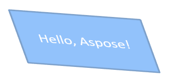

## **परिचय**

PowerPoint में, आप स्लाइड में शकलें (shapes) जोड़ सकते हैं। चूंकि शकलें रेखाओं से बनी होती हैं, आप उनकी रूपरेखा (outline) को संशोधित या प्रभाव लागू करके स्वरूपित कर सकते हैं। अतिरिक्त रूप से, आप शकल के आंतरिक भाग को कैसे भरा जाए, यह नियंत्रित करने वाली सेटिंग्स को निर्दिष्ट करके शकल को स्वरूपित कर सकते हैं।


Aspose.Slides for C++ ऐसे इंटरफ़ेस और मेथड प्रदान करता है जो PowerPoint में उपलब्ध समान विकल्पों का उपयोग करके शकलों को स्वरूपित करने की अनुमति देते हैं।

## **रेखाएँ स्वरूपित करें**

Aspose.Slides का उपयोग करके आप किसी शकल के लिए कस्टम लाइन स्टाइल निर्दिष्ट कर सकते हैं। निम्नलिखित कदम प्रक्रिया को दर्शाते हैं:

1. Create an instance of the [Presentation](https://reference.aspose.com/slides/hi/cpp/aspose.slides/presentation/) class.
1. Get a reference to a slide by its index.
1. Add an [IAutoShape](https://reference.aspose.com/slides/hi/cpp/aspose.slides/iautoshape/) to the slide.
1. Set the [line style](https://reference.aspose.com/slides/hi/cpp/aspose.slides/linestyle/) of the shape.
1. Set the line width.
1. Set the [dash style](https://reference.aspose.com/slides/hi/cpp/aspose.slides/linedashstyle/) of the line.
1. Set the line color for the shape.
1. Save the modified presentation as a PPTX file.

निम्न कोड दिखाता है कि एक आयताकार `AutoShape` की रेखाओं को कैसे स्वरूपित किया जाता है:

```cpp
#include <DOM/FillType.h>
#include <DOM/IAutoShape.h>
#include <DOM/IColorFormat.h>
#include <DOM/IFillFormat.h>
#include <DOM/ILineFillFormat.h>
#include <DOM/ILineFormat.h>
#include <DOM/IShapeCollection.h>
#include <DOM/ISlide.h>
#include <DOM/LineDashStyle.h>
#include <DOM/LineStyle.h>
#include <DOM/Presentation.h>
#include <DOM/ShapeType.h>
#include <Export/SaveFormat.h>
#include <drawing/color.h>
#include <system/smart_ptr.h>
using namespace Aspose::Slides;
using namespace Aspose::Slides::Export;
using namespace System;
using namespace System::Drawing;

// एक प्रेजेंटेशन फ़ाइल का प्रतिनिधित्व करने वाली Presentation क्लास का उदाहरण बनाएँ।
auto presentation = MakeObject<Presentation>();

// पहली स्लाइड प्राप्त करें।
auto slide = presentation->get_Slide(0);

// Rectangle प्रकार की एक ऑटो शकल जोड़ें।
auto shape = slide->get_Shapes()->AddAutoShape(ShapeType::Rectangle, 50, 150, 150, 75);

// आयताकार शकल के लिए फिल रंग सेट करें।
shape->get_FillFormat()->set_FillType(FillType::NoFill);

// आयताकार की रेखाओं पर स्वरूपण लागू करें।
shape->get_LineFormat()->set_Style(LineStyle::ThickThin);
shape->get_LineFormat()->set_Width(7);
shape->get_LineFormat()->set_DashStyle(LineDashStyle::Dash);

// आयताकार की रेखा के लिए रंग सेट करें।
shape->get_LineFormat()->get_FillFormat()->set_FillType(FillType::Solid);
shape->get_LineFormat()->get_FillFormat()->get_SolidFillColor()->set_Color(Color::get_Blue());

// PPTX फ़ाइल को डिस्क पर सहेजें।
presentation->Save(u"formatted_lines.pptx", SaveFormat::Pptx);
presentation->Dispose();
```

परिणाम:


## **शकल रेखाओं पर स्केच प्रभाव लागू करें**

स्केच प्रभाव शकल की रेखा को हाथ से खींची हुई जैसा बनाता है। रेखा सेटिंग तक पहुँचने के लिए [IShape::get_LineFormat](https://reference.aspose.com/slides/hi/cpp/aspose.slides/ishape/get_lineformat/) का उपयोग करें, स्केच सेटिंग तक पहुँचने के लिए [ILineFormat::get_SketchFormat](https://reference.aspose.com/slides/hi/cpp/aspose.slides/ilineformat/get_sketchformat/) का उपयोग करें, और [ISketchFormat::set_SketchType](https://reference.aspose.com/slides/hi/cpp/aspose.slides/isketchformat/set_sketchtype/) से [LineSketchType](https://reference.aspose.com/slides/hi/cpp/aspose.slides/linesketchtype/) सूची से मान चुनें।

निम्न C++ कोड दर्शाता है कि कैसे [LineSketchType::Curved](https://reference.aspose.com/slides/hi/cpp/aspose.slides/linesketchtype/) प्रभाव लागू किया जाता है, स्पष्ट रूप से असाइन किया गया मान पढ़ा जाता है, और [LineSketchType::None](https://reference.aspose.com/slides/hi/cpp/aspose.slides/linesketchtype/) से प्रभाव हटाया जाता है:

```cpp
auto presentation = MakeObject<Presentation>();

auto slide = presentation->get_Slide(0);
auto shape = slide->get_Shapes()->AddAutoShape(ShapeType::Rectangle, 50, 50, 200, 100);

// Access the shape's line format and its sketch format.
auto sketchFormat = shape->get_LineFormat()->get_SketchFormat();

// Apply a sketch effect.
sketchFormat->set_SketchType(LineSketchType::Curved);

// Read the sketch effect assigned directly to the shape.
auto explicitSketchType = sketchFormat->get_SketchType();
Console::WriteLine(u"Explicit sketch type: {0}", explicitSketchType);

// Remove the sketch effect.
sketchFormat->set_SketchType(LineSketchType::None);

presentation->Dispose();
```

[ISketchFormat::get_SketchType](https://reference.aspose.com/slides/hi/cpp/aspose.slides/isketchformat/get_sketchtype/) द्वारा लौटाया गया मान शकल को सीधे असाइन की गई सेटिंग को दर्शाता है। यदि रेखा स्वरूपण थीम, मास्टर स्लाइड या लेआउट स्लाइड से विरासत में मिल सकता है, तो [ILineFormat::GetEffective](https://reference.aspose.com/slides/hi/cpp/aspose.slides/ilineformat/geteffective/) का उपयोग करें, [ILineFormatEffectiveData::get_SketchFormat](https://reference.aspose.com/slides/hi/cpp/aspose.slides/ilineformateffectivedata/get_sketchformat/) तक पहुँचें, और [ISketchFormatEffectiveData::get_SketchType](https://reference.aspose.com/slides/hi/cpp/aspose.slides/isketchformateffectivedata/get_sketchtype/) पढ़ें। प्रभावी मान वह स्वरूपण दर्शाता है जो विरासत समाधान के बाद वास्तविक रूप से लागू होता है:

```cpp
auto presentation = MakeObject<Presentation>(u"presentation.pptx");

auto shape = presentation->get_Slide(0)->get_Shape(0);
auto lineFormat = shape->get_LineFormat();

auto explicitSketchType = lineFormat->get_SketchFormat()->get_SketchType();
auto effectiveLineFormat = lineFormat->GetEffective();
auto effectiveSketchType = effectiveLineFormat->get_SketchFormat()->get_SketchType();

Console::WriteLine(u"Explicit sketch type: {0}", explicitSketchType);
Console::WriteLine(u"Effective sketch type: {0}", effectiveSketchType);

presentation->Dispose();
```

## **जॉइन स्टाइल स्वरूपित करें**

यहाँ तीन जॉइन प्रकार विकल्प हैं:

* Round
* Miter
* Bevel

डिफ़ॉल्ट रूप से, जब PowerPoint दो रेखाओं को कोण पर जोड़ता है (जैसे शकल के कोने पर), वह **Round** सेटिंग का उपयोग करता है। हालांकि, यदि आप तीखे कोण वाली शकल बना रहे हैं, तो आप **Miter** विकल्प को प्राथमिकता दे सकते हैं।


निम्न C++ कोड दर्शाता है कि ऊपर दिखाए गए चित्र में Miter, Bevel, और Round जॉइन टाइप सेटिंग्स का उपयोग करके तीन आयतें कैसे बनाई गईं:

```cpp
#include <DOM/FillType.h>
#include <DOM/IAutoShape.h>
#include <DOM/IColorFormat.h>
#include <DOM/IFillFormat.h>
#include <DOM/ILineFillFormat.h>
#include <DOM/ILineFormat.h>
#include <DOM/IShapeCollection.h>
#include <DOM/ISlide.h>
#include <DOM/ITextFrame.h>
#include <DOM/LineJoinStyle.h>
#include <DOM/Presentation.h>
#include <DOM/ShapeType.h>
#include <Export/SaveFormat.h>
#include <drawing/color.h>
#include <system/smart_ptr.h>
using namespace Aspose::Slides;
using namespace Aspose::Slides::Export;
using namespace System;
using namespace System::Drawing;

// एक प्रेजेंटेशन फ़ाइल का प्रतिनिधित्व करने वाली Presentation क्लास का उदाहरण बनाएँ।
auto presentation = MakeObject<Presentation>();

// पहली स्लाइड प्राप्त करें।
auto slide = presentation->get_Slide(0);

// Rectangle प्रकार की तीन ऑटो शकलें जोड़ें।
auto shape1 = slide->get_Shapes()->AddAutoShape(ShapeType::Rectangle, 20, 20, 150, 75);
auto shape2 = slide->get_Shapes()->AddAutoShape(ShapeType::Rectangle, 210, 20, 150, 75);
auto shape3 = slide->get_Shapes()->AddAutoShape(ShapeType::Rectangle, 20, 135, 150, 75);

// प्रत्येक आयताकार शकल के लिए फिल रंग सेट करें।
shape1->get_FillFormat()->set_FillType(FillType::Solid);
shape1->get_FillFormat()->get_SolidFillColor()->set_Color(Color::get_Black());
shape2->get_FillFormat()->set_FillType(FillType::Solid);
shape2->get_FillFormat()->get_SolidFillColor()->set_Color(Color::get_Black());
shape3->get_FillFormat()->set_FillType(FillType::Solid);
shape3->get_FillFormat()->get_SolidFillColor()->set_Color(Color::get_Black());

// रेखा की चौड़ाई सेट करें।
shape1->get_LineFormat()->set_Width(15);
shape2->get_LineFormat()->set_Width(15);
shape3->get_LineFormat()->set_Width(15);

// प्रत्येक आयताकार की रेखा के लिए रंग सेट करें।
shape1->get_LineFormat()->get_FillFormat()->set_FillType(FillType::Solid);
shape1->get_LineFormat()->get_FillFormat()->get_SolidFillColor()->set_Color(Color::get_Blue());
shape2->get_LineFormat()->get_FillFormat()->set_FillType(FillType::Solid);
shape2->get_LineFormat()->get_FillFormat()->get_SolidFillColor()->set_Color(Color::get_Blue());
shape3->get_LineFormat()->get_FillFormat()->set_FillType(FillType::Solid);
shape3->get_LineFormat()->get_FillFormat()->get_SolidFillColor()->set_Color(Color::get_Blue());

// जॉइन स्टाइल सेट करें।
shape1->get_LineFormat()->set_JoinStyle(LineJoinStyle::Miter);
shape2->get_LineFormat()->set_JoinStyle(LineJoinStyle::Bevel);
shape3->get_LineFormat()->set_JoinStyle(LineJoinStyle::Round);

// प्रत्येक आयताकार में पाठ जोड़ें।
shape1->get_TextFrame()->set_Text(u"Miter Join Style");
shape2->get_TextFrame()->set_Text(u"Bevel Join Style");
shape3->get_TextFrame()->set_Text(u"Round Join Style");

// PPTX फ़ाइल को डिस्क पर सहेजें।
presentation->Save(u"join_styles.pptx", SaveFormat::Pptx);
presentation->Dispose();
```

## **ग्रेडिएंट फिल**

PowerPoint में, ग्रेडिएंट फिल एक स्वरूपण विकल्प है जो आपको शकल पर निरंतर रंगों के मिश्रण को लागू करने देता है। उदाहरण के लिए, आप दो या अधिक रंगों को इस तरह लागू कर सकते हैं कि एक धीरे‑धीरे दूसरे में घुलता जाए।

Aspose.Slides का उपयोग करके शकल पर ग्रेडिएंट फिल लागू करने के चरण इस प्रकार हैं:

1. Create an instance of the [Presentation](https://reference.aspose.com/slides/hi/cpp/aspose.slides/presentation/) class.
1. Get a reference to a slide by its index.
1. Add an [IAutoShape](https://reference.aspose.com/slides/hi/cpp/aspose.slides/iautoshape/) to the slide.
1. Set the shape's [FillType](https://reference.aspose.com/slides/hi/cpp/aspose.slides/filltype/) to `Gradient`.
1. Add your two preferred colors with defined positions using the `Add` methods of the gradient stop collection exposed by the [IGradientFormat](https://reference.aspose.com/slides/hi/cpp/aspose.slides/igradientformat/) interface.
1. Save the modified presentation as a PPTX file.

निम्न C++ कोड दिखाता है कि कैसे एक अण्डाकार में ग्रेडिएंट फिल प्रभाव लागू किया जाता है:

```cpp
#include <DOM/FillType.h>
#include <DOM/GradientDirection.h>
#include <DOM/GradientShape.h>
#include <DOM/IAutoShape.h>
#include <DOM/IFillFormat.h>
#include <DOM/IGradientFormat.h>
#include <DOM/IGradientStopCollection.h>
#include <DOM/IShapeCollection.h>
#include <DOM/ISlide.h>
#include <DOM/Presentation.h>
#include <DOM/PresetColor.h>
#include <DOM/ShapeType.h>
#include <Export/SaveFormat.h>
#include <system/smart_ptr.h>
using namespace Aspose::Slides;
using namespace Aspose::Slides::Export;
using namespace System;

// प्रस्तुति फ़ाइल का प्रतिनिधित्व करने वाली Presentation क्लास का उदाहरण बनाएं।
auto presentation = MakeObject<Presentation>();

// पहली स्लाइड प्राप्त करें।
auto slide = presentation->get_Slide(0);

// Ellipse प्रकार की एक ऑटो शकल जोड़ें।
auto shape = slide->get_Shapes()->AddAutoShape(ShapeType::Ellipse, 50, 50, 150, 75);

// अण्डाकार पर ग्रेडिएंट स्वरूपण लागू करें।
shape->get_FillFormat()->set_FillType(FillType::Gradient);
shape->get_FillFormat()->get_GradientFormat()->set_GradientShape(GradientShape::Linear);

// ग्रेडिएंट की दिशा सेट करें।
shape->get_FillFormat()->get_GradientFormat()->set_GradientDirection(GradientDirection::FromCorner2);

// दो ग्रेडिएंट स्टॉप जोड़ें।
shape->get_FillFormat()->get_GradientFormat()->get_GradientStops()->Add(1.0f, PresetColor::Purple);
shape->get_FillFormat()->get_GradientFormat()->get_GradientStops()->Add(0.0f, PresetColor::Red);

// PPTX फ़ाइल को डिस्क पर सहेजें।
presentation->Save(u"gradient_fill.pptx", SaveFormat::Pptx);
presentation->Dispose();
```

परिणाम:


## **पैटर्न फिल**

PowerPoint में, पैटर्न फिल एक स्वरूपण विकल्प है जो आपको शकल पर दो‑रंगीय डिज़ाइन—जैसे बिंदु, धारियां, क्रॉसहैच या चेक—लागू करने देता है। आप पैटर्न के अग्रभूमि और पृष्ठभूमि रंग को कस्टमाइज़ कर सकते हैं।

Aspose.Slides 45 से अधिक पूर्वनिर्धारित पैटर्न शैलियाँ प्रदान करता है जिन्हें आप शकलों पर लागू करके अपनी प्रेजेंटेशन की दृश्य आकर्षण बढ़ा सकते हैं। पूर्वनिर्धारित पैटर्न चुनने के बाद भी आप सटीक रंग निर्दिष्ट कर सकते हैं।

Aspose.Slides का उपयोग करके शकल पर पैटर्न फिल लागू करने के चरण इस प्रकार हैं:

1. Create an instance of the [Presentation](https://reference.aspose.com/slides/hi/cpp/aspose.slides/presentation/) class.
1. Get a reference to a slide by its index.
1. Add an [IAutoShape](https://reference.aspose.com/slides/hi/cpp/aspose.slides/iautoshape/) to the slide.
1. Set the shape’s [FillType](https://reference.aspose.com/slides/hi/cpp/aspose.slides/filltype/) to `Pattern`.
1. Choose a pattern style from the predefined options.
1. Set the [Background Color](https://reference.aspose.com/slides/hi/cpp/aspose.slides/ipatternformat/get_backcolor/) of the pattern.
1. Set the [Foreground Color](https://reference.aspose.com/slides/hi/cpp/aspose.slides/ipatternformat/get_forecolor/) of the pattern.
1. Save the modified presentation as a PPTX file.

निम्न C++ कोड दिखाता है कि कैसे एक आयत में पैटर्न फिल लागू किया जाता है:

```cpp
#include <DOM/FillType.h>
#include <DOM/IAutoShape.h>
#include <DOM/IColorFormat.h>
#include <DOM/IFillFormat.h>
#include <DOM/IPatternFormat.h>
#include <DOM/IShapeCollection.h>
#include <DOM/ISlide.h>
#include <DOM/PatternStyle.h>
#include <DOM/Presentation.h>
#include <DOM/ShapeType.h>
#include <Export/SaveFormat.h>
#include <drawing/color.h>
#include <system/smart_ptr.h>
using namespace Aspose::Slides;
using namespace Aspose::Slides::Export;
using namespace System;
using namespace System::Drawing;

// प्रस्तुति फ़ाइल का प्रतिनिधित्व करने वाली Presentation क्लास का उदाहरण बनाएं।
auto presentation = MakeObject<Presentation>();

// पहली स्लाइड प्राप्त करें।
auto slide = presentation->get_Slide(0);

// आयताकार प्रकार की एक ऑटो शकल जोड़ें।
auto shape = slide->get_Shapes()->AddAutoShape(ShapeType::Rectangle, 50, 50, 150, 75);

// फिल प्रकार को Pattern सेट करें।
shape->get_FillFormat()->set_FillType(FillType::Pattern);

// पैटर्न स्टाइल सेट करें।
shape->get_FillFormat()->get_PatternFormat()->set_PatternStyle(PatternStyle::Trellis);

// पैटर्न की पृष्ठभूमि और अग्रभूमि रंग सेट करें।
shape->get_FillFormat()->get_PatternFormat()->get_BackColor()->set_Color(Color::get_LightGray());
shape->get_FillFormat()->get_PatternFormat()->get_ForeColor()->set_Color(Color::get_Yellow());

// PPTX फ़ाइल को डिस्क पर सहेजें।
presentation->Save(u"pattern_fill.pptx", SaveFormat::Pptx);
presentation->Dispose();
```

परिणाम:


## **पिक्चर फिल**

PowerPoint में, पिक्चर फिल एक स्वरूपण विकल्प है जो आपको शकल के अंदर एक छवि सम्मिलित करने देता है—वास्तव में छवि को शकल की पृष्ठभूमि के रूप में उपयोग किया जाता है।

Aspose.Slides का उपयोग करके शकल पर पिक्चर फिल लागू करने के चरण इस प्रकार हैं:

1. Create an instance of the [Presentation](https://reference.aspose.com/slides/hi/cpp/aspose.slides/presentation/) class.
1. Get a reference to a slide by its index.
1. Add an [IAutoShape](https://reference.aspose.com/slides/hi/cpp/aspose.slides/iautoshape/) to the slide.
1. Set the shape's [FillType](https://reference.aspose.com/slides/hi/cpp/aspose.slides/filltype/) to `Picture`.
1. Set the picture fill mode to `Tile` (or another preferred mode).
1. Create an [IPPImage](https://reference.aspose.com/slides/hi/cpp/aspose.slides/ippimage/) object from the image you want to use.
1. Pass the image to the `ISlidesPicture.set_Image` method.
1. Save the modified presentation as a PPTX file.

मान लीजिए हमारे पास "lotus.png" फ़ाइल निम्न चित्र के साथ है:


निम्न C++ कोड दिखाता है कि कैसे पिक्चर के साथ शकल को भरा जाता है:

```cpp
#include <DOM/FillType.h>
#include <DOM/IAutoShape.h>
#include <DOM/IFillFormat.h>
#include <DOM/IImageCollection.h>
#include <DOM/IPictureFillFormat.h>
#include <DOM/IShapeCollection.h>
#include <DOM/ISlide.h>
#include <DOM/ISlidesPicture.h>
#include <DOM/PictureFillMode.h>
#include <DOM/Presentation.h>
#include <DOM/ShapeType.h>
#include <Export/SaveFormat.h>
#include <IImage.h>
#include <Util/Images.h>
#include <system/smart_ptr.h>
using namespace Aspose::Slides;
using namespace Aspose::Slides::Export;
using namespace System;

// एक प्रस्तुति फ़ाइल का प्रतिनिधित्व करने वाली Presentation क्लास का उदाहरण बनाएँ।
auto presentation = MakeObject<Presentation>();

// पहली स्लाइड प्राप्त करें।
auto slide = presentation->get_Slide(0);

// Rectangle प्रकार की एक ऑटो शकल जोड़ें।
auto shape = slide->get_Shapes()->AddAutoShape(ShapeType::Rectangle, 50, 50, 255, 130);

// फ़िल प्रकार को Picture सेट करें।
shape->get_FillFormat()->set_FillType(FillType::Picture);

// पिक्चर फ़िल मोड सेट करें।
shape->get_FillFormat()->get_PictureFillFormat()->set_PictureFillMode(PictureFillMode::Tile);

// एक छवि लोड करें और उसे प्रस्तुति संसाधनों में जोड़ें।
auto image = Images::FromFile(u"lotus.png");
auto picture = presentation->get_Images()->AddImage(image);
image->Dispose();

// चित्र सेट करें।
shape->get_FillFormat()->get_PictureFillFormat()->get_Picture()->set_Image(picture);

// PPTX फ़ाइल को डिस्क पर सहेजें।
presentation->Save(u"picture_fill.pptx", SaveFormat::Pptx);
presentation->Dispose();
```

परिणाम:


### **टाइल पिक्चर को टेक्सचर के रूप में उपयोग करें**

यदि आप टाइल्ड पिक्चर को टेक्सचर के रूप में सेट करना चाहते हैं और टाइलिंग व्यवहार को कस्टमाइज़ करना चाहते हैं, तो आप [IPictureFillFormat](https://reference.aspose.com/slides/hi/cpp/aspose.slides/ipicturefillformat/) इंटरफ़ेस और [PictureFillFormat](https://reference.aspose.com/slides/hi/cpp/aspose.slides/picturefillformat/) क्लास के निम्न मेथड्स का उपयोग कर सकते हैं:

- [set_PictureFillMode](https://reference.aspose.com/slides/hi/cpp/aspose.slides/ipicturefillformat/set_picturefillmode/): पिक्चर फिल मोड को `Tile` या `Stretch` सेट करता है।
- [set_TileAlignment](https://reference.aspose.com/slides/hi/cpp/aspose.slides/ipicturefillformat/set_tilealignment/): शकल के भीतर टाइल की संरेखण निर्दिष्ट करता है।
- [set_TileFlip](https://reference.aspose.com/slides/hi/cpp/aspose.slides/ipicturefillformat/set_tileflip/): टाइल को क्षैतिज, लंबवत या दोनों दिशाओं में फ़्लिप करने को नियंत्रित करता है।
- [set_TileOffsetX](https://reference.aspose.com/slides/hi/cpp/aspose.slides/ipicturefillformat/set_tileoffsetx/): शकल की मूल बिंदु से टाइल का क्षैतिज ऑफ़सेट (पॉइंट में) निर्धारित करता है।
- [set_TileOffsetY](https://reference.aspose.com/slides/hi/cpp/aspose.slides/ipicturefillformat/set_tileoffsety/): शकल की मूल बिंदु से टाइल का लंबवत ऑफ़सेट (पॉइंट में) निर्धारित करता है।
- [set_TileScaleX](https://reference.aspose.com/slides/hi/cpp/aspose.slides/ipicturefillformat/set_tilescalex/): प्रतिशत में टाइल का क्षैतिज स्केल निर्धारित करता है।
- [set_TileScaleY](https://reference.aspose.com/slides/hi/cpp/aspose.slides/ipicturefillformat/set_tilescaley/): प्रतिशत में टाइल का लंबवत स्केल निर्धारित करता है।

निम्न कोड उदाहरण दिखाता है कि कैसे टाइल्ड पिक्चर फिल के साथ एक आयत शकल जोड़ी जाती है और टाइल विकल्पों को कॉन्फ़िगर किया जाता है:

```cpp
#include <DOM/FillType.h>
#include <DOM/IAutoShape.h>
#include <DOM/IFillFormat.h>
#include <DOM/IImageCollection.h>
#include <DOM/IPictureFillFormat.h>
#include <DOM/IShapeCollection.h>
#include <DOM/ISlide.h>
#include <DOM/ISlidesPicture.h>
#include <DOM/PictureFillMode.h>
#include <DOM/Presentation.h>
#include <DOM/RectangleAlignment.h>
#include <DOM/ShapeType.h>
#include <DOM/TileFlip.h>
#include <Export/SaveFormat.h>
#include <IImage.h>
#include <Util/Images.h>
#include <system/smart_ptr.h>
using namespace Aspose::Slides;
using namespace Aspose::Slides::Export;
using namespace System;

// प्रस्तुति फ़ाइल का प्रतिनिधित्व करने वाली Presentation क्लास का उदाहरण बनाएं।
auto presentation = MakeObject<Presentation>();

// पहली स्लाइड प्राप्त करें।
auto firstSlide = presentation->get_Slide(0);

// एक आयताकार ऑटो शकल जोड़ें।
auto shape = firstSlide->get_Shapes()->AddAutoShape(ShapeType::Rectangle, 50, 50, 190, 95);

// शकल का फिल प्रकार Picture सेट करें।
shape->get_FillFormat()->set_FillType(FillType::Picture);

// छवि लोड करें और उसे प्रस्तुति संसाधनों में जोड़ें।
auto sourceImage = Images::FromFile(u"lotus.png");
auto presentationImage = presentation->get_Images()->AddImage(sourceImage);
sourceImage->Dispose();

// छवि को शकल को असाइन करें।
auto pictureFillFormat = shape->get_FillFormat()->get_PictureFillFormat();
pictureFillFormat->get_Picture()->set_Image(presentationImage);

// पिक्चर फिल मोड और टाइलिंग गुणों को कॉन्फ़िगर करें।
pictureFillFormat->set_PictureFillMode(PictureFillMode::Tile);
pictureFillFormat->set_TileOffsetX(-32);
pictureFillFormat->set_TileOffsetY(-32);
pictureFillFormat->set_TileScaleX(50);
pictureFillFormat->set_TileScaleY(50);
pictureFillFormat->set_TileAlignment(RectangleAlignment::BottomRight);
pictureFillFormat->set_TileFlip(TileFlip::FlipBoth);

// PPTX फ़ाइल को डिस्क पर सहेजें।
presentation->Save(u"tile.pptx", SaveFormat::Pptx);
presentation->Dispose();
```

परिणाम:


## **सॉलिड कलर फिल**

PowerPoint में, सॉलिड कलर फिल एक स्वरूपण विकल्प है जो शकल को एकल, समान रंग से भरता है। यह साधारण पृष्ठभूमि रंग ग्रेडिएंट, टेक्सचर या पैटर्न के बिना लागू किया जाता है।

Aspose.Slides का उपयोग करके शकल पर सॉलिड कलर फिल लागू करने के चरण इस प्रकार हैं:

1. Create an instance of the [Presentation](https://reference.aspose.com/slides/hi/cpp/aspose.slides/presentation/) class.
1. Get a reference to a slide by its index.
1. Add an [IAutoShape](https://reference.aspose.com/slides/hi/cpp/aspose.slides/iautoshape/) to the slide.
1. Set the shape’s [FillType](https://reference.aspose.com/slides/hi/cpp/aspose.slides/filltype/) to `Solid`.
1. Assign your preferred fill color to the shape.
1. Save the modified presentation as a PPTX file.

निम्न C++ कोड दिखाता है कि कैसे PowerPoint स्लाइड में एक आयत पर सॉलिड कलर फिल लागू किया जाता है:

```cpp
#include <DOM/FillType.h>
#include <DOM/IAutoShape.h>
#include <DOM/IColorFormat.h>
#include <DOM/IFillFormat.h>
#include <DOM/IShapeCollection.h>
#include <DOM/ISlide.h>
#include <DOM/Presentation.h>
#include <DOM/ShapeType.h>
#include <Export/SaveFormat.h>
#include <drawing/color.h>
#include <system/smart_ptr.h>
using namespace Aspose::Slides;
using namespace Aspose::Slides::Export;
using namespace System;
using namespace System::Drawing;

// प्रस्तुति फ़ाइल का प्रतिनिधित्व करने वाली Presentation क्लास का उदाहरण बनाएं।
auto presentation = MakeObject<Presentation>();

// पहली स्लाइड प्राप्त करें।
auto slide = presentation->get_Slide(0);

// Rectangle प्रकार की एक ऑटो शकल जोड़ें।
auto shape = slide->get_Shapes()->AddAutoShape(ShapeType::Rectangle, 50, 50, 150, 75);

// फ़िल प्रकार को Solid सेट करें।
shape->get_FillFormat()->set_FillType(FillType::Solid);

// फ़िल रंग सेट करें।
shape->get_FillFormat()->get_SolidFillColor()->set_Color(Color::get_Yellow());

// PPTX फ़ाइल को डिस्क पर सहेजें।
presentation->Save(u"solid_color_fill.pptx", SaveFormat::Pptx);
presentation->Dispose();
```

परिणाम:


## **पारदर्शिता सेट करें**

PowerPoint में, जब आप शकलों पर सॉलिड कलर, ग्रेडिएंट, पिक्चर या टेक्सचर फिल लागू करते हैं, तो आप पारदर्शिता स्तर भी निर्धारित कर सकते हैं ताकि फिल की अपारदर्शिता को नियंत्रित किया जा सके। उच्च पारदर्शिता मान शकल को अधिक पारदर्शी बनाता है, जिससे पृष्ठभूमि या नीचे की वस्तुएँ भागिक रूप से दिखती हैं।

Aspose.Slides आपको फिल के लिए उपयोग किए गए रंग में अल्फा मान समायोजित करके पारदर्शिता स्तर सेट करने की अनुमति देता है। ऐसा करने के चरण इस प्रकार हैं:

1. Create an instance of the [Presentation](https://reference.aspose.com/slides/hi/cpp/aspose.slides/presentation/) class.
1. Get a reference to a slide by its index.
1. Add an [IAutoShape](https://reference.aspose.com/slides/hi/cpp/aspose.slides/iautoshape/) to the slide.
1. Set the [FillType](https://reference.aspose.com/slides/hi/cpp/aspose.slides/filltype/) to `Solid`.
1. Use `Color` to define a color with transparency (the `alpha` component controls transparency).
1. Save the presentation.

निम्न C++ कोड दिखाता है कि कैसे एक आयत पर पारदर्शी फिल रंग लागू किया जाता है:

```cpp
#include <DOM/FillType.h>
#include <DOM/IAutoShape.h>
#include <DOM/IColorFormat.h>
#include <DOM/IFillFormat.h>
#include <DOM/IShapeCollection.h>
#include <DOM/ISlide.h>
#include <DOM/Presentation.h>
#include <DOM/ShapeType.h>
#include <Export/SaveFormat.h>
#include <drawing/color.h>
#include <system/smart_ptr.h>
using namespace Aspose::Slides;
using namespace Aspose::Slides::Export;
using namespace System;
using namespace System::Drawing;

// प्रेज़ेंटेशन फ़ाइल का प्रतिनिधित्व करने वाली Presentation क्लास का उदाहरण बनाएं।
auto presentation = MakeObject<Presentation>();

// पहली स्लाइड प्राप्त करें.
auto slide = presentation->get_Slide(0);

// एक ठोस आयताकार ऑटो शकल जोड़ें.
auto solidShape = slide->get_Shapes()->AddAutoShape(ShapeType::Rectangle, 50, 50, 150, 75);

// ठोस शकल के ऊपर एक पारदर्शी आयताकार ऑटो शकल जोड़ें.
auto transparentShape = slide->get_Shapes()->AddAutoShape(ShapeType::Rectangle, 80, 80, 150, 75);
transparentShape->get_FillFormat()->set_FillType(FillType::Solid);
transparentShape->get_FillFormat()->get_SolidFillColor()->set_Color(Color::FromArgb(204, 255, 255, 0));

// PPTX फ़ाइल को डिस्क पर सहेजें.
presentation->Save(u"shape_transparency.pptx", SaveFormat::Pptx);
presentation->Dispose();
```

परिणाम:


## **शकलों को घुमाएँ**

Aspose.Slides आपको PowerPoint प्रेजेंटेशन में शकलों को घुमाने की सुविधा देता है। यह विशिष्ट संरेखण या डिज़ाइन आवश्यकताओं के साथ दृश्य तत्वों को स्थित करने में उपयोगी हो सकता है।

किसी स्लाइड पर शकल को घुमाने के चरण इस प्रकार हैं:

1. Create an instance of the [Presentation](https://reference.aspose.com/slides/hi/cpp/aspose.slides/presentation/) class.
1. Get a reference to a slide by its index.
1. Add an [IAutoShape](https://reference.aspose.com/slides/hi/cpp/aspose.slides/iautoshape/) to the slide.
1. Set the shape’s rotation property to the desired angle.
1. Save the presentation.

निम्न C++ कोड दिखाता है कि कैसे शकल को 5 डिग्री तक घुमाया जाता है:

```cpp
#include <DOM/IAutoShape.h>
#include <DOM/IShapeCollection.h>
#include <DOM/ISlide.h>
#include <DOM/Presentation.h>
#include <DOM/ShapeType.h>
#include <Export/SaveFormat.h>
#include <system/smart_ptr.h>
using namespace Aspose::Slides;
using namespace Aspose::Slides::Export;
using namespace System;

// प्रेज़ेंटेशन फ़ाइल का प्रतिनिधित्व करने वाली Presentation क्लास का उदाहरण बनाएं।
auto presentation = MakeObject<Presentation>();

// पहली स्लाइड प्राप्त करें।
auto slide = presentation->get_Slide(0);

// Rectangle प्रकार की एक ऑटो शकल जोड़ें।
auto shape = slide->get_Shapes()->AddAutoShape(ShapeType::Rectangle, 50, 50, 150, 75);

// शकल को 5 डिग्री घुमाएँ।
shape->set_Rotation(5);

// PPTX फ़ाइल को डिस्क पर सहेजें।
presentation->Save(u"shape_rotation.pptx", SaveFormat::Pptx);
presentation->Dispose();
```

परिणाम:


## **3D बिवेल प्रभाव जोड़ें**

Aspose.Slides आपको शकलों पर 3D बिवेल प्रभाव लागू करने की अनुमति देता है, जिसके लिए आप उनकी [ThreeDFormat](https://reference.aspose.com/slides/hi/cpp/aspose.slides/threedformat/) प्रॉपर्टीज़ को कॉन्फ़िगर करते हैं।

3D बिवेल प्रभाव जोड़ने के चरण इस प्रकार हैं:

1. Instantiate the [Presentation](https://reference.aspose.com/slides/hi/cpp/aspose.slides/presentation/) class.
1. Get a reference to a slide by its index.
1. Add an [IAutoShape](https://reference.aspose.com/slides/hi/cpp/aspose.slides/iautoshape/) to the slide.
1. Configure the shape’s [ThreeDFormat](https://reference.aspose.com/slides/hi/cpp/aspose.slides/threedformat/) to define bevel settings.
1. Save the presentation.

निम्न C++ कोड दिखाता है कि कैसे शकल पर 3D बिवेल प्रभाव लागू किया जाता है:

```cpp
#include <DOM/BevelPresetType.h>
#include <DOM/CameraPresetType.h>
#include <DOM/FillType.h>
#include <DOM/IAutoShape.h>
#include <DOM/ICamera.h>
#include <DOM/IColorFormat.h>
#include <DOM/IFillFormat.h>
#include <DOM/ILightRig.h>
#include <DOM/ILineFillFormat.h>
#include <DOM/ILineFormat.h>
#include <DOM/IShapeBevel.h>
#include <DOM/IShapeCollection.h>
#include <DOM/ISlide.h>
#include <DOM/IThreeDFormat.h>
#include <DOM/LightRigPresetType.h>
#include <DOM/LightingDirection.h>
#include <DOM/Presentation.h>
#include <DOM/ShapeType.h>
#include <Export/SaveFormat.h>
#include <drawing/color.h>
#include <system/smart_ptr.h>
using namespace Aspose::Slides;
using namespace Aspose::Slides::Export;
using namespace System;
using namespace System::Drawing;

// Presentation क्लास का एक उदाहरण बनाएं।
auto presentation = MakeObject<Presentation>();

auto slide = presentation->get_Slide(0);

// स्लाइड पर एक शकल जोड़ें।
auto shape = slide->get_Shapes()->AddAutoShape(ShapeType::Ellipse, 50, 50, 100, 100);
shape->get_FillFormat()->set_FillType(FillType::Solid);
shape->get_FillFormat()->get_SolidFillColor()->set_Color(Color::get_Green());
shape->get_LineFormat()->get_FillFormat()->set_FillType(FillType::Solid);
shape->get_LineFormat()->get_FillFormat()->get_SolidFillColor()->set_Color(Color::get_Orange());
shape->get_LineFormat()->set_Width(2.0);

// शकल की ThreeDFormat प्रॉपर्टीज़ सेट करें।
shape->get_ThreeDFormat()->set_Depth(4.0);
shape->get_ThreeDFormat()->get_BevelTop()->set_BevelType(BevelPresetType::Circle);
shape->get_ThreeDFormat()->get_BevelTop()->set_Height(6);
shape->get_ThreeDFormat()->get_BevelTop()->set_Width(6);
shape->get_ThreeDFormat()->get_Camera()->set_CameraType(CameraPresetType::OrthographicFront);
shape->get_ThreeDFormat()->get_LightRig()->set_LightType(LightRigPresetType::ThreePt);
shape->get_ThreeDFormat()->get_LightRig()->set_Direction(LightingDirection::Top);

// प्रेजेंटेशन को PPTX फ़ाइल के रूप में सहेजें।
presentation->Save(u"3D_bevel_effect.pptx", SaveFormat::Pptx);
presentation->Dispose();
```

परिणाम:


## **3D घुमाव प्रभाव जोड़ें**

Aspose.Slides आपको शकलों पर 3D घुमाव प्रभाव लागू करने की सुविधा देता है, जिसके लिए आप उनकी [ThreeDFormat](https://reference.aspose.com/slides/hi/cpp/aspose.slides/threedformat/) प्रॉपर्टीज़ को कॉन्फ़िगर करते हैं।

3D घुमाव लागू करने के चरण इस प्रकार हैं:

1. Create an instance of the [Presentation](https://reference.aspose.com/slides/hi/cpp/aspose.slides/presentation/) class.
1. Get a reference to a slide by its index.
1. Add an [IAutoShape](https://reference.aspose.com/slides/hi/cpp/aspose.slides/iautoshape/) to the slide.
1. Use the [set_CameraType](https://reference.aspose.com/slides/hi/cpp/aspose.slides/icamera/set_cameratype/) and [set_LightType](https://reference.aspose.com/slides/hi/cpp/aspose.slides/ilightrig/set_lighttype/) to define the 3D rotation.
1. Save the presentation.

निम्न C++ कोड दिखाता है कि कैसे शकल पर 3D घुमाव प्रभाव लागू किया जाता है:

```cpp
#include <DOM/CameraPresetType.h>
#include <DOM/IAutoShape.h>
#include <DOM/ICamera.h>
#include <DOM/ILightRig.h>
#include <DOM/IShapeCollection.h>
#include <DOM/ISlide.h>
#include <DOM/ITextFrame.h>
#include <DOM/IThreeDFormat.h>
#include <DOM/LightRigPresetType.h>
#include <DOM/Presentation.h>
#include <DOM/ShapeType.h>
#include <Export/SaveFormat.h>
#include <system/smart_ptr.h>
using namespace Aspose::Slides;
using namespace Aspose::Slides::Export;
using namespace System;

// Create an instance of the Presentation class.
auto presentation = MakeObject<Presentation>();

auto slide = presentation->get_Slide(0);

auto shape = slide->get_Shapes()->AddAutoShape(ShapeType::Rectangle, 50, 50, 150, 75);
shape->get_TextFrame()->set_Text(u"Hello, Aspose!");

shape->get_ThreeDFormat()->set_Depth(6);
shape->get_ThreeDFormat()->get_Camera()->SetRotation(40, 35, 20);
shape->get_ThreeDFormat()->get_Camera()->set_CameraType(CameraPresetType::IsometricLeftUp);
shape->get_ThreeDFormat()->get_LightRig()->set_LightType(LightRigPresetType::Balanced);

// Save the presentation as a PPTX file.
presentation->Save(u"3D_rotation_effect.pptx", SaveFormat::Pptx);
presentation->Dispose();
```

परिणाम:



## **शकलों के लिए काली‑सफ़ेद रेंडरिंग नियंत्रित करें**

[IShape::set_BlackWhiteMode](https://reference.aspose.com/slides/hi/cpp/aspose.slides/ishape/set_blackwhitemode/) मेथड निर्दिष्ट करता है कि जब प्रेजेंटेशन काली‑सफ़ेद मोड में देखा या प्रोसेस किया जाए तो व्यक्तिगत शकल कैसे रेंडर की जाएगी। यह स्वयं काली‑सफ़ेद डिस्प्ले को सक्षम नहीं करता, और सामान्य रंग मोड में शकल की फिल, रेखा या अन्य स्वरूपण को नहीं बदलता।

वांछित व्यवहार चुनने के लिए [BlackWhiteMode](https://reference.aspose.com/slides/hi/cpp/aspose.slides/blackwhitemode/) सूची से एक मान उपयोग करें। उदाहरण के लिये, `Automatic` रेंडरिंग एप्लिकेशन को रूपांतरण चुनने देता है, `Gray` और `LightGray` ग्रे रंग उपयोग करते हैं, `BlackWhite` केवल काला‑सफ़ेद उपयोग करता है, `Black` और `White` एकल रंग लागू करते हैं, `Color` सामान्य रंग बनाए रखता है, और `Hidden` काली‑सफ़ेद मोड में शकल को हटाता है। `NotDefined` का अर्थ है कि शकल‑स्तर मोड नहीं निर्धारित किया गया।

निम्न C++ कोड एक रंगीन शकल बनाता है और काली‑सफ़ेद डिस्प्ले मोड में इसे ग्रे दिखाता है:

```cpp
#include <DOM/BlackWhiteMode.h>
#include <DOM/FillType.h>
#include <DOM/IAutoShape.h>
#include <DOM/IFillFormat.h>
#include <DOM/IShapeCollection.h>
#include <DOM/ISlide.h>
#include <DOM/Presentation.h>
#include <DOM/ShapeType.h>
#include <Export/SaveFormat.h>
#include <drawing/color.h>
#include <system/smart_ptr.h>

using namespace Aspose::Slides;
using namespace Aspose::Slides::Export;
using namespace System;
using namespace System::Drawing;

auto presentation = MakeObject<Presentation>();
auto slide = presentation->get_Slide(0);

auto shape = slide->get_Shapes()->AddAutoShape(ShapeType::Rectangle, 50, 50, 200, 100);
shape->get_FillFormat()->set_FillType(FillType::Solid);
shape->get_FillFormat()->get_SolidFillColor()->set_Color(Color::get_Orange());

// Keep the orange fill in color mode, but render the shape with gray coloring in black-and-white mode.
shape->set_BlackWhiteMode(BlackWhiteMode::Gray);

presentation->Save(u"shape_black_white_mode.pptx", SaveFormat::Pptx);
presentation->Dispose();
```

सामान्य रंग मोड में, आयत अपनी नारंगी फ़िल बनाए रखती है। काली‑सफ़ेद डिस्प्ले कार्यप्रवाह में, क्योंकि उसका मोड `Gray` पर सेट है, यह ग्रे रंग उपयोग करती है। यह आपको पूर्ण‑रंग स्लाइड को संरक्षित रखने और प्रिंटिंग, प्री‑व्यू या अन्य कार्यप्रवाहों के लिए अलग दिखावट परिभाषित करने की अनुमति देता है जो प्रेजेंटेशन की काली‑सफ़ेद डिस्प्ले सेटिंग को सम्मानित करते हैं।

## **स्वरूपण रीसेट करें**

निम्न C++ कोड दर्शाता है कि कैसे एक स्लाइड का स्वरूपण रीसेट किया जाता है और [LayoutSlide](https://reference.aspose.com/slides/hi/cpp/aspose.slides/layoutslide/) पर सभी प्लेसहोल्डर शकलों की स्थिति, आकार और स्वरूपण को उनके डिफ़ॉल्ट सेटिंग्स पर पुनर्स्थापित किया जाता है:

```cpp
#include <DOM/ISlide.h>
#include <DOM/ISlideCollection.h>
#include <DOM/Presentation.h>
#include <Export/SaveFormat.h>
#include <system/enumerator_adapter.h>
#include <system/smart_ptr.h>
using namespace Aspose::Slides;
using namespace Aspose::Slides::Export;
using namespace System;

auto presentation = MakeObject<Presentation>(u"sample.pptx");

for (auto&& slide : System::IterateOver(presentation->get_Slides()))
{
    // लेआउट में प्लेसहोल्डर वाले स्लाइड पर प्रत्येक शकल को रीसेट करें।
    slide->Reset();
}

presentation->Save(u"reset_formatting.pptx", SaveFormat::Pptx);
presentation->Dispose();
```

## **अक्सर पूछे जाने वाले प्रश्न**

**क्या शकल स्वरूपण अंतिम प्रेजेंटेशन फ़ाइल के आकार को प्रभावित करता है?**

केवल न्यूनतम रूप से। एम्बेडेड छवियाँ और मीडिया फ़ाइलें अधिकांश स्थान घेरती हैं, जबकि शकल पैरामीटर जैसे रंग, प्रभाव और ग्रेडिएंट मेटा­डेटा के रूप में संग्रहीत होते हैं और लगभग कोई अतिरिक्त आकार नहीं जोड़ते।

**मैं कैसे उन शकलों को पहचानूँ जो समान स्वरूपण साझा करती हैं ताकि उन्हें समूहबद्ध कर सकूँ?**

प्रत्येक शकल की प्रमुख स्वरूपण प्रॉपर्टीज़—फिल, रेखा और प्रभाव सेटिंग्स—की तुलना करें। यदि सभी संबंधित मान मेल खाते हैं, तो उनकी शैलियों को समान मानें और तर्कसंगत रूप से उन शकलों को समूहबद्ध करें, जिससे बाद में शैली प्रबंधन आसान हो जाता है।

**क्या मैं कस्टम शकल शैलियों का सेट अलग फ़ाइल में सहेज कर अन्य प्रेजेंटेशन में पुनः उपयोग कर सकता हूँ?**

हां। इच्छित शैलियों के साथ नमूना शकलों को टेम्प्लेट स्लाइड डेक या .POTX टेम्प्लेट फ़ाइल में सहेजें। नई प्रेजेंटेशन बनाते समय टेम्प्लेट खोलें, आवश्यक शैली वाली शकलों को क्लोन करें, और जहाँ‑जहाँ चाहिए वहाँ उनका स्वरूपण पुनः लागू करें।