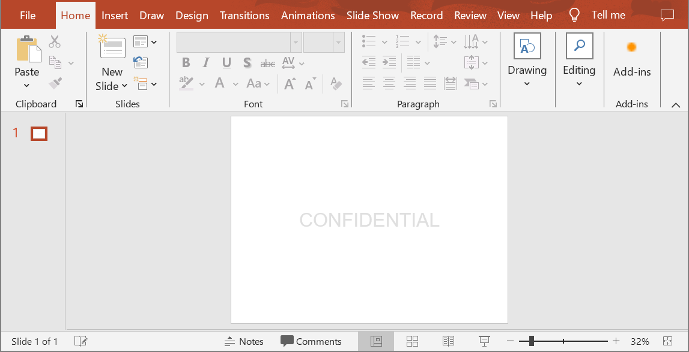

## **परिचय**

**एक वॉटरमार्क** प्रस्तुति में वह टेक्स्ट या इमेज स्टैम्प है जिसे स्लाइड पर या पूरी प्रस्तुति स्लाइड्स में उपयोग किया जाता है। आमतौर पर वॉटरमार्क का उपयोग यह दर्शाने के लिए किया जाता है कि प्रस्तुति ड्राफ्ट है (उदा., "Draft" वॉटरमार्क), इसमें गोपनीय जानकारी है (उदा., "Confidential" वॉटरमार्क), यह किस कंपनी की है (उदा., "Company Name" वॉटरमार्क), प्रस्तुति लेखक को पहचानने के लिए आदि। वॉटरमार्क यह संकेत देकर कॉपीराइट उल्लंघन को रोकने में मदद करता है कि प्रस्तुति को कॉपी नहीं किया जाना चाहिए। वॉटरमार्क PowerPoint और OpenOffice दोनों प्रस्तुति फ़ॉर्मेट में उपयोग किए जाते हैं। Aspose.Slides में आप PowerPoint PPT, PPTX और OpenOffice ODP फ़ॉर्मेट फ़ाइलों में वॉटरमार्क जोड़ सकते हैं।

[**Aspose.Slides**](https://products.aspose.com/slides/hi/cpp/) में PowerPoint या OpenOffice दस्तावेज़ों में वॉटरमार्क बनाने और उनके डिज़ाइन व व्यवहार को बदलने के कई तरीके हैं। सामान्य बात यह है कि टेक्स्ट वॉटरमार्क जोड़ने के लिए आपको [ITextFrame](https://reference.aspose.com/slides/hi/cpp/aspose.slides/itextframe/) इंटरफ़ेस का उपयोग करना चाहिए, और इमेज वॉटरमार्क जोड़ने के लिए [PictureFrame](https://reference.aspose.com/slides/hi/cpp/aspose.slides/pictureframe/) क्लास या वॉटरमार्क आकार को इमेज से भरना चाहिए। `PictureFrame` [IShape](https://reference.aspose.com/slides/hi/cpp/aspose.slides/ishape/) इंटरफ़ेस को लागू करता है, जिससे आप आकार ऑब्जेक्ट की सभी लचीली सेटिंग्स का उपयोग कर सकते हैं। चूँकि `ITextFrame` आकार नहीं है और इसकी सेटिंग्स सीमित हैं, इसे एक [IShape](https://reference.aspose.com/slides/hi/cpp/aspose.slides/ishape/) ऑब्जेक्ट में रैप किया जाता है।

वॉटरमार्क दो प्रकार से लागू किया जा सकता है: किसी एकल स्लाइड पर या सभी प्रस्तुति स्लाइड्स पर। सभी स्लाइड्स पर वॉटरमार्क लगाने के लिए स्लाइड मास्टर का उपयोग किया जाता है — वॉटरमार्क स्लाइड मास्टर में जोड़ा जाता है, वहाँ पूरी तरह से डिज़ाइन किया जाता है, और सभी स्लाइड्स पर लागू होता है बिना व्यक्तिगत स्लाइड्स पर वॉटरमार्क को संपादित करने की अनुमति को प्रभावित किए।

वॉटरमार्क आमतौर पर अन्य उपयोगकर्ताओं के लिए संपादन असमर्थ माना जाता है। वॉटरमार्क (या उसके पैरेंट आकार) को संपादित होने से रोकने के लिये Aspose.Slides आकार लॉक करने की सुविधा प्रदान करता है। किसी विशिष्ट आकार को सामान्य स्लाइड या स्लाइड मास्टर पर लॉक किया जा सकता है। जब स्लाइड मास्टर पर वॉटरमार्क आकार लॉक हो जाता है, तो वह सभी प्रस्तुति स्लाइड्स पर लॉक हो जाता है।

आप वॉटरमार्क का नाम सेट कर सकते हैं ताकि भविष्य में यदि आप इसे हटाना चाहें, तो स्लाइड के आकारों में नाम से इसे खोज सकें।

आप वॉटरमार्क को किसी भी तरीके से डिज़ाइन कर सकते हैं; हालांकि, वॉटरमार्क में आमतौर पर कुछ सामान्य विशेषताएँ होती हैं, जैसे केंद्र संरेखण, घुमाव, अग्रभूमि स्थिति आदि। हम नीचे उदाहरणों में इन्हें कैसे उपयोग करें, इस पर विचार करेंगे।

## **टेक्स्ट वॉटरमार्क**

### **स्लाइड में टेक्स्ट वॉटरमार्क जोड़ें**

PPT, PPTX या ODP में टेक्स्ट वॉटरमार्क जोड़ने के लिये, आप पहले स्लाइड में एक आकार जोड़ सकते हैं, फिर इस आकार में एक टेक्स्ट फ्रेम जोड़ें। टेक्स्ट फ्रेम को [ITextFrame](https://reference.aspose.com/slides/hi/cpp/aspose.slides/itextframe/) इंटरफ़ेस द्वारा दर्शाया जाता है। यह प्रकार [IShape](https://reference.aspose.com/slides/hi/cpp/aspose.slides/ishape/) से विरासत में नहीं मिला है, जिसके पास आकार को लचीली तरह से स्थित करने की विस्तृत प्रॉपर्टी सेट होती है। इसलिए, [ITextFrame](https://reference.aspose.com/slides/hi/cpp/aspose.slides/itextframe/) ऑब्जेक्ट को एक [IAutoShape](https://reference.aspose.com/slides/hi/cpp/aspose.slides/iautoshape/) ऑब्जेक्ट में रैप किया जाता है। आकार में वॉटरमार्क टेक्स्ट जोड़ने के लिये, नीचे दिखाए गए अनुसार [AddTextFrame](https://reference.aspose.com/slides/hi/cpp/aspose.slides/iautoshape/addtextframe/) मेथड का उपयोग करें।

```cpp
#include <DOM/IAutoShape.h>
#include <DOM/IShapeCollection.h>
#include <DOM/ISlide.h>
#include <DOM/Presentation.h>
#include <DOM/ShapeType.h>
#include <system/smart_ptr.h>
using namespace Aspose::Slides;
using namespace System;

auto watermarkText = u"CONFIDENTIAL";

auto presentation = MakeObject<Presentation>();
auto slide = presentation->get_Slide(0);

auto watermarkShape = slide->get_Shapes()->AddAutoShape(ShapeType::Rectangle, 100, 100, 400, 40);
auto watermarkFrame = watermarkShape->AddTextFrame(watermarkText);

presentation->Dispose();
```

{} 
- [How to Use the TextFrame Class](/slides/hi/cpp/text-formatting/)
{}

### **प्रस्तुति में टेक्स्ट वॉटरमार्क जोड़ें**

यदि आप पूरी प्रस्तुति (अर्थात् सभी स्लाइड्स) में टेक्स्ट वॉटरमार्क जोड़ना चाहते हैं, तो इसे [MasterSlide](https://reference.aspose.com/slides/hi/cpp/aspose.slides/masterslide/) में जोड़ें। बाकी लॉजिक एकल स्लाइड में वॉटरमार्क जोड़ने के समान है — एक [IAutoShape](https://reference.aspose.com/slides/hi/cpp/aspose.slides/iautoshape/) ऑब्जेक्ट बनाएँ और फिर [AddTextFrame](https://reference.aspose.com/slides/hi/cpp/aspose.slides/iautoshape/addtextframe/) मेथड का उपयोग करके वॉटरमार्क जोड़ें।

```cpp
#include <DOM/IAutoShape.h>
#include <DOM/IMasterSlide.h>
#include <DOM/IShapeCollection.h>
#include <DOM/Presentation.h>
#include <DOM/ShapeType.h>
#include <system/smart_ptr.h>
using namespace Aspose::Slides;
using namespace System;

auto watermarkText = u"CONFIDENTIAL";

auto presentation = MakeObject<Presentation>();
auto masterSlide = presentation->get_Master(0);

auto watermarkShape = masterSlide->get_Shapes()->AddAutoShape(ShapeType::Rectangle, 100, 100, 400, 40);
auto watermarkFrame = watermarkShape->AddTextFrame(watermarkText);

presentation->Dispose();
```

{} 
- [How to Use the Slide Master](/slides/hi/cpp/slide-master/)
{}

### **वॉटरमार्क आकार की पारदर्शिता सेट करें**

डिफ़ॉल्ट रूप से, आयताकार आकार को फिल और लाइन रंगों से शैलीबद्ध किया गया है। निम्नलिखित कोड लाइनों से आकार पारदर्शी हो जाता है।

```cpp
#include <DOM/FillType.h>
#include <DOM/IAutoShape.h>
#include <DOM/IFillFormat.h>
#include <DOM/ILineFillFormat.h>
#include <DOM/ILineFormat.h>
#include <DOM/IShapeCollection.h>
#include <DOM/ISlide.h>
#include <DOM/Presentation.h>
#include <DOM/ShapeType.h>
#include <system/smart_ptr.h>
using namespace Aspose::Slides;
using namespace System;

auto presentation = MakeObject<Presentation>();
auto slide = presentation->get_Slide(0);
auto watermarkShape = slide->get_Shapes()->AddAutoShape(ShapeType::Rectangle, 100, 100, 400, 40);

watermarkShape->get_FillFormat()->set_FillType(FillType::NoFill);
watermarkShape->get_LineFormat()->get_FillFormat()->set_FillType(FillType::NoFill);
```

### **टेक्स्ट वॉटरमार्क के लिए फ़ॉन्ट सेट करें**

आप नीचे दिखाए अनुसार टेक्स्ट वॉटरमार्क का फ़ॉन्ट बदल सकते हैं।

```cpp
#include <DOM/Fonts/FontData.h>
#include <DOM/IAutoShape.h>
#include <DOM/IParagraph.h>
#include <DOM/IParagraphFormat.h>
#include <DOM/IPortionFormat.h>
#include <DOM/IShapeCollection.h>
#include <DOM/ISlide.h>
#include <DOM/ITextFrame.h>
#include <DOM/Presentation.h>
#include <DOM/ShapeType.h>
#include <system/smart_ptr.h>
using namespace Aspose::Slides;
using namespace System;

auto presentation = MakeObject<Presentation>();
auto slide = presentation->get_Slide(0);
auto watermarkShape = slide->get_Shapes()->AddAutoShape(ShapeType::Rectangle, 100, 100, 400, 40);
auto watermarkFrame = watermarkShape->AddTextFrame(u"CONFIDENTIAL");

auto textFormat = watermarkFrame->get_Paragraph(0)->get_ParagraphFormat()->get_DefaultPortionFormat();
textFormat->set_LatinFont(MakeObject<FontData>(u"Arial"));
textFormat->set_FontHeight(50);
```

### **वॉटरमार्क टेक्स्ट का रंग सेट करें**

वॉटरमार्क टेक्स्ट का रंग सेट करने के लिये इस कोड का उपयोग करें:

```cpp
#include <DOM/FillType.h>
#include <DOM/IAutoShape.h>
#include <DOM/IColorFormat.h>
#include <DOM/IFillFormat.h>
#include <DOM/IParagraph.h>
#include <DOM/IParagraphFormat.h>
#include <DOM/IPortionFormat.h>
#include <DOM/IShapeCollection.h>
#include <DOM/ISlide.h>
#include <DOM/ITextFrame.h>
#include <DOM/Presentation.h>
#include <DOM/ShapeType.h>
#include <drawing/color.h>
#include <system/smart_ptr.h>
using namespace Aspose::Slides;
using namespace System;
using namespace System::Drawing;

auto presentation = MakeObject<Presentation>();
auto slide = presentation->get_Slide(0);
auto watermarkShape = slide->get_Shapes()->AddAutoShape(ShapeType::Rectangle, 100, 100, 400, 40);
auto watermarkFrame = watermarkShape->AddTextFrame(u"CONFIDENTIAL");

auto alpha = 150, red = 200, green = 200, blue = 200;

auto fillFormat = watermarkFrame->get_Paragraph(0)->get_ParagraphFormat()->get_DefaultPortionFormat()->get_FillFormat();
fillFormat->set_FillType(FillType::Solid);
fillFormat->get_SolidFillColor()->set_Color(Color::FromArgb(alpha, red, green, blue));
```

### **टेक्स्ट वॉटरमार्क को केंद्रित करें**

स्लाइड पर वॉटरमार्क को केंद्रित करना संभव है, इसके लिये आप निम्न करें:

```cpp
#include <DOM/IAutoShape.h>
#include <DOM/IShapeCollection.h>
#include <DOM/ISlide.h>
#include <DOM/ISlideSize.h>
#include <DOM/Presentation.h>
#include <DOM/ShapeType.h>
#include <drawing/size_f.h>
#include <system/smart_ptr.h>
using namespace Aspose::Slides;
using namespace System;

auto watermarkText = u"CONFIDENTIAL";

auto presentation = MakeObject<Presentation>();
auto slide = presentation->get_Slide(0);

auto slideSize = presentation->get_SlideSize()->get_Size();

auto watermarkWidth = 400;
auto watermarkHeight = 40;
auto watermarkX = (slideSize.get_Width() - watermarkWidth) / 2;
auto watermarkY = (slideSize.get_Height() - watermarkHeight) / 2;

auto watermarkShape = slide->get_Shapes()->AddAutoShape(
    ShapeType::Rectangle, watermarkX, watermarkY, watermarkWidth, watermarkHeight);

auto watermarkFrame = watermarkShape->AddTextFrame(watermarkText);
```

नीचे की छवि अंतिम परिणाम दर्शाती है।



## **इमेज वॉटरमार्क**

### **प्रस्तुति में इमेज वॉटरमार्क जोड़ें**

प्रस्तुति स्लाइड में इमेज वॉटरमार्क जोड़ने के लिये आप निम्न कर सकते हैं:

```cpp
#include <DOM/FillType.h>
#include <DOM/IAutoShape.h>
#include <DOM/IFillFormat.h>
#include <DOM/IImageCollection.h>
#include <DOM/IPPImage.h>
#include <DOM/IPictureFillFormat.h>
#include <DOM/ISlidesPicture.h>
#include <DOM/IShapeCollection.h>
#include <DOM/ISlide.h>
#include <DOM/PictureFillMode.h>
#include <DOM/Presentation.h>
#include <DOM/ShapeType.h>
#include <system/io/file.h>
#include <system/smart_ptr.h>
using namespace Aspose::Slides;
using namespace System;
using namespace System::IO;

auto presentation = MakeObject<Presentation>();
auto slide = presentation->get_Slide(0);
auto watermarkShape = slide->get_Shapes()->AddAutoShape(ShapeType::Rectangle, 100, 100, 400, 40);

auto imageStream = File::ReadAllBytes(u"watermark.png");
auto image = presentation->get_Images()->AddImage(imageStream);

watermarkShape->get_FillFormat()->set_FillType(FillType::Picture);
watermarkShape->get_FillFormat()->get_PictureFillFormat()->get_Picture()->set_Image(image);
watermarkShape->get_FillFormat()->get_PictureFillFormat()->set_PictureFillMode(PictureFillMode::Stretch);
```

## **वॉटरमार्क को संपादन से लॉक करें**

यदि वॉटरमार्क को संपादित होने से रोकना आवश्यक हो, तो आकार पर [IAutoShape::get_AutoShapeLock](https://reference.aspose.com/slides/hi/cpp/aspose.slides/iautoshape/get_autoshapelock/) मेथड का उपयोग करें। इस प्रॉपर्टी के साथ आप आकार को चयन, आकार बदलने, स्थान बदलने, अन्य तत्वों के साथ समूह बनाना, उसके टेक्स्ट को संपादन से लॉक करना आदि से बचा सकते हैं:

```cpp
#include <DOM/IAutoShape.h>
#include <DOM/IAutoShapeLock.h>
#include <DOM/IShapeCollection.h>
#include <DOM/ISlide.h>
#include <DOM/Presentation.h>
#include <DOM/ShapeType.h>
#include <system/smart_ptr.h>
using namespace Aspose::Slides;
using namespace System;

auto presentation = MakeObject<Presentation>();
auto slide = presentation->get_Slide(0);
auto watermarkShape = slide->get_Shapes()->AddAutoShape(ShapeType::Rectangle, 100, 100, 400, 40);

// वॉटरमार्क आकार को संशोधित करने से रोकें
watermarkShape->get_AutoShapeLock()->set_SelectLocked(true);
watermarkShape->get_AutoShapeLock()->set_SizeLocked(true);
watermarkShape->get_AutoShapeLock()->set_TextLocked(true);
watermarkShape->get_AutoShapeLock()->set_PositionLocked(true);
watermarkShape->get_AutoShapeLock()->set_GroupingLocked(true);
```

## **वॉटरमार्क को अग्रभूमि में लाएँ**

Aspose.Slides में आकारों का Z‑order [IShapeCollection::Reorder](https://reference.aspose.com/slides/hi/cpp/aspose.slides/ishapecollection/reorder/) मेथड से सेट किया जा सकता है। ऐसा करने के लिये आप प्रस्तुति स्लाइड्स सूची से इस मेथड को कॉल करें और आकार रेफ़रेंस तथा उसका क्रम संख्या पास करें। इस प्रकार आप आकार को अग्रभूमि में लाकर या पीछे भेजकर स्लाइड पर वॉटरमार्क को उचित स्थान पर रख सकते हैं:

```cpp
#include <DOM/IAutoShape.h>
#include <DOM/IShapeCollection.h>
#include <DOM/ISlide.h>
#include <DOM/Presentation.h>
#include <DOM/ShapeType.h>
#include <system/smart_ptr.h>
using namespace Aspose::Slides;
using namespace System;

auto presentation = MakeObject<Presentation>();
auto slide = presentation->get_Slide(0);
auto watermarkShape = slide->get_Shapes()->AddAutoShape(ShapeType::Rectangle, 100, 100, 400, 40);

auto shapeCount = slide->get_Shapes()->get_Count();
slide->get_Shapes()->Reorder(shapeCount - 1, watermarkShape);
```

## **वॉटरमार्क घुर्नन सेट करें**

नीचे कोड उदाहरण है कि कैसे वॉटरमार्क का घुर्नन समायोजित करके उसे स्लाइड पर तिरछा स्थित किया जाए:

```cpp
#include <DOM/IAutoShape.h>
#include <DOM/IShapeCollection.h>
#include <DOM/ISlide.h>
#include <DOM/ISlideSize.h>
#include <DOM/Presentation.h>
#include <DOM/ShapeType.h>
#include <drawing/size_f.h>
#include <system/math.h>
#include <system/smart_ptr.h>
using namespace Aspose::Slides;
using namespace System;

auto presentation = MakeObject<Presentation>();
auto slide = presentation->get_Slide(0);
auto watermarkShape = slide->get_Shapes()->AddAutoShape(ShapeType::Rectangle, 100, 100, 400, 40);
auto slideSize = presentation->get_SlideSize()->get_Size();

auto diagonalAngle = Math::Atan((slideSize.get_Height() / slideSize.get_Width())) * 180 / Math::PI;

watermarkShape->set_Rotation((float)diagonalAngle);
```

## **वॉटरमार्क के लिये नाम सेट करें**

Aspose.Slides आपको आकार का नाम सेट करने की अनुमति देता है। आकार नाम का उपयोग करके आप भविष्य में उसे संशोधित या हटाने के लिये एक्सेस कर सकते हैं। वॉटरमार्क आकार का नाम सेट करने के लिये इसे [IAutoShape::set_Name](https://reference.aspose.com/slides/hi/cpp/aspose.slides/ishape/set_name/) मेथड में असाइन करें:

```cpp
#include <DOM/IAutoShape.h>
#include <DOM/IShapeCollection.h>
#include <DOM/ISlide.h>
#include <DOM/Presentation.h>
#include <DOM/ShapeType.h>
#include <system/smart_ptr.h>
using namespace Aspose::Slides;
using namespace System;

auto presentation = MakeObject<Presentation>();
auto slide = presentation->get_Slide(0);
auto watermarkShape = slide->get_Shapes()->AddAutoShape(ShapeType::Rectangle, 100, 100, 400, 40);

watermarkShape->set_Name(u"watermark");
```

## **वॉटरमार्क हटाएँ**

वॉटरमार्क आकार को हटाने के लिये, पहले [IAutoShape::get_Name](https://reference.aspose.com/slides/hi/cpp/aspose.slides/ishape/get_name/) मेथड से उसे स्लाइड आकारों में खोजें। फिर वॉटरमार्क आकार को [IShapeCollection::Remove](https://reference.aspose.com/slides/hi/cpp/aspose.slides/ishapecollection/remove/) मेथड में पास करके हटाएँ:

```cpp
#include <DOM/IShape.h>
#include <DOM/IShapeCollection.h>
#include <DOM/ISlide.h>
#include <DOM/Presentation.h>
#include <system/smart_ptr.h>
#include <system/string.h>
#include <system/string_comparison.h>
using namespace Aspose::Slides;
using namespace System;

auto presentation = MakeObject<Presentation>(u"presentation_with_watermark.pptx");
auto slide = presentation->get_Slide(0);

auto slideShapes = slide->get_Shapes()->ToArray();
for(auto shape : slideShapes)
{
    if (String::Compare(shape->get_Name(), u"watermark", StringComparison::Ordinal) == 0)
    {
        slide->get_Shapes()->Remove(shape);
    }
}
```

## **एक लाइव उदाहरण**

आप **Aspose.Slides free** [Add Watermark](https://products.aspose.app/slides/hi/watermark) और [Remove Watermark](https://products.aspose.app/slides/hi/watermark/remove-watermark) ऑनलाइन टूल देख सकते हैं।


## **अक्सर पूछे जाने वाले प्रश्न**

### वॉटरमार्क क्या है और मैं इसे क्यों प्रयोग करूँ?

वॉटरमार्क टेक्स्ट या इमेज ओवरले है जो स्लाइड्स पर लागू किया जाता है और बौद्धिक संपदा को सुरक्षित करने, ब्रांड पहचान बढ़ाने या अनधिकृत प्रस्तुति उपयोग से रोकने में मदद करता है।

### क्या मैं प्रस्तुति की सभी स्लाइड्स में वॉटरमार्क जोड़ सकता हूँ?

हाँ, Aspose.Slides आपको प्रोग्रामेटिकली प्रत्येक स्लाइड में वॉटरमार्क जोड़ने की सुविधा देता है। आप सभी स्लाइड्स पर इटरেট करके वॉटरमार्क सेटिंग्स को व्यक्तिगत रूप से लागू कर सकते हैं।

### मैं वॉटरमार्क की पारदर्शिता कैसे समायोजित करूँ?

आप आकार की फिल सेटिंग्स ([FillFormat](https://reference.aspose.com/slides/hi/cpp/aspose.slides/shape/get_fillformat/)) को बदलकर वॉटरमार्क की पारदर्शिता समायोजित कर सकते हैं। इस प्रकार वॉटरमार्क सूक्ष्म रहता है और स्लाइड सामग्री से ध्यान नहीं हटाता।

### वॉटरमार्क के लिये कौन‑से इमेज फ़ॉर्मेट समर्थित हैं?

Aspose.Slides PNG, JPEG, GIF, BMP, SVG आदि सहित विभिन्न इमेज फ़ॉर्मेट को सपोर्ट करता है।

### क्या मैं टेक्स्ट वॉटरमार्क के फ़ॉन्ट और स्टाइल को कस्टमाइज़ कर सकता हूँ?

हाँ, आप कोई भी फ़ॉन्ट, आकार और स्टाइल चुन सकते हैं जिससे वह आपकी प्रस्तुति के डिज़ाइन और ब्रांड संगतता से मेल खाए।

### मैं वॉटरमार्क की स्थिति या अभिविन्यास कैसे बदलूँ?

आप प्रोग्रामेटिकली आकार के निर्देशांक, आकार और घुर्नन प्रॉपर्टीज़ को बदलकर वॉटरमार्क की स्थिति और अभिविन्यास समायोजित कर सकते हैं।