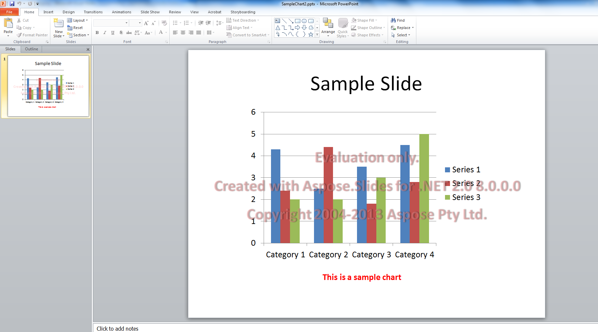

## **Aspose.Slides मूल्यांकन**

आप आसानी से Aspose.Slides का मूल्यांकन हेतु डाउनलोड कर सकते हैं। मूल्यांकन डाउनलोड वही है जो खरीदे गए डाउनलोड के समान है। मूल्यांकन संस्करण को केवल कुछ पंक्तियों का कोड जोड़कर लाइसेंस लागू करने पर लाइसेंस प्राप्त बना दिया जाता है।

Aspose.Slides का मूल्यांकन संस्करण (बिना किसी लाइसेंस के निर्दिष्ट) पूरी उत्पाद कार्यक्षमता प्रदान करता है, लेकिन यह दस्तावेज़ को खोलने और सहेजने पर शीर्ष पर मूल्यांकन वॉटरमार्क जोड़ता है, और प्रस्तुति स्लाइड्स से पाठ निकालते समय केवल एक स्लाइड तक सीमित रहता है।

{}

यदि आप Aspose.Slides को मूल्यांकन संस्करण की सीमाओं के बिना परीक्षण करना चाहते हैं, तो आप 30‑दिन का टेम्पररी लाइसेंस भी मांग सकते हैं। कृपया देखें [टेम्पररी लाइसेंस कैसे प्राप्त करें?](https://purchase.aspose.com/temporary-license)

{}

## **अक्सर पूछे जाने वाले प्रश्न**

**क्या मैं मूल्यांकन मोड में विभिन्न थ्रेड्स पर समानांतर कई प्रस्तुतियों का परीक्षण कर सकता हूँ?**

हाँ। आप विभिन्न दस्तावेज़ों को समानांतर में प्रोसेस कर सकते हैं; आपको समान प्रस्तुति वस्तु को [थ्रेड्स के बीच](/slides/hi/cpp/multithreading/) में साझा नहीं करना चाहिए। मूल्यांकन मोड इसका प्रभाव नहीं डालता।

**क्या मुझे सर्वर या CI पर लाइब्रेरी का मूल्यांकन करने के लिए Microsoft PowerPoint स्थापित करना आवश्यक है?**

नहीं। Aspose.Slides एक स्वतंत्र इंजन है और इसे मूल्यांकन या प्रोडक्शन दोनों के लिए PowerPoint स्थापित करने की आवश्यकता नहीं होती।

**क्या मैं मूल्यांकन मोड में PPT/PPTX को PDF और इमेजेज़ में रूपांतरण का पूर्ण परीक्षण कर सकता हूँ?**

हाँ। [कनवर्टर्स](/slides/hi/cpp/convert-presentation/) काम करते हैं; आउटपुट में वॉटरमार्क शामिल होगा।

**क्या मैं लोड परीक्षण के लिए वॉटरमार्क के बिना टेम्पररी लाइसेंस उपयोग कर सकता हूँ?**

हाँ। 30‑दिन का टेम्पररी लाइसेंस मूल्यांकन‑मोड की सीमाओं को हटा देता है और वॉटरमार्क के बिना परीक्षण करने की अनुमति देता है।