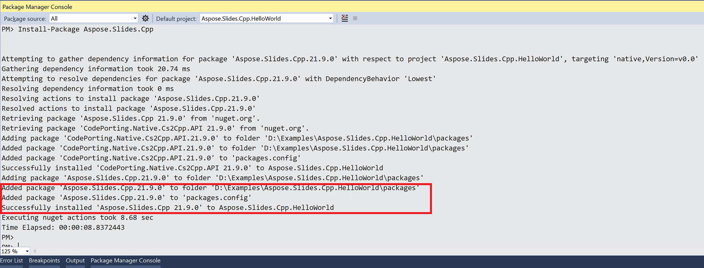

## **समग्र अवलोकन**

यह लेख विंडोज़ पर Aspose.Slides को स्थापित करने की विधि समझाता है। यह NuGet-आधारित स्थापना पर केंद्रित है और दिखाता है कि लाइब्रेरी को Visual Studio प्रोजेक्ट में NuGet पैकेज मैनेजर या पैकेज मैनेजर कंसोल के माध्यम से कैसे जोड़ा जाए। यह पैकेज को अपडेट करने और आवश्यक होने पर प्री‑रिलीज़ बिल्ड स्थापित करने के बारे में भी बताता है।

## **विंडोज**
NuGet PCs पर C++ के लिए Aspose APIs को डाउनलोड और स्थापित करने का सबसे आसान मार्ग प्रदान करता है। 

### **विकल्प एक: NuGet पैकेज मैनेजर से Aspose.Slides for C++ स्थापित या अपडेट करें**

1. Microsoft Visual Studio खोलें।  
2. एक साधारण कंसोल एप बनाएँ। या आप अपना पसंदीदा प्रोजेक्ट खोल सकते हैं।  
3. **Tools** > **NuGet package manager** पर जाएँ।  
4. **Browse** के तहत, टेक्स्ट फ़ील्ड में *Aspose.Slides.Cpp* टाइप करें।  

3. आवश्यक संस्करण के **Aspose.Slides.Cpp** पर क्लिक करें और फिर **Install** पर क्लिक करें।  
   * यदि आप Aspose.Slides को अपडेट करना चाहते हैं—जिसका अर्थ है कि वह पहले से स्थापित है—तो **Update** पर क्लिक करें।  

चयनित API डाउनलोड होकर आपके प्रोजेक्ट में संदर्भित हो जाएगा।

### **विकल्प 2: पैकेज मैनेजर कंसोल के माध्यम से Aspose.Slides स्थापित या अपडेट करें**

पैकेज मैनेजर कंसोल का उपयोग करके [Aspose.Slides API](https://www.nuget.org/packages/Aspose.Slides.Cpp/) का संदर्भ जोड़ने के लिए यह करें:

1. Visual Studio में अपना समाधान/प्रोजेक्ट खोलें।  

1. **Tools** > **NuGet Package Manager** > **Package Manager Console** पर जाएँ।  

   पैकेज मैनेजर कंसोल खुल जाएगा।  

4. यह कमांड टाइप करें: `Install-Package Aspose.Slides.Cpp`  
> यदि आप x86 संस्करण स्थापित करना चाहते हैं, तो Aspose.Slides.Cpp.x86 पैकेज का उपयोग करें: `Install-Package Aspose.Slides.Cpp.x86`

5. Enter कुंजी दबाएँ।

   नवीनतम पूर्ण रिलीज़ आपके अनुप्रयोग में स्थापित हो जाएगा।  

   * वैकल्पिक रूप से, आप कमांड में `-prerelease` उपसर्ग जोड़ कर यह निर्दिष्ट कर सकते हैं कि नवीनतम रिलीज़ (हॉਟफ़िक्स सहित) भी स्थापित हो।  

​	डाउनलोड समाप्त होने पर आपको कुछ पुष्टि संदेश दिखेंगे।  

यदि आप [Aspose EULA](https://about.aspose.com/legal/eula) से परिचित नहीं हैं, तो आप URL में उल्लिखित लाइसेंस पढ़ना चाहेंगे।  

पैकेज मैनेजर कंसोल में, आप `Update-Package Aspose.Slides.Cpp` कमांड चलाकर Aspose.Slides पैकेज के अपडेट की जाँच कर सकते हैं। अपडेट (यदि मिलें) स्वतः स्थापित हो जाते हैं। आप `-prerelease` उपसर्ग का उपयोग करके नवीनतम रिलीज़ को भी अपडेट कर सकते हैं।

### **Include और lib फ़ोल्डरों का उपयोग**
1. [Download](https://downloads.aspose.com/slides/hi/cpp) करें नवीनतम Aspose.Slides for C++ संस्करण।  
1. फ़ोल्डर को उत्पादन वातावरण में अनज़िप करें।  
1. Aspose.Slides for C++ का उपयोग करने के लिए, अपने प्रोजेक्ट में Include और lib फ़ोल्डरों को संदर्भित करें  

## **FAQ**

**क्या कोई मुफ्त संस्करण या ट्रायल प्रतिबंध है?**

हाँ, डिफ़ॉल्ट रूप से Aspose.Slides मूल्यांकन मोड में चलता है, जिसमें वॉटरमार्क होते हैं और अन्य प्रतिबंध हो सकते हैं। प्रतिबंध हटाने के लिए आपको एक वैध [license](/slides/hi/cpp/licensing/) लागू करना होगा।