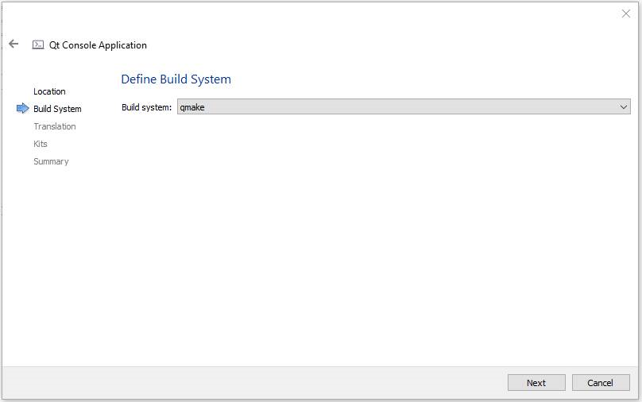
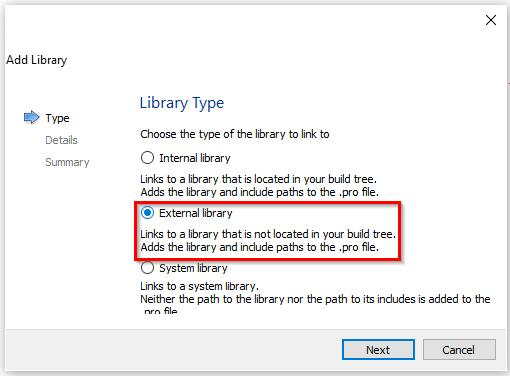

## **परिचय**

Qt एक C++ आधारित क्रॉस‑प्लेटफ़ॉर्म एप्लिकेशन विकास फ्रेमवर्क है, जिसका व्यापक उपयोग डेस्कटॉप, मोबाइल और एम्बेडेड सिस्टम एप्लिकेशन विकसित करने के लिए किया जाता है। Aspose.Slides for C++ को Qt के भीतर एकीकृत किया जा सकता है ताकि आप अपने Qt एप्लिकेशन में PowerPoint दस्तावेज़ बना और संशोधित कर सकें।

## **Qt Creator के भीतर Aspose.Slides for C++ का उपयोग**

Aspose.Slides for C++ का उपयोग अपने Qt एप्लिकेशन में करने के लिए, API का नवीनतम संस्करण [downloads](https://downloads.aspose.com/slides/hi/cpp) अनुभाग से डाउनलोड करें। एक बार API डाउनलोड हो जाने के बाद, आप C++ लाइब्रेरी को Qt Creator या Visual Studio में एकीकृत कर सकते हैं।

Qt Creator में विकसित एक Qt Console Application के भीतर Aspose.Slides for C++ लाइब्रेरी को एकीकृत और उपयोग करने के लिए, नीचे दिए गए चरणों का पालन करें:

- Qt Creator खोलें और एक नया *Qt Console Application* बनाएं।

- *Build System* ड्रॉपडाउन सूची से QMake विकल्प चुनें।

- उपयुक्त किट चुनें और विज़ार्ड समाप्त करें।

- Aspose.Slides for C++ के एक्सट्रैक्टेड पैकेज से aspose-slides-cpp-21.02 फ़ोल्डर को प्रोजेक्ट की रूट में कॉपी करें।

- lib और include फ़ोल्डरों के पथ जोड़ने के लिए, बाएँ पैनल में प्रोजेक्ट पर राइट‑क्लिक करें और *Add Library* चुनें।

- External Library विकल्प चुनें और lib फ़ोल्डरों के पथ एक‑एक करके ब्राउज़ करें।

- जब यह हो जाए, आपका .pro प्रोजेक्ट फ़ाइल निम्नलिखित एंट्रीज़ रखेगा:

- एप्लिकेशन को बिल्ड करें और एकीकरण पूर्ण हो गया है।  

{}
ध्यान दें: अधिक जानकारी के लिए [पूर्ण डेमो प्रोजेक्ट](https://github.com/aspose-slides/Aspose.Slides-for-C/tree/master/QtDemos/QtCreator/Qt_AsposeSlides_QMake) देखें।
{}

## **Visual Studio में Qt एप्लिकेशन्स के भीतर Aspose.Slides for C++ का उपयोग**

Visual Studio का उपयोग करके Qt एप्लिकेशन विकसित करने के लिए, आपको [Qt Visual Studio Tools](https://marketplace.visualstudio.com/items?itemName=TheQtCompany.QtVisualStudioTools-19123) स्थापित करने की आवश्यकता है। स्थापना होने के बाद, API का नवीनतम संस्करण [downloads](https://downloads.aspose.com/slides/hi/cpp) अनुभाग से डाउनलोड करें और नीचे दिए गए चरणों का पालन करें:

- Microsoft Visual Studio खोलें और एक नया *Qt Console Application* बनाएं।

- उपयुक्त किट चुनें और विज़ार्ड समाप्त करें।

- Aspose.Slides for C++ लाइब्रेरी को एकीकृत और उपयोग करने के लिए, प्रोजेक्ट पर राइट‑क्लिक करें और *Manage NuGet Packages...* चुनें।

- आवश्यक *Aspose.Slides.Cpp* पैकेज खोजें और इंस्टॉल करें।

- प्रोजेक्ट को बिल्ड करें और एकीकरण पूर्ण हो गया है।  

{}
ध्यान दें: अधिक जानकारी के लिए [पूर्ण डेमो प्रोजेक्ट](https://github.com/aspose-slides/Aspose.Slides-for-C/tree/master/QtDemos/Visual%20Studio/Qt_AsposeSlides_VS) देखें।
{}