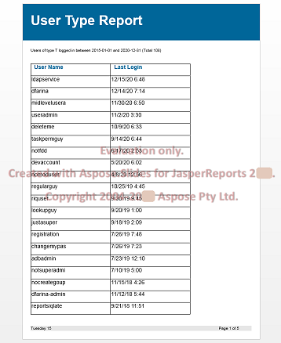

{}

JasperReports और JasperServer में रिपोर्टों को Microsoft PowerPoint प्रस्तुतियों के रूप में निर्यात करने की अंतर्निहित क्षमता नहीं है, लेकिन Aspose.Slides for JasperReports के साथ, आप अतिरिक्त निर्यात स्वरूपों तक पहुंच प्राप्त कर सकते हैं:

- Microsoft PowerPoint Presentation (PPT)
- Microsoft PowerPoint Presentation (PPTX)
- HTML
- PDF

{}

इन स्वरूपों में दस्तावेज़ बनाने के लिए, Aspose.Slides for JasperReports बिल्ट-इन संस्करण के [Aspose.Slides for Java](https://products.aspose.com/slides/hi/java/) पर निर्भर करता है, जो Aspose की बाजार में अग्रणी प्रस्तुति-प्रसंस्करण लाइब्रेरी है। दस्तावेज़ उत्पन्न करने में Microsoft PowerPoint का उपयोग नहीं किया जाता।

**Microsoft PowerPoint (PPT) प्रस्तुतिकरण के रूप में निर्यात किया गया एक नमूना रिपोर्ट**

**Microsoft PowerPoint प्रस्तुति (PPTX) के रूप में निर्यात किया गया एक नमूना रिपोर्ट**

