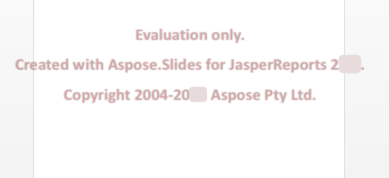

{}

Aspose.Slides for JasperReports एक मुफ्त, समय-अपरिमित मूल्यांकन रूप में [download page](https://releases.aspose.com/slides/jasperreport/) से उपलब्ध है। मूल्यांकन और लाइसेंस प्राप्त संस्करण उत्पाद के एक ही डाउनलोड हैं।

जब आप मूल्यांकन से संतुष्ट हों, तो [लाइसेंस खरीदें](https://purchase.aspose.com/pricing/slides/jasperreports/) करें। सुनिश्चित करें कि आप सब्सक्रिप्शन शर्तों को समझते हैं और सहमत हैं।

ऑर्डर पेज से भुगतान पूरा होने के बाद लाइसेंस डाउनलोड करने के लिए उपलब्ध होता है। लाइसेंस एक स्पष्ट पाठ, डिजिटल रूप से हस्ताक्षरित XML फ़ाइल है जिसमें क्लाइंट का नाम, खरीदा गया उत्पाद और लाइसेंस प्रकार जैसी जानकारी होती है। लाइसेंस फ़ाइल की सामग्री को किसी भी तरह संशोधित न करें: ऐसा करने से लाइसेंस अमान्य हो जाएगा।

लाइसेंस को अपने कंप्यूटर पर डाउनलोड करें और इसे उचित फ़ोल्डर में कॉपी करें (उदाहरण के लिए आपके एप्लिकेशन फ़ोल्डर या **JasperReports\lib**)।

{}

## **मूल्यांकन संस्करण प्रतिबंध**
Aspose.Slides for JasperReports का मूल्यांकन संस्करण (बिना निर्दिष्ट लाइसेंस के) रिपोर्ट का हर पृष्ठ निर्यात करता है, लेकिन यह प्रत्येक स्लाइड या पृष्ठ के केंद्र में एक मूल्यांकन वॉटरमार्क लगाता है, सभी चार आउटपुट फ़ॉर्मेट (PPT, PPTX, PDF और HTML) में, जैसा कि नीचे चित्र में दिखाया गया है। अधिक विवरण के लिए देखें [Aspose.Slides का मूल्यांकन](/slides/hi/jasperreports/evaluate-aspose-slides/)।



## **लाइसेंस लागू करना**
लाइसेंस लागू करने के कई तरीके हैं, यह इस बात पर निर्भर करता है कि आप JasperReports पर काम कर रहे हैं या JasperServer पर।

### **JasperReports के लिए लाइसेंस लागू करना**
`License` क्लास की `setLicense` मेथड को लाइसेंस फ़ाइल को पढ़ने वाली स्ट्रीम के साथ कॉल करें, जैसे Aspose.Slides for Java में:

```java
import java.io.FileInputStream;

import com.aspose.slides.jasperreports.License;

public class ApplyLicense {
    public static void main(String[] args) {
        try {
            // लाइसेंस फ़ाइल को शामिल करने वाला स्ट्रीम ऑब्जेक्ट बनाएँ।
            FileInputStream fstream = new FileInputStream("Aspose.Slides.JasperReports.Developer.lic");

            // License क्लास का उदाहरण बनाएँ।
            License license = new License();

            // स्ट्रीम ऑब्जेक्ट के माध्यम से लाइसेंस सेट करें।
            license.setLicense(fstream);
        } catch (Exception ex) {
            System.out.println(ex.toString());
        }
    }
}
```

या, लाइसेंस फ़ाइल का पथ `ASExporterParameters.PPT_LICENSE` पैरामीटर में एक्सपोर्टर को पास करें। इस अंश में, `jasperPrint` एक भरा हुआ रिपोर्ट है, जैसा कि [आपका पहला निर्यात](/slides/hi/jasperreports/#your-first-export) में है:

```java
ASPptExporter exporter = new ASPptExporter();
exporter.setParameter(JRExporterParameter.JASPER_PRINT, jasperPrint);
exporter.setParameter(JRExporterParameter.OUTPUT_FILE_NAME, "report.ppt");
exporter.setParameter(ASExporterParameters.PPT_LICENSE, "Aspose.Slides.JasperReports.Developer.lic");
exporter.exportReport();
```

### **JasperServer पर लाइसेंस लागू करना**
*applicationContext.xml* में `pptExportParameters` बीन की `licenseFile` प्रॉपर्टी को लाइसेंस फ़ाइल के पथ पर सेट करें, जैसा कि [JasperServer के साथ एकीकरण](/slides/hi/jasperreports/integration-with-jasperserver/#set-font-mapping-and-the-license) में दिखाया गया है।