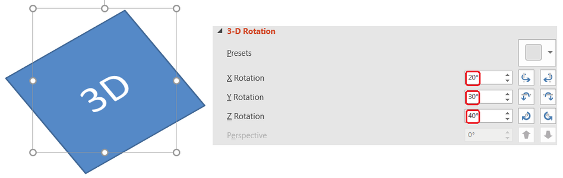

## **अवलोकन**

Aspose.Slides for Java आकारों और पाठ के लिए PowerPoint‑शैली के 3D स्वरूपण को बनाना, संपादित करना, संरक्षित करना और रेंडर करना सक्षम करता है। यह लेख घूर्णन, एक्सट्रूज़न, बेवेल, प्रकाश, सामग्री, ग्रेडिएंट या चित्र भराव, और 3D पाठ जैसे 3D प्रभावों को कवर करता है।

{}
यह लेख PowerPoint आकारों और पाठ पर 3D स्वरूपण प्रभावों के बारे में है। यह स्वतंत्र 3D मॉडल फ़ाइलों डालने या संपादित करने के बारे में नहीं है। जब आप किसी स्लाइड को छवि, PDF, या HTML में निर्यात करते हैं, तो Aspose.Slides इन 3D प्रभावों को निर्यातित 2D आउटपुट में रेंडर करता है।
{}

## **3D स्वरूपण अवधारणाएँ**

[IShape](https://reference.aspose.com/slides/hi/java/com.aspose.slides/ishape/).`getThreeDFormat()` का उपयोग करके आप किसी आकार पर 3D स्वरूपण लागू कर सकते हैं। लौटाया गया स्वरूप ऑब्जेक्ट उस आकार के लिए 3D दृश्य को नियंत्रित करता है।

पाठ के लिए, [ITextFrameFormat](https://reference.aspose.com/slides/hi/java/com.aspose.slides/itextframeformat/).`getThreeDFormat()` का उपयोग करें। यह आकार के बॉडी के बजाय टेक्स्ट फ़्रेम पर 3D स्वरूपण लागू करता है।

सबसे महत्वपूर्ण API सदस्य हैं:

| API सदस्य | यह क्या नियंत्रित करता है | इसे कब उपयोग करें |
|---|---|---|
| [getCamera](https://reference.aspose.com/slides/hi/java/com.aspose.slides/ithreedformat/#getCamera--) | दृश्य बिंदु, प्रीसेट कैमरा प्रकार, घूर्णन, ज़ूम, और परिप्रेक्ष्य। | वस्तु को 3D स्थान में घुमाने या PowerPoint के 3D घूर्णन प्रीसेट से मिलाने के लिए। |
| [getLightRig](https://reference.aspose.com/slides/hi/java/com.aspose.slides/ithreedformat/#getLightRig--) | प्रकाश प्रीसेट, दिशा, और प्रकाश घूर्णन। | 3D सतह पर हाइलाइट और छाया के दिखावट को बदलने के लिए। |
| [getMaterial](https://reference.aspose.com/slides/hi/java/com.aspose.slides/ithreedformat/#getMaterial--) और [setMaterial](https://reference.aspose.com/slides/hi/java/com.aspose.slides/ithreedformat/#setMaterial-int-) | सतह सामग्री, जैसे समतल, मैट, प्लास्टिक, या धातु। | समान ज्यामिति को अधिक समतल, मुलायम, चमकदार, या धात्विक दिखाने के लिए। |
| [getExtrusionHeight](https://reference.aspose.com/slides/hi/java/com.aspose.slides/ithreedformat/#getExtrusionHeight--) और [setExtrusionHeight](https://reference.aspose.com/slides/hi/java/com.aspose.slides/ithreedformat/#setExtrusionHeight-double-) | आकार अपने सामने के चेहरे से पीछे कितनी दूरी तक विस्तारित होता है। | एक समतल आकार को दृश्य रूप से मोटे 3D ऑब्जेक्ट में बदलने के लिए। |
| [getExtrusionColor](https://reference.aspose.com/slides/hi/java/com.aspose.slides/ithreedformat/#getExtrusionColor--) | एक्सट्रूडेड किनारों का रंग। | गहराई को दिखाने या किनारे के रंग को सामने की फ़िल के साथ समन्वयित करने के लिए। |
| [getDepth](https://reference.aspose.com/slides/hi/java/com.aspose.slides/ithreedformat/#getDepth--) और [setDepth](https://reference.aspose.com/slides/hi/java/com.aspose.slides/ithreedformat/#setDepth-double-) | PowerPoint 3D स्वरूपण द्वारा उपयोग किया गया अतिरिक्त 3D गहराई। | आकार या पाठ के लिए गहराई को सूक्ष्म रूप से ट्यून करने के लिए, विशेषकर बेवेल और सामग्री सेटिंग के साथ। |
| [getBevelTop](https://reference.aspose.com/slides/hi/java/com.aspose.slides/ithreedformat/#getBevelTop--) और [getBevelBottom](https://reference.aspose.com/slides/hi/java/com.aspose.slides/ithreedformat/#getBevelBottom--) | सामने और पीछे के चेहरों पर उठे हुए या गोलाकार किनारे। | तीखा समतल चेहरा होने के बजाय मुलायम या ढलाईदार किनारा जोड़ने के लिए। |
| [getContourColor](https://reference.aspose.com/slides/hi/java/com.aspose.slides/ithreedformat/#getContourColor--), [getContourWidth](https://reference.aspose.com/slides/hi/java/com.aspose.slides/ithreedformat/#getContourWidth--), और [setContourWidth](https://reference.aspose.com/slides/hi/java/com.aspose.slides/ithreedformat/#setContourWidth-double-) | 3D ऑब्जेक्ट के चारों ओर रूपरेखा। | रेंडर किए गए आउटपुट में ऑब्जेक्ट की सीमा को उजागर करने के लिए। |

## **3D आकार बनाएं**

एक आकार को विश्वसनीय 3D दिखाने के लिए आमतौर पर चार प्रकार की सेटिंग्स की आवश्यकता होती है:

- कैमरा सेटिंग्स, क्योंकि डिफ़ॉल्ट सामने का दृश्य एक्सट्रूज़न को छिपा सकता है।
- प्रकाश सेटिंग्स, क्योंकि प्रकाश चेहरे और किनारों को पढ़ने योग्य बनाता है।
- सामग्री सेटिंग्स, क्योंकि सतह यह निर्धारित करती है कि प्रकाश कैसे रेंडर होता है।
- एक्सट्रूज़न या गहराई सेटिंग्स, क्योंकि समतल आकार को मोटाई चाहिए।

निम्न उदाहरण एक आयत बनाता है, उसके सामने के चेहरे पर पाठ जोड़ता है, 3D स्वरूपण लागू करता है, प्रस्तुति को PPTX के रूप में सहेजता है, और स्लाइड को PNG छवि में रेंडर करता है।

```java
final float imageScale = 2;

Presentation presentation = new Presentation();
try {
    ISlide slide = presentation.getSlides().get_Item(0);
    IAutoShape shape = slide.getShapes().addAutoShape(ShapeType.Rectangle, 200, 150, 200, 200);
    shape.getTextFrame().setText("3D");
    shape.getTextFrame().getParagraphs().get_Item(0).getParagraphFormat().getDefaultPortionFormat().setFontHeight(64);

    shape.getFillFormat().setFillType(FillType.Solid);
    shape.getFillFormat().getSolidFillColor().setColor(Color.BLUE);

    shape.getThreeDFormat().getCamera().setCameraType(CameraPresetType.OrthographicFront);
    shape.getThreeDFormat().getCamera().setRotation(20, 30, 40);
    shape.getThreeDFormat().getLightRig().setLightType(LightRigPresetType.Flat);
    shape.getThreeDFormat().getLightRig().setDirection(LightingDirection.Top);
    shape.getThreeDFormat().setMaterial(MaterialPresetType.Flat);
    shape.getThreeDFormat().setExtrusionHeight(100);
    shape.getThreeDFormat().getExtrusionColor().setColor(Color.BLUE);

    IImage thumbnail = slide.getImage(imageScale, imageScale);
    try {
        thumbnail.save("shape_3d.png", ImageFormat.Png);
    } finally {
        thumbnail.dispose();
    }

    presentation.save("shape_3d.pptx", SaveFormat.Pptx);
} finally {
    presentation.dispose();
}
```

रेंडर किया गया स्लाइड चित्र आयत को मोटे 3D ब्लॉक के रूप में दिखाता है:


## **कैमरा के साथ आकार को घुमाएं**

PowerPoint में, 3D घूर्णन **3‑D Rotation** पैन से कॉन्फ़िगर किया जाता है। X, Y, और Z घूर्णन मान कैमरा API के माध्यम से सेट किए गए घूर्णन के अनुरूप होते हैं।



Aspose.Slides में, `shape.getThreeDFormat()` द्वारा लौटाए गए 3D स्वरूपण के माध्यम से कैमरा प्रकार और घूर्णन सेट करें:

```java
shape.getThreeDFormat().getCamera().setCameraType(CameraPresetType.OrthographicFront);
shape.getThreeDFormat().getCamera().setRotation(20, 30, 40);
```

वहां कैमरा का उपयोग तब करें जब आपको दर्शक के दृश्य को बदलना हो। यह स्लाइड पर 2D आकार ज्यामिति को नहीं बदलता; यह PowerPoint और Aspose.Slides के रेंडरिंग समय उपयोग किए जाने वाले 3D दृश्य बिंदु को बदलता है।

## **एक्सट्रूज़न और गहराई जोड़ें**

एक्सट्रूज़न आकार को पीछे के चेहरे तक बढ़ाकर मोटा बनाता है। PowerPoint में, गहराई नियंत्रण इस दर्शनीय मोटाई को सेट करता है, और रंग नियंत्रण किनारी चेहरे का रंग सेट करता है।


मोटाई के लिए एक्सट्रूज़न ऊँचाई और किनारे के रंग के लिए एक्सट्रूज़न रंग सेट करें:

```java
Color extrusionColor = new Color(128, 0, 128);

shape.getThreeDFormat().getCamera().setRotation(20, 30, 40);
shape.getThreeDFormat().setExtrusionHeight(100);
shape.getThreeDFormat().getExtrusionColor().setColor(extrusionColor);
```

गहराई सेटिंग का उपयोग तब करें जब आपको PowerPoint की गहराई मान को सीधे काम में लेना हो या गहराई को बेवेल, सामग्री, और पाठ प्रभावों के साथ संयोजित करना हो। कई आकार परिदृश्यों में, एक्सट्रूज़न ऊँचाई स्पष्ट सेटिंग होती है क्योंकि यह सीधे दर्शनीय एक्सट्रूज़न को व्यक्त करती है।

## **3D प्रभावों के साथ ग्रेडिएंट या चित्र भराव का उपयोग करें**

3D स्वरूपण आकार भराव से स्वतंत्र है। आप सामने के चेहरे पर ठोस रंग, ग्रेडिएंट, पैटर्न, या चित्र भराव लागू कर सकते हैं और फिर भी वही कैमरा, प्रकाश, सामग्री, और एक्सट्रूज़न सेटिंग्स उपयोग कर सकते हैं।

यह उदाहरण आकार पर ग्रेडिएंट भराव और किनारों पर गहरे एक्सट्रूज़न रंग लागू करता है:

```java
final float imageScale = 2;

Presentation presentation = new Presentation();
try {
    ISlide slide = presentation.getSlides().get_Item(0);
    IAutoShape shape = slide.getShapes().addAutoShape(ShapeType.Rectangle, 200, 150, 250, 250);
    shape.getTextFrame().setText("3D Gradient");
    shape.getTextFrame().getParagraphs().get_Item(0).getParagraphFormat().getDefaultPortionFormat().setFontHeight(64);

    shape.getFillFormat().setFillType(FillType.Gradient);
    shape.getFillFormat().getGradientFormat().getGradientStops().add(0, Color.BLUE);
    shape.getFillFormat().getGradientFormat().getGradientStops().add(100, Color.ORANGE);

    shape.getThreeDFormat().getCamera().setCameraType(CameraPresetType.OrthographicFront);
    shape.getThreeDFormat().getCamera().setRotation(10, 20, 30);
    shape.getThreeDFormat().getLightRig().setLightType(LightRigPresetType.Flat);
    shape.getThreeDFormat().getLightRig().setDirection(LightingDirection.Top);
    shape.getThreeDFormat().setMaterial(MaterialPresetType.Flat);
    Color extrusionColor = new Color(255, 140, 0);
    shape.getThreeDFormat().setExtrusionHeight(150);
    shape.getThreeDFormat().getExtrusionColor().setColor(extrusionColor);

    IImage thumbnail = slide.getImage(imageScale, imageScale);
    try {
        thumbnail.save("gradient_3d.png", ImageFormat.Png);
    } finally {
        thumbnail.dispose();
    }
} finally {
    presentation.dispose();
}
```

रेंडर किया गया आउटपुट सामने के चेहरे पर ग्रेडिएंट रखता है और एक्सट्रूज़न को अलग से रेंडर करता है:


चित्र भराव का उपयोग करने के लिए, चित्र को प्रस्तुति में जोड़ें और उसे आकार भराव के रूप में असाइन करें:

```java
java.nio.file.Path imagePath = java.nio.file.Paths.get("image.jpg");
byte[] imageData = java.nio.file.Files.readAllBytes(imagePath);
IPPImage image = presentation.getImages().addImage(imageData);

shape.getFillFormat().setFillType(FillType.Picture);
shape.getFillFormat().getPictureFillFormat().getPicture().setImage(image);
shape.getFillFormat().getPictureFillFormat().setPictureFillMode(PictureFillMode.Stretch);

Color extrusionColor = new Color(255, 140, 0);
shape.getThreeDFormat().getCamera().setRotation(10, 20, 30);
shape.getThreeDFormat().setExtrusionHeight(150);
shape.getThreeDFormat().getExtrusionColor().setColor(extrusionColor);
```

चित्र सामने के चेहरे पर रेंडर होता है, जबकि एक्सट्रूज़न 3D साइड सतह के रूप में रेंडर होता है:


## **पाठ पर 3D स्वरूपण लागू करें**

आकार का 3D स्वरूपण आकार के बॉडी को प्रभावित करता है। पाठ का 3D स्वरूपण टेक्स्ट फ़्रेम को प्रभावित करता है। यह WordArt‑समान प्रभावों के लिए उपयोगी है जहाँ अक्षरों को स्वयं एक्सट्रूज़न, सामग्री, प्रकाश, और कैमरा सेटिंग्स की आवश्यकता होती है।

निम्न उदाहरण पैटर्न भराव के साथ पाठ बनाता है, WordArt रूपांतरण लागू करता है, और [ITextFrameFormat](https://reference.aspose.com/slides/hi/java/com.aspose.slides/itextframeformat/).`getThreeDFormat()` पर 3D सेटिंग्स कॉन्फ़िगर करता है:

```java
final float imageScale = 2;

Presentation presentation = new Presentation();
try {
    ISlide slide = presentation.getSlides().get_Item(0);
    IAutoShape shape = slide.getShapes().addAutoShape(ShapeType.Rectangle, 200, 150, 250, 250);
    shape.getFillFormat().setFillType(FillType.NoFill);
    shape.getLineFormat().getFillFormat().setFillType(FillType.NoFill);
    shape.getTextFrame().setText("3D Text");

    IPortion portion = shape.getTextFrame().getParagraphs().get_Item(0).getPortions().get_Item(0);
    portion.getPortionFormat().getFillFormat().setFillType(FillType.Pattern);
    Color patternColor = new Color(255, 140, 0);
    portion.getPortionFormat().getFillFormat().getPatternFormat().getForeColor().setColor(patternColor);
    portion.getPortionFormat().getFillFormat().getPatternFormat().getBackColor().setColor(Color.WHITE);
    portion.getPortionFormat().getFillFormat().getPatternFormat().setPatternStyle(PatternStyle.LargeGrid);

    shape.getTextFrame().getParagraphs().get_Item(0).getParagraphFormat().getDefaultPortionFormat().setFontHeight(128);

    ITextFrameFormat textFrameFormat = shape.getTextFrame().getTextFrameFormat();
    textFrameFormat.setTransform(TextShapeType.ArchUp);
    textFrameFormat.getThreeDFormat().setExtrusionHeight(3.5f);
    textFrameFormat.getThreeDFormat().setDepth(3);
    textFrameFormat.getThreeDFormat().setMaterial(MaterialPresetType.Plastic);
    textFrameFormat.getThreeDFormat().getLightRig().setDirection(LightingDirection.Top);
    textFrameFormat.getThreeDFormat().getLightRig().setLightType(LightRigPresetType.Balanced);
    textFrameFormat.getThreeDFormat().getLightRig().setRotation(0, 0, 40);
    textFrameFormat.getThreeDFormat().getCamera().setCameraType(CameraPresetType.PerspectiveContrastingRightFacing);

    IImage thumbnail = slide.getImage(imageScale, imageScale);
    try {
        thumbnail.save("text_3d.png", ImageFormat.Png);
    } finally {
        thumbnail.dispose();
    }

    presentation.save("text_3d.pptx", SaveFormat.Pptx);
} finally {
    presentation.dispose();
}
```

पाठ को वक्र, एक्सट्रूज़न 3D अक्षरों के रूप में रेंडर किया गया है:


## **निर्यात और रेंडरिंग व्यवहार**

Aspose.Slides PPTX जैसे PowerPoint प्रारूपों में सहेजते समय 3D स्वरूपण को संरक्षित करता है। जब स्थायी‑लेआउट प्रारूपों में रेंडर या निर्यात किया जाता है, तो 3D दृश्य को रास्टराइज़ किया जाता है या 2D परिणाम के रूप में आउटपुट में खींचा जाता है। यह तभी लागू होता है जब आप स्लाइड को [PNG](/slides/hi/java/convert-powerpoint-to-png/), [PDF](/slides/hi/java/convert-powerpoint-to-pdf/), [HTML](/slides/hi/java/convert-powerpoint-to-html/), या [वीडियो रूपांतरण](/slides/hi/java/convert-powerpoint-to-video/) के लिए फ्रेम उत्पन्न करते हैं।

ध्यान रखने योग्य बातें:

- निर्यातित छवियां और PDFs इंटरैक्टिव नहीं होतीं। निर्यात के बाद दर्शक द्वारा वस्तु को घुमाया नहीं जा सकता।
- अंतिम रूपांतरण कैमरा, लाइट रिग, सामग्री, एक्सट्रूज़न, भराव, और स्लाइड स्केलिंग के संयोजन पर निर्भर करता है।
- यदि आपको विरासत या थीम‑आधारित स्वरूपण मानों का निरीक्षण करना है, तो [प्रभावी आकार गुण](/slides/hi/java/shape-effective-properties/) पढ़ें।
- कुछ आउटपुट प्रारूप संपादनीय PowerPoint 3D स्वरूपण को संग्रहीत नहीं कर सकते। उन प्रारूपों में दृश्य परिणाम को रेंडर किया जाता है, न कि संपादन योग्य 3D सेटिंग्स के रूप में संरक्षित किया जाता है।

## **FAQ**

**क्या Aspose.Slides इंटरैक्टिव 3D प्रस्तुतियां बना सकता है?**

Aspose.Slides आकारों और पाठ के लिए PowerPoint 3D प्रभाव बनाता और रेंडर करता है। यह निर्यातित छवियों, PDFs, या HTML पृष्ठों को इंटरैक्टिव 3D दृश्यों में नहीं बदलता जिसे दर्शक घुमा सके। PPTX में, जहाँ फ़ॉर्मेट समर्थन करता है, 3D स्वरूपण PowerPoint में संपादन योग्य रहता है।

**3D मॉडल और 3D प्रभाव में क्या अंतर है?**

3D मॉडल वह अलग 3D ऑब्जेक्ट है जिसे प्रस्तुति में डाला जाता है। 3D प्रभाव सामान्य PowerPoint आकार या पाठ पर लागू होने वाला स्वरूपण है, जैसे घूर्णन, एक्सट्रूज़न, बेवेल, प्रकाश और सामग्री। यह लेख 3D प्रभावों पर केंद्रित है।

**दृश्यमान 3D आकार के लिए कौन सी सेटिंग्स आवश्यक हैं?**

कम से कम कैमरा घूर्णन और या तो एक्सट्रूज़न या गहराई सेट करें। व्यवहार में, प्रकाश रिग और सामग्री भी सेट करें ताकि रेंडर किए गए चेहरे में स्पष्ट हाइलाइट और छाया दिखे।

**क्या मैं आकार और पाठ दोनों पर 3D प्रभाव लगा सकता हूं?**

हां। आकार के बॉडी के लिए [IShape](https://reference.aspose.com/slides/hi/java/com.aspose.slides/ishape/).`getThreeDFormat()` और पाठ के लिए [ITextFrameFormat](https://reference.aspose.com/slides/hi/java/com.aspose.slides/itextframeformat/).`getThreeDFormat()` का उपयोग करें।

**क्या 3D प्रभाव छवियों, PDF, HTML, या वीडियो फ्रेम में निर्यात करते समय दिखेंगे?**

हां। Aspose.Slides स्लाइड छवियों, PDF आउटपुट, HTML आउटपुट, और वीडियो रूपांतरण के लिए प्रयुक्त फ्रेम उत्पन्न करते समय 3D प्रभाव रेंडर करता है। निर्यातित आउटपुट में रेंडर किया गया रूप दिखता है, न कि संपादन योग्य 3D ऑब्जेक्ट।

**क्या मैं विरासत और थीम सेटिंग्स लागू होने के बाद अंतिम 3D मान पढ़ सकता हूं?**

हां। अंतिम कैमरा, लाइट रिग, बेवेल, और संबंधित 3D मान पढ़ने के लिए [Shape Effective Properties](/slides/hi/java/shape-effective-properties/) में वर्णित प्रभावी स्वरूपण API का उपयोग करें।