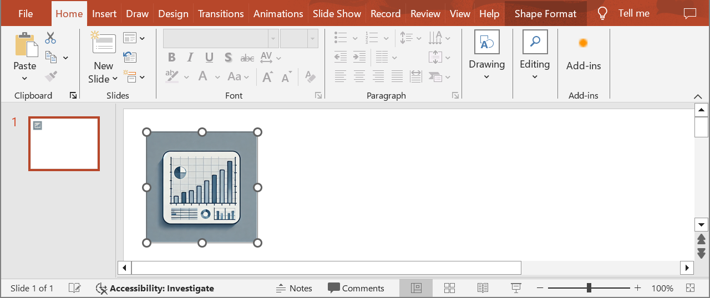

## **परिचय**

Aspose.Slides for Java का उपयोग करते हुए, जब आप [OleObjectFrame](https://reference.aspose.com/slides/hi/java/com.aspose.slides/oleobjectframe/) को स्लाइड में जोड़ते हैं, तो आउटपुट स्लाइड पर "EMBEDDED OLE OBJECT" संदेश प्रदर्शित होता है। यह संदेश जानबूझकर दिखाया जाता है और यह बग नहीं है।

OLE ऑब्जेक्ट के साथ काम करने के बारे में अधिक जानकारी के लिए, देखें [OLE प्रबंधन](/slides/hi/java/manage-ole/)।

## **व्याख्या और समाधान**

Aspose.Slides "EMBEDDED OLE OBJECT" संदेश दर्शाता है ताकि आपको सूचित किया जा सके कि OLE ऑब्जेक्ट बदल दिया गया है और पूर्वावलोकन छवि को अपडेट करने की आवश्यकता है।

उदाहरण के लिए, यदि आप Microsoft Excel चार्ट को एक [OleObjectFrame](https://reference.aspose.com/slides/hi/java/com.aspose.slides/oleobjectframe/) के रूप में स्लाइड में जोड़ते हैं (अधिक विवरण के लिए, "Manage OLE" लेख देखें) और फिर प्रस्तुति को Microsoft PowerPoint में खोलते हैं, तो आपको इस छवि को स्लाइड पर दिखाई देगा:


यदि आप यह जाँचना और पुष्टि करना चाहते हैं कि आपका OLE ऑब्जेक्ट स्लाइड में जोड़ा गया है, तो आपको "EMBEDDED OLE OBJECT" संदेश पर डबल‑क्लिक करना होगा, या आप उस पर राइट‑क्लिक करके **Object > Edit** विकल्प चुन सकते हैं।


PowerPoint तब एंबेडेड OLE ऑब्जेक्ट को खोलता है।


स्लाइड पर "EMBEDDED OLE OBJECT" संदेश बना रह सकता है। एक बार जब आप OLE ऑब्जेक्ट पर क्लिक करते हैं, तो स्लाइड का पूर्वावलोकन अपडेट हो जाता है और "EMBEDDED OLE OBJECT" संदेश को OLE ऑब्जेक्ट की वास्तविक छवि से बदल दिया जाता है।


अब, आप अपनी प्रस्तुति को सहेजना चाह सकते हैं ताकि OLE ऑब्जेक्ट की छवि सही ढंग से अपडेट हो सके। इस प्रकार, प्रस्तुति को सहेजने के बाद, जब आप प्रस्तुति को फिर से खोलेंगे, तो आपको "EMBEDDED OLE OBJECT" संदेश नहीं दिखेगा।

## **अन्य समाधान**

यदि आप PowerPoint में प्रस्तुति खोलकर और फिर सहेजकर "EMBEDDED OLE OBJECT" संदेश को हटाना नहीं चाहते हैं, तो आप इस संदेश को अपनी पसंदीदा पूर्वावलोकन छवि से बदल सकते हैं। ये कोड पंक्तियाँ इस प्रक्रिया को दर्शाती हैं। ये मानती हैं कि *embeddedOLE.pptx* की पहली स्लाइड पर पहला आकार OLE ऑब्जेक्ट फ्रेम है और *myImage.png* वह छवि रखता है जिसे दिखाना है, और परिणाम को *embeddedOLE-newImage.pptx* के रूप में सहेजती हैं:

```java
import com.aspose.slides.*;

Presentation presentation = new Presentation("embeddedOLE.pptx");
try {
    ISlide slide = presentation.getSlides().get_Item(0);
    IOleObjectFrame oleFrame = (IOleObjectFrame) slide.getShapes().get_Item(0);

    // प्रेजेंटेशन संसाधनों में एक छवि जोड़ें।
    IImage image = Images.fromFile("myImage.png");
    IPPImage oleImage = presentation.getImages().addImage(image);
    image.dispose();

    // OLE ऑब्जेक्ट पूर्वावलोकन के लिए छवि सेट करें।
    oleFrame.getSubstitutePictureFormat().getPicture().setImage(oleImage);
    oleFrame.setObjectIcon(false);

    presentation.save("embeddedOLE-newImage.pptx", SaveFormat.Pptx);
} finally {
    presentation.dispose();
}
```

`OleObjectFrame` शामिल वाली स्लाइड फिर इस प्रकार बदल जाती है:

