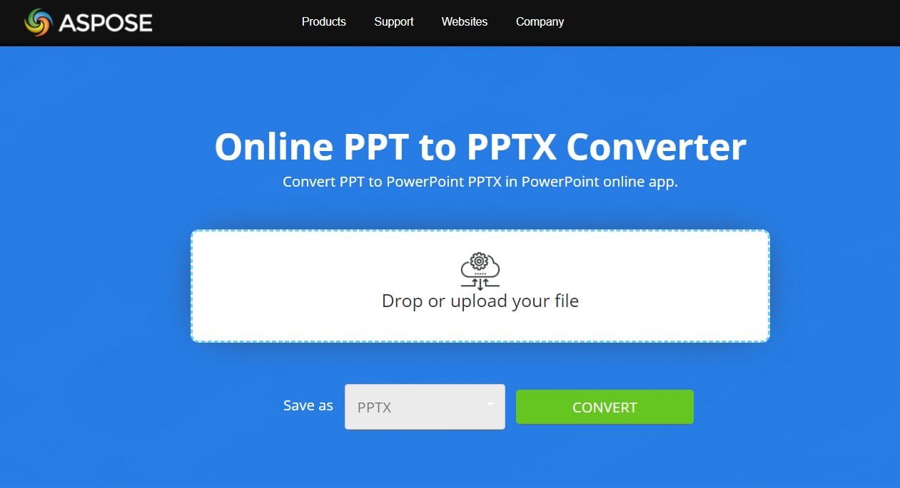

## **अवलोकन**

यह लेख समझाता है कि PowerPoint प्रस्तुति को PPT फ़ॉर्मेट से PPTX फ़ॉर्मेट में Java का उपयोग करके और ऑनलाइन PPT से PPTX रूपांतरण ऐप के साथ कैसे परिवर्तित किया जाए। निम्नलिखित विषय शामिल हैं।

- Java में PPT को PPTX में परिवर्तित करें

## **Java में PPT को PPTX में परिवर्तित करें**

PPT को PPTX में परिवर्तित करने के लिए Java नमूना कोड के लिए, कृपया नीचे दिए गए अनुभाग को देखें अर्थात् [Convert PPT to PPTX](#convert-ppt-to-pptx)। यह केवल PPT फ़ाइल को लोड करता है और PPTX फ़ॉर्मेट में सहेजता है। विभिन्न सहेजने फ़ॉर्मेट निर्दिष्ट करके, आप PPT फ़ाइल को कई अन्य फ़ॉर्मेट जैसे PDF, XPS, ODP, HTML आदि में भी सहेज सकते हैं जैसा कि इन लेखों में चर्चा की गई है।

- [Java में PPT को PDF में परिवर्तित करें](/slides/hi/java/convert-powerpoint-to-pdf/)
- [Java में PPT को XPS में परिवर्तित करें](/slides/hi/java/convert-powerpoint-to-xps/)
- [Java में PPT को HTML में परिवर्तित करें](/slides/hi/java/convert-powerpoint-to-html/)
- [Java में PPT को ODP में परिवर्तित करें](/slides/hi/java/save-presentation/)
- [Java में PPT को PNG में परिवर्तित करें](/slides/hi/java/convert-powerpoint-to-png/)

## **PPT से PPTX रूपांतरण के बारे में**

पुराने PPT फ़ॉर्मेट को Aspose.Slides API के साथ PPTX में परिवर्तित करें। यदि आपको हजारों PPT प्रस्तुतियों को PPTX फ़ॉर्मेट में बदलने की आवश्यकता है, तो सबसे अच्छा समाधान प्रोग्रामेटिक रूप से करना है। Aspose.Slides API के साथ इसे कुछ ही कोड लाइनों में किया जा सकता है। API पूर्ण संगतता का समर्थन करता है जिससे PPT प्रस्तुति को PPTX में परिवर्तित किया जा सकता है और यह संभव है:

- मास्टर, लेआउट और स्लाइड की जटिल संरचनाओं को परिवर्तित करें।
- चार्ट वाली प्रस्तुति को परिवर्तित करें।
- ग्रुप शैप्स, ऑटो-शैप्स (जैसे आयत और दीर्घवृत्त), कस्टम ज्योमेट्री वाले शैप्स वाली प्रस्तुति को परिवर्तित करें।
- ऑटो-शैप्स के लिए टेक्सचर और चित्र भराव शैली वाली प्रस्तुति को परिवर्तित करें।
- प्लेसहोल्डर, टेक्स्ट फ्रेम और टेक्स्ट होल्डर वाली प्रस्तुति को परिवर्तित करें।

{} 

इस ऐप पर नज़र डालें [**Aspose.Slides PPT to PPTX Conversion**](https://products.aspose.app/slides/hi/conversion/ppt-to-pptx) app:

[](https://products.aspose.app/slides/hi/conversion/ppt-to-pptx)

[](https://products.aspose.app/slides/hi/conversion/ppt-to-pptx)

यह ऐप [**Aspose.Slides API**](https://products.aspose.com/slides/hi/java/) पर आधारित है, इसलिए आप बुनियादी PPT से PPTX रूपांतरण क्षमताओं का सक्रिय उदाहरण देख सकते हैं। Aspose.Slides Conversion एक वेब ऐप है, जो PPT फ़ॉर्मेट में प्रस्तुति फ़ाइल को ड्रॉप करने और इसे PPTX में परिवर्तित करके डाउनलोड करने की अनुमति देता है।

अन्य सक्रिय [**Aspose.Slides Conversion**](https://products.aspose.app/slides/hi/conversion/) उदाहरण देखें।

{} 

## **PPT को PPTX में परिवर्तित करें**

Aspose.Slides for Java अब डेवलपर्स को PPT तक पहुँचने के लिए [Presentation](https://reference.aspose.com/slides/hi/java/com.aspose.slides/presentation) क्लास इंस्टेंस के माध्यम से सुविधा प्रदान करता है और उसे संबंधित [PPTX](https://docs.fileformat.com/presentation/pptx/) फ़ॉर्मेट में परिवर्तित करता है। वर्तमान में, यह [PPT ](https://docs.fileformat.com/presentation/ppt/) को PPTX में आंशिक रूपांतरण का समर्थन करता है। PPT से PPTX रूपांतरण में समर्थित और असमर्थित सुविधाओं के बारे में अधिक विवरण के लिए कृपया इस दस्तावेज़ीकरण [link](/slides/hi/java/ppt-to-pptx-conversion/) पर जाएँ।

Aspose.Slides for Java [Presentation](https://reference.aspose.com/slides/hi/java/com.aspose.slides/presentation) क्लास प्रदान करता है जो एक **PPTX** प्रस्तुति फ़ाइल का प्रतिनिधित्व करता है। Presentation क्लास अब जब ऑब्जेक्ट इंस्टैंशिएट किया जाता है तो **PPT** तक भी पहुँच सकता है। निम्नलिखित उदाहरण दिखाता है कि कैसे एक PPT प्रस्तुति को PPTX प्रस्तुति में परिवर्तित किया जाए।

```java
import com.aspose.slides.*;

// PPT फ़ाइल का प्रतिनिधित्व करने वाले Presentation ऑब्जेक्ट को बनाएं
Presentation pres = new Presentation("Aspose.ppt");
try {
// PPT प्रस्तुति को PPTX फ़ॉर्मेट में सहेजें
    pres.save("ConvertedAspose.pptx", SaveFormat.Pptx);
} finally {
    if (pres != null) pres.dispose();
}
```

||
| :- |
|**Figure : स्रोत PPT प्रस्तुति**|

उपरोक्त कोड स्निपेट रूपांतरण के बाद निम्नलिखित PPTX प्रस्तुति उत्पन्न करता है

||
| :- |
|**Figure : रूपांतरण के बाद उत्पन्न PPTX प्रस्तुति**|

## **FAQ**

### PPT और PPTX फ़ॉर्मेट में क्या अंतर है?

PPT Microsoft PowerPoint द्वारा उपयोग किया गया पुराना बाइनरी फ़ाइल फ़ॉर्मेट है, जबकि PPTX Microsoft Office 2007 के साथ पेश किया गया नया XML-आधारित फ़ॉर्मेट है। PPTX फ़ाइलें बेहतर प्रदर्शन, छोटे फ़ाइल आकार, और उन्नत डेटा रिकवरी प्रदान करती हैं।

### क्या Aspose.Slides कई PPT फ़ाइलों को PPTX में बैच रूपांतरण का समर्थन करता है?

हाँ, आप Aspose.Slides को लूप में उपयोग करके कई PPT फ़ाइलों को प्रोग्रामेटिक रूप से PPTX में परिवर्तित कर सकते हैं, जो बैच रूपांतरण स्थितियों के लिए उपयुक्त है।

### क्या रूपांतरण के बाद सामग्री और फ़ॉर्मेटिंग संरक्षित रहेगी?

Aspose.Slides प्रस्तुति को परिवर्तित करते समय उच्च निष्ठा बनाए रखता है। स्लाइड लेआउट, एनीमेशन, शैप्स, चार्ट और अन्य डिज़ाइन तत्व PPT से PPTX रूपांतरण के दौरान संरक्षित रहते हैं।

### क्या मैं PPT फ़ाइलों से PDF या HTML जैसे अन्य फ़ॉर्मेट में रूपांतरित कर सकता हूँ?

हाँ, Aspose.Slides PPT फ़ाइलों को कई फ़ॉर्मेट जैसे [multiple formats](https://reference.aspose.com/slides/hi/java/com.aspose.slides/saveformat/) में रूपांतरित करने का समर्थन करता है, जिनमें PDF, XPS, HTML, ODP, और PNG व JPEG जैसे इमेज फ़ॉर्मेट शामिल हैं।

### क्या Microsoft PowerPoint स्थापित किए बिना PPT को PPTX में रूपांतरित करना संभव है?

हाँ, Aspose.Slides एक स्वतंत्र API है और रूपांतरण करने के लिए Microsoft PowerPoint या किसी तृतीय‑पक्ष सॉफ़्टवेयर की आवश्यकता नहीं होती।

### क्या PPT से PPTX रूपांतरण के लिए कोई ऑनलाइन टूल उपलब्ध है?

हाँ, आप मुफ्त [Aspose.Slides PPT to PPTX Converter](https://products.aspose.app/slides/hi/conversion/ppt-to-pptx) वेब अनुप्रयोग का उपयोग करके अपने ब्राउज़र में सीधे कोड लिखे बिना रूपांतरण कर सकते हैं।