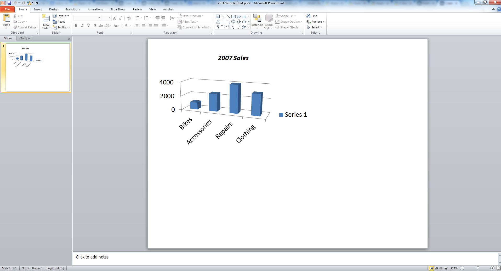

{} 
चार्ट डेटा के दृश्य प्रतिनिधित्व होते हैं जो प्रस्तुतियों में व्यापक रूप से उपयोग किए जाते हैं। यह लेख Microsoft PowerPoint में प्रोग्रामेटिक रूप से चार्ट बनाने के लिए कोड दिखाता है, जो [VSTO](/slides/hi/java/create-a-chart-in-a-microsoft-powerpoint-presentation/) और [Aspose.Slides for Java](/slides/hi/java/create-a-chart-in-a-microsoft-powerpoint-presentation/) का उपयोग करता है।
{} 
## **चार्ट बनाना**
नीचे दिए गए कोड उदाहरण VSTO का उपयोग करके एक साधारण 3D क्लस्टर्ड कॉलम चार्ट जोड़ने की प्रक्रिया का विवरण देते हैं। आप एक प्रस्तुति उदाहरण बनाते हैं, उसमें एक डिफ़ॉल्ट चार्ट जोड़ते हैं। फिर Microsoft Excel वर्कबुक का उपयोग करके चार्ट डेटा तक पहुंचते और उसे संशोधित करते हैं तथा चार्ट गुण सेट करते हैं। अंत में, प्रस्तुति को सहेजते हैं।
### **VSTO उदाहरण**
VSTO का उपयोग करके निम्नलिखित चरण किए जाते हैं:

1. Microsoft PowerPoint प्रस्तुति का एक उदाहरण बनाएं।
1. प्रस्तुति में एक खाली स्लाइड जोड़ें।
1. **3D क्लस्टर्ड कॉलम** चार्ट जोड़ें और उसे एक्सेस करें।
1. एक नया Microsoft Excel Workbook उदाहरण बनाएं और चार्ट डेटा लोड करें।
1. Microsoft Excel Workbook instancefromworkbook का उपयोग करके चार्ट डेटा वर्कशीट तक पहुंचें।
1. वर्कशीट में चार्ट रेंज सेट करें और चार्ट से श्रृंखला 2 और 3 को हटाएं।
1. चार्ट डेटा वर्कशीट में चार्ट श्रेणी डेटा संशोधित करें।
1. चार्ट डेटा वर्कशीट में श्रृंखला 1 डेटा संशोधित करें।
1. अब, चार्ट शीर्षक तक पहुंचें और setthefontrelatedproperties सेट करें।
1. चार्ट मान अक्ष तक पहुंचें और प्रमुख इकाई, लघु इकाइयाँ, अधिकतम मान और न्यूनतम मान सेट करें।
1. चार्ट गहराई या श्रृंखला अक्ष तक पहुंचें और उसे हटाएं क्योंकि इस उदाहरण में, onlyoneserieisused उपयोग किया गया है।
1. अब, X और Y दिशा में चार्ट घूर्णन कोण सेट करें।
1. प्रस्तुति को सहेजें।
1. Microsoft Excel और PowerPoint के उदाहरण बंद करें।

**VSTO के साथ निर्मित आउटपुट प्रस्तुति** 




### **Aspose.Slides for Java उदाहरण**
Aspose.Slides for Java का उपयोग करके निम्नलिखित चरण किए जाते हैं:

1. Microsoft PowerPoint प्रस्तुति का एक उदाहरण बनाएं।
1. प्रस्तुति में एक खाली स्लाइड जोड़ें।
1. **3D क्लस्टर्ड कॉलम** चार्ट जोड़ें और उसे एक्सेस करें।
1. Microsoft Excel Workbook instancefromworkbook का उपयोग करके चार्ट डेटा वर्कशीट तक पहुंचें।
1. अनावश्यक श्रृंखला 2 और 3 को हटाएं।
1. चार्ट श्रेणियों तक पहुंचें और लेबल संशोधित करें।
1. series1 तक पहुंचें और श्रृंखला मान संशोधित करें।
1. अब, चार्ट शीर्षक तक पहुंचें और फ़ॉन्ट गुण सेट करें।
1. चार्ट मान अक्ष तक पहुंचें और प्रमुख इकाई, लघु इकाइयाँ, अधिकतम मान और न्यूनतम मान सेट करें।
1. अब, X और Y दिशा में चार्ट घूर्णन कोण सेट करें।
1. प्रस्तुति को PPTX स्वरूप में सहेजें।

**Aspose.Slides के साथ निर्मित आउटपुट प्रस्तुति** 



## **अक्सर पूछे जाने वाले प्रश्न**

**क्या मैं Aspose.Slides के साथ पाई, लाइन, या बार चार्ट जैसी अन्य प्रकार की चार्ट बना सकता हूँ?**

हाँ। Aspose.Slides एक विस्तृत श्रेणी के [chart types](/slides/hi/java/create-chart/) को समर्थन देता है, जिसमें पाई चार्ट, लाइन चार्ट, बार चार्ट, स्कैटर प्लॉट, बबल चार्ट आदि शामिल हैं। आप चार्ट जोड़ते समय इच्छित चार्ट प्रकार को निर्दिष्ट करने के लिए [ChartType](https://reference.aspose.com/slides/hi/java/com.aspose.slides/charttype/) क्लास का उपयोग कर सकते हैं।

**क्या मैं चार्ट पर कस्टम शैलियों या थीम को लागू कर सकता हूँ?**

हाँ। आप चार्ट की उपस्थिति को पूरी तरह अनुकूलित कर सकते हैं, जिसमें रंग, फ़ॉन्ट, भराव, आउटलाइन, ग्रिडलाइन और लेआउट शामिल हैं। हालांकि, PowerPoint में देखी गई ठीक वही Office थीम को लागू करने के लिए व्यक्तिगत शैलियों को मैन्युअल रूप से सेट करना पड़ेगा।

**क्या मैं स्लाइड से अलग‑अलग चार्ट को छवि के रूप में निर्यात कर सकता हूँ?**

हाँ, Aspose.Slides आपको किसी भी आकार—जिसमें चार्ट शामिल हैं—को `getImage` मेथड का उपयोग करके अलग‑अलग छवि (जैसे PNG, JPEG) के रूप में निर्यात करने की सुविधा देता है।