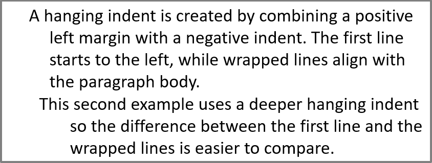

## **अवलोकन**

Aspose.Slides for Java टेक्स्ट को टेक्स्ट फ्रेम, पैराग्राफ और भागों की श्रेणीक्रम में प्रस्तुत करता है:

* [ITextFrame](https://reference.aspose.com/slides/hi/java/com.aspose.slides/itextframe/) आकार में टेक्स्ट कंटेनर को दर्शाता है और इसके पैराग्राफ संग्रह तक पहुंच प्रदान करता है।
* [IParagraph](https://reference.aspose.com/slides/hi/java/com.aspose.slides/iparagraph/) टेक्स्ट फ्रेम में एक पैराग्राफ का प्रतिनिधित्व करता है और इसके भागों और पैराग्राफ‑स्तर फ़ॉर्मेटिंग तक पहुंच प्रदान करता है।
* [IPortion](https://reference.aspose.com/slides/hi/java/com.aspose.slides/iportion/) पैराग्राफ के भीतर एक टेक्स्ट रन का प्रतिनिधित्व करता है। प्रत्येक भाग अपना स्वयं का टेक्स्ट और कैरेक्टर‑स्तर फ़ॉर्मेटिंग रख सकता है।

इसलिए एक पैराग्राफ कई भागों का उपयोग करके विभिन्न फ़ॉन्ट, रंग, आकार और अन्य फ़ॉर्मेटिंग वाले टेक्स्ट को धारण कर सकता है।

## **पैराग्राफ बनाना और फ़ॉर्मेट करना**

### **एकाधिक भागों के साथ पैराग्राफ बनाएं**

निम्न चरण एक टेक्स्ट फ्रेम बनाते हैं जिसमें तीन पैराग्राफ होते हैं, प्रत्येक में तीन भाग होते हैं:

1. Presentation क्लास की एक इंस्टेंस बनाएँ।
2. इंडेक्स के माध्यम से संबंधित स्लाइड तक पहुंचें।
3. स्लाइड में एक आयताकार IAutoShape जोड़ें।
4. आकार के ITextFrame तक पहुंचें।
5. डिफ़ॉल्ट पैराग्राफ का उपयोग करें और टेक्स्ट फ्रेम में दो अतिरिक्त IParagraph ऑब्जेक्ट जोड़ें।
6. प्रत्येक पैराग्राफ में तीन भाग रखने के लिए पर्याप्त IPortion ऑब्जेक्ट जोड़ें। डिफ़ॉल्ट पैराग्राफ में पहले से ही एक खाली भाग मौजूद है।
7. प्रत्येक भाग का टेक्स्ट सेट करें।
8. IPortion.getPortionFormat के माध्यम से कैरेक्टर‑स्तर फ़ॉर्मेटिंग लागू करें।
9. संशोधित प्रेज़ेंटेशन सहेजें।

यह Java उदाहरण इन चरणों को लागू करता है:

```java
import com.aspose.slides.*;
import java.awt.Color;

Presentation presentation = new Presentation();
try {
    ISlide slide = presentation.getSlides().get_Item(0);
    IAutoShape shape = slide.getShapes().addAutoShape(ShapeType.Rectangle, 50, 150, 300, 150);
    ITextFrame textFrame = shape.getTextFrame();

    IParagraph firstParagraph = textFrame.getParagraphs().get_Item(0);
    firstParagraph.getPortions().add(new Portion());
    firstParagraph.getPortions().add(new Portion());

    IParagraph secondParagraph = new Paragraph();
    secondParagraph.getPortions().add(new Portion());
    secondParagraph.getPortions().add(new Portion());
    secondParagraph.getPortions().add(new Portion());
    textFrame.getParagraphs().add(secondParagraph);

    IParagraph thirdParagraph = new Paragraph();
    thirdParagraph.getPortions().add(new Portion());
    thirdParagraph.getPortions().add(new Portion());
    thirdParagraph.getPortions().add(new Portion());
    textFrame.getParagraphs().add(thirdParagraph);

    int paragraphCount = textFrame.getParagraphs().getCount();
    for (int paragraphIndex = 0; paragraphIndex < paragraphCount; paragraphIndex++) {
        IParagraph paragraph = textFrame.getParagraphs().get_Item(paragraphIndex);
        int portionCount = paragraph.getPortions().getCount();
        for (int portionIndex = 0; portionIndex < portionCount; portionIndex++) {
            IPortion portion = paragraph.getPortions().get_Item(portionIndex);
            portion.setText("Portion " + (paragraphIndex + 1) + "." + (portionIndex + 1));

            if (portionIndex == 0) {
                portion.getPortionFormat().getFillFormat().setFillType(FillType.Solid);
                portion.getPortionFormat().getFillFormat().getSolidFillColor().setColor(Color.RED);
                portion.getPortionFormat().setFontBold(NullableBool.True);
                portion.getPortionFormat().setFontHeight(15);
            } else if (portionIndex == 1) {
                portion.getPortionFormat().getFillFormat().setFillType(FillType.Solid);
                portion.getPortionFormat().getFillFormat().getSolidFillColor().setColor(Color.BLUE);
                portion.getPortionFormat().setFontItalic(NullableBool.True);
                portion.getPortionFormat().setFontHeight(18);
            }
        }
    }

    presentation.save("paragraphs_with_portions.pptx", SaveFormat.Pptx);
} finally {
    presentation.dispose();
}
```

## **बुलेटेड और नंबर वाले सूचियाँ बनाना**

### **बुलेटेड या नंबर वाली सूची बनाना**

बुलेट और नंबरिंग संबंधित आइटमों को स्कैन करना आसान बनाते हैं। Aspose.Slides में, सूची सेटिंग्स IBulletFormat के माध्यम से निर्धारित की जाती हैं।

1. Presentation क्लास की एक इंस्टेंस बनाएँ।
2. इंडेक्स के माध्यम से संबंधित स्लाइड तक पहुंचें।
3. चयनित स्लाइड में एक IAutoShape जोड़ें।
4. आकार के ITextFrame तक पहुंचें।
5. टेक्स्ट फ्रेम से डिफ़ॉल्ट पैराग्राफ हटाएँ।
6. एक सिंबल बुलेट के लिए Paragraph बनाएँ।
7. IBulletFormat.setType को BulletType.Symbol पर सेट करें और बुलेट कैरेक्टर निर्दिष्ट करें।
8. पैराग्राफ टेक्स्ट, इंडेंट, बुलेट रंग और बुलेट ऊँचाई सेट करें।
9. पैराग्राफ को टेक्स्ट फ्रेम में जोड़ें।
10. दूसरा पैराग्राफ बनाएँ और IBulletFormat.setType को BulletType.Numbered पर सेट करें।
11. नंबर वाले बुलेट शैली को कॉन्फ़िगर करें और पैराग्राफ को टेक्स्ट फ्रेम में जोड़ें।
12. प्रेज़ेंटेशन सहेजें।

यह Java उदाहरण एक सिंबल बुलेट और एक नंबर वाले बुलेट बनाता है:

```java
import com.aspose.slides.*;
import java.awt.Color;

Presentation presentation = new Presentation();
try {
    ISlide slide = presentation.getSlides().get_Item(0);
    IAutoShape shape = slide.getShapes().addAutoShape(ShapeType.Rectangle, 200, 200, 400, 200);
    ITextFrame textFrame = shape.getTextFrame();
    textFrame.getParagraphs().clear();

    Paragraph symbolParagraph = new Paragraph();
    symbolParagraph.setText("Welcome to Aspose.Slides");
    symbolParagraph.getParagraphFormat().getBullet().setType(BulletType.Symbol);
    symbolParagraph.getParagraphFormat().getBullet().setChar((char) 0x2022);
    symbolParagraph.getParagraphFormat().setIndent(25);
    symbolParagraph.getParagraphFormat().getBullet().getColor().setColorType(ColorType.RGB);
    symbolParagraph.getParagraphFormat().getBullet().getColor().setColor(Color.BLACK);
    symbolParagraph.getParagraphFormat().getBullet().setBulletHardColor(NullableBool.True);
    symbolParagraph.getParagraphFormat().getBullet().setHeight(100);
    textFrame.getParagraphs().add(symbolParagraph);

    Paragraph numberedParagraph = new Paragraph();
    numberedParagraph.setText("This is a numbered item");
    numberedParagraph.getParagraphFormat().getBullet().setType(BulletType.Numbered);
    numberedParagraph.getParagraphFormat().getBullet().setNumberedBulletStyle(NumberedBulletStyle.BulletCircleNumWDBlackPlain);
    numberedParagraph.getParagraphFormat().setIndent(25);
    numberedParagraph.getParagraphFormat().getBullet().getColor().setColorType(ColorType.RGB);
    numberedParagraph.getParagraphFormat().getBullet().getColor().setColor(Color.BLACK);
    numberedParagraph.getParagraphFormat().getBullet().setBulletHardColor(NullableBool.True);
    numberedParagraph.getParagraphFormat().getBullet().setHeight(100);
    textFrame.getParagraphs().add(numberedParagraph);

    presentation.save("bulleted_and_numbered_list.pptx", SaveFormat.Pptx);
} finally {
    presentation.dispose();
}
```

### **चित्र बुलेट का उपयोग करें**

चित्र बुलेट आपको प्रतीक या संख्या के बजाय एक कस्टम इमेज उपयोग करने की अनुमति देता है।

1. Presentation क्लास की एक इंस्टेंस बनाएँ।
2. इंडेक्स के माध्यम से संबंधित स्लाइड तक पहुंचें।
3. एक IAutoShape जोड़ें और उसके ITextFrame तक पहुंचें।
4. टेक्स्ट फ्रेम से डिफ़ॉल्ट पैराग्राफ हटाएँ।
5. बुलेट इमेज लोड करें और इसे प्रेज़ेंटेशन की इमेज कलेक्शन में एक IPPImage के रूप में जोड़ें।
6. एक Paragraph बनाएँ और उसका टेक्स्ट सेट करें।
7. IBulletFormat.setType को BulletType.Picture पर सेट करें।
8. IBulletFormat.getPicture के माध्यम से इमेज असाइन करें और बुलेट ऊँचाई सेट करें।
9. पैराग्राफ को टेक्स्ट फ्रेम में जोड़ें।
10. संशोधित प्रेज़ेंटेशन सहेजें।

यह Java उदाहरण एक चित्र बुलेट बनाता है:

```java
import com.aspose.slides.*;

Presentation presentation = new Presentation();
try {
    ISlide slide = presentation.getSlides().get_Item(0);

    IImage bulletImage = Images.fromFile("bullets.png");
    IPPImage presentationImage;
    try {
        presentationImage = presentation.getImages().addImage(bulletImage);
    } finally {
        bulletImage.dispose();
    }

    IAutoShape shape = slide.getShapes().addAutoShape(ShapeType.Rectangle, 200, 200, 400, 200);
    ITextFrame textFrame = shape.getTextFrame();
    textFrame.getParagraphs().clear();

    Paragraph paragraph = new Paragraph();
    paragraph.setText("Welcome to Aspose.Slides");
    paragraph.getParagraphFormat().getBullet().setType(BulletType.Picture);
    paragraph.getParagraphFormat().getBullet().getPicture().setImage(presentationImage);
    paragraph.getParagraphFormat().getBullet().setHeight(100);
    textFrame.getParagraphs().add(paragraph);

    presentation.save("picture_bullet.pptx", SaveFormat.Pptx);
    presentation.save("picture_bullet.ppt", SaveFormat.Ppt);
} finally {
    presentation.dispose();
}
```

### **बहु‑स्तरीय सूची बनाएं**

IParagraphFormat.setDepth को सेट करके पैराग्राफ को सूची के विभिन्न स्तरों पर रखा जाता है। शीर्ष स्तर की गहराई `0` होती है।

1. एक Presentation बनाएँ और एक स्लाइड तक पहुंचें।
2. एक IAutoShape जोड़ें और उसके टेक्स्ट फ्रेम से डिफ़ॉल्ट पैराग्राफ हटाएँ।
3. चार पैराग्राफ बनाएँ और उनके बुलेट प्रतीकों को कॉन्फ़िगर करें।
4. उनके IParagraphFormat.setDepth मान क्रमशः `0`, `1`, `2` और `3` सेट करें।
5. पैराग्राफ को टेक्स्ट फ्रेम में जोड़ें और प्रेज़ेंटेशन सहेजें।

यह Java उदाहरण चार‑स्तरीय बुलेटेड सूची बनाता है:

```java
import com.aspose.slides.*;
import java.awt.Color;

Presentation presentation = new Presentation();
try {
    ISlide slide = presentation.getSlides().get_Item(0);
    IAutoShape shape = slide.getShapes().addAutoShape(ShapeType.Rectangle, 200, 200, 400, 200);
    ITextFrame textFrame = shape.getTextFrame();
    textFrame.getParagraphs().clear();

    IParagraph firstParagraph = new Paragraph();
    firstParagraph.setText("Content");
    firstParagraph.getParagraphFormat().getBullet().setType(BulletType.Symbol);
    firstParagraph.getParagraphFormat().getBullet().setChar((char) 0x2022);
    firstParagraph.getParagraphFormat().getDefaultPortionFormat().getFillFormat().setFillType(FillType.Solid);
    firstParagraph.getParagraphFormat().getDefaultPortionFormat().getFillFormat().getSolidFillColor().setColor(Color.BLACK);
    firstParagraph.getParagraphFormat().setDepth((short) 0);

    IParagraph secondParagraph = new Paragraph();
    secondParagraph.setText("Second level");
    secondParagraph.getParagraphFormat().getBullet().setType(BulletType.Symbol);
    secondParagraph.getParagraphFormat().getBullet().setChar('-');
    secondParagraph.getParagraphFormat().getDefaultPortionFormat().getFillFormat().setFillType(FillType.Solid);
    secondParagraph.getParagraphFormat().getDefaultPortionFormat().getFillFormat().getSolidFillColor().setColor(Color.BLACK);
    secondParagraph.getParagraphFormat().setDepth((short) 1);

    IParagraph thirdParagraph = new Paragraph();
    thirdParagraph.setText("Third level");
    thirdParagraph.getParagraphFormat().getBullet().setType(BulletType.Symbol);
    thirdParagraph.getParagraphFormat().getBullet().setChar((char) 0x2022);
    thirdParagraph.getParagraphFormat().getDefaultPortionFormat().getFillFormat().setFillType(FillType.Solid);
    thirdParagraph.getParagraphFormat().getDefaultPortionFormat().getFillFormat().getSolidFillColor().setColor(Color.BLACK);
    thirdParagraph.getParagraphFormat().setDepth((short) 2);

    IParagraph fourthParagraph = new Paragraph();
    fourthParagraph.setText("Fourth level");
    fourthParagraph.getParagraphFormat().getBullet().setType(BulletType.Symbol);
    fourthParagraph.getParagraphFormat().getBullet().setChar('-');
    fourthParagraph.getParagraphFormat().getDefaultPortionFormat().getFillFormat().setFillType(FillType.Solid);
    fourthParagraph.getParagraphFormat().getDefaultPortionFormat().getFillFormat().getSolidFillColor().setColor(Color.BLACK);
    fourthParagraph.getParagraphFormat().setDepth((short) 3);

    textFrame.getParagraphs().add(firstParagraph);
    textFrame.getParagraphs().add(secondParagraph);
    textFrame.getParagraphs().add(thirdParagraph);
    textFrame.getParagraphs().add(fourthParagraph);

    presentation.save("multilevel_list.pptx", SaveFormat.Pptx);
} finally {
    presentation.dispose();
}
```

### **कस्टम मानों से क्रमांकित सूची आइटम शुरू करें**

IBulletFormat.setNumberedBulletStartWith का उपयोग करके क्रमांकित पैराग्राफ के प्रारंभिक नंबर को सेट किया जाता है।

1. एक Presentation बनाएँ और एक स्लाइड में IAutoShape जोड़ें।
2. आकार के टेक्स्ट फ्रेम से डिफ़ॉल्ट पैराग्राफ हटाएँ।
3. तीन क्रमांकित पैराग्राफ बनाएँ।
4. संबंधित पैराग्राफ के लिए IBulletFormat.setNumberedBulletStartWith को `2`, `3` और `7` पर सेट करें।
5. पैराग्राफ को टेक्स्ट फ्रेम में जोड़ें और प्रेज़ेंटेशन सहेजें।

यह Java उदाहरण प्रत्येक पैराग्राफ को एक कस्टम प्रारंभिक नंबर असाइन करता है:

```java
import com.aspose.slides.*;

Presentation presentation = new Presentation();
try {
    ISlide slide = presentation.getSlides().get_Item(0);
    IAutoShape shape = slide.getShapes().addAutoShape(ShapeType.Rectangle, 200, 200, 400, 200);
    ITextFrame textFrame = shape.getTextFrame();
    textFrame.getParagraphs().clear();

    Paragraph firstParagraph = new Paragraph();
    firstParagraph.setText("Start at 2");
    firstParagraph.getParagraphFormat().getBullet().setType(BulletType.Numbered);
    firstParagraph.getParagraphFormat().getBullet().setNumberedBulletStartWith((short) 2);
    textFrame.getParagraphs().add(firstParagraph);

    Paragraph secondParagraph = new Paragraph();
    secondParagraph.setText("Start at 3");
    secondParagraph.getParagraphFormat().getBullet().setType(BulletType.Numbered);
    secondParagraph.getParagraphFormat().getBullet().setNumberedBulletStartWith((short) 3);
    textFrame.getParagraphs().add(secondParagraph);

    Paragraph thirdParagraph = new Paragraph();
    thirdParagraph.setText("Start at 7");
    thirdParagraph.getParagraphFormat().getBullet().setType(BulletType.Numbered);
    thirdParagraph.getParagraphFormat().getBullet().setNumberedBulletStartWith((short) 7);
    textFrame.getParagraphs().add(thirdParagraph);

    presentation.save("custom_numbered_list.pptx", SaveFormat.Pptx);
} finally {
    presentation.dispose();
}
```

## **पैराग्राफ लेआउट और अंत गुण नियंत्रित करना**

### **पहली‑लाइन इंडेंट सेट करें**

IParagraphFormat.setIndent का उपयोग करके पैराग्राफ की पहली‑लाइन इंडेंट को नियंत्रित किया जाता है। यह विधि केवल पैराग्राफ के बाएँ मार्जिन के सापेक्ष पहली लाइन को लेती है। सकारात्मक मान पहली लाइन को दाईं ओर शिफ्ट करता है, जबकि बाकी लाइनों को पैराग्राफ बॉडी के साथ संरेखित रखता है।

पूरे पैराग्राफ को ले जाना हो तो IParagraphFormat.setMarginLeft उपयोग करें। केवल पहली लाइन को ले जाना हो तो IParagraphFormat.setIndent उपयोग करें।

नीचे दिया गया उदाहरण कई पैराग्राफ बनाता है और विभिन्न IParagraphFormat.setIndent मान लागू करता है ताकि पहली‑लाइन इंडेंट पैराग्राफ लेआउट को कैसे प्रभावित करता है दिखाया जा सके।

1. Presentation क्लास की एक इंस्टेंस बनाएँ।
2. लक्ष्य स्लाइड तक पहुंचें।
3. स्लाइड में एक आयताकार IAutoShape जोड़ें।
4. आकार के ITextFrame तक पहुंचें और डिफ़ॉल्ट पैराग्राफ हटाएँ।
5. कई पैराग्राफ बनाएँ और उनके लिए विभिन्न IParagraphFormat.setIndent मान सेट करें।
6. पैराग्राफ को टेक्स्ट फ्रेम में जोड़ें।
7. संशोधित प्रेज़ेंटेशन सहेजें।

यह कोड पैराग्राफ इंडेंट सेट करने का तरीका दर्शाता है:

```java
import com.aspose.slides.*;
import java.awt.Color;

Presentation presentation = new Presentation();
try {
    ISlide slide = presentation.getSlides().get_Item(0);

    IAutoShape shape = slide.getShapes().addAutoShape(ShapeType.Rectangle, 50, 50, 420, 220);
    shape.getFillFormat().setFillType(FillType.NoFill);
    shape.getLineFormat().getFillFormat().setFillType(FillType.Solid);
    shape.getLineFormat().getFillFormat().getSolidFillColor().setColor(Color.GRAY);

    ITextFrame textFrame = shape.getTextFrame();
    textFrame.getTextFrameFormat().setAutofitType(TextAutofitType.Shape);
    textFrame.getParagraphs().clear();

    Paragraph firstParagraph = new Paragraph();
    firstParagraph.setText("No first-line indent. Wrapped lines start at the same position as the first line.");
    firstParagraph.getParagraphFormat().getDefaultPortionFormat().getFillFormat().setFillType(FillType.Solid);
    firstParagraph.getParagraphFormat().getDefaultPortionFormat().getFillFormat().getSolidFillColor().setColor(Color.BLACK);
    firstParagraph.getParagraphFormat().setMarginLeft(20f);
    firstParagraph.getParagraphFormat().setIndent(0f);

    Paragraph secondParagraph = new Paragraph();
    secondParagraph.setText("First-line indent of 20 points. The first line moves to the right, while wrapped lines remain aligned to the paragraph body.");
    secondParagraph.getParagraphFormat().getDefaultPortionFormat().getFillFormat().setFillType(FillType.Solid);
    secondParagraph.getParagraphFormat().getDefaultPortionFormat().getFillFormat().getSolidFillColor().setColor(Color.BLACK);
    secondParagraph.getParagraphFormat().setMarginLeft(20f);
    secondParagraph.getParagraphFormat().setIndent(20f);

    Paragraph thirdParagraph = new Paragraph();
    thirdParagraph.setText("First-line indent of 40 points. This paragraph shows a larger first-line offset to make the effect easier to see.");
    thirdParagraph.getParagraphFormat().getDefaultPortionFormat().getFillFormat().setFillType(FillType.Solid);
    thirdParagraph.getParagraphFormat().getDefaultPortionFormat().getFillFormat().getSolidFillColor().setColor(Color.BLACK);
    thirdParagraph.getParagraphFormat().setMarginLeft(20f);
    thirdParagraph.getParagraphFormat().setIndent(40f);

    textFrame.getParagraphs().add(firstParagraph);
    textFrame.getParagraphs().add(secondParagraph);
    textFrame.getParagraphs().add(thirdParagraph);

    presentation.save("paragraph_indent.pptx", SaveFormat.Pptx);
} finally {
    presentation.dispose();
}
```

परिणाम:


### **हैंगिंग इंडेंट सेट करें**

हैंगिंग इंडेंट वह पैराग्राफ लेआउट है जिसमें पहली लाइन शेष लाइनों के बाएँ शुरू होती है। Aspose.Slides में आप यह प्रभाव IParagraphFormat.setIndent के माध्यम से बनाते हैं। पहली लाइन को बाएँ ले जाने के लिए नकारात्मक मान पास करें।

व्यावहारिक रूप से, IParagraphFormat.setMarginLeft पैराग्राफ बॉडी की बाएँ स्थिति निर्धारित करता है, और IParagraphFormat.setIndent पहली लाइन की स्थिति तय करता है। हैंगिंग इंडेंट बनाने के लिए setMarginLeft को सकारात्मक मान और setIndent को नकारात्मक मान पास करें।

यह फ़ॉर्मेटिंग बिब्लियोग्राफी, रेफ़रेंस, शब्दकोश प्रविष्टियों आदि में उपयोगी है, जहाँ रैप्ड लाइनों को पैराग्राफ बॉडी के तहत संरेखित किया जाना चाहिए।

1. Presentation क्लास की एक इंस्टेंस बनाएँ।
2. लक्ष्य स्लाइड तक पहुंचें।
3. स्लाइड में एक आयताकार IAutoShape जोड़ें।
4. आकार के ITextFrame तक पहुंचें और डिफ़ॉल्ट पैराग्राफ हटाएँ।
5. प्रत्येक पैराग्राफ के लिए IParagraphFormat.setMarginLeft को सकारात्मक मान सेट करें।
6. हैंगिंग इंडेंट प्रभाव बनाने के लिए IParagraphFormat.setIndent को नकारात्मक मान पास करें।
7. पैराग्राफ को टेक्स्ट फ्रेम में जोड़ें।
8. संशोधित प्रेज़ेंटेशन सहेजें।

यह कोड पैराग्राफ के लिए हैंगिंग इंडेंट सेट करने का तरीका दर्शाता है:

```java
import com.aspose.slides.*;
import java.awt.Color;

Presentation presentation = new Presentation();
try {
    ISlide slide = presentation.getSlides().get_Item(0);

    IAutoShape shape = slide.getShapes().addAutoShape(ShapeType.Rectangle, 50, 50, 420, 220);
    shape.getFillFormat().setFillType(FillType.NoFill);
    shape.getLineFormat().getFillFormat().setFillType(FillType.Solid);
    shape.getLineFormat().getFillFormat().getSolidFillColor().setColor(Color.GRAY);

    ITextFrame textFrame = shape.getTextFrame();
    textFrame.getTextFrameFormat().setAutofitType(TextAutofitType.Shape);
    textFrame.getParagraphs().clear();

    Paragraph firstParagraph = new Paragraph();
    firstParagraph.setText("A hanging indent is created by combining a positive left margin with a negative indent. The first line starts to the left, while wrapped lines align with the paragraph body.");
    firstParagraph.getParagraphFormat().getDefaultPortionFormat().getFillFormat().setFillType(FillType.Solid);
    firstParagraph.getParagraphFormat().getDefaultPortionFormat().getFillFormat().getSolidFillColor().setColor(Color.BLACK);
    firstParagraph.getParagraphFormat().setMarginLeft(40f);
    firstParagraph.getParagraphFormat().setIndent(-20f);

    Paragraph secondParagraph = new Paragraph();
    secondParagraph.setText("This second example uses a deeper hanging indent so the difference between the first line and the wrapped lines is easier to compare.");
    secondParagraph.getParagraphFormat().getDefaultPortionFormat().getFillFormat().setFillType(FillType.Solid);
    secondParagraph.getParagraphFormat().getDefaultPortionFormat().getFillFormat().getSolidFillColor().setColor(Color.BLACK);
    secondParagraph.getParagraphFormat().setMarginLeft(60f);
    secondParagraph.getParagraphFormat().setIndent(-30f);

    textFrame.getParagraphs().add(firstParagraph);
    textFrame.getParagraphs().add(secondParagraph);

    presentation.save("hanging_indent.pptx", SaveFormat.Pptx);
} finally {
    presentation.dispose();
}
```

परिणाम:



### **एंड पैराग्राफ रन गुण सेट करें**

IParagraph.setEndParagraphPortionFormat पैराग्राफ के अंत अक्षर के फ़ॉर्मेट को नियंत्रित करता है। नीचे दिया गया उदाहरण दूसरे पैराग्राफ के एंड मार्क को फ़ॉन्ट साइज और लैटिन फ़ॉन्ट असाइन करता है:

1. एक Presentation लोड करें और एक स्लाइड तक पहुंचें।
2. एक IAutoShape जोड़ें और उसके डिफ़ॉल्ट पैराग्राफ को साफ़ करें।
3. दो पैराग्राफ बनाएँ और उनमें टेक्स्ट भाग जोड़ें।
4. दूसरे पैराग्राफ के एंड मार्क के लिए एक PortionFormat बनाएं।
5. IBasePortionFormat.setFontHeight और IBasePortionFormat.setLatinFont सेट करें।
6. IParagraph.setEndParagraphPortionFormat के साथ फ़ॉर्मेट असाइन करें और प्रेज़ेंटेशन सहेजें।

```java
import com.aspose.slides.*;

Presentation presentation = new Presentation("Test.pptx");
try {
    ISlide slide = presentation.getSlides().get_Item(0);
    IAutoShape shape = slide.getShapes().addAutoShape(ShapeType.Rectangle, 10, 10, 200, 250);
    ITextFrame textFrame = shape.getTextFrame();
    textFrame.getParagraphs().clear();

    Paragraph firstParagraph = new Paragraph();
    firstParagraph.getPortions().add(new Portion("Sample text"));

    Paragraph secondParagraph = new Paragraph();
    secondParagraph.getPortions().add(new Portion("Sample text 2"));

    PortionFormat endParagraphFormat = new PortionFormat();
    endParagraphFormat.setFontHeight(48);
    endParagraphFormat.setLatinFont(new FontData("Times New Roman"));
    secondParagraph.setEndParagraphPortionFormat(endParagraphFormat);

    textFrame.getParagraphs().add(firstParagraph);
    textFrame.getParagraphs().add(secondParagraph);

    presentation.save("end_paragraph_format.pptx", SaveFormat.Pptx);
} finally {
    presentation.dispose();
}
```

## **रेंडर की गई लाइनों की गिनती**

लाइन ब्रेकिंग और हैंगिंग पंक्चुएशन नियमों के बारे में देखें [Control Line Breaking](/slides/hi/java/text-formatting/#control-line-breaking) और [Control Hanging Punctuation](/slides/hi/java/text-formatting/#control-hanging-punctuation)।

IParagraph.getLinesCount का उपयोग करके आप किसी पैराग्राफ द्वारा लेआउट के बाद घिराए गए लाइनों की संख्या गिन सकते हैं, जिसमें स्वचालित रैपिंग शामिल है। यह प्रेज़ेंटेशन टेम्पलेट में टेक्स्ट लंबाई और लेआउट जांचने में उपयोगी है।

पैराग्राफ ITextFrame.getParagraphs का एक आइटम है, और यह कई रेंडर की गई लाइनों को घेर सकता है। पैराग्राफ के भीतर स्पष्ट लाइन ब्रेक एक नई लाइन बनाता है लेकिन नया पैराग्राफ नहीं बनाता। स्वचालित रैपिंग उपलब्ध चौड़ाई के आधार पर लाइनों को बनाता है बिना स्पष्ट लाइन ब्रेक डाले। इसलिए पैराग्राफ या लाइन‑ब्रेक कैरेक्टर गिनने से रेंडर लाइन काउंट नहीं मिलता।

निम्न उदाहरण एक टेक्स्ट शेप बनाता है, उसकी लाइनों की गिनती करता है, शेप को संकुचित करता है, फिर टेक्स्ट को एक छोटे स्ट्रिंग से बदलता है। रैपिंग सक्षम है और ऑटोफ़िट अक्षम है ताकि शेप की चौड़ाई रैपिंग को नियंत्रित करे। शेप आयाम पॉइंट में हैं। अंत में, उदाहरण एक और पैराग्राफ जोड़ता है और टेक्स्ट फ्रेम में कुल लाइन काउंट जोड़ता है।

```java
import com.aspose.slides.*;

Presentation presentation = new Presentation();
try {
    ISlide slide = presentation.getSlides().get_Item(0);

    IAutoShape shape = slide.getShapes().addAutoShape(ShapeType.Rectangle, 50, 50, 400, 200);
    ITextFrame textFrame = shape.getTextFrame();
    textFrame.getTextFrameFormat().setWrapText(NullableBool.True);
    textFrame.getTextFrameFormat().setAutofitType(TextAutofitType.None);

    IParagraph paragraph = textFrame.getParagraphs().get_Item(0);
    paragraph.getParagraphFormat().getDefaultPortionFormat().setFontHeight(20);
    paragraph.setText("This text demonstrates how automatic wrapping changes the number of rendered lines.");
    System.out.println("Original width: " + paragraph.getLinesCount());

    shape.setWidth(150);
    System.out.println("Narrower shape: " + paragraph.getLinesCount());

    paragraph.setText("Short text.");
    System.out.println("Shorter text: " + paragraph.getLinesCount());

    Paragraph secondParagraph = new Paragraph();
    secondParagraph.setText("Another paragraph.");
    secondParagraph.getParagraphFormat().getDefaultPortionFormat().setFontHeight(20);
    textFrame.getParagraphs().add(secondParagraph);

    int totalLineCount = 0;
    for (IParagraph currentParagraph : textFrame.getParagraphs()) {
        totalLineCount += currentParagraph.getLinesCount();
    }
    System.out.println("Total lines in the text frame: " + totalLineCount);
} finally {
    presentation.dispose();
}
```

इन टेक्स्ट और आयामों के साथ, शेप को संकीर्ण करने से लाइन काउंट बढ़ता है, जबकि छोटे स्ट्रिंग से बदलने से घटता है। सटीक काउंट फ़ॉन्ट उपलब्धता, प्रतिस्थापन, फ़ॉन्ट साइज, मार्जिन, इंडेंट, रैपिंग और ऑटोफ़िट सेटिंग्स पर निर्भर करता है। टेम्पलेट जांचते समय लक्ष्य वातावरण के फ़ॉन्ट और लेआउट सेटिंग्स उपयोग करें।

लाइन काउंट अकेला यह निर्धारित नहीं करता कि टेक्स्ट कंटेनर से बाहर निकल रहा है या नहीं। उपलब्ध ऊँचाई, लाइन ऊँचाइयाँ, पैराग्राफ और लाइन स्पेसिंग, तथा ऑटोफ़िट व्यवहार भी महत्वपूर्ण हैं; रैपिंग बंद होने पर एक ही लाइन भी उपलब्ध चौड़ाई से अधिक हो सकती है।

## **पैराग्राफ सामग्री आयात और निर्यात**

### **HTML टेक्स्ट को पैराग्राफ में आयात करें**

ParagraphCollection.addFromHtml का उपयोग करके HTML मार्कअप को टेक्स्ट फ्रेम में पैराग्राफ और भागों में परिवर्तित करें।

1. Presentation क्लास की एक इंस्टेंस बनाएँ।
2. एक स्लाइड तक पहुंचें और एक IAutoShape जोड़ें।
3. आकार के ITextFrame तक पहुंचें और डिफ़ॉल्ट पैराग्राफ साफ़ करें।
4. स्रोत HTML फ़ाइल पढ़ें।
5. HTML स्ट्रिंग को ParagraphCollection.addFromHtml को पास करें।
6. संशोधित प्रेज़ेंटेशन सहेजें।

यह Java उदाहरण HTML को टेक्स्ट फ्रेम में आयात करता है:

```java
import com.aspose.slides.*;
import java.io.IOException;
import java.nio.charset.StandardCharsets;
import java.nio.file.Files;
import java.nio.file.Paths;

Presentation presentation = new Presentation();
try {
    ISlide slide = presentation.getSlides().get_Item(0);
    float shapeWidth = (float) presentation.getSlideSize().getSize().getWidth() - 20;
    float shapeHeight = (float) presentation.getSlideSize().getSize().getHeight() - 20;
    IAutoShape shape = slide.getShapes().addAutoShape(ShapeType.Rectangle, 10, 10, shapeWidth, shapeHeight);
    shape.getFillFormat().setFillType(FillType.NoFill);
    shape.getTextFrame().getParagraphs().clear();

    try {
        byte[] htmlBytes = Files.readAllBytes(Paths.get("file.html"));
        String html = new String(htmlBytes, StandardCharsets.UTF_8);
        shape.getTextFrame().getParagraphs().addFromHtml(html);
        presentation.save("html_text.pptx", SaveFormat.Pptx);
    } catch (IOException exception) {
        System.out.println("The HTML file could not be read: " + exception.getMessage());
    }
} finally {
    presentation.dispose();
}
```

### **पैराग्राफ टेक्स्ट को HTML में निर्यात करें**

ParagraphCollection.exportToHtml का उपयोग करके चयनित पैराग्राफ रेंज को HTML के रूप में निर्यात करें।

1. Presentation क्लास की एक इंस्टेंस बनाएँ और इच्छित प्रेज़ेंटेशन लोड करें।
2. स्लाइड तक पहुंचें और वह IAutoShape खोजें जिसमें टेक्स्ट है।
3. आकार के ITextFrame तक पहुंचें।
4. ParagraphCollection.exportToHtml को शुरुआती पैराग्राफ इंडेक्स और निर्यात करने वाले पैराग्राफ की संख्या के साथ कॉल करें।
5. लौटाए गए HTML स्ट्रिंग को फ़ाइल में लिखें।

यह Java उदाहरण पहले टेक्स्ट शेप के सभी पैराग्राफ निर्यात करता है:

```java
import com.aspose.slides.*;
import java.io.IOException;
import java.nio.charset.StandardCharsets;
import java.nio.file.Files;
import java.nio.file.Paths;

Presentation presentation = new Presentation("ExportingHTMLText.pptx");
try {
    IShape shape = presentation.getSlides().get_Item(0).getShapes().get_Item(0);

    if (shape instanceof IAutoShape) {
        IAutoShape textShape = (IAutoShape) shape;
        ITextFrame textFrame = textShape.getTextFrame();
        if (textFrame != null) {
            IParagraphCollection paragraphs = textFrame.getParagraphs();
            String html = paragraphs.exportToHtml(0, paragraphs.getCount(), null);
            try {
                Files.write(Paths.get("paragraphs.html"), html.getBytes(StandardCharsets.UTF_8));
            } catch (IOException exception) {
                System.out.println("The HTML file could not be written: " + exception.getMessage());
            }
        } else {
            System.out.println("The first shape does not contain a text frame.");
        }
    } else {
        System.out.println("The first shape is not a text shape.");
    }
} finally {
    presentation.dispose();
}
```

### **पैराग्राफ को इमेज के रूप में रेंडर करें**

IParagraph.getImage एक व्यक्तिगत पैराग्राफ को सीधे रेंडर करता है और एक IImage लौटाता है। परिणाम को IImage.save से फ़ाइल या स्ट्रीम में सहेजें। आपको समग्र शेप रेंडर करने या बिटमैप को मैन्युअली क्रॉप करने की आवश्यकता नहीं है।

यदि पैराग्राफ नहीं मिला, वैध रेंडर बाउंड नहीं है या रेंडर नहीं हो पाया, तो IParagraph.getImage `null` लौटा सकता है। सहेजने से पहले परिणाम जाँचें और उपयोग के बाद इमेज को डिस्पोज़ करें।

#### **डिफ़ॉल्ट स्केल पर पैराग्राफ रेंडर करें**

मान लीजिए हमारे पास sample.pptx नाम की एक प्रेज़ेंटेशन फ़ाइल है जिसमें एक स्लाइड है, जहाँ पहला शेप तीन पैराग्राफ वाला टेक्स्ट बॉक्स है।


नीचे दिया गया उदाहरण दूसरे पैराग्राफ को नियमित टेक्स्ट शेप में डिफ़ॉल्ट स्केल पर रेंडर करता है और PNG फ़ॉर्मेट में इमेज सहेजता है। `finally` ब्लॉक इमेज को सही ढंग से डिस्पोज़ करता है।

```java
import com.aspose.slides.*;

Presentation presentation = new Presentation("sample.pptx");
try {
    IShape shape = presentation.getSlides().get_Item(0).getShapes().get_Item(0);

    if (shape instanceof IAutoShape) {
        IAutoShape textShape = (IAutoShape) shape;
        ITextFrame textFrame = textShape.getTextFrame();
        if (textFrame != null && textFrame.getParagraphs().getCount() > 1) {
            IParagraph paragraph = textFrame.getParagraphs().get_Item(1);
            IImage paragraphImage = paragraph.getImage();

            if (paragraphImage != null) {
                try {
                    paragraphImage.save("paragraph.png", ImageFormat.Png);
                } finally {
                    paragraphImage.dispose();
                }
            } else {
                System.out.println("The paragraph could not be rendered.");
            }
        } else {
            System.out.println("The expected paragraph was not found.");
        }
    } else {
        System.out.println("The first shape is not a text shape.");
    }
} finally {
    presentation.dispose();
}
```

परिणाम:


#### **टेबल सेल में स्केलिंग के साथ पैराग्राफ रेंडर करें**

IParagraph.getImage (float scaleX, float scaleY) ओवरलोड का उपयोग करके हरीज़ोंटल और वर्टिकल स्केल फैक्टर सेट करें। नीचे दिया गया उदाहरण एक टेबल बनाता है, पहले सेल में पैराग्राफ को डिफ़ॉल्ट चौड़ाई और ऊँचाई के दो गुना पर रेंडर करता है, और परिणाम को PNG इमेज में सहेजता है।

```java
import com.aspose.slides.*;

float scaleX = 2f;
float scaleY = 2f;

Presentation presentation = new Presentation();
try {
    ISlide slide = presentation.getSlides().get_Item(0);
    ITable table = slide.getShapes().addTable(50, 50, new double[] { 300 }, new double[] { 80 });
    IParagraph paragraph = table.get_Item(0, 0).getTextFrame().getParagraphs().get_Item(0);
    paragraph.setText("Text in a table cell");

    IImage paragraphImage = paragraph.getImage(scaleX, scaleY);
    if (paragraphImage != null) {
        try {
            paragraphImage.save("table_paragraph.png", ImageFormat.Png);
        } finally {
            paragraphImage.dispose();
        }
    } else {
        System.out.println("The paragraph could not be rendered.");
    }
} finally {
    presentation.dispose();
}
```

स्केल फैक्टर `1` अक्ष को उसकी डिफ़ॉल्ट पिक्सेल साइज पर रखता है। उदाहरण के लिए, दोनों फैक्टर्स `2` रखने से इमेज की चौड़ाई और ऊँचाई लगभग दो गुना हो जाती है, जिससे पिक्सेल चार गुना हो जाते हैं। बड़े फैक्टर्स आमतौर पर ज़ूम या हाई‑रेज़ोल्यूशन आउटपुट के लिए तेज़ टेक्स्ट देते हैं, लेकिन मेमोरी उपयोग और फ़ाइल आकार भी बढ़ाते हैं। `1` से नीचे के फैक्टर्स छोटे इमेज बनाते हैं। समान फैक्टर्स उपयोग करने से पैराग्राफ का एस्पेक्ट रेशियो बना रहता है; अलग-अलग फैक्टर्स ने इमेज को अलग‑अलग दिशा में खींचते हैं।

[IShape.getImage] का उपयोग करके पूरा शेप रेंडर करना उपयोगी है जब आउटपुट में शेप की फ़िल, बॉर्डर या अन्य दृश्य संदर्भ शामिल होना चाहिए। केवल पैराग्राफ‑इमेज के लिए [IParagraph.getImage] का उपयोग करें।

## **अक्सर पूछे जाने वाले प्रश्न**

**क्या मैं टेक्स्ट फ्रेम के भीतर लाइन रैपिंग को पूरी तरह बंद कर सकता हूँ?**

हाँ। ITextFrameFormat.setWrapText को सेट करके रैपिंग बंद करें ताकि लाइन्स टेक्स्ट फ्रेम के किनारों पर नहीं टूटें।

**मैं किसी विशिष्ट पैराग्राफ की स्लाइड पर सटीक सीमा कैसे प्राप्त करूँ?**

IParagraph.getRect का उपयोग करके पैराग्राफ का बाउंडिंग रेक्टेंगल प्राप्त करें। IPortion.getRect व्यक्तिगत भाग की सीमा देता है।

**पैराग्राफ संरेखण (बायीं, दायीं, मध्य, या जस्टिफ़ाइ) कहाँ नियंत्रित होता है?**

IParagraphFormat.setAlignment पैराग्राफ‑स्तर की सेटिंग है और पूरे पैराग्राफ पर लागू होती है, चाहे व्यक्तिगत भागों का फ़ॉर्मेट कुछ भी हो।

**क्या मैं पैराग्राफ के हिस्से के लिए प्रूफिंग भाषा सेट कर सकता हूँ?**

हाँ। व्यक्तिगत भागों के लिए IBasePortionFormat.setLanguageId सेट करें, जिससे एक पैराग्राफ कई भाषाओं में टेक्स्ट रख सकता है।