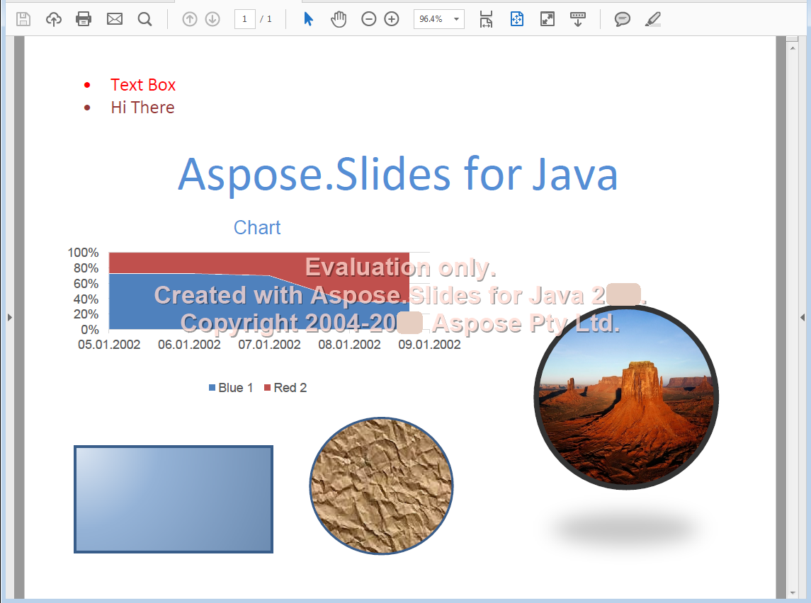

{} 

पोर्टेबल डॉक्युमेंट फ़ॉर्मेट (PDF) एक फ़ाइल फ़ॉर्मेट है, जो Adobe Systems द्वारा निर्मित है, संगठनों के बीच दस्तावेज़ों का आदान‑प्रदान करने के लिये। इस फ़ॉर्मेट का उद्देश्य सामग्री और लेआउट को समान रखना था, चाहे इसे किसी भी प्लेटफ़ॉर्म पर देखा जाये। Aspose.Slides for Java आपको प्रेज़ेंटेशन फ़ाइलों को PDF में बदलने की अनुमति देता है।

{} 

## **Aspose.Slides for Java में PDF**
Aspose.Slides for Java में लोड की जा सकने वाली कोई भी प्रेज़ेंटेशन आपके चयन के अनुसार PDF 1.5, PDF/A-1a, PDF/A-1b या PDF/UA मानकों के अनुरूप PDF में परिवर्तित की जा सकती है। Aspose.Slides for Java प्रेज़ेंटेशनों को PDF में निर्यात करता है और अधिकांश मामलों में आउटपुट PDF मूल प्रेज़ेंटेशन जैसा ही दिखता है।

Aspose.Slides निम्नलिखित प्रेज़ेंटेशन विशेषताओं को PDF में रूपांतरित करते समय सपोर्ट करता है:

- छवियाँ, टेक्स्ट बॉक्स और अन्य आकार।
- टेक्स्ट और स्वरूपण।
- पैराग्राफ और स्वरूपण।
- हाइपरलिंक्स।
- हेडर और फुटर।
- बुलेट्स।
- टेबल्स।

आप सीधे Aspose.Slides for Java का उपयोग करके प्रेज़ेंटेशन को PDF में निर्यात कर सकते हैं: इसके लिए आपको कोई अन्य घटक की आवश्यकता नहीं है। आगे, आप विभिन्न विकल्पों के साथ प्रेज़ेंटेशन से PDF निर्यात को अनुकूलित कर सकते हैं जैसा कि [PDF में रूपांतरण](/slides/hi/java/converting-a-presentation/) में समझाया गया है।

**इनपुट प्रेज़ेंटेशन** 

**Aspose.Slides for Java का उपयोग करके PDF में परिवर्तित प्रेज़ेंटेशन** 

