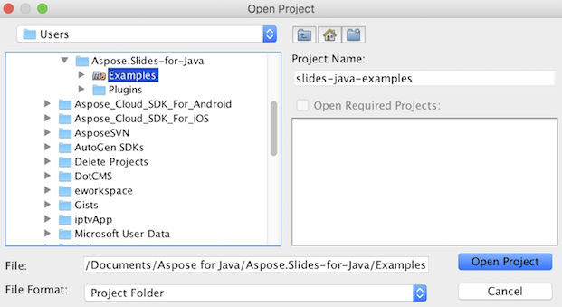

## **GitHub से Aspose.Slides डाउनलोड करें**
Aspose.Slides for Java के सभी उदाहरण [Github](https://github.com/aspose-slides/Aspose.Slides-for-Java) पर होस्ट किए गए हैं। आप अपने पसंदीदा Github क्लाइंट का उपयोग करके रिपॉज़िटरी को क्लोन कर सकते हैं या [यहाँ](https://codeload.github.com/aspose-slides/Aspose.Slides-for-Java/zip/master) से ZIP फ़ाइल डाउनलोड कर सकते हैं।

ZIP फ़ाइल की सामग्री को अपने कंप्यूटर में किसी भी फ़ोल्डर में एक्सट्रैक्ट करें। सभी उदाहरण **Examples** फ़ोल्डर में स्थित हैं।


## **IDE में उदाहरण आयात करें**
परियोजना Maven बिल्ड सिस्टम का उपयोग करती है। कोई भी आधुनिक IDE आसानी से परियोजना और उसकी निर्भरताओं को खोल या इम्पोर्ट कर सकता है। नीचे हम दिखाते हैं कि लोकप्रिय IDEs का उपयोग करके उदाहरणों को कैसे बनाएं और चलाएं।

### **IntelliJ IDEA**
**File** मेन्यू पर क्लिक करें और **Open** चुनें। प्रोजेक्ट फ़ोल्डर तक जाएँ और **pom.xml** फ़ाइल चुनें।


यह प्रोजेक्ट को खोल देगा और निर्भरताओं को स्वचालित रूप से डाउनलोड करेगा। प्रोजेक्ट टैब से, **src/main/java** फ़ोल्डर में उदाहरण देखें। उदाहरण चलाने के लिए, फ़ाइल पर राइट-क्लिक करें और "Run .." चुनें, उदाहरण निष्पादित होगा और आउटपुट अंतर्निहित कंसोल आउटपुट विंडो में दिखेगा।


### **Eclipse**
**File** मेन्यू पर क्लिक करके **Import** चुनें। **Maven** - Existing Maven Projects चुनें।


GitHub से क्लोन या डाउनलोड किए गए फ़ोल्डर तक जाएँ और **pom.xml** फ़ाइल चुनें। यह प्रोजेक्ट को खोल देगा और निर्भरताओं को स्वचालित रूप से डाउनलोड करेगा। Package Explorer टैब से, **src/main/java** फ़ोल्डर में उदाहरण देखें। उदाहरण चलाने के लिए, फ़ाइल पर राइट-क्लिक करें और **Run As** - **Java Application** चुनें, उदाहरण निष्पादित होगा और आउटपुट अंतर्निहित कंसोल आउटपुट विंडो में दिखेगा।


### **NetBeans**
**File** मेन्यू पर क्लिक करके **Open Project** चुनें। GitHub से क्लोन या डाउनलोड किए गए फ़ोल्डर तक जाएँ। **Examples** फ़ोल्डर का आइकन दिखाएगा कि यह एक Maven प्रोजेक्ट है। Examples चुनें और खोलें।



यह प्रोजेक्ट को खोल देगा और निर्भरताओं को स्वचालित रूप से डाउनलोड करेगा। Projects टैब से, **source packages** में उदाहरण देखें। उदाहरण चलाने के लिए, फ़ाइल पर राइट-क्लिक करें और **Run File** चुनें, उदाहरण निष्पादित होगा और आउटपुट अंतर्निहित कंसोल आउटपुट विंडो में दिखेगा।


## **Maven लोकल रिपॉज़िटरी में Aspose.Slides लाइब्रेरी जोड़ें**
जब आप **Aspose.Slides Examples** प्रोजेक्ट को IDE में इम्पोर्ट करते हैं, तो Maven स्वचालित रूप से [Aspose Maven रिपॉज़िटरी](https://releases.aspose.com/java/repo/com/aspose/) से aspose.slides JAR फ़ाइल डाउनलोड करता है। यदि आपके पास इंटरनेट की पहुंच नहीं है, तो आप JAR को अपने लोकल रिपॉज़िटरी में मैन्युअल रूप से जोड़ सकते हैं।

### **mvn install**
[aspose.slides](https://releases.aspose.com/java/repo/com/aspose/aspose-slides/) डाउनलोड करें, इसे एक्सट्रैक्ट करें और aspose.slides-version.jar को किसी अन्य स्थान पर, उदाहरण के लिए, C ड्राइव पर कॉपी करें। निम्नलिखित कमांड चलाएँ:

```
mvn install:install-file
    - Dfile=c:\aspose.slides-version.jar
    - DgroupId=com.aspose
    - DartifactId=aspose-slides
    - Dversion={version}
    - Dpackaging=jar
```

अब, **aspose.slides** जार आपके Maven लोकल रिपॉज़िटरी में कॉपी हो गया है।

### **pom.xml**
स्थापना के बाद, बस pom.xml में **aspose.slides** कोऑर्डिनेट घोषित करें। repositories टैब में निम्नलिखित रिपॉज़िटरी और dependencies टैब में डिपेंडेंसी जोड़ें।

``` xml
<repository>
    <id>AsposeJavaAPI</id>
    <name>Aspose Java API</name>
    <url>https://releases.aspose.com/java/repo/</url>
</repository>

<dependency>
    <groupId>com.aspose</groupId>
    <artifactId>aspose-slides</artifactId>
    <version>26.10</version>
    <classifier>jdk8</classifier>
</dependency>
```

### **Done**
इसे बनाइए, अब **aspose.slides** जार आपके Maven लोकल रिपॉज़िटरी से पुनः प्राप्त किया जा सकता है।

## **योगदान दें**
यदि आप किसी उदाहरण को जोड़ना या सुधारना चाहते हैं, तो हम आपको परियोजना में योगदान देने के लिए प्रोत्साहित करते हैं। इस रिपॉज़िटरी के सभी उदाहरण और शोकेस प्रोजेक्ट ओपन सोर्स हैं और आपका अपना अनुप्रयोग में स्वतंत्र रूप से उपयोग किया जा सकता है।

योगदान देने के लिए, आप रिपॉज़िटरी को फोर्क कर सकते हैं, स्रोत कोड को संपादित कर सकते हैं और एक पुल रिक्वेस्ट सबमिट कर सकते हैं। हम बदलावों की समीक्षा करेंगे और यदि उपयोगी पाएंगे तो उन्हें रिपॉज़िटरी में शामिल करेंगे।