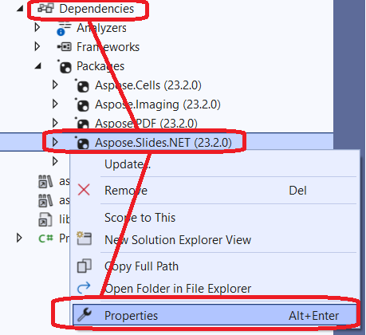

## **परिचय**

[Aspose.Slides 23.2](https://www.nuget.org/packages/Aspose.Slides.NET/23.2.0) से शुरू करके, .NET6 के लिए समर्थन लागू किया गया। इस समर्थन की विशेषता यह है कि .NET6 अब Linux के लिए System.Drawing.Common का समर्थन नहीं करता ([breaking change](https://learn.microsoft.com/en-us/dotnet/core/compatibility/core-libraries/6.0/system-drawing-common-windows-only)) और Slides इस ग्राफिकल सबसिस्टम को स्वयं C++ घटक के रूप में लागू करता है।

Aspose.Slides for .NET अब बिना GDI/libgdiplus निर्भरताओं के काम करता है:
* Windows
* Linux

_MacOS_ समर्थन प्रगति पर है।

## **AWS और Azure पर .NET 6 के लिए Slides का उपयोग**

क्लाउड (AWS, Azure या अन्य क्लाउड समाधान) पर उपयोग के लिए Aspose.Slides का पसंदीदा संस्करण .NET6 है।

पहले, जब Aspose.Slides को Linux होस्ट पर उपयोग किया जाता था, तो अतिरिक्त निर्भरताएँ (libgdiplus) स्थापित करनी पड़ती थीं और यह अक्सर असुविधाजनक या व्यावहारिक नहीं होती थी (उदाहरण के लिए, जब [AWS Lambda](https://aws.amazon.com/lambda) का उपयोग किया जाता है)। .NET6 के लिए Slides के साथ, उन निर्भरताओं की अब आवश्यकता नहीं रहती, इसलिए परिनियोजन बहुत आसान हो जाता है।

एक अन्य विचार यह है कि जब Aspose.Slides को Windows होस्ट वाले क्लाउड समाधान पर उपयोग किया जाता था, तो समस्याएँ उत्पन्न होती थीं। उदाहरण के लिए, [Azure Functions](https://learn.microsoft.com/en-us/azure/azure-functions/functions-overview) प्रक्रिया में सीमाएँ रखती हैं और PDF निर्यात संचालन के दौरान समस्याएँ उत्पन्न करती हैं (देखें [this](https://github.com/projectkudu/kudu/wiki/Azure-Web-App-sandbox#unsupported-frameworks))। .NET6 के लिए Aspose.Slides का उपयोग इस समस्या को हल करता है।

## **System.Drawing.Common पैकेज और .NET 6 के लिए Slides वर्गों का उपयोग (CS0433: Slides और System.Drawing.Common दोनों में प्रकार मौजूद है त्रुटि)**

कभी-कभी, प्रोजेक्ट में दोनों System.Drawing और Slides for .NET6 निर्भरताएँ उपयोग करनी पड़ती हैं (उदाहरण के लिए, जब .NET6 प्रोजेक्ट अन्य पैकेजों पर निर्भर करता है, जो बदले में System.Drawing पर निर्भर होते हैं)। इससे नीचे दिखाए गए जैसे भ्रम त्रुटियाँ हो सकती हैं:

* CS0433: प्रकार 'Image' दोनों 'Aspose.Slides, Version=23.2.0.0, Culture=neutral, PublicKeyToken=716fcc553a201e56' और 'System.Drawing.Common, Version=6.0.0.0' में मौजूद है
* CS0433: प्रकार 'Graphics' दोनों 'Aspose.Slides, Version=23.2.0.0, Culture=neutral, PublicKeyToken=716fcc553a201e56' और 'System.Drawing.Common, Version=6.0.0.0' में मौजूद है

ऐसे मामले में, आप Aspose.Slides (संस्करण 24.8 से कम) के लिए [extern alias](https://learn.microsoft.com/en-us/dotnet/csharp/language-reference/keywords/extern-alias) का उपयोग कर सकते हैं:
1) प्रोजेक्ट की निर्भरताओं में Aspose.Slides एसेम्बली चुनें और फिर **Properties** पर क्लिक करें।  
   
2) एक उपनाम सेट करें (उदाहरण के लिए, "Slides")।  
   

अब, System.Drawing.Common के प्रकार डिफ़ॉल्ट रूप से उपयोग किए जाएंगे। जहाँ Aspose.Slides प्रकारों की आवश्यकता हो, वहाँ बाहरी एसेम्बली उपनाम निर्दिष्ट किया जाना चाहिए।

```c#
extern alias Slides;
using Slides::Aspose.Slides;
```

पूरा उदाहरण:

```c#
extern alias Slides;
using Slides::Aspose.Slides;

static Slides::System.Drawing.Image GetThumbnail(Presentation pres)
{
    return pres.Slides[0].GetThumbnail();
}
```

संस्करण 24.8 से शुरू करके, System.Drawing पर निर्भरता वाले पुरानी सार्वजनिक API को हटा दिया गया है। ऊपर दिए गए कोड उदाहरण के संबंध में, आप स्लाइड छवि को नीचे की तरह प्राप्त कर सकते हैं।

```cs
static Aspose.Slides.IImage GetThumbnail(Presentation presentation)
{
    return presentation.Slides[0].GetImage();
}
```
नया API अधिक विस्तार से [Modern API](/slides/hi/net/modern-api/) में वर्णित है।