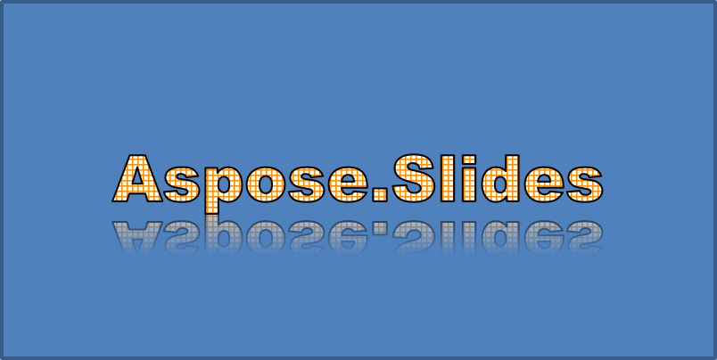
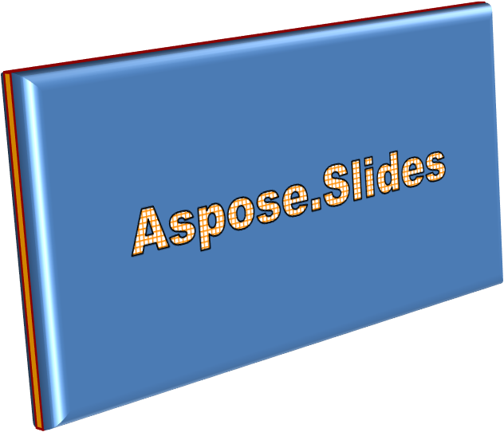

## **सारांश**

WordArt इफ़ेक्ट्स आपको अपने PowerPoint प्रेज़ेंटेशन में दृश्य रूप से आकर्षक, स्टाइलिश टेक्स्ट जोड़ने की अनुमति देते हैं। Aspose.Slides for .NET के साथ, डेवलपर्स प्रोग्रामेटिक रूप से WordArt बना, अनुकूलित और प्रबंधित कर सकते हैं, बिल्कुल Microsoft PowerPoint की तरह—बिना Office स्थापित किए। यह लेख .NET में WordArt के साथ काम करने का एक सारांश प्रदान करता है, जिसमें टेक्स्ट ट्रांसफ़ॉर्मेशन, फ़िल स्टाइल, आउटलाइन, शैडो और अन्य फ़ॉर्मैटिंग विकल्पों को लागू करने के तरीके शामिल हैं, जिससे आपकी प्रेज़ेंटेशन सामग्री अधिक अभिव्यक्तिपूर्ण और आकर्षक बनती है। WordArt आपको टेक्स्ट को एक ग्राफ़िकल ऑब्जेक्ट के रूप में ट्रीट करने की सुविधा देता है। यह टेक्स्ट पर लागू किए गए इफ़ेक्ट्स या विशेष संशोधनों से बनता है, जो इसे अधिक आकर्षक या उल्लेखनीय बनाते हैं।

## **एक सरल WordArt टेम्पलेट बनाएं और उसे टेक्स्ट पर लागू करें**

इस सेक्शन में, हम Aspose.Slides for .NET का उपयोग करके एक सरल WordArt टेम्पलेट बनाने और उसे टेक्स्ट पर लागू करने के तरीके का अन्वेषण करेंगे। WordArt टेक्स्ट के रूप को आकर्षक विज़ुअल इफ़ेक्ट्स और स्टाइल्स के साथ सहज रूप से सुधारने का आसान तरीका प्रदान करता है। WordArt बनाने और उपयोग करने के बुनियादी चरणों को सीखकर, आप इन तकनीकों को किसी भी प्रोजेक्ट के अनुरूप आसानी से अनुकूलित कर सकते हैं, जिससे आपकी प्रेज़ेंटेशन अधिक जीवंत और यादगार बनती हैं।

पहले, हम निम्नलिखित C# कोड का उपयोग करके साधारण टेक्स्ट बनाते हैं:

```cs
using (Presentation presentation = new Presentation())
{
    ISlide slide = presentation.Slides[0];

    IAutoShape autoShape = slide.Shapes.AddAutoShape(ShapeType.Rectangle, 20, 20, 400, 200);
    ITextFrame textFrame = autoShape.TextFrame;

    IPortion portion = textFrame.Paragraphs[0].Portions[0];
    portion.Text = "Aspose.Slides";
}
```

अब, हम प्रभाव को अधिक प्रमुख बनाने के लिए टेक्स्ट की फ़ॉन्ट हाइट को बड़े मान पर सेट करते हैं, निम्नलिखित कोड का उपयोग करके:

```cs
    portion.PortionFormat.LatinFont = new FontData("Arial Black");
    portion.PortionFormat.FontHeight = 36;
```

यहाँ, हम टेक्स्ट पर SmallGrid पैटर्न फ़िल लागू करते हैं और निम्नलिखित कोड का उपयोग करके चौड़ाई 1 के साथ काली टेक्स्ट बॉर्डर जोड़ते हैं:

```cs
    portion.PortionFormat.FillFormat.FillType = FillType.Pattern;
    portion.PortionFormat.FillFormat.PatternFormat.ForeColor.Color = Color.DarkOrange;
    portion.PortionFormat.FillFormat.PatternFormat.BackColor.Color = Color.White;
    portion.PortionFormat.FillFormat.PatternFormat.PatternStyle = PatternStyle.SmallGrid;
                
    portion.PortionFormat.LineFormat.FillFormat.FillType = FillType.Solid;
    portion.PortionFormat.LineFormat.FillFormat.SolidFillColor.Color = Color.Black;
```

परिणामस्वरूप टेक्स्ट:


## **अन्य WordArt प्रभाव लागू करें**

बुनियादी ट्रांसफ़ॉर्मेशन के अतिरिक्त, Aspose.Slides for .NET आपको अपने टेक्स्ट की उपस्थिति को बेहतर बनाने के लिए विभिन्न उन्नत WordArt इफ़ेक्ट्स लागू करने की सुविधा देता है। इनमें आउटलाइन, फ़िल, शैडो, रिफ्लेक्शन और ग्लो इफ़ेक्ट्स शामिल हैं। इन फ़ीचर्स को मिलाकर, आप आकर्षक टेक्स्ट स्टाइल बना सकते हैं जो आपके प्रेज़ेंटेशन में प्रमुख दिखते हैं। यह सेक्शन सरल, साफ़ कोड उदाहरणों का उपयोग करके इन इफ़ेक्ट्स को प्रोग्रामेटिक रूप से लागू करने का प्रदर्शन करता है।

### **बाहरी शैडो प्रभाव लागू करें**

बाहरी शैडो इफ़ेक्ट्स टेक्स्ट को उसके आउटलाइन के पीछे शैडो जोड़कर अधिक उभरा बनाते हैं, जिससे पृष्ठभूमि से गहराई और अलगाव का अहसास होता है। Aspose.Slides for .NET आपको WordArt टेक्स्ट पर बाहरी शैडो को आसानी से लागू और अनुकूलित करने की अनुमति देता है। इस सेक्शन में, आप शैडो का रंग, दिशा, दूरी, ब्लर रेडियस आदि सेट करना सीखेंगे ताकि वांछित विज़ुअल इम्पैक्ट प्राप्त हो सके।

निम्नलिखित C# कोड स्निपेट ऊपर बनाए गए टेक्स्ट पर शैडो इफ़ेक्ट लागू करता है।

```cs
    portion.PortionFormat.EffectFormat.EnableOuterShadowEffect();
    portion.PortionFormat.EffectFormat.OuterShadowEffect.ShadowColor.Color = Color.Black;
    portion.PortionFormat.EffectFormat.OuterShadowEffect.ScaleHorizontal = 100;
    portion.PortionFormat.EffectFormat.OuterShadowEffect.ScaleVertical = 100;
    portion.PortionFormat.EffectFormat.OuterShadowEffect.BlurRadius = 4;
    portion.PortionFormat.EffectFormat.OuterShadowEffect.Direction = 230;
    portion.PortionFormat.EffectFormat.OuterShadowEffect.Distance = 30;
    portion.PortionFormat.EffectFormat.OuterShadowEffect.SkewHorizontal = 20;
    portion.PortionFormat.EffectFormat.OuterShadowEffect.SkewVertical = 0;
    portion.PortionFormat.EffectFormat.OuterShadowEffect.ShadowColor.ColorTransform.Add(ColorTransformOperation.SetAlpha, 0.32f);
```

परिणामस्वरूप टेक्स्ट:


{} 
- जब OuterShadow और PresetShadow को एक साथ उपयोग किया जाता है, तो केवल OuterShadow प्रभाव लागू होता है।
- यदि OuterShadow और InnerShadow को एक साथ उपयोग किया जाता है, तो परिणामस्वरूप प्रभाव PowerPoint संस्करण पर निर्भर करता है। उदाहरण के लिए, PowerPoint 2013 में प्रभाव दूना होता है, जबकि PowerPoint 2007 में केवल OuterShadow प्रभाव लागू होता है।
{}

### **रिफ्लेक्शन प्रभाव लागू करें**

इस सेक्शन में, हम Aspose.Slides for .NET का उपयोग करके अपने स्लाइड्स में रिफ्लेक्शन इफ़ेक्ट्स लागू करने का तरीका समझेंगे। रिफ्लेक्शन इफ़ेक्ट्स आपके टेक्स्ट या शेप्स को स्टाइलिश और आधुनिक लुक देने का प्रभावी तरीका हो सकते हैं, जिससे प्रमुख तत्व उभरते हैं और आपकी प्रेज़ेंटेशन में गहराई जुड़ती है। इन इफ़ेक्ट्स को लागू और अनुकूलित करने की प्रक्रिया को समझकर, आप इन्हें अपनी डिज़ाइन ज़रूरतों और ब्रांडिंग आवश्यकताओं के अनुसार आसानी से अनुकूलित कर सकते हैं।

निम्नलिखित C# कोड उदाहरण का उपयोग करके टेक्स्ट में रिफ्लेक्शन इफ़ेक्ट जोड़ें:

```cs
    portion.PortionFormat.EffectFormat.EnableReflectionEffect();
    portion.PortionFormat.EffectFormat.ReflectionEffect.BlurRadius = 0.5; 
    portion.PortionFormat.EffectFormat.ReflectionEffect.Distance = 4.72; 
    portion.PortionFormat.EffectFormat.ReflectionEffect.StartPosAlpha = 0f; 
    portion.PortionFormat.EffectFormat.ReflectionEffect.EndPosAlpha = 60f; 
    portion.PortionFormat.EffectFormat.ReflectionEffect.Direction = 90; 
    portion.PortionFormat.EffectFormat.ReflectionEffect.ScaleHorizontal = 100; 
    portion.PortionFormat.EffectFormat.ReflectionEffect.ScaleVertical = -100;
    portion.PortionFormat.EffectFormat.ReflectionEffect.StartReflectionOpacity = 60f;
    portion.PortionFormat.EffectFormat.ReflectionEffect.EndReflectionOpacity = 0.9f;
    portion.PortionFormat.EffectFormat.ReflectionEffect.RectangleAlign = RectangleAlignment.BottomLeft;   
```

परिणामस्वरूप टेक्स्ट:



### **ग्लो प्रभाव लागू करें**

इस सेक्शन में, हम Aspose.Slides for .NET का उपयोग करके टेक्स्ट पर ग्लो इफ़ेक्ट लागू करने का तरीका देखेंगे। ग्लो इफ़ेक्ट आपके टेक्स्ट को चमकदार आउटलाइन के साथ उभरने में मदद करता है, जिससे आपकी स्लाइड्स की दृश्य अपील बढ़ती है। रंग और तीव्रता जैसे सेटिंग्स को समायोजित करके, आप ग्लो को अपनी डिज़ाइन और ब्रांडिंग जरूरतों के अनुसार आसानी से अनुकूलित कर सकते हैं, जिससे आपका प्रमुख बिंदु दर्शकों का ध्यान आकर्षित करता है।

निम्नलिखित कोड का उपयोग करके टेक्स्ट पर ग्लो इफ़ेक्ट लागू करके इसे चमकदार बनाएं:

```cs
    portion.PortionFormat.EffectFormat.EnableGlowEffect();
    portion.PortionFormat.EffectFormat.GlowEffect.Color.R = 255;
    portion.PortionFormat.EffectFormat.GlowEffect.Color.ColorTransform.Add(ColorTransformOperation.SetAlpha, 0.54f);
    portion.PortionFormat.EffectFormat.GlowEffect.Radius = 7;
```

परिणामस्वरूप टेक्स्ट:


### **WordArt ट्रांसफ़ॉर्मेशन लागू करें**

इस सेक्शन में, हम Aspose.Slides for .NET के साथ WordArt में ट्रांसफ़ॉर्मेशन का उपयोग कैसे करें, इसका अन्वेषण करेंगे। ट्रांसफ़ॉर्मेशन आपको टेक्स्ट को मोड़ने, खींचने या विकृत करने की अनुमति देते हैं, जिससे अद्वितीय और दृश्य रूप से आकर्षक इफ़ेक्ट्स बनते हैं। इन तकनीकों में निपुण होकर, आप टेक्स्ट आकार और स्टाइल्स को अपनी ब्रांडिंग या रचनात्मक दृष्टि के अनुसार आसानी से अनुकूलित कर सकते हैं, जिससे आपकी प्रेज़ेंटेशन प्रभावशाली और परिष्कृत बनती है।

पूरे टेक्स्ट ब्लॉक पर लागू होने वाली `Transform` प्रॉपर्टी का उपयोग निम्नलिखित कोड से करें:

```cs
    textFrame.TextFrameFormat.Transform = TextShapeType.ArchUpPour;
```

परिणामस्वरूप टेक्स्ट:


{} 
Aspose.Slides for .NET पूर्वनिर्धारित [transformation types](https://reference.aspose.com/slides/hi/net/aspose.slides/textshapetype/) का एक सेट प्रदान करता है।
{} 

### **Shapes और टेक्स्ट पर 3D प्रभाव लागू करें**

वास्तविक, आँखें पकड़ने वाले विज़ुअल बनाना आपकी प्रेज़ेंटेशन के प्रभाव को काफी बढ़ा सकता है। इस सेक्शन में, हम Aspose.Slides for .NET का उपयोग करके शेप्स पर थ्री‑डायमेंशनल (3D) इफ़ेक्ट्स लागू करने का तरीका देखेंगे। गहराई, कोण और लाइटिंग जैसे पैरामीटर्स को नियंत्रित करके, आप प्रभावशाली 3D ट्रांसफ़ॉर्मेशन बना सकते हैं जो तुरंत दर्शकों का ध्यान आकर्षित करते हैं। चाहे आप सूक्ष्म हाइलाइट्स चाहते हों या नाटकीय भ्रम, ये फ़ीचर आपके डिज़ाइन को ऊँचा उठाने और विचारों को अधिक आकर्षक तरीके से प्रस्तुत करने के लचीले तरीके प्रदान करते हैं।

शेप पर 3D इफ़ेक्ट सेट करने के लिए नीचे दिया गया सैंपल कोड उपयोग करें:

```cs
    autoShape.ThreeDFormat.BevelBottom.BevelType = BevelPresetType.Circle;
    autoShape.ThreeDFormat.BevelBottom.Height = 10.5;
    autoShape.ThreeDFormat.BevelBottom.Width = 10.5;

    autoShape.ThreeDFormat.BevelTop.BevelType = BevelPresetType.Circle;
    autoShape.ThreeDFormat.BevelTop.Height = 12.5;
    autoShape.ThreeDFormat.BevelTop.Width = 11;

    autoShape.ThreeDFormat.ExtrusionColor.Color = Color.Orange;
    autoShape.ThreeDFormat.ExtrusionHeight = 6;

    autoShape.ThreeDFormat.ContourColor.Color = Color.DarkRed;
    autoShape.ThreeDFormat.ContourWidth = 1.5;

    autoShape.ThreeDFormat.Depth = 3;

    autoShape.ThreeDFormat.Material = MaterialPresetType.Plastic;

    autoShape.ThreeDFormat.LightRig.Direction = LightingDirection.Top;
    autoShape.ThreeDFormat.LightRig.LightType = LightRigPresetType.Balanced;
    autoShape.ThreeDFormat.LightRig.SetRotation(0, 0, 40);

    autoShape.ThreeDFormat.Camera.CameraType = CameraPresetType.PerspectiveContrastingRightFacing;
```

परिणामस्वरूप शेप:



टेक्स्ट पर 3D इफ़ेक्ट सेट करने के लिए नीचे दिया गया सैंपल कोड उपयोग करें:

```cs
    textFrame.TextFrameFormat.ThreeDFormat.BevelBottom.BevelType = BevelPresetType.Circle;
    textFrame.TextFrameFormat.ThreeDFormat.BevelBottom.Height = 3.5;
    textFrame.TextFrameFormat.ThreeDFormat.BevelBottom.Width = 3.5;

    textFrame.TextFrameFormat.ThreeDFormat.BevelTop.BevelType = BevelPresetType.Circle;
    textFrame.TextFrameFormat.ThreeDFormat.BevelTop.Height = 4;
    textFrame.TextFrameFormat.ThreeDFormat.BevelTop.Width = 4;

    textFrame.TextFrameFormat.ThreeDFormat.ExtrusionColor.Color = Color.Orange;
    textFrame.TextFrameFormat.ThreeDFormat.ExtrusionHeight= 6;

    textFrame.TextFrameFormat.ThreeDFormat.ContourColor.Color = Color.DarkRed;
    textFrame.TextFrameFormat.ThreeDFormat.ContourWidth = 1.5;

    textFrame.TextFrameFormat.ThreeDFormat.Depth= 3;

    textFrame.TextFrameFormat.ThreeDFormat.Material = MaterialPresetType.Plastic;

    textFrame.TextFrameFormat.ThreeDFormat.LightRig.Direction = LightingDirection.Top;
    textFrame.TextFrameFormat.ThreeDFormat.LightRig.LightType = LightRigPresetType.Balanced;
    textFrame.TextFrameFormat.ThreeDFormat.LightRig.SetRotation(0, 0, 40);

    textFrame.TextFrameFormat.ThreeDFormat.Camera.CameraType = CameraPresetType.PerspectiveContrastingRightFacing;
```

परिणामस्वरूप टेक्स्ट:


{} 
टेक्स्ट या उनके शेप्स पर 3D इफ़ेक्ट्स का अनुप्रयोग—और इन इफ़ेक्ट्स के बीच की इंटरैक्शन—विशिष्ट नियमों द्वारा नियंत्रित होती है। कल्पना करें कि एक सीन में टेक्स्ट और उस टेक्स्ट को समाहित करने वाला शेप दोनों शामिल हैं। एक 3D इफ़ेक्ट ऑब्जेक्ट के 3D प्रतिनिधित्व और उस सीन को शामिल करता है जिसमें वह रखा गया है।

- यदि शेप और टेक्स्ट दोनों के लिए सीन सेट किया गया है, तो शेप का सीन प्राथमिकता लेता है और टेक्स्ट का सीन अनदेखा किया जाता है।
- यदि शेप का अपना सीन नहीं है लेकिन उसका 3D प्रतिनिधित्व है, तो टेक्स्ट का सीन उपयोग किया जाता है।
- यदि शेप में कोई 3D इफ़ेक्ट नहीं है, तो उसे फ्लैट माना जाता है, और 3D इफ़ेक्ट केवल टेक्स्ट पर लागू होता है।

ये व्यवहार [ThreeDFormat.LightRig](https://reference.aspose.com/slides/hi/net/aspose.slides/threedformat/lightrig/) और [ThreeDFormat.Camera](https://reference.aspose.com/slides/hi/net/aspose.slides/threedformat/camera/) प्रॉपर्टीज़ से संबंधित हैं।
{} 

## **अक्सर पूछे जाने वाले प्रश्न**

**क्या मैं विभिन्न फ़ॉन्ट्स या स्क्रिप्ट्स (जैसे अरबी, चीनी) के साथ WordArt प्रभावों का उपयोग कर सकता हूँ?**

हाँ, Aspose.Slides for .NET यूनिकोड का समर्थन करता है और सभी प्रमुख फ़ॉन्ट्स एवं स्क्रिप्ट्स के साथ काम करता है। शैडो, फ़िल और आउटलाइन जैसे WordArt इफ़ेक्ट्स भाषा की परवाह किए बिना लागू किए जा सकते हैं, हालांकि फ़ॉन्ट उपलब्धता और रेंडरिंग सिस्टम फ़ॉन्ट्स पर निर्भर हो सकती है।

**क्या मैं स्लाइड मास्टर एलिमेंट्स पर WordArt इफ़ेक्ट्स लागू कर सकता हूँ?**

हां, आप मास्टर स्लाइड्स पर मौजूद शेप्स, जैसे टाइटल प्लेसहोल्डर्स, फुटर्स या बैकग्राउंड टेक्स्ट, पर WordArt इफ़ेक्ट्स लागू कर सकते हैं। मास्टर लेआउट में किए गए बदलाव सभी संबंधित स्लाइड्स में प्रतिबिंबित होते हैं।

**क्या WordArt इफ़ेक्ट्स प्रेज़ेंटेशन फ़ाइल आकार को प्रभावित करते हैं?**

हल्का असर पड़ता है। शैडो, ग्लो और ग्रेडिएंट फ़िल जैसे इफ़ेक्ट्स फ़ॉर्मेटिंग मेटाडाटा जोड़ते हैं, जिससे फ़ाइल आकार थोड़ा बढ़ सकता है, लेकिन अंतर आमतौर पर नगण्य होता है।

**क्या मैं प्रेज़ेंटेशन को सेव किए बिना WordArt इफ़ेक्ट्स का परिणाम प्रीव्यू कर सकता हूँ?**

हां, आप [IShape](https://reference.aspose.com/slides/hi/net/aspose.slides/ishape/) या [ISlide](https://reference.aspose.com/slides/hi/net/aspose.slides/islide/) इंटरफ़ेस की `GetImage` मेथड का उपयोग करके WordArt युक्त स्लाइड्स को इमेज (जैसे PNG, JPEG) में रेंडर कर सकते हैं। यह आपको पूरी प्रेज़ेंटेशन को सेव या एक्सपोर्ट करने से पहले मेमोरी या स्क्रीन पर परिणाम का प्रीव्यू देखने की सुविधा देता है।