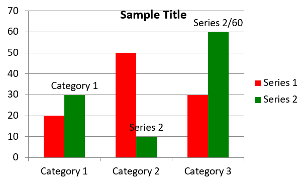

## **समग्र दृष्टिकोण**

यह लेख Aspose.Slides for .NET का उपयोग करके चार्ट बनाने और कस्टमाइज़ करने के लिए एक व्यापक मार्गदर्शिका प्रदान करता है। आप प्रोग्रामेटिक रूप से स्लाइड में चार्ट जोड़ना, उसे डेटा से भरना, और विभिन्न फ़ॉर्मेटिंग विकल्प लागू करके अपने विशिष्ट डिज़ाइन आवश्यकताओं के अनुरूप बनाना सीखेंगे। पूरे लेख में विस्तृत कोड उदाहरण प्रत्येक चरण को दर्शाते हैं, प्रस्तुति और चार्ट ऑब्जेक्ट को इनिशियलाइज़ करने से लेकर सीरीज़, एक्सिस और लेजेंड को कॉन्फ़िगर करने तक। इस मार्गदर्शिका का पालन करके, आप अपने .NET एप्लिकेशन में डायनामिक चार्ट जेनरेशन को इंटीग्रेट करने की ठोस समझ प्राप्त करेंगे, जिससे डेटा-ड्रिवेन प्रस्तुति बनाने की प्रक्रिया सरल हो जाएगी।

## **एक चार्ट बनाएँ**

चार्ट लोगों को जल्दी से डेटा को विज़ुअलाइज़ करने और उन अंतर्दृष्टियों को प्राप्त करने में मदद करते हैं जो तालिका या स्प्रेडशीट से तुरंत स्पष्ट नहीं होते।

**चार्ट क्यों बनाएं?**

चार्ट का उपयोग करके आप:

* बड़े पैमाने पर डेटा को एक ही स्लाइड में संक्षिप्त या सारांशित कर सकते हैं;
* डेटा में पैटर्न और ट्रेंड्स को उजागर कर सकते हैं;
* समय के साथ या किसी विशिष्ट माप इकाई के सापेक्ष डेटा की दिशा और गति को समझ सकते हैं;
* आउट्लायर्स, विसंगतियों, विचलनों, त्रुटियों और बेकार डेटा की पहचान कर सकते हैं;
* जटिल डेटा को प्रभावी ढंग से संप्रेषित या प्रस्तुत कर सकते हैं।

PowerPoint में, आप *Insert* फ़ंक्शन के माध्यम से चार्ट बना सकते हैं, जो कई प्रकार के चार्ट डिजाइन टेम्प्लेट प्रदान करता है। Aspose.Slides का उपयोग करके आप नियमित चार्ट (लोकप्रिय चार्ट प्रकारों पर आधारित) और कस्टम चार्ट दोनों बना सकते हैं।

{} 
[Aspose.Slides.Charts](https://reference.aspose.com/slides/net/aspose.slides.charts/) नेमस्पेस के अंतर्गत [ChartType](https://reference.aspose.com/slides/net/aspose.slides.charts/charttype/) एनेमरेशन का उपयोग करें। इस एनेमरेशन के मान विभिन्न चार्ट प्रकारों के अनुरूप होते हैं।
{} 

### **क्लस्टर्ड कॉलम चार्ट बनाएं**

यह अनुभाग Aspose.Slides for .NET का उपयोग करके क्लस्टर्ड कॉलम चार्ट बनाने की विधि बताता है। आप प्रस्तुति को इनिशियलाइज़ करना, चार्ट जोड़ना, तथा शीर्षक, डेटा, सीरीज़, श्रेणियाँ और स्टाइलिंग जैसे तत्वों को कस्टमाइज़ करना सीखेंगे। नीचे दिए गए चरणों का पालन करके देखें कि एक मानक क्लस्टर्ड कॉलम चार्ट कैसे उत्पन्न होता है:

1. Create an instance of the [Presentation](https://reference.aspose.com/slides/net/aspose.slides/presentation) class.
1. Get a reference to a slide using its index.
1. Add a chart with some data and specify the `ChartType.ClusteredColumn` type.
1. Add a title to the chart.
1. Access the chart's data worksheet.
1. Clear all the default series and categories.
1. Add new series and categories.
1. Add new chart data for the chart series.
1. Apply a fill color to the chart series.
1. Add labels to the chart series.
1. Save the modified presentation as a PPTX file.

This C# code demonstrates how to create a clustered column chart:

```c#
using System.Drawing;
using Aspose.Slides;
using Aspose.Slides.Charts;
using Aspose.Slides.Export;

// Instantiate the Presentation class.
using (Presentation presentation = new Presentation())
{
    // Access the first slide.
    ISlide slide = presentation.Slides[0];

    // Add a clustered column chart with its default data.
    IChart chart = slide.Shapes.AddChart(ChartType.ClusteredColumn, 20, 20, 500, 300);

    // Set the chart title.
    chart.ChartTitle.AddTextFrameForOverriding("Sample Title");
    chart.ChartTitle.TextFrameForOverriding.TextFrameFormat.CenterText = NullableBool.True;
    chart.ChartTitle.Height = 20;
    chart.HasTitle = true;

    // Set the index of the chart data sheet.
    int worksheetIndex = 0;

    // Get the chart data workbook.
    IChartDataWorkbook workbook = chart.ChartData.ChartDataWorkbook;

    // Delete the default generated series and categories.
    chart.ChartData.Series.Clear();
    chart.ChartData.Categories.Clear();

    // Add new series.
    chart.ChartData.Series.Add(workbook.GetCell(worksheetIndex, 0, 1, "Series 1"), chart.Type);
    chart.ChartData.Series.Add(workbook.GetCell(worksheetIndex, 0, 2, "Series 2"), chart.Type);

    // Add new categories.
    chart.ChartData.Categories.Add(workbook.GetCell(worksheetIndex, 1, 0, "Category 1"));
    chart.ChartData.Categories.Add(workbook.GetCell(worksheetIndex, 2, 0, "Category 2"));
    chart.ChartData.Categories.Add(workbook.GetCell(worksheetIndex, 3, 0, "Category 3"));

    // Get the first chart series.
    IChartSeries series = chart.ChartData.Series[0];

    // Populate the series data.
    series.DataPoints.AddDataPointForBarSeries(workbook.GetCell(worksheetIndex, 1, 1, 20));
    series.DataPoints.AddDataPointForBarSeries(workbook.GetCell(worksheetIndex, 2, 1, 50));
    series.DataPoints.AddDataPointForBarSeries(workbook.GetCell(worksheetIndex, 3, 1, 30));

    // Set the fill color for the series.
    series.Format.Fill.FillType = FillType.Solid;
    series.Format.Fill.SolidFillColor.Color = Color.Red;

    // Get the second chart series.
    series = chart.ChartData.Series[1];

    // Populate the series data.
    series.DataPoints.AddDataPointForBarSeries(workbook.GetCell(worksheetIndex, 1, 2, 30));
    series.DataPoints.AddDataPointForBarSeries(workbook.GetCell(worksheetIndex, 2, 2, 10));
    series.DataPoints.AddDataPointForBarSeries(workbook.GetCell(worksheetIndex, 3, 2, 60));

    // Set the fill color for the series.
    series.Format.Fill.FillType = FillType.Solid;
    series.Format.Fill.SolidFillColor.Color = Color.Green;

    // Set the first label to show the category name.
    IDataLabel label = series.DataPoints[0].Label;
    label.DataLabelFormat.ShowCategoryName = true;

    label = series.DataPoints[1].Label;
    label.DataLabelFormat.ShowSeriesName = true;

    // Set the series to show the value for the third label.
    label = series.DataPoints[2].Label;
    label.DataLabelFormat.ShowValue = true;
    label.DataLabelFormat.ShowSeriesName = true;
    label.DataLabelFormat.Separator = "/";

    // Save the presentation to disk as a PPTX file.
    presentation.Save("AsposeChart_out.pptx", SaveFormat.Pptx);
}
```

परिणाम:



### **स्कैटर चार्ट बनाएं**

स्कैटर चार्ट (जिसे स्कैटर प्लॉट या x-y ग्राफ़ भी कहते हैं) अक्सर दो परिवर्तनीयों के बीच पैटर्न या सहसंबंध जांचने के लिए उपयोग किए जाते हैं।

जब आप स्कैटर चार्ट का उपयोग करें:

* आपके पास युग्मित संख्यात्मक डेटा हो।
* दो परिवर्तनीय एक साथ अच्छी तरह से मेल खाते हों।
* आप यह निर्धारित करना चाहते हों कि दोनों परिवर्तनीय संबंधित हैं या नहीं।
* आपके पास एक स्वतंत्र परिवर्तनीय हो जिसके लिए आश्रित परिवर्तनीय के कई मान हों।

This C# code shows you how to create a scatter chart with a different series of markers:

```c#
using Aspose.Slides;
using Aspose.Slides.Charts;
using Aspose.Slides.Export;

// Instantiate the Presentation class.
using (Presentation presentation = new Presentation())
{
    // Access the first slide.
    ISlide slide = presentation.Slides[0];

    // Create the default scatter chart.
    IChart chart = slide.Shapes.AddChart(ChartType.ScatterWithSmoothLines, 20, 20, 500, 300);

    // Set the index of the chart data sheet.
    int worksheetIndex = 0;

    // Get the chart data workbook.
    IChartDataWorkbook workbook = chart.ChartData.ChartDataWorkbook;

    // Delete the default series.
    chart.ChartData.Series.Clear();

    // Add new series.
    chart.ChartData.Series.Add(workbook.GetCell(worksheetIndex, 1, 1, "Series 1"), chart.Type);
    chart.ChartData.Series.Add(workbook.GetCell(worksheetIndex, 1, 3, "Series 2"), chart.Type);

    // Get the first chart series.
    IChartSeries series = chart.ChartData.Series[0];

    // Add a new point (1:3) to the series.
    series.DataPoints.AddDataPointForScatterSeries(workbook.GetCell(worksheetIndex, 2, 1, 1), workbook.GetCell(worksheetIndex, 2, 2, 3));

    // Add a new point (2:10).
    series.DataPoints.AddDataPointForScatterSeries(workbook.GetCell(worksheetIndex, 3, 1, 2), workbook.GetCell(worksheetIndex, 3, 2, 10));

    // Change the series type.
    series.Type = ChartType.ScatterWithStraightLinesAndMarkers;

    // Change the chart series marker.
    series.Marker.Size = 10;
    series.Marker.Symbol = MarkerStyleType.Star;

    // Get the second chart series.
    series = chart.ChartData.Series[1];

    // Add a new point (5:2) to the chart series.
    series.DataPoints.AddDataPointForScatterSeries(workbook.GetCell(worksheetIndex, 2, 3, 5), workbook.GetCell(worksheetIndex, 2, 4, 2));

    // Add a new point (3:1).
    series.DataPoints.AddDataPointForScatterSeries(workbook.GetCell(worksheetIndex, 3, 3, 3), workbook.GetCell(worksheetIndex, 3, 4, 1));

    // Add a new point (2:2).
    series.DataPoints.AddDataPointForScatterSeries(workbook.GetCell(worksheetIndex, 4, 3, 2), workbook.GetCell(worksheetIndex, 4, 4, 2));

    // Add a new point (5:1).
    series.DataPoints.AddDataPointForScatterSeries(workbook.GetCell(worksheetIndex, 5, 3, 5), workbook.GetCell(worksheetIndex, 5, 4, 1));

    // Change the chart series marker.
    series.Marker.Size = 10;
    series.Marker.Symbol = MarkerStyleType.Circle;

    // Save the presentation to disk as a PPTX file.
    presentation.Save("AsposeChart_out.pptx", SaveFormat.Pptx);
}
```

परिणाम:


### **पाई चार्ट बनाएं**

पाई चार्ट डेटा में भाग-से-पूर्ण संबंध दिखाने के लिए सबसे उपयुक्त होते हैं, विशेष रूप से जब डेटा में श्रेणीय लेबल्स के साथ संख्यात्मक मान हों। हालांकि, यदि आपके डेटा में कई भाग या लेबल हों, तो आप बार चार्ट का उपयोग करने पर विचार कर सकते हैं।

1. Create an instance of the [Presentation](https://reference.aspose.com/slides/net/aspose.slides/presentation) class.
1. Get a reference to a slide using its index.
1. Add a chart with default data and specify the `ChartType.Pie` type.
1. Access the chart's data workbook ([IChartDataWorkbook](https://reference.aspose.com/slides/net/aspose.slides.charts/ichartdataworkbook/)).
1. Clear the default series and categories.
1. Add new series and categories.
1. Add new chart data for the chart series.
1. Add new points for the chart and apply custom colors to the pie chart's sectors.
1. Set labels for the series.
1. Enable leader lines for the series labels.
1. Set the rotation angle for the pie chart.
1. Save the modified presentation as a PPTX file.

This C# code shows you how to create a pie chart:

```c#
using System.Drawing;
using Aspose.Slides;
using Aspose.Slides.Charts;
using Aspose.Slides.Export;

// Presentation क्लास का इंस्टेंस बनाएं।
using (Presentation presentation = new Presentation())
{
    // पहली स्लाइड तक पहुंचें।
    ISlide slide = presentation.Slides[0];

    // डिफ़ॉल्ट डेटा के साथ एक चार्ट जोड़ें।
    IChart chart = slide.Shapes.AddChart(ChartType.Pie, 20, 20, 500, 300);

    // चार्ट शीर्षक सेट करें।
    chart.ChartTitle.AddTextFrameForOverriding("Sample Title");
    chart.ChartTitle.TextFrameForOverriding.TextFrameFormat.CenterText = NullableBool.True;
    chart.ChartTitle.Height = 20;
    chart.HasTitle = true;

    // पहली सीरीज़ को मान दिखाने के लिए सेट करें।
    chart.ChartData.Series[0].Labels.DefaultDataLabelFormat.ShowValue = true;

    // चार्ट डेटा शीट का इंडेक्स सेट करें।
    int worksheetIndex = 0;

    // चार्ट डेटा वर्कबुक प्राप्त करें।
    IChartDataWorkbook workbook = chart.ChartData.ChartDataWorkbook;

    // डिफ़ॉल्ट जेनरेटेड सीरीज़ और श्रेणियों को हटाएं।
    chart.ChartData.Series.Clear();
    chart.ChartData.Categories.Clear();

    // नयी श्रेणियाँ जोड़ें।
    chart.ChartData.Categories.Add(workbook.GetCell(0, 1, 0, "1st Qtr"));
    chart.ChartData.Categories.Add(workbook.GetCell(0, 2, 0, "2nd Qtr"));
    chart.ChartData.Categories.Add(workbook.GetCell(0, 3, 0, "3rd Qtr"));

    // नयी सीरीज़ जोड़ें।
    IChartSeries series = chart.ChartData.Series.Add(workbook.GetCell(0, 0, 1, "Series 1"), chart.Type);

    // सीरीज़ डेटा भरें।
    series.DataPoints.AddDataPointForPieSeries(workbook.GetCell(worksheetIndex, 1, 1, 20));
    series.DataPoints.AddDataPointForPieSeries(workbook.GetCell(worksheetIndex, 2, 1, 50));
    series.DataPoints.AddDataPointForPieSeries(workbook.GetCell(worksheetIndex, 3, 1, 30));

    // सेक्टोर का रंग सेट करें।
    chart.ChartData.SeriesGroups[0].IsColorVaried = true;

    IChartDataPoint point = series.DataPoints[0];
    point.Format.Fill.FillType = FillType.Solid;
    point.Format.Fill.SolidFillColor.Color = Color.Cyan;

    // सेक्टोर की बॉर्डर सेट करें।
    point.Format.Line.FillFormat.FillType = FillType.Solid;
    point.Format.Line.FillFormat.SolidFillColor.Color = Color.Gray;
    point.Format.Line.Width = 3.0;
    point.Format.Line.Style = LineStyle.ThinThick;
    point.Format.Line.DashStyle = LineDashStyle.LargeDash;

    IChartDataPoint point1 = series.DataPoints[1];
    point1.Format.Fill.FillType = FillType.Solid;
    point1.Format.Fill.SolidFillColor.Color = Color.Brown;

    // सेक्टोर की बॉर्डर सेट करें।
    point1.Format.Line.FillFormat.FillType = FillType.Solid;
    point1.Format.Line.FillFormat.SolidFillColor.Color = Color.Blue;
    point1.Format.Line.Width = 3.0;
    point1.Format.Line.Style = LineStyle.Single;
    point1.Format.Line.DashStyle = LineDashStyle.LargeDashDot;

    IChartDataPoint point2 = series.DataPoints[2];
    point2.Format.Fill.FillType = FillType.Solid;
    point2.Format.Fill.SolidFillColor.Color = Color.Coral;

    // सेक्टोर की बॉर्डर सेट करें।
    point2.Format.Line.FillFormat.FillType = FillType.Solid;
    point2.Format.Line.FillFormat.SolidFillColor.Color = Color.Red;
    point2.Format.Line.Width = 2.0;
    point2.Format.Line.Style = LineStyle.ThinThin;
    point2.Format.Line.DashStyle = LineDashStyle.LargeDashDotDot;

    // नयी सीरीज़ की प्रत्येक श्रेणी के लिए कस्टम लेबल बनाएं।
    IDataLabel label1 = series.DataPoints[0].Label;

    label1.DataLabelFormat.ShowValue = true;

    IDataLabel label2 = series.DataPoints[1].Label;
    label2.DataLabelFormat.ShowValue = true;
    label2.DataLabelFormat.ShowLegendKey = true;
    label2.DataLabelFormat.ShowPercentage = true;

    IDataLabel label3 = series.DataPoints[2].Label;
    label3.DataLabelFormat.ShowSeriesName = true;
    label3.DataLabelFormat.ShowPercentage = true;

    // चार्ट के लिए लीडर लाइन्स दिखाने के लिए सीरीज़ सेट करें।
    series.Labels.DefaultDataLabelFormat.ShowLeaderLines = true;

    // पाई चार्ट के सेक्टरों के लिए घूर्णन कोण सेट करें।
    chart.ChartData.SeriesGroups[0].FirstSliceAngle = 180;

    // प्रेजेंटेशन को डिस्क पर PPTX फ़ाइल के रूप में सेव करें।
    presentation.Save("PieChart_out.pptx", SaveFormat.Pptx);
}
```

परिणाम:


### **लाइन चार्ट बनाएं**

लाइन चार्ट (जिसे लाइन ग्राफ़ भी कहा जाता है) सबसे उपयुक्त होते हैं जब आप समय के साथ मानों में परिवर्तन दिखाना चाहते हैं। लाइन चार्ट के माध्यम से आप बड़ी मात्रा में डेटा को एक साथ तुलना कर सकते हैं, समय के साथ परिवर्तन और ट्रेंड ट्रैक कर सकते हैं, डेटा सीरीज़ में विसंगतियों को उजागर कर सकते हैं, आदि।

1. Create an instance of the [Presentation](https://reference.aspose.com/slides/net/aspose.slides/presentation) class.
1. Get a reference to a slide using its index.
1. Add a chart with default data and specify the `ChartType.Line` type.
1. Access the chart's data workbook ([IChartDataWorkbook](https://reference.aspose.com/slides/net/aspose.slides.charts/ichartdataworkbook/)).
1. Clear the default series and categories.
1. Add new series and categories.
1. Add new chart data for the chart series.
1. Save the modified presentation as a PPTX file.

This C# code shows you how to create a line chart:

```c#
using Aspose.Slides;
using Aspose.Slides.Charts;
using Aspose.Slides.Export;

using (Presentation presentation = new Presentation())
{
    IChart lineChart = presentation.Slides[0].Shapes.AddChart(ChartType.Line, 20, 20, 500, 300);

    presentation.Save("lineChart.pptx", SaveFormat.Pptx);
}
```

डिफ़ॉल्ट रूप से, लाइन चार्ट में बिंदुओं को सीधी सतत रेखाओं से जोड़ा जाता है। यदि आप बिंदुओं को डैश द्वारा जोड़ना चाहते हैं, तो आप नीचे दिखाए अनुसार डैश प्रकार निर्दिष्ट कर सकते हैं:

```c#
using Aspose.Slides;
using Aspose.Slides.Charts;

using (Presentation presentation = new Presentation())
{
    IChart lineChart = presentation.Slides[0].Shapes.AddChart(ChartType.Line, 20, 20, 500, 300);

    foreach (IChartSeries series in lineChart.ChartData.Series)
    {
        series.Format.Line.DashStyle = LineDashStyle.Dash;
    }
}
```

परिणाम:


### **ट्री मैप चार्ट बनाएं**

ट्री मैप चार्ट उन बिक्री डेटा के लिए सबसे उपयुक्त होते हैं जब आप डेटा श्रेणियों के सापेक्ष आकार दिखाना चाहते हैं और प्रत्येक श्रेणी में बड़े योगदानकर्ता आइटम्स पर जल्दी से ध्यान आकर्षित करना चाहते हैं।

1. Create an instance of the [Presentation](https://reference.aspose.com/slides/net/aspose.slides/presentation) class.
1. Get a reference to a slide using its index.
1. Add a chart with default data and specify the `ChartType.Treemap` type.
1. Access the chart's data workbook ([IChartDataWorkbook](https://reference.aspose.com/slides/net/aspose.slides.charts/ichartdataworkbook/)).
1. Clear the default series and categories.
1. Add new series and categories.
1. Add new chart data for the chart series.
1. Save the modified presentation as a PPTX file.

This C# code shows you how to create a tree map chart:

```c#
using Aspose.Slides;
using Aspose.Slides.Charts;
using Aspose.Slides.Export;

using (Presentation presentation = new Presentation())
{
    IChart chart = presentation.Slides[0].Shapes.AddChart(ChartType.Treemap, 20, 20, 500, 300);
    chart.ChartData.Categories.Clear();
    chart.ChartData.Series.Clear();

    IChartDataWorkbook workbook = chart.ChartData.ChartDataWorkbook;
    workbook.Clear(0);

    // शाखा 1
    IChartCategory leaf = chart.ChartData.Categories.Add(workbook.GetCell(0, "C1", "Leaf1"));
    leaf.GroupingLevels.SetGroupingItem(1, "Stem1");
    leaf.GroupingLevels.SetGroupingItem(2, "Branch1");

    chart.ChartData.Categories.Add(workbook.GetCell(0, "C2", "Leaf2"));

    leaf = chart.ChartData.Categories.Add(workbook.GetCell(0, "C3", "Leaf3"));
    leaf.GroupingLevels.SetGroupingItem(1, "Stem2");

    chart.ChartData.Categories.Add(workbook.GetCell(0, "C4", "Leaf4"));

    // शाखा 2
    leaf = chart.ChartData.Categories.Add(workbook.GetCell(0, "C5", "Leaf5"));
    leaf.GroupingLevels.SetGroupingItem(1, "Stem3");
    leaf.GroupingLevels.SetGroupingItem(2, "Branch2");

    chart.ChartData.Categories.Add(workbook.GetCell(0, "C6", "Leaf6"));

    leaf = chart.ChartData.Categories.Add(workbook.GetCell(0, "C7", "Leaf7"));
    leaf.GroupingLevels.SetGroupingItem(1, "Stem4");

    chart.ChartData.Categories.Add(workbook.GetCell(0, "C8", "Leaf8"));

    IChartSeries series = chart.ChartData.Series.Add(ChartType.Treemap);
    series.Labels.DefaultDataLabelFormat.ShowCategoryName = true;
    series.DataPoints.AddDataPointForTreemapSeries(workbook.GetCell(0, "D1", 4));
    series.DataPoints.AddDataPointForTreemapSeries(workbook.GetCell(0, "D2", 5));
    series.DataPoints.AddDataPointForTreemapSeries(workbook.GetCell(0, "D3", 3));
    series.DataPoints.AddDataPointForTreemapSeries(workbook.GetCell(0, "D4", 6));
    series.DataPoints.AddDataPointForTreemapSeries(workbook.GetCell(0, "D5", 9));
    series.DataPoints.AddDataPointForTreemapSeries(workbook.GetCell(0, "D6", 9));
    series.DataPoints.AddDataPointForTreemapSeries(workbook.GetCell(0, "D7", 4));
    series.DataPoints.AddDataPointForTreemapSeries(workbook.GetCell(0, "D8", 3));

    series.ParentLabelLayout = ParentLabelLayoutType.Overlapping;

    presentation.Save("Treemap.pptx", SaveFormat.Pptx);
}
```

परिणाम:


### **स्टॉक चार्ट बनाएं**

स्टॉक चार्ट वित्तीय डेटा जैसे ओपन, हाई, लो और क्लोज प्राइस को दिखाने के लिए उपयोग किए जाते हैं, जिससे बाजार ट्रेंड और अस्थिरता का विश्लेषण संभव होता है। ये स्टॉक प्रदर्शन के बारे में आवश्यक अंतर्दृष्टि प्रदान करते हैं, जिससे निवेशकों और विश्लेषकों को सूचित निर्णय लेने में मदद मिलती है।

1. Create an instance of the [Presentation](https://reference.aspose.com/slides/net/aspose.slides/presentation) class.
1. Get a reference to a slide using its index.
1. Add a chart with default data and specify the `ChartType.OpenHighLowClose` type.
1. Access the chart's data workbook ([IChartDataWorkbook](https://reference.aspose.com/slides/net/aspose.slides.charts/ichartdataworkbook/)).
1. Clear the default series and categories.
1. Add new series and categories.
1. Add new chart data for the chart series.
1. Specify the HiLowLines format.
1. Save the modified presentation as a PPTX file.

This C# code shows you how to create a stock chart:

```c#
using Aspose.Slides;
using Aspose.Slides.Charts;
using Aspose.Slides.Export;

using (Presentation presentation = new Presentation())
{
    IChart chart = presentation.Slides[0].Shapes.AddChart(ChartType.OpenHighLowClose, 20, 20, 500, 300, false);

    IChartDataWorkbook workbook = chart.ChartData.ChartDataWorkbook;

    chart.ChartData.Categories.Add(workbook.GetCell(0, 1, 0, "A"));
    chart.ChartData.Categories.Add(workbook.GetCell(0, 2, 0, "B"));
    chart.ChartData.Categories.Add(workbook.GetCell(0, 3, 0, "C"));

    chart.ChartData.Series.Add(workbook.GetCell(0, 0, 1, "Open"), chart.Type);
    chart.ChartData.Series.Add(workbook.GetCell(0, 0, 2, "High"), chart.Type);
    chart.ChartData.Series.Add(workbook.GetCell(0, 0, 3, "Low"), chart.Type);
    chart.ChartData.Series.Add(workbook.GetCell(0, 0, 4, "Close"), chart.Type);

    IChartSeries series = chart.ChartData.Series[0];
    series.DataPoints.AddDataPointForStockSeries(workbook.GetCell(0, 1, 1, 72));
    series.DataPoints.AddDataPointForStockSeries(workbook.GetCell(0, 2, 1, 25));
    series.DataPoints.AddDataPointForStockSeries(workbook.GetCell(0, 3, 1, 38));

    series = chart.ChartData.Series[1];
    series.DataPoints.AddDataPointForStockSeries(workbook.GetCell(0, 1, 2, 172));
    series.DataPoints.AddDataPointForStockSeries(workbook.GetCell(0, 2, 2, 57));
    series.DataPoints.AddDataPointForStockSeries(workbook.GetCell(0, 3, 2, 57));

    series = chart.ChartData.Series[2];
    series.DataPoints.AddDataPointForStockSeries(workbook.GetCell(0, 1, 3, 12));
    series.DataPoints.AddDataPointForStockSeries(workbook.GetCell(0, 2, 3, 12));
    series.DataPoints.AddDataPointForStockSeries(workbook.GetCell(0, 3, 3, 13));

    series = chart.ChartData.Series[3];
    series.DataPoints.AddDataPointForStockSeries(workbook.GetCell(0, 1, 4, 25));
    series.DataPoints.AddDataPointForStockSeries(workbook.GetCell(0, 2, 4, 38));
    series.DataPoints.AddDataPointForStockSeries(workbook.GetCell(0, 3, 4, 50));

    chart.ChartData.SeriesGroups[0].UpDownBars.HasUpDownBars = true;
    chart.ChartData.SeriesGroups[0].HiLowLinesFormat.Line.FillFormat.FillType = FillType.Solid;

    foreach (IChartSeries ser in chart.ChartData.Series)
    {
        ser.Format.Line.FillFormat.FillType = FillType.NoFill;
    }

    chart.Axes.VerticalAxis.MinorGridLinesFormat.Line.FillFormat.FillType = FillType.NoFill;

    presentation.Save("Stock-chart.pptx", SaveFormat.Pptx);
}
```

परिणाम:


### **बॉक्स एंड व्हिस्कर चार्ट बनाएं**

बॉक्स एंड व्हिस्कर चार्ट डेटा के वितरण को प्रमुख सांख्यिकीय मापदंडों जैसे माध्य, क्वार्टाइल और संभावित आउट्लायर को सारांशित करके प्रदर्शित करते हैं। ये अनुसंधान डेटा विश्लेषण और सांख्यिकीय अध्ययन में डेटा की विविधता को जल्दी समझने और किसी भी विसंगति की पहचान करने में मददगार होते हैं।

1. Create an instance of the [Presentation](https://reference.aspose.com/slides/net/aspose.slides/presentation) class.
1. Get a reference to a slide using its index.
1. Add a chart with default data and specify the `ChartType.BoxAndWhisker` type.
1. Access the chart's data workbook ([IChartDataWorkbook](https://reference.aspose.com/slides/net/aspose.slides.charts/ichartdataworkbook/)).
1. Clear the default series and categories.
1. Add new series and categories.
1. Add new chart data for the chart series.
1. Save the modified presentation as a PPTX file.

This C# code shows you how to create a box and whisker chart:

```c#
using Aspose.Slides;
using Aspose.Slides.Charts;
using Aspose.Slides.Export;

using (Presentation presentation = new Presentation())
{
    IChart chart = presentation.Slides[0].Shapes.AddChart(ChartType.BoxAndWhisker, 20, 20, 500, 300);
    chart.ChartData.Categories.Clear();
    chart.ChartData.Series.Clear();

    IChartDataWorkbook workbook = chart.ChartData.ChartDataWorkbook;
    workbook.Clear(0);

    chart.ChartData.Categories.Add(workbook.GetCell(0, "A1", "Category 1"));
    chart.ChartData.Categories.Add(workbook.GetCell(0, "A2", "Category 2"));
    chart.ChartData.Categories.Add(workbook.GetCell(0, "A3", "Category 3"));
    chart.ChartData.Categories.Add(workbook.GetCell(0, "A4", "Category 4"));
    chart.ChartData.Categories.Add(workbook.GetCell(0, "A5", "Category 5"));
    chart.ChartData.Categories.Add(workbook.GetCell(0, "A6", "Category 6"));

    IChartSeries series = chart.ChartData.Series.Add(ChartType.BoxAndWhisker);

    series.QuartileMethod = QuartileMethodType.Exclusive;
    series.ShowMeanLine = true;
    series.ShowMeanMarkers = true;
    series.ShowInnerPoints = true;
    series.ShowOutlierPoints = true;

    series.DataPoints.AddDataPointForBoxAndWhiskerSeries(workbook.GetCell(0, "B1", 15));
    series.DataPoints.AddDataPointForBoxAndWhiskerSeries(workbook.GetCell(0, "B2", 41));
    series.DataPoints.AddDataPointForBoxAndWhiskerSeries(workbook.GetCell(0, "B3", 16));
    series.DataPoints.AddDataPointForBoxAndWhiskerSeries(workbook.GetCell(0, "B4", 10));
    series.DataPoints.AddDataPointForBoxAndWhiskerSeries(workbook.GetCell(0, "B5", 23));
    series.DataPoints.AddDataPointForBoxAndWhiskerSeries(workbook.GetCell(0, "B6", 16));

    presentation.Save("BoxAndWhisker.pptx", SaveFormat.Pptx);
}
```

### **फनल चार्ट बनाएं**

फनल चार्ट क्रमिक चरणों वाली प्रक्रियाओं को विज़ुअलाइज़ करने के लिए उपयोग किए जाते हैं, जहाँ डेटा की मात्रा पिछले चरण से अगले चरण में घटती है। ये रूपांतरण दर का विश्लेषण, बाधाओं की पहचान, और बिक्री या मार्केटिंग प्रक्रियाओं की दक्षता को ट्रैक करने में विशेष रूप से सहायक होते हैं।

1. Create an instance of the [Presentation](https://reference.aspose.com/slides/net/aspose.slides/presentation) class.
1. Get a reference to a slide using its index.
1. Add a chart with default data and specify the `ChartType.Funnel` type.
1. Save the modified presentation as a PPTX file.

This C# code shows you how to create a funnel chart:

```c#
using Aspose.Slides;
using Aspose.Slides.Charts;
using Aspose.Slides.Export;

using (Presentation presentation = new Presentation("test.pptx"))
{
    IChart chart = presentation.Slides[0].Shapes.AddChart(ChartType.Funnel, 50, 50, 500, 400);
    chart.ChartData.Categories.Clear();
    chart.ChartData.Series.Clear();

    IChartDataWorkbook workbook = chart.ChartData.ChartDataWorkbook;
    workbook.Clear(0);

    chart.ChartData.Categories.Add(workbook.GetCell(0, "A1", "Category 1"));
    chart.ChartData.Categories.Add(workbook.GetCell(0, "A2", "Category 2"));
    chart.ChartData.Categories.Add(workbook.GetCell(0, "A3", "Category 3"));
    chart.ChartData.Categories.Add(workbook.GetCell(0, "A4", "Category 4"));
    chart.ChartData.Categories.Add(workbook.GetCell(0, "A5", "Category 5"));
    chart.ChartData.Categories.Add(workbook.GetCell(0, "A6", "Category 6"));

    IChartSeries series = chart.ChartData.Series.Add(ChartType.Funnel);

    series.DataPoints.AddDataPointForFunnelSeries(workbook.GetCell(0, "B1", 50));
    series.DataPoints.AddDataPointForFunnelSeries(workbook.GetCell(0, "B2", 100));
    series.DataPoints.AddDataPointForFunnelSeries(workbook.GetCell(0, "B3", 200));
    series.DataPoints.AddDataPointForFunnelSeries(workbook.GetCell(0, "B4", 300));
    series.DataPoints.AddDataPointForFunnelSeries(workbook.GetCell(0, "B5", 400));
    series.DataPoints.AddDataPointForFunnelSeries(workbook.GetCell(0, "B6", 500));

    presentation.Save("Funnel.pptx", SaveFormat.Pptx);
}
```

परिणाम:


### **सनबर्स्ट चार्ट बनाएं**

सनबर्स्ट चार्ट पदानुक्रमित डेटा को विज़ुअलाइज़ करने के लिए उपयोग किए जाते हैं, जहाँ स्तरों को द्वितीयक रूप में प्रदर्शित किया जाता है। ये भाग-से-पूर्ण संबंधों को स्पष्ट एवं संक्षिप्त रूप में दर्शाते हैं, और नेस्टेड श्रेणियों को प्रस्तुत करने के लिए आदर्श होते हैं।

1. Create an instance of the [Presentation](https://reference.aspose.com/slides/net/aspose.slides/presentation) class.
1. Get a reference to a slide using its index.
1. Add a chart with default data and specify the `ChartType.Sunburst` type.
1. Save the modified presentation as a PPTX file.

This C# code shows you how to create a sunburst chart:

```c#
using Aspose.Slides;
using Aspose.Slides.Charts;
using Aspose.Slides.Export;

using (Presentation presentation = new Presentation())
{
    IChart chart = presentation.Slides[0].Shapes.AddChart(ChartType.Sunburst, 20, 20, 500, 300);
    chart.ChartData.Categories.Clear();
    chart.ChartData.Series.Clear();

    IChartDataWorkbook workbook = chart.ChartData.ChartDataWorkbook;
    workbook.Clear(0);

    // शाखा 1
    IChartCategory leaf = chart.ChartData.Categories.Add(workbook.GetCell(0, "C1", "Leaf1"));
    leaf.GroupingLevels.SetGroupingItem(1, "Stem1");
    leaf.GroupingLevels.SetGroupingItem(2, "Branch1");

    chart.ChartData.Categories.Add(workbook.GetCell(0, "C2", "Leaf2"));

    leaf = chart.ChartData.Categories.Add(workbook.GetCell(0, "C3", "Leaf3"));
    leaf.GroupingLevels.SetGroupingItem(1, "Stem2");

    chart.ChartData.Categories.Add(workbook.GetCell(0, "C4", "Leaf4"));

    // शाखा 2
    leaf = chart.ChartData.Categories.Add(workbook.GetCell(0, "C5", "Leaf5"));
    leaf.GroupingLevels.SetGroupingItem(1, "Stem3");
    leaf.GroupingLevels.SetGroupingItem(2, "Branch2");

    chart.ChartData.Categories.Add(workbook.GetCell(0, "C6", "Leaf6"));

    leaf = chart.ChartData.Categories.Add(workbook.GetCell(0, "C7", "Leaf7"));
    leaf.GroupingLevels.SetGroupingItem(1, "Stem4");

    chart.ChartData.Categories.Add(workbook.GetCell(0, "C8", "Leaf8"));

    IChartSeries series = chart.ChartData.Series.Add(ChartType.Sunburst);
    series.Labels.DefaultDataLabelFormat.ShowCategoryName = true;
    series.DataPoints.AddDataPointForSunburstSeries(workbook.GetCell(0, "D1", 4));
    series.DataPoints.AddDataPointForSunburstSeries(workbook.GetCell(0, "D2", 5));
    series.DataPoints.AddDataPointForSunburstSeries(workbook.GetCell(0, "D3", 3));
    series.DataPoints.AddDataPointForSunburstSeries(workbook.GetCell(0, "D4", 6));
    series.DataPoints.AddDataPointForSunburstSeries(workbook.GetCell(0, "D5", 9));
    series.DataPoints.AddDataPointForSunburstSeries(workbook.GetCell(0, "D6", 9));
    series.DataPoints.AddDataPointForSunburstSeries(workbook.GetCell(0, "D7", 4));
    series.DataPoints.AddDataPointForSunburstSeries(workbook.GetCell(0, "D8", 3));

    presentation.Save("Sunburst.pptx", SaveFormat.Pptx);
}
```

परिणाम:


### **हिस्टोग्राम चार्ट बनाएं**

हिस्टोग्राम चार्ट संख्यात्मक डेटा के वितरण को विभिन्न रेंज या बिन में समूहित करके प्रदर्शित करते हैं। ये डेटा पैटर्न जैसे आवृत्ति, स्क्यूनेस और प्रसार की पहचान करने, तथा डेटासेट में आउट्लायर खोजने में विशेष रूप से उपयोगी होते हैं।

1. Create an instance of the [Presentation](https://reference.aspose.com/slides/net/aspose.slides/presentation) class.
1. Get a reference to a slide using its index.
1. Add a chart with some data and specify the `ChartType.Histogram` type.
1. Access the chart data workbook ([IChartDataWorkbook](https://reference.aspose.com/slides/net/aspose.slides.charts/ichartdataworkbook/)).
1. Clear the default series and categories.
1. Add new series and categories.
1. Save the modified presentation as a PPTX file.

This C# code shows you how to create a histogram chart:

```c#
using Aspose.Slides;
using Aspose.Slides.Charts;
using Aspose.Slides.Export;

using (Presentation presentation = new Presentation())
{
    IChart chart = presentation.Slides[0].Shapes.AddChart(ChartType.Histogram, 20, 20, 500, 300);
    chart.ChartData.Categories.Clear();
    chart.ChartData.Series.Clear();

    IChartDataWorkbook workbook = chart.ChartData.ChartDataWorkbook;
    workbook.Clear(0);

    IChartSeries series = chart.ChartData.Series.Add(ChartType.Histogram);
    series.DataPoints.AddDataPointForHistogramSeries(workbook.GetCell(0, "A1", 15));
    series.DataPoints.AddDataPointForHistogramSeries(workbook.GetCell(0, "A2", -41));
    series.DataPoints.AddDataPointForHistogramSeries(workbook.GetCell(0, "A3", 16));
    series.DataPoints.AddDataPointForHistogramSeries(workbook.GetCell(0, "A4", 10));
    series.DataPoints.AddDataPointForHistogramSeries(workbook.GetCell(0, "A5", -23));
    series.DataPoints.AddDataPointForHistogramSeries(workbook.GetCell(0, "A6", 16));

    chart.Axes.HorizontalAxis.AggregationType = AxisAggregationType.Automatic;

    presentation.Save("Histogram.pptx", SaveFormat.Pptx);
}
```

परिणाम:


### **रेडार चार्ट बनाएं**

रेडार चार्ट बहु-परिवर्तनीय डेटा को दो-आयामी प्रारूप में प्रदर्शित करते हैं, जिससे कई वैरिएबल्स की एक साथ आसान तुलना संभव होती है। ये कई प्रदर्शन मीट्रिक या गुणों के बीच पैटर्न, ताकत और कमजोरियों की पहचान करने में विशेष रूप से उपयोगी होते हैं।

1. Create an instance of the [Presentation](https://reference.aspose.com/slides/net/aspose.slides/presentation) class.
1. Get a reference to a slide using its index.
1. Add a chart with some data and specify the `ChartType.Radar` type.
1. Save the modified presentation as a PPTX file.

This C# code shows you how to create a radar chart:

```c#
using Aspose.Slides;
using Aspose.Slides.Charts;
using Aspose.Slides.Export;

using (Presentation presentation = new Presentation())
{
    presentation.Slides[0].Shapes.AddChart(ChartType.Radar, 20, 20, 500, 300);
    presentation.Save("Radar-chart.pptx", SaveFormat.Pptx);
}
```

परिणाम:


### **मल्टी-केटेगरी चार्ट बनाएं**

मल्टी-केटेगरी चार्ट उन डेटा को प्रदर्शित करने के लिए उपयोग किए जाते हैं जिनमें एक से अधिक श्रेणी समूह शामिल होते हैं, जिससे आप एक साथ कई आयामों में मानों की तुलना कर सकते हैं। ये जटिल, बहु-परत डेटा सेट में रुझानों और संबंधों का विश्लेषण करने में विशेष रूप से सहायक होते हैं।

1. Create an instance of the [Presentation](https://reference.aspose.com/slides/net/aspose.slides/presentation) class.
1. Get a reference to a slide using its index.
1. Add a chart with default data and specify the `ChartType.ClusteredColumn` type.
1. Access the chart's data workbook ([IChartDataWorkbook](https://reference.aspose.com/slides/net/aspose.slides.charts/ichartdataworkbook/)).
1. Clear the default series and categories.
1. Add new series and categories.
1. Add new chart data for the chart series.
1. Save the modified presentation as a PPTX file.

This C# code shows you how to create a multicategory chart:

```c#
using Aspose.Slides;
using Aspose.Slides.Charts;
using Aspose.Slides.Export;

using (Presentation presentation = new Presentation())
{
    ISlide slide = presentation.Slides[0];

    IChart chart = presentation.Slides[0].Shapes.AddChart(ChartType.ClusteredColumn, 20, 20, 500, 300);
    chart.ChartData.Series.Clear();
    chart.ChartData.Categories.Clear();

    IChartDataWorkbook workbook = chart.ChartData.ChartDataWorkbook;
    workbook.Clear(0);

    int worksheetIndex = 0;

    IChartCategory category = chart.ChartData.Categories.Add(workbook.GetCell(0, "c2", "A"));
    category.GroupingLevels.SetGroupingItem(1, "Group1");
    category = chart.ChartData.Categories.Add(workbook.GetCell(0, "c3", "B"));

    category = chart.ChartData.Categories.Add(workbook.GetCell(0, "c4", "C"));
    category.GroupingLevels.SetGroupingItem(1, "Group2");
    category = chart.ChartData.Categories.Add(workbook.GetCell(0, "c5", "D"));

    category = chart.ChartData.Categories.Add(workbook.GetCell(0, "c6", "E"));
    category.GroupingLevels.SetGroupingItem(1, "Group3");
    category = chart.ChartData.Categories.Add(workbook.GetCell(0, "c7", "F"));

    category = chart.ChartData.Categories.Add(workbook.GetCell(0, "c8", "G"));
    category.GroupingLevels.SetGroupingItem(1, "Group4");
    category = chart.ChartData.Categories.Add(workbook.GetCell(0, "c9", "H"));

    // एक श्रृंखला जोड़ें।
    IChartSeries series = chart.ChartData.Series.Add(workbook.GetCell(0, "D1", "Series 1"), ChartType.ClusteredColumn);

    series.DataPoints.AddDataPointForBarSeries(workbook.GetCell(worksheetIndex, "D2", 10));
    series.DataPoints.AddDataPointForBarSeries(workbook.GetCell(worksheetIndex, "D3", 20));
    series.DataPoints.AddDataPointForBarSeries(workbook.GetCell(worksheetIndex, "D4", 30));
    series.DataPoints.AddDataPointForBarSeries(workbook.GetCell(worksheetIndex, "D5", 40));
    series.DataPoints.AddDataPointForBarSeries(workbook.GetCell(worksheetIndex, "D6", 50));
    series.DataPoints.AddDataPointForBarSeries(workbook.GetCell(worksheetIndex, "D7", 60));
    series.DataPoints.AddDataPointForBarSeries(workbook.GetCell(worksheetIndex, "D8", 70));
    series.DataPoints.AddDataPointForBarSeries(workbook.GetCell(worksheetIndex, "D9", 80));

    // चार्ट के साथ प्रस्तुति को सहेजें।
    presentation.Save("AsposeChart_out.pptx", SaveFormat.Pptx);
}
```

परिणाम:


### **मैप चार्ट बनाएं**

मैप चार्ट भौगोलिक डेटा को विशिष्ट स्थानों जैसे देशों, राज्यों या शहरों पर मानचित्रित करके विज़ुअलाइज़ करने के लिए उपयोग किए जाते हैं। ये क्षेत्रीय रुझानों, जनसांख्यिकीय डेटा और स्थानिक वितरण का स्पष्ट और आकर्षक दृश्य विश्लेषण प्रदान करते हैं।

This C# code shows you how to create a map chart:

```c#
using Aspose.Slides;
using Aspose.Slides.Charts;
using Aspose.Slides.Export;

using (Presentation presentation = new Presentation())
{
    IChart chart = presentation.Slides[0].Shapes.AddChart(ChartType.Map, 20, 20, 500, 300);
    presentation.Save("mapChart.pptx", SaveFormat.Pptx);
}
```

परिणाम:


{} 
ऊपर दिखाए गए चित्र में PowerPoint में खुली हुई सहेजी गई प्रस्तुति है। Aspose.Slides सही ढंग से मैप चार्ट और उसके डेटा को लिखता है, लेकिन स्वयं मैप चार्ट नहीं बनाता: जब कोई स्लाइड जिसमें मैप चार्ट हो, उसे इमेज में रेंडर किया जाता है या PDF या SVG में परिवर्तित किया जाता है, तो चार्ट क्षेत्र खाली दिखाई देता है। उसी स्लाइड के अन्य शेप्स पर कोई प्रभाव नहीं पड़ता।
{} 

### **कंबीनेशन चार्ट बनाएं**

कंबीनेशन चार्ट (या कॉम्बो चार्ट) एक ही ग्राफ़ में दो या अधिक चार्ट प्रकारों को संयोजित करता है। यह चार्ट आपको दो या अधिक डेटा सेट के बीच अंतर को उजागर, तुलना या जांचने में मदद करता है, जिससे उनके बीच के संबंधों की पहचान करना आसान हो जाता है।


निम्नलिखित C# कोड ऊपर दिखाए गए कंबीनेशन चार्ट को PowerPoint प्रस्तुति में बनाने का तरीका दर्शाता है:

```c#
using Aspose.Slides;
using Aspose.Slides.Charts;
using Aspose.Slides.Export;

private static void CreateComboChart()
{
    using (Presentation presentation = new Presentation())
    {
        IChart chart = CreateChartWithFirstSeries(presentation.Slides[0]);

        AddSecondSeriesToChart(chart);
        AddThirdSeriesToChart(chart);

        SetPrimaryAxesFormat(chart);
        SetSecondaryAxesFormat(chart);

        presentation.Save("combo-chart.pptx", SaveFormat.Pptx);
    }
}

private static IChart CreateChartWithFirstSeries(ISlide slide)
{
    IChart chart = slide.Shapes.AddChart(ChartType.ClusteredColumn, 50, 50, 600, 400);

    // चार्ट शीर्षक सेट करता है
    chart.HasTitle = true;
    chart.ChartTitle.AddTextFrameForOverriding("Chart Title");
    chart.ChartTitle.Overlay = false;
    IPortionFormat portionFormat = 
       chart.ChartTitle.TextFrameForOverriding.Paragraphs[0].ParagraphFormat.DefaultPortionFormat;
    portionFormat.FontBold = NullableBool.False;
    portionFormat.FontHeight = 18f;

    // चार्ट लेजेंड सेट करता है
    chart.Legend.Position = LegendPositionType.Bottom;
    chart.Legend.TextFormat.PortionFormat.FontHeight = 12f;

    // डिफ़ॉल्ट जेनरेटेड सीरीज़ और श्रेणियों को हटाता है
    chart.ChartData.Series.Clear();
    chart.ChartData.Categories.Clear();

    int worksheetIndex = 0;
    IChartDataWorkbook workbook = chart.ChartData.ChartDataWorkbook;

    // नई श्रेणियां जोड़ता है
    chart.ChartData.Categories.Add(workbook.GetCell(worksheetIndex, 1, 0, "Category 1"));
    chart.ChartData.Categories.Add(workbook.GetCell(worksheetIndex, 2, 0, "Category 2"));
    chart.ChartData.Categories.Add(workbook.GetCell(worksheetIndex, 3, 0, "Category 3"));
    chart.ChartData.Categories.Add(workbook.GetCell(worksheetIndex, 4, 0, "Category 4"));

    // पहली श्रृंखला जोड़ें
    IChartSeries series = chart.ChartData.Series.Add(
        workbook.GetCell(worksheetIndex, 0, 1, "Series 1"), chart.Type);

    series.ParentSeriesGroup.Overlap = -25;
    series.ParentSeriesGroup.GapWidth = 220;

    series.DataPoints.AddDataPointForBarSeries(workbook.GetCell(worksheetIndex, 1, 1, 4.3));
    series.DataPoints.AddDataPointForBarSeries(workbook.GetCell(worksheetIndex, 2, 1, 2.5));
    series.DataPoints.AddDataPointForBarSeries(workbook.GetCell(worksheetIndex, 3, 1, 3.5));
    series.DataPoints.AddDataPointForBarSeries(workbook.GetCell(worksheetIndex, 4, 1, 4.5));

    return chart;
}

private static void AddSecondSeriesToChart(IChart chart)
{
    IChartDataWorkbook workbook = chart.ChartData.ChartDataWorkbook;
    const int worksheetIndex = 0;

    IChartSeries series = chart.ChartData.Series.Add(
        workbook.GetCell(worksheetIndex, 0, 2, "Series 2"), ChartType.ClusteredColumn);

    series.ParentSeriesGroup.Overlap = -25;
    series.ParentSeriesGroup.GapWidth = 220;

    series.DataPoints.AddDataPointForBarSeries(workbook.GetCell(worksheetIndex, 1, 2, 2.4));
    series.DataPoints.AddDataPointForBarSeries(workbook.GetCell(worksheetIndex, 2, 2, 4.4));
    series.DataPoints.AddDataPointForBarSeries(workbook.GetCell(worksheetIndex, 3, 2, 1.8));
    series.DataPoints.AddDataPointForBarSeries(workbook.GetCell(worksheetIndex, 4, 2, 2.8));
}

private static void AddThirdSeriesToChart(IChart chart)
{
    IChartDataWorkbook workbook = chart.ChartData.ChartDataWorkbook;
    const int worksheetIndex = 0;

    IChartSeries series = chart.ChartData.Series.Add(
        workbook.GetCell(worksheetIndex, 0, 3, "Series 3"), ChartType.Line);

    series.DataPoints.AddDataPointForLineSeries(workbook.GetCell(worksheetIndex, 1, 3, 2.0));
    series.DataPoints.AddDataPointForLineSeries(workbook.GetCell(worksheetIndex, 2, 3, 2.0));
    series.DataPoints.AddDataPointForLineSeries(workbook.GetCell(worksheetIndex, 3, 3, 3.0));
    series.DataPoints.AddDataPointForLineSeries(workbook.GetCell(worksheetIndex, 4, 3, 5.0));

    series.PlotOnSecondAxis = true;
}

private static void SetPrimaryAxesFormat(IChart chart)
{
    // क्षैतिज अक्ष सेट करता है
    IAxis horizontalAxis = chart.Axes.HorizontalAxis;
    horizontalAxis.TextFormat.PortionFormat.FontHeight = 12f;
    horizontalAxis.Format.Line.FillFormat.FillType = FillType.NoFill;

    SetAxisTitle(horizontalAxis, "X Axis");

    // लंबवत अक्ष सेट करता है
    IAxis verticalAxis = chart.Axes.VerticalAxis;
    verticalAxis.TextFormat.PortionFormat.FontHeight = 12f;
    verticalAxis.Format.Line.FillFormat.FillType = FillType.NoFill;

    SetAxisTitle(verticalAxis, "Y Axis 1");

    // लंबवत मेज़र ग्रिडलाइन का रंग सेट करता है
    ILineFillFormat majorGridLinesFormat = verticalAxis.MajorGridLinesFormat.Line.FillFormat;
    majorGridLinesFormat.FillType = FillType.Solid;
    majorGridLinesFormat.SolidFillColor.Color = Color.FromArgb(217, 217, 217);
}

private static void SetSecondaryAxesFormat(IChart chart)
{
    // द्वितीयक क्षैतिज अक्ष सेट करता है
    IAxis secondaryHorizontalAxis = chart.Axes.SecondaryHorizontalAxis;
    secondaryHorizontalAxis.Position = AxisPositionType.Bottom;
    secondaryHorizontalAxis.CrossType = CrossesType.Maximum;
    secondaryHorizontalAxis.IsVisible = false;
    secondaryHorizontalAxis.MajorGridLinesFormat.Line.FillFormat.FillType = FillType.NoFill;
    secondaryHorizontalAxis.MinorGridLinesFormat.Line.FillFormat.FillType = FillType.NoFill;

    // द्वितीयक लंबवत अक्ष सेट करता है
    IAxis secondaryVerticalAxis = chart.Axes.SecondaryVerticalAxis;
    secondaryVerticalAxis.Position = AxisPositionType.Right;
    secondaryVerticalAxis.TextFormat.PortionFormat.FontHeight = 12f;
    secondaryVerticalAxis.Format.Line.FillFormat.FillType = FillType.NoFill;
    secondaryVerticalAxis.MajorGridLinesFormat.Line.FillFormat.FillType = FillType.NoFill;
    secondaryVerticalAxis.MinorGridLinesFormat.Line.FillFormat.FillType = FillType.NoFill;

    SetAxisTitle(secondaryVerticalAxis, "Y Axis 2");
}

private static void SetAxisTitle(IAxis axis, string axisTitle)
{
    axis.HasTitle = true;
    axis.Title.Overlay = false;
    IPortionFormat titlePortionFormat =
        axis.Title.AddTextFrameForOverriding(axisTitle).Paragraphs[0].ParagraphFormat.DefaultPortionFormat;
    titlePortionFormat.FontBold = NullableBool.False;
    titlePortionFormat.FontHeight = 12f;
}
```

## **चार्ट अपडेट करें**

Aspose.Slides for .NET आपको चार्ट डेटा, फ़ॉर्मेटिंग और स्टाइलिंग को संशोधित करके PowerPoint चार्ट अपडेट करने की सुविधा देता है। यह कार्यक्षमता प्रस्तुति को गतिशील सामग्री के साथ अद्यतित रखने की प्रक्रिया को सरल बनाती है और यह सुनिश्चित करती है कि चार्ट वर्तमान डेटा और विज़ुअल मानकों को सटीक रूप से दर्शाते रहें।

1. Instantiate the [Presentation](https://reference.aspose.com/slides/net/aspose.slides/presentation) class that represents the presentation containing a chart.
1. Get a reference to a slide using its index.
1. Traverse through all shapes to find the chart.
1. Access the chart's data worksheet.
1. Modify the chart data series by changing the series values.
1. Add a new series and populate its data.
1. Save the modified presentation as a PPTX file.

This C# code shows you how to update a chart:

```c#
using Aspose.Slides;
using Aspose.Slides.Charts;
using Aspose.Slides.Export;

const string chartName = "My chart";

// PPTX फ़ाइल का प्रतिनिधित्व करने वाली Presentation क्लास का इंस्टेंस बनाएं।
using (Presentation presentation = new Presentation("ExistingChart.pptx"))
{
    // पहली स्लाइड तक पहुंचें।
    ISlide slide = presentation.Slides[0];

    foreach (IShape shape in slide.Shapes)
    {
        if (shape is IChart chart && chart.Name == chartName)
        {
            // चार्ट डेटा शीट का इंडेक्स सेट करें।
            int worksheetIndex = 0;

            // चार्ट डेटा वर्कबुक प्राप्त करें।
            IChartDataWorkbook workbook = chart.ChartData.ChartDataWorkbook;

            // चार्ट श्रेणी नाम बदलें।
            workbook.GetCell(worksheetIndex, 1, 0, "Modified Category 1");
            workbook.GetCell(worksheetIndex, 2, 0, "Modified Category 2");

            // पहली चार्ट सीरीज़ प्राप्त करें।
            IChartSeries series = chart.ChartData.Series[0];

            // सीरीज़ डेटा को अपडेट करें।
            workbook.GetCell(worksheetIndex, 0, 1, "New_Series 1"); // सीरीज़ नाम संशोधित किया जा रहा है।
            series.DataPoints[0].Value.Data = 90;
            series.DataPoints[1].Value.Data = 123;
            series.DataPoints[2].Value.Data = 44;

            // दूसरी चार्ट सीरीज़ प्राप्त करें।
            series = chart.ChartData.Series[1];

            // सीरीज़ डेटा को अपडेट करें।
            workbook.GetCell(worksheetIndex, 0, 2, "New_Series 2"); // सीरीज़ नाम संशोधित किया जा रहा है।
            series.DataPoints[0].Value.Data = 23;
            series.DataPoints[1].Value.Data = 67;
            series.DataPoints[2].Value.Data = 99;

            // नयी सीरीज़ जोड़ें।
            series = chart.ChartData.Series.Add(workbook.GetCell(worksheetIndex, 0, 3, "Series 3"), chart.Type);

            // सीरीज़ डेटा भरें।
            series.DataPoints.AddDataPointForBarSeries(workbook.GetCell(worksheetIndex, 1, 3, 20));
            series.DataPoints.AddDataPointForBarSeries(workbook.GetCell(worksheetIndex, 2, 3, 50));
            series.DataPoints.AddDataPointForBarSeries(workbook.GetCell(worksheetIndex, 3, 3, 30));

            chart.Type = ChartType.ClusteredCylinder;
        }
    }

    // चार्ट के साथ प्रस्तुति को सहेजें।
    presentation.Save("AsposeChartModified_out.pptx", SaveFormat.Pptx);
}
```

## **चार्ट के लिए डेटा रेंज सेट करें**

पहले उपयोग की गई रेंज को देखने के लिए, देखें [Retrieve a Chart's Data Range](/slides/hi/net/chart-workbook/#retrieve-a-charts-data-range)।

Aspose.Slides for .NET आपको वर्कशीट से विशिष्ट डेटा रेंज को चार्ट के डेटा स्रोत के रूप में परिभाषित करने की लचीलापन देता है। इसका मतलब है कि आप अपनी वर्कशीट के एक भाग को सीधे चार्ट से मैप कर सकते हैं, जिससे आप नियंत्रित कर सकते हैं कि कौन से सेल्स चार्ट की सीरीज़ और श्रेणियों में योगदान देते हैं। परिणामस्वरूप, आप अपने वर्कशीट में नवीनतम डेटा परिवर्तन के साथ आसानी से अपने चार्ट को अपडेट और सिंक्रनाइज़ कर सकते हैं, जिससे आपकी PowerPoint प्रस्तुतियां वर्तमान और सटीक जानकारी को प्रतिबिंबित करती हैं।

1. Instantiate the [Presentation](https://reference.aspose.com/slides/net/aspose.slides/presentation) class that represents the presentation containing a chart.
1. Get a reference to a slide using its index.
1. Traverse through all shapes to find the chart.
1. Access the chart data and set the range.
1. Save the modified presentation as a PPTX file.

This C# code shows you how to set the data range for a chart:

```c#
using Aspose.Slides;
using Aspose.Slides.Charts;
using Aspose.Slides.Export;

const string chartName = "My chart";

// PPTX फ़ाइल का प्रतिनिधित्व करने वाली Presentation क्लास का इंस्टेंस बनाएं।
using (Presentation presentation = new Presentation("ExistingChart.pptx"))
{
    // पहली स्लाइड तक पहुंचें।
    ISlide slide = presentation.Slides[0];

    foreach (IShape shape in slide.Shapes)
    {
        if (shape is IChart chart && chart.Name == chartName)
        {
            chart.ChartData.SetRange("Sheet1!A1:B4");
        }
    }

    presentation.Save("SetDataRange_out.pptx", SaveFormat.Pptx);
}
```

## **चार्ट में डिफ़ॉल्ट मार्कर्स का उपयोग करें**

जब आप चार्ट में डिफ़ॉल्ट मार्कर्स का उपयोग करते हैं, तो प्रत्येक चार्ट सीरीज़ को स्वचालित रूप से अलग-अलग डिफ़ॉल्ट मार्कर सिंबल मिलते हैं।

This C# code shows you how to set a chart series marker automatically:

```c#
using Aspose.Slides;
using Aspose.Slides.Charts;
using Aspose.Slides.Export;

using (Presentation presentation = new Presentation())
{
    ISlide slide = presentation.Slides[0];
    IChart chart = slide.Shapes.AddChart(ChartType.LineWithMarkers, 10, 10, 400, 400);

    chart.ChartData.Series.Clear();
    chart.ChartData.Categories.Clear();

    IChartDataWorkbook workbook = chart.ChartData.ChartDataWorkbook;

    IChartSeries series = chart.ChartData.Series.Add(workbook.GetCell(0, 0, 1, "Series 1"), chart.Type);

    chart.ChartData.Categories.Add(workbook.GetCell(0, 1, 0, "C1"));
    series.DataPoints.AddDataPointForLineSeries(workbook.GetCell(0, 1, 1, 24));

    chart.ChartData.Categories.Add(workbook.GetCell(0, 2, 0, "C2"));
    series.DataPoints.AddDataPointForLineSeries(workbook.GetCell(0, 2, 1, 23));

    chart.ChartData.Categories.Add(workbook.GetCell(0, 3, 0, "C3"));
    series.DataPoints.AddDataPointForLineSeries(workbook.GetCell(0, 3, 1, -10));

    chart.ChartData.Categories.Add(workbook.GetCell(0, 4, 0, "C4"));
    series.DataPoints.AddDataPointForLineSeries(workbook.GetCell(0, 4, 1, null));

    IChartSeries series2 = chart.ChartData.Series.Add(workbook.GetCell(0, 0, 2, "Series 2"), chart.Type);

    // श्रृंखला डेटा को भरें।
    series2.DataPoints.AddDataPointForLineSeries(workbook.GetCell(0, 1, 2, 30));
    series2.DataPoints.AddDataPointForLineSeries(workbook.GetCell(0, 2, 2, 10));
    series2.DataPoints.AddDataPointForLineSeries(workbook.GetCell(0, 3, 2, 60));
    series2.DataPoints.AddDataPointForLineSeries(workbook.GetCell(0, 4, 2, 40));

    chart.HasLegend = true;
    chart.Legend.Overlay = false;

    presentation.Save("DefaultMarkersInChart.pptx", SaveFormat.Pptx);
}
```

## **अक्सर पूछे जाने वाले प्रश्न**

**Aspose.Slides for .NET द्वारा कौन से चार्ट प्रकार समर्थित हैं?**

Aspose.Slides for .NET बार, लाइन, पाई, एरिया, स्कैटर, हिस्टोग्राम, रेडार और कई अन्य सहित विस्तृत प्रकार के चार्ट समर्थन करता है। यह लचीलापन आपको अपनी डेटा विज़ुअलाइज़ेशन आवश्यकताओं के लिए सबसे उपयुक्त चार्ट प्रकार चुनने की अनुमति देता है।

**मैं किसी स्लाइड में नया चार्ट कैसे जोड़ूं?**

एक चार्ट जोड़ने के लिए, पहले आप [Presentation](https://reference.aspose.com/slides/net/aspose.slides/presentation) क्लास का एक इंस्टेंस बनाते हैं, इच्छित स्लाइड को उसके इंडेक्स से प्राप्त करते हैं, और फिर चार्ट जोड़ने की विधि को कॉल करते हैं, जिसमें चार्ट प्रकार और प्रारंभिक डेटा निर्दिष्ट किया जाता है। यह प्रक्रिया चार्ट को सीधे आपकी प्रस्तुति में इंटीग्रेट करती है।

**मैं चार्ट में प्रदर्शित डेटा को कैसे अपडेट कर सकता हूँ?**

आप चार्ट की डेटा वर्कबुक ([IChartDataWorkbook](https://reference.aspose.com/slides/net/aspose.slides.charts/ichartdataworkbook/)) तक पहुंचकर, डिफ़ॉल्ट सीरीज़ और श्रेणियों को साफ़ करके, और फिर अपनी कस्टम डेटा जोड़कर चार्ट डेटा अपडेट कर सकते हैं। यह आपको नवीनतम डेटा को प्रतिबिंबित करने के लिए प्रोग्रामेटिक रूप से चार्ट को रीफ़्रेश करने में सक्षम बनाता है।

**क्या चार्ट की उपस्थिति को कस्टमाइज़ करना संभव है?**

हाँ, Aspose.Slides for .NET विस्तृत कस्टमाइज़ेशन विकल्प प्रदान करता है। आप रंग, फ़ॉन्ट, लेबल, लेजेंड और अन्य फ़ॉर्मेटिंग तत्वों को बदलकर चार्ट की उपस्थिति को अपनी विशिष्ट डिज़ाइन आवश्यकताओं के अनुसार ढाल सकते हैं।