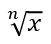

## **अवलोकन**

PowerPoint समीकरणों को Office Math Markup Language (OMML) के रूप में संग्रहीत करता है। Aspose.Slides for .NET के साथ, आप समान प्रकार की गणितीय सामग्री प्रोग्रामmatically बना सकते हैं: भिन्न, मूल, फ़ंक्शन, सीमाएँ, N-ary ऑपरेटर, मैट्रिक्स, एरे, और स्वरूपित गणित ब्लॉक।

PowerPoint में, उपयोगकर्ता सामान्यतः समीकरण **Insert > Equation** से जोड़ते हैं:


परिणाम स्लाइड पर संपादन योग्य गणितीय टेक्स्ट होता है:


Aspose.Slides उस गणितीय टेक्स्ट को तीन मुख्य वस्तुओं के माध्यम से बनाता है:

- एक गणितीय रूप, जो [AddMathShape](https://reference.aspose.com/slides/hi/net/aspose.slides/ishapecollection/addmathshape/) के द्वारा बनाया जाता है, वह आकार है जिसमें समीकरण होता है।
- [MathPortion](https://reference.aspose.com/slides/hi/net/aspose.slides.mathtext/mathportion/) आकार के टेक्स्ट फ्रेम के भीतर गणितीय सामग्री को संग्रहीत करता है।
- [MathParagraph](https://reference.aspose.com/slides/hi/net/aspose.slides.mathtext/mathparagraph/) एक या अधिक [MathBlock](https://reference.aspose.com/slides/hi/net/aspose.slides.mathtext/mathblock/) वस्तुओं को सम्मिलित करता है।

नीचे के अधिकांश उदाहरण [MathematicalText](https://reference.aspose.com/slides/hi/net/aspose.slides.mathtext/mathematicaltext/) और [IMathElement](https://reference.aspose.com/slides/hi/net/aspose.slides.mathtext/imathelement/) के फ़्लुएंट मेथड्स का उपयोग करते हैं ताकि कोड छोटा और पठनीय रहे।

MathML निर्यात परिदृश्यों के लिए, देखें [Export Math Equations from Presentations in .NET](/slides/hi/net/exporting-math-equations/)।

## **समीकरण बनाएं**

यह उदाहरण एक गणितीय रूप बनाता है और पाइथागोरस प्रमेय जोड़ता है:


```csharp
using var presentation = new Presentation();
var slide = presentation.Slides[0];

var mathShape = slide.Shapes.AddMathShape(20, 20, 700, 120);
var mathParagraph = ((MathPortion)mathShape.TextFrame.Paragraphs[0].Portions[0]).MathParagraph;

var equation = new MathematicalText("c")
    .SetSuperscript("2")
    .Join("=")
    .Join(new MathematicalText("a").SetSuperscript("2"))
    .Join("+")
    .Join(new MathematicalText("b").SetSuperscript("2"));

mathParagraph.Add(equation);

presentation.Save("pythagorean-theorem.pptx", SaveFormat.Pptx);
```

{}
`AddMathShape` एक ऐसा आकार बनाता है जिसमें पहले से ही एक गणितीय पैराग्राफ होता है। पहले `MathPortion` को एक्सेस करें, उसका `MathParagraph` प्राप्त करें, और उसमें गणितीय ब्लॉकों या गणितीय तत्वों को जोड़ें।
{}

## **भिन्न जोड़ें**

`Divide` का उपयोग करके एक भिन्न बनाएं। आप [MathFractionTypes](https://reference.aspose.com/slides/hi/net/aspose.slides.mathtext/mathfractiontypes/) के साथ एक भिन्न शैली चुन सकते हैं।


```csharp
using var presentation = new Presentation();
var slide = presentation.Slides[0];

var mathShape = slide.Shapes.AddMathShape(20, 20, 700, 100);
var mathParagraph = ((MathPortion)mathShape.TextFrame.Paragraphs[0].Portions[0]).MathParagraph;

var fraction = new MathematicalText("1")
    .Divide("x", MathFractionTypes.Skewed);

mathParagraph.Add(new MathBlock(fraction));

presentation.Save("fraction.pptx", SaveFormat.Pptx);
```

स्टैक्ड भिन्न के लिए, `MathFractionTypes.Bar` का उपयोग करें:

```csharp
var stackedFraction = new MathematicalText("x + 1").Divide("y - 1", MathFractionTypes.Bar);
```

## **मूल जोड़ें**

`Radical` का उपयोग करके वर्गमूल, घनमूल, या अन्य मूल बनाएं। वर्तमान तत्व आधार बन जाता है, और तर्क डिग्री बन जाता है।



```csharp
using var presentation = new Presentation();
var slide = presentation.Slides[0];

var mathShape = slide.Shapes.AddMathShape(20, 20, 700, 100);
var mathParagraph = ((MathPortion)mathShape.TextFrame.Paragraphs[0].Portions[0]).MathParagraph;

var radical = new MathematicalText("x")
    .Radical("n");

mathParagraph.Add(new MathBlock(radical));

presentation.Save("radical.pptx", SaveFormat.Pptx);
```

## **फ़ंक्शन और सीमाएँ जोड़ें**

`AsArgumentOfFunction` या `Function` का उपयोग फ़ंक्शनों जैसे `sin(x)`, `log(x)`, या कस्टम फ़ंक्शन नामों के लिए करें। सीमाओं के लिए, `lim` को एक [MathLimit](https://reference.aspose.com/slides/hi/net/aspose.slides.mathtext/mathlimit/) में रखें या `SetLowerLimit` का उपयोग करें।


```csharp
using var presentation = new Presentation();
var slide = presentation.Slides[0];

var mathShape = slide.Shapes.AddMathShape(20, 20, 700, 100);
var mathParagraph = ((MathPortion)mathShape.TextFrame.Paragraphs[0].Portions[0]).MathParagraph;

var limit = new MathematicalText("lim")
    .SetLowerLimit("x→∞")
    .Function("x");

mathParagraph.Add(new MathBlock(limit));

presentation.Save("functions-and-limits.pptx", SaveFormat.Pptx);
```

कस्टम फ़ंक्शन नाम के लिए, फ़ंक्शन नाम को वर्तमान तत्व बनाएं:

```csharp
var customFunction = new MathematicalText("f").Function("x + 1");
```

## **N-ary ऑपरेटर और इंटीग्रल जोड़ें**

समीकरण, यूनियन, इंटरसेक्शन और अन्य बड़े ऑपरेटरों के लिए `Nary` का उपयोग करें। इंटीग्रल के लिए `Integral` का उपयोग करें। दोनों मेथड्स आपको निचली और ऊपरी सीमाएँ सेट करने की अनुमति देते हैं।


```csharp
using var presentation = new Presentation();
var slide = presentation.Slides[0];

var mathShape = slide.Shapes.AddMathShape(20, 20, 700, 120);
var mathParagraph = ((MathPortion)mathShape.TextFrame.Paragraphs[0].Portions[0]).MathParagraph;

var summationBase = new MathematicalText("x")
    .SetSuperscript("k")
    .Join(new MathematicalText("a").SetSuperscript("n-k"));

var summation = summationBase.Nary(MathNaryOperatorTypes.Summation, "k=0", "n");

mathParagraph.Add(new MathBlock(summation));

presentation.Save("nary-operators.pptx", SaveFormat.Pptx);
```

N-ary ऑपरेटर बड़े ऑपरेटरों के लिए होते हैं जिनमें वैकल्पिक सीमाएँ हो सकती हैं। `+`, `-`, और `=` जैसे सरल ऑपरेटर आमतौर पर `MathematicalText` के रूप में जोड़कर अभिव्यक्ति में सम्मिलित किए जाते हैं।

इंटीग्रल के लिये, `Integral` का उपयोग करें:

```csharp
var integralBase = new MathematicalText("x").Join(new MathematicalText("dx").ToBox());
var integral = integralBase.Integral(MathIntegralTypes.Simple, "0", "1");
```

## **मैट्रिक्स जोड़ें**

पंक्तियों और स्तंभों के लिए [MathMatrix](https://reference.aspose.com/slides/hi/net/aspose.slides.mathtext/mathmatrix/) का उपयोग करें। मैट्रिक्स डिफ़ॉल्ट रूप से कोष्ठक नहीं शामिल करता, इसलिए जब आपको कोष्ठक, ब्रेस, या ब्रैकेट की आवश्यकता हो तो मैट्रिक्स को घेरें।


```csharp
using var presentation = new Presentation();
var slide = presentation.Slides[0];

var mathShape = slide.Shapes.AddMathShape(20, 20, 700, 120);
var mathParagraph = ((MathPortion)mathShape.TextFrame.Paragraphs[0].Portions[0]).MathParagraph;

var matrix = new MathMatrix(2, 3);
matrix[0, 0] = new MathematicalText("1");
matrix[0, 1] = new MathematicalText("x");
matrix[1, 0] = new MathematicalText("x");
matrix[1, 1] = new MathematicalText("2");
matrix[1, 2] = new MathematicalText("y");

mathParagraph.Add(new MathBlock(matrix));

presentation.Save("matrix.pptx", SaveFormat.Pptx);
```

## **समीकरण एरे जोड़ें**

जब आपको संरेखित समीकरण या अभिव्यक्तियों की ऊर्ध्वाधर श्रृंखला चाहिए, तो `ToMathArray` का उपयोग करें।


```csharp
using var presentation = new Presentation();
var slide = presentation.Slides[0];

var mathShape = slide.Shapes.AddMathShape(20, 20, 700, 140);
var mathParagraph = ((MathPortion)mathShape.TextFrame.Paragraphs[0].Portions[0]).MathParagraph;

var equationArray = new MathematicalText("x")
    .Join("y")
    .ToMathArray();

mathParagraph.Add(new MathBlock(equationArray));

presentation.Save("equation-array.pptx", SaveFormat.Pptx);
```

## **त्रिकोणमितीय फ़ंक्शन जोड़ें**

जब तर्क वर्तमान तत्व है और फ़ंक्शन का नाम ज्ञात है, तो `AsArgumentOfFunction` का उपयोग करें।


```csharp
using var presentation = new Presentation();
var slide = presentation.Slides[0];

var mathShape = slide.Shapes.AddMathShape(20, 20, 700, 100);
var mathParagraph = ((MathPortion)mathShape.TextFrame.Paragraphs[0].Portions[0]).MathParagraph;

var cosine = new MathematicalText("2x")
    .AsArgumentOfFunction(MathFunctionsOfOneArgument.Cos);

mathParagraph.Add(new MathBlock(cosine));

presentation.Save("trigonometric-function.pptx", SaveFormat.Pptx);
```

## **सबस्क्रिप्ट और सुपरस्क्रिप्ट जोड़ें**

इंडेक्स और घातों के लिए सबस्क्रिप्ट और सुपरस्क्रिप्ट सहायक उपयोग करें। जब इंडेक्स को आधार के बाएँ पक्ष पर दिखाना हो, तो `SetSubSuperscriptOnTheLeft` का उपयोग करें।


```csharp
using var presentation = new Presentation();
var slide = presentation.Slides[0];

var mathShape = slide.Shapes.AddMathShape(20, 20, 700, 100);
var mathParagraph = ((MathPortion)mathShape.TextFrame.Paragraphs[0].Portions[0]).MathParagraph;

var scripts = new MathematicalText("Y")
    .SetSubSuperscriptOnTheLeft("1", "n");

mathParagraph.Add(new MathBlock(scripts));

presentation.Save("subscript-superscript.pptx", SaveFormat.Pptx);
```

## **डिलिमिटर जोड़ें**

एक अभिव्यक्ति को डिलिमिटर के भीतर रखने के लिए `Enclose` का उपयोग करें। कई तत्वों वाली डिलिमिटर अभिव्यक्तियों के लिए आप एक पृथक्करण वर्ण भी सेट कर सकते हैं।


```csharp
using var presentation = new Presentation();
var slide = presentation.Slides[0];

var mathShape = slide.Shapes.AddMathShape(20, 20, 700, 100);
var mathParagraph = ((MathPortion)mathShape.TextFrame.Paragraphs[0].Portions[0]).MathParagraph;

var delimiter = new MathematicalText("x")
    .Join("y")
    .Join("z")
    .Enclose('<', '>');
delimiter.SeparatorCharacter = '|';

mathParagraph.Add(new MathBlock(delimiter));

presentation.Save("delimiters.pptx", SaveFormat.Pptx);
```

## **बॉर्डर बॉक्स जोड़ें**

जब समीकरण स्वयं को फ्रेम किया जाना हो, तो `ToBorderBox` का उपयोग करें।


```csharp
using var presentation = new Presentation();
var slide = presentation.Slides[0];

var mathShape = slide.Shapes.AddMathShape(20, 20, 700, 100);
var mathParagraph = ((MathPortion)mathShape.TextFrame.Paragraphs[0].Portions[0]).MathParagraph;

var boxedEquation = new MathematicalText("a")
    .SetSuperscript("2")
    .Join("=")
    .Join(new MathematicalText("b").SetSuperscript("2"))
    .Join("+")
    .Join(new MathematicalText("c").SetSuperscript("2"))
    .ToBorderBox();

mathParagraph.Add(new MathBlock(boxedEquation));

presentation.Save("border-box.pptx", SaveFormat.Pptx);
```

## **शर्तों को समूहित करें**

एक अभिव्यक्ति के ऊपर या नीचे समूहित करने वाला अक्षर रखने के लिए `Group` का उपयोग करें। समूहित शर्तों को लेबल करने के लिए एक सीमा जोड़ें।


```csharp
using var presentation = new Presentation();
var slide = presentation.Slides[0];

var mathShape = slide.Shapes.AddMathShape(20, 20, 700, 120);
var mathParagraph = ((MathPortion)mathShape.TextFrame.Paragraphs[0].Portions[0]).MathParagraph;

var grouped = new MathematicalText("x + y")
    .Group('\u23DF', MathTopBotPositions.Bottom, MathTopBotPositions.Top)
    .SetLowerLimit("any text");

mathParagraph.Add(new MathBlock(grouped));

presentation.Save("grouped-terms.pptx", SaveFormat.Pptx);
```

## **गणितीय तत्वों को स्वरूपित करें**

केवल उन स्थितियों में स्वरूपण सहायक उपयोग करें जहाँ वे फ़ॉर्मूला को स्पष्ट करते हैं। उदाहरण के लिए, `Overbar` एक गणितीय तत्व के ऊपर एक बार रखता है।


```csharp
using var presentation = new Presentation();
var slide = presentation.Slides[0];

var mathShape = slide.Shapes.AddMathShape(20, 20, 700, 100);
var mathParagraph = ((MathPortion)mathShape.TextFrame.Paragraphs[0].Portions[0]).MathParagraph;

var overbar = new MathematicalText("ABC").Overbar();

mathParagraph.Add(new MathBlock(overbar));

presentation.Save("overbar.pptx", SaveFormat.Pptx);
```

## **त्वरित संदर्भ**

| कार्य | मुख्य API |
| --- | --- |
| गणितीय टेक्स्ट बनाएं | [MathematicalText](https://reference.aspose.com/slides/hi/net/aspose.slides.mathtext/mathematicaltext/) |
| तत्वों को मिलाएँ | [IMathElement.Join](https://reference.aspose.com/slides/hi/net/aspose.slides.mathtext/imathelement/join/) |
| भिन्न बनाएं | [IMathElement.Divide](https://reference.aspose.com/slides/hi/net/aspose.slides.mathtext/imathelement/divide/) |
| सुपरस्क्रिप्ट या सबस्क्रिप्ट जोड़ें | [SetSuperscript](https://reference.aspose.com/slides/hi/net/aspose.slides.mathtext/imathelement/setsuperscript/), [SetSubscript](https://reference.aspose.com/slides/hi/net/aspose.slides.mathtext/imathelement/setsubscript/) |
| फ़ंक्शन जोड़ें | [Function](https://reference.aspose.com/slides/hi/net/aspose.slides.mathtext/imathelement/function/), [AsArgumentOfFunction](https://reference.aspose.com/slides/hi/net/aspose.slides.mathtext/imathelement/asargumentoffunction/) |
| मूल जोड़ें | [IMathElement.Radical](https://reference.aspose.com/slides/hi/net/aspose.slides.mathtext/imathelement/radical/) |
| सीमाएँ जोड़ें | [SetLowerLimit](https://reference.aspose.com/slides/hi/net/aspose.slides.mathtext/imathelement/setlowerlimit/), [SetUpperLimit](https://reference.aspose.com/slides/hi/net/aspose.slides.mathtext/imathelement/setupperlimit/) |
| बाएँ‑साइड स्क्रिप्ट जोड़ें | [SetSubSuperscriptOnTheLeft](https://reference.aspose.com/slides/hi/net/aspose.slides.mathtext/imathelement/setsubsuperscriptontheleft/) |
| योग एवं इंटीग्रल जोड़ें | [Nary](https://reference.aspose.com/slides/hi/net/aspose.slides.mathtext/imathelement/nary/), [Integral](https://reference.aspose.com/slides/hi/net/aspose.slides.mathtext/imathelement/integral/) |
| मैट्रिक्स जोड़ें | [MathMatrix](https://reference.aspose.com/slides/hi/net/aspose.slides.mathtext/mathmatrix/) |
| समीकरण एरे जोड़ें | [ToMathArray](https://reference.aspose.com/slides/hi/net/aspose.slides.mathtext/imathelement/tomatharray/) |
| डिलिमिटर जोड़ें | [Enclose](https://reference.aspose.com/slides/hi/net/aspose.slides.mathtext/imathelement/enclose/) |
| बार और बॉर्डर जोड़ें | [Overbar](https://reference.aspose.com/slides/hi/net/aspose.slides.mathtext/imathelement/overbar/), [ToBorderBox](https://reference.aspose.com/slides/hi/net/aspose.slides.mathtext/imathelement/toborderbox/) |
| शर्तों को समूहित करें | [Group](https://reference.aspose.com/slides/hi/net/aspose.slides.mathtext/imathelement/group/) |

## **अक्सर पूछे जाने वाले प्रश्न**

**क्या मैं मौजूदा PowerPoint समीकरण को संपादित कर सकता हूँ?**

हाँ। प्रस्तुति खोलें, उस आकार को खोजें जिसमें `MathPortion` है, उसका `MathParagraph` प्राप्त करें, और उस पैराग्राफ में गणितीय ब्लॉकों को अपडेट करें।

**क्या समीकरण संपादन योग्य PowerPoint गणित के रूप में सहेजे जाते हैं?**

हाँ। जब आप PPTX में सहेजते हैं, तो Aspose.Slides समीकरण को संपादन योग्य Office गणित सामग्री के रूप में लिखता है।

**क्या मैं समीकरणों को LaTeX में निर्यात कर सकता हूँ?**

हाँ। उसके `MathPortion` से [IMathParagraph](https://reference.aspose.com/slides/hi/net/aspose.slides.mathtext/imathparagraph/) प्राप्त करें और सीधे निर्यात करने के लिए [IMathParagraph.ToLatex](https://reference.aspose.com/slides/hi/net/aspose.slides.mathtext/imathparagraph/tolatex/) को कॉल करें। पूर्ण उदाहरण के लिए देखें [Export Math Equations from Presentations in .NET](/slides/hi/net/exporting-math-equations/#export-math-equations-to-latex)।