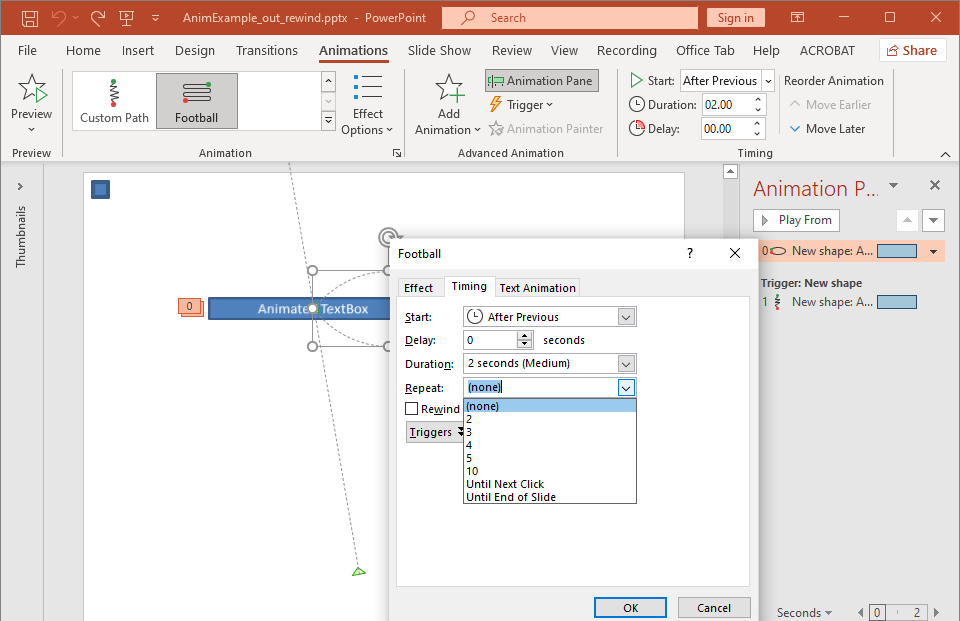

## **समीक्षा**

Aspose.Slides for .NET स्लाइड एनीमेशन को स्लाइड टाइमलाइन में इफ़ेक्ट्स के रूप में प्रस्तुत करता है। एक इफ़ेक्ट में लक्ष्य शेप, एनीमेशन प्रकार और उपप्रकार, ट्रिगर, टाइमिंग सेटिंग्स, और वैकल्पिक गुण जैसे साउंड या एनीमेशन के बाद का व्यवहार शामिल होते हैं।

टाइमलाइन दो प्रकार के क्रम रखती है:

- **मुख्य क्रम** स्लाइड आगे बढ़ते समय चलता है।
- **इंटरएक्टिव क्रम** तब शुरू होता है जब उसका ट्रिगर शेप क्लिक किया जाता है।

क्योंकि टेक्स्ट बॉक्स, तस्वीरें, चार्ट, टेबल और अन्य स्लाइड ऑब्जेक्ट्स [IShape](https://reference.aspose.com/slides/hi/net/aspose.slides/ishape/) को लागू करते हैं, आप अधिकांश स्लाइड कंटेंट के लिये समान [ISequence.AddEffect](https://reference.aspose.com/slides/hi/net/aspose.slides.animation/isequence/addeffect/) मेथड का उपयोग करते हैं। उपलब्ध इफ़ेक्ट्स [EffectType](https://reference.aspose.com/slides/hi/net/aspose.slides.animation/effecttype/) enumeration में सूचीबद्ध हैं।

## **शेप एनीमेशन जोड़ें**

एनीमेशन जोड़ने के लिये, स्लाइड की मुख्य क्रम प्राप्त करें और लक्ष्य शेप, इफ़ेक्ट प्रकार, उपप्रकार और ट्रिगर के साथ [ISequence.AddEffect](https://reference.aspose.com/slides/hi/net/aspose.slides.animation/isequence/addeffect/) को कॉल करें। ऐसे इफ़ेक्ट के लिये जो किसी अन्य शेप के क्लिक पर शुरू होता है, एक इंटरएक्टिव क्रम बनाएं जिसकी ट्रिगर वह अन्य शेप हो।

निम्न उदाहरण दोनों प्रकार के एनीमेशन बनाता है और परिणाम को `shape-animations.pptx` में सहेजता है।

```csharp
using Aspose.Slides;
using Aspose.Slides.Animation;
using Aspose.Slides.Export;

using var presentation = new Presentation();
var slide = presentation.Slides[0];

var targetShape = slide.Shapes.AddAutoShape(ShapeType.RoundCornerRectangle, 120, 100, 320, 80);
targetShape.TextFrame.Text = "Click to animate this shape";

var mainSequence = slide.Timeline.MainSequence;
var entranceEffect = mainSequence.AddEffect(targetShape, EffectType.Fade, EffectSubtype.None, EffectTriggerType.OnClick);
entranceEffect.Timing.Duration = 1.5f;

var triggerShape = slide.Shapes.AddAutoShape(ShapeType.Bevel, 20, 20, 100, 40);
triggerShape.TextFrame.Text = "Move";

var interactiveSequence = slide.Timeline.InteractiveSequences.Add(triggerShape);
interactiveSequence.AddEffect(targetShape, EffectType.PathFootball, EffectSubtype.None, EffectTriggerType.OnClick);

presentation.Save("shape-animations.pptx", SaveFormat.Pptx);
```

ट्रिगर निर्धारित करता है कि इफ़ेक्ट कब शुरू होता है:

- [EffectTriggerType.OnClick](https://reference.aspose.com/slides/hi/net/aspose.slides.animation/effecttriggertype/) मुख्य क्रम में क्लिक की प्रतीक्षा करता है, या इंटरएक्टिव क्रम में ट्रिगर शेप के क्लिक की।
- [EffectTriggerType.WithPrevious](https://reference.aspose.com/slides/hi/net/aspose.slides.animation/effecttriggertype/) पिछले इफ़ेक्ट के साथ शुरू होता है।
- [EffectTriggerType.AfterPrevious](https://reference.aspose.com/slides/hi/net/aspose.slides.animation/effecttriggertype/) पिछले इफ़ेक्ट के समाप्त होने पर शुरू होता है।

चित्र, चार्ट या अन्य शेप प्रकार को एनीमेट करने के लिये, `targetShape` के बजाय उस ऑब्जेक्ट को [ISequence.AddEffect](https://reference.aspose.com/slides/hi/net/aspose.slides.animation/isequence/addeffect/) को पास करें। चार्ट‑विशिष्ट ग्रुपिंग विकल्पों के लिये, देखें [Animated Charts](/slides/hi/net/animated-charts/)।

## **शेप एनीमेशन पढ़ें**

जब आप लक्ष्य शेप जानते हैं, तो [ISequence.GetEffectsByShape](https://reference.aspose.com/slides/hi/net/aspose.slides.animation/isequence/geteffectsbyshape/) का उपयोग करें। सभी इफ़ेक्ट्स का निरीक्षण करने के लिये, मुख्य क्रम और प्रत्येक इंटरएक्टिव क्रम को क्रमबद्ध करें। क्रमबद्ध करना यह मानने से बचाता है कि कोई क्रम इंडेक्स `0` पर इफ़ेक्ट रखता है।

निम्न उदाहरण एक शेप बनाता है जिसमें मुख्य‑क्रम और इंटरएक्टिव इफ़ेक्ट्स होते हैं, शेप को लक्षित करने वाले इफ़ेक्ट्स प्राप्त करता है, और फिर स्लाइड पर प्रत्येक क्रम को क्रमबद्ध करता है।

```csharp
using System;
using Aspose.Slides;
using Aspose.Slides.Animation;

using var presentation = new Presentation();
var slide = presentation.Slides[0];
var targetShape = slide.Shapes.AddAutoShape(ShapeType.Rectangle, 120, 100, 320, 80);
targetShape.TextFrame.Text = "Animated shape";

var mainSequence = slide.Timeline.MainSequence;
mainSequence.AddEffect(targetShape, EffectType.Fade, EffectSubtype.None, EffectTriggerType.OnClick);

var triggerShape = slide.Shapes.AddAutoShape(ShapeType.Bevel, 20, 20, 100, 40);
triggerShape.TextFrame.Text = "Move";

var interactiveSequence = slide.Timeline.InteractiveSequences.Add(triggerShape);
interactiveSequence.AddEffect(targetShape, EffectType.PathFootball, EffectSubtype.None, EffectTriggerType.OnClick);

var targetEffects = mainSequence.GetEffectsByShape(targetShape);
Console.WriteLine($"The main sequence contains {targetEffects.Length} effect(s) for {targetShape.Name}.");

PrintSequence("Main sequence", mainSequence);

var interactiveIndex = 1;
foreach (var sequence in slide.Timeline.InteractiveSequences)
{
    var triggerName = sequence.TriggerShape == null ? "unknown" : sequence.TriggerShape.Name;
    var sequenceLabel = $"Interactive sequence {interactiveIndex}, trigger: {triggerName}";
    PrintSequence(sequenceLabel, sequence);
    interactiveIndex++;
}

static void PrintSequence(string label, ISequence sequence)
{
    Console.WriteLine($"  {label}: {sequence.Count} effect(s)");

    foreach (var effect in sequence)
    {
        var targetName = effect.TargetShape == null ? "unknown" : effect.TargetShape.Name;
        var effectDescription = $"{effect.Type} {effect.Subtype}; target: {targetName}; trigger: {effect.Timing.TriggerType}";
        Console.WriteLine($"    {effectDescription}");
    }
}
```

यदि आपको केवल किसी एक शेप के लिये इफ़ेक्ट चाहिए, तो पहले शेप को नाम, प्लेसहोल्डर प्रकार या किसी स्थिर गुण से पहचानें; फिर [ISequence.GetEffectsByShape](https://reference.aspose.com/slides/hi/net/aspose.slides.animation/isequence/geteffectsbyshape/) को कॉल करें। यह मान कर न चलें कि इंडेक्स `0` पर [IShapeCollection.Item](https://reference.aspose.com/slides/hi/net/aspose.slides/ishapecollection/item/) हमेशा वांछित ऑब्जेक्ट है।

## **विरासत में मिले प्लेसहोल्डर इफ़ेक्ट्स के साथ कार्य करें**

सामान्य स्लाइड पर एक प्लेसहोल्डर अपने लेआउट स्लाइड और मास्टर स्लाइड पर संबंधित प्लेसहोल्डर से एनीमेशन व्यवहार वारिस में ले सकता है। [IShape.GetBasePlaceholder](https://reference.aspose.com/slides/hi/net/aspose.slides/ishape/getbaseplaceholder/) वह पैरेंट प्लेसहोल्डर लौटाता है, या जब कोई पैरेंट न हो तो `null`।

निम्न उदाहरण प्रस्तुति में, फुटर की सामान्य स्लाइड पर **Random Bars**, लेआउट स्लाइड पर **Split**, और मास्टर स्लाइड पर **Fly In** लागू हैं।


अगला उदाहरण स्वयं प्लेसहोल्डर पदानुक्रम बनाता है। यह मास्टर प्लेसहोल्डर, लेआउट प्लेसहोल्डर और सामान्य स्लाइड पर संबंधित प्लेसहोल्डर में इफ़ेक्ट्स जोड़ता है। प्रत्येक कॉल से पहले [IShape.GetBasePlaceholder](https://reference.aspose.com/slides/hi/net/aspose.slides/ishape/getbaseplaceholder/) जांची जाती है।

```csharp
using System;
using Aspose.Slides;
using Aspose.Slides.Animation;
using Aspose.Slides.Export;

using var presentation = new Presentation();
var layoutSlide = presentation.LayoutSlides.GetByType(SlideLayoutType.Blank);
var layoutPlaceholder = layoutSlide.PlaceholderManager.AddTextPlaceholder(100, 100, 400, 80);
layoutSlide.Timeline.MainSequence.AddEffect(layoutPlaceholder, EffectType.Split, EffectSubtype.VerticalIn, EffectTriggerType.OnClick);

var masterPlaceholder = layoutPlaceholder.GetBasePlaceholder();
if (masterPlaceholder != null)
{
    var masterSequence = layoutSlide.MasterSlide.Timeline.MainSequence;
    masterSequence.AddEffect(masterPlaceholder, EffectType.Fly, EffectSubtype.Bottom, EffectTriggerType.OnClick);
}

var slide = presentation.Slides.AddEmptySlide(layoutSlide);
var slidePlaceholder = FindPlaceholderWithBase(slide);

if (slidePlaceholder == null)
{
    throw new InvalidOperationException("The slide does not contain a placeholder linked to its layout slide.");
}

slide.Timeline.MainSequence.AddEffect(slidePlaceholder, EffectType.RandomBars, EffectSubtype.Horizontal, EffectTriggerType.OnClick);
PrintEffects("Normal slide", slide.Timeline.MainSequence.GetEffectsByShape(slidePlaceholder));

var baseLayoutPlaceholder = slidePlaceholder.GetBasePlaceholder();
if (baseLayoutPlaceholder != null)
{
    PrintEffects("Layout slide", layoutSlide.Timeline.MainSequence.GetEffectsByShape(baseLayoutPlaceholder));

    var baseMasterPlaceholder = baseLayoutPlaceholder.GetBasePlaceholder();
    if (baseMasterPlaceholder != null)
    {
        PrintEffects("Master slide", layoutSlide.MasterSlide.Timeline.MainSequence.GetEffectsByShape(baseMasterPlaceholder));
    }
}

presentation.Save("placeholder-animations.pptx", SaveFormat.Pptx);

static IShape FindPlaceholderWithBase(ISlide slide)
{
    foreach (var shape in slide.Shapes)
    {
        if (shape.GetBasePlaceholder() != null)
        {
            return shape;
        }
    }

    return null;
}

static void PrintEffects(string source, IEffect[] effects)
{
    Console.WriteLine($"{source}: {effects.Length} effect(s)");

    foreach (var effect in effects)
    {
        Console.WriteLine($"  {effect.Type} {effect.Subtype}");
    }
}
```

## **एनीमेशन टाइमिंग बदलें**

PowerPoint **Timing** डायलॉग [ITiming](https://reference.aspose.com/slides/hi/net/aspose.slides.animation/itiming/) की गुणों से मैप होता है।



- **Start** [ITiming.TriggerType](https://reference.aspose.com/slides/hi/net/aspose.slides.animation/itiming/triggertype/) से मैप होता है।
- **Duration** [ITiming.Duration](https://reference.aspose.com/slides/hi/net/aspose.slides.animation/itiming/duration/) से मैप होता है, सेकंड में।
- **Delay** [ITiming.TriggerDelayTime](https://reference.aspose.com/slides/hi/net/aspose.slides.animation/itiming/triggerdelaytime/) से मैप होता है, सेकंड में।
- **Repeat** [ITiming.RepeatCount](https://reference.aspose.com/slides/hi/net/aspose.slides.animation/itiming/repeatcount/), [ITiming.RepeatUntilNextClick](https://reference.aspose.com/slides/hi/net/aspose.slides.animation/itiming/repeatuntilnextclick/) या [ITiming.RepeatUntilEndSlide](https://reference.aspose.com/slides/hi/net/aspose.slides.animation/itiming/repeatuntilendslide/) से मैप होता है।
- **Rewind when done playing** [ITiming.Rewind](https://reference.aspose.com/slides/hi/net/aspose.slides.animation/itiming/rewind/) से मैप होता है।

यह स्वतंत्र उदाहरण एक इफ़ेक्ट जोड़ता है, उसे [ISequence.AddEffect](https://reference.aspose.com/slides/hi/net/aspose.slides.animation/isequence/addeffect/) द्वारा लौटाए गए ऑब्जेक्ट के माध्यम से टाइमिंग बदलता है, और परिणाम सहेजता है। लौटाए गए [IEffect](https://reference.aspose.com/slides/hi/net/aspose.slides.animation/ieffect/) रेफ़रेंस को बनाए रखने से अनावश्यक कलेक्शन इंडेक्स से बचा जा सकता है।

```csharp
using Aspose.Slides;
using Aspose.Slides.Animation;
using Aspose.Slides.Export;

using var presentation = new Presentation();
var slide = presentation.Slides[0];
var shape = slide.Shapes.AddAutoShape(ShapeType.Rectangle, 120, 100, 320, 80);
shape.TextFrame.Text = "Timed animation";

var effect = slide.Timeline.MainSequence.AddEffect(shape, EffectType.Fade, EffectSubtype.None, EffectTriggerType.OnClick);
effect.Timing.TriggerType = EffectTriggerType.OnClick;
effect.Timing.Duration = 2.0f;
effect.Timing.TriggerDelayTime = 0.5f;
effect.Timing.RepeatUntilNextClick = false;
effect.Timing.RepeatUntilEndSlide = false;
effect.Timing.RepeatCount = 2.0f;
effect.Timing.Rewind = true;

presentation.Save("shape-animation-timing.pptx", SaveFormat.Pptx);
```

एक रिपीट मोड को जानबूझकर उपयोग करें। रिपीट काउंट को “until” फ़्लैग के साथ मिलाने से विभिन्न व्यूअर्स में भ्रमित करने वाले परिणाम मिल सकते हैं। रिपीट मोड बदलते समय पहले [ITiming.RepeatUntilNextClick](https://reference.aspose.com/slides/hi/net/aspose.slides.animation/itiming/repeatuntilnextclick/) और [ITiming.RepeatUntilEndSlide](https://reference.aspose.com/slides/hi/net/aspose.slides.animation/itiming/repeatuntilendslide/) सेट करें, फिर [ITiming.RepeatCount](https://reference.aspose.com/slides/hi/net/aspose.slides.animation/itiming/repeatcount/) सेट करें, क्योंकि किसी भी फ़्लैग को सेट करने से सक्रिय रिपीट मोड बदल जाता है।

## **एनीमेशन साउंड जोड़ें और निकालें**

एक एनीमेशन इफ़ेक्ट एम्बेडेड ऑडियो को [IEffect.Sound](https://reference.aspose.com/slides/hi/net/aspose.slides.animation/ieffect/sound/) के माध्यम से संदर्भित कर सकता है। [IEffect.StopPreviousSound](https://reference.aspose.com/slides/hi/net/aspose.slides.animation/ieffect/stopprevioussound/) किसी इफ़ेक्ट को बताता है कि वह पहले शुरू किए गए साउंड को बंद करे।

### **इफ़ेक्ट में साउंड जोड़ें**

निम्न उदाहरण एक स्थानीय ऑडियो फ़ाइल `animation-sound.wav` की अपेक्षा करता है। यह दो इफ़ेक्ट बनाता है, पहली इफ़ेक्ट के लिये उस फ़ाइल को साउंड के रूप में एम्बेड करता है, और दूसरे इफ़ेक्ट को साउंड रोकने के लिये कॉन्फ़िगर करता है। यह [ISequence.AddEffect](https://reference.aspose.com/slides/hi/net/aspose.slides.animation/isequence/addeffect/) द्वारा लौटाए गए ऑब्जेक्ट्स का उपयोग करता है, इसलिए क्रम इंडेक्स की आवश्यकता नहीं है।

```csharp
using System.IO;
using Aspose.Slides;
using Aspose.Slides.Animation;
using Aspose.Slides.Export;

using var presentation = new Presentation();
var slide = presentation.Slides[0];
var firstShape = slide.Shapes.AddAutoShape(ShapeType.Rectangle, 80, 100, 240, 80);
var secondShape = slide.Shapes.AddAutoShape(ShapeType.Rectangle, 400, 100, 240, 80);
firstShape.TextFrame.Text = "Starts sound";
secondShape.TextFrame.Text = "Stops sound";

var sequence = slide.Timeline.MainSequence;
var firstEffect = sequence.AddEffect(firstShape, EffectType.Fade, EffectSubtype.None, EffectTriggerType.OnClick);
var secondEffect = sequence.AddEffect(secondShape, EffectType.Fade, EffectSubtype.None, EffectTriggerType.OnClick);

var audioData = File.ReadAllBytes("animation-sound.wav");
var effectSound = presentation.Audios.AddAudio(audioData);
firstEffect.Sound = effectSound;
secondEffect.StopPreviousSound = true;

presentation.Save("shape-animation-sound.pptx", SaveFormat.Pptx);
```

### **एम्बेडेड इफ़ेक्ट साउंड निकालें**

निम्न उदाहरण एक स्थानीय प्रस्तुति `presentation-with-animation-sounds.pptx` की अपेक्षा करता है। यह मुख्य और इंटरएक्टिव क्रम दोनों को स्कैन करता है और प्रत्येक एम्बेडेड इफ़ेक्ट साउंड को `extracted-animation-sounds` डायरेक्टरी में लिखता है। एक्सटेंशन ऑडियो MIME टाइप से चुना जाता है जो [IAudio.ContentType](https://reference.aspose.com/slides/hi/net/aspose.slides/iaudio/contenttype/) द्वारा दिया गया है।

```csharp
using System;
using System.IO;
using Aspose.Slides;
using Aspose.Slides.Animation;

var inputPath = "presentation-with-animation-sounds.pptx";
var outputDirectory = "extracted-animation-sounds";

Directory.CreateDirectory(outputDirectory);

using var presentation = new Presentation(inputPath);
var soundIndex = 1;

foreach (var slide in presentation.Slides)
{
    SaveSounds(slide.Timeline.MainSequence, outputDirectory, ref soundIndex);

    foreach (var sequence in slide.Timeline.InteractiveSequences)
    {
        SaveSounds(sequence, outputDirectory, ref soundIndex);
    }
}

Console.WriteLine($"Extracted {soundIndex - 1} sound file(s) to {Path.GetFullPath(outputDirectory)}.");

static void SaveSounds(ISequence sequence, string outputDirectory, ref int soundIndex)
{
    foreach (var effect in sequence)
    {
        if (effect.Sound == null)
            continue;

        var extension = GetAudioExtension(effect.Sound.ContentType);
        var outputPath = Path.Combine(outputDirectory, $"effect-sound-{soundIndex}{extension}");
        File.WriteAllBytes(outputPath, effect.Sound.BinaryData);
        soundIndex++;
    }
}

static string GetAudioExtension(string contentType)
{
    var normalizedType = contentType == null ? string.Empty : contentType.ToLowerInvariant();

    if (normalizedType == "audio/mpeg")
        return ".mp3";

    if (normalizedType == "audio/mp4")
        return ".m4a";

    if (normalizedType == "audio/ogg")
        return ".ogg";

    if (normalizedType == "audio/wav" || normalizedType == "audio/x-wav")
        return ".wav";

    return ".bin";
}
```

बड़े ऑडियो ऑब्जेक्ट्स के लिये, [IAudio.GetStream](https://reference.aspose.com/slides/hi/net/aspose.slides/iaudio/getstream/) का उपयोग करके स्ट्रीम को फ़ाइल में कॉपी करें, बजाय पूरे ऑब्जेक्ट को बाइट एरे में लोड करने के।

## **एनीमेशन के बाद व्यवहार सेट करें**

**After animation** विकल्प निर्धारित करता है कि इफ़ेक्ट समाप्त होने के बाद शेप के साथ क्या होना चाहिए।


[AfterAnimationType](https://reference.aspose.com/slides/hi/net/aspose.slides.animation/afteranimationtype/) enumeration शेप को अपरिवर्तित छोड़ना, उसका रंग बदलना, एनीमेशन के बाद छिपाना, या अगले क्लिक पर छिपाना समर्थन करता है। जब प्रकार [AfterAnimationType.Color](https://reference.aspose.com/slides/hi/net/aspose.slides.animation/afteranimationtype/) हो, तो साथ ही [IEffect.AfterAnimationColor](https://reference.aspose.com/slides/hi/net/aspose.slides.animation/ieffect/afteranimationcolor/) सेट करें।

यह स्वतंत्र उदाहरण एक इफ़ेक्ट बनाता है, लौटाए गए इफ़ेक्ट ऑब्जेक्ट के माध्यम से उसके एनीमेशन‑के‑बाद व्यवहार को सेट करता है, और परिणाम सहेजता है।

```csharp
using System.Drawing;
using Aspose.Slides;
using Aspose.Slides.Animation;
using Aspose.Slides.Export;

using var presentation = new Presentation();
var slide = presentation.Slides[0];
var shape = slide.Shapes.AddAutoShape(ShapeType.Rectangle, 120, 100, 320, 80);
shape.TextFrame.Text = "Dim after animation";

var effect = slide.Timeline.MainSequence.AddEffect(shape, EffectType.Fade, EffectSubtype.None, EffectTriggerType.OnClick);
effect.AfterAnimationType = AfterAnimationType.Color;
effect.AfterAnimationColor.Color = Color.LightGray;

presentation.Save("shape-animation-after-effect.pptx", SaveFormat.Pptx);
```

[AfterAnimationType.Color](https://reference.aspose.com/slides/hi/net/aspose.slides.animation/afteranimationtype/) से प्रकार बदलने पर एनीमेशन‑के‑बाद रंग सेटिंग साफ हो जाती है।

## **टेक्स्ट एनीमेट करें**

टेक्स्ट एनीमेशन में दो संबंधित नियंत्रण होते हैं:

- [ITextAnimation.BuildType](https://reference.aspose.com/slides/hi/net/aspose.slides.animation/itextanimation/buildtype/) नियंत्रित करता है कि पैराग्राफ एक साथ दिखें या पैराग्राफ स्तर पर।
- [IEffect.AnimateTextType](https://reference.aspose.com/slides/hi/net/aspose.slides.animation/ieffect/animatetexttype/) नियंत्रित करता है कि टेक्स्ट एक साथ, शब्द‑दर‑शब्द या अक्षर‑दर‑अक्षर दिखे। [IEffect.DelayBetweenTextParts](https://reference.aspose.com/slides/hi/net/aspose.slides.animation/ieffect/delaybetweentextparts/) शब्दों या अक्षरों के बीच विलंब सेट करता है। सकारात्मक मान इफ़ेक्ट अवधि का प्रतिशत होता है; नकारात्मक मान सेकंड में देरी होता है।

निम्न स्वतंत्र उदाहरण एक टेक्स्ट बॉक्स के शब्दों को एनीमेट करता है। [BuildType.AsOneObject](https://reference.aspose.com/slides/hi/net/aspose.slides.animation/buildtype/) पैराग्राफ‑दर‑पैराग्राफ बिल्डिंग को निष्क्रिय करता है, जिससे शब्द सेटिंग पूरे टेक्स्ट फ्रेम पर लागू होती है।

```csharp
using Aspose.Slides;
using Aspose.Slides.Animation;
using Aspose.Slides.Export;

using var presentation = new Presentation();
var slide = presentation.Slides[0];
var textBox = slide.Shapes.AddAutoShape(ShapeType.Rectangle, 80, 80, 560, 100);
textBox.TextFrame.Text = "Aspose.Slides animates this sentence word by word.";

var effect = slide.Timeline.MainSequence.AddEffect(textBox, EffectType.Fade, EffectSubtype.None, EffectTriggerType.OnClick);
effect.TextAnimation.BuildType = BuildType.AsOneObject;
effect.AnimateTextType = AnimateTextType.ByWord;
effect.DelayBetweenTextParts = 20.0f;

presentation.Save("animated-text.pptx", SaveFormat.Pptx);
```

पैराग्राफ‑दर‑पैराग्राफ बॉक्स बनाने के लिये, [BuildType.ByLevelParagraphs1](https://reference.aspose.com/slides/hi/net/aspose.slides.animation/buildtype/) (या किसी अन्य पैराग्राफ स्तर) सेट करें। किसी एक पैराग्राफ को अपने स्वयं के इफ़ेक्ट से लक्षित करने के लिये, उस [ISequence.AddEffect](https://reference.aspose.com/slides/hi/net/aspose.slides.animation/isequence/addeffect/) ओवरलोड का प्रयोग करें जो एक [IParagraph](https://reference.aspose.com/slides/hi/net/aspose.slides/iparagraph/) को स्वीकार करता है। पैराग्राफ‑स्तर के उदाहरणों के लिये देखें [Animated Text](/slides/hi/net/animated-text/)।

## **एक्सपोर्ट और संगतता नोट्स**

- PPT या PPTX में सहेजने से एनीमेशन मॉडल संरक्षित रहता है, लेकिन अंतिम प्लेबैक प्रस्तुति दर्शक द्वारा नियंत्रित होता है।
- PDF और स्थिर इमेजेज एनीमेशन नहीं चलाते। जब मोशन दिखाना आवश्यक हो, तो [HTML5 export](/slides/hi/net/export-to-html5/), एनिमेटेड GIF या [वीडियो कन्वर्ज़न](/slides/hi/net/convert-powerpoint-to-video/) का उपयोग करें।
- HTML5 के लिये, [Html5Options.AnimateShapes](https://reference.aspose.com/slides/hi/net/aspose.slides.export/html5options/animateshapes/) को सक्षम करें और आवश्यक होने पर [Html5Options.AnimateTransitions](https://reference.aspose.com/slides/hi/net/aspose.slides.export/html5options/animatetransitions/) भी सक्षम करें।
- वीडियो रेंडरिंग कई सामान्य प्रवेश, इम्फेसिस, निकास और मोशन‑पाथ इफ़ेक्ट्स को समर्थन देता है, लेकिन हर PowerPoint इफ़ेक्ट समर्थित नहीं है। वर्तमान [supported animations and effects](/slides/hi/net/convert-powerpoint-to-video/#supported-animations-and-effects) देखें और अपने लक्ष्य Aspose.Slides संस्करण के साथ महत्वपूर्ण प्रस्तुतियों का परीक्षण करें।
- उन्नत कस्टम इफ़ेक्ट्स और अन्य प्रस्तुतिकरण फ़ॉर्मेट से आयातित इफ़ेक्ट्स फ़ाइल में संरक्षित रह सकते हैं, लेकिन PowerPoint, HTML5 या वीडियो में अलग तरह से रेंडर हो सकते हैं। केवल इफ़ेक्ट नाम पर भरोसा न करें; निर्यात परिणाम को सत्यापित करें।

## **अक्सर पूछे जाने वाले प्रश्न**

**PowerPoint में एनीमेशन दिखता है लेकिन PDF में नहीं, ऐसा क्यों?**

PDF एक स्थिर फ़ॉर्मेट है, इसलिए एनीमेशन और स्लाइड ट्रांज़िशन नहीं चलते। जब मोशन बनाए रखना आवश्यक हो, तो HTML5, एनिमेटेड GIF या वीडियो में निर्यात करें।

**वीडियो में इफ़ेक्ट अलग तरह से चलता है, ऐसा क्यों?**

वीडियो निर्यात एनीमेशन को रेंडर करता है, मूल PowerPoint व्यवहार को नहीं रखता। कुछ उन्नत इफ़ेक्ट्स असमर्थित या अनुमानित होते हैं। समर्थित‑इफ़ेक्ट्स तालिका देखें और उत्पादन उपयोग से पहले वास्तविक प्रस्तुति का परीक्षण करें।

**क्या शेप को आगे या पीछे ले जाने से उसकी एनीमेशन क्रम बदलता है?**

नहीं। शेप का ज़‑ऑर्डर ओवरलैप नियंत्रित करता है, जबकि क्रमबद्धता और ट्रिगर एनीमेशन प्लेबैक को नियंत्रित करते हैं। यदि आपको अलग प्लेबैक क्रम चाहिए, तो टाइमलाइन बदलें।