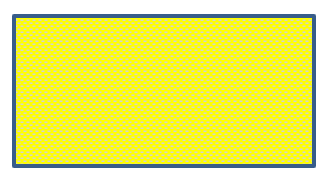

## **परिचय**

PowerPoint में आप स्लाइड्स में आकृतियाँ जोड़ सकते हैं। चूँकि आकृतियाँ रेखाओं से बनी होती हैं, आप उनके आउटलाइन में परिवर्तन या प्रभाव लागू करके उन्हें स्वरूपित कर सकते हैं। अतिरिक्त रूप से, आप आकृतियों को इस प्रकार सेट कर सकते हैं कि उनके अंदर का भाग कैसे भरा जाए यह नियंत्रित हो।


Aspose.Slides for .NET ऐसे इंटरफ़ेस और प्रॉपर्टीज़ प्रदान करता है जो आपको PowerPoint में उपलब्ध समान विकल्पों का उपयोग करके आकृतियों को स्वरूपित करने की अनुमति देती हैं।

## **रेखाओं का स्वरूप**

Aspose.Slides का उपयोग करके आप एक आकृति के लिए कस्टम लाइन शैली निर्दिष्ट कर सकते हैं। निम्नलिखित चरण प्रक्रिया को दर्शाते हैं:

1. एक नया [Presentation](https://reference.aspose.com/slides/hi/net/aspose.slides/presentation/) क्लास का उदाहरण बनाएँ।  
1. उसकी इंडेक्स द्वारा स्लाइड का संदर्भ प्राप्त करें।  
1. स्लाइड में एक [IAutoShape](https://reference.aspose.com/slides/hi/net/aspose.slides/iautoshape/) जोड़ें।  
1. आकृति की [line style](https://reference.aspose.com/slides/hi/net/aspose.slides/linestyle/) सेट करें।  
1. लाइन की चौड़ाई सेट करें।  
1. लाइन की [dash style](https://reference.aspose.com/slides/hi/net/aspose.slides/linedashstyle/) सेट करें।  
1. आकृति के लिए लाइन का रंग सेट करें।  
1. संशोधित प्रस्तुति को PPTX फ़ाइल के रूप में सहेजें।

निम्नलिखित C# कोड दर्शाता है कि कैसे एक आयत `AutoShape` को स्वरूपित किया जाता है:

```c#
// एक Presentation क्लास का उदाहरण बनाएं जो प्रस्तुति फ़ाइल का प्रतिनिधित्व करता है।
using (Presentation presentation = new Presentation())
{
    // पहली स्लाइड प्राप्त करें।
    ISlide slide = presentation.Slides[0];

    // Rectangle प्रकार की एक ऑटोशेप जोड़ें।
    IAutoShape shape = slide.Shapes.AddAutoShape(ShapeType.Rectangle, 50, 50, 150, 75);

    // Rectangle आकृति के लिए भराव रंग सेट करें।
    shape.FillFormat.FillType = FillType.NoFill;

    // Rectangle की रेखाओं पर स्वरूपण लागू करें।
    shape.LineFormat.Style = LineStyle.ThickThin;
    shape.LineFormat.Width = 7;
    shape.LineFormat.DashStyle = LineDashStyle.Dash;

    // Rectangle की रेखा के लिए रंग सेट करें।
    shape.LineFormat.FillFormat.FillType = FillType.Solid;
    shape.LineFormat.FillFormat.SolidFillColor.Color = Color.Blue;

    // PPTX फ़ाइल को डिस्क पर सहेजें।
    presentation.Save("formatted_lines.pptx", SaveFormat.Pptx);
}
```

परिणाम:


## **जॉइन स्टाइल स्वरूप**

तीन जॉइन प्रकार विकल्प हैं:

* Round  
* Miter  
* Bevel  

डिफ़ॉल्ट रूप से, जब PowerPoint दो रेखाओं को कोण पर जोड़ता है (जैसे कि आकृति के कोने पर), यह **Round** सेटिंग का उपयोग करता है। हालांकि, यदि आप तीखे कोणों वाली आकृति बनाते हैं, तो आप **Miter** विकल्प को प्राथमिकता दे सकते हैं।


निम्नलिखित C# कोड दर्शाता है कि ऊपर दिखाए गए चित्र में तीन आयतें (Miter, Bevel, और Round जॉइन प्रकार सेटिंग्स का उपयोग करके) कैसे बनाई गईं:

```c#
// प्रस्तुति फ़ाइल का प्रतिनिधित्व करने वाली Presentation क्लास को इंस्टैंसिएट करें।
using (Presentation presentation = new Presentation())
{
    // पहली स्लाइड प्राप्त करें।
    ISlide slide = presentation.Slides[0];

    // Rectangle प्रकार की तीन ऑटोशेप जोड़ें।
    IAutoShape shape1 = slide.Shapes.AddAutoShape(ShapeType.Rectangle, 20, 20, 150, 75);
    IAutoShape shape2 = slide.Shapes.AddAutoShape(ShapeType.Rectangle, 210, 20, 150, 75);
    IAutoShape shape3 = slide.Shapes.AddAutoShape(ShapeType.Rectangle, 20, 135, 150, 75);

    // प्रत्येक आयत आकृति के लिए भराव रंग सेट करें।
    shape1.FillFormat.FillType = FillType.Solid;
    shape1.FillFormat.SolidFillColor.Color = Color.Black;
    shape2.FillFormat.FillType = FillType.Solid;
    shape2.FillFormat.SolidFillColor.Color = Color.Black;
    shape3.FillFormat.FillType = FillType.Solid;
    shape3.FillFormat.SolidFillColor.Color = Color.Black;

    // रेखा की चौड़ाई सेट करें।
    shape1.LineFormat.Width = 15;
    shape2.LineFormat.Width = 15;
    shape3.LineFormat.Width = 15;

    // प्रत्येक आयत की रेखा के लिए रंग सेट करें।
    shape1.LineFormat.FillFormat.FillType = FillType.Solid;
    shape1.LineFormat.FillFormat.SolidFillColor.Color = Color.Blue;
    shape2.LineFormat.FillFormat.FillType = FillType.Solid;
    shape2.LineFormat.FillFormat.SolidFillColor.Color = Color.Blue;
    shape3.LineFormat.FillFormat.FillType = FillType.Solid;
    shape3.LineFormat.FillFormat.SolidFillColor.Color = Color.Blue;

    // जॉइन शैली सेट करें।
    shape1.LineFormat.JoinStyle = LineJoinStyle.Miter;
    shape2.LineFormat.JoinStyle = LineJoinStyle.Bevel;
    shape3.LineFormat.JoinStyle = LineJoinStyle.Round;

    // प्रत्येक आयत में पाठ जोड़ें।
    shape1.TextFrame.Text = "Miter Join Style";
    shape2.TextFrame.Text = "Bevel Join Style";
    shape3.TextFrame.Text = "Round Join Style";

    // PPTX फ़ाइल को डिस्क पर सहेजें।
    presentation.Save("join_styles.pptx", SaveFormat.Pptx);
}
```

## **ग्रेडिएंट फ़िल**

PowerPoint में, ग्रेडिएंट फ़िल एक स्वरूपण विकल्प है जो आपको एक आकृति पर निरंतर रंग मिश्रण लागू करने की अनुमति देता है। उदाहरण के लिए, आप दो या अधिक रंग इस तरह लागू कर सकते हैं कि एक धीरे-धीरे दूसरे में मिल जाता है।

Aspose.Slides का उपयोग करके आकृति पर ग्रेडिएंट फ़िल लागू करने के चरण इस प्रकार हैं:

1. एक नया [Presentation](https://reference.aspose.com/slides/hi/net/aspose.slides/presentation/) क्लास का उदाहरण बनाएँ।  
1. उसकी इंडेक्स द्वारा स्लाइड का संदर्भ प्राप्त करें।  
1. स्लाइड में एक [IAutoShape](https://reference.aspose.com/slides/hi/net/aspose.slides/iautoshape/) जोड़ें।  
1. आकृति की [FillType](https://reference.aspose.com/slides/hi/net/aspose.slides/filltype/) को `Gradient` सेट करें।  
1. [IGradientFormat](https://reference.aspose.com/slides/hi/net/aspose.slides/igradientformat/) इंटरफ़ेस द्वारा प्रदर्शित ग्रेडिएंट स्टॉप कलेक्शन की `Add` विधियों का उपयोग करके दो वांछित रंगों को निर्धारित स्थितियों के साथ जोड़ें।  
1. संशोधित प्रस्तुति को PPTX फ़ाइल के रूप में सहेजें।

निम्नलिखित C# कोड दिखाता है कि कैसे एक दीर्घवृत्त पर ग्रेडिएंट फ़िल प्रभाव लागू किया जाता है:

```c#
 // प्रस्तुति फ़ाइल का प्रतिनिधित्व करने वाली Presentation क्लास को इंस्टैंसिएट करें.
using (Presentation presentation = new Presentation())
{
    // पहली स्लाइड प्राप्त करें.
    ISlide slide = presentation.Slides[0];

    // Ellipse प्रकार की एक ऑटोशेप जोड़ें.
    IAutoShape shape = slide.Shapes.AddAutoShape(ShapeType.Ellipse, 50, 50, 150, 75);

    // दीर्घवृत्त पर ग्रेडिएंट स्वरूपण लागू करें.
    shape.FillFormat.FillType = FillType.Gradient;
    shape.FillFormat.GradientFormat.GradientShape = GradientShape.Linear;

    // ग्रेडिएंट की दिशा सेट करें.
    shape.FillFormat.GradientFormat.GradientDirection = GradientDirection.FromCorner2;

    // दो ग्रेडिएंट स्टॉप जोड़ें.
    shape.FillFormat.GradientFormat.GradientStops.Add(1.0f, PresetColor.Purple);
    shape.FillFormat.GradientFormat.GradientStops.Add(0.0f, PresetColor.Red);

    // PPTX फ़ाइल को डिस्क पर सहेजें.
    presentation.Save("gradient_fill.pptx", SaveFormat.Pptx);
}
```

परिणाम:


## **पैटर्न फ़िल**

PowerPoint में, पैटर्न फ़िल एक स्वरूपण विकल्प है जो आपको दो‑रंगीन डिज़ाइन—जैसे बिंदु, धारियाँ, क्रॉसहैच या चेक्स—एक आकृति पर लागू करने की अनुमति देता है। आप पैटर्न के अग्रभूमि और पृष्ठभूमि के लिए कस्टम रंग चुन सकते हैं।

Aspose.Slides 45 से अधिक पूर्वनिर्धारित पैटर्न शैलियाँ प्रदान करता है जिन्हें आप अपनी प्रस्तुतियों की दृश्य अपील बढ़ाने के लिए आकृतियों पर लागू कर सकते हैं। पूर्वनिर्धारित पैटर्न चुनने के बाद भी आप उसके उपयोग होने वाले सटीक रंग निर्दिष्ट कर सकते हैं।

पैटर्न फ़िल लागू करने के चरण इस प्रकार हैं:

1. एक नया [Presentation](https://reference.aspose.com/slides/hi/net/aspose.slides/presentation/) क्लास का उदाहरण बनाएँ।  
1. उसकी इंडेक्स द्वारा स्लाइड का संदर्भ प्राप्त करें।  
1. स्लाइड में एक [IAutoShape](https://reference.aspose.com/slides/hi/net/aspose.slides/iautoshape/) जोड़ें।  
1. आकृति की [FillType](https://reference.aspose.com/slides/hi/net/aspose.slides/filltype/) को `Pattern` सेट करें।  
1. पूर्वनिर्धारित विकल्पों में से एक पैटर्न शैली चुनें।  
1. पैटर्न की [Background Color](https://reference.aspose.com/slides/hi/net/aspose.slides/ipatternformat/backcolor/) सेट करें।  
1. पैटर्न की [Foreground Color](https://reference.aspose.com/slides/hi/net/aspose.slides/ipatternformat/forecolor/) सेट करें।  
1. संशोधित प्रस्तुति को PPTX फ़ाइल के रूप में सहेजें।

निम्नलिखित C# कोड दर्शाता है कि कैसे एक आयत पर पैटर्न फ़िल लागू किया जाता है:

```c#
// एक Presentation क्लास का उदाहरण बनाएं जो प्रस्तुति फ़ाइल का प्रतिनिधित्व करती है।
using (Presentation presentation = new Presentation())
{
    // पहली स्लाइड प्राप्त करें.
    ISlide slide = presentation.Slides[0];

    // Rectangle प्रकार की एक ऑटोशेप जोड़ें.
    IAutoShape shape = slide.Shapes.AddAutoShape(ShapeType.Rectangle, 50, 50, 150, 75);

    // भरण प्रकार को Pattern पर सेट करें.
    shape.FillFormat.FillType = FillType.Pattern;

    // पैटर्न शैली सेट करें.
    shape.FillFormat.PatternFormat.PatternStyle = PatternStyle.Trellis;

    // पैटर्न की पृष्ठभूमि और अग्रभूमि रंग सेट करें.
    shape.FillFormat.PatternFormat.BackColor.Color = Color.LightGray;
    shape.FillFormat.PatternFormat.ForeColor.Color = Color.Yellow;

    // PPTX फ़ाइल को डिस्क पर सहेजें.
    presentation.Save("pattern_fill.pptx", SaveFormat.Pptx);
}
```

परिणाम:



## **पिक्चर फ़िल**

PowerPoint में, पिक्चर फ़िल एक स्वरूपण विकल्प है जो आपको एक आकृति के अंदर एक छवि सम्मिलित करने की अनुमति देता है—वास्तव में छवि को आकृति की पृष्ठभूमि के रूप में उपयोग करता है।

Aspose.Slides का उपयोग करके पिक्चर फ़िल लागू करने के चरण इस प्रकार हैं:

1. एक नया [Presentation](https://reference.aspose.com/slides/hi/net/aspose.slides/presentation/) क्लास का उदाहरण बनाएँ।  
1. उसकी इंडेक्स द्वारा स्लाइड का संदर्भ प्राप्त करें।  
1. स्लाइड में एक [IAutoShape](https://reference.aspose.com/slides/hi/net/aspose.slides/iautoshape/) जोड़ें।  
1. आकृति की [FillType](https://reference.aspose.com/slides/hi/net/aspose.slides/filltype/) को `Picture` सेट करें।  
1. पिक्चर फ़िल मोड को `Tile` (या कोई अन्य वांछित मोड) सेट करें।  
1. इच्छित छवि से एक [IPPImage](https://reference.aspose.com/slides/hi/net/aspose.slides/ippimage/) ऑब्जेक्ट बनाएं।  
1. इस छवि को आकृति के `PictureFillFormat` के `Picture.Image` प्रॉपर्टी को असाइन करें।  
1. संशोधित प्रस्तुति को PPTX फ़ाइल के रूप में सहेजें।

मान लीजिए हमारे पास "lotus.png" फ़ाइल है जिसमें निम्नलिखित चित्र है:


निम्नलिखित C# कोड दर्शाता है कि कैसे पिक्चर के साथ आकृति को भरते हैं:

```c#
// प्रस्तुति फ़ाइल का प्रतिनिधित्व करने वाली Presentation क्लास का उदाहरण बनाएं.
using (Presentation presentation = new Presentation())
{
    // पहली स्लाइड प्राप्त करें.
    ISlide slide = presentation.Slides[0];

    // Rectangle प्रकार की एक ऑटोशेप जोड़ें.
    IAutoShape shape = slide.Shapes.AddAutoShape(ShapeType.Rectangle, 50, 50, 255, 130);

    // भराव प्रकार को Picture पर सेट करें.
    shape.FillFormat.FillType = FillType.Picture;

    // चित्र भराव मोड सेट करें.
    shape.FillFormat.PictureFillFormat.PictureFillMode = PictureFillMode.Tile;

    // एक छवि लोड करें और उसे प्रस्तुति संसाधनों में जोड़ें.
    IImage image = Images.FromFile("lotus.png");
    IPPImage presentationImage = presentation.Images.AddImage(image);
    image.Dispose();

    // चित्र सेट करें.
    shape.FillFormat.PictureFillFormat.Picture.Image = presentationImage;

    // PPTX फ़ाइल को डिस्क पर सहेजें.
    presentation.Save("picture_fill.pptx", SaveFormat.Pptx);
}
```

परिणाम:


### **टाइल चित्र को टेक्सचर के रूप में**

यदि आप टाइल की गई छवि को टेक्सचर के रूप में सेट करना और टाइलिंग व्यवहार को अनुकूलित करना चाहते हैं, तो आप निम्नलिखित प्रॉपर्टीज़ का उपयोग कर सकते हैं:

- [PictureFillMode](https://reference.aspose.com/slides/hi/net/aspose.slides/ipicturefillformat/picturefillmode/): टाइल के मोड को `Tile` या `Stretch` में सेट करता है।  
- [TileAlignment](https://reference.aspose.com/slides/hi/net/aspose.slides/ipicturefillformat/tilealignment/): आकृति के भीतर टाइल की संरेखण निर्दिष्ट करता है।  
- [TileFlip](https://reference.aspose.com/slides/hi/net/aspose.slides/ipicturefillformat/tileflip/): यह निर्धारित करता है कि टाइल को क्षैतिज, ऊर्ध्वाधर या दोनों दिशा में फ्लिप करना है या नहीं।  
- [TileOffsetX](https://reference.aspose.com/slides/hi/net/aspose.slides/ipicturefillformat/tileoffsetx/): आकृति की मूल बिंदु से टाइल का क्षैतिज ऑफसेट (पॉइंट में) सेट करता है।  
- [TileOffsetY](https://reference.aspose.com/slides/hi/net/aspose.slides/ipicturefillformat/tileoffsety/): आकृति की मूल बिंदु से टाइल का ऊर्ध्वाधर ऑफसेट (पॉइंट में) सेट करता है।  
- [TileScaleX](https://reference.aspose.com/slides/hi/net/aspose.slides/ipicturefillformat/tilescalex/): टाइल के क्षैतिज स्केल को प्रतिशत में परिभाषित करता है।  
- [TileScaleY](https://reference.aspose.com/slides/hi/net/aspose.slides/ipicturefillformat/tilescaley/): टाइल के ऊर्ध्वाधर स्केल को प्रतिशत में परिभाषित करता है।

निम्नलिखित कोड नमूना दिखाता है कि कैसे एक आयत आकृति को टाइल्ड पिक्चर फ़िल के साथ जोड़ते हैं और टाइल विकल्पों को कॉन्फ़िगर करते हैं:

```c#
// प्रस्तुति फ़ाइल का प्रतिनिधित्व करने वाली Presentation क्लास को इंस्टैंसिएट करें.
using (Presentation presentation = new Presentation())
{
    // पहली स्लाइड प्राप्त करें.
    ISlide firstSlide = presentation.Slides[0];

    // एक आयत ऑटोशेप जोड़ें.
    IAutoShape shape = firstSlide.Shapes.AddAutoShape(ShapeType.Rectangle, 50, 50, 190, 95);

    // आकृति का भराव प्रकार Picture पर सेट करें.
    shape.FillFormat.FillType = FillType.Picture;

    // छवि लोड करें और उसे प्रस्तुति संसाधनों में जोड़ें.
    IPPImage presentationImage;
    using (IImage sourceImage = Images.FromFile("lotus.png"))
        presentationImage = presentation.Images.AddImage(sourceImage);

    // छवि को आकृति को असाइन करें.
    IPictureFillFormat pictureFillFormat = shape.FillFormat.PictureFillFormat;
    pictureFillFormat.Picture.Image = presentationImage;

    // चित्र भराव मोड और टाइलिंग गुणों को कॉन्फ़िगर करें.
    pictureFillFormat.PictureFillMode = PictureFillMode.Tile;
    pictureFillFormat.TileOffsetX = -32;
    pictureFillFormat.TileOffsetY = -32;
    pictureFillFormat.TileScaleX = 50;
    pictureFillFormat.TileScaleY = 50;
    pictureFillFormat.TileAlignment = RectangleAlignment.BottomRight;
    pictureFillFormat.TileFlip = TileFlip.FlipBoth;

    // PPTX फ़ाइल को डिस्क पर सहेजें.
    presentation.Save("tile.pptx", SaveFormat.Pptx);
}
```

परिणाम:


## **सॉलिड कलर फ़िल**

PowerPoint में, सॉलिड कलर फ़िल एक स्वरूपण विकल्प है जो आकृति को एक समान, निरंतर रंग से भरता है। इस सादा पृष्ठभूमि रंग में कोई ग्रेडिएंट, टेक्सचर या पैटर्न नहीं होता।

Aspose.Slides का उपयोग करके सॉलिड कलर फ़िल लागू करने के चरण इस प्रकार हैं:

1. एक नया [Presentation](https://reference.aspose.com/slides/hi/net/aspose.slides/presentation/) क्लास का उदाहरण बनाएँ।  
1. उसकी इंडेक्स द्वारा स्लाइड का संदर्भ प्राप्त करें।  
1. स्लाइड में एक [IAutoShape](https://reference.aspose.com/slides/hi/net/aspose.slides/iautoshape/) जोड़ें।  
1. आकृति की [FillType](https://reference.aspose.com/slides/hi/net/aspose.slides/filltype/) को `Solid` सेट करें।  
1. अपनी पसंदीदा भराव रंग को आकृति को असाइन करें।  
1. संशोधित प्रस्तुति को PPTX फ़ाइल के रूप में सहेजें।

निम्नलिखित C# कोड दिखाता है कि कैसे PowerPoint स्लाइड में एक आयत पर सॉलिड कलर फ़िल लागू किया जाता है:

```c#
// एक Presentation क्लास को इंस्टैंसिएट करें जो प्रस्तुति फ़ाइल का प्रतिनिधित्व करता है.
using (Presentation presentation = new Presentation())
{
    // पहली स्लाइड प्राप्त करें.
    ISlide slide = presentation.Slides[0];

    // Rectangle प्रकार की एक ऑटोशेप जोड़ें.
    IAutoShape shape = slide.Shapes.AddAutoShape(ShapeType.Rectangle, 50, 50, 150, 75);

    // भरण प्रकार को Solid पर सेट करें.
    shape.FillFormat.FillType = FillType.Solid;

    // भरण रंग सेट करें.
    shape.FillFormat.SolidFillColor.Color = Color.Yellow;

    // PPTX फ़ाइल को डिस्क पर सहेजें.
    presentation.Save("solid_color_fill.pptx", SaveFormat.Pptx);
}
```

परिणाम:


## **पारदर्शिता सेट करें**

PowerPoint में, जब आप सॉलिड कलर, ग्रेडिएंट, पिक्चर या टेक्सचर फ़िल को आकृतियों पर लागू करते हैं, तो आप एक पारदर्शिता स्तर भी सेट कर सकते हैं जो फ़िल की अपारदर्शिता को नियंत्रित करता है। अधिक पारदर्शिता मूल्य आकृति को अधिक पारदर्शी बनाता है, जिससे पृष्ठभूमि या अंतर्निहित वस्तुएँ आंशिक रूप से दिखाई देती हैं।

Aspose.Slides आपको फ़िल के लिए उपयोग किए गए रंग में अल्फा मान को समायोजित करके पारदर्शिता स्तर सेट करने की सुविधा देता है। इसे करने के चरण इस प्रकार हैं:

1. एक नया [Presentation](https://reference.aspose.com/slides/hi/net/aspose.slides/presentation/) क्लास का उदाहरण बनाएँ।  
1. उसकी इंडेक्स द्वारा स्लाइड का संदर्भ प्राप्त करें।  
1. स्लाइड में एक [IAutoShape](https://reference.aspose.com/slides/hi/net/aspose.slides/iautoshape/) जोड़ें।  
1. [FillType](https://reference.aspose.com/slides/hi/net/aspose.slides/filltype/) को `Solid` सेट करें।  
1. `Color.FromArgb(alpha, baseColor)` का उपयोग करके पारदर्शिता वाला रंग परिभाषित करें (`alpha` घटक पारदर्शिता नियंत्रित करता है)।  
1. प्रस्तुति को सहेजें।

निम्नलिखित C# कोड दर्शाता है कि कैसे एक आयत पर पारदर्शी फ़िल रंग लागू किया जाता है:

```c#
const int alpha = 128;

// प्रस्तुति फ़ाइल का प्रतिनिधित्व करने वाली Presentation क्लास को इंस्टैंसिएट करें.
using (Presentation presentation = new Presentation())
{
    // पहली स्लाइड प्राप्त करें.
    ISlide slide = presentation.Slides[0];

    // एक ठोस आयत ऑटोशेप जोड़ें.
    IAutoShape solidShape = slide.Shapes.AddAutoShape(ShapeType.Rectangle, 50, 50, 150, 75);

    // ठोस आकृति के ऊपर एक पारदर्शी आयत ऑटोशेप जोड़ें.
    IAutoShape transparentShape = slide.Shapes.AddAutoShape(ShapeType.Rectangle, 80, 80, 150, 75);
    transparentShape.FillFormat.FillType = FillType.Solid;
    transparentShape.FillFormat.SolidFillColor.Color = Color.FromArgb(alpha, Color.Yellow);

    // PPTX फ़ाइल को डिस्क पर सहेजें.
    presentation.Save("shape_transparency.pptx", SaveFormat.Pptx);
}
```

परिणाम:


## **आकार घुमाएँ**

Aspose.Slides आपको PowerPoint प्रस्तुतियों में आकृतियों को घुमाने की सुविधा देता है। यह विशिष्ट संरेखण या डिज़ाइन आवश्यकताओं के साथ दृश्य तत्वों को सही स्थान पर रखने में सहायक हो सकता है।

स्लाइड पर एक आकृति को घुमाने के चरण इस प्रकार हैं:

1. एक नया [Presentation](https://reference.aspose.com/slides/hi/net/aspose.slides/presentation/) क्लास का उदाहरण बनाएँ।  
1. उसकी इंडेक्स द्वारा स्लाइड का संदर्भ प्राप्त करें।  
1. स्लाइड में एक [IAutoShape](https://reference.aspose.com/slides/hi/net/aspose.slides/iautoshape/) जोड़ें।  
1. आकृति की `Rotation` प्रॉपर्टी को इच्छित कोण पर सेट करें।  
1. प्रस्तुति को सहेजें।

निम्नलिखित C# कोड दिखाता है कि कैसे आकृति को 5 डिग्री घुमाया जाता है:

```c#
// प्रस्तुति फ़ाइल का प्रतिनिधित्व करने वाली Presentation क्लास को इंस्टैंसिएट करें.
using (Presentation presentation = new Presentation())
{
    // पहली स्लाइड प्राप्त करें.
    ISlide slide = presentation.Slides[0];

    // Rectangle प्रकार की एक ऑटोशेप जोड़ें.
    IAutoShape shape = slide.Shapes.AddAutoShape(ShapeType.Rectangle, 50, 50, 150, 75);

    // आकृति को 5 डिग्री घुमाएँ.
    shape.Rotation = 5;

    // PPTX फ़ाइल को डिस्क पर सहेजें.
    presentation.Save("shape_rotation.pptx", SaveFormat.Pptx);
}
```

परिणाम:


## **3D बिवेल इफ़ेक्ट जोड़ें**

Aspose.Slides आपको आकृतियों पर 3D बिवेल इफ़ेक्ट्स लागू करने की सुविधा देता है, जिसके लिए आप उनकी [ThreeDFormat](https://reference.aspose.com/slides/hi/net/aspose.slides/threedformat/) प्रॉपर्टीज़ को कॉन्फ़िगर करते हैं।

एक आकृति पर 3D बिवेल इफ़ेक्ट्स जोड़ने के चरण इस प्रकार हैं:

1. [Presentation](https://reference.aspose.com/slides/hi/net/aspose.slides/presentation/) क्लास को इंस्टैंसिएट करें।  
1. उसकी इंडेक्स द्वारा स्लाइड का संदर्भ प्राप्त करें।  
1. स्लाइड में एक [IAutoShape](https://reference.aspose.com/slides/hi/net/aspose.slides/iautoshape/) जोड़ें।  
1. आकृति की [ThreeDFormat](https://reference.aspose.com/slides/hi/net/aspose.slides/threedformat/) को कॉन्फ़िगर करके बिवेल सेटिंग्स निर्धारित करें।  
1. प्रस्तुति को सहेजें।

निम्नलिखित C# कोड दिखाता है कि कैसे एक आकृति पर 3D बिवेल इफ़ेक्ट लागू किया जाता है:

```c#
// Presentation क्लास का एक उदाहरण बनाएं.
using (Presentation presentation = new Presentation())
{
    ISlide slide = presentation.Slides[0];

    // स्लाइड में एक आकृति जोड़ें.
    IAutoShape shape = slide.Shapes.AddAutoShape(ShapeType.Ellipse, 50, 50, 100, 100);
    shape.FillFormat.FillType = FillType.Solid;
    shape.FillFormat.SolidFillColor.Color = Color.Green;
    shape.LineFormat.FillFormat.FillType = FillType.Solid;
    shape.LineFormat.FillFormat.SolidFillColor.Color = Color.Orange;
    shape.LineFormat.Width = 2.0;

    // आकृति की ThreeDFormat प्रॉपर्टीज़ सेट करें.
    shape.ThreeDFormat.Depth = 4;
    shape.ThreeDFormat.BevelTop.BevelType = BevelPresetType.Circle;
    shape.ThreeDFormat.BevelTop.Height = 6;
    shape.ThreeDFormat.BevelTop.Width = 6;
    shape.ThreeDFormat.Camera.CameraType = CameraPresetType.OrthographicFront;
    shape.ThreeDFormat.LightRig.LightType = LightRigPresetType.ThreePt;
    shape.ThreeDFormat.LightRig.Direction = LightingDirection.Top;

    // प्रस्तुति को PPTX फ़ाइल के रूप में सहेजें.
    presentation.Save("3D_bevel_effect.pptx", SaveFormat.Pptx);
}
```

परिणाम:


## **3D रोटेशन इफ़ेक्ट जोड़ें**

Aspose.Slides आपको आकृतियों पर 3D रोटेशन इफ़ेक्ट्स लागू करने की सुविधा देता है, जिसके लिए आप उनकी [ThreeDFormat](https://reference.aspose.com/slides/hi/net/aspose.slides/threedformat/) प्रॉपर्टीज़ को कॉन्फ़िगर करते हैं।

3D रोटेशन लागू करने के चरण इस प्रकार हैं:

1. एक नया [Presentation](https://reference.aspose.com/slides/hi/net/aspose.slides/presentation/) क्लास का उदाहरण बनाएँ।  
1. उसकी इंडेक्स द्वारा स्लाइड का संदर्भ प्राप्त करें।  
1. स्लाइड में एक [IAutoShape](https://reference.aspose.com/slides/hi/net/aspose.slides/iautoshape/) जोड़ें।  
1. आकृति की [CameraType](https://reference.aspose.com/slides/hi/net/aspose.slides/icamera/cameratype/) और [LightType](https://reference.aspose.com/slides/hi/net/aspose.slides/ilightrig/lighttype/) सेट करके 3D रोटेशन परिभाषित करें।  
1. प्रस्तुति को सहेजें।

निम्नलिखित C# कोड दर्शाता है कि कैसे एक आकृति पर 3D रोटेशन इफ़ेक्ट लागू किया जाता है:

```c#
// Presentation क्लास का एक उदाहरण बनाएं.
using (Presentation presentation = new Presentation())
{
    ISlide slide = presentation.Slides[0];

    IAutoShape autoShape = slide.Shapes.AddAutoShape(ShapeType.Rectangle, 50, 50, 150, 75);
    autoShape.TextFrame.Text = "Hello, Aspose!";

    autoShape.ThreeDFormat.Depth = 6;
    autoShape.ThreeDFormat.Camera.SetRotation(40, 35, 20);
    autoShape.ThreeDFormat.Camera.CameraType = CameraPresetType.IsometricLeftUp;
    autoShape.ThreeDFormat.LightRig.LightType = LightRigPresetType.Balanced;

    // प्रस्तुति को PPTX फ़ाइल के रूप में सहेजें.
    presentation.Save("3D_rotation_effect.pptx", SaveFormat.Pptx);
}
```

परिणाम:


## **फ़ॉर्मेट रीसेट करें**

निम्नलिखित C# कोड दर्शाता है कि कैसे स्लाइड के फ़ॉर्मेट को रीसेट किया जाता है और सभी प्लेसहोल्डर वाली आकृतियों की स्थिति, आकार और फ़ॉर्मेट को [LayoutSlide](https://reference.aspose.com/slides/hi/net/aspose.slides/layoutslide/) पर उनकी डिफ़ॉल्ट सेटिंग्स पर वापस लाया जाता है:

```c#
using (Presentation presentation = new Presentation("sample.pptx"))
{
    foreach (ISlide slide in presentation.Slides)
    {
        // लेआउट पर प्लेसहोल्डर वाली प्रत्येक आकृति को रीसेट करें.
        slide.Reset();
    }

    presentation.Save("reset_formatting.pptx", SaveFormat.Pptx);
}
```

## **FAQ**

**क्या आकृति का फ़ॉर्मेटिंग अंतिम प्रस्तुति फ़ाइल आकार को प्रभावित करता है?**

केवल न्यूनतम रूप से। एम्बेडेड छवियाँ और मीडिया अधिकांश फ़ाइल स्थान लेती हैं, जबकि रंग, प्रभाव और ग्रेडिएंट जैसे आकृति पैरामीटर मेटाडेटा के रूप में संग्रहीत होते हैं और लगभग कोई अतिरिक्त आकार नहीं जोड़ते।

**मैं कैसे उन आकृतियों को पहचानूँ जो एक स्लाइड पर समान फ़ॉर्मेटिंग साझा करती हैं ताकि उन्हें समूहित किया जा सके?**

प्रत्येक आकृति की मुख्य फ़ॉर्मेटिंग प्रॉपर्टीज़—फ़िल, लाइन और इफ़ेक्ट सेटिंग्स—की तुलना करें। यदि सभी संबंधित मान समान हैं, तो उन्हें समान शैली मानें और व्यावहारिक रूप से उन आकृतियों को समूहित करें, जिससे बाद में शैली प्रबंधन सरल हो जाएगा।

**क्या मैं कस्टम आकृति शैलियों को एक अलग फ़ाइल में सहेज सकता हूँ और उन्हें अन्य प्रस्तुतियों में पुन: उपयोग कर सकता हूँ?**

हाँ। वांछित शैलियों के साथ नमूना आकृतियों को एक टेम्पलेट स्लाइड डेक या `.POTX` टेम्पलेट फ़ाइल में संग्रहीत करें। नई प्रस्तुति बनाते समय टेम्पलेट खोलें, आवश्यक शैली वाली आकृतियों को क्लोन करें, और जहाँ भी जरूरत हो वहाँ उनका फ़ॉर्मेटिंग पुनः लागू करें।