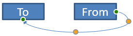

## **अवलोकन**

एक कनेक्टर वह रेखा है जो दो आकृतियों से जुड़ी रह सकती है जब भी किसी भी आकृति को हिलाया जाता है। इसके सिरों को कनेक्शन साइटों से जोड़ा जाता है, जिन्हें PowerPoint में हरे बिंदुओं से दर्शाया जाता है। कुछ मुड़ी और वक्र कनेक्टर अतिरिक्त समायोजन बिंदु भी दिखाते हैं, जिन्हें नारंगी बिंदुओं द्वारा दर्शाया जाता है, और ये व्यक्तिगत कनेक्टर खंडों की स्थिति को नियंत्रित करते हैं।

Aspose.Slides कनेक्टर को [IConnector](https://reference.aspose.com/slides/hi/net/aspose.slides/iconnector/) इंटरफ़ेस के माध्यम से प्रस्तुत करता है। आप इन्हें बना सकते हैं, उनके सिरों को आकृतियों से जोड़ सकते हैं, कनेक्शन साइट चुन सकते हैं, उन्हें पुनःरूट कर सकते हैं, और उन कनेक्टरों की ज्यामिति को बदल सकते हैं जिनमें समायोजन बिंदु होते हैं।

## **कनेक्टर प्रकार**

[ShapeType](https://reference.aspose.com/slides/hi/net/aspose.slides/shapetype/) एनीमरेशन में सीधी, मुड़ी और वक्र कनेक्टर प्रीसेट शामिल हैं। नीचे दी गई तालिका में उपलब्ध कनेक्टर ज्यामितियों और प्रत्येक प्रीसेट द्वारा परिभाषित समायोजन बिंदुओं की संख्या दर्शायी गई है।

| कनेक्टर | छवि | समायोजन बिंदुओं की संख्या |
|---|---|---|
| `ShapeType.Line` |  | 0 |
| `ShapeType.StraightConnector1` |  | 0 |
| `ShapeType.BentConnector2` |  | 0 |
| `ShapeType.BentConnector3` |  | 1 |
| `ShapeType.BentConnector4` |  | 2 |
| `ShapeType.BentConnector5` |  | 3 |
| `ShapeType.CurvedConnector2` |  | 0 |
| `ShapeType.CurvedConnector3` |  | 1 |
| `ShapeType.CurvedConnector4` |  | 2 |
| `ShapeType.CurvedConnector5` |  | 3 |

समायोजन बिंदुओं की संख्या और उनका अर्थ चयनित कनेक्टर प्रीसेट का हिस्सा है। यह न मानें कि दो अलग-अलग कनेक्टर प्रकार समान संग्रह लेआउट दिखाएंगे।

## **दो आकृतियों को जोड़ें**

कनेक्टर जोड़ने के लिए आप [IShapeCollection.AddConnector](https://reference.aspose.com/slides/hi/net/aspose.slides/ishapecollection/addconnector/) का उपयोग कर सकते हैं, और इसके [StartShapeConnectedTo](https://reference.aspose.com/slides/hi/net/aspose.slides/connector/startshapeconnectedto/) तथा [EndShapeConnectedTo](https://reference.aspose.com/slides/hi/net/aspose.slides/connector/endshapeconnectedto/) गुण असाइन कर सकते हैं। दोनों सिरों के जुड़ जाने पर, [IConnector.Reroute](https://reference.aspose.com/slides/hi/net/aspose.slides/iconnector/reroute/) आकृतियों के बीच छोटा मार्ग चुनता है।

निम्न उदाहरण में एक एलीप्स और एक आयत को मुड़े कनेक्टर से जोड़ा गया है:

```csharp
using Aspose.Slides;
using Aspose.Slides.Export;

using var presentation = new Presentation();
var slide = presentation.Slides[0];

var ellipse = slide.Shapes.AddAutoShape(ShapeType.Ellipse, 40, 80, 120, 80);
var rectangle = slide.Shapes.AddAutoShape(ShapeType.Rectangle, 320, 240, 140, 80);
var connector = slide.Shapes.AddConnector(ShapeType.BentConnector2, 0, 0, 10, 10);

connector.StartShapeConnectedTo = ellipse;
connector.EndShapeConnectedTo = rectangle;
connector.Reroute();

presentation.Save("connected-shapes.pptx", SaveFormat.Pptx);
```

{}
`Reroute` को कॉल करने से [StartShapeConnectionSiteIndex](https://reference.aspose.com/slides/hi/net/aspose.slides/connector/startshapeconnectionsiteindex/) और [EndShapeConnectionSiteIndex](https://reference.aspose.com/slides/hi/net/aspose.slides/connector/endshapeconnectionsiteindex/) मान बदल सकते हैं। यदि इन साइटों को स्थायी रखना है तो पुनःरूटिंग के बाद विशिष्ट कनेक्शन साइट असाइन करें।
{}

## **कनेक्शन साइट चुनें**

प्रत्येक कनेक्टेबल आकृति अपने साइटों की संख्या [ConnectionSiteCount](https://reference.aspose.com/slides/hi/net/aspose.slides/shape/connectionsitecount/) के माध्यम से रिपोर्ट करती है। कनेक्टर के सिर पर साइट को असाइन करने से पहले वांछित शून्य‑आधारित साइट सूचकांक को मान्य करें; साइट गणना आकृति की ज्यामिति पर निर्भर करती है।

यह उदाहरण एलीप्स पर एक विशिष्ट साइट मौजूद होने पर कनेक्टर को उस साइट से जोड़ता है:

```csharp
using System;
using Aspose.Slides;
using Aspose.Slides.Export;

using var presentation = new Presentation();
var slide = presentation.Slides[0];

var ellipse = slide.Shapes.AddAutoShape(ShapeType.Ellipse, 40, 80, 120, 80);
var rectangle = slide.Shapes.AddAutoShape(ShapeType.Rectangle, 320, 240, 140, 80);
var connector = slide.Shapes.AddConnector(ShapeType.BentConnector3, 0, 0, 10, 10);

connector.StartShapeConnectedTo = ellipse;
connector.EndShapeConnectedTo = rectangle;

uint preferredSiteIndex = 2;
if (preferredSiteIndex < ellipse.ConnectionSiteCount)
{
    connector.StartShapeConnectionSiteIndex = preferredSiteIndex;
}
else
{
    Console.WriteLine($"The ellipse has only {ellipse.ConnectionSiteCount} connection sites.");
}

presentation.Save("specific-connection-site.pptx", SaveFormat.Pptx);
```

## **कनेक्टर बिंदु को समायोजित करें**

समायोजन बिंदु वाले कनेक्टर [IGeometryShape.Adjustments](https://reference.aspose.com/slides/hi/net/aspose.slides/igeometryshape/adjustments/) के माध्यम से प्रदर्शित होते हैं। प्रत्येक [IAdjustValue](https://reference.aspose.com/slides/hi/net/aspose.slides/iadjustvalue/) को जाँचें और उसके [Type](https://reference.aspose.com/slides/hi/net/aspose.slides/adjustvalue/type/) को देख कर उसके [RawValue](https://reference.aspose.com/slides/hi/net/aspose.slides/adjustvalue/rawvalue/) को बदलें। प्रीसेट आकृति समायोजनों की पहचान के सामान्य नियम [Shape Manipulation](/slides/hi/net/shape-manipulations/) में वर्णित हैं।

समायोजन बिंदुओं की संख्या, क्रम, अर्थ तथा मान्य मान सीमा कनेक्टर प्रीसेट पर निर्भर करती है। `Type` गुण केवल‑पढ़ने योग्य है, जबकि समायोजन मान लिखने योग्य है। यदि किसी कनेक्टर में समान सेमेंटिक प्रकार के कई समायोजन हों तो अतिरिक्त पहचान के लिये केवल‑पढ़ने योग्य [Name](https://reference.aspose.com/slides/hi/net/aspose.slides/adjustvalue/name/) गुण उपयोगी रहता है।

### **रुकावट के चारों ओर मार्ग बनाएं**

निम्न लेआउट में दो आकृतियों के बीच एक `BentConnector5` थर्ड आकृति के माध्यम से गुजरता है:


यह कोड बाधित कनेक्टर बनाता है:

```csharp
using System.Drawing;
using Aspose.Slides;
using Aspose.Slides.Export;

using var presentation = new Presentation();
var slide = presentation.Slides[0];

slide.Shapes.AddAutoShape(ShapeType.Rectangle, 300, 150, 150, 75);
var sourceShape = slide.Shapes.AddAutoShape(ShapeType.Rectangle, 500, 400, 100, 50);
var targetShape = slide.Shapes.AddAutoShape(ShapeType.Rectangle, 100, 100, 70, 30);
var connector = slide.Shapes.AddConnector(ShapeType.BentConnector5, 20, 20, 400, 300);

connector.LineFormat.EndArrowheadStyle = LineArrowheadStyle.Triangle;
connector.LineFormat.FillFormat.FillType = FillType.Solid;
connector.LineFormat.FillFormat.SolidFillColor.Color = Color.Black;
connector.StartShapeConnectedTo = sourceShape;
connector.EndShapeConnectedTo = targetShape;
connector.StartShapeConnectionSiteIndex = 2;

presentation.Save("connector-obstruction.pptx", SaveFormat.Pptx);
```

ऊर्ध्वाधर मोड़ को बदलने से मार्ग बदल जाता है और कनेक्टर बाधा को दरकिनार कर जाता है:


यह उदाहरण मानता नहीं है कि संग्रह सूचकांक `1` हमेशा ऊर्ध्वाधर मोड़ को दर्शाता है; यह `ConnectorBendPositionY` को खोजता है और केवल तब बदलता है जब अपेक्षित सेमेंटिक प्रकार मौजूद हो:

```csharp
using System;
using System.Drawing;
using Aspose.Slides;
using Aspose.Slides.Export;

using var presentation = new Presentation();
var slide = presentation.Slides[0];

slide.Shapes.AddAutoShape(ShapeType.Rectangle, 300, 150, 150, 75);
var sourceShape = slide.Shapes.AddAutoShape(ShapeType.Rectangle, 500, 400, 100, 50);
var targetShape = slide.Shapes.AddAutoShape(ShapeType.Rectangle, 100, 100, 70, 30);
var connector = slide.Shapes.AddConnector(ShapeType.BentConnector5, 20, 20, 400, 300);

connector.LineFormat.EndArrowheadStyle = LineArrowheadStyle.Triangle;
connector.LineFormat.FillFormat.FillType = FillType.Solid;
connector.LineFormat.FillFormat.SolidFillColor.Color = Color.Black;
connector.StartShapeConnectedTo = sourceShape;
connector.EndShapeConnectedTo = targetShape;
connector.StartShapeConnectionSiteIndex = 2;

IAdjustValue? verticalBend = null;
for (var adjustmentIndex = 0; adjustmentIndex < connector.Adjustments.Count; adjustmentIndex++)
{
    var adjustment = connector.Adjustments[adjustmentIndex];
    Console.WriteLine($"{adjustment.Name}: {adjustment.Type}, raw value = {adjustment.RawValue}");
    if (adjustment.Type == ShapeAdjustmentType.ConnectorBendPositionY)
    {
        verticalBend = adjustment;
        break;
    }
}

if (verticalBend is null)
{
    Console.WriteLine("The connector does not expose a vertical bend adjustment.");
}
else
{
    verticalBend.RawValue = 60000;
    presentation.Save("connector-obstruction-fixed.pptx", SaveFormat.Pptx);
}
```

एक `BentConnector5` में दो `ConnectorBendPositionX` समायोजन और एक `ConnectorBendPositionY` समायोजन होते हैं। यदि आवश्यक प्रकार एक से अधिक बार आता है तो चयन करने से पहले `Name` और उस प्रीसेट की ज्ञात ज्यामिति देखें। यदि किसी समायोजन का `ShapeAdjustmentType.Custom` दर्शाया गया है, तो उसका अर्थ और सीमा प्रीसेट‑विशिष्ट मानें और अनुबंध स्पष्ट होने तक उसे न बदलें।

## **समायोजन मानों को कनेक्टर ज्यामिति से जोड़ें**

मुड़े कनेक्टरों के लिये, समायोजन मानों का उपयोग व्यक्तिगत खंडों की स्थितियों का अनुमान लगाने में किया जा सकता है। ये गणनाएँ कनेक्टर प्रीसेट के अनुसार विशिष्ट होती हैं:

- `BentConnector4` सामान्यतः एक `ConnectorBendPositionX` तथा एक `ConnectorBendPositionY` समायोजन प्रकट करता है।
- इन मोड़ स्थितियों के लिये, `RawValue / 100000f` नीचे दिखाए गए उदाहरणों में कनेक्टर फ़्रेम की चौड़ाई या ऊँचाई के अनुपात को देता है।
- कनेक्टर फ़्रेम को घुमाया या उलटा जा सकता है, इसलिए फ़्रेम निर्देशांक को स्लाइड निर्देशांक से तुलना करने से पहले रूपांतरित करना आवश्यक है।

निचे के उदाहरण पहले `Type` द्वारा समायोजन की पहचान करते हैं। वे संग्रह सूचकांकों को पोर्टेबल पहचानकर्ता के रूप में उपयोग नहीं करते।

### **अघूमाया गया कनेक्टर**

प्रारम्भिक लेआउट में दो टेक्स्ट आकृतियों को `BentConnector4` द्वारा जोड़ा गया है:


यह उदाहरण कनेक्टर की जांच करता है और उसके क्षैतिज तथा लम्बवत मोड़ समायोजन प्राप्त करता है:

```csharp
using System;
using System.Drawing;
using Aspose.Slides;

using var presentation = new Presentation();
var slide = presentation.Slides[0];

var sourceShape = slide.Shapes.AddAutoShape(ShapeType.Rectangle, 100, 100, 60, 25);
sourceShape.TextFrame.Text = "From";
var targetShape = slide.Shapes.AddAutoShape(ShapeType.Rectangle, 500, 100, 60, 25);
targetShape.TextFrame.Text = "To";
var connector = slide.Shapes.AddConnector(ShapeType.BentConnector4, 20, 20, 400, 300);

connector.LineFormat.EndArrowheadStyle = LineArrowheadStyle.Triangle;
connector.LineFormat.FillFormat.FillType = FillType.Solid;
connector.LineFormat.FillFormat.SolidFillColor.Color = Color.Crimson;
connector.LineFormat.Width = 3;
connector.StartShapeConnectedTo = sourceShape;
connector.StartShapeConnectionSiteIndex = 3;
connector.EndShapeConnectedTo = targetShape;
connector.EndShapeConnectionSiteIndex = 2;

for (var adjustmentIndex = 0; adjustmentIndex < connector.Adjustments.Count; adjustmentIndex++)
{
    var adjustment = connector.Adjustments[adjustmentIndex];
    Console.WriteLine($"{adjustment.Name}: {adjustment.Type}, raw value = {adjustment.RawValue}");
}
```

दोनों मोड़ बदलने के लिये, प्रत्येक अपेक्षित प्रकार को खोजें और दोनों को मिलने के बाद ही मान संशोधित करें:

```csharp
using System;
using Aspose.Slides;
using Aspose.Slides.Export;

using var presentation = new Presentation();
var slide = presentation.Slides[0];

var sourceShape = slide.Shapes.AddAutoShape(ShapeType.Rectangle, 100, 100, 60, 25);
var targetShape = slide.Shapes.AddAutoShape(ShapeType.Rectangle, 500, 100, 60, 25);
var connector = slide.Shapes.AddConnector(ShapeType.BentConnector4, 20, 20, 400, 300);
connector.StartShapeConnectedTo = sourceShape;
connector.StartShapeConnectionSiteIndex = 3;
connector.EndShapeConnectedTo = targetShape;
connector.EndShapeConnectionSiteIndex = 2;

IAdjustValue? horizontalBend = null;
IAdjustValue? verticalBend = null;
for (var adjustmentIndex = 0; adjustmentIndex < connector.Adjustments.Count; adjustmentIndex++)
{
    var adjustment = connector.Adjustments[adjustmentIndex];
    if (adjustment.Type == ShapeAdjustmentType.ConnectorBendPositionX)
    {
        horizontalBend = adjustment;
    }
    else if (adjustment.Type == ShapeAdjustmentType.ConnectorBendPositionY)
    {
        verticalBend = adjustment;
    }
}

if (horizontalBend is null || verticalBend is null)
{
    Console.WriteLine("The connector does not expose the expected bend adjustments.");
}
else
{
    horizontalBend.RawValue += 20000;
    verticalBend.RawValue += 200000;
    presentation.Save("connector-adjusted.pptx", SaveFormat.Pptx);
}
```

परिणामस्वरूप कनेक्टर के क्षैतिज एवं लम्बवत खंड स्थानांतरित हो गए:


एक बार सेमेंटिक प्रकार ज्ञात हो जाने पर, उनके मानों को कनेक्टर‑फ़्रेम निर्देशांक में बदला जा सकता है। यह उदाहरण दो मोड़ समायोजन द्वारा नियंत्रित लम्बवत खंड के ऊपर एक पतली आयत खींचता है:

```csharp
using System;
using Aspose.Slides;
using Aspose.Slides.Export;

using var presentation = new Presentation();
var slide = presentation.Slides[0];

var sourceShape = slide.Shapes.AddAutoShape(ShapeType.Rectangle, 100, 100, 60, 25);
var targetShape = slide.Shapes.AddAutoShape(ShapeType.Rectangle, 500, 100, 60, 25);
var connector = slide.Shapes.AddConnector(ShapeType.BentConnector4, 20, 20, 400, 300);
connector.StartShapeConnectedTo = sourceShape;
connector.StartShapeConnectionSiteIndex = 3;
connector.EndShapeConnectedTo = targetShape;
connector.EndShapeConnectionSiteIndex = 2;

IAdjustValue? horizontalBend = null;
IAdjustValue? verticalBend = null;
for (var adjustmentIndex = 0; adjustmentIndex < connector.Adjustments.Count; adjustmentIndex++)
{
    var adjustment = connector.Adjustments[adjustmentIndex];
    if (adjustment.Type == ShapeAdjustmentType.ConnectorBendPositionX)
    {
        horizontalBend = adjustment;
    }
    else if (adjustment.Type == ShapeAdjustmentType.ConnectorBendPositionY)
    {
        verticalBend = adjustment;
    }
}

if (horizontalBend is null || verticalBend is null)
{
    Console.WriteLine("The connector does not expose the expected bend adjustments.");
}
else
{
    var x = connector.X + connector.Width * horizontalBend.RawValue / 100000f;
    var y = connector.Y;
    var height = connector.Height * verticalBend.RawValue / 100000f;
    slide.Shapes.AddAutoShape(ShapeType.Rectangle, x, y, 1, height);
    presentation.Save("connector-segment-guide.pptx", SaveFormat.Pptx);
}
```

गाइड आकृति गणना किए गए खंड को दर्शाती है:


### **घुमाया या उलटा कनेक्टर**

जब समान कनेक्टर ज्यामिति को ऊर्ध्वाधर रूप में अभिविन्यस्त किया जाता है, तो उसका [Frame](https://reference.aspose.com/slides/hi/net/aspose.slides/ishape/frame/), [FlipH](https://reference.aspose.com/slides/hi/net/aspose.slides/shapeframe/fliph/), और [FlipV](https://reference.aspose.com/slides/hi/net/aspose.slides/shapeframe/flipv/) मान कनेक्टर‑फ़्रेम निर्देशांक से स्लाइड निर्देशांक में रूपांतरण को प्रभावित करते हैं।

यह उदाहरण ऊर्ध्वाधर अभिविन्यास वाले कनेक्टर को बनाता और समायोजित करता है:

```csharp
using System;
using System.Drawing;
using Aspose.Slides;
using Aspose.Slides.Export;

using var presentation = new Presentation();
var slide = presentation.Slides[0];

var sourceShape = slide.Shapes.AddAutoShape(ShapeType.Rectangle, 100, 100, 60, 25);
sourceShape.TextFrame.Text = "From";
var targetShape = slide.Shapes.AddAutoShape(ShapeType.Rectangle, 100, 400, 60, 25);
targetShape.TextFrame.Text = "To 1";
var connector = slide.Shapes.AddConnector(ShapeType.BentConnector4, 20, 20, 400, 300);

connector.LineFormat.EndArrowheadStyle = LineArrowheadStyle.Triangle;
connector.LineFormat.FillFormat.FillType = FillType.Solid;
connector.LineFormat.FillFormat.SolidFillColor.Color = Color.MediumAquamarine;
connector.LineFormat.Width = 3;
connector.StartShapeConnectedTo = sourceShape;
connector.StartShapeConnectionSiteIndex = 2;
connector.EndShapeConnectedTo = targetShape;
connector.EndShapeConnectionSiteIndex = 3;

for (var adjustmentIndex = 0; adjustmentIndex < connector.Adjustments.Count; adjustmentIndex++)
{
    var adjustment = connector.Adjustments[adjustmentIndex];
    if (adjustment.Type == ShapeAdjustmentType.ConnectorBendPositionX)
    {
        adjustment.RawValue += 20000;
    }
    else if (adjustment.Type == ShapeAdjustmentType.ConnectorBendPositionY)
    {
        adjustment.RawValue += 200000;
    }
}

presentation.Save("vertical-connector-adjusted.pptx", SaveFormat.Pptx);
```

समायोजित कनेक्टर आकृतियों के बीच ऊर्ध्वाधर रूप में दिखता है:


किसी भी घूर्णन कोण `alpha` के लिये, कनेक्टर‑फ़्रेम बिंदु `(x, y)` को फ्रेम केंद्र `(x0, y0)` के चारों ओर घुमाने का सूत्र है:

`X = (x - x0) * cos(alpha) - (y - y0) * sin(alpha) + x0`

`Y = (x - x0) * sin(alpha) + (y - y0) * cos(alpha) + y0`

नीचे दिया गया कोड इस उदाहरण में प्रयुक्त 90‑डिग्री अभिविन्यास को संभालता है और संबंधित कनेक्टर खंड के ऊपर लाल गाइड खींचता है:

```csharp
using System;
using System.Drawing;
using Aspose.Slides;
using Aspose.Slides.Export;

using var presentation = new Presentation();
var slide = presentation.Slides[0];

var sourceShape = slide.Shapes.AddAutoShape(ShapeType.Rectangle, 100, 100, 60, 25);
var targetShape = slide.Shapes.AddAutoShape(ShapeType.Rectangle, 100, 400, 60, 25);
var connector = slide.Shapes.AddConnector(ShapeType.BentConnector4, 20, 20, 400, 300);
connector.StartShapeConnectedTo = sourceShape;
connector.StartShapeConnectionSiteIndex = 2;
connector.EndShapeConnectedTo = targetShape;
connector.EndShapeConnectionSiteIndex = 3;

IAdjustValue? horizontalBend = null;
IAdjustValue? verticalBend = null;
for (var adjustmentIndex = 0; adjustmentIndex < connector.Adjustments.Count; adjustmentIndex++)
{
    var adjustment = connector.Adjustments[adjustmentIndex];
    if (adjustment.Type == ShapeAdjustmentType.ConnectorBendPositionX)
    {
        horizontalBend = adjustment;
    }
    else if (adjustment.Type == ShapeAdjustmentType.ConnectorBendPositionY)
    {
        verticalBend = adjustment;
    }
}

if (horizontalBend is null || verticalBend is null)
{
    Console.WriteLine("The connector does not expose the expected bend adjustments.");
}
else
{
    horizontalBend.RawValue += 20000;
    verticalBend.RawValue += 200000;

    var x = connector.X;
    var y = connector.Y;
    if (connector.Frame.FlipH == NullableBool.True)
    {
        x += connector.Width;
    }
    if (connector.Frame.FlipV == NullableBool.True)
    {
        y += connector.Height;
    }

    x += connector.Width * horizontalBend.RawValue / 100000f;
    var rotatedX = connector.Frame.CenterX - y + connector.Frame.CenterY;
    var rotatedY = x - connector.Frame.CenterX + connector.Frame.CenterY;
    var segmentWidth = connector.Height * verticalBend.RawValue / 100000f;
    var guide = slide.Shapes.AddAutoShape(ShapeType.Rectangle, rotatedX, rotatedY, segmentWidth, 1);
    guide.LineFormat.FillFormat.FillType = FillType.Solid;
    guide.LineFormat.FillFormat.SolidFillColor.Color = Color.Red;

    presentation.Save("rotated-connector-segment-guide.pptx", SaveFormat.Pptx);
}
```

कोऑर्डिनेट परिवर्तन के बाद लाल गाइड गणना किए गए खंड को चिह्नित करता है:


ये सूत्र उदाहरणों में उपयोग किए गये प्रीसेट को दर्शाते हैं, न कि सार्वभौमिक कनेक्टर मॉडल को। समान गणना को किसी अलग प्रीसेट पर लागू करने से पहले समायोजन प्रकार, फ़्रेम अभिविन्यास और मान सीमा को सत्यापित करें।

## **कनेक्टर दिशा कोण खोजें**

सीधे कनेक्टर की दिशा उसकी चौड़ाई और ऊँचाई से, साथ ही क्षैतिज तथा ऊर्ध्वाधर फ़्लिप लागू होने पर, गणना की जा सकती है। निम्न उदाहरण स्लाइड निर्देशांक में सकारात्मक क्षैतिज धुरी से घड़ियों की दिशा में कोण रिपोर्ट करता है:

```csharp
using System;
using Aspose.Slides;

using var presentation = new Presentation();
var slide = presentation.Slides[0];
var connector = slide.Shapes.AddConnector(ShapeType.StraightConnector1, 100, 100, 200, 100);

var flipH = connector.Frame.FlipH == NullableBool.True;
var flipV = connector.Frame.FlipV == NullableBool.True;
var deltaX = connector.Width * (flipH ? -1 : 1);
var deltaY = connector.Height * (flipV ? -1 : 1);
var angle = Math.Atan2(deltaY, deltaX) * 180.0 / Math.PI;

if (angle < 0)
{
    angle += 360;
}

Console.WriteLine($"Connector direction: {angle:F2} degrees");
```

## **अक्सर पूछे जाने वाले प्रश्न**

**मैं कैसे पता करूँ कि कनेक्टर किसी आकृति से जुड़ सकता है या नहीं?**  
आकृति की `ConnectionSiteCount` जाँचें। सकारात्मक मान का अर्थ है कि आकृति कनेक्शन साइट प्रदान करती है। कनेक्टर के सिर पर साइट असाइन करने से पहले चयनित साइट सूचकांक को मान्य करें।

**क्या मैं कनेक्टर समायोजन को उसके संग्रह सूचकांक से पहचान सकता हूँ?**  
सूचकांक केवल तब अर्थपूर्ण होता है जब कनेक्टर प्रीसेट और संग्रह लेआउट ज्ञात हों। मान बदलने से पहले `IAdjustValue.Type` जाँचें, और जब समान सेमेंटिक प्रकार कई बार हो तो अतिरिक्त जानकारी के लिये `IAdjustValue.Name` का उपयोग करें।

**जब जुड़ी हुई आकृति को हटाया जाता है तो क्या होता है?**  
संबंधित कनेक्टर का सिर निरब्द हो जाता है। कनेक्टर स्लाइड पर बना रहता है और आप इसे हटाकर, स्वतंत्र रेखा के रूप में रखकर, या किसी अन्य आकृति से जोड़कर उपयोग कर सकते हैं।

**क्या स्लाइड कॉपी करने पर कनेक्टर बाइंडिंग्स बनी रहती हैं?**  
यदि जुड़े हुए आकृतियों को स्लाइड के साथ कॉपी किया जाता है तो बाइंडिंग्स सामान्यतः बनी रहती हैं। यदि कनेक्टर को उसकी लक्ष्य आकृतियों में से किसी एक के बिना कॉपी किया गया है, तो प्रभावित सिर को फिर से जोड़ना आवश्यक होगा।