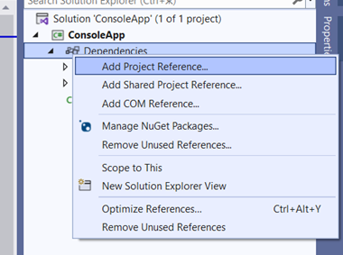

## **अवलोकन**

यह लेख बताता है कि ZIP पैकेज से Aspose.Slides for .NET 6 Cross-Platform का उपयोग कैसे करें। यह वर्णन करता है कि पैकेज को कैसे डाउनलोड करें, `net6.0/crossplatform` फ़ोल्डर से फ़ाइलें अनपैक करें, `Aspose.Slides.dll` का रेफ़रेंस जोड़ें, और प्रोजेक्ट फ़ाइल को इस प्रकार कॉन्फ़िगर करें कि आवश्यक निर्भरता लाइब्रेरी एप्लिकेशन आउटपुट डायरेक्टरी में कॉपी हो जाएँ।

लेख additionally cross‑platform पैकेज की सामग्रियों का विवरण देता है, जिसमें मुख्य Aspose.Slides .NET असेंबली और Windows, Linux, और macOS के लिए प्लेटफ़ॉर्म‑विशिष्ट ग्राफ़िक्स सबसिस्टम लाइब्रेरी शामिल हैं।

{}

Aspose.Slides for .NET 6 Cross-Platform भी [NuGet](https://www.nuget.org/packages/Aspose.Slides.NET6.CrossPlatform) से उपलब्ध है।

{}

## **ZIP पैकेज से Cross-Platform Aspose.Slides का उपयोग**

1. नवीनतम Aspose.Slides का ZIP पैकेज [Release Page](https://releases.aspose.com/slides/hi/net/) से डाउनलोड करें।

2. *Aspose.Slides.zip\Aspose.Slides\net6.0\crossplatform* से फ़ाइलों को अनपैक करें और उन्हें उस फ़ोल्डर में रखें जो आपके प्रोजेक्ट में निर्भरताओं के लिए उपयोग होगा।

3. Aspose.Slides.dll का रेफ़रेंस जोड़ें।

   

   हमारे उदाहरण (नीचे) में, लाइब्रेरीज़ प्रोजेक्ट फ़ोल्डर में इस पथ पर स्थित हैं: *ConsoleApp\libs\Aspose.Slides\net6.0\crossplatform\...*

   

4. शेष फ़ाइलों (जिन पर Aspose.Slides निर्भर करता है) को आउटपुट डायरेक्टरी में रखने के लिए csproj प्रोजेक्ट फ़ाइल में इस प्रकार निर्देश जोड़ें:

```xml
<ItemGroup>

   <None Update="libs\Aspose.Slides\net6.0\crossplatform\aspose.slides.drawing.capi_vc14x64.dll">
         <CopyToOutputDirectory>PreserveNewest</CopyToOutputDirectory>
         <TargetPath>aspose.slides.drawing.capi_vc14x64.dll</TargetPath>
   </None>

   <None Update="libs\Aspose.Slides\net6.0\crossplatform\aspose.slides.drawing.capi_vc14x86.dll">
         <CopyToOutputDirectory>PreserveNewest</CopyToOutputDirectory>
         <TargetPath>aspose.slides.drawing.capi_vc14x86.dll</TargetPath>
   </None>

   <None Update="libs\Aspose.Slides\net6.0\crossplatform\Aspose.Slides.xml">
         <CopyToOutputDirectory>PreserveNewest</CopyToOutputDirectory>
         <TargetPath>Aspose.Slides.xml</TargetPath>
   </None>

   <None Update="libs\Aspose.Slides\net6.0\crossplatform\libaspose.slides.drawing.capi_appleclang_x86_64.dylib">
         <CopyToOutputDirectory>PreserveNewest</CopyToOutputDirectory>
         <TargetPath>libaspose.slides.drawing.capi_appleclang_x86_64.dylib</TargetPath>
   </None>

   <None Update="libs\Aspose.Slides\net6.0\crossplatform\libaspose.slides.drawing.capi_appleclang_arm64.dylib">
         <CopyToOutputDirectory>PreserveNewest</CopyToOutputDirectory>
         <TargetPath>libaspose.slides.drawing.capi_appleclang_arm64.dylib</TargetPath>
   </None>

   <None Update="libs\Aspose.Slides\net6.0\crossplatform\libaspose.slides.drawing.capi_x86_64_libstdcpp_libc2.23.so">
         <CopyToOutputDirectory>PreserveNewest</CopyToOutputDirectory>
         <TargetPath>libaspose.slides.drawing.capi_x86_64_libstdcpp_libc2.23.so</TargetPath>
   </None>

</ItemGroup>
```

5. `TargetPath` पर ध्यान दें।

   डिफ़ॉल्ट रूप से, `<CopyToOutputDirectory>` फ़ाइलों को उनकी सापेक्ष पथ संरचना बनाए रखते हुए कॉपी करता है, लेकिन हमें निर्भर लाइब्रेरीज़ को उसी फ़ोल्डर में ले जाना है जहाँ आउटपुट उत्पन्न होता है (Aspose.Slides.dll की लोकेशन)।

## **नोट्स**

### **स्वामित्व ग्राफ़िक्स सबसिस्टम**

Aspose.Slides cross‑platform लाइब्रेरीज़ का संग्रह है:

| Aspose.Slides.dll                                          | सभी Aspose.Slides लॉजिक के लिए जिम्मेदार मुख्य .NET असेंबली |
| ---------------------------------------------------------- | ------------------------------------------------------------ |
| aspose.slides.drawing.capi_vc14x64.dll                     | निर्भरता: Win x64 के लिए ग्राफ़िक्स सबसिस्टम इम्प्लीमेंटेशन |
| aspose.slides.drawing.capi_vc14x86.dll                     | निर्भरता: Win x64 के लिए ग्राफ़िक्स सबसिस्टम इम्प्लीमेंटेशन |
| libaspose.slides.drawing.capi_x86_64_libstdcpp_libc2.23.so | निर्भरता: Linux (x86/x64) के लिए ग्राफ़िक्स सबसिस्टम इम्प्लीमेंटेशन |
| libaspose.slides.drawing.capi_appleclang_x86_64.dylib      | निर्भरता: macOS AMD64 (x86-64/x64) के लिए ग्राफ़िक्स सबसिस्टम इम्प्लीमेंटेशन |
| libaspose.slides.drawing.capi_appleclang_arm64.dylib       | निर्भरता: macOS ARM64 (AArch64) के लिए ग्राफ़िक्स सबसिस्टम इम्प्लीमेंटेशन |

Aspose.Slides.dll वह लाइब्रेरी उपयोग करता है जो चल रहे सिस्टम की आवश्यकता होती है। लाइब्रेरीज़ सामान्यतः Aspose.Slides.dll के समान स्थान में किसी भी फ़ाइल सिस्टम में स्थित होती हैं।

### **ZIP पैकेज संरचना**

ZIP पैकेज में निम्नलिखित फ़ोल्डर संरचना होती है:

  Aspose.Slides

  ├─── net6.0

  │  ├─── crossplatform

  │  └─── default

  ├─── net20

  ├─── net462

  └─── netstandard2.0

* प्रत्येक फ़ोल्डर अपने संबंधित .NET संस्करण के असेंबली रखता है। net6.0 के दो संस्करण हैं: default और crossplatform। बाद वाला cross‑platform Aspose.Slides.dll और उसकी सभी निर्भरताएँ रखता है। इस फ़ोल्डर की अनपैक्ड सामग्री को cross‑platform विकास और अन्य Aspose.Slides उपयोग मामलों के लिए प्रोजेक्ट में निर्भरता जोड़ने हेतु उपयोग किया जा सकता है।

## **संबंधित लिंक**

- [System Requirements](/slides/hi/net/system-requirements/)