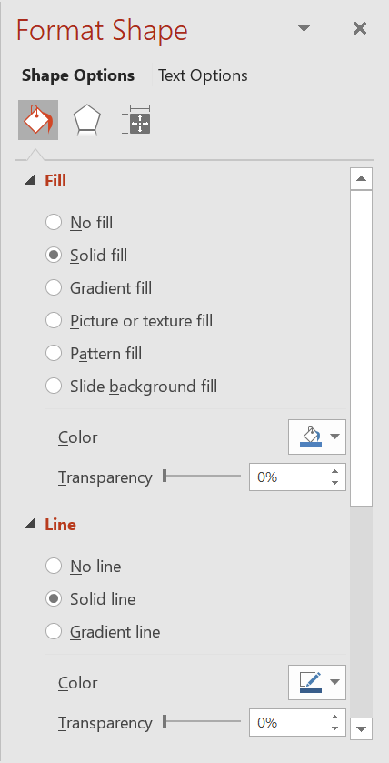
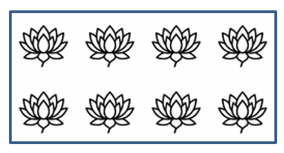

## **परिचय**

PowerPoint में, आप स्लाइड्स में आकृतियाँ जोड़ सकते हैं। चूँकि आकृतियाँ रेखाओं से बनी होती हैं, आप उनकी रूपरेखा को संशोधित करके या प्रभाव लागू करके उन्हें फ़ॉर्मेट कर सकते हैं। अतिरिक्त रूप से, आप आकृतियों को इस प्रकार सेटिंग्स निर्दिष्ट करके फ़ॉर्मेट कर सकते हैं जो उनके आंतरिक भाग को कैसे भरना है, नियंत्रित करती हैं।



Aspose.Slides for Node.js via Java ऐसी क्लास और मेथड प्रदान करता है जो आपको PowerPoint में उपलब्ध समान विकल्पों का उपयोग करके आकृतियों को फ़ॉर्मेट करने की अनुमति देते हैं।

## **रेखाओं का फ़ॉर्मेट**

Aspose.Slides का उपयोग करके आप किसी आकृति के लिए एक कस्टम लाइन शैली निर्दिष्ट कर सकते हैं। नीचे दिए गए चरण इस प्रक्रिया को दर्शाते हैं:

1. एक [Presentation](https://reference.aspose.com/slides/hi/nodejs-java/aspose.slides/presentation/) क्लास का एक उदाहरण बनाएं।
1. इंडेक्स द्वारा स्लाइड का संदर्भ प्राप्त करें।
1. स्लाइड में एक [AutoShape](https://reference.aspose.com/slides/hi/nodejs-java/aspose.slides/autoshape/) जोड़ें।
1. आकृति की [line style](https://reference.aspose.com/slides/hi/nodejs-java/aspose.slides/linestyle/) सेट करें।
1. लाइन की चौड़ाई सेट करें।
1. लाइन की [dash style](https://reference.aspose.com/slides/hi/nodejs-java/aspose.slides/linedashstyle/) सेट करें।
1. आकृति के लिए लाइन का रंग सेट करें।
1. संशोधित प्रस्तुति को PPTX फ़ाइल के रूप में सहेजें।

```js
// प्रेजेंटेशन फ़ाइल का प्रतिनिधित्व करने वाली Presentation क्लास का उदाहरण बनाएं।
let presentation = new aspose.slides.Presentation();
try {
    // पहली स्लाइड प्राप्त करें।
    let slide = presentation.getSlides().get_Item(0);

    // Rectangle प्रकार की एक ऑटो आकृति जोड़ें।
    let shape = slide.getShapes().addAutoShape(aspose.slides.ShapeType.Rectangle, 50, 150, 150, 75);

    // आयत आकृति के लिए भराव रंग सेट करें।
    shape.getFillFormat().setFillType(java.newByte(aspose.slides.FillType.NoFill));

    // आयत की रेखाओं पर स्वरूपण लागू करें।
    shape.getLineFormat().setStyle(java.newByte(aspose.slides.LineStyle.ThickThin));
    shape.getLineFormat().setWidth(7);
    shape.getLineFormat().setDashStyle(java.newByte(aspose.slides.LineDashStyle.Dash));

    // आयत की रेखा के लिए रंग सेट करें।
    shape.getLineFormat().getFillFormat().setFillType(java.newByte(aspose.slides.FillType.Solid));
    shape.getLineFormat().getFillFormat().getSolidFillColor().setColor(java.getStaticFieldValue("java.awt.Color", "BLUE"));

    // PPTX फ़ाइल को डिस्क पर सहेजें।
    presentation.save("formatted_lines.pptx", aspose.slides.SaveFormat.Pptx);
} finally {
    presentation.dispose();
}
```

परिणाम:


## **जॉइन शैलियों का फ़ॉर्मेट**

यहाँ तीन जॉइन प्रकार विकल्प हैं:

* राउंड
* मिटर
* बिवेल

डिफ़ॉल्ट रूप से, जब PowerPoint दो रेखाओं को कोण पर जोड़ता है (जैसे किसी आकृति के कोने पर), तो यह **राउंड** सेटिंग का उपयोग करता है। हालांकि, यदि आप तीखे कोण वाली आकृति बना रहे हैं, तो आप **मिटर** विकल्प को प्राथमिकता दे सकते हैं।


नीचे दिया गया JavaScript कोड दिखाता है कि उपर्युक्त छवि में दिखाए गए तीन आयतों को मिटर, बिवेल और राउंड जॉइन प्रकार सेटिंग्स का उपयोग करके कैसे बनाया गया:

```js
// प्रेजेंटेशन फ़ाइल का प्रतिनिधित्व करने वाली Presentation क्लास का उदाहरण बनाएं।
let presentation = new aspose.slides.Presentation();
try {
    // पहली स्लाइड प्राप्त करें।
    let slide = presentation.getSlides().get_Item(0);

    // Rectangle प्रकार की तीन ऑटो आकृतियाँ जोड़ें।
    let shape1 = slide.getShapes().addAutoShape(aspose.slides.ShapeType.Rectangle, 20, 20, 150, 75);
    let shape2 = slide.getShapes().addAutoShape(aspose.slides.ShapeType.Rectangle, 210, 20, 150, 75);
    let shape3 = slide.getShapes().addAutoShape(aspose.slides.ShapeType.Rectangle, 20, 135, 150, 75);

    // प्रत्येक आयत आकृति के लिए भराव रंग सेट करें।
    shape1.getFillFormat().setFillType(java.newByte(aspose.slides.FillType.Solid));
    shape1.getFillFormat().getSolidFillColor().setColor(java.getStaticFieldValue("java.awt.Color", "BLACK"));
    shape2.getFillFormat().setFillType(java.newByte(aspose.slides.FillType.Solid));
    shape2.getFillFormat().getSolidFillColor().setColor(java.getStaticFieldValue("java.awt.Color", "BLACK"));
    shape3.getFillFormat().setFillType(java.newByte(aspose.slides.FillType.Solid));
    shape3.getFillFormat().getSolidFillColor().setColor(java.getStaticFieldValue("java.awt.Color", "BLACK"));

    // रेखा की चौड़ाई सेट करें।
    shape1.getLineFormat().setWidth(15);
    shape2.getLineFormat().setWidth(15);
    shape3.getLineFormat().setWidth(15);

    // प्रत्येक आयत की रेखा के लिए रंग सेट करें।
    shape1.getLineFormat().getFillFormat().setFillType(java.newByte(aspose.slides.FillType.Solid));
    shape1.getLineFormat().getFillFormat().getSolidFillColor().setColor(java.getStaticFieldValue("java.awt.Color", "BLUE"));
    shape2.getLineFormat().getFillFormat().setFillType(java.newByte(aspose.slides.FillType.Solid));
    shape2.getLineFormat().getFillFormat().getSolidFillColor().setColor(java.getStaticFieldValue("java.awt.Color", "BLUE"));
    shape3.getLineFormat().getFillFormat().setFillType(java.newByte(aspose.slides.FillType.Solid));
    shape3.getLineFormat().getFillFormat().getSolidFillColor().setColor(java.getStaticFieldValue("java.awt.Color", "BLUE"));

    // जॉइन शैली सेट करें।
    shape1.getLineFormat().setJoinStyle(java.newByte(aspose.slides.LineJoinStyle.Miter));
    shape2.getLineFormat().setJoinStyle(java.newByte(aspose.slides.LineJoinStyle.Bevel));
    shape3.getLineFormat().setJoinStyle(java.newByte(aspose.slides.LineJoinStyle.Round));

    // प्रत्येक आयत में पाठ जोड़ें।
    shape1.getTextFrame().setText("Miter Join Style");
    shape2.getTextFrame().setText("Bevel Join Style");
    shape3.getTextFrame().setText("Round Join Style");

    // PPTX फ़ाइल को डिस्क पर सहेजें।
    presentation.save("join_styles.pptx", aspose.slides.SaveFormat.Pptx);
} finally {
    presentation.dispose();
}
```

## **ग्रेडिएंट फ़िल**

PowerPoint में, ग्रेडिएंट फ़िल एक फ़ॉर्मेटिंग विकल्प है जो आपको एक आकृति पर निरंतर रंग मिश्रण लागू करने की अनुमति देता है। उदाहरण के लिए, आप दो या अधिक रंग इस तरह लागू कर सकते हैं कि एक धीरे‑धीरे दूसरे में बदलता जाए।

Aspose.Slides का उपयोग करके आकृति पर ग्रेडिएंट फ़िल लागू करने के चरण:

1. एक [Presentation](https://reference.aspose.com/slides/hi/nodejs-java/aspose.slides/presentation/) क्लास का एक उदाहरण बनाएं।
1. इंडेक्स द्वारा स्लाइड का संदर्भ प्राप्त करें।
1. स्लाइड में एक [AutoShape](https://reference.aspose.com/slides/hi/nodejs-java/aspose.slides/autoshape/) जोड़ें।
1. आकृति की [FillType](https://reference.aspose.com/slides/hi/nodejs-java/aspose.slides/filltype/) को `Gradient` सेट करें।
1. ग्रेडिएंट स्टॉप कलेक्शन के `add` मेथड का उपयोग करके अपनी दो पसंदीदा रंगों को परिभाषित स्थितियों के साथ जोड़ें, जिसे [GradientFormat](https://reference.aspose.com/slides/hi/nodejs-java/aspose.slides/gradientformat/) क्लास द्वारा उजागर किया गया है।
1. संशोधित प्रस्तुति को PPTX फ़ाइल के रूप में सहेजें।

```js
// प्रेजेंटेशन फ़ाइल का प्रतिनिधित्व करने वाली Presentation क्लास का उदाहरण बनाएं।
let presentation = new aspose.slides.Presentation();
try {
    // पहली स्लाइड प्राप्त करें।
    let slide = presentation.getSlides().get_Item(0);

    // Ellipse प्रकार की एक ऑटो आकृति जोड़ें।
    let shape = slide.getShapes().addAutoShape(aspose.slides.ShapeType.Ellipse, 50, 50, 150, 75);

    // दीर्घवृत्त पर ग्रेडिएंट फ़ॉर्मेटिंग लागू करें।
    shape.getFillFormat().setFillType(java.newByte(aspose.slides.FillType.Gradient));
    shape.getFillFormat().getGradientFormat().setGradientShape(java.newByte(aspose.slides.GradientShape.Linear));

    // ग्रेडिएंट की दिशा सेट करें।
    shape.getFillFormat().getGradientFormat().setGradientDirection(aspose.slides.GradientDirection.FromCorner2);

    // दो ग्रेडिएंट स्टॉप जोड़ें।
    shape.getFillFormat().getGradientFormat().getGradientStops().addPresetColor(1.0, aspose.slides.PresetColor.Purple);
    shape.getFillFormat().getGradientFormat().getGradientStops().addPresetColor(0, aspose.slides.PresetColor.Red);

    // PPTX फ़ाइल को डिस्क पर सहेजें।
    presentation.save("gradient_fill.pptx", aspose.slides.SaveFormat.Pptx);
} finally {
    presentation.dispose();
}
```

परिणाम:


## **पैटर्न फ़िल**

PowerPoint में, पैटर्न फ़िल एक फ़ॉर्मेटिंग विकल्प है जो आपको दो‑रंगी डिज़ाइन—जैसे बिंदु, धारियाँ, क्रॉसहैच या चेक्स—को किसी आकृति पर लागू करने देता है। आप पैटर्न के अग्रभूमि और पृष्ठभूमि के लिए कस्टम रंग चुन सकते हैं।

Aspose.Slides 45 से अधिक पूर्वनिर्धारित पैटर्न शैलियाँ प्रदान करता है जिन्हें आप अपनी प्रस्तुतियों की दृश्य अपील बढ़ाने के लिए आकृति पर लागू कर सकते हैं। पूर्वनिर्धारित पैटर्न चुनने के बाद भी आप उपयोग होने वाले सटीक रंग निर्दिष्ट कर सकते हैं।

पैटर्न फ़िल को आकृति पर लागू करने के चरण:

1. एक [Presentation](https://reference.aspose.com/slides/hi/nodejs-java/aspose.slides/presentation/) क्लास का एक उदाहरण बनाएं।
1. इंडेक्स द्वारा स्लाइड का संदर्भ प्राप्त करें।
1. स्लाइड में एक [AutoShape](https://reference.aspose.com/slides/hi/nodejs-java/aspose.slides/autoshape/) जोड़ें।
1. आकृति की [FillType](https://reference.aspose.com/slides/hi/nodejs-java/aspose.slides/filltype/) को `Pattern` सेट करें।
1. पूर्वनिर्धारित विकल्पों में से एक पैटर्न शैली चुनें।
1. पैटर्न की [Background Color](https://reference.aspose.com/slides/hi/nodejs-java/aspose.slides/patternformat/#getBackColor--) सेट करें।
1. पैटर्न की [Foreground Color](https://reference.aspose.com/slides/hi/nodejs-java/aspose.slides/patternformat/#getForeColor--) सेट करें।
1. संशोधित प्रस्तुति को PPTX फ़ाइल के रूप में सहेजें।

```js
// प्रेजेंटेशन फ़ाइल का प्रतिनिधित्व करने वाली Presentation क्लास का उदाहरण बनाएं।
let presentation = new aspose.slides.Presentation();
try {
    // पहली स्लाइड प्राप्त करें।
    let slide = presentation.getSlides().get_Item(0);

    // Rectangle प्रकार की एक ऑटो आकृति जोड़ें।
    let shape = slide.getShapes().addAutoShape(aspose.slides.ShapeType.Rectangle, 50, 50, 150, 75);

    // फ़िल प्रकार को Pattern सेट करें।
    shape.getFillFormat().setFillType(java.newByte(aspose.slides.FillType.Pattern));

    // पैटर्न शैली सेट करें।
    shape.getFillFormat().getPatternFormat().setPatternStyle(java.newByte(aspose.slides.PatternStyle.Trellis));

    // पैटर्न की पृष्ठभूमि और अग्रभूमि रंग सेट करें।
    shape.getFillFormat().getPatternFormat().getBackColor().setColor(java.getStaticFieldValue("java.awt.Color", "LIGHT_GRAY"));
    shape.getFillFormat().getPatternFormat().getForeColor().setColor(java.getStaticFieldValue("java.awt.Color", "YELLOW"));

    // PPTX फ़ाइल को डिस्क पर सहेजें।
    presentation.save("pattern_fill.pptx", aspose.slides.SaveFormat.Pptx);
} finally {
    presentation.dispose();
}
```

परिणाम:


## **पिक्चर फ़िल**

PowerPoint में, पिक्चर फ़िल एक फ़ॉर्मेटिंग विकल्प है जो आपको किसी आकृति के भीतर एक छवि सम्मिलित करने देता है—अर्थात् छवि को आकृति की पृष्ठभूमि के रूप में उपयोग करना।

Aspose.Slides का उपयोग करके पिक्चर फ़िल को आकृति पर लागू करने के चरण:

1. एक [Presentation](https://reference.aspose.com/slides/hi/nodejs-java/aspose.slides/presentation/) क्लास का एक उदाहरण बनाएं।
1. इंडेक्स द्वारा स्लाइड का संदर्भ प्राप्त करें।
1. स्लाइड में एक [AutoShape](https://reference.aspose.com/slides/hi/nodejs-java/aspose.slides/autoshape/) जोड़ें।
1. आकृति की [FillType](https://reference.aspose.com/slides/hi/nodejs-java/aspose.slides/filltype/) को `Picture` सेट करें।
1. पिक्चर फ़िल मोड को `Tile` (या अन्य पसंदीदा मोड) सेट करें।
1. वह छवि उपयोग करके एक [PPImage](https://reference.aspose.com/slides/hi/nodejs-java/aspose.slides/ppimage/) ऑब्जेक्ट बनाएं।
1. इमेज को `ISlidesPicture.setImage` मेथड में पास करें।
1. संशोधित प्रस्तुति को PPTX फ़ाइल के रूप में सहेजें।

मान लें कि हमारे पास "lotus.png" फ़ाइल निम्नलिखित चित्र के साथ है:


नीचे दिया गया JavaScript कोड दिखाता है कि कैसे पिक्चर के साथ आकृति को भरें:

```js
// प्रेजेंटेशन फ़ाइल का प्रतिनिधित्व करने वाली Presentation क्लास का उदाहरण बनाएं।
let presentation = new aspose.slides.Presentation();
try {
    // पहली स्लाइड प्राप्त करें।
    let slide = presentation.getSlides().get_Item(0);

    // Rectangle प्रकार की एक ऑटो आकृति जोड़ें।
    let shape = slide.getShapes().addAutoShape(aspose.slides.ShapeType.Rectangle, 50, 50, 255, 130);
    
    // फ़िल प्रकार को Picture सेट करें।
    shape.getFillFormat().setFillType(java.newByte(aspose.slides.FillType.Picture));

    // पिक्चर फ़िल मोड सेट करें।
    shape.getFillFormat().getPictureFillFormat().setPictureFillMode(aspose.slides.PictureFillMode.Tile);

    // एक छवि लोड करें और उसे प्रेजेंटेशन संसाधनों में जोड़ें।
    let image = aspose.slides.Images.fromFile("lotus.png");
    let picture = presentation.getImages().addImage(image);
    image.dispose();

    // चित्र सेट करें।
    shape.getFillFormat().getPictureFillFormat().getPicture().setImage(picture);

    // PPTX फ़ाइल को डिस्क पर सहेजें।
    presentation.save("picture_fill.pptx", aspose.slides.SaveFormat.Pptx);
} finally {
    presentation.dispose();
}
```

परिणाम:



### **टाइल पिक्चर को टेक्सचर के रूप में**

यदि आप टाइल की गई छवि को टेक्सचर के रूप में सेट करना और टाइलिंग व्यवहार को अनुकूलित करना चाहते हैं, तो आप [PictureFillFormat](https://reference.aspose.com/slides/hi/nodejs-java/aspose.slides/picturefillformat/) क्लास के निम्नलिखित मेथड्स का उपयोग कर सकते हैं:

- [setPictureFillMode](https://reference.aspose.com/slides/hi/nodejs-java/aspose.slides/picturefillformat/#setPictureFillMode): पिक्चर फ़िल मोड सेट करता है—या तो `Tile` या `Stretch`।
- [setTileAlignment](https://reference.aspose.com/slides/hi/nodejs-java/aspose.slides/picturefillformat/#setTileAlignment): आकृति के भीतर टाइलों की संरेखण निर्दिष्ट करता है।
- [setTileFlip](https://reference.aspose.com/slides/hi/nodejs-java/aspose.slides/picturefillformat/#setTileFlip): नियंत्रित करता है कि टाइल क्षैतिज, ऊर्ध्वाधर या दोनों दिशाओं में फ्लिप हो या नहीं।
- [setTileOffsetX](https://reference.aspose.com/slides/hi/nodejs-java/aspose.slides/picturefillformat/#setTileOffsetX): आकृति के मूल बिंदु से टाइल का क्षैतिज ऑफ़सेट (पॉइंट्स में) सेट करता है।
- [setTileOffsetY](https://reference.aspose.com/slides/hi/nodejs-java/aspose.slides/picturefillformat/#setTileOffsetY): आकृति के मूल बिंदु से टाइल का ऊर्ध्वाधर ऑफ़सेट (पॉइंट्स में) सेट करता है।
- [setTileScaleX](https://reference.aspose.com/slides/hi/nodejs-java/aspose.slides/picturefillformat/#setTileScaleX): टाइल के क्षैतिज स्केल को प्रतिशत में परिभाषित करता है।
- [setTileScaleY](https://reference.aspose.com/slides/hi/nodejs-java/aspose.slides/picturefillformat/#setTileScaleY): टाइल के ऊर्ध्वाधर स्केल को प्रतिशत में परिभाषित करता है।

नीचे दिया गया कोड उदाहरण दिखाता है कि कैसे टाइल्ड पिक्चर फ़िल के साथ एक आयताकार आकृति जोड़ें और टाइल विकल्प कॉन्फ़िगर करें:

```js
// प्रेजेंटेशन फ़ाइल का प्रतिनिधित्व करने वाली Presentation क्लास का उदाहरण बनाएं।
let presentation = new aspose.slides.Presentation();
try {
    // पहली स्लाइड प्राप्त करें।
    let firstSlide = presentation.getSlides().get_Item(0);

    // Rectangle ऑटो आकृति जोड़ें।
    let shape = firstSlide.getShapes().addAutoShape(aspose.slides.ShapeType.Rectangle, 50, 50, 190, 95);

    // आकृति के फ़िल प्रकार को Picture सेट करें।
    shape.getFillFormat().setFillType(java.newByte(aspose.slides.FillType.Picture));

    // छवि लोड करें और उसे प्रेजेंटेशन संसाधनों में जोड़ें।
    let sourceImage = aspose.slides.Images.fromFile("lotus.png");
    let presentationImage = presentation.getImages().addImage(sourceImage);
    sourceImage.dispose();

    // छवि को आकृति को असाइन करें।
    let pictureFillFormat = shape.getFillFormat().getPictureFillFormat();
    pictureFillFormat.getPicture().setImage(presentationImage);

    // पिक्चर फ़िल मोड और टाइलिंग गुण कॉन्फ़िगर करें।
    pictureFillFormat.setPictureFillMode(aspose.slides.PictureFillMode.Tile);
    pictureFillFormat.setTileOffsetX(-32);
    pictureFillFormat.setTileOffsetY(-32);
    pictureFillFormat.setTileScaleX(50);
    pictureFillFormat.setTileScaleY(50);
    pictureFillFormat.setTileAlignment(java.newByte(aspose.slides.RectangleAlignment.BottomRight));
    pictureFillFormat.setTileFlip(aspose.slides.TileFlip.FlipBoth);

    // PPTX फ़ाइल को डिस्क पर सहेजें।
    presentation.save("tile.pptx", aspose.slides.SaveFormat.Pptx);
} finally {
    presentation.dispose();
}
```

परिणाम:


## **सॉलिड रंग फ़िल**

PowerPoint में, सॉलिड रंग फ़िल एक फ़ॉर्मेटिंग विकल्प है जो किसी आकृति को एक ही समान रंग से भरता है। यह साधारण पृष्ठभूमि रंग बिना किसी ग्रेडिएंट, टेक्सचर या पैटर्न के लागू किया जाता है।

Aspose.Slides का उपयोग करके आकृति पर सॉलिड रंग फ़िल लागू करने के चरण:

1. एक [Presentation](https://reference.aspose.com/slides/hi/nodejs-java/aspose.slides/presentation/) क्लास का एक उदाहरण बनाएं।
1. इंडेक्स द्वारा स्लाइड का संदर्भ प्राप्त करें।
1. स्लाइड में एक [AutoShape](https://reference.aspose.com/slides/hi/nodejs-java/aspose.slides/autoshape/) जोड़ें।
1. आकृति की [FillType](https://reference.aspose.com/slides/hi/nodejs-java/aspose.slides/filltype/) को `Solid` सेट करें।
1. आकृति को अपनी पसंद का फ़िल रंग असाइन करें।
1. संशोधित प्रस्तुति को PPTX फ़ाइल के रूप में सहेजें।

```js
// प्रेजेंटेशन फ़ाइल का प्रतिनिधित्व करने वाली Presentation क्लास का उदाहरण बनाएं।
let presentation = new aspose.slides.Presentation();
try {
    // पहली स्लाइड प्राप्त करें।
    let slide = presentation.getSlides().get_Item(0);

    // Rectangle प्रकार की एक ऑटो आकृति जोड़ें।
    let shape = slide.getShapes().addAutoShape(aspose.slides.ShapeType.Rectangle, 50, 50, 150, 75);

    // फ़िल प्रकार को Solid सेट करें।
    shape.getFillFormat().setFillType(java.newByte(aspose.slides.FillType.Solid));

    // फ़िल रंग सेट करें।
    shape.getFillFormat().getSolidFillColor().setColor(java.getStaticFieldValue("java.awt.Color", "YELLOW"));

    // PPTX फ़ाइल को डिस्क पर सहेजें।
    presentation.save("solid_color_fill.pptx", aspose.slides.SaveFormat.Pptx);
} finally {
    presentation.dispose();
}
```

परिणाम:


## **पारदर्शिता सेट करें**

PowerPoint में, जब आप अकृति पर सॉलिड रंग, ग्रेडिएंट, पिक्चर या टेक्सचर फ़िल लागू करते हैं, तो आप फ़िल की अपारदर्शिता को नियंत्रित करने के लिए पारदर्शिता स्तर भी सेट कर सकते हैं। उच्च पारदर्शिता मान आकृति को अधिक पारदर्शी बनाता है, जिससे पृष्ठभूमि या नीचे स्थित ऑब्जेक्ट आंशिक रूप से दिखाई देते हैं।

Aspose.Slides आपको फ़िल के लिए उपयोग किए गए रंग के अल्फा मान को समायोजित करके पारदर्शिता स्तर सेट करने देता है। इसे करने का तरीका:

1. एक [Presentation](https://reference.aspose.com/slides/hi/nodejs-java/aspose.slides/presentation/) क्लास का एक उदाहरण बनाएं।
1. इंडेक्स द्वारा स्लाइड का संदर्भ प्राप्त करें।
1. स्लाइड में एक [AutoShape](https://reference.aspose.com/slides/hi/nodejs-java/aspose.slides/autoshape/) जोड़ें।
1. [FillType](https://reference.aspose.com/slides/hi/nodejs-java/aspose.slides/filltype/) को `Solid` सेट करें।
1. `Color` का उपयोग करके पारदर्शिता (अल्फा कॉम्पोनेन्ट) के साथ एक रंग परिभाषित करें।
1. प्रस्तुति को सहेजें।

```js
// प्रेजेंटेशन फ़ाइल का प्रतिनिधित्व करने वाली Presentation क्लास का उदाहरण बनाएं।
let presentation = new aspose.slides.Presentation();
try {
    // पहली स्लाइड प्राप्त करें।
    let slide = presentation.getSlides().get_Item(0);

    // सॉलिड आयत ऑटो आकृति जोड़ें।
    let solidShape = slide.getShapes().addAutoShape(aspose.slides.ShapeType.Rectangle, 50, 50, 150, 75);

    // सॉलिड आकृति के ऊपर एक पारदर्शी आयत ऑटो आकृति जोड़ें।
    let transparentShape = slide.getShapes().addAutoShape(aspose.slides.ShapeType.Rectangle, 80, 80, 150, 75);
    transparentShape.getFillFormat().setFillType(java.newByte(aspose.slides.FillType.Solid));
    transparentShape.getFillFormat().getSolidFillColor().setColor(java.newInstanceSync("java.awt.Color", 255, 255, 0, 204));

    // PPTX फ़ाइल को डिस्क पर सहेजें।
    presentation.save("shape_transparency.pptx", aspose.slides.SaveFormat.Pptx);
} finally {
    presentation.dispose();
}
```

परिणाम:


## **आकृतियों को घुमाएँ**

Aspose.Slides आपको PowerPoint प्रस्तुतियों में आकृतियों को घुमाने की सुविधा देता है। यह विशेष रूप से तब उपयोगी होता है जब आपको दृश्य तत्वों को विशिष्ट संरेखण या डिजाइन आवश्यकताओं के अनुसार स्थिति देना हो।

स्लाइड पर किसी आकृति को घुमाने के चरण:

1. एक [Presentation](https://reference.aspose.com/slides/hi/nodejs-java/aspose.slides/presentation/) क्लास का एक उदाहरण बनाएं।
1. इंडेक्स द्वारा स्लाइड का संदर्भ प्राप्त करें।
1. स्लाइड में एक [AutoShape](https://reference.aspose.com/slides/hi/nodejs-java/aspose.slides/autoshape/) जोड़ें।
1. आकृति के घुमाव गुण को इच्छित कोण पर सेट करें।
1. प्रस्तुति को सहेजें।

```js
// प्रेजेंटेशन फ़ाइल का प्रतिनिधित्व करने वाली Presentation क्लास का उदाहरण बनाएं।
let presentation = new aspose.slides.Presentation();
try {
    // पहली स्लाइड प्राप्त करें।
    let slide = presentation.getSlides().get_Item(0);

    // Rectangle प्रकार की एक ऑटो आकृति जोड़ें।
    let shape = slide.getShapes().addAutoShape(aspose.slides.ShapeType.Rectangle, 50, 50, 150, 75);

    // आकृति को 5 डिग्री घुमाएँ।
    shape.setRotation(5);

    // PPTX फ़ाइल को डिस्क पर सहेजें।
    presentation.save("shape_rotation.pptx", aspose.slides.SaveFormat.Pptx);
} finally {
    presentation.dispose();
}
```

परिणाम:


## **3D बेवेल प्रभाव जोड़ें**

Aspose.Slides आपको आकृतियों पर 3D बेवेल प्रभाव लागू करने की अनुमति देता है, जिसके लिये आप उनके [ThreeDFormat](https://reference.aspose.com/slides/hi/nodejs-java/aspose.slides/threedformat/) गुणों को कॉन्फ़िगर करते हैं।

3D बेवेल प्रभाव जोड़ने के चरण:

1. एक [Presentation](https://reference.aspose.com/slides/hi/nodejs-java/aspose.slides/presentation/) क्लास का एक उदाहरण बनाएं।
1. इंडेक्स द्वारा स्लाइड का संदर्भ प्राप्त करें।
1. स्लाइड में एक [AutoShape](https://reference.aspose.com/slides/hi/nodejs-java/aspose.slides/autoshape/) जोड़ें।
1. आकृति की [ThreeDFormat](https://reference.aspose.com/slides/hi/nodejs-java/aspose.slides/threedformat/) को कॉन्फ़िगर करके बेवेल सेटिंग्स परिभाषित करें।
1. प्रस्तुति को सहेजें।

```js
// Presentation क्लास का एक उदाहरण बनाएं।
let presentation = new aspose.slides.Presentation();
try {
    let slide = presentation.getSlides().get_Item(0);

    // स्लाइड में एक आकृति जोड़ें।
    let shape = slide.getShapes().addAutoShape(aspose.slides.ShapeType.Ellipse, 50, 50, 100, 100);
    shape.getFillFormat().setFillType(java.newByte(aspose.slides.FillType.Solid));
    shape.getFillFormat().getSolidFillColor().setColor(java.getStaticFieldValue("java.awt.Color", "GREEN"));
    shape.getLineFormat().getFillFormat().setFillType(java.newByte(aspose.slides.FillType.Solid));
    shape.getLineFormat().getFillFormat().getSolidFillColor().setColor(java.getStaticFieldValue("java.awt.Color", "ORANGE"));
    shape.getLineFormat().setWidth(2.0);

    // आकृति की ThreeDFormat प्रॉपर्टीज सेट करें।
    shape.getThreeDFormat().setDepth(4);
    shape.getThreeDFormat().getBevelTop().setBevelType(aspose.slides.BevelPresetType.Circle);
    shape.getThreeDFormat().getBevelTop().setHeight(6);
    shape.getThreeDFormat().getBevelTop().setWidth(6);
    shape.getThreeDFormat().getCamera().setCameraType(aspose.slides.CameraPresetType.OrthographicFront);
    shape.getThreeDFormat().getLightRig().setLightType(aspose.slides.LightRigPresetType.ThreePt);
    shape.getThreeDFormat().getLightRig().setDirection(aspose.slides.LightingDirection.Top);

    // प्रस्तुति को PPTX फ़ाइल के रूप में सहेजें।
    presentation.save("3D_bevel_effect.pptx", aspose.slides.SaveFormat.Pptx);
} finally {
    presentation.dispose();
}
```

परिणाम:


## **3D घुमाव प्रभाव जोड़ें**

Aspose.Slides आपको आकृतियों पर 3D घुमाव प्रभाव लागू करने की अनुमति देता है, जिसके लिये आप उनके [ThreeDFormat](https://reference.aspose.com/slides/hi/nodejs-java/aspose.slides/threedformat/) गुणों को कॉन्फ़िगर करते हैं।

3D घुमाव प्रभाव लागू करने के चरण:

1. एक [Presentation](https://reference.aspose.com/slides/hi/nodejs-java/aspose.slides/presentation/) क्लास का एक उदाहरण बनाएं।
1. इंडेक्स द्वारा स्लाइड का संदर्भ प्राप्त करें।
1. स्लाइड में एक [AutoShape](https://reference.aspose.com/slides/hi/nodejs-java/aspose.slides/autoshape/) जोड़ें।
1. [setCameraType](https://reference.aspose.com/slides/hi/nodejs-java/aspose.slides/camera/#setCameraType) और [setLightType](https://reference.aspose.com/slides/hi/nodejs-java/aspose.slides/lightrig/#setLightType) का उपयोग करके 3D घुमाव परिभाषित करें।
1. प्रस्तुति को सहेजें।

```js
// Presentation क्लास का एक उदाहरण बनाएं।
let presentation = new aspose.slides.Presentation();
try {
    let slide = presentation.getSlides().get_Item(0);

    let autoShape = slide.getShapes().addAutoShape(aspose.slides.ShapeType.Rectangle, 50, 50, 150, 75);
    autoShape.getTextFrame().setText("Hello, Aspose!");

    autoShape.getThreeDFormat().setDepth(6);
    autoShape.getThreeDFormat().getCamera().setRotation(40, 35, 20);
    autoShape.getThreeDFormat().getCamera().setCameraType(aspose.slides.CameraPresetType.IsometricLeftUp);
    autoShape.getThreeDFormat().getLightRig().setLightType(aspose.slides.LightRigPresetType.Balanced);

    // प्रस्तुति को PPTX फ़ाइल के रूप में सहेजें।
    presentation.save("3D_rotation_effect.pptx", aspose.slides.SaveFormat.Pptx);
} finally {
    presentation.dispose();
}
```

परिणाम:


## **फ़ॉर्मेट रीसेट करें**

निम्नलिखित Java कोड दिखाता है कि कैसे स्लाइड का फ़ॉर्मेट रीसेट किया जाए और सभी प्लेसहोल्डर वाले आकृतियों की स्थिति, आकार और फ़ॉर्मेट को [LayoutSlide](https://reference.aspose.com/slides/hi/nodejs-java/aspose.slides/layoutslide/) पर उनकी डिफ़ॉल्ट सेटिंग्स में वापस लाया जाए:

```js
let presentation = new aspose.slides.Presentation("sample.pptx");
try {
    for (let i = 0; i < presentation.getSlides().size(); i++) {
        let slide = presentation.getSlides().get_Item(i);
        // लेआउट पर प्लेसहोल्डर वाले स्लाइड में प्रत्येक आकृति को रीसेट करें।
        slide.reset();
    }
    presentation.save("reset_formatting.pptx", aspose.slides.SaveFormat.Pptx);
} finally {
    presentation.dispose();
}
```

## **अक्सर पूछे जाने वाले प्रश्न**

**क्या आकृति फ़ॉर्मेटिंग अंतिम प्रस्तुति फ़ाइल आकार को प्रभावित करती है?**

केवल न्यूनतम रूप से। एम्बेडेड छवियां और मीडिया फ़ाइलें अधिकांश स्थान लेती हैं, जबकि आकृति पैरामीटर जैसे रंग, प्रभाव और ग्रेडिएंट मेटाडेटा के रूप में संग्रहित होते हैं और लगभग कोई अतिरिक्त आकार नहीं जोड़ते।

**मैं कैसे उन स्लाइड्स पर मौजूद आकृतियों का पता लगा सकता हूँ जिनकी फ़ॉर्मेटिंग समान है ताकि मैं उन्हें समूहित कर सकूँ?**

प्रत्येक आकृति की मुख्य फ़ॉर्मेटिंग गुणों—फ़िल, लाइन और इफ़ेक्ट सेटिंग्स—की तुलना करें। यदि सभी संबंधित मान मेल खाते हैं, तो उनके शैली को समान मानें और उन आकृतियों को तर्कसंगत रूप से समूहित करें, जिससे बाद में शैली प्रबंधन आसान हो जाता है।

**क्या मैं कस्टम आकृति शैलियों का एक सेट अलग फ़ाइल में सहेजकर अन्य प्रस्तुतियों में पुन: उपयोग कर सकता हूँ?**

हां। इच्छित शैलियों वाले नमूना आकृतियों को किसी टेम्प्लेट स्लाइड डेक या .POTX टेम्प्लेट फ़ाइल में संग्रहीत करें। नई प्रस्तुति बनाते समय टेम्प्लेट खोलें, आवश्यक शैली वाली आकृतियों को क्लोन करें, और जहाँ‑जहाँ आवश्यक हो उनके फ़ॉर्मेट को पुनः लागू करें।