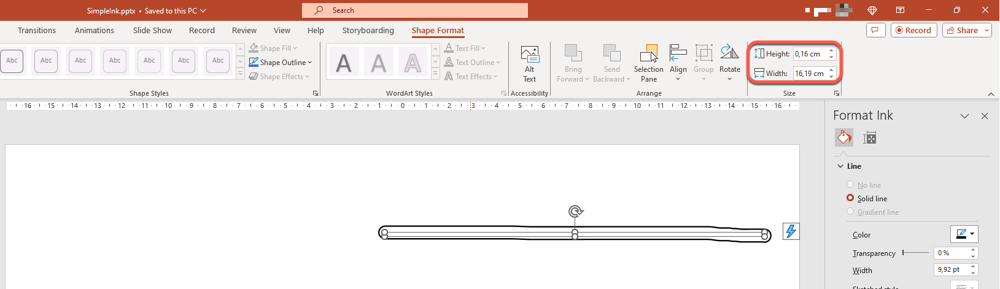

## **परिचय**

PowerPoint इंक फ़ंक्शन प्रदान करता है जिससे आप गैर‑मानक आकृतियों को ड्रॉ कर सकते हैं, जिसका उपयोग अन्य वस्तुओं को हाइलाइट करने, कनेक्शन्स और प्रक्रियाओं को दिखाने, तथा स्लाइड पर विशिष्ट आइटमों पर ध्यान आकर्षित करने के लिए किया जा सकता है।  

Aspose.Slides सभी Ink प्रकार (जैसे कि [Ink](https://reference.aspose.com/slides/hi/php-java/aspose.slides/ink/) क्लास) प्रदान करता है जिनकी आपको इंक ऑब्जेक्ट बनाने और प्रबंधित करने की आवश्यकता है।

## **सामान्य वस्तुओं और इंक वस्तुओं के बीच अंतर**

PowerPoint स्लाइड पर वस्तुएँ आमतौर पर shape ऑब्जेक्ट द्वारा दर्शाई जाती हैं। एक shape ऑब्जेक्ट, सबसे सरल रूप में, एक कंटेनर है जो वस्तु के स्वयं के क्षेत्र (उसका फ्रेम) के साथ उसकी प्रॉपर्टीज़ को परिभाषित करता है। इसमें कंटेनर का क्षेत्र आकार, कंटेनर का रूप, कंटेनर की पृष्ठभूमि आदि शामिल हैं। जानकारी के लिए देखें [Shape Layout Format](https://docs.aspose.com/slides/hi/php-java/shape-manipulations/#access-layout-formats-for-shape)।

हालाँकि, जब PowerPoint इंक ऑब्जेक्ट के साथ काम करता है, तो वह ऑब्जेक्ट फ्रेम (कंटेनर) की सभी प्रॉपर्टीज़ को, सिवाय उसके आकार के, नजरअंदाज करता है। कंटेनर क्षेत्र का आकार मानक `width` और `height` मूल्यों द्वारा निर्धारित किया जाता है:



## **इंकशेप ट्रेस**

Trace एक बुनियादी तत्व या मानक है जिसका उपयोग उपयोगकर्ता द्वारा डिजिटल इंक लिखते समय पेन की गति को रिकॉर्ड करने के लिए किया जाता है। ट्रेस वह रिकॉर्डिंग हैं जो जुड़े हुए बिंदुओं की क्रमबद्धता का वर्णन करती हैं।  

एन्कोडिंग का सबसे सरल रूप प्रत्येक सैंपल बिंदु के X और Y निर्देशांक निर्दिष्ट करता है। जब सभी जुड़े हुए बिंदु रेंडर हो जाते हैं, तो वे इस तरह की छवि बनाते हैं:


## **ड्रॉइंग के लिए ब्रश गुण**

आप ब्रश का उपयोग करके ट्रेस तत्वों के बिंदुओं को जोड़ने वाली रेखाएँ ड्रॉ कर सकते हैं। ब्रश का अपना रंग और आकार होता है, जो `Brush.Color` और `Brush.Size` प्रॉपर्टीज़ से मेल खाता है।  

### **इंक ब्रश रंग सेट करें**

यह PHP कोड दिखाता है कि ब्रश का रंग कैसे सेट किया जाता है:

```php
  $pres = new Presentation("pres.pptx");
  try {
    $ink = $pres->getSlides()->get_Item(0)->getShapes()->get_Item(0);
    $traces = $ink->getTraces();
    $brush = $traces[0]->getBrush();
    $brushColor = $brush->getColor();
    $brush->setColor(java("java.awt.Color")->RED);
  } finally {
    if (!java_is_null($pres)) {
      $pres->dispose();
    }
  }
```

### **इंक ब्रश आकार सेट करें**

यह PHP कोड दिखाता है कि ब्रश का आकार कैसे सेट किया जाता है:

```php
  $pres = new Presentation("pres.pptx");
  try {
    $ink = $pres->getSlides()->get_Item(0)->getShapes()->get_Item(0);
    $traces = $ink->getTraces();
    $brush = $traces[0]->getBrush();
    $brushSize = $brush->getSize();
    $brush->setSize(new Java("java.awt.Dimension", 5, 10));
  } finally {
    if (!java_is_null($pres)) {
      $pres->dispose();
    }
  }
```

आमतौर पर, ब्रश की चौड़ाई और ऊँचाई मेल नहीं खाती, इसलिए PowerPoint ब्रश आकार को प्रदर्शित नहीं करता (डेटा सेक्शन ग्रे हो जाता है)। लेकिन जब ब्रश की चौड़ाई और ऊँचाई समान होती है, तो PowerPoint उसका आकार इस तरह दिखाता है:


स्पष्टता के लिए, चलिए इंक ऑब्जेक्ट की ऊँचाई बढ़ाते हैं और महत्वपूर्ण आयामों की समीक्षा करते हैं:


कंटेनर (फ़्रेम) ब्रश के आकार को ध्यान में नहीं रखता—यह हमेशा मानता है कि रेखा की मोटाई शून्य है (अंतिम छवि देखें)।  

इसलिए, पूरे इंक ऑब्जेक्ट के दृश्य क्षेत्र को निर्धारित करने के लिए हमें ट्रेस ऑब्जेक्ट के ब्रश आकार को विचार करना होगा। यहाँ, लक्ष्य ऑब्जेक्ट (हैंडराइटन टेक्स्ट ट्रेस ऑब्जेक्ट) को कंटेनर (फ़्रेम) आकार में स्केल किया गया है। जब कंटेनर (फ़्रेम) का आकार बदलता है, तो ब्रश आकार स्थिर रहता है और इसके विपरीत भी ऐसा ही होता है:


PowerPoint टेक्स्ट के साथ काम करते समय भी यही व्यवहार दिखाता है:


**आगे पढ़ें**

* सामान्य रूप से शैप्स के बारे में पढ़ने के लिए, देखें [PowerPoint Shapes](https://docs.aspose.com/slides/hi/php-java/powerpoint-shapes/) अनुभाग।
* प्रभावी मानों के बारे में अधिक जानकारी के लिए, देखें [Shape Effective Properties](https://docs.aspose.com/slides/hi/php-java/shape-effective-properties/#getting-effective-font-height-value)।