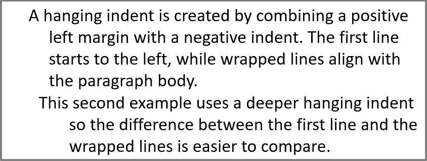

## **परिचय**

Aspose.Slides उन सभी क्लासों को प्रदान करता है जिनकी आपको PowerPoint टेक्स्ट, पैराग्राफ और पोर्शन के साथ काम करने के लिए आवश्यकता है।

* Aspose.Slides [TextFrame](https://reference.aspose.com/slides/hi/php-java/aspose.slides/textframe/) क्लास प्रदान करता है जिससे आप पैराग्राफ को दर्शाने वाले ऑब्जेक्ट जोड़ सकते हैं। एक `TextFame` ऑब्जेक्ट में एक या कई पैराग्राफ हो सकते हैं (प्रत्येक पैराग्राफ कैरिज रिटर्न द्वारा बनाया जाता है)।
* Aspose.Slides [Paragraph](https://reference.aspose.com/slides/hi/php-java/aspose.slides/paragraph/) क्लास प्रदान करता है जिससे आप पोर्शन को दर्शाने वाले ऑब्जेक्ट जोड़ सकते हैं। एक `Paragraph` ऑब्जेक्ट में एक या कई पोर्शन हो सकते हैं (पोर्शन ऑब्जेक्ट्स का संग्रह)।
* Aspose.Slides [Portion](https://reference.aspose.com/slides/hi/php-java/aspose.slides/portion/) क्लास प्रदान करता है जिससे आप टेक्स्ट और उनके फॉर्मेटिंग प्रॉपर्टीज़ को दर्शाने वाले ऑब्जेक्ट जोड़ सकते हैं।

एक `Paragraph` ऑब्जेक्ट अपने अंतर्निहित `Portion` ऑब्जेक्ट्स के माध्यम से विभिन्न फॉर्मेटिंग प्रॉपर्टीज़ वाले टेक्स्ट को संभालने में सक्षम होता है।

## **एकाधिक भागों वाले कई पैराग्राफ जोड़ें**

इन चरणों में दिखाया गया है कि 3 पैराग्राफ और प्रत्येक पैराग्राफ में 3 पोर्शन वाले टेक्स्ट फ्रेम को कैसे जोड़ा जाए:

1. [Presentation](https://reference.aspose.com/slides/hi/php-java/aspose.slides/presentation/) क्लास का एक इंस्टेंस बनाएं।
2. उसके इंडेक्स के माध्यम से संबंधित स्लाइड का रेफ़रेंस प्राप्त करें।
3. स्लाइड में एक Rectangle [AutoShape](https://reference.aspose.com/slides/hi/php-java/aspose.slides/autoshape/) जोड़ें।
4. [AutoShape](https://reference.aspose.com/slides/hi/php-java/aspose.slides/autoshape/) से जुड़े ITextFrame को प्राप्त करें।
5. दो [Paragraph](https://reference.aspose.com/slides/hi/php-java/aspose.slides/paragraph/) ऑब्जेक्ट बनाकर उन्हें [TextFrame](https://reference.aspose.com/slides/hi/php-java/aspose.slides/textframe/) की पैराग्राफ कलेक्शन में जोड़ें।
6. प्रत्येक नए `Paragraph` (डिफ़ॉल्ट Paragraph के लिए दो Portion) के लिए तीन [Portion](https://reference.aspose.com/slides/hi/php-java/aspose.slides/portion/) ऑब्जेक्ट बनाएं और प्रत्येक `Portion` को संबंधित `Paragraph` की पोर्शन कलेक्शन में जोड़ें।
7. प्रत्येक पोर्शन के लिए कुछ टेक्स्ट सेट करें।
8. `Portion` ऑब्जेक्ट द्वारा प्रदान की गई फॉर्मेटिंग प्रॉपर्टीज़ का उपयोग करके प्रत्येक पोर्शन पर वांछित फॉर्मेटिंग लागू करें।
9. संशोधित प्रस्तुति को सहेजें।

यह PHP कोड पैराग्राफ़ों में पोर्शन जोड़ने के चरणों को लागू करता है:

```php
# PPTX फ़ाइल का प्रतिनिधित्व करने वाली Presentation क्लास का इंस्टैंस बनाएं
$pres = new Presentation();
try {
    # पहली स्लाइड तक पहुंचें
    $slide = $pres->getSlides()->get_Item(0);
    # Rectangle प्रकार का AutoShape जोड़ें
    $ashp = $slide->getShapes()->addAutoShape(ShapeType::Rectangle, 50, 150, 300, 150);
    # AutoShape का TextFrame प्राप्त करें
    $tf = $ashp->getTextFrame();
    # विभिन्न टेक्स्ट फ़ॉर्मेट वाले Paragraphs और Portions बनाएँ
    $para0 = $tf->getParagraphs()->get_Item(0);
    $port01 = new Portion();
    $port02 = new Portion();
    $para0->getPortions()->add($port01);
    $para0->getPortions()->add($port02);
    $para1 = new Paragraph();
    $tf->getParagraphs()->add($para1);
    $port10 = new Portion();
    $port11 = new Portion();
    $port12 = new Portion();
    $para1->getPortions()->add($port10);
    $para1->getPortions()->add($port11);
    $para1->getPortions()->add($port12);
    $para2 = new Paragraph();
    $tf->getParagraphs()->add($para2);
    $port20 = new Portion();
    $port21 = new Portion();
    $port22 = new Portion();
    $para2->getPortions()->add($port20);
    $para2->getPortions()->add($port21);
    $para2->getPortions()->add($port22);
    for($i = 0; $i < 3; $i++) {
        for($j = 0; $j < 3; $j++) {
            $portion = $tf->getParagraphs()->get_Item($i)->getPortions()->get_Item($j);
            $portion->setText("Portion0" . $j);
            if ($j == 0) {
                $portion->getPortionFormat()->getFillFormat()->setFillType(FillType::Solid);
                $portion->getPortionFormat()->getFillFormat()->getSolidFillColor()->setColor(java("java.awt.Color")->RED);
                $portion->getPortionFormat()->setFontBold(NullableBool::True);
                $portion->getPortionFormat()->setFontHeight(15);
            } else if ($j == 1) {
                $portion->getPortionFormat()->getFillFormat()->setFillType(FillType::Solid);
                $portion->getPortionFormat()->getFillFormat()->getSolidFillColor()->setColor(java("java.awt.Color")->BLUE);
                $portion->getPortionFormat()->setFontItalic(NullableBool::True);
                $portion->getPortionFormat()->setFontHeight(18);
            }
        }
    }
    # PPTX को डिस्क पर लिखें
    $pres->save("multiParaPort_out.pptx", SaveFormat::Pptx);
} finally {
    if (!java_is_null($pres)) {
        $pres->dispose();
    }
}
```

## **पैराग्राफ बुलेट्स का प्रबंधन**

बुलेट सूची आपको जानकारी को जल्दी और प्रभावी ढंग से व्यवस्थित करने और प्रस्तुत करने में मदद करती है। बुलेटेड पैराग्राफ़ पढ़ने और समझने में हमेशा आसान होते हैं।

1. [Presentation](https://reference.aspose.com/slides/hi/php-java/aspose.slides/presentation/) क्लास का एक इंस्टेंस बनाएं।
2. उसके इंडेक्स के माध्यम से संबंधित स्लाइड का रेफ़रेंस प्राप्त करें।
3. चयनित स्लाइड में एक [AutoShape](https://reference.aspose.com/slides/hi/php-java/aspose.slides/autoshape/) जोड़ें।
4. ऑटोषेप के [TextFrame](https://reference.aspose.com/slides/hi/php-java/aspose.slides/textframe/) को एक्सेस करें।
5. `TextFrame` में मौजूद डिफ़ॉल्ट पैराग्राफ को हटाएँ।
6. [Paragraph](https://reference.aspose.com/slides/hi/php-java/aspose.slides/paragraph/) क्लास का उपयोग करके पहला पैराग्राफ इंस्टेंस बनाएं।
7. पैराग्राफ के लिए बुलेट `Type` को `Symbol` सेट करें और बुलेट कैरेक्टर निर्धारित करें।
8. पैराग्राफ का `Text` सेट करें।
9. बुलेट के लिए पैराग्राफ `Indent` सेट करें।
10. बुलेट के लिए एक रंग सेट करें।
11. बुलेट की ऊँचाई सेट करें।
12. नए पैराग्राफ को `TextFrame` की पैराग्राफ कलेक्शन में जोड़ें।
13. दूसरा पैराग्राफ जोड़ें और चरण 7 से 13 दोहराएँ।
14. प्रस्तुति को सहेजें।

यह PHP कोड दिखाता है कि बुलेट पैराग्राफ़ कैसे जोड़ा जाता है:

```php
# PPTX फ़ाइल का प्रतिनिधित्व करने वाली Presentation क्लास को इंस्टैंसिएट करता है
$pres = new Presentation();
try {
    # पहली स्लाइड तक पहुंचता है
    $slide = $pres->getSlides()->get_Item(0);
    # AutoShape जोड़ता और एक्सेस करता है
    $aShp = $slide->getShapes()->addAutoShape(ShapeType::Rectangle, 200, 200, 400, 200);
    # AutoShape के टेक्स्ट फ्रेम को एक्सेस करता है
    $txtFrm = $aShp->getTextFrame();
    # डिफ़ॉल्ट पैराग्राफ को हटाता है
    $txtFrm->getParagraphs()->removeAt(0);
    # एक पैराग्राफ बनाता है
    $para = new Paragraph();
    # पैराग्राफ बुलेट शैली और प्रतीक सेट करता है
    $para->getParagraphFormat()->getBullet()->setType(BulletType::Symbol);
    $para->getParagraphFormat()->getBullet()->setChar(8226);
    # पैराग्राफ टेक्स्ट सेट करता है
    $para->setText("Welcome to Aspose.Slides");
    # बुलेट इंडेंट सेट करता है
    $para->getParagraphFormat()->setIndent(25);
    # बुलेट रंग सेट करता है
    $para->getParagraphFormat()->getBullet()->getColor()->setColorType(ColorType::RGB);
    $para->getParagraphFormat()->getBullet()->getColor()->setColor(java("java.awt.Color")->BLACK);
    $para->getParagraphFormat()->getBullet()->setBulletHardColor(NullableBool::True);// IsBulletHardColor को true सेट करें ताकि अपना बुलेट रंग उपयोग किया जा सके

    # बुलेट ऊँचाई सेट करता है
    $para->getParagraphFormat()->getBullet()->setHeight(100);
    # पैराग्राफ को टेक्स्ट फ्रेम में जोड़ता है
    $txtFrm->getParagraphs()->add($para);
    # दूसरा पैराग्राफ बनाता है
    $para2 = new Paragraph();
    # पैराग्राफ बुलेट प्रकार और शैली सेट करता है
    $para2->getParagraphFormat()->getBullet()->setType(BulletType::Numbered);
    $para2->getParagraphFormat()->getBullet()->setNumberedBulletStyle(NumberedBulletStyle->BulletCircleNumWDBlackPlain);
    # पैराग्राफ टेक्स्ट जोड़ता है
    $para2->setText("This is numbered bullet");
    # बुलेट इंडेंट सेट करता है
    $para2->getParagraphFormat()->setIndent(25);
    $para2->getParagraphFormat()->getBullet()->getColor()->setColorType(ColorType::RGB);
    $para2->getParagraphFormat()->getBullet()->getColor()->setColor(java("java.awt.Color")->BLACK);
    $para2->getParagraphFormat()->getBullet()->setBulletHardColor(NullableBool::True);// IsBulletHardColor को true सेट करें ताकि अपना बुलेट रंग उपयोग किया जा सके

    # बुलेट ऊँचाई सेट करता है
    $para2->getParagraphFormat()->getBullet()->setHeight(100);
    # पैराग्राफ को टेक्स्ट फ्रेम में जोड़ता है
    $txtFrm->getParagraphs()->add($para2);
    # संशोधित प्रस्तुति को सहेजता है
    $pres->save("Bullet_out.pptx", SaveFormat::Pptx);
} finally {
    if (!java_is_null($pres)) {
        $pres->dispose();
    }
}
```

## **चित्र बुलेट्स का प्रबंधन**

बुलेट सूची आपको जानकारी को जल्दी और प्रभावी ढंग से व्यवस्थित करने और प्रस्तुत करने में मदद करती है। चित्र पैराग्राफ़ पढ़ने और समझने में आसान होते हैं।

1. [Presentation](https://reference.aspose.com/slides/hi/php-java/aspose.slides/presentation/) क्लास का एक इंस्टेंस बनाएं।
2. उसके इंडेक्स के माध्यम से संबंधित स्लाइड का रेफ़रेंस प्राप्त करें।
3. स्लाइड में एक [AutoShape](https://reference.aspose.com/slides/hi/php-java/aspose.slides/autoshape/) जोड़ें।
4. ऑटोषेप के [TextFrame](https://reference.aspose.com/slides/hi/php-java/aspose.slides/textframe/) को एक्सेस करें।
5. `TextFrame` में मौजूद डिफ़ॉल्ट पैराग्राफ को हटाएँ।
6. [Paragraph](https://reference.aspose.com/slides/hi/php-java/aspose.slides/paragraph/) क्लास का उपयोग करके पहला पैराग्राफ इंस्टेंस बनाएं।
7. [PPImage](https://reference.aspose.com/slides/hi/php-java/aspose.slides/ppimage/) में इमेज लोड करें।
8. बुलेट प्रकार को [Picture](https://reference.aspose.com/slides/hi/php-java/aspose.slides/bullettype/#Picture) सेट करें और इमेज निर्दिष्ट करें।
9. पैराग्राफ `Text` सेट करें।
10. बुलेट के लिए पैराग्राफ `Indent` सेट करें।
11. बुलेट के लिए एक रंग सेट करें।
12. बुलेट की ऊँचाई सेट करें।
13. नए पैराग्राफ को `TextFrame` की पैराग्राफ कलेक्शन में जोड़ें।
14. दूसरा पैराग्राफ जोड़ें और पिछले चरणों के आधार पर प्रक्रिया दोहराएँ।
15. संशोधित प्रस्तुति को सहेजें।

यह PHP कोड दिखाता है कि चित्र बुलेट कैसे जोड़ें और प्रबंधित करें:

```php
# PPTX फ़ाइल का प्रतिनिधित्व करने वाली Presentation क्लास को इंस्टैंसिएट करता है
$presentation = new Presentation();
try {
    # पहली स्लाइड तक पहुंचता है
    $slide = $presentation->getSlides()->get_Item(0);
    # बुलेट्स के लिए इमेज को इंस्टैंसिएट करता है
    $picture;
    $image = Images->fromFile("bullets.png");
    try {
        $picture = $presentation->getImages()->addImage($image);
    } finally {
        if (!java_is_null($image)) {
            $image->dispose();
        }
    }
    # AutoShape जोड़ता और एक्सेस करता है
    $autoShape = $slide->getShapes()->addAutoShape(ShapeType::Rectangle, 200, 200, 400, 200);
    # AutoShape के टेक्स्टफ़्रेम को एक्सेस करता है
    $textFrame = $autoShape->getTextFrame();
    # डिफ़ॉल्ट पैराग्राफ को हटाता है
    $textFrame->getParagraphs()->removeAt(0);
    # नया पैराग्राफ बनाता है
    $paragraph = new Paragraph();
    $paragraph->setText("Welcome to Aspose.Slides");
    # पैराग्राफ बुलेट शैली और इमेज सेट करता है
    $paragraph->getParagraphFormat()->getBullet()->setType(BulletType::Picture);
    $paragraph->getParagraphFormat()->getBullet()->getPicture()->setImage($picture);
    # बुलेट ऊँचाई सेट करता है
    $paragraph->getParagraphFormat()->getBullet()->setHeight(100);
    # पैराग्राफ को टेक्स्टफ़्रेम में जोड़ता है
    $textFrame->getParagraphs()->add($paragraph);
    # प्रेजेंटेशन को PPTX फ़ाइल के रूप में लिखता है
    $presentation->save("ParagraphPictureBulletsPPTX_out.pptx", SaveFormat::Pptx);
    # प्रेजेंटेशन को PPT फ़ाइल के रूप में लिखता है
    $presentation->save("ParagraphPictureBulletsPPT_out.ppt", SaveFormat::Ppt);
} catch (JavaException $e) {
} finally {
    if (!java_is_null($presentation)) {
        $presentation->dispose();
    }
}
```

## **बहु-स्तरीय बुलेट्स का प्रबंधन**

बुलेट सूची आपको जानकारी को जल्दी और प्रभावी ढंग से व्यवस्थित करने और प्रस्तुत करने में मदद करती है। बहु-स्तरीय बुलेट्स पढ़ने और समझने में आसान होते हैं।

1. [Presentation](https://reference.aspose.com/slides/hi/php-java/aspose.slides/presentation/) क्लास का एक इंस्टेंस बनाएं।
2. उसके इंडेक्स के माध्यम से संबंधित स्लाइड का रेफ़रेंस प्राप्त करें।
3. नई स्लाइड में एक [AutoShape](https://reference.aspose.com/slides/hi/php-java/aspose.slides/autoshape/) जोड़ें।
4. ऑटोषेप के [TextFrame](https://reference.aspose.com/slides/hi/php-java/aspose.slides/textframe/) को एक्सेस करें।
5. `TextFrame` में मौजूद डिफ़ॉल्ट पैराग्राफ को हटाएँ।
6. [Paragraph](https://reference.aspose.com/slides/hi/php-java/aspose.slides/paragraph/) क्लास के माध्यम से पहला पैराग्राफ इंस्टेंस बनाकर उसकी गहराई 0 सेट करें।
7. `Paragraph` क्लास के माध्यम से दूसरा पैराग्राफ बनाकर गहराई 1 सेट करें।
8. `Paragraph` क्लास के माध्यम से तीसरा पैराग्राफ बनाकर गहराई 2 सेट करें।
9. `Paragraph` क्लास के माध्यम से चौथा पैराग्राफ बनाकर गहराई 3 सेट करें।
10. नए पैराग्राफ को `TextFrame` की पैराग्राफ कलेक्शन में जोड़ें।
11. संशोधित प्रस्तुति को सहेजें।

यह PHP कोड दिखाता है कि बहु-स्तरीय बुलेट कैसे जोड़ें और प्रबंधित करें:

```php
# PPTX फ़ाइल का प्रतिनिधित्व करने वाली Presentation क्लास को इंस्टैंसिएट करता है
$pres = new Presentation();
try {
    # पहली स्लाइड तक पहुंचता है
    $slide = $pres->getSlides()->get_Item(0);
    # AutoShape जोड़ता और एक्सेस करता है
    $aShp = $slide->getShapes()->addAutoShape(ShapeType::Rectangle, 200, 200, 400, 200);
    # बनाए गए AutoShape के टेक्स्ट फ्रेम को एक्सेस करता है
    $text = $aShp->addTextFrame("");
    # डिफ़ॉल्ट पैराग्राफ को साफ़ करता है
    $text->getParagraphs()->clear();
    # पहला पैराग्राफ जोड़ता है
    $para1 = new Paragraph();
    $para1->setText("Content");
    $para1->getParagraphFormat()->getBullet()->setType(BulletType::Symbol);
    $para1->getParagraphFormat()->getBullet()->setChar(8226);
    $para1->getParagraphFormat()->getDefaultPortionFormat()->getFillFormat()->setFillType(FillType::Solid);
    $para1->getParagraphFormat()->getDefaultPortionFormat()->getFillFormat()->getSolidFillColor()->setColor(java("java.awt.Color")->BLACK);
    # बुलेट स्तर सेट करता है
    $para1->getParagraphFormat()->setDepth(0);
    # दूसरा पैराग्राफ जोड़ता है
    $para2 = new Paragraph();
    $para2->setText("Second Level");
    $para2->getParagraphFormat()->getBullet()->setType(BulletType::Symbol);
    $para2->getParagraphFormat()->getBullet()->setChar('-');
    $para2->getParagraphFormat()->getDefaultPortionFormat()->getFillFormat()->setFillType(FillType::Solid);
    $para2->getParagraphFormat()->getDefaultPortionFormat()->getFillFormat()->getSolidFillColor()->setColor(java("java.awt.Color")->BLACK);
    # बुलेट स्तर सेट करता है
    $para2->getParagraphFormat()->setDepth(1);
    # तीसरा पैराग्राफ जोड़ता है
    $para3 = new Paragraph();
    $para3->setText("Third Level");
    $para3->getParagraphFormat()->getBullet()->setType(BulletType::Symbol);
    $para3->getParagraphFormat()->getBullet()->setChar(8226);
    $para3->getParagraphFormat()->getDefaultPortionFormat()->getFillFormat()->setFillType(FillType::Solid);
    $para3->getParagraphFormat()->getDefaultPortionFormat()->getFillFormat()->getSolidFillColor()->setColor(java("java.awt.Color")->BLACK);
    # बुलेट स्तर सेट करता है
    $para3->getParagraphFormat()->setDepth(2);
    # चौथा पैराग्राफ जोड़ता है
    $para4 = new Paragraph();
    $para4->setText("Fourth Level");
    $para4->getParagraphFormat()->getBullet()->setType(BulletType::Symbol);
    $para4->getParagraphFormat()->getBullet()->setChar('-);
    $para4->getParagraphFormat()->getDefaultPortionFormat()->getFillFormat()->setFillType(FillType::Solid);
    $para4->getParagraphFormat()->getDefaultPortionFormat()->getFillFormat()->getSolidFillColor()->setColor(java("java.awt.Color")->BLACK);
    # बुलेट स्तर सेट करता है
    $para4->getParagraphFormat()->setDepth(3);
    # पैराग्राफ को कलेक्शन में जोड़ता है
    $text->getParagraphs()->add($para1);
    $text->getParagraphs()->add($para2);
    $text->getParagraphs()->add($para3);
    $text->getParagraphs()->add($para4);
    # प्रेजेंटेशन को PPTX फ़ाइल के रूप में लिखता है
    $pres->save("MultilevelBullet.pptx", SaveFormat::Pptx);
} finally {
    if (!java_is_null($pres)) {
        $pres->dispose();
    }
}
```

## **कस्टम क्रमांकित सूची के साथ पैराग्राफ प्रबंधित करें**

[BulletFormat](https://reference.aspose.com/slides/hi/php-java/aspose.slides/bulletformat/) क्लास [setNumberedBulletStartWith](https://reference.aspose.com/slides/hi/php-java/aspose.slides/bulletformat/setnumberedbulletstartwith/) जैसे मेथड प्रदान करती है जो आपको कस्टम नंबरिंग या फॉर्मेटिंग के साथ पैराग्राफ प्रबंधित करने की सुविधा देता है।

1. [Presentation](https://reference.aspose.com/slides/hi/php-java/aspose.slides/presentation/) क्लास का एक इंस्टेंस बनाएं।
2. पैराग्राफ वाला स्लाइड एक्सेस करें।
3. स्लाइड में एक [AutoShape](https://reference.aspose.com/slides/hi/php-java/aspose.slides/autoshape/) जोड़ें।
4. ऑटोषेप के [TextFrame](https://reference.aspose.com/slides/hi/php-java/aspose.slides/textframe/) को एक्सेस करें।
5. `TextFrame` में मौजूद डिफ़ॉल्ट पैराग्राफ को हटाएँ।
6. [Paragraph](https://reference.aspose.com/slides/hi/php-java/aspose.slides/paragraph/) क्लास के माध्यम से पहला पैराग्राफ बनाकर [NumberedBulletStartWith](https://reference.aspose.com/slides/hi/php-java/aspose.slides/bulletformat/setnumberedbulletstartwith/) को 2 सेट करें।
7. `Paragraph` क्लास के माध्यम से दूसरा पैराग्राफ बनाकर `NumberedBulletStartWith` को 3 सेट करें।
8. `Paragraph` क्लास के माध्यम से तीसरा पैराग्राफ बनाकर `NumberedBulletStartWith` को 7 सेट करें।
9. नए पैराग्राफ को `TextFrame` की पैराग्राफ कलेक्शन में जोड़ें।
10. संशोधित प्रस्तुति को सहेजें।

यह PHP कोड दिखाता है कि कस्टम नंबरिंग या फॉर्मेटिंग के साथ पैराग्राफ कैसे जोड़ें और प्रबंधित करें:

```php
$presentation = new Presentation();
try {
    $shape = $presentation->getSlides()->get_Item(0)->getShapes()->addAutoShape(ShapeType::Rectangle, 200, 200, 400, 200);
    # बनाए गए ऑटोषेप के टेक्स्ट फ्रेम को एक्सेस करता है
    $textFrame = $shape->getTextFrame();
    # डिफ़ॉल्ट मौजूद पैराग्राफ को हटाता है
    $textFrame->getParagraphs()->removeAt(0);
    # पहली सूची
    $paragraph1 = new Paragraph();
    $paragraph1->setText("bullet 2");
    $paragraph1->getParagraphFormat()->setDepth(4);
    $paragraph1->getParagraphFormat()->getBullet()->setNumberedBulletStartWith(2);
    $paragraph1->getParagraphFormat()->getBullet()->setType(BulletType::Numbered);
    $textFrame->getParagraphs()->add($paragraph1);
    $paragraph2 = new Paragraph();
    $paragraph2->setText("bullet 3");
    $paragraph2->getParagraphFormat()->setDepth(4);
    $paragraph2->getParagraphFormat()->getBullet()->setNumberedBulletStartWith(3);
    $paragraph2->getParagraphFormat()->getBullet()->setType(BulletType::Numbered);
    $textFrame->getParagraphs()->add($paragraph2);
    $paragraph5 = new Paragraph();
    $paragraph5->setText("bullet 7");
    $paragraph5->getParagraphFormat()->setDepth(4);
    $paragraph5->getParagraphFormat()->getBullet()->setNumberedBulletStartWith(7);
    $paragraph5->getParagraphFormat()->getBullet()->setType(BulletType::Numbered);
    $textFrame->getParagraphs()->add($paragraph5);
    $presentation->save("SetCustomBulletsNumber-slides.pptx", SaveFormat::Pptx);
} finally {
    if (!java_is_null($presentation)) {
        $presentation->dispose();
    }
}
```

## **पैराग्राफ के प्रथम‑पंक्ति इंडेंट सेट करें**

[ParagraphFormat::setIndent](https://reference.aspose.com/slides/hi/php-java/aspose.slides/paragraphformat/setindent/) मेथड का उपयोग करके आप पैराग्राफ की प्रथम‑पंक्ति इंडेंट नियंत्रित कर सकते हैं। यह मेथड केवल पैराग्राफ की बाईं मार्जिन के सापेक्ष पहली पंक्ति को ही स्थानांतरित करता है। सकारात्मक मान पहली पंक्ति को दाएँ शिफ्ट करता है, जबकि बाकी पंक्तियाँ पैराग्राफ बॉडी के साथ संरेखित रहती हैं।

पूरे पैराग्राफ को स्थानांतरित करने के लिए आप [ParagraphFormat::setMarginLeft](https://reference.aspose.com/slides/hi/php-java/aspose.slides/paragraphformat/setmarginleft/) का उपयोग करें। केवल पहली पंक्ति को स्थानांतरित करने के लिए [ParagraphFormat::setIndent](https://reference.aspose.com/slides/hi/php-java/aspose.slides/paragraphformat/setindent/) का उपयोग करें।

नीचे दिया गया उदाहरण कई पैराग्राफ बनाता है और विभिन्न इंडेंट मान लागू करता है ताकि दिखाया जा सके कि प्रथम‑पंक्ति इंडेंट पैराग्राफ लेआउट को कैसे प्रभावित करता है।

1. [Presentation](https://reference.aspose.com/slides/hi/php-java/aspose.slides/presentation/) क्लास का एक इंस्टेंस बनाएं।
2. लक्ष्य स्लाइड एक्सेस करें।
3. स्लाइड में एक आयताकार [AutoShape](https://reference.aspose.com/slides/hi/php-java/aspose.slides/autoshape/) जोड़ें।
4. आकार में एक खाली [TextFrame](https://reference.aspose.com/slides/hi/php-java/aspose.slides/textframe/) जोड़ें और डिफ़ॉल्ट पैराग्राफ हटाएँ।
5. कई पैराग्राफ बनाकर उनके लिए विभिन्न [Indent](https://reference.aspose.com/slides/hi/php-java/aspose.slides/paragraphformat/setindent/) मान सेट करें।
6. पैराग्राफ को टेक्स्ट फ्रेम में जोड़ें।
7. संशोधित प्रस्तुति को सहेजें।

यह कोड दिखाता है कि पैराग्राफ इंडेंट कैसे सेट करें:

```php
$presentation = new Presentation();
try {
    $slide = $presentation->getSlides()->get_Item(0);

    $rectangleShape = $slide->getShapes()->addAutoShape(ShapeType::Rectangle,50,50,420,220);
    $rectangleShape->getFillFormat()->setFillType(FillType::NoFill);
    $rectangleShape->getLineFormat()->getFillFormat()->setFillType(FillType::Solid);
    $rectangleShape->getLineFormat()->getFillFormat()->getSolidFillColor()->setColor(java("java.awt.Color")->GRAY);

    $textFrame = $rectangleShape->addTextFrame("");
    $textFrame->getTextFrameFormat()->setAutofitType(TextAutofitType::Shape);
    $textFrame->getParagraphs()->removeAt(0);

    $firstParagraph = new Paragraph();
    $firstParagraph->getParagraphFormat()->getDefaultPortionFormat()->getFillFormat()->setFillType(FillType::Solid);
    $firstParagraph->getParagraphFormat()->getDefaultPortionFormat()->getFillFormat()->getSolidFillColor()->setColor(java("java.awt.Color")->BLACK);
    $firstParagraph->setText("No first-line indent. Wrapped lines start at the same position as the first line.");
    $firstParagraph->getParagraphFormat()->setMarginLeft(20.0);
    $firstParagraph->getParagraphFormat()->setIndent(0.0);

    $secondParagraph = new Paragraph();
    $secondParagraph->getParagraphFormat()->getDefaultPortionFormat()->getFillFormat()->setFillType(FillType::Solid);
    $secondParagraph->getParagraphFormat()->getDefaultPortionFormat()->getFillFormat()->getSolidFillColor()->setColor(java("java.awt.Color")->BLACK);
    $secondParagraph->setText("First-line indent of 20 points. The first line moves to the right, while wrapped lines remain aligned to the paragraph body.");
    $secondParagraph->getParagraphFormat()->setMarginLeft(20.0);
    $secondParagraph->getParagraphFormat()->setIndent(20.0);

    $thirdParagraph = new Paragraph();
    $thirdParagraph->getParagraphFormat()->getDefaultPortionFormat()->getFillFormat()->setFillType(FillType::Solid);
    $thirdParagraph->getParagraphFormat()->getDefaultPortionFormat()->getFillFormat()->getSolidFillColor()->setColor(java("java.awt.Color")->BLACK);
    $thirdParagraph->setText("First-line indent of 40 points. This paragraph shows a larger first-line offset to make the effect easier to see.");
    $thirdParagraph->getParagraphFormat()->setMarginLeft(20.0);
    $thirdParagraph->getParagraphFormat()->setIndent(40.0);

    $textFrame->getParagraphs()->add($firstParagraph);
    $textFrame->getParagraphs()->add($secondParagraph);
    $textFrame->getParagraphs()->add($thirdParagraph);

    $presentation->save("paragraph_indent.pptx", SaveFormat::Pptx);
} finally {
    $presentation->dispose();
}
```

परिणाम:


## **पैराग्राफ के लिए हैंगिंग इंडेंट सेट करें**

हैंगिंग इंडेंट वह पैराग्राफ लेआउट है जिसमें पहली पंक्ति शेष पंक्तियों के बाईं ओर शुरू होती है। Aspose.Slides में आप यह प्रभाव [ParagraphFormat::setIndent](https://reference.aspose.com/slides/hi/php-java/aspose.slides/paragraphformat/setindent/) मेथड से बना सकते हैं। इंडेंट को नकारात्मक मान पर सेट करने से पहली पंक्ति पैराग्राफ बॉडी के सापेक्ष बाएँ शिफ़्ट हो जाती है।

व्यावहारिक रूप से, [ParagraphFormat::setMarginLeft](https://reference.aspose.com/slides/hi/php-java/aspose.slides/paragraphformat/setmarginleft/) पैराग्राफ बॉडी की बाएँ स्थिति निर्धारित करता है, और [ParagraphFormat::setIndent](https://reference.aspose.com/slides/hi/php-java/aspose.slides/paragraphformat/setindent/) उस मार्जिन के सापेक्ष पहली पंक्ति की स्थिति निर्धारित करता है। हैंगिंग इंडेंट बनाने के लिए, एक सकारात्मक `MarginLeft` मान और नकारात्मक `Indent` मान सेट करें।

यह फॉर्मेटिंग बिब्लियोग्राफी, रेफ़रेंसेस, शब्दकोश प्रविष्टियों आदि में उपयोगी है जहाँ रैप्ड लाइनों को पैराग्राफ बॉडी के नीचे संरेखित होना चाहिए, न कि पहली पंक्ति के पहले अक्षर के नीचे।

1. [Presentation](https://reference.aspose.com/slides/hi/php-java/aspose.slides/presentation/) क्लास का एक इंस्टेंस बनाएं।
2. लक्ष्य स्लाइड एक्सेस करें।
3. स्लाइड में एक आयताकार [AutoShape](https://reference.aspose.com/slides/hi/php-java/aspose.slides/autoshape/) जोड़ें।
4. आकार में एक खाली [TextFrame](https://reference.aspose.com/slides/hi/php-java/aspose.slides/textframe/) जोड़ें और डिफ़ॉल्ट पैराग्राफ हटाएँ।
5. प्रत्येक पैराग्राफ के लिए एक सकारात्मक [MarginLeft](https://reference.aspose.com/slides/hi/php-java/aspose.slides/paragraphformat/setmarginleft/) मान सेट करें।
6. हैंगिंग इंडेंट प्रभाव बनाने के लिए एक नकारात्मक [Indent](https://reference.aspose.com/slides/hi/php-java/aspose.slides/paragraphformat/setindent/) मान सेट करें।
7. पैराग्राफ को टेक्स्ट फ्रेम में जोड़ें।
8. संशोधित प्रस्तुति को सहेजें।

यह कोड दिखाता है कि पैराग्राफ के लिए हैंगिंग इंडेंट कैसे सेट करें:

```php
$presentation = new Presentation();
try {
    $slide = $presentation->getSlides()->get_Item(0);

    $rectangleShape = $slide->getShapes()->addAutoShape(ShapeType::Rectangle,50,50,420,220);
    $rectangleShape->getFillFormat()->setFillType(FillType::NoFill);
    $rectangleShape->getLineFormat()->getFillFormat()->setFillType(FillType::Solid);
    $rectangleShape->getLineFormat()->getFillFormat()->getSolidFillColor()->setColor(java("java.awt.Color")->GRAY);

    $textFrame = $rectangleShape->addTextFrame("");
    $textFrame->getTextFrameFormat()->setAutofitType(TextAutofitType::Shape);
    $textFrame->getParagraphs()->removeAt(0);

    $firstParagraph = new Paragraph();
    $firstParagraph->getParagraphFormat()->getDefaultPortionFormat()->getFillFormat()->setFillType(FillType::Solid);
    $firstParagraph->getParagraphFormat()->getDefaultPortionFormat()->getFillFormat()->getSolidFillColor()->setColor(java("java.awt.Color")->BLACK);
    $firstParagraph->setText("A hanging indent is created by combining a positive left margin with a negative indent. The first line starts to the left, while wrapped lines align with the paragraph body.");
    $firstParagraph->getParagraphFormat()->setMarginLeft(40.0);
    $firstParagraph->getParagraphFormat()->setIndent(-20.0);

    $secondParagraph = new Paragraph();
    $secondParagraph->getParagraphFormat()->getDefaultPortionFormat()->getFillFormat()->setFillType(FillType::Solid);
    $secondParagraph->getParagraphFormat()->getDefaultPortionFormat()->getFillFormat()->getSolidFillColor()->setColor(java("java.awt.Color")->BLACK);
    $secondParagraph->setText("This second example uses a deeper hanging indent so the difference between the first line and the wrapped lines is easier to compare.");
    $secondParagraph->getParagraphFormat()->setMarginLeft(60.0);
    $secondParagraph->getParagraphFormat()->setIndent(-30.0);

    $textFrame->getParagraphs()->add($firstParagraph);
    $textFrame->getParagraphs()->add($secondParagraph);

    $presentation->save("hanging_indent.pptx", SaveFormat::Pptx);
} finally {
    $presentation->dispose();
}
```

परिणाम:



## **पैराग्राफ अंत रन गुणों का प्रबंधन**

1. [Presentation](https://reference.aspose.com/slides/hi/php-java/aspose.slides/presentation/) क्लास का एक इंस्टेंस बनाएं।
1. पैराग्राफ वाले स्लाइड का रेफ़रेंस उसकी स्थिति द्वारा प्राप्त करें।
1. स्लाइड में एक आयताकार [AutoShape](https://reference.aspose.com/slides/hi/php-java/aspose.slides/autoshape/) जोड़ें।
1. आयत में दो पैराग्राफ वाले एक [TextFrame](https://reference.aspose.com/slides/hi/php-java/aspose.slides/textframe/) को जोड़ें।
1. पैराग्राफों के लिए फ़ॉन्ट ऊँचाई और फ़ॉन्ट प्रकार सेट करें।
1. पैराग्राफों के End प्रॉपर्टीज़ सेट करें।
1. संशोधित प्रस्तुति को PPTX फ़ाइल के रूप में लिखें।

यह PHP कोड दिखाता है कि PowerPoint में पैराग्राफ के End प्रॉपर्टीज़ कैसे सेट करें:

```php
$pres = new Presentation();
try {
    $shape = $pres->getSlides()->get_Item(0)->getShapes()->addAutoShape(ShapeType::Rectangle, 10, 10, 200, 250);
    $para1 = new Paragraph();
    $para1->getPortions()->add(new Portion("Sample text"));
    $para2 = new Paragraph();
    $para2->getPortions()->add(new Portion("Sample text 2"));
    $portionFormat = new PortionFormat();
    $portionFormat::setFontHeight(48);
    $portionFormat::setLatinFont(new FontData("Times New Roman"));
    $para2->setEndParagraphPortionFormat($portionFormat);
    $shape->getTextFrame()->getParagraphs()->add($para1);
    $shape->getTextFrame()->getParagraphs()->add($para2);
    $pres->save($resourcesOutputPath . "pres.pptx", SaveFormat::Pptx);
} finally {
    if (!java_is_null($pres)) {
        $pres->dispose();
    }
}
```

## **HTML टेक्स्ट को पैराग्राफ में आयात करें**

Aspose.Slides HTML टेक्स्ट को पैराग्राफ में आयात करने के लिए उन्नत समर्थन प्रदान करता है।

1. [Presentation](https://reference.aspose.com/slides/hi/php-java/aspose.slides/presentation/) क्लास का एक इंस्टेंस बनाएं।
2. उसके इंडेक्स के माध्यम से संबंधित स्लाइड का रेफ़रेंस प्राप्त करें।
3. स्लाइड में एक [AutoShape](https://reference.aspose.com/slides/hi/php-java/aspose.slides/autoshape/) जोड़ें।
4. `AutoShape` के [TextFrame](https://reference.aspose.com/slides/hi/php-java/aspose.slides/textframe/) को जोड़ें और एक्सेस करें।
5. `TextFrame` में मौजूद डिफ़ॉल्ट पैराग्राफ को हटाएँ।
6. एक TextReader में सोर्स HTML फ़ाइल पढ़ें।
7. [Paragraph](https://reference.aspose.com/slides/hi/php-java/aspose.slides/paragraph/) क्लास के माध्यम से पहला पैराग्राफ इंस्टेंस बनाएं।
8. पढ़े गए TextReader की HTML फ़ाइल सामग्री को TextFrame की [ParagraphCollection](https://reference.aspose.com/slides/hi/php-java/aspose.slides/paragraphcollection/) में जोड़ें।
9. संशोधित प्रस्तुति को सहेजें।

यह PHP कोड पैराग्राफ में HTML टेक्स्ट आयात करने के चरणों को लागू करता है:

```php
# खाली प्रस्तुति इंस्टेंस बनाएं
$pres = new Presentation();
try {
    # प्रस्तुति की डिफ़ॉल्ट पहली स्लाइड तक पहुंचें
    $slide = $pres->getSlides()->get_Item(0);
    # HTML सामग्री को समायोजित करने के लिए AutoShape जोड़ें
    $ashape = $slide->getShapes()->addAutoShape(ShapeType::Rectangle, 10, 10, $pres->getSlideSize()->getSize()->getWidth() - 20, $pres->getSlideSize()->getSize()->getHeight() - 10);
    $ashape->getFillFormat()->setFillType(FillType::NoFill);
    # shape में टेक्स्ट फ्रेम जोड़ें
    $ashape->addTextFrame("");
    # जोड़े गए टेक्स्ट फ्रेम में सभी पैराग्राफ साफ़ करें
    $ashape->getTextFrame()->getParagraphs()->clear();
    # स्ट्रीम रीडर का उपयोग करके HTML फ़ाइल लोड करें
    $tr = new StreamReader("file.html");
    # टेक्स्ट फ्रेम में HTML स्ट्रीम रीडर से टेक्स्ट जोड़ें
    $ashape->getTextFrame()->getParagraphs()->addFromHtml($tr->readToEnd());
    # प्रस्तुति सहेजें
    $pres->save("output_out.pptx", SaveFormat::Pptx);
} finally {
    if (!java_is_null($pres)) {
        $pres->dispose();
    }
}
```

## **पैराग्राफ टेक्स्ट को HTML में निर्यात करें**

Aspose.Slides पैराग्राफ में मौजूद टेक्स्ट को HTML में निर्यात करने के लिए उन्नत समर्थन प्रदान करता है।

1. [Presentation](https://reference.aspose.com/slides/hi/php-java/aspose.slides/presentation/) क्लास का एक इंस्टेंस बनाकर इच्छित प्रस्तुति लोड करें।
2. उसके इंडेक्स के माध्यम से संबंधित स्लाइड का रेफ़रेंस प्राप्त करें।
3. HTML में निर्यात किए जाने वाले टेक्स्ट वाले आकार को एक्सेस करें।
4. आकार के [TextFrame](https://reference.aspose.com/slides/hi/php-java/aspose.slides/textframe/) को एक्सेस करें।
5. `StreamWriter` का एक इंस्टेंस बनाकर नया HTML फ़ाइल जोड़ें।
6. `StreamWriter` को एक प्रारंभिक इंडेक्स प्रदान करें और वांछित पैराग्राफ निर्यात करें।

यह PHP कोड दिखाता है कि PowerPoint पैराग्राफ टेक्स्ट को HTML में कैसे निर्यात करें:

```php
# प्रेजेंटेशन फ़ाइल लोड करें
$pres = new Presentation("ExportingHTMLText.pptx");
try {
    # प्रेजेंटेशन की डिफ़ॉल्ट पहली स्लाइड तक पहुंचें
    $slide = $pres->getSlides()->get_Item(0);
    # वांछित इंडेक्स
    $index = 0;
    # जोड़ी गई आकृति तक पहुंचें
    $ashape = $slide->getShapes()->get_Item($index);
    # आउटपुट HTML फाइल बनाना
    $os = new Java("java.io.FileOutputStream", "output.html");
    $writer = new OutputStreamWriter($os, "UTF-8");
    # पहला पैराग्राफ HTML के रूप में निकालना
    # पैराग्राफ की प्रारंभिक इंडेक्स और कॉपी करने के लिए कुल पैराग्राफ प्रदान करके डेटा को HTML में लिखना
    $writer->write($ashape->getTextFrame()->getParagraphs()->exportToHtml(0, $ashape->getTextFrame()->getParagraphs()->getCount(), null));
    $writer->close();
} catch (JavaException $e) {
} finally {
    if (!java_is_null($pres)) {
        $pres->dispose();
    }
}
```

## **पैराग्राफ को छवि के रूप में सहेजें**

इस खंड में हम दो उदाहरणों की जांच करेंगे जो दर्शाते हैं कि कैसे [Paragraph](https://reference.aspose.com/slides/hi/php-java/aspose.slides/paragraph/) क्लास द्वारा दर्शाए गए टेक्स्ट पैराग्राफ को छवि के रूप में सहेजा जा सकता है। दोनों उदाहरणों में स्वरूप में `getImage` मेथड का उपयोग करके पैराग्राफ वाले आकार की छवि प्राप्त करना, आकार के भीतर पैराग्राफ की सीमाएँ गणना करना, और उसे बिटमैप छवि के रूप में निर्यात करना शामिल है। ये विधियाँ आपको PowerPoint प्रस्तुति से विशिष्ट टेक्स्ट हिस्सों को निकालने और उन्हें अलग-अलग छवियों के रूप में सहेजने की सुविधा देती हैं, जो विभिन्न परिदृश्यों में उपयोगी हो सकती हैं।

मान लेते हैं कि हमारे पास sample.pptx नामक एक प्रस्तुति फ़ाइल है जिसमें एक स्लाइड है, जहाँ पहला आकार एक टेक्स्ट बॉक्स है जिसमें तीन पैराग्राफ हैं।


**उदाहरण 1**

इस उदाहरण में हम दूसरे पैराग्राफ को छवि के रूप में प्राप्त करते हैं। इसके लिये हम प्रस्तुति की पहली स्लाइड से आकार की छवि निकालते हैं और फिर आकार के टेक्स्ट फ्रेम में दूसरे पैराग्राफ की सीमाएँ गणना करते हैं। पैराग्राफ को नई बिटमैप छवि पर दोबारा ड्रॉ किया जाता है और PNG फॉर्मेट में सहेजा जाता है। यह विधि तब उपयोगी होती है जब आपको विशिष्ट पैराग्राफ को अलग छवि के रूप में सहेजना हो और टेक्स्ट के आयाम और फॉर्मेटिंग को बनाए रखना हो।

```php
$imageIO = new Java("javax.imageio.ImageIO");

$presentation = new Presentation("sample.pptx");
try {
    $firstShape = $presentation->getSlides()->get_Item(0)->getShapes()->get_Item(0);

    // आकार को मेमोरी में बिटमैप के रूप में सहेजें।
    $shapeImage = $firstShape->getImage();
    $shapeImageStream = new Java("java.io.ByteArrayOutputStream");
    $shapeImage->save($shapeImageStream, ImageFormat::Png);
    $shapeImage->dispose();

    // मेमोरी से आकार का बिटमैप बनाएं।
    $shapeImageInputStream = new Java("java.io.ByteArrayInputStream", $shapeImageStream->toByteArray());
    $shapeBitmap = $imageIO->read($shapeImageInputStream);

    // दूसरे पैराग्राफ की सीमाओं की गणना करें।
    $secondParagraph = $firstShape->getTextFrame()->getParagraphs()->get_Item(1);
    $paragraphRectangle = $secondParagraph->getRect();

    // आउटपुट छवि के निर्देशांक और आकार की गणना करें (न्यूनतम आकार - 1x1 पिक्सेल)।
    $imageX = floor(java_values($paragraphRectangle->getX()));
    $imageY = floor(java_values($paragraphRectangle->getY()));
    $imageWidth = max(1, ceil(java_values($paragraphRectangle->getWidth())));
    $imageHeight = max(1, ceil(java_values($paragraphRectangle->getHeight())));

    // आकार बिटमैप को क्रॉप करके केवल पैराग्राफ बिटमैप प्राप्त करें।
    $paragraphBitmap = $shapeBitmap->getSubimage($imageX, $imageY, $imageWidth, $imageHeight);

    $imageIO->write($paragraphBitmap, "png", new Java("java.io.File", "paragraph.png"));
} finally {
    if (!java_is_null($presentation)) {
        $presentation->dispose();
    }
}
```

परिणाम:


**उदाहरण 2**

इस उदाहरण में हम पिछली विधि का विस्तार करके पैराग्राफ छवि में स्केलिंग फ़ैक्टर जोड़ते हैं। आकार को प्रस्तुति से निकाला जाता है और `2` स्केलिंग फ़ैक्टर के साथ छवि के रूप में सहेजा जाता है। यह उच्च रेज़ॉल्यूशन आउटपुट प्रदान करता है। स्केल को ध्यान में रखते हुए पैराग्राफ की सीमाएँ फिर से गणना की जाती हैं। स्केलिंग उन स्थितियों में उपयोगी है जहाँ अधिक विस्तृत छवि आवश्यक होती है, जैसे उच्च‑गुणवत्ता वाले प्रिंट सामग्री में।

```php
$imageIO = new Java("javax.imageio.ImageIO");

$imageScaleX = 2;
$imageScaleY = $imageScaleX;

$presentation = new Presentation("sample.pptx");
try {
    $firstShape = $presentation->getSlides()->get_Item(0)->getShapes()->get_Item(0);

    // आकार को स्केलिंग के साथ मेमोरी में बिटमैप के रूप में सहेजें।
    $shapeImage = $firstShape->getImage(ShapeThumbnailBounds::Shape, $imageScaleX, $imageScaleY);
    $shapeImageStream = new Java("java.io.ByteArrayOutputStream");
    $shapeImage->save($shapeImageStream, ImageFormat::Png);
    $shapeImage->dispose();

    // मेमोरी से आकार का बिटमैप बनाएं।
    $shapeImageInputStream = new Java("java.io.ByteArrayInputStream", $shapeImageStream->toByteArray());
    $shapeBitmap = $imageIO->read($shapeImageInputStream);

    // दूसरे पैराग्राफ की सीमाओं की गणना करें।
    $secondParagraph = $firstShape->getTextFrame()->getParagraphs()->get_Item(1);
    $paragraphRectangle = $secondParagraph->getRect();
    $paragraphRectangle->setRect(
            java_values($paragraphRectangle->getX()) * $imageScaleX,
            java_values($paragraphRectangle->getY()) * $imageScaleY,
            java_values($paragraphRectangle->getWidth()) * $imageScaleX,
            java_values($paragraphRectangle->getHeight()) * $imageScaleY
    );

    // आउटपुट छवि के निर्देशांक और आकार की गणना करें (न्यूनतम आकार - 1x1 पिक्सेल)।
    $imageX = floor(java_values($paragraphRectangle->getX()));
    $imageY = floor(java_values($paragraphRectangle->getY()));
    $imageWidth = max(1, ceil(java_values($paragraphRectangle->getWidth())));
    $imageHeight = max(1, ceil(java_values($paragraphRectangle->getHeight())));

    // आकार बिटमैप को क्रॉप करके केवल पैराग्राफ बिटमैप प्राप्त करें।
    $paragraphBitmap = $shapeBitmap->getSubimage($imageX, $imageY, $imageWidth, $imageHeight);

    $imageIO->write($paragraphBitmap, "png", new Java("java.io.File", "paragraph.png"));
} finally {
    if (!java_is_null($presentation)) {
        $presentation->dispose();
    }
}
```

## **अक्सर पूछे जाने वाले प्रश्न**

**क्या मैं टेक्स्ट फ्रेम के अंदर लाइन रैपिंग को पूरी तरह बंद कर सकता हूँ?**

हाँ। टेक्स्ट फ्रेम की रैपिंग सेटिंग ([setWrapText](https://reference.aspose.com/slides/hi/php-java/aspose.slides/textframeformat/setwraptext/)) का उपयोग करके रैपिंग बंद कर सकते हैं जिससे लाइनों को फ्रेम की सीमा पर तोड़ना नहीं होगा।

**मैं किसी विशिष्ट पैराग्राफ की स्लाइड पर सटीक सीमाएँ कैसे प्राप्त करूँ?**

आप पैराग्राफ (और यहां तक कि एकल पोर्शन) का बॉण्डिंग रेक्टैंगल प्राप्त कर सकते हैं जिससे स्लाइड पर उसकी सटीक स्थिति और आकार पता चलता है।

**पैराग्राफ संरेखण (बायां/दायां/केंद्र/जस्टिफ़ाइ) कहाँ नियंत्रित होता है?**

[Alignment](https://reference.aspose.com/slides/hi/php-java/aspose.slides/paragraphformat/setalignment/) एक पैराग्राफ‑स्तर की सेटिंग है जो [ParagraphFormat](https://reference.aspose.com/slides/hi/php-java/aspose.slides/paragraphformat/) में होती है; यह पूरे पैराग्राफ पर लागू होती है चाहे व्यक्तिगत पोर्शन का फ़ॉर्मेट कुछ भी हो।

**क्या मैं सिर्फ पैराग्राफ के एक भाग (जैसे एक शब्द) के लिए स्पेल‑चेक भाषा सेट कर सकता हूँ?**

हाँ। भाषा पोर्शन स्तर पर सेट की जाती है ([PortionFormat::setLanguageId](https://reference.aspose.com/slides/hi/php-java/aspose.slides/baseportionformat/#setLanguageId)), इसलिए एक ही पैराग्राफ में कई भाषाएँ coexist कर सकती हैं।