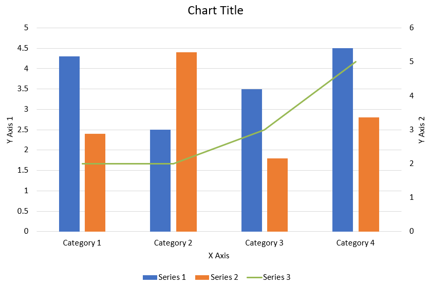

## **समीक्षा**

यह लेख Aspose.Slides का उपयोग करके चार्ट बनाने और अनुकूलित करने पर एक व्यापक गाइड प्रदान करता है। आप सीखेंगे कि कैसे प्रोग्रामैटिक रूप से एक स्लाइड में चार्ट जोड़ें, उसे डेटा से भरें, और आपके विशिष्ट डिज़ाइन आवश्यकताओं के अनुरूप विभिन्न फ़ॉर्मेटिंग विकल्प लागू करें। लेख में विस्तृत कोड उदाहरण प्रत्येक चरण को दर्शाते हैं, प्रस्तुति और चार्ट ऑब्जेक्ट को प्रारंभ करने से लेकर सीरीज़, एक्सिस और लिजेंड को कॉन्फ़िगर करने तक। इस गाइड का पालन करके आप अपने अनुप्रयोगों में डायनेमिक चार्ट जनरेशन को एकीकृत करने की ठोस समझ प्राप्त करेंगे, जिससे डेटा‑चालित प्रेज़ेंटेशन बनाना आसान हो जाता है।

## **चार्ट बनाना**

चार्ट डेटा को शीघ्रता से विज़ुअलाइज़ करने और अंतर्दृष्टि पाने में मदद करते हैं, जो तालिका या स्प्रेडशीट से तुरंत स्पष्ट नहीं हो सकते।

**चार्ट क्यों बनाएँ?**

चार्ट का उपयोग करके आप

* एक स्लाइड में बड़ी मात्रा में डेटा को समेकित, संक्षिप्त या सारांशित कर सकते हैं
* डेटा में पैटर्न और रुझान उजागर कर सकते हैं
* समय के साथ या किसी विशिष्ट माप इकाई के सापेक्ष डेटा की दिशा और गति निर्धारित कर सकते हैं
* अपवाद, विसंगतियों, त्रुटियों, निरर्थक डेटा आदि को पहचान सकते हैं
* जटिल डेटा को प्रभावी ढंग से संप्रेषित या प्रस्तुत कर सकते हैं

PowerPoint में आप इन्सर्ट फ़ंक्शन के माध्यम से चार्ट बना सकते हैं, जो कई प्रकार के चार्ट डिज़ाइन टेम्प्लेट प्रदान करता है। Aspose.Slides का उपयोग करके आप सामान्य चार्ट (लोकप्रिय चार्ट प्रकारों पर आधारित) और कस्टम चार्ट दोनों बना सकते हैं।

{} 
आपको चार्ट बनाने में सहायता करने के लिए Aspose.Slides [ChartType](https://reference.aspose.com/slides/hi/php-java/aspose.slides/ChartType) क्लास प्रदान करता है। इस क्लास के फ़ील्ड विभिन्न चार्ट प्रकारों के अनुरूप होते हैं।
{} 

### **सामान्य चार्ट बनाएं**

_चरण: चार्ट बनाना_
- <a name="java-create-powerpoint-chart" id="java-create-powerpoint-chart"><strong><em>चरण:</em> PowerPoint चार्ट बनाएं </strong></a>
- <a name="java-create-presentation-chart" id="java-create-presentation-chart"><strong><em>चरण:</em> प्रेज़ेंटेशन चार्ट बनाएं </strong></a>
- <a name="java-create-powerpoint-presentation-chart" id="java-create-powerpoint-presentation-chart"><strong><em>चरण:</em> PowerPoint प्रेज़ेंटेशन चार्ट बनाएं </strong></a>

_कोड चरण:_

1. [Presentation](https://reference.aspose.com/slides/hi/php-java/aspose.slides/Presentation) क्लास का एक इंस्टेंस बनाएँ।
2. उसके इंडेक्स के द्वारा स्लाइड का रेफ़रेंस प्राप्त करें।
3. कुछ डेटा के साथ एक चार्ट जोड़ें और वांछित चार्ट प्रकार निर्दिष्ट करें। 
4. चार्ट के लिए एक शीर्षक जोड़ें। 
5. चार्ट डेटा वर्कशीट तक पहुँचें। 
6. सभी डिफ़ॉल्ट सीरीज़ और श्रेणियों को साफ़ करें। 
7. नई सीरीज़ और श्रेणियाँ जोड़ें। 
8. चार्ट सीरीज़ के लिए नई डेटा जोड़ें। 
9. चार्ट सीरीज़ के लिए भराव रंग जोड़ें। 
10. चार्ट सीरीज़ के लिए लेबल जोड़ें। 
11. संशोधित प्रेज़ेंटेशन को PPTX फ़ाइल के रूप में लिखें।

यह PHP कोड दिखाता है कि सामान्य चार्ट कैसे बनाया जाए:

```php
  # PPTX फ़ाइल का प्रतिनिधित्व करने वाली प्रेज़ेंटेशन क्लास को इंस्टेंसिएट करता है
  $pres = new Presentation();
  try {
    # पहली स्लाइड तक पहुँचता है
    $sld = $pres->getSlides()->get_Item(0);
    # डिफ़ॉल्ट डेटा के साथ एक चार्ट जोड़ता है
    $chart = $sld->getShapes()->addChart(ChartType::ClusteredColumn, 0, 0, 500, 500);
    # चार्ट शीर्षक सेट करता है
    $chart->getChartTitle()->addTextFrameForOverriding("Sample Title");
    $chart->getChartTitle()->getTextFrameForOverriding()->getTextFrameFormat()->setCenterText(NullableBool::True);
    $chart->getChartTitle()->setHeight(20);
    $chart->hasTitle();
    # पहले सीरीज़ को मान दिखाने के लिये सेट करता है
    $chart->getChartData()->getSeries()->get_Item(0)->getLabels()->getDefaultDataLabelFormat()->setShowValue(true);
    # चार्ट डेटा शीट का इंडेक्स सेट करता है
    $defaultWorksheetIndex = 0;
    # चार्ट डेटा वर्कशीट प्राप्त करता है
    $fact = $chart->getChartData()->getChartDataWorkbook();
    # डिफ़ॉल्ट जेनरेटेड सीरीज़ और श्रेणियों को हटाता है
    $chart->getChartData()->getSeries()->clear();
    $chart->getChartData()->getCategories()->clear();
    $s = $chart->getChartData()->getSeries()->size();
    $s = $chart->getChartData()->getCategories()->size();
    # नई सीरीज़ जोड़ता है
    $chart->getChartData()->getSeries()->add($fact->getCell($defaultWorksheetIndex, 0, 1, "Series 1"), $chart->getType());
    $chart->getChartData()->getSeries()->add($fact->getCell($defaultWorksheetIndex, 0, 2, "Series 2"), $chart->getType());
    # नई श्रेणियों को जोड़ता है
    $chart->getChartData()->getCategories()->add($fact->getCell($defaultWorksheetIndex, 1, 0, "Caetegoty 1"));
    $chart->getChartData()->getCategories()->add($fact->getCell($defaultWorksheetIndex, 2, 0, "Caetegoty 2"));
    $chart->getChartData()->getCategories()->add($fact->getCell($defaultWorksheetIndex, 3, 0, "Caetegoty 3"));
    # पहला चार्ट सीरीज़ लेता है
    $series = $chart->getChartData()->getSeries()->get_Item(0);
    # अब सीरीज़ डेटा भरता है
    $series->getDataPoints()->addDataPointForBarSeries($fact->getCell($defaultWorksheetIndex, 1, 1, 20));
    $series->getDataPoints()->addDataPointForBarSeries($fact->getCell($defaultWorksheetIndex, 2, 1, 50));
    $series->getDataPoints()->addDataPointForBarSeries($fact->getCell($defaultWorksheetIndex, 3, 1, 30));
    # सीरीज़ के लिए फ़िल कलर सेट करता है
    $series->getFormat()->getFill()->setFillType(FillType::Solid);
    $series->getFormat()->getFill()->getSolidFillColor()->setColor(java("java.awt.Color")->RED);
    # दूसरा चार्ट सीरीज़ लेता है
    $series = $chart->getChartData()->getSeries()->get_Item(1);
    # सीरीज़ डेटा भरता है
    $series->getDataPoints()->addDataPointForBarSeries($fact->getCell($defaultWorksheetIndex, 1, 2, 30));
    $series->getDataPoints()->addDataPointForBarSeries($fact->getCell($defaultWorksheetIndex, 2, 2, 10));
    $series->getDataPoints()->addDataPointForBarSeries($fact->getCell($defaultWorksheetIndex, 3, 2, 60));
    # सीरीज़ के लिए फ़िल कलर सेट करता है
    $series->getFormat()->getFill()->setFillType(FillType::Solid);
    $series->getFormat()->getFill()->getSolidFillColor()->setColor(java("java.awt.Color")->GREEN);
    # नई सीरीज़ के लिए प्रत्येक श्रेणी के कस्टम लेबल बनाता है
    # पहला लेबल कैटेगरी नाम दिखाने के लिये सेट करता है
    $lbl = $series->getDataPoints()->get_Item(0)->getLabel();
    $lbl->getDataLabelFormat()->setShowCategoryName(true);
    $lbl = $series->getDataPoints()->get_Item(1)->getLabel();
    $lbl->getDataLabelFormat()->setShowSeriesName(true);
    # तीसरे लेबल के लिये मान दिखाता है
    $lbl = $series->getDataPoints()->get_Item(2)->getLabel();
    $lbl->getDataLabelFormat()->setShowValue(true);
    $lbl->getDataLabelFormat()->setShowSeriesName(true);
    $lbl->getDataLabelFormat()->setSeparator("/");
    # चार्ट के साथ प्रेज़ेंटेशन को सेव करता है
    $pres->save("output.pptx", SaveFormat::Pptx);
  } finally {
    if (!java_is_null($pres)) {
      $pres->dispose();
    }
  }
```

### **स्कैटर्ड चार्ट बनाएं**
स्कैटर्ड चार्ट (जिसे स्कैटर प्लॉट या x‑y ग्राफ़ भी कहा जाता है) अक्सर दो वेरिएबल्स के बीच पैटर्न या सहसंबंध जाँचने हेतु उपयोग किए जाते हैं।

आप स्कैटर्ड चार्ट का उपयोग तब कर सकते हैं जब 

* आपके पास युग्मित संख्यात्मक डेटा हो
* आपके पास दो ऐसे वेरिएबल हों जो आपस में अच्छी तरह मेल खाते हों
* आप निर्धारित करना चाहते हों कि दो वेरिएबल संबंधित हैं या नहीं
* आपके पास एक स्वतंत्र वेरिएबल हो जिसके कई मान एक आश्रित वेरिएबल के लिये हों

<a name="java-create-scattered-chart" id="java-create-scattered-chart"><strong><em>चरण:</em> स्कैटर्ड चार्ट बनाएं </strong></a> |
<a name="java-create-powerpoint-scattered-chart" id="java-create-powerpoint-scattered-chart"><strong><em>चरण:</em> PowerPoint स्कैटर्ड चार्ट बनाएं </strong></a> |
<a name="java-create-powerpoint-presentation-scattered-chart" id="java-create-powerpoint-presentation-scattered-chart"><strong><em>चरण:</em> PowerPoint प्रेज़ेंटेशन स्कैटर्ड चार्ट बनाएं </strong></a>

1. ऊपर दिए गए [Creating Normal Charts](#creating-normal-charts) अनुभाग के चरणों का पालन करें।
2. तीसरे चरण में, एक चार्ट जोड़ें और नीचे दिए गए विकल्पों में से अपने चार्ट प्रकार को चुनें
   1. [ChartType::ScatterWithMarkers](https://reference.aspose.com/slides/hi/php-java/aspose.slides/charttype/#ScatterWithMarkers) - _स्कैटर चार्ट दर्शाता है।_
   2. [ChartType::ScatterWithSmoothLinesAndMarkers](https://reference.aspose.com/slides/hi/php-java/aspose.slides/charttype/#ScatterWithSmoothLinesAndMarkers) - _वक्रों से जुड़े और डेटा मार्कर वाले स्कैटर चार्ट को दर्शाता है।_
   3. [ChartType::ScatterWithSmoothLines](https://reference.aspose.com/slides/hi/php-java/aspose.slides/charttype/#ScatterWithSmoothLines) - _वक्रों से जुड़े, लेकिन डेटा मार्कर नहीं वाले स्कैटर चार्ट को दर्शाता है।_
   4. [ChartType::ScatterWithStraightLinesAndMarkers](https://reference.aspose.com/slides/hi/php-java/aspose.slides/charttype/#ScatterWithStraightLinesAndMarkers) - _सीधे रेखाओं से जुड़े और डेटा मार्कर वाले स्कैटर चार्ट को दर्शाता है।_
   5. [ChartType::ScatterWithStraightLines](https://reference.aspose.com/slides/hi/php-java/aspose.slides/charttype/#ScatterWithStraightLines) - _सीधे रेखाओं से जुड़े, लेकिन डेटा मार्कर नहीं वाले स्कैटर चार्ट को दर्शाता है।_

यह PHP कोड दर्शाता है कि विभिन्न मार्कर सीरीज़ के साथ स्कैटर्ड चार्ट कैसे बनाएं:

```php
  # PPTX फ़ाइल का प्रतिनिधित्व करने वाली प्रेज़ेंटेशन क्लास को इंस्टेंसिएट करता है
  $pres = new Presentation();
  try {
    # पहली स्लाइड तक पहुँचता है
    $slide = $pres->getSlides()->get_Item(0);
    # डिफ़ॉल्ट चार्ट बनाता है
    $chart = $slide->getShapes()->addChart(ChartType::ScatterWithSmoothLines, 0, 0, 400, 400);
    # डिफ़ॉल्ट चार्ट डेटा वर्कशीट इंडेक्स प्राप्त करता है
    $defaultWorksheetIndex = 0;
    # चार्ट डेटा वर्कशीट प्राप्त करता है
    $fact = $chart->getChartData()->getChartDataWorkbook();
    # डेमो सीरीज़ को हटाता है
    $chart->getChartData()->getSeries()->clear();
    # नया सीरीज़ जोड़ता है
    $chart->getChartData()->getSeries()->add($fact->getCell($defaultWorksheetIndex, 1, 1, "Series 1"), $chart->getType());
    $chart->getChartData()->getSeries()->add($fact->getCell($defaultWorksheetIndex, 1, 3, "Series 2"), $chart->getType());
    # पहला चार्ट सीरीज़ लेता है
    $series = $chart->getChartData()->getSeries()->get_Item(0);
    # सीरीज़ में नया पॉइंट (1:3) जोड़ता है
    $series->getDataPoints()->addDataPointForScatterSeries($fact->getCell($defaultWorksheetIndex, 2, 1, 1), $fact->getCell($defaultWorksheetIndex, 2, 2, 3));
    # नया पॉइंट (2:10) जोड़ता है
    $series->getDataPoints()->addDataPointForScatterSeries($fact->getCell($defaultWorksheetIndex, 3, 1, 2), $fact->getCell($defaultWorksheetIndex, 3, 2, 10));
    # सीरीज़ प्रकार बदलता है
    $series->setType(ChartType::ScatterWithStraightLinesAndMarkers);
    # चार्ट सीरीज़ मार्कर बदलता है
    $series->getMarker()->setSize(10);
    $series->getMarker()->setSymbol(MarkerStyleType::Star);
    # दूसरा चार्ट सीरीज़ लेता है
    $series = $chart->getChartData()->getSeries()->get_Item(1);
    # वहाँ नया पॉइंट (5:2) जोड़ता है
    $series->getDataPoints()->addDataPointForScatterSeries($fact->getCell($defaultWorksheetIndex, 2, 3, 5), $fact->getCell($defaultWorksheetIndex, 2, 4, 2));
    # नया पॉइंट (3:1) जोड़ता है
    $series->getDataPoints()->addDataPointForScatterSeries($fact->getCell($defaultWorksheetIndex, 3, 3, 3), $fact->getCell($defaultWorksheetIndex, 3, 4, 1));
    # नया पॉइंट (2:2) जोड़ता है
    $series->getDataPoints()->addDataPointForScatterSeries($fact->getCell($defaultWorksheetIndex, 4, 3, 2), $fact->getCell($defaultWorksheetIndex, 4, 4, 2));
    # नया पॉइंट (5:1) जोड़ता है
    $series->getDataPoints()->addDataPointForScatterSeries($fact->getCell($defaultWorksheetIndex, 5, 3, 5), $fact->getCell($defaultWorksheetIndex, 5, 4, 1));
    # चार्ट सीरीज़ मार्कर बदलता है
    $series->getMarker()->setSize(10);
    $series->getMarker()->setSymbol(MarkerStyleType::Circle);
    $pres->save("AsposeChart_out.pptx", SaveFormat::Pptx);
  } finally {
    if (!java_is_null($pres)) {
      $pres->dispose();
    }
  }
```

### **पाई चार्ट बनाएं**

पाई चार्ट डेटा में भाग‑से‑पूरा संबंध दिखाने के लिये उपयुक्त होते हैं, विशेषकर जब डेटा में श्रेणीबद्ध लेबल और संख्यात्मक मान हों। toutefois, यदि आपके डेटा में बहुत अधिक भाग या लेबल हों, तो आप बार चार्ट का उपयोग करने पर विचार कर सकते हैं।

<a name="java-create-pie-chart" id="java-create-pie-chart"><strong><em>चरण:</em> पाई चार्ट बनाएं </strong></a> |
<a name="java-create-powerpoint-pie-chart" id="java-create-powerpoint-pie-chart"><strong><em>चरण:</em> PowerPoint पाई चार्ट बनाएं </strong></a> |
<a name="java-create-powerpoint-presentation-pie-chart" id="java-create-powerpoint-presentation-pie-chart"><strong><em>चरण:</em> PowerPoint प्रेज़ेंटेशन पाई चार्ट बनाएं </strong></a>

1. [Presentation](https://reference.aspose.com/slides/hi/php-java/aspose.slides/Presentation) क्लास का एक इंस्टेंस बनाएं।
2. उसके इंडेक्स द्वारा स्लाइड का रेफ़रेंस प्राप्त करें।
3. डिफ़ॉल्ट डेटा के साथ एक चार्ट जोड़ें तथा वांछित प्रकार चुनें (यहाँ [ChartType](https://reference.aspose.com/slides/hi/php-java/aspose.slides/ChartType).Pie)।
4. [ChartDataWorkbook](https://reference.aspose.com/slides/hi/php-java/aspose.slides/chartdataworkbook/) तक पहुँचें।
5. डिफ़ॉल्ट सीरीज़ और श्रेणियों को साफ़ करें।
6. नई सीरीज़ और श्रेणियाँ जोड़ें।
7. चार्ट सीरीज़ के लिए नई डेटा जोड़ें।
8. पाई चार्ट के सेक्टरों के लिये कस्टम रंग जोड़ें।
9. सीरीज़ के लिए लेबल सेट करें।
10. सीरीज़ लेबल के लिये लीडर लाइन्स सेट करें।
11. पाई चार्ट स्लाइड्स के लिये घूर्णन कोण निर्धारित करें।
12. संशोधित प्रेज़ेंटेशन को PPTX फ़ाइल के रूप में लिखें।

यह PHP कोड दिखाता है कि पाई चार्ट कैसे बनाया जाए:

```php
  # PPTX फ़ाइल का प्रतिनिधित्व करने वाली प्रेज़ेंटेशन क्लास को इंस्टेंसिएट करता है
  $pres = new Presentation();
  try {
    # पहली स्लाइड तक पहुँचता है
    $slides = $pres->getSlides()->get_Item(0);
    # डिफ़ॉल्ट डेटा के साथ एक चार्ट जोड़ता है
    $chart = $slides->getShapes()->addChart(ChartType::Pie, 100, 100, 400, 400);
    # चार्ट शीर्षक सेट करता है
    $chart->getChartTitle()->addTextFrameForOverriding("Sample Title");
    $chart->getChartTitle()->getTextFrameForOverriding()->getTextFrameFormat()->setCenterText(NullableBool::True);
    $chart->getChartTitle()->setHeight(20);
    $chart->setTitle(true);
    # पहले सीरीज़ को मान दिखाने के लिये सेट करता है
    $chart->getChartData()->getSeries()->get_Item(0)->getLabels()->getDefaultDataLabelFormat()->setShowValue(true);
    # चार्ट डेटा शीट के लिये इंडेक्स सेट करता है
    $defaultWorksheetIndex = 0;
    # चार्ट डेटा वर्कशीट प्राप्त करता है
    $fact = $chart->getChartData()->getChartDataWorkbook();
    # डिफ़ॉल्ट जेनरेटेड सीरीज़ और श्रेणियों को हटाता है
    $chart->getChartData()->getSeries()->clear();
    $chart->getChartData()->getCategories()->clear();
    # नई श्रेणियाँ जोड़ता है
    $chart->getChartData()->getCategories()->add($fact->getCell(0, 1, 0, "First Qtr"));
    $chart->getChartData()->getCategories()->add($fact->getCell(0, 2, 0, "2nd Qtr"));
    $chart->getChartData()->getCategories()->add($fact->getCell(0, 3, 0, "3rd Qtr"));
    # नई सीरीज़ जोड़ता है
    $series = $chart->getChartData()->getSeries()->add($fact->getCell(0, 0, 1, "Series 1"), $chart->getType());
    # सीरीज़ डेटा भरता है
    $series->getDataPoints()->addDataPointForPieSeries($fact->getCell($defaultWorksheetIndex, 1, 1, 20));
    $series->getDataPoints()->addDataPointForPieSeries($fact->getCell($defaultWorksheetIndex, 2, 1, 50));
    $series->getDataPoints()->addDataPointForPieSeries($fact->getCell($defaultWorksheetIndex, 3, 1, 30));
    # नया संस्करण में काम नहीं कर रहा
    # नए पॉइंट जोड़ना और सेक्टर रंग सेट करना
    # series.IsColorVaried = true;
    $chart->getChartData()->getSeriesGroups()->get_Item(0)->setColorVaried(true);
    $point = $series->getDataPoints()->get_Item(0);
    $point->getFormat()->getFill()->setFillType(FillType::Solid);
    $point->getFormat()->getFill()->getSolidFillColor()->setColor(java("java.awt.Color")->CYAN);
    # सेक्टर की सीमा सेट करता है
    $point->getFormat()->getLine()->getFillFormat()->setFillType(FillType::Solid);
    $point->getFormat()->getLine()->getFillFormat()->getSolidFillColor()->setColor(java("java.awt.Color")->GRAY);
    $point->getFormat()->getLine()->setWidth(3.0);
    $point->getFormat()->getLine()->setStyle(LineStyle->ThinThick);
    $point->getFormat()->getLine()->setDashStyle(LineDashStyle->DashDot);
    $point1 = $series->getDataPoints()->get_Item(1);
    $point1->getFormat()->getFill()->setFillType(FillType::Solid);
    $point1->getFormat()->getFill()->getSolidFillColor()->setColor(java("java.awt.Color")->ORANGE);
    # सेक्टर की सीमा सेट करता है
    $point1->getFormat()->getLine()->getFillFormat()->setFillType(FillType::Solid);
    $point1->getFormat()->getLine()->getFillFormat()->getSolidFillColor()->setColor(java("java.awt.Color")->BLUE);
    $point1->getFormat()->getLine()->setWidth(3.0);
    $point1->getFormat()->getLine()->setStyle(LineStyle->Single);
    $point1->getFormat()->getLine()->setDashStyle(LineDashStyle->LargeDashDot);
    $point2 = $series->getDataPoints()->get_Item(2);
    $point2->getFormat()->getFill()->setFillType(FillType::Solid);
    $point2->getFormat()->getFill()->getSolidFillColor()->setColor(java("java.awt.Color")->YELLOW);
    # सेक्टर की सीमा सेट करता है
    $point2->getFormat()->getLine()->getFillFormat()->setFillType(FillType::Solid);
    $point2->getFormat()->getLine()->getFillFormat()->getSolidFillColor()->setColor(java("java.awt.Color")->RED);
    $point2->getFormat()->getLine()->setWidth(2.0);
    $point2->getFormat()->getLine()->setStyle(LineStyle->ThinThin);
    $point2->getFormat()->getLine()->setDashStyle(LineDashStyle->LargeDashDotDot);
    # नई सीरीज़ के लिए प्रत्येक श्रेणी के कस्टम लेबल बनाता है
    $lbl1 = $series->getDataPoints()->get_Item(0)->getLabel();
    # lbl.ShowCategoryName = true;
    $lbl1->getDataLabelFormat()->setShowValue(true);
    $lbl2 = $series->getDataPoints()->get_Item(1)->getLabel();
    $lbl2->getDataLabelFormat()->setShowValue(true);
    $lbl2->getDataLabelFormat()->setShowLegendKey(true);
    $lbl2->getDataLabelFormat()->setShowPercentage(true);
    $lbl3 = $series->getDataPoints()->get_Item(2)->getLabel();
    $lbl3->getDataLabelFormat()->setShowSeriesName(true);
    $lbl3->getDataLabelFormat()->setShowPercentage(true);
    # चार्ट के लिये लीडर लाइन्स दिखाता है
    $series->getLabels()->getDefaultDataLabelFormat()->setShowLeaderLines(true);
    # पाई चार्ट सेक्टरों के लिये घूर्णन कोण सेट करता है
    $chart->getChartData()->getSeriesGroups()->get_Item(0)->setFirstSliceAngle(180);
    # चार्ट के साथ प्रेज़ेंटेशन को सेव करता है
    $pres->save("PieChart_out.pptx", SaveFormat::Pptx);
  } finally {
    if (!java_is_null($pres)) {
      $pres->dispose();
    }
  }
```

### **लाइन चार्ट बनाएं**

लाइन चार्ट (जिसे लाइन ग्राफ़ भी कहा जाता है) उन स्थितियों में उपयुक्त होते हैं जहाँ आप समय के साथ मान में परिवर्तन दिखाना चाहते हैं। लाइन चार्ट के माध्यम से आप बड़ी मात्रा में डेटा की तुलना, समय के साथ रुझानों को ट्रैक और डेटा सीरीज़ में विसंगतियों को उजागर कर सकते हैं।

1. [Presentation](https://reference.aspose.com/slides/hi/php-java/aspose.slides/Presentation) क्लास का एक इंस्टेंस बनाएं।  
1. उसके इंडेक्स द्वारा स्लाइड का रेफ़रेंस प्राप्त करें।  
1. डिफ़ॉल्ट डेटा के साथ एक चार्ट जोड़ें तथा वांछित प्रकार चुनें (यहाँ `ChartType::Line`)।  
1. चार्ट डेटा `IChartDataWorkbook` तक पहुँचें।  
1. डिफ़ॉल्ट सीरीज़ और श्रेणियों को साफ़ करें।  
1. नई सीरीज़ और श्रेणियाँ जोड़ें।  
1. चार्ट सीरीज़ के लिये नई डेटा जोड़ें।  
1. संशोधित प्रेज़ेंटेशन को PPTX फ़ाइल के रूप में लिखें।

यह PHP कोड दर्शाता है कि लाइन चार्ट कैसे बनाया जाए:

```php
  $pres = new Presentation();
  try {
    $lineChart = $pres->getSlides()->get_Item(0)->getShapes()->addChart(ChartType::Line, 10, 50, 600, 350);
    $pres->save("lineChart.pptx", SaveFormat::Pptx);
  } finally {
    if (!java_is_null($pres)) {
      $pres->dispose();
    }
  }
```

डिफ़ॉल्ट रूप से, लाइन चार्ट के बिंदुओं को सीधी सतत रेखाओं द्वारा जोड़ा जाता है। यदि आप बिंदुओं को डैश द्वारा जोड़ना चाहते हैं, तो आप अपनी वांछित डैश प्रकार इस प्रकार निर्दिष्ट कर सकते हैं:

```php
  $lineChart = $pres->getSlides()->get_Item(0)->getShapes()->addChart(ChartType::Line, 10, 50, 600, 350);
  foreach($lineChart->getChartData()->getSeries() as $series) {
    $series->getFormat()->getLine()->setDashStyle(LineDashStyle->Dash);
  }
```

### **ट्री मैप चार्ट बनाएं**

ट्री मैप चार्ट बिक्री डेटा के लिये उपयुक्त होते हैं जब आप डेटा श्रेणियों के सापेक्ष आकार दिखाना चाहते हैं और साथ ही प्रत्येक श्रेणी में बड़े योगदानकों पर शीघ्रता से ध्यान आकर्षित करना चाहते हैं।

<a name="java-create-tree-map-chart" id="java-create-tree-map-chart"><strong><em>चरण:</em> ट्री मैप चार्ट बनाएं </strong></a> |
<a name="java-create-powerpoint-tree-map-chart" id="java-create-powerpoint-tree-map-chart"><strong><em>चरण:</em> PowerPoint ट्री मैप चार्ट बनाएं </strong></a> |
<a name="java-create-powerpoint-presentation-tree-map-chart" id="java-create-powerpoint-presentation-tree-map-chart"><strong><em>चरण:</em> PowerPoint प्रेज़ेंटेशन ट्री मैप चार्ट बनाएं </strong></a>

1. [Presentation](https://reference.aspose.com/slides/hi/php-java/aspose.slides/Presentation) क्लास का एक इंस्टेंस बनाएं।  
2. उसके इंडेक्स द्वारा स्लाइड का रेफ़रेंस प्राप्त करें।  
3. डिफ़ॉल्ट डेटा के साथ एक चार्ट जोड़ें तथा वांछित प्रकार चुनें (यहाँ [ChartType](https://reference.aspose.com/slides/hi/php-java/aspose.slides/ChartType).TreeMap)।  
4. [ChartDataWorkbook](https://reference.aspose.com/slides/hi/php-java/aspose.slides/chartdataworkbook/) तक पहुँचें।  
5. डिफ़ॉल्ट सीरीज़ और श्रेणियों को साफ़ करें।  
6. नई सीरीज़ और श्रेणियाँ जोड़ें।  
7. चार्ट सीरीज़ के लिये नई डेटा जोड़ें।  
8. संशोधित प्रेज़ेंटेशन को PPTX फ़ाइल के रूप में लिखें।

यह PHP कोड दर्शाता है कि ट्री मैप चार्ट कैसे बनाया जाए:

```php
  $pres = new Presentation();
  try {
    $chart = $pres->getSlides()->get_Item(0)->getShapes()->addChart(ChartType::Treemap, 50, 50, 500, 400);
    $chart->getChartData()->getCategories()->clear();
    $chart->getChartData()->getSeries()->clear();
    $wb = $chart->getChartData()->getChartDataWorkbook();
    $wb->clear(0);
    # शाखा 1
    $leaf = $chart->getChartData()->getCategories()->add($wb->getCell(0, "C1", "Leaf1"));
    $leaf->getGroupingLevels()->setGroupingItem(1, "Stem1");
    $leaf->getGroupingLevels()->setGroupingItem(2, "Branch1");
    $chart->getChartData()->getCategories()->add($wb->getCell(0, "C2", "Leaf2"));
    $leaf = $chart->getChartData()->getCategories()->add($wb->getCell(0, "C3", "Leaf3"));
    $leaf->getGroupingLevels()->setGroupingItem(1, "Stem2");
    $chart->getChartData()->getCategories()->add($wb->getCell(0, "C4", "Leaf4"));
    # शाखा 2
    $leaf = $chart->getChartData()->getCategories()->add($wb->getCell(0, "C5", "Leaf5"));
    $leaf->getGroupingLevels()->setGroupingItem(1, "Stem3");
    $leaf->getGroupingLevels()->setGroupingItem(2, "Branch2");
    $chart->getChartData()->getCategories()->add($wb->getCell(0, "C6", "Leaf6"));
    $leaf = $chart->getChartData()->getCategories()->add($wb->getCell(0, "C7", "Leaf7"));
    $leaf->getGroupingLevels()->setGroupingItem(1, "Stem4");
    $chart->getChartData()->getCategories()->add($wb->getCell(0, "C8", "Leaf8"));
    $series = $chart->getChartData()->getSeries()->add(ChartType::Treemap);
    $series->getLabels()->getDefaultDataLabelFormat()->setShowCategoryName(true);
    $series->getDataPoints()->addDataPointForTreemapSeries($wb->getCell(0, "D1", 4));
    $series->getDataPoints()->addDataPointForTreemapSeries($wb->getCell(0, "D2", 5));
    $series->getDataPoints()->addDataPointForTreemapSeries($wb->getCell(0, "D3", 3));
    $series->getDataPoints()->addDataPointForTreemapSeries($wb->getCell(0, "D4", 6));
    $series->getDataPoints()->addDataPointForTreemapSeries($wb->getCell(0, "D5", 9));
    $series->getDataPoints()->addDataPointForTreemapSeries($wb->getCell(0, "D6", 9));
    $series->getDataPoints()->addDataPointForTreemapSeries($wb->getCell(0, "D7", 4));
    $series->getDataPoints()->addDataPointForTreemapSeries($wb->getCell(0, "D8", 3));
    $series->setParentLabelLayout(ParentLabelLayoutType::Overlapping);
    $pres->save("Treemap.pptx", SaveFormat::Pptx);
  } finally {
    if (!java_is_null($pres)) {
      $pres->dispose();
    }
  }
```

### **स्टॉक चार्ट बनाएं**

<a name="java-create-stock-chart" id="java-create-stock-chart"><strong><em>चरण:</em> स्टॉक चार्ट बनाएं </strong></a> |
<a name="java-create-powerpoint-stock-chart" id="java-powerpoint-stock-chart"><strong><em>चरण:</em> PowerPoint स्टॉक चार्ट बनाएं </strong></a> |
<a name="java-create-powerpoint-presentation-stock-chart" id="java-create-powerpoint-presentation-stock-chart"><strong><em>चरण:</em> PowerPoint प्रेज़ेंटेशन स्टॉक चार्ट बनाएं </strong></a>

1. [Presentation](https://reference.aspose.com/slides/hi/php-java/aspose.slides/Presentation) क्लास का एक इंस्टेंस बनाएं।  
2. उसके इंडेक्स द्वारा स्लाइड का रेफ़रेंस प्राप्त करें।  
3. डिफ़ॉल्ट डेटा के साथ एक चार्ट जोड़ें तथा वांछित प्रकार चुनें ([ChartType](https://reference.aspose.com/slides/hi/php-java/aspose.slides/ChartType).OpenHighLowClose)।  
4. [ChartDataWorkbook](https://reference.aspose.com/slides/hi/php-java/aspose.slides/chartdataworkbook/) तक पहुँचें।  
5. डिफ़ॉल्ट सीरीज़ और श्रेणियों को साफ़ करें।  
6. नई सीरीज़ और श्रेणियाँ जोड़ें।  
7. चार्ट सीरीज़ के लिये नई डेटा जोड़ें।  
8. HiLowLines फ़ॉर्मेट निर्दिष्ट करें।  
9. संशोधित प्रेज़ेंटेशन को PPTX फ़ाइल के रूप में लिखें।

स्टॉक चार्ट बनाने के लिये उपयोग किया गया नमूना PHP कोड:

```php
  $pres = new Presentation();
  try {
    $chart = $pres->getSlides()->get_Item(0)->getShapes()->addChart(ChartType::OpenHighLowClose, 50, 50, 600, 400, false);
    $chart->getChartData()->getSeries()->clear();
    $chart->getChartData()->getCategories()->clear();
    $wb = $chart->getChartData()->getChartDataWorkbook();
    $chart->getChartData()->getCategories()->add($wb->getCell(0, 1, 0, "A"));
    $chart->getChartData()->getCategories()->add($wb->getCell(0, 2, 0, "B"));
    $chart->getChartData()->getCategories()->add($wb->getCell(0, 3, 0, "C"));
    $chart->getChartData()->getSeries()->add($wb->getCell(0, 0, 1, "Open"), $chart->getType());
    $chart->getChartData()->getSeries()->add($wb->getCell(0, 0, 2, "High"), $chart->getType());
    $chart->getChartData()->getSeries()->add($wb->getCell(0, 0, 3, "Low"), $chart->getType());
    $chart->getChartData()->getSeries()->add($wb->getCell(0, 0, 4, "Close"), $chart->getType());
    $series = $chart->getChartData()->getSeries()->get_Item(0);
    $series->getDataPoints()->addDataPointForStockSeries($wb->getCell(0, 1, 1, 72));
    $series->getDataPoints()->addDataPointForStockSeries($wb->getCell(0, 2, 1, 25));
    $series->getDataPoints()->addDataPointForStockSeries($wb->getCell(0, 3, 1, 38));
    $series = $chart->getChartData()->getSeries()->get_Item(1);
    $series->getDataPoints()->addDataPointForStockSeries($wb->getCell(0, 1, 2, 172));
    $series->getDataPoints()->addDataPointForStockSeries($wb->getCell(0, 2, 2, 57));
    $series->getDataPoints()->addDataPointForStockSeries($wb->getCell(0, 3, 2, 57));
    $series = $chart->getChartData()->getSeries()->get_Item(2);
    $series->getDataPoints()->addDataPointForStockSeries($wb->getCell(0, 1, 3, 12));
    $series->getDataPoints()->addDataPointForStockSeries($wb->getCell(0, 2, 3, 12));
    $series->getDataPoints()->addDataPointForStockSeries($wb->getCell(0, 3, 3, 13));
    $series = $chart->getChartData()->getSeries()->get_Item(3);
    $series->getDataPoints()->addDataPointForStockSeries($wb->getCell(0, 1, 4, 25));
    $series->getDataPoints()->addDataPointForStockSeries($wb->getCell(0, 2, 4, 38));
    $series->getDataPoints()->addDataPointForStockSeries($wb->getCell(0, 3, 4, 50));
    $chart->getChartData()->getSeriesGroups()->get_Item(0)->getUpDownBars()->setUpDownBars(true);
    $chart->getChartData()->getSeriesGroups()->get_Item(0)->getHiLowLinesFormat()->getLine()->getFillFormat()->setFillType(FillType::Solid);
    foreach($chart->getChartData()->getSeries() as $ser) {
      $ser->getFormat()->getLine()->getFillFormat()->setFillType(FillType::NoFill);
    }
    $pres->save("output.pptx", SaveFormat::Pptx);
  } finally {
    if (!java_is_null($pres)) {
      $pres->dispose();
    }
  }
```

### **बॉक्स एंड विज़कर चार्ट बनाएं**

<a name="java-create-box-and-whisker-chart" id="java-create-box-and-whisker-chart"><strong><em>चरण:</em> बॉक्स एंड विज़कर चार्ट बनाएं </strong></a> |
<a name="java-create-powerpoint-box-and-whisker-chart" id="java-powerpoint-box-and-whisker-chart"><strong><em>चरण:</em> PowerPoint बॉक्स एंड विज़कर चार्ट बनाएं </strong></a> |
<a name="java-create-powerpoint-presentation-box-and-whisker-chart" id="java-create-powerpoint-presentation-box-and-whisker-chart"><strong><em>चरण:</em> PowerPoint प्रेज़ेंटेशन बॉक्स एंड विज़कर चार्ट बनाएं </strong></a>

1. [Presentation](https://reference.aspose.com/slides/hi/php-java/aspose.slides/Presentation) क्लास का एक इंस्टेंस बनाएं।  
2. उसके इंडेक्स द्वारा स्लाइड का रेफ़रेंस प्राप्त करें।  
3. डिफ़ॉल्ट डेटा के साथ एक चार्ट जोड़ें तथा वांछित प्रकार चुनें ([ChartType](https://reference.aspose.com/slides/hi/php-java/aspose.slides/ChartType).BoxAndWhisker)।  
4. [ChartDataWorkbook](https://reference.aspose.com/slides/hi/php-java/aspose.slides/chartdataworkbook/) तक पहुँचें।  
5. डिफ़ॉल्ट सीरीज़ और श्रेणियों को साफ़ करें।  
6. नई सीरीज़ और श्रेणियाँ जोड़ें।  
7. चार्ट सीरीज़ के लिये नई डेटा जोड़ें।  
8. संशोधित प्रेज़ेंटेशन को PPTX फ़ाइल के रूप में लिखें।

यह PHP कोड दर्शाता है कि बॉक्स एंड विज़कर चार्ट कैसे बनाया जाए:

```php
  $pres = new Presentation();
  try {
    $chart = $pres->getSlides()->get_Item(0)->getShapes()->addChart(ChartType::BoxAndWhisker, 50, 50, 500, 400);
    $chart->getChartData()->getCategories()->clear();
    $chart->getChartData()->getSeries()->clear();
    $wb = $chart->getChartData()->getChartDataWorkbook();
    $wb->clear(0);
    $chart->getChartData()->getCategories()->add($wb->getCell(0, "A1", "Category 1"));
    $chart->getChartData()->getCategories()->add($wb->getCell(0, "A2", "Category 1"));
    $chart->getChartData()->getCategories()->add($wb->getCell(0, "A3", "Category 1"));
    $chart->getChartData()->getCategories()->add($wb->getCell(0, "A4", "Category 1"));
    $chart->getChartData()->getCategories()->add($wb->getCell(0, "A5", "Category 1"));
    $chart->getChartData()->getCategories()->add($wb->getCell(0, "A6", "Category 1"));
    $series = $chart->getChartData()->getSeries()->add(ChartType::BoxAndWhisker);
    $series->setQuartileMethod(QuartileMethodType::Exclusive);
    $series->setShowMeanLine(true);
    $series->setShowMeanMarkers(true);
    $series->setShowInnerPoints(true);
    $series->setShowOutlierPoints(true);
    $series->getDataPoints()->addDataPointForBoxAndWhiskerSeries($wb->getCell(0, "B1", 15));
    $series->getDataPoints()->addDataPointForBoxAndWhiskerSeries($wb->getCell(0, "B2", 41));
    $series->getDataPoints()->addDataPointForBoxAndWhiskerSeries($wb->getCell(0, "B3", 16));
    $series->getDataPoints()->addDataPointForBoxAndWhiskerSeries($wb->getCell(0, "B4", 10));
    $series->getDataPoints()->addDataPointForBoxAndWhiskerSeries($wb->getCell(0, "B5", 23));
    $series->getDataPoints()->addDataPointForBoxAndWhiskerSeries($wb->getCell(0, "B6", 16));
    $pres->save("BoxAndWhisker.pptx", SaveFormat::Pptx);
  } finally {
    if (!java_is_null($pres)) {
      $pres->dispose();
    }
  }
```

### **फनल चार्ट बनाएं**

<a name="java-create-funnel-chart" id="java-create-funnel-chart"><strong><em>चरण:</em> फनल चार्ट बनाएं </strong></a> |
<a name="java-create-powerpoint-funnel-chart" id="java-create-powerpoint-funnel-chart"><strong><em>चरण:</em> PowerPoint फनल चार्ट बनाएं </strong></a> |
<a name="java-create-powerpoint-presentation-funnel-chart" id="java-create-powerpoint-presentation-funnel-chart"><strong><em>चरण:</em> PowerPoint प्रेज़ेंटेशन फनल चार्ट बनाएं </strong></a>

1. [Presentation](https://reference.aspose.com/slides/hi/php-java/aspose.slides/Presentation) क्लास का एक इंस्टेंस बनाएं।  
2. उसके इंडेक्स द्वारा स्लाइड का रेफ़रेंस प्राप्त करें।  
3. डिफ़ॉल्ट डेटा के साथ एक चार्ट जोड़ें तथा वांछित प्रकार चुनें ([ChartType](https://reference.aspose.com/slides/hi/php-java/aspose.slides/ChartType).Funnel)।  
4. संशोधित प्रेज़ेंटेशन को PPTX फ़ाइल के रूप में लिखें।

फनल चार्ट बनाने के लिये PHP कोड:

```php
  $pres = new Presentation();
  try {
    $chart = $pres->getSlides()->get_Item(0)->getShapes()->addChart(ChartType::Funnel, 50, 50, 500, 400);
    $chart->getChartData()->getCategories()->clear();
    $chart->getChartData()->getSeries()->clear();
    $wb = $chart->getChartData()->getChartDataWorkbook();
    $wb->clear(0);
    $chart->getChartData()->getCategories()->add($wb->getCell(0, "A1", "Category 1"));
    $chart->getChartData()->getCategories()->add($wb->getCell(0, "A2", "Category 2"));
    $chart->getChartData()->getCategories()->add($wb->getCell(0, "A3", "Category 3"));
    $chart->getChartData()->getCategories()->add($wb->getCell(0, "A4", "Category 4"));
    $chart->getChartData()->getCategories()->add($wb->getCell(0, "A5", "Category 5"));
    $chart->getChartData()->getCategories()->add($wb->getCell(0, "A6", "Category 6"));
    $series = $chart->getChartData()->getSeries()->add(ChartType::Funnel);
    $series->getDataPoints()->addDataPointForFunnelSeries($wb->getCell(0, "B1", 50));
    $series->getDataPoints()->addDataPointForFunnelSeries($wb->getCell(0, "B2", 100));
    $series->getDataPoints()->addDataPointForFunnelSeries($wb->getCell(0, "B3", 200));
    $series->getDataPoints()->addDataPointForFunnelSeries($wb->getCell(0, "B4", 300));
    $series->getDataPoints()->addDataPointForFunnelSeries($wb->getCell(0, "B5", 400));
    $series->getDataPoints()->addDataPointForFunnelSeries($wb->getCell(0, "B6", 500));
    $pres->save("Funnel.pptx", SaveFormat::Pptx);
  } finally {
    if (!java_is_null($pres)) {
      $pres->dispose();
    }
  }
```

### **सनबर्स्ट चार्ट बनाएं**

<a name="java-create-sunburst-chart" id="java-create-sunburst-chart"><strong><em>चरण:</em> सनबर्स्ट चार्ट बनाएं </strong></a> |
<a name="java-create-powerpoint-sunburst-chart" id="java-create-powerpoint-sunburst-chart"><strong><em>चरण:</em> PowerPoint सनबर्स्ट चार्ट बनाएं </strong></a> |
<a name="java-create-powerpoint-presentation-sunburst-chart" id="java-create-powerpoint-presentation-sunburst-chart"><strong><em>चरण:</em> PowerPoint प्रेज़ेंटेशन सनबर्स्ट चार्ट बनाएं </strong></a>

1. [Presentation](https://reference.aspose.com/slides/hi/php-java/aspose.slides/Presentation) क्लास का एक इंस्टेंस बनाएं।  
2. उसके इंडेक्स द्वारा स्लाइड का रेफ़रेंस प्राप्त करें।  
3. डिफ़ॉल्ट डेटा के साथ एक चार्ट जोड़ें तथा वांछित प्रकार चुनें (यहाँ [ChartType](https://reference.aspose.com/slides/hi/php-java/aspose.slides/ChartType).sunburst)।  
4. संशोधित प्रेज़ेंटेशन को PPTX फ़ाइल के रूप में लिखें।

सनबर्स्ट चार्ट बनाने के लिये PHP कोड:

```php
  $pres = new Presentation();
  try {
    $chart = $pres->getSlides()->get_Item(0)->getShapes()->addChart(ChartType::Sunburst, 50, 50, 500, 400);
    $chart->getChartData()->getCategories()->clear();
    $chart->getChartData()->getSeries()->clear();
    $wb = $chart->getChartData()->getChartDataWorkbook();
    $wb->clear(0);
    # शाखा 1
    $leaf = $chart->getChartData()->getCategories()->add($wb->getCell(0, "C1", "Leaf1"));
    $leaf->getGroupingLevels()->setGroupingItem(1, "Stem1");
    $leaf->getGroupingLevels()->setGroupingItem(2, "Branch1");
    $chart->getChartData()->getCategories()->add($wb->getCell(0, "C2", "Leaf2"));
    $leaf = $chart->getChartData()->getCategories()->add($wb->getCell(0, "C3", "Leaf3"));
    $leaf->getGroupingLevels()->setGroupingItem(1, "Stem2");
    $chart->getChartData()->getCategories()->add($wb->getCell(0, "C4", "Leaf4"));
    # शाखा 2
    $leaf = $chart->getChartData()->getCategories()->add($wb->getCell(0, "C5", "Leaf5"));
    $leaf->getGroupingLevels()->setGroupingItem(1, "Stem3");
    $leaf->getGroupingLevels()->setGroupingItem(2, "Branch2");
    $chart->getChartData()->getCategories()->add($wb->getCell(0, "C6", "Leaf6"));
    $leaf = $chart->getChartData()->getCategories()->add($wb->getCell(0, "C7", "Leaf7"));
    $leaf->getGroupingLevels()->setGroupingItem(1, "Stem4");
    $chart->getChartData()->getCategories()->add($wb->getCell(0, "C8", "Leaf8"));
    $series = $chart->getChartData()->getSeries()->add(ChartType::Sunburst);
    $series->getLabels()->getDefaultDataLabelFormat()->setShowCategoryName(true);
    $series->getDataPoints()->addDataPointForSunburstSeries($wb->getCell(0, "D1", 4));
    $series->getDataPoints()->addDataPointForSunburstSeries($wb->getCell(0, "D2", 5));
    $series->getDataPoints()->addDataPointForSunburstSeries($wb->getCell(0, "D3", 3));
    $series->getDataPoints()->addDataPointForSunburstSeries($wb->getCell(0, "D4", 6));
    $series->getDataPoints()->addDataPointForSunburstSeries($wb->getCell(0, "D5", 9));
    $series->getDataPoints()->addDataPointForSunburstSeries($wb->getCell(0, "D6", 9));
    $series->getDataPoints()->addDataPointForSunburstSeries($wb->getCell(0, "D7", 4));
    $series->getDataPoints()->addDataPointForSunburstSeries($wb->getCell(0, "D8", 3));
    $pres->save("Sunburst.pptx", SaveFormat::Pptx);
  } finally {
    if (!java_is_null($pres)) {
      $pres->dispose();
    }
  }
```

### **हिस्टोग्राम चार्ट बनाएं**

<a name="java-create-histogram-chart" id="java-create-histogram-chart"><strong><em>चरण:</em> हिस्टोग्राम चार्ट बनाएं </strong></a> |
<a name="java-create-powerpoint-histogram-chart" id="java-create-powerpoint-histogram-chart"><strong><em>चरण:</em> PowerPoint हिस्टोग्राम चार्ट बनाएं </strong></a> |
<a name="java-create-powerpoint-presentation-histogram-chart" id="java-create-powerpoint-presentation-histogram-chart"><strong><em>चरण:</em> PowerPoint प्रेज़ेंटेशन हिस्टोग्राम चार्ट बनाएं </strong></a>

1. [Presentation](https://reference.aspose.com/slides/hi/php-java/aspose.slides/Presentation) क्लास का एक इंस्टेंस बनाएं।  
2. उसके इंडेक्स द्वारा स्लाइड का रेफ़रेंस प्राप्त करें।  
3. डिफ़ॉल्ट डेटा के साथ एक चार्ट जोड़ें तथा वांछित प्रकार चुनें ([ChartType](https://reference.aspose.com/slides/hi/php-java/aspose.slides/ChartType).Histogram)।  
4. [ChartDataWorkbook](https://reference.aspose.com/slides/hi/php-java/aspose.slides/chartdataworkbook/) तक पहुँचें।  
5. डिफ़ॉल्ट सीरीज़ और श्रेणियों को साफ़ करें।  
6. नई सीरीज़ और श्रेणियाँ जोड़ें।  
7. संशोधित प्रेज़ेंटेशन को PPTX फ़ाइल के रूप में लिखें।

हिस्टोग्राम चार्ट बनाने के लिये यह PHP कोड है:

```php
  $pres = new Presentation();
  $chart = $pres->getSlides()->get_Item(0)->getShapes()->addChart(ChartType::Histogram, 50, 50, 500, 400);
  $chart->getChartData()->getCategories()->clear();
  $chart->getChartData()->getSeries()->clear();
  $wb = $chart->getChartData()->getChartDataWorkbook();
  $wb->clear(0);
  $series = $chart->getChartData()->getSeries()->add(ChartType::Histogram);
  $series->getDataPoints()->addDataPointForHistogramSeries($wb->getCell(0, "A1", 15));
  $series->getDataPoints()->addDataPointForHistogramSeries($wb->getCell(0, "A2", -41));
  $series->getDataPoints()->addDataPointForHistogramSeries($wb->getCell(0, "A3", 16));
  $series->getDataPoints()->addDataPointForHistogramSeries($wb->getCell(0, "A4", 10));
  $series->getDataPoints()->addDataPointForHistogramSeries($wb->getCell(0, "A5", -23));
  $series->getDataPoints()->addDataPointForHistogramSeries($wb->getCell(0, "A6", 16));
  $chart->getAxes()->getHorizontalAxis()->setAggregationType(AxisAggregationType::Automatic);
```

### **रेडार चार्ट बनाएं**

<a name="java-create-radar-chart" id="java-create-radar-chart"><strong><em>चरण:</em> रेडार चार्ट बनाएं </strong></a> |
<a name="java-create-powerpoint-radar-chart" id="java-create-powerpoint-radar-chart"><strong><em>चरण:</em> PowerPoint रेडार चार्ट बनाएं </strong></a> |
<a name="java-create-powerpoint-presentation-radar-chart" id="java-create-powerpoint-presentation-radar-chart"><strong><em>चरण:</em> PowerPoint प्रेज़ेंटेशन रेडार चार्ट बनाएं </strong></a>

1. [Presentation](https://reference.aspose.com/slides/hi/php-java/aspose.slides/Presentation) क्लास का एक इंस्टेंस बनाएं।  
2. उसके इंडेक्स द्वारा स्लाइड का रेफ़रेंस प्राप्त करें।  
3. कुछ डेटा के साथ एक चार्ट जोड़ें और अपने वांछित प्रकार को निर्दिष्ट करें (`ChartType::Radar`)।  
4. संशोधित प्रेज़ेंटेशन को PPTX फ़ाइल के रूप में लिखें।

रेडार चार्ट बनाने के लिये PHP कोड:

```php
  $pres = new Presentation();
  try {
    $pres->getSlides()->get_Item(0)->getShapes()->addChart(ChartType::Radar, 20, 20, 400, 300);
    $pres->save("Radar-chart.pptx", SaveFormat::Pptx);
  } finally {
    if (!java_is_null($pres)) {
      $pres->dispose();
    }
  }
```

### **मल्टी‑कैटेगरी चार्ट बनाएं**

<a name="java-create-multi-category-chart" id="java-create-multi-category-chart"><strong><em>चरण:</em> मल्टी‑कैटेगरी चार्ट बनाएं </strong></a> |
<a name="java-create-powerpoint-multi-category-chart" id="java-create-powerpoint-multi-category-chart"><strong><em>चरण:</em> PowerPoint मल्टी‑कैटेगरी चार्ट बनाएं </strong></a> |
<a name="java-create-powerpoint-presentation-multi-category-chart" id="java-create-powerpoint-presentation-multi-category-chart"><strong><em>चरण:</em> PowerPoint प्रेज़ेंटेशन मल्टी‑कैटेगरी चार्ट बनाएं </strong></a>

1. [Presentation](https://reference.aspose.com/slides/hi/php-java/aspose.slides/Presentation) क्लास का एक इंस्टेंस बनाएं।  
2. उसके इंडेक्स द्वारा स्लाइड का रेफ़रेंस प्राप्त करें।  
3. डिफ़ॉल्ट डेटा के साथ एक चार्ट जोड़ें तथा वांछित प्रकार चुनें ([ChartType](https://reference.aspose.com/slides/hi/php-java/aspose.slides/ChartType).ClusteredColumn)।  
4. [ChartDataWorkbook](https://reference.aspose.com/slides/hi/php-java/aspose.slides/chartdataworkbook/) तक पहुँचें।  
5. डिफ़ॉल्ट सीरीज़ और श्रेणियों को साफ़ करें।  
6. नई सीरीज़ और श्रेणियाँ जोड़ें।  
7. चार्ट सीरीज़ के लिये नई डेटा जोड़ें।  
8. संशोधित प्रेज़ेंटेशन को PPTX फ़ाइल के रूप में लिखें।

मल्टी‑कैटेगरी चार्ट बनाने के लिये यह PHP कोड है:

```php
  $pres = new Presentation();
  try {
    $ch = $pres->getSlides()->get_Item(0)->getShapes()->addChart(ChartType::ClusteredColumn, 100, 100, 600, 450);
    $ch->getChartData()->getSeries()->clear();
    $ch->getChartData()->getCategories()->clear();
    $fact = $ch->getChartData()->getChartDataWorkbook();
    $fact->clear(0);
    $defaultWorksheetIndex = 0;
    $category = $ch->getChartData()->getCategories()->add($fact->getCell(0, "c2", "A"));
    $category->getGroupingLevels()->setGroupingItem(1, "Group1");
    $category = $ch->getChartData()->getCategories()->add($fact->getCell(0, "c3", "B"));
    $category = $ch->getChartData()->getCategories()->add($fact->getCell(0, "c4", "C"));
    $category->getGroupingLevels()->setGroupingItem(1, "Group2");
    $category = $ch->getChartData()->getCategories()->add($fact->getCell(0, "c5", "D"));
    $category = $ch->getChartData()->getCategories()->add($fact->getCell(0, "c6", "E"));
    $category->getGroupingLevels()->setGroupingItem(1, "Group3");
    $category = $ch->getChartData()->getCategories()->add($fact->getCell(0, "c7", "F"));
    $category = $ch->getChartData()->getCategories()->add($fact->getCell(0, "c8", "G"));
    $category->getGroupingLevels()->setGroupingItem(1, "Group4");
    $category = $ch->getChartData()->getCategories()->add($fact->getCell(0, "c9", "H"));
    # सीरीज़ जोड़ें
    $series = $ch->getChartData()->getSeries()->add($fact->getCell(0, "D1", "Series 1"), ChartType::ClusteredColumn);
    $series->getDataPoints()->addDataPointForBarSeries($fact->getCell($defaultWorksheetIndex, "D2", 10));
    $series->getDataPoints()->addDataPointForBarSeries($fact->getCell($defaultWorksheetIndex, "D3", 20));
    $series->getDataPoints()->addDataPointForBarSeries($fact->getCell($defaultWorksheetIndex, "D4", 30));
    $series->getDataPoints()->addDataPointForBarSeries($fact->getCell($defaultWorksheetIndex, "D5", 40));
    $series->getDataPoints()->addDataPointForBarSeries($fact->getCell($defaultWorksheetIndex, "D6", 50));
    $series->getDataPoints()->addDataPointForBarSeries($fact->getCell($defaultWorksheetIndex, "D7", 60));
    $series->getDataPoints()->addDataPointForBarSeries($fact->getCell($defaultWorksheetIndex, "D8", 70));
    $series->getDataPoints()->addDataPointForBarSeries($fact->getCell($defaultWorksheetIndex, "D9", 80));
    # चार्ट के साथ प्रेज़ेंटेशन को सहेजें
    $pres->save("AsposeChart_out.pptx", SaveFormat::Pptx);
  } finally {
    if (!java_is_null($pres)) {
      $pres->dispose();
    }
  }
```

### **मैप चार्ट बनाएं**

मैप चार्ट वह विज़ुअलाइज़ेशन है जिसमें डेटा के साथ एक भौगोलिक क्षेत्र दिखाया जाता है। मैप चार्ट डेटा या मानों की विभिन्न क्षेत्रों में तुलना के लिये उपयुक्त होते हैं।

<a name="java-create-map-chart" id="java-create-map-chart"><strong><em>चरण:</em> मैप चार्ट बनाएं </strong></a> |
<a name="java-create-powerpoint-map-chart" id="java-create-powerpoint-map-chart"><strong><em>चरण:</em> PowerPoint मैप चार्ट बनाएं </strong></a> |
<a name="java-create-powerpoint-presentation-map-chart" id="java-create-powerpoint-presentation-map-chart"><strong><em>चरण:</em> PowerPoint प्रेज़ेंटेशन मैप चार्ट बनाएं </strong></a>

यह PHP कोड दर्शाता है कि मैप चार्ट कैसे बनाया जाए:

```php
  $pres = new Presentation();
  try {
    $chart = $pres->getSlides()->get_Item(0)->getShapes()->addChart(ChartType::Map, 50, 50, 500, 400);
    $pres->save("mapChart.pptx", SaveFormat::Pptx);
  } finally {
    if (!java_is_null($pres)) {
      $pres->dispose();
    }
  }
```

### **कंपोज़िशन चार्ट बनाएं**

कंपोज़िशन चार्ट (या कॉम्बो चार्ट) एक ही ग्राफ़ में दो या अधिक चार्ट प्रकारों को मिलाता है। यह चार्ट आपको दो या अधिक डेटा सेटों के बीच अंतर को उजागर, तुलना या जाँचने में मदद करता है, जिससे आप उनके बीच के संबंधों को पहचान सकते हैं।



निम्न PHP कोड दिखाता है कि ऊपर दिखाए गए कंपोज़िशन चार्ट को PowerPoint प्रेज़ेंटेशन में कैसे बनाया जाए:

```php
function createComboChart() {
    $presentation = new Presentation();
    $slide = $presentation->getSlides()->get_Item(0);
    try {
        $chart = createChartWithFirstSeries($slide);

        addSecondSeriesToChart($chart);
        addThirdSeriesToChart($chart);

        setPrimaryAxesFormat($chart);
        setSecondaryAxesFormat($chart);

        $presentation->save("combo-chart.pptx", SaveFormat::Pptx);
    } finally {
        $presentation->dispose();
    }
}

function createChartWithFirstSeries($slide) {
    $chart = $slide->getShapes()->addChart(ChartType::ClusteredColumn, 50, 50, 600, 400);

    // चार्ट शीर्षक सेट करें।
    $chart->setTitle(true);
    $chart->getChartTitle()->addTextFrameForOverriding("Chart Title");
    $chart->getChartTitle()->setOverlay(false);
    $titleParagraph = $chart->getChartTitle()->getTextFrameForOverriding()->getParagraphs()->get_Item(0);
    $titleFormat = $titleParagraph->getParagraphFormat()->getDefaultPortionFormat();
    $titleFormat->setFontBold(NullableBool::False);
    $titleFormat->setFontHeight(18);
    
    // चार्ट लेजेंड सेट करें।
    $chart->getLegend()->setPosition(LegendPositionType::Bottom);
    $chart->getLegend()->getTextFormat()->getPortionFormat()->setFontHeight(12);

    // डिफ़ॉल्ट जेनरेटेड सीरीज़ और श्रेणियों को हटाएँ।
    $chart->getChartData()->getSeries()->clear();
    $chart->getChartData()->getCategories()->clear();

    $worksheetIndex = 0;
    $workbook = $chart->getChartData()->getChartDataWorkbook();

    // नई श्रेणियाँ जोड़ें।
    $chart->getChartData()->getCategories()->add($workbook->getCell($worksheetIndex, 1, 0, "Category 1"));
    $chart->getChartData()->getCategories()->add($workbook->getCell($worksheetIndex, 2, 0, "Category 2"));
    $chart->getChartData()->getCategories()->add($workbook->getCell($worksheetIndex, 3, 0, "Category 3"));
    $chart->getChartData()->getCategories()->add($workbook->getCell($worksheetIndex, 4, 0, "Category 4"));

    // पहली सीरीज़ जोड़ें।
    $seriesNameCell = $workbook->getCell($worksheetIndex, 0, 1, "Series 1");
    $series = $chart->getChartData()->getSeries()->add($seriesNameCell, $chart->getType());

    $series->getParentSeriesGroup()->setOverlap(-25);
    $series->getParentSeriesGroup()->setGapWidth(220);

    $series->getDataPoints()->addDataPointForBarSeries($workbook->getCell($worksheetIndex, 1, 1, 4.3));
    $series->getDataPoints()->addDataPointForBarSeries($workbook->getCell($worksheetIndex, 2, 1, 2.5));
    $series->getDataPoints()->addDataPointForBarSeries($workbook->getCell($worksheetIndex, 3, 1, 3.5));
    $series->getDataPoints()->addDataPointForBarSeries($workbook->getCell($worksheetIndex, 4, 1, 4.5));

    return $chart;
}

function addSecondSeriesToChart($chart) {
    $workbook = $chart->getChartData()->getChartDataWorkbook();
    $worksheetIndex = 0;

    $seriesNameCell = $workbook->getCell($worksheetIndex, 0, 2, "Series 2");
    $series = $chart->getChartData()->getSeries()->add($seriesNameCell, ChartType::ClusteredColumn);

    $series->getParentSeriesGroup()->setOverlap(-25);
    $series->getParentSeriesGroup()->setGapWidth(220);

    $series->getDataPoints()->addDataPointForBarSeries($workbook->getCell($worksheetIndex, 1, 2, 2.4));
    $series->getDataPoints()->addDataPointForBarSeries($workbook->getCell($worksheetIndex, 2, 2, 4.4));
    $series->getDataPoints()->addDataPointForBarSeries($workbook->getCell($worksheetIndex, 3, 2, 1.8));
    $series->getDataPoints()->addDataPointForBarSeries($workbook->getCell($worksheetIndex, 4, 2, 2.8));
}

function addThirdSeriesToChart($chart) {
    $workbook = $chart->getChartData()->getChartDataWorkbook();
    $worksheetIndex = 0;

    $seriesNameCell = $workbook->getCell($worksheetIndex, 0, 3, "Series 3");
    $series = $chart->getChartData()->getSeries()->add($seriesNameCell, ChartType::Line);

    $series->getDataPoints()->addDataPointForLineSeries($workbook->getCell($worksheetIndex, 1, 3, 2.0));
    $series->getDataPoints()->addDataPointForLineSeries($workbook->getCell($worksheetIndex, 2, 3, 2.0));
    $series->getDataPoints()->addDataPointForLineSeries($workbook->getCell($worksheetIndex, 3, 3, 3.0));
    $series->getDataPoints()->addDataPointForLineSeries($workbook->getCell($worksheetIndex, 4, 3, 5.0));

    $series->setPlotOnSecondAxis(true);
}

function setPrimaryAxesFormat($chart) {
    // क्षैतिज अक्ष सेट करें।
    $horizontalAxis = $chart->getAxes()->getHorizontalAxis();
    $horizontalAxis->getTextFormat()->getPortionFormat()->setFontHeight(12);
    $horizontalAxis->getFormat()->getLine()->getFillFormat()->setFillType(FillType::NoFill);

    setAxisTitle($horizontalAxis, "X Axis");

    // ऊर्ध्वाधर अक्ष सेट करें।
    $verticalAxis = $chart->getAxes()->getVerticalAxis();
    $verticalAxis->getTextFormat()->getPortionFormat()->setFontHeight(12);
    $verticalAxis->getFormat()->getLine()->getFillFormat()->setFillType(FillType::NoFill);

    setAxisTitle($verticalAxis, "Y Axis 1");

    // ऊर्ध्वाधर मुख्य ग्रिडलाइन का रंग सेट करें।
    $majorGridLinesFormat = $verticalAxis->getMajorGridLinesFormat()->getLine()->getFillFormat();
    $majorGridLinesFormat->setFillType(FillType::Solid);
    $majorGridLinesFormat->getSolidFillColor()->setColor(new java("java.awt.Color", 217, 217, 217));
}

function setSecondaryAxesFormat($chart) {
    // द्वितीयक क्षैतिज अक्ष सेट करें।
    $secondaryHorizontalAxis = $chart->getAxes()->getSecondaryHorizontalAxis();
    $secondaryHorizontalAxis->setPosition(AxisPositionType::Bottom);
    $secondaryHorizontalAxis->setCrossType(CrossesType::Maximum);
    $secondaryHorizontalAxis->setVisible(false);
    $secondaryHorizontalAxis->getMajorGridLinesFormat()->getLine()->getFillFormat()->setFillType(FillType::NoFill);
    $secondaryHorizontalAxis->getMinorGridLinesFormat()->getLine()->getFillFormat()->setFillType(FillType::NoFill);

    // द्वितीयक ऊर्ध्वाधर अक्ष सेट करें।
    $secondaryVerticalAxis = $chart->getAxes()->getSecondaryVerticalAxis();
    $secondaryVerticalAxis->setPosition(AxisPositionType::Right);
    $secondaryVerticalAxis->getTextFormat()->getPortionFormat()->setFontHeight(12);
    $secondaryVerticalAxis->getFormat()->getLine()->getFillFormat()->setFillType(FillType::NoFill);
    $secondaryVerticalAxis->getMajorGridLinesFormat()->getLine()->getFillFormat()->setFillType(FillType::NoFill);
    $secondaryVerticalAxis->getMinorGridLinesFormat()->getLine()->getFillFormat()->setFillType(FillType::NoFill);

    setAxisTitle($secondaryVerticalAxis, "Y Axis 2");
}

function setAxisTitle($axis, $axisTitle) {
    $axis->setTitle(true);
    $axis->getTitle()->setOverlay(false);
    $titleParagraph = $axis->getTitle()->addTextFrameForOverriding($axisTitle)->getParagraphs()->get_Item(0);
    $titleFormat = $titleParagraph->getParagraphFormat()->getDefaultPortionFormat();
    $titleFormat->setFontBold(NullableBool::False);
    $titleFormat->setFontHeight(12);
}
```

## **चार्ट अपडेट करें**

<a name="java-update-powerpoint-chart" id="java-update-powerpoint-chart"><strong><em>चरण:</em> PowerPoint चार्ट अपडेट करें </strong></a> |
<a name="java-update-presentation-chart" id="java-update-presentation-chart"><strong><em>चरण:</em> प्रेज़ेंटेशन चार्ट अपडेट करें </strong></a> |
<a name="java-update-powerpoint-presentation-chart" id="java-update-powerpoint-presentation-chart"><strong><em>चरण:</em> PowerPoint प्रेज़ेंटेशन चार्ट अपडेट करें </strong></a>

1. उस प्रेज़ेंटेशन को दर्शाने वाले [Presentation](https://reference.aspose.com/slides/hi/php-java/aspose.slides/Presentation) क्लास को इंस्टेंशिएट करें जिसमें वह चार्ट हो जिसे आप अपडेट करना चाहते हैं।  
2. उसके इंडेक्स द्वारा स्लाइड का रेफ़रेंस प्राप्त करें।  
3. सभी शेप्स को ट्रैवर्स करके वांछित चार्ट खोजें।  
4. चार्ट डेटा वर्कशीट तक पहुँचें।  
5. सीरीज़ वैल्यू बदलकर चार्ट डेटा सीरीज़ को संशोधित करें।  
6. नई सीरीज़ जोड़ें और उसमें डेटा भरें।  
7. संशोधित प्रेज़ेंटेशन को PPTX फ़ाइल के रूप में लिखें।

यह PHP कोड दिखाता है कि चार्ट कैसे अपडेट किया जाए:

```php
  $pres = new Presentation();
  try {
    # पहली स्लाइड मार्कर तक पहुँचें
    $sld = $pres->getSlides()->get_Item(0);
    # डिफ़ॉल्ट डेटा के साथ चार्ट प्राप्त करें
    $chart = $sld->getShapes()->get_Item(0);
    # चार्ट डेटा शीट का इंडेक्स सेट कर रहे हैं
    $defaultWorksheetIndex = 0;
    # चार्ट डेटा वर्कशीट प्राप्त कर रहे हैं
    $fact = $chart->getChartData()->getChartDataWorkbook();
    # चार्ट श्रेणी नाम बदल रहे हैं
    $fact->getCell($defaultWorksheetIndex, 1, 0, "Modified Category 1");
    $fact->getCell($defaultWorksheetIndex, 2, 0, "Modified Category 2");
    # पहले चार्ट सीरीज़ को लें
    $series = $chart->getChartData()->getSeries()->get_Item(0);
    # अब सीरीज़ डेटा अपडेट कर रहे हैं
    $fact->getCell($defaultWorksheetIndex, 0, 1, "New_Series1");// सीरीज़ नाम संशोधित कर रहे हैं

    $series->getDataPoints()->get_Item(0)->getValue()->setData(90);
    $series->getDataPoints()->get_Item(1)->getValue()->setData(123);
    $series->getDataPoints()->get_Item(2)->getValue()->setData(44);
    # दूसरे चार्ट सीरीज़ को लें
    $series = $chart->getChartData()->getSeries()->get_Item(1);
    # अब सीरीज़ डेटा अपडेट कर रहे हैं
    $fact->getCell($defaultWorksheetIndex, 0, 2, "New_Series2");// सीरीज़ नाम संशोधित कर रहे हैं

    $series->getDataPoints()->get_Item(0)->getValue()->setData(23);
    $series->getDataPoints()->get_Item(1)->getValue()->setData(67);
    $series->getDataPoints()->get_Item(2)->getValue()->setData(99);
    # अब, नई सीरीज़ जोड़ रहे हैं
    $chart->getChartData()->getSeries()->add($fact->getCell($defaultWorksheetIndex, 0, 3, "Series 3"), $chart->getType());
    # तीसरे चार्ट सीरीज़ को लें
    $series = $chart->getChartData()->getSeries()->get_Item(2);
    # अब सीरीज़ डेटा भर रहे हैं
    $series->getDataPoints()->addDataPointForBarSeries($fact->getCell($defaultWorksheetIndex, 1, 3, 20));
    $series->getDataPoints()->addDataPointForBarSeries($fact->getCell($defaultWorksheetIndex, 2, 3, 50));
    $series->getDataPoints()->addDataPointForBarSeries($fact->getCell($defaultWorksheetIndex, 3, 3, 30));
    $chart->setType(ChartType::ClusteredCylinder);
    # चार्ट के साथ प्रेज़ेंटेशन सहेजें
    $pres->save("AsposeChartModified_out.pptx", SaveFormat::Pptx);
  } finally {
    if (!java_is_null($pres)) {
      $pres->dispose();
    }
  }
```

## **चार्ट के लिये डेटा रेंज सेट करें**

चार्ट की डेटा रेंज सेट करने के लिए निम्न कदम उठाएँ:

1. उस प्रेज़ेंटेशन को दर्शाने वाले [Presentation](https://reference.aspose.com/slides/hi/php-java/aspose.slides/Presentation) क्लास को इंस्टेंशिएट करें।  
2. उसके इंडेक्स द्वारा स्लाइड का रेफ़रेंस प्राप्त करें।  
3. सभी शेप्स को ट्रैवर्स करके वांछित चार्ट खोजें।  
4. चार्ट डेटा तक पहुँचें और रेंज सेट करें।  
5. संशोधित प्रेज़ेंटेशन को PPTX फ़ाइल के रूप में सेव करें।

यह PHP कोड दर्शाता है कि चार्ट की डेटा रेंज कैसे सेट करें:

```php
  $pres = new Presentation();
  try {
    $slide = $pres->getSlides()->get_Item(0);
    $chart = $slide->getShapes()->get_Item(0);
    $chart->getChartData()->setRange("Sheet1!A1:B4");
    $pres->save("SetDataRange_out.pptx", SaveFormat::Pptx);
  } finally {
    if (!java_is_null($pres)) {
      $pres->dispose();
    }
  }
```

## **चार्ट में डिफ़ॉल्ट मार्कर्स का उपयोग करें**
जब आप चार्ट में डिफ़ॉल्ट मार्कर उपयोग करते हैं, तो प्रत्येक चार्ट सीरीज़ को स्वचालित रूप से विभिन्न डिफ़ॉल्ट मार्कर चिन्ह मिलते हैं।

यह PHP कोड दिखाता है कि चार्ट सीरीज़ मार्कर को स्वचालित रूप से कैसे सेट किया जाए:

```php
  $pres = new Presentation();
  try {
    $slide = $pres->getSlides()->get_Item(0);
    $chart = $slide->getShapes()->addChart(ChartType::LineWithMarkers, 10, 10, 400, 400);
    $chart->getChartData()->getSeries()->clear();
    $chart->getChartData()->getCategories()->clear();
    $fact = $chart->getChartData()->getChartDataWorkbook();
    $chart->getChartData()->getSeries()->add($fact->getCell(0, 0, 1, "Series 1"), $chart->getType());
    $series = $chart->getChartData()->getSeries()->get_Item(0);
    $chart->getChartData()->getCategories()->add($fact->getCell(0, 1, 0, "C1"));
    $series->getDataPoints()->addDataPointForLineSeries($fact->getCell(0, 1, 1, 24));
    $chart->getChartData()->getCategories()->add($fact->getCell(0, 2, 0, "C2"));
    $series->getDataPoints()->addDataPointForLineSeries($fact->getCell(0, 2, 1, 23));
    $chart->getChartData()->getCategories()->add($fact->getCell(0, 3, 0, "C3"));
    $series->getDataPoints()->addDataPointForLineSeries($fact->getCell(0, 3, 1, -10));
    $chart->getChartData()->getCategories()->add($fact->getCell(0, 4, 0, "C4"));
    $series->getDataPoints()->addDataPointForLineSeries($fact->getCell(0, 4, 1, null));
    $chart->getChartData()->getSeries()->add($fact->getCell(0, 0, 2, "Series 2"), $chart->getType());
    # दूसरा चार्ट सीरीज़ लें
    $series2 = $chart->getChartData()->getSeries()->get_Item(1);
    # अब सीरीज़ डेटा भर रहे हैं
    $series2->getDataPoints()->addDataPointForLineSeries($fact->getCell(0, 1, 2, 30));
    $series2->getDataPoints()->addDataPointForLineSeries($fact->getCell(0, 2, 2, 10));
    $series2->getDataPoints()->addDataPointForLineSeries($fact->getCell(0, 3, 2, 60));
    $series2->getDataPoints()->addDataPointForLineSeries($fact->getCell(0, 4, 2, 40));
    $chart->setLegend(true);
    $chart->getLegend()->setOverlay(false);
    $pres->save("DefaultMarkersInChart.pptx", SaveFormat::Pptx);
  } finally {
    if (!java_is_null($pres)) {
      $pres->dispose();
    }
  }
```

## **अक्सर पूछे जाने वाले प्रश्न**

**Aspose.Slides किन चार्ट प्रकारों का समर्थन करता है?**

Aspose.Slides कई प्रकार के [chart types](https://reference.aspose.com/slides/hi/php-java/aspose.slides/charttype/) का समर्थन करता है, जिनमें बार, लाइन, पाई, एरिया, स्कैटर, हिस्टोग्राम, रेडार और कई अन्य शामिल हैं। यह लचीलापन आपको डेटा विज़ुअलाइज़ेशन की आवश्यकताओं के अनुसार सबसे उपयुक्त चार्ट प्रकार चुनने की सुविधा देता है।

**स्लाइड में नया चार्ट कैसे जोड़ें?**

एक चार्ट जोड़ने के लिये पहले आप [Presentation](https://reference.aspose.com/slides/hi/php-java/aspose.slides/presentation/) क्लास का इंस्टेंस बनाते हैं, इच्छित स्लाइड को उसके इंडेक्स द्वारा प्राप्त करते हैं, और फिर चार्ट जोड़ने का मेथड कॉल करके चार्ट प्रकार और प्रारंभिक डेटा निर्दिष्ट करते हैं। यह प्रक्रिया चार्ट को सीधे आपके प्रेज़ेंटेशन में सम्मिलित करती है।

**चार्ट में प्रदर्शित डेटा को कैसे अपडेट करें?**

आप चार्ट के डेटा वर्कबुक ([ChartDataWorkbook](https://reference.aspose.com/slides/hi/php-java/aspose.slides/chartdataworkbook/)) तक पहुँचकर डिफ़ॉल्ट सीरीज़ और श्रेणियाँ साफ़ कर सकते हैं, फिर अपनी कस्टम डेटा जोड़ सकते हैं। इससे आप नवीनतम डेटा को दर्शाने के लिये चार्ट को रीफ़्रेश कर सकते हैं।

**क्या चार्ट की उपस्थिति को कस्टमाइज़ करना संभव है?**

हां, Aspose.Slides व्यापक कस्टमाइज़ेशन विकल्प प्रदान करता है। आप रंग, फ़ॉन्ट, लेबल, लिजेंड और अन्य [formatting elements](/slides/hi/php-java/chart-entities/) को बदलकर चार्ट की उपस्थिति को अपने विशिष्ट डिज़ाइन आवश्यकताओं के अनुसार ढाल सकते हैं।