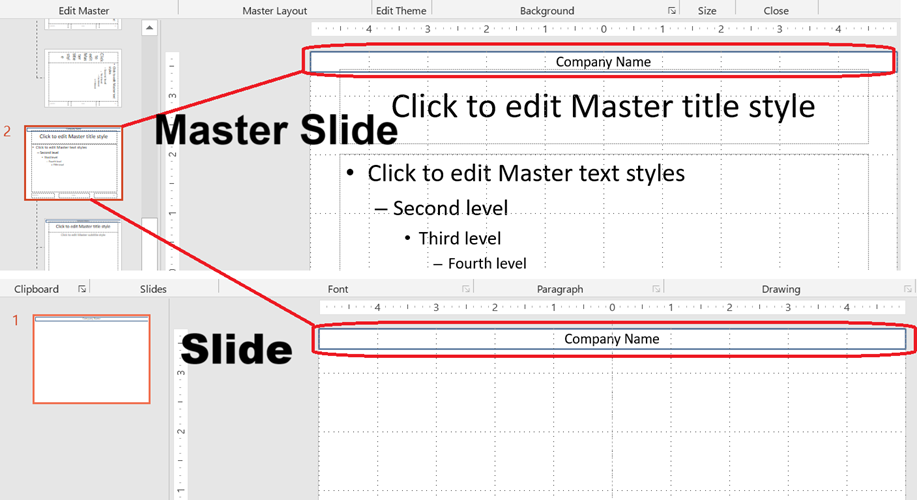

Master slides PowerPoint में स्लाइड वंशानुक्रम के शीर्ष स्तर का निर्माण करती हैं। एक **master slide** पृष्ठभूमि, लोगो और टेक्स्ट फॉर्मेटिंग जैसी सामान्य डिज़ाइन तत्वों को निर्धारित करता है। **Layout slides** मास्टर स्लाइड्स से विरासत में मिलती हैं, और **normal slides** लेआउट स्लाइड्स से विरासत में मिलते हैं।

यह लेख Aspose.Slides for PHP via Java का उपयोग करके मास्टर स्लाइड्स को बनाने, संशोधित करने और प्रबंधित करने का प्रदर्शन करता है।

## **मास्टर स्लाइड जोड़ें**

यह उदाहरण डिफ़ॉल्ट मास्टर स्लाइड को क्लोन करके नई मास्टर स्लाइड बनाने का तरीका दर्शाता है।

```php
function addMasterSlide() {
    $presentation = new Presentation();
    try {
        // डिफ़ॉल्ट मास्टर स्लाइड को क्लोन करें।
        $defaultMasterSlide = $presentation->getMasters()->get_Item(0);
        $newMasterSlide = $presentation->getMasters()->addClone($defaultMasterSlide);

        $presentation->save("master_slide.pptx", SaveFormat::Pptx);
    } finally {
        $presentation->dispose();
    }
}
```

> 💡 **Tip 1:** मास्टर स्लाइड्स सभी स्लाइड्स में समान ब्रांडिंग या साझा डिज़ाइन तत्वों को लागू करने का तरीका प्रदान करती हैं। मास्टर में किए गए किसी भी परिवर्तन का स्वचालित रूप से निर्भर लेआउट और सामान्य स्लाइड्स पर प्रतिबिंबित होगा।

> 💡 **Tip 2:** मास्टर स्लाइड में जोड़े गए किसी भी आकार या फ़ॉर्मेटिंग को लेआउट स्लाइड्स द्वारा विरासत में मिलते हैं और बदले में उन लेआउट्स का उपयोग करने वाली सभी सामान्य स्लाइड्स में भी।  
> नीचे दिया गया चित्र दर्शाता है कि कैसे मास्टर स्लाइड में जोड़ा गया टेक्स्ट बॉक्स अंतिम स्लाइड पर स्वचालित रूप से रेंडर किया जाता है।



## **मास्टर स्लाइड तक पहुँचें**

आप `Presentation::getMasters` मेथड का उपयोग करके मास्टर स्लाइड्स तक पहुँच सकते हैं। यहाँ बताया गया है कि उन्हें कैसे पुनः प्राप्त करें और उनके साथ काम करें:

```php
function accessMasterSlide() {
    $presentation = new Presentation("master_slide.pptx");
    try {
        // पहले मास्टर स्लाइड तक पहुँचें।
        $firstMasterSlide = $presentation->getMasters()->get_Item(0);
    } finally {
        $presentation->dispose();
    }
}
```

## **मास्टर स्लाइड हटाएँ**

मास्टर स्लाइड्स को इंडेक्स या रेफ़रेंस द्वारा हटाया जा सकता है।

```php
function removeMasterSlide() {
    $presentation = new Presentation("master_slide.pptx");
    try {
        // इंडेक्स द्वारा हटाएँ.
        $presentation->getMasters()->removeAt(0);

        // या रेफ़रेंस द्वारा हटाएँ.
        $firstMasterSlide = $presentation->getMasters()->get_Item(0);
        $presentation->getMasters()->remove($firstMasterSlide);

        $presentation->save("master_slide_removed.pptx", SaveFormat::Pptx);
    } finally {
        $presentation->dispose();
    }
}
```

## **अप्रयुक्त मास्टर स्लाइड्स हटाएँ**

कुछ प्रस्तुतियों में ऐसे मास्टर स्लाइड्स होते हैं जो उपयोग में नहीं हैं। इन स्लाइड्स को हटाने से फ़ाइल आकार कम करने में मदद मिल सकती है।

```php
function removeUnusedMasterSlide() {
    $presentation = new Presentation("master_slide.pptx");
    try {
        // सभी अप्रयुक्त मास्टर स्लाइड्स हटाएँ (यहाँ तक कि जो Preserve के रूप में चिह्नित हैं)।
        $presentation->getMasters()->removeUnused(true);

        $presentation->save("master_slides_removed.pptx", SaveFormat::Pptx);
    } finally {
        $presentation->dispose();
    }
}
```

> ⚙️ **Tip:** अप्रयुक्त मास्टर स्लाइड्स को साफ़ करने और प्रस्तुतियों के आकार को न्यूनतम करने के लिए `removeUnused(true)` का उपयोग करें।