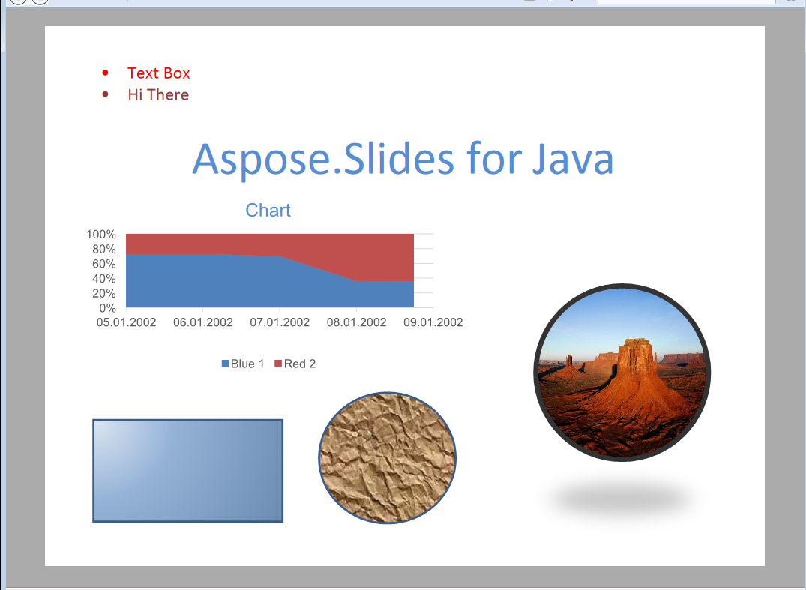

{} 

[XML पार्सर स्पेसिफिकेशन](https://en.wikipedia.org/wiki/Open_XML_Paper_Specification) एक पेज विवरण भाषा और एक निश्चित-डॉक्यूमेंट फ़ॉर्मेट है जिसे मूल रूप से माइक्रोसॉफ्ट द्वारा विकसित किया गया था। PDF की तरह, XPS को दस्तावेज़ की फ़िडेलिटी को सुरक्षित रखने और डिवाइस-स्वतंत्र दस्तावेज़ उपस्थिति प्रदान करने के लिए डिज़ाइन किया गया है। 

{} 

## **PHP के जरिए Java में Aspose.Slides में XPS**
Aspose.Slides for PHP via Java द्वारा लोड किया जा सकने वाला कोई भी प्रस्तुति दस्तावेज़ XPS फ़ॉर्मैट में परिवर्तित किया जा सकता है। Aspose.Slides for PHP via Java उच्च-फ़िडेलिटी पेज लेआउट और रेंडरिंग इंजन का उपयोग करके निश्चित-लेआउट XPS दस्तावेज़ फ़ॉर्मेट में आउटपुट उत्पन्न करता है।
आप Aspose.Slides for PHP via Java के माध्यम से प्रस्तुति दस्तावेज़ों को XPS दस्तावेज़ों में निर्यात करने के बारे में [XPS में रूपांतरण](https://docs.aspose.com/slides/hi/php-java/convert-powerpoint-to-xps/) में जान सकते हैं।

**इनपुट प्रस्तुति** 

**XPS में परिवर्तित प्रस्तुति** 

