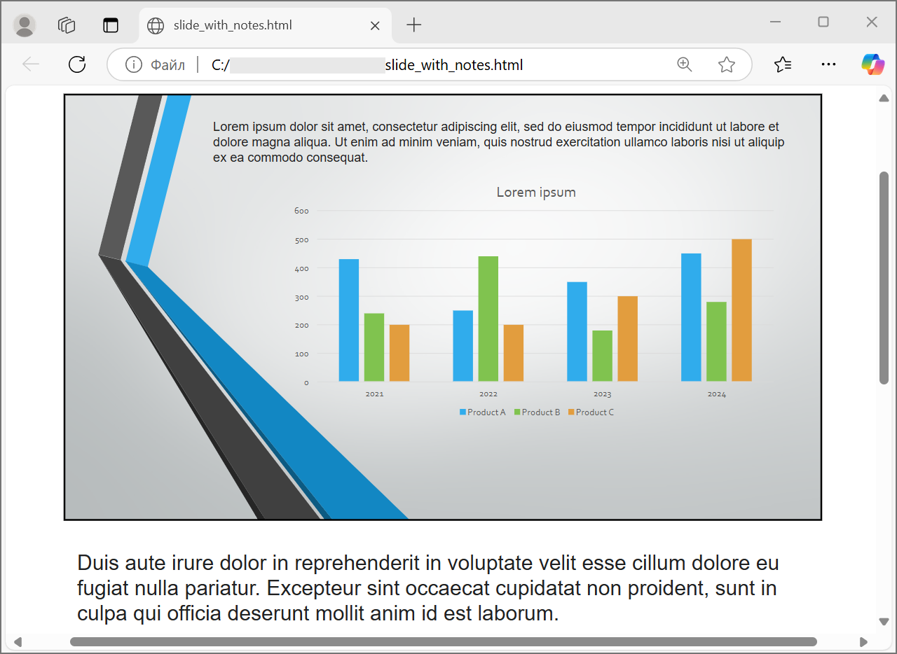

## **अवलोकन**

Aspose.Slides for Python via Java Microsoft PowerPoint के बिना PowerPoint प्रस्तुतियों को HTML के रूप में सहेज सकता है। बुनियादी रूपांतरण एकल [Presentation](https://reference.aspose.com/slides/hi/python-java/aspose.slides/presentation/) लोड और एक [save](https://reference.aspose.com/slides/hi/python-java/aspose.slides/presentation/#save) कॉल है जिसमें [SaveFormat](https://reference.aspose.com/slides/hi/python-java/aspose.slides/saveformat/) उपयोग किया जाता है। जब आपको निर्यातित लेआउट, फॉन्ट, छवियाँ, नोट्स, टिप्पणियाँ, SVG आउटपुट, या लिंक किए गए संसाधनों को नियंत्रित करने की आवश्यकता हो तो [HtmlOptions](https://reference.aspose.com/slides/hi/python-java/aspose.slides/htmloptions/) का उपयोग करें।

यह मार्गदर्शिका व्यावहारिक HTML निर्यात परिदृश्यों पर केंद्रित है:

- पूरी प्रस्तुति या चयनित स्लाइड्स निर्यात करें।
- स्थिर‑लेआउट, रिस्पॉन्सिव, या SVG‑आधारित HTML उत्पन्न करें।
- स्पीकर नोट्स और टिप्पणियाँ शामिल करें।
- छवि गुणवत्ता और क्रॉप की गई छवि डेटा को नियंत्रित करें।
- फ़ॉन्ट एम्बेड करें या फ़ॉन्ट फ़ाइलों को अलग से सहेजें।
- बाहरी संसाधनों और मीडिया फ़ाइलों को कैसे लिखा और संदर्भित किया जाए, चुनें।

डिफ़ॉल्ट रूप से, HTML निर्यात अधिकांश संसाधनों को एम्बेड करके एक स्वयं‑समाहित HTML दस्तावेज़ बनाता है। यह एक फ़ाइल साझा करने के लिए सुविधाजनक है, लेकिन आउटपुट आकार बढ़ा सकता है। वेब प्रकाशन के लिए बाहरी संसाधनों, कम इमेज DPI, और केवल उन फ़ॉन्ट्स को एम्बेड करने पर विचार करें जो लक्ष्य वातावरण में भरोसेमंद रूप से उपलब्ध नहीं हैं।

## **एक प्रस्तुति को HTML में बदलें**

एक प्रस्तुति को HTML में निर्यात करने के लिए, उसे [Presentation](https://reference.aspose.com/slides/hi/python-java/aspose.slides/presentation/) से लोड करें और [SaveFormat.Html](https://reference.aspose.com/slides/hi/python-java/aspose.slides/saveformat/#Html) के साथ सहेजें।

```python
import jpype
import asposeslides

if not jpype.isJVMStarted():
    jpype.startJVM()

from asposeslides.api import Presentation, SaveFormat

presentation = Presentation("presentation.pptx")
try:
    presentation.save("presentation.html", SaveFormat.Html)
finally:
    presentation.dispose()
```

प्रत्येक उदाहरण वर्तमान कार्यशील निर्देशिका से `presentation.pptx` लोड करता है। इसे चलाने से पहले Aspose.Slides for Python via Java और संगत Java रनटाइम स्थापित करें। JVM प्रत्येक Python प्रक्रिया के लिए एक बार शुरू होता है।

यह उदाहरण एक HTML फ़ाइल लिखता है। प्रस्तुति ऑब्जेक्ट को `finally` ब्लॉक में डिस्पोज़ किया जाता है, जिससे निर्यात के बाद फ़ाइल हैंडल और रेंडरिंग संसाधन मुक्त हो जाते हैं।

## **HTML निर्यात को कॉन्फ़िगर करें**

[HtmlOptions](https://reference.aspose.com/slides/hi/python-java/aspose.slides/htmloptions/) HTML निर्यात के लिए मुख्य कॉन्फ़िगरेशन क्लास है। सामान्य सेटिंग्स शामिल हैं:

- [setSlidesLayoutOptions](https://reference.aspose.com/slides/hi/python-java/aspose.slides/htmloptions/#setSlidesLayoutOptions): नोट्स, टिप्पणियाँ, हैंडआउट्स, या अन्य लेआउट जानकारी जोड़ता है।
- [setHtmlFormatter](https://reference.aspose.com/slides/hi/python-java/aspose.slides/htmloptions/#setHtmlFormatter): HTML दस्तावेज़ संरचना बदलता है या फॉर्मेटिंग को किसी कंट्रोलर को डेलीगेट करता है।
- [setSlideImageFormat](https://reference.aspose.com/slides/hi/python-java/aspose.slides/htmloptions/#setSlideImageFormat): स्लाइड्स को कैसे प्रदर्शित किया जाएगा, उदाहरण के लिए SVG, बदलता है।
- [setPicturesCompression](https://reference.aspose.com/slides/hi/python-java/aspose.slides/htmloptions/#setPicturesCompression): इमेज DPI और आउटपुट आकार को नियंत्रित करता है।
- [setDeletePicturesCroppedAreas](https://reference.aspose.com/slides/hi/python-java/aspose.slides/htmloptions/#setDeletePicturesCroppedAreas): क्रॉप किए गए इमेज डेटा को रखता या हटाता है।
- [setSvgResponsiveLayout](https://reference.aspose.com/slides/hi/python-java/aspose.slides/htmloptions/#setSvgResponsiveLayout): निर्यातित SVG सामग्री को उसके कंटेनर के अनुसार अनुकूल बनाता है।
- [setShowHiddenSlides](https://reference.aspose.com/slides/hi/python-java/aspose.slides/htmloptions/#setShowHiddenSlides): आवश्यकता पड़ने पर छिपी स्लाइड्स को शामिल करता है।

निचे के अनुभाग सबसे सामान्य विकल्पों को अलग‑अलग दिखाते हैं ताकि आप केवल उन विकल्पों को संयोजित कर सकें जिनकी आपके कार्य‑प्रवाह को आवश्यकता है।

## **चयनित स्लाइड्स को HTML में बदलें**

स्लाइड नंबर स्वीकार करने वाले [Presentation.save](https://reference.aspose.com/slides/hi/python-java/aspose.slides/presentation/#save) ओवरलोड में 1‑आधारित स्लाइड पोज़िशन का प्रयोग होता है। नीचे दिया गया लूप प्रत्येक स्लाइड को अलग HTML फ़ाइल में सहेजता है।

```python
import jpype
import asposeslides

if not jpype.isJVMStarted():
    jpype.startJVM()

from asposeslides.api import Presentation, SaveFormat

presentation = Presentation("presentation.pptx")
try:
    slide_count = presentation.getSlides().size()
    for slide_index in range(slide_count):
        slide_number = slide_index + 1
        slide_numbers = jpype.JArray(jpype.JInt)([slide_number])
        html_file_name = f"slide-{slide_number}.html"
        presentation.save(html_file_name, slide_numbers, SaveFormat.Html)
finally:
    presentation.dispose()
```

जब एक वेबसाइट या अनुप्रयोग को प्रत्येक स्लाइड के लिए एक HTML पेज चाहिए तब इस पैटर्न का उपयोग करें। यदि प्रत्येक स्लाइड का लेआउट समान होना चाहिए, तो एक [HtmlOptions](https://reference.aspose.com/slides/hi/python-java/aspose.slides/htmloptions/) इंस्टेंस बनाएँ और उसे प्रत्येक [Presentation.save](https://reference.aspose.com/slides/hi/python-java/aspose.slides/presentation/#save) कॉल में पास करें।

## **रिस्पॉन्सिव HTML बनाएं**

[ResponsiveHtmlController](https://reference.aspose.com/slides/hi/python-java/aspose.slides/responsivehtmlcontroller/) [HtmlFormatter](https://reference.aspose.com/slides/hi/python-java/aspose.slides/htmlformatter/) के माध्यम से रिस्पॉन्सिव HTML आउटपुट प्रदान करता है। जब निर्यातित पेज को ब्राउज़र की चौड़ाई के अनुसार बेहतर अनुकूल बनाना हो तब इसका उपयोग करें।

```python
import jpype
import asposeslides

if not jpype.isJVMStarted():
    jpype.startJVM()

from asposeslides.api import HtmlFormatter, HtmlOptions, Presentation, ResponsiveHtmlController, SaveFormat

presentation = Presentation("presentation.pptx")
try:
    controller = ResponsiveHtmlController()
    formatter = HtmlFormatter.createCustomFormatter(controller)

    html_options = HtmlOptions()
    html_options.setHtmlFormatter(formatter)

    presentation.save("presentation-responsive.html", SaveFormat.Html, html_options)
finally:
    presentation.dispose()
```

SVG‑आधारित रिस्पॉन्सिव लेआउट के लिए, `True` के साथ [HtmlOptions.setSvgResponsiveLayout](https://reference.aspose.com/slides/hi/python-java/aspose.slides/htmloptions/#setSvgResponsiveLayout) को कॉल करें। यह तब उपयोगी होता है जब स्लाइड सामग्री को स्केलेबल SVG मार्कअप के रूप में निर्यात किया गया हो।

```python
import jpype
import asposeslides

if not jpype.isJVMStarted():
    jpype.startJVM()

from asposeslides.api import HtmlOptions, Presentation, SaveFormat

presentation = Presentation("presentation.pptx")
try:
    html_options = HtmlOptions()
    html_options.setSvgResponsiveLayout(True)

    presentation.save("presentation-svg-responsive.html", SaveFormat.Html, html_options)
finally:
    presentation.dispose()
```

## **स्पीकर नोट्स और टिप्पणी शामिल करें**

स्पीकर नोट्स या टिप्पणी शामिल करने के लिए [HtmlOptions.setSlidesLayoutOptions](https://reference.aspose.com/slides/hi/python-java/aspose.slides/htmloptions/#setSlidesLayoutOptions) के माध्यम से [NotesCommentsLayoutingOptions](https://reference.aspose.com/slides/hi/python-java/aspose.slides/notescommentslayoutingoptions/) का प्रयोग करें। डिफ़ॉल्ट रूप से नोट्स और टिप्पणियाँ छिपी रहती हैं जब तक आप उनकी स्थितियों को नहीं चुनते।

मान लें कि स्रोत प्रस्तुति में स्पीकर नोट्स हैं:


निम्न कोड स्लाइड सामग्री को स्लाइड के नीचे स्पीकर नोट्स के साथ निर्यात करता है।

```python
import jpype
import asposeslides

if not jpype.isJVMStarted():
    jpype.startJVM()

from asposeslides.api import HtmlOptions, NotesCommentsLayoutingOptions, NotesPositions, Presentation, SaveFormat

presentation = Presentation("presentation.pptx")
try:
    layout_options = NotesCommentsLayoutingOptions()
    layout_options.setNotesPosition(NotesPositions.BottomFull)

    html_options = HtmlOptions()
    html_options.setSlidesLayoutOptions(layout_options)

    presentation.save("presentation-with-notes.html", SaveFormat.Html, html_options)
finally:
    presentation.dispose()
```

निर्यातित HTML में नोट्स क्षेत्र शामिल होगा:



टिप्पणियाँ निर्यात करने के लिए, उदाहरण के लिए [CommentsPositions.Right](https://reference.aspose.com/slides/hi/python-java/aspose.slides/commentspositions/#Right) या [CommentsPositions.Bottom](https://reference.aspose.com/slides/hi/python-java/aspose.slides/commentspositions/#Bottom) के साथ [NotesCommentsLayoutingOptions.setCommentsPosition](https://reference.aspose.com/slides/hi/python-java/aspose.slides/notescommentslayoutingoptions/#setCommentsPosition) को कॉल करें। यदि आपको केवल टिप्पणियाँ चाहिए तो [NotesCommentsLayoutingOptions.setNotesPosition](https://reference.aspose.com/slides/hi/python-java/aspose.slides/notescommentslayoutingoptions/#setNotesPosition) को छोड़ दें। यदि आपको दोनों नोट्स और टिप्पणियाँ चाहिए तो दोनों मेथड को कॉल करें।

## **छवि गुणवत्ता और क्रॉप किए गए क्षेत्रों को नियंत्रित करें**

HTML निर्यात स्लाइड इमेज को संकुचित करके आउटपुट आकार कम कर सकता है। जब आपको उच्च छवि गुणवत्ता चाहिए तो [PicturesCompression](https://reference.aspose.com/slides/hi/python-java/aspose.slides/ppicturescompression/) से एक मान को [HtmlOptions.setPicturesCompression](https://reference.aspose.com/slides/hi/python-java/aspose.slides/htmloptions/#setPicturesCompression) को पास करें।

```python
import jpype
import asposeslides

if not jpype.isJVMStarted():
    jpype.startJVM()

from asposeslides.api import HtmlOptions, PicturesCompression, Presentation, SaveFormat

presentation = Presentation("presentation.pptx")
try:
    html_options = HtmlOptions()
    html_options.setPicturesCompression(PicturesCompression.Dpi150)

    presentation.save("presentation-dpi-150.html", SaveFormat.Html, html_options)
finally:
    presentation.dispose()
```

डिफ़ॉल्ट रूप से, इमेज के क्रॉप किए गए क्षेत्रों को निर्यातित आउटपुट से हटा दिया जा सकता है। क्रॉप डेटा केवल तभी रखें जब उपयोगकर्ताओं को उन छिपे हुए भागों को पुनः प्राप्त या निरीक्षण करने की आवश्यकता हो। इसे रखने से HTML आकार बढ़ सकता है।

```python
import jpype
import asposeslides

if not jpype.isJVMStarted():
    jpype.startJVM()

from asposeslides.api import HtmlOptions, Presentation, SaveFormat

presentation = Presentation("presentation.pptx")
try:
    html_options = HtmlOptions()
    html_options.setDeletePicturesCroppedAreas(False)

    presentation.save("presentation-with-cropped-areas.html", SaveFormat.Html, html_options)
finally:
    presentation.dispose()
```

## **CSS जोड़ें**

सरल स्टाइलिंग के लिए, एक CSS स्ट्रिंग को [HtmlFormatter.createDocumentFormatter](https://reference.aspose.com/slides/hi/python-java/aspose.slides/htmlformatter/#createDocumentFormatter) को पास करें। यह आसपास के HTML दस्तावेज़ को बदलता है जबकि Aspose.Slides स्लाइड सामग्री को रेंडर करता रहता है।

```python
import jpype
import asposeslides

if not jpype.isJVMStarted():
    jpype.startJVM()

from asposeslides.api import HtmlFormatter, HtmlOptions, Presentation, SaveFormat

presentation = Presentation("presentation.pptx")
try:
    css_rules = "body { margin: 0; background: #f7f7f7; } .slide { margin: 24px auto; }"
    formatter = HtmlFormatter.createDocumentFormatter(css_rules, True)

    html_options = HtmlOptions()
    html_options.setHtmlFormatter(formatter)

    presentation.save("presentation-styled.html", SaveFormat.Html, html_options)
finally:
    presentation.dispose()
```

कस्टम दस्तावेज़ हेडर, लिंक्ड CSS फ़ाइल, या स्लाइड्स और शैप्स के चारों ओर कस्टम मार्कअप के लिए, JPype इंटरफ़ेस प्रोक्सी के माध्यम से एक कस्टम फ़ॉर्मेटिंग कंट्रोलर का उपयोग करें और उसे [HtmlFormatter.createCustomFormatter](https://reference.aspose.com/slides/hi/python-java/aspose.slides/htmlformatter/#createCustomFormatter) के साथ [HtmlFormatter](https://reference.aspose.com/slides/hi/python-java/aspose.slides/htmlformatter/) को पास करें।

## **फ़ॉन्ट एम्बेड करें**

यदि लक्ष्य वातावरण में प्रस्तुति के फ़ॉन्ट नहीं स्थापित हो सकते हैं, तो [EmbedAllFontsHtmlController](https://reference.aspose.com/slides/hi/python-java/aspose.slides/embedallfontshtmlcontroller/) के साथ HTML में फ़ॉन्ट एम्बेड करें। एम्बेडिंग दृश्य शुद्धता को बढ़ाता है लेकिन आउटपुट आकार बढ़ा देता है।

```python
import jpype
import asposeslides

if not jpype.isJVMStarted():
    jpype.startJVM()

from asposeslides.api import EmbedAllFontsHtmlController, HtmlFormatter, HtmlOptions, Presentation, SaveFormat

presentation = Presentation("presentation.pptx")
try:
    font_names_to_exclude = jpype.JArray(jpype.JString)(["Arial"])
    font_controller = EmbedAllFontsHtmlController(font_names_to_exclude)
    formatter = HtmlFormatter.createCustomFormatter(font_controller)

    html_options = HtmlOptions()
    html_options.setHtmlFormatter(formatter)

    presentation.save("presentation-embedded-fonts.html", SaveFormat.Html, html_options)
finally:
    presentation.dispose()
```

केवळ तब फ़ॉन्ट को बाहर रखें जब आपको भरोसा हो कि लक्ष्य ब्राउज़र या सिस्टम पहले से ही उन्हें उपलब्ध कराते हैं। ब्रांड फ़ॉन्ट या कम सामान्य फ़ॉन्ट के लिए एम्बेडिंग आमतौर पर सुरक्षित रहता है।

## **संसाधनों को बाहरी रूप से सहेजें**

स्वयं‑समाहित HTML को ले जाना आसान है, लेकिन एम्बेडेड Base64 संसाधन फ़ाइल को बड़ा बना सकते हैं। यदि आपका अनुप्रयोग बाहरी इमेज फ़ाइलों की आवश्यकता रखता है, तो JPype इंटरफ़ेस प्रोक्सी के माध्यम से एक रिसोर्स‑लिंकिंग कंट्रोलर लागू करें और इसे [HtmlOptions](https://reference.aspose.com/slides/hi/python-java/aspose.slides/htmloptions/) कन्स्ट्रक्टर में पास करें।

जब आप संसाधनों को बाहरी बनाते हैं, तो दो पाथ को जानबूझकर चुनें:

- फ़ाइल सिस्टम आउटपुट पथ, जहाँ आपका अनुप्रयोग उत्पन्न इमेज, फ़ॉन्ट, ऑडियो, या वीडियो लिखता है।
- URL पथ, जो ब्राउज़र HTML दस्तावेज़ से उन फ़ाइलों को लोड करने के लिए उपयोग करता है।

## **मीडिया फ़ाइलें निर्यात करें**

[VideoPlayerHtmlController](https://reference.aspose.com/slides/hi/python-java/aspose.slides/videoplayerhtmlcontroller/) वीडियो और ऑडियो फ़ाइलें निर्यात करता है और HTML लिखता है जो ब्राउज़र में उन्हें चलाने में सक्षम है। इसका कन्स्ट्रक्टर निम्नलिखित लेता है:

- `path`: वह डायरेक्टरी जहाँ उत्पन्न मीडिया फ़ाइलें लिखी जाएँगी।
- `fileName`: उत्पन्न हो रहा HTML फ़ाइल नाम।
- `baseUri`: HTML लिंक में मीडिया फ़ाइलों के लिए उपयोग किया गया абсолют URI उपसर्ग।

निम्न उदाहरण `presentation.pptx` में पहले से एम्बेडेड मीडिया निर्यात करता है। उत्पन्न HTML केवल फ़ाइल नाम द्वारा मीडिया फ़ाइलों को संदर्भित करता है, जो HTML दस्तावेज़ के सापेक्ष है, इसलिए `path` को उस डायरेक्टरी होना चाहिए जहाँ HTML फ़ाइल भी लिखी जाती है। `baseUri` को एक абсолют URI होना चाहिए: स्थानीय प्रीव्यू के लिए आउटपुट डायरेक्टरी से `file:///` URI बनाएँ; डिप्लॉयड अनुप्रयोग के लिए प्रकाशित डायरेक्टरी का पूर्ण URL उपयोग करें।

```python
import jpype
import asposeslides

if not jpype.isJVMStarted():
    jpype.startJVM()

from asposeslides.api import HtmlFormatter, HtmlOptions, Presentation, SVGOptions, SaveFormat, SlideImageFormat, VideoPlayerHtmlController

from pathlib import Path

output_directory = Path("html-output").resolve()
output_directory.mkdir(parents=True, exist_ok=True)
html_file_name = "presentation.html"
media_base_uri = output_directory.as_uri() + "/"

presentation = Presentation("presentation.pptx")
try:
    controller = VideoPlayerHtmlController(str(output_directory), html_file_name, media_base_uri)
    formatter = HtmlFormatter.createCustomFormatter(controller)
    svg_options = SVGOptions(controller)
    slide_image_format = SlideImageFormat.svg(svg_options)

    html_options = HtmlOptions(controller)
    html_options.setHtmlFormatter(formatter)
    html_options.setSlideImageFormat(slide_image_format)

    html_file_path = output_directory / html_file_name
    presentation.save(str(html_file_path), SaveFormat.Html, html_options)
finally:
    presentation.dispose()
```

ऐसे आउटपुट डायरेक्टरी उपयोग करें जो प्रत्येक निर्यात कार्य के लिए अद्वितीय हों, विशेषकर सर्वर अनुप्रयोगों में। साझा आउटपुट पाथ विभिन्न रूपांतरणों की फ़ाइलों को एक‑दूसरे के ऊपर लिखने का कारण बन सकते हैं।

## **प्रदर्शन और संसाधन प्रबंधन**

HTML रूपांतरण एक रेंडरिंग ऑपरेशन है, इसलिए प्रोसेसिंग समय और मेमोरी उपयोग स्लाइड संख्या, इमेज रिज़ॉल्यूशन, फ़ॉन्ट, इफ़ेक्ट, चार्ट और एम्बेडेड मीडिया पर निर्भर करता है। उच्च इमेज DPI मानों को [HtmlOptions.setPicturesCompression](https://reference.aspose.com/slides/hi/python-java/aspose.slides/htmloptions/#setPicturesCompression) में पास करना, एम्बेडेड फ़ॉन्ट, SVG आउटपुट, और रखे गए क्रॉप किए गए इमेज एरिया फ़िडेलिटी बढ़ा सकते हैं लेकिन आमतौर पर आउटपुट आकार बढ़ाते हैं।

बैच रूपांतरण के लिए:

- प्रत्येक [Presentation](https://reference.aspose.com/slides/hi/python-java/aspose.slides/presentation/) इंस्टेंस को तुरंत डिस्पोज़ करें।
- अलग-अलग कार्यों के लिए अलग आउटपुट डायरेक्टरी का उपयोग करें।
- जब तक फ़िडेलिटी की जरूरत न हो सामान्य फ़ॉन्ट को एम्बेड करने से बचें।
- जब HTML प्रीव्यू या थंबनेल के लिए हो तो इमेज DPI कम रखें।
- डिप्लॉयमेंट पाथ अंतिम होने तक स्रोत प्रस्तुति, उत्पन्न HTML, और बाहरी संसाधनों को एक साथ रखें।

## **अक्सर पूछे जाने वाले प्रश्न**

**क्या हाइपरलिंक HTML आउटपुट में संरक्षित रहते हैं?**  
हाँ। प्रस्तुति के हाइपरलिंक HTML में निर्यात होते हैं और लक्ष्य URL वैध होने पर क्लिक करने योग्य रहते हैं।

**क्या मैं प्रस्तुतियों को समानांतर में HTML में बदल सकता हूँ?**  
हाँ, लेकिन एक ही [Presentation](https://reference.aspose.com/slides/hi/python-java/aspose.slides/presentation/) इंस्टेंस को थ्रेड्स के बीच साझा न करें। अलग फ़ाइलों को अलग‑अलग प्रस्तुति इंस्टेंस, अलग स्ट्रीम और अलग आउटपुट डायरेक्टरी के साथ प्रोसेस करें। विवरण के लिए [multithreading guidance](/slides/hi/python-java/multithreading/) देखें।

**क्या प्रस्तुति ऑब्जेक्ट थ्रेड‑सेफ़ है?**  
नहीं। एक एकल [Presentation](https://reference.aspose.com/slides/hi/python-java/aspose.slides/presentation/) इंस्टेंस को केवल एक थ्रेड पर लोड, संशोधित, सहेज और डिस्पोज़ किया जाना चाहिए। समानांतर कार्य के लिए प्रत्येक थ्रेड या प्रोसेस के लिए स्वतंत्र इंस्टेंस बनाएं।

**जेनरेटेड HTML फ़ाइल बड़ी क्यों है?**  
डिफ़ॉल्ट निर्यात संसाधनों को सीधे HTML में एम्बेड करता है। एम्बेडेड फ़ॉन्ट, हाई‑DPI इमेज, मीडिया, SVG कंटेंट, और रखे गए क्रॉप किए गए इमेज एरिया भी आकार बढ़ाते हैं। आकार घटाने के लिए बाहरी संसाधनों का उपयोग करें, सामान्य फ़ॉन्ट को एम्बेड करने से बचें, और जब अधिकतम फ़िडेलिटी की तुलना में आकार अधिक महत्व रखता हो तो [HtmlOptions.setPicturesCompression](https://reference.aspose.com/slides/hi/python-java/aspose.slides/htmloptions/#setPicturesCompression) को कम DPI मान के साथ पास करें।

**HTML में फ़ॉन्ट‑साइज़ मान PowerPoint मानों से अलग क्यों हो सकते हैं?**  
निर्यातित पेज SVG कोऑर्डिनेट सिस्टम और स्केलिंग ट्रांसफ़ॉर्म का उपयोग कर सकता है। केवल एक रॉ CSS या SVG फ़ॉन्ट‑साइज़ मान अंतिम प्रदर्शित आकार को वर्णित नहीं करता। इच्छित ज़ूम लेवल पर रेंडर्ड स्लाइड की तुलना करें, और यदि टेक्स्ट अलग दिखता है तो फ़ॉन्ट उपलब्धता जांचें।

**मीडिया निर्यात के लिए baseUri कैसे चुनें?**  
baseUri को ब्राउज़र के दृष्टिकोण से चुनें और उसे एक पूर्ण URI के रूप में पास करें। स्थानीय प्रीव्यू के लिए आप इसे आउटपुट डायरेक्टरी से `output_directory.as_uri() + "/"` द्वारा बना सकते हैं। डिप्लॉयमेंट के लिए प्रकाशित डायरेक्टरी के पूर्ण URL का उपयोग करें। फ़ाइल‑सिस्टम `path` और ब्राउज़र `baseUri` समान स्ट्रिंग नहीं होने चाहिए, लेकिन दोनों को उसी स्थान का वर्णन करना चाहिए, और वह स्थान वह डायरेक्टरी होनी चाहिए जहाँ उत्पन्न HTML फ़ाइल रखी जाती है क्योंकि मीडिया लिंक उसके सापेक्ष लिखे जाते हैं।

**क्या मैं छिपी स्लाइड्स को शामिल कर सकता हूँ?**  
हाँ। जब छिपी स्लाइड्स को निर्यात करना आवश्यक हो तो [HtmlOptions.setShowHiddenSlides](https://reference.aspose.com/slides/hi/python-java/aspose.slides/htmloptions/#setShowHiddenSlides) को `True` के साथ कॉल करें।