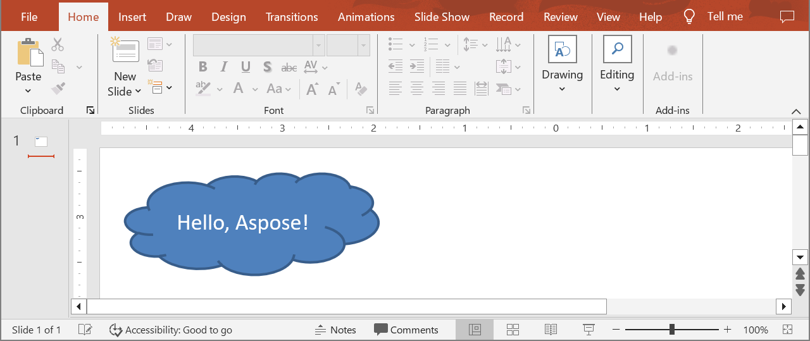

## **समीक्षा**

यह लेख दर्शाता है कि Aspose.Slides for Python via Java का उपयोग करके प्रेजेंटेशन कैसे बनाएं, पहली स्लाइड में टेक्स्ट वाला आकार जोड़ें, और परिणाम को PPTX फ़ाइल के रूप में सहेजें। FAQ में आउटपुट फ़ॉर्मेट, टेम्पलेट, स्लाइड साइज, मेमोरी उपयोग, थ्रेडिंग, लाइसेंसिंग, डिजिटल सिग्नेचर, और VBA समर्थन के बारे में जानकारी दी गई है।

## **प्रेजेंटेशन बनाएं**

Aspose.Slides for Python via Java में शून्य से PowerPoint फ़ाइल बनाना उतना ही सीधे है जितना कि [Presentation](https://reference.aspose.com/slides/hi/python-java/aspose.slides/presentation/) क्लास का उदाहरण बनाना। कन्स्ट्रक्टर स्वचालित रूप से एक खाली डेक एक ही स्लाइड के साथ प्रदान करता है, जो आपको आकार, टेक्स्ट, चार्ट, या आपके एप्लिकेशन की आवश्यकता वाले किसी भी सामग्री के लिए तत्काल कैनवास देता है। एक बार जब आप उस स्लाइड को संशोधित कर लेते हैं—या नई स्लाइड जोड़ते हैं—तो आप परिणाम को PPTX, लेगेसी PPT या यहाँ तक कि OpenDocument फ़ॉर्मेट में सहेज सकते हैं। नीचे दिया गया छोटा कोड नमूना इस कार्यप्रवाह को दर्शाता है जिसमें पहली स्लाइड पर एक साधारण आकार जोड़ा गया है।

1. [Presentation](https://reference.aspose.com/slides/hi/python-java/aspose.slides/presentation/) क्लास का एक इंस्टेंस बनाएं।
2. इंडेक्स द्वारा पहली स्लाइड प्राप्त करें।
3. [AutoShape](https://reference.aspose.com/slides/hi/python-java/aspose.slides/autoshape/) प्रकार [ShapeType.Cloud](https://reference.aspose.com/slides/hi/python-java/aspose.slides/shapetype/#Cloud) को [ShapeCollection.addAutoShape](https://reference.aspose.com/slides/hi/python-java/aspose.slides/shapecollection/#addAutoShape) का उपयोग करके जोड़ें।
4. [TextFrame.setText](https://reference.aspose.com/slides/hi/python-java/aspose.slides/textframe/#setText) का उपयोग करके आकार का टेक्स्ट सेट करें।
5. [Presentation.save](https://reference.aspose.com/slides/hi/python-java/aspose.slides/presentation/#save) के साथ [SaveFormat.Pptx](https://reference.aspose.com/slides/hi/python-java/aspose.slides/saveformat/#Pptx) का उपयोग करके प्रेजेंटेशन सहेजें।

निम्न उदाहरण के लिए Aspose.Slides for Python via Java और एक उपयुक्त Java रनटाइम आवश्यक है। यह JVM को शुरू करता है यदि वह पहले से नहीं चल रहा है, पहली स्लाइड पर क्लाउड आकार जोड़ता है, और प्रेजेंटेशन सहेजता है:

```python
import jpype
import asposeslides

if not jpype.isJVMStarted():
    jpype.startJVM()

from asposeslides.api import Presentation, SaveFormat, ShapeType

# एक खाली स्लाइड के साथ प्रेज़ेंटेशन बनाएं।
presentation = Presentation()
try:
    # पहली स्लाइड प्राप्त करें।
    slide = presentation.getSlides().get_Item(0)

    # क्लाउड आकार जोड़ें और उसका टेक्स्ट सेट करें।
    auto_shape = slide.getShapes().addAutoShape(ShapeType.Cloud, 20, 20, 200, 80)
    auto_shape.getTextFrame().setText("Hello, Aspose!")

    # प्रेज़ेंटेशन को PPTX फ़ाइल के रूप में सहेजें।
    presentation.save("new_presentation.pptx", SaveFormat.Pptx)
finally:
    presentation.dispose()
```

परिणाम:



## **अक्सर पूछे जाने वाले प्रश्न**

**मैं नई प्रेजेंटेशन को किन फ़ॉर्मेट में सहेज सकता हूँ?**

आप इन फ़ॉर्मेट में सहेज सकते हैं: [PPTX, PPT, and ODP](/slides/hi/python-java/save-presentation/), तथा निर्यात कर सकते हैं: [PDF](/slides/hi/python-java/convert-powerpoint-to-pdf/), [XPS](/slides/hi/python-java/convert-powerpoint-to-xps/), [HTML](/slides/hi/python-java/convert-powerpoint-to-html/), [SVG](/slides/hi/python-java/render-slide-as-svg/), और [images](/slides/hi/python-java/convert-powerpoint-to-png/), आदि।

**क्या मैं टेम्प्लेट (POTX/POTM) से शुरू करके सामान्य PPTX के रूप में सहेज सकता हूँ?**

हाँ। टेम्प्लेट लोड करें और इच्छित फ़ॉर्मेट में सहेजें; POTX/POTM/PPTM और समान फ़ॉर्मेट [समर्थित](/slides/hi/python-java/supported-file-formats/) हैं।

**प्रेजेंटेशन बनाते समय स्लाइड का आकार/आस्पेक्ट रेशियो कैसे नियंत्रित करूँ?**

[स्लाइड साइज](/slides/hi/python-java/slide-size/) सेट करें (जैसे 4:3, 16:9 या कस्टम डाइमेंशन) और तय करें कि सामग्री कैसे स्केल होनी चाहिए।

**आकार और निर्देशांक किस इकाई में मापे जाते हैं?**

पॉइंट्स में: 1 इंच बराबर 72 इकाइयों के।

**बहुत बड़ी प्रेजेंटेशन (कई मीडिया फ़ाइलों के साथ) को मेमोरी उपयोग कम करने के लिए कैसे संभालूँ?**

[BLOB management strategies](/slides/hi/python-java/manage-blob/) का उपयोग करें, अस्थायी फ़ाइलों के माध्यम से इन‑मैमारी स्टोरेज को सीमित करें, और शुद्ध इन‑मैमारी स्ट्रीम की बजाय फ़ाइल‑आधारित वर्कफ़्लो को प्राथमिकता दें।

**क्या मैं प्रेजेंटेशन को समानांतर में बनाना/सहेजना कर सकता हूँ?**

आप एक ही [Presentation](https://reference.aspose.com/slides/hi/python-java/aspose.slides/presentation/) इंस्टेंस को [multiple threads](/slides/hi/python-java/multithreading/) से संचालित नहीं कर सकते। प्रत्येक थ्रेड या प्रोसेस के लिए अलग-अलग, अलग‑थलग इंस्टेंस चलाएँ।

**ट्रायल वॉटरमार्क और सीमाओं को कैसे हटाऊँ?**

प्रति प्रोसेस एक बार [लाइसेंस लागू](/slides/hi/python-java/licensing/) करें। लाइसेंस XML को अपरिवर्तित रखना आवश्यक है, और कई थ्रेड शामिल होने पर लाइसेंस सेटअप को समकालिक करना चाहिए।

**क्या मैं बनाई गई PPTX को डिजिटल रूप से साइन कर सकता हूँ?**

हाँ। [डिजिटल सिग्नेचर](/slides/hi/python-java/digital-signature-in-powerpoint/) (जोड़ना और वेरिफ़ाई करना) प्रेजेंटेशन के लिए समर्थित हैं।

**क्या बनाए गए प्रेजेंटेशन में मैक्रो (VBA) समर्थित हैं?**

हाँ। आप [VBA प्रोजेक्ट बनाएँ/एडिट करें](/slides/hi/python-java/presentation-via-vba/) और PPTM/PPSM जैसी मैक्रो‑सक्षम फ़ाइलें सहेज सकते हैं।