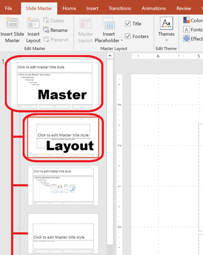

यह लेख उदाहरण प्रदान करता है जो दिखाते हैं कि कैसे स्लाइड को जोड़ना, एक्सेस करना, क्लोन करना, पुनः क्रमबद्ध करना, और हटाना है **Aspose.Slides for Python via Java** का उपयोग करके।

पैकेज को जैसा वर्णित है वैसा स्थापित करें [Installation](/slides/hi/python-java/installation/). प्रत्येक उदाहरण `asposeslides` को JVM शुरू करने से पहले इम्पोर्ट करता है, उसके बाद JVM चलने के बाद API को इम्पोर्ट करता है।

## **स्लाइड जोड़ें**

नया स्लाइड जोड़ने के लिए, पहले एक लेआउट चुनें। यह उदाहरण एक खाली लेआउट का उपयोग करता है ताकि प्रस्तुति में एक खाली स्लाइड जोड़ी जा सके।

```python
import jpype
import asposeslides

if not jpype.isJVMStarted():
    jpype.startJVM()

from asposeslides.api import Presentation, SlideLayoutType

presentation = Presentation()
try:
    blank_layout = presentation.getLayoutSlides().getByType(SlideLayoutType.Blank)

    presentation.getSlides().addEmptySlide(blank_layout)
finally:
    presentation.dispose()
```

{}
प्रत्येक स्लाइड लेआउट एक मास्टर स्लाइड से व्युत्पन्न होता है, जो समग्र डिज़ाइन और प्लेसहोल्डर संरचना को परिभाषित करता है। नीचे की छवि दर्शाती है कि PowerPoint में मास्टर स्लाइड और उनके संबद्ध लेआउट कैसे व्यवस्थित होते हैं।
{}



## **इंडेक्स द्वारा स्लाइड्स तक पहुँचें**

स्लाइड्स को उनके शून्य-आधारित इंडेक्स का उपयोग करके एक्सेस करें, या किसी रेफ़रेंस के आधार पर स्लाइड का इंडेक्स खोजें। यह विशेष स्लाइड्स को इटररेट करने या संशोधित करने के लिए उपयोगी है।

```python
import jpype
import asposeslides

if not jpype.isJVMStarted():
    jpype.startJVM()

from asposeslides.api import Presentation, SlideLayoutType

presentation = Presentation()
try:
    # एक और खाली स्लाइड जोड़ें।
    blank_layout = presentation.getLayoutSlides().getByType(SlideLayoutType.Blank)
    presentation.getSlides().addEmptySlide(blank_layout)

    # इंडेक्स द्वारा स्लाइड्स तक पहुँचें।
    first_slide = presentation.getSlides().get_Item(0)
    second_slide = presentation.getSlides().get_Item(1)

    # एक रेफ़रेंस से स्लाइड का इंडेक्स प्राप्त करें, फिर उसे इंडेक्स द्वारा एक्सेस करें।
    second_slide_index = presentation.getSlides().indexOf(second_slide)
    second_slide_by_index = presentation.getSlides().get_Item(second_slide_index)
finally:
    presentation.dispose()
```

## **स्लाइड को क्लोन करें**

मौजूदा स्लाइड को क्लोन करें। क्लोन किया गया स्लाइड स्वचालित रूप से स्लाइड संग्रह के अंत में जोड़ दिया जाता है।

```python
import jpype
import asposeslides

if not jpype.isJVMStarted():
    jpype.startJVM()

from asposeslides.api import Presentation

presentation = Presentation()
try:
    first_slide = presentation.getSlides().get_Item(0)

    cloned_slide = presentation.getSlides().addClone(first_slide)

    cloned_slide_index = presentation.getSlides().indexOf(cloned_slide)
finally:
    presentation.dispose()
```

## **स्लाइड्स को पुन: क्रमबद्ध करें**

स्लाइड्स का क्रम बदलें उन्हें नए इंडेक्स पर ले जाकर। यह उदाहरण क्लोन किए गए स्लाइड को पहली स्थिति में ले जाता है।

```python
import jpype
import asposeslides

if not jpype.isJVMStarted():
    jpype.startJVM()

from asposeslides.api import Presentation

presentation = Presentation()
try:
    first_slide = presentation.getSlides().get_Item(0)

    cloned_slide = presentation.getSlides().addClone(first_slide)

    presentation.getSlides().reorder(0, cloned_slide)
finally:
    presentation.dispose()
```

## **स्लाइड हटाएँ**

स्लाइड को उसकी रेफ़रेंस को स्लाइड संग्रह में पास करके हटाएँ। यह उदाहरण दूसरी स्लाइड जोड़ता है और फिर मूल स्लाइड को हटाता है, जिससे केवल नई स्लाइड बचती है।

```python
import jpype
import asposeslides

if not jpype.isJVMStarted():
    jpype.startJVM()

from asposeslides.api import Presentation, SlideLayoutType

presentation = Presentation()
try:
    blank_layout = presentation.getLayoutSlides().getByType(SlideLayoutType.Blank)
    second_slide = presentation.getSlides().addEmptySlide(blank_layout)

    first_slide = presentation.getSlides().get_Item(0)
    presentation.getSlides().remove(first_slide)
finally:
    presentation.dispose()
```