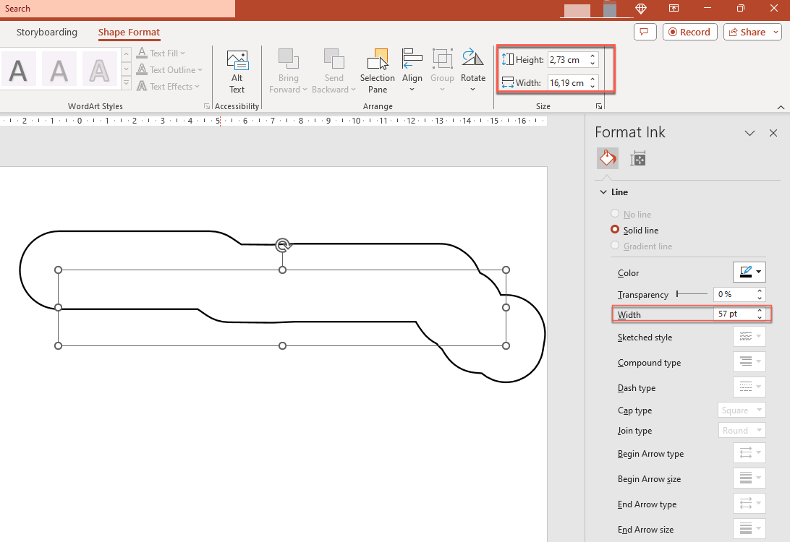

## **परिचय**

PowerPoint एक इंक सुविधा प्रदान करता है जो आपको फ्रीफ़ॉर्म स्ट्रोक खींचने की अनुमति देती है। इंक का उपयोग अन्य ऑब्जेक्ट्स को हाइलाइट करने, कनेक्शन और प्रक्रियाएँ दिखाने, और स्लाइड में विशिष्ट आइटम्स पर ध्यान आकर्षित करने के लिए किया जा सकता है।

The [aspose.slides.ink](https://reference.aspose.com/slides/hi/python-net/aspose.slides.ink/) namespace contains the classes needed to work with ink objects. For example, the [Ink](https://reference.aspose.com/slides/hi/python-net/aspose.slides.ink/ink/) class represents an ink object on a slide.

## **सामान्य ऑब्जेक्ट्स और इंक ऑब्जेक्ट्स के बीच अंतर**

PowerPoint स्लाइड पर ऑब्जेक्ट्स आमतौर पर shape ऑब्जेक्ट्स द्वारा दर्शाए जाते हैं। सबसे सरल रूप में, एक shape वह कंटेनर है जो ऑब्जेक्ट के स्वयं के क्षेत्र (उसका फ्रेम) को परिभाषित करता है तथा कंटेनर आकार, आकार, और बैकग्राउंड जैसी प्रॉपर्टीज़ को शामिल करता है। अधिक जानकारी के लिए देखें [Shape Layout Format](https://docs.aspose.com/slides/hi/python-net/shape-manipulations/#access-layout-formats-for-shape)।

हालाँकि, जब PowerPoint एक इंक ऑब्जेक्ट को संभालता है, तो वह ऑब्जेक्ट फ्रेम (कंटेनर) की सभी प्रॉपर्टीज़ को उसकी आकार के अलावा अनदेखा कर देता है। कंटेनर क्षेत्र का आकार standard [Ink.width](https://reference.aspose.com/slides/hi/python-net/aspose.slides.ink/ink/width/) और [Ink.height](https://reference.aspose.com/slides/hi/python-net/aspose.slides.ink/ink/height/) प्रॉपर्टीज़ द्वारा निर्धारित होता है:


## **इंक ट्रेस**

इंक ट्रेस एक बुनियादी तत्व है जिसका उपयोग डिजिटल इंक लिखते समय पेन की गति को रिकॉर्ड करने के लिए किया जाता है। एक ट्रेस जुड़े हुए पॉइंट्स का क्रम संग्रहीत करता है।

सबसे सरल एन्कोडिंग रूप प्रत्येक सैंपल पॉइंट के X और Y निर्देशांक निर्धारित करता है। जब सभी जुड़े हुए पॉइंट्स को रेंडर किया जाता है, तो वे इस प्रकार की छवि उत्पन्न करते हैं:


## **ड्रॉइंग के लिए ब्रश प्रॉपर्टीज़**

ब्रश का उपयोग इंक ट्रेस के पॉइंट्स को जोड़ने वाली रेखाएँ बनाने के लिए किया जाता है। इसके [InkBrush.color](https://reference.aspose.com/slides/hi/python-net/aspose.slides.ink/inkbrush/color/) और [InkBrush.size](https://reference.aspose.com/slides/hi/python-net/aspose.slides.ink/inkbrush/size/) प्रॉपर्टीज़ क्रमशः उसके रंग और आकार को नियंत्रित करती हैं।

### **इंक ब्रश रंग सेट करें**

This Python code shows how to set the color of an ink brush:

```py
import aspose.slides as slides
import aspose.pydrawing as draw

with slides.Presentation("pres.pptx") as presentation:
    ink = presentation.slides[0].shapes[0]
    brush = ink.traces[0].brush
    brush.color = draw.Color.red
```

### **इंक ब्रश आकार सेट करें**

This Python code shows how to set the size of an ink brush:

```py
import aspose.slides as slides
import aspose.pydrawing as draw

with slides.Presentation("pres.pptx") as presentation:
    ink = presentation.slides[0].shapes[0]
    brush = ink.traces[0].brush
    brush.size = draw.SizeF(5.0, 10.0)
```

आम तौर पर, ब्रश की चौड़ाई और ऊँचाई मेल नहीं खाती, इसलिए PowerPoint ब्रश आकार को प्रदर्शित नहीं करता (संबंधित डेटा सेक्शन ग्रे हो जाता है)। जब ब्रश की चौड़ाई और ऊँचाई मेल खाती है, तो PowerPoint अपना आकार इस तरह दिखाता है:


स्पष्टता के लिए, आइए इंक ऑब्जेक्ट की ऊँचाई बढ़ाएँ और महत्वपूर्ण आयामों की समीक्षा करें:


कंटेनर (फ़्रेम) ब्रशों के आकार को ध्यान में नहीं रखता—यह हमेशा मानता है कि रेखा की मोटाई शून्य है (पिछली छवि देखें)।

इसलिए, पूरे इंक ऑब्जेक्ट के दृश्यमान क्षेत्र को निर्धारित करने के लिए उसके ट्रेसेस के ब्रश आकार को ध्यान में रखना आवश्यक है। यहाँ, लक्ष्य ऑब्जेक्ट (हस्तलिखित टेक्स्ट ट्रेस) को कंटेनर (फ़्रेम) के आकार तक स्केल किया गया है। जब कंटेनर का आकार बदलता है, तो ब्रश आकार स्थिर रहता है, और इसके विपरीत।



PowerPoint टेक्स्ट ऑब्जेक्ट्स के लिए समान व्यवहार करता है:


## **एक्सपोर्ट और रेंडरिंग के दौरान इंक दिखावट को नियंत्रित करें**

Aspose.Slides [InkOptions](https://reference.aspose.com/slides/hi/python-net/aspose.slides.export/inkoptions/) क्लास प्रदान करता है जिससे आप एक्सपोर्ट या रेंडर किए गए आउटपुट में इंक ऑब्जेक्ट्स की दिखावट को नियंत्रित कर सकते हैं। आप इसकी प्रॉपर्टीज़ का उपयोग करके इंक को पूरी तरह छिपा सकते हैं या इंक ब्रश मास्क ऑपरेशन्स की व्याख्या बदल सकते हैं।

इंक विकल्प कई आउटपुट प्रकारों के लिए एक्सपोर्ट या रेंडरिंग विकल्पों के माध्यम से उपलब्ध हैं:

| आउटपुट | इंक विकल्प प्रॉपर्टी |
| --- | --- |
| PDF | [`PdfOptions.ink_options`](https://reference.aspose.com/slides/hi/python-net/aspose.slides.export/pdfoptions/ink_options/) |
| HTML | [`HtmlOptions.ink_options`](https://reference.aspose.com/slides/hi/python-net/aspose.slides.export/htmloptions/ink_options/) |
| SVG | [`SVGOptions.ink_options`](https://reference.aspose.com/slides/hi/python-net/aspose.slides.export/svgoptions/ink_options/) |
| TIFF | [`TiffOptions.ink_options`](https://reference.aspose.com/slides/hi/python-net/aspose.slides.export/tiffoptions/ink_options/) |
| Slide image | [`RenderingOptions.ink_options`](https://reference.aspose.com/slides/hi/python-net/aspose.slides.export/renderingoptions/ink_options/) |

इन प्रॉपर्टीज़ के माध्यम से दो समान सेटिंग्स उपलब्ध हैं:

- [`InkOptions.hide_ink`](https://reference.aspose.com/slides/hi/python-net/aspose.slides.export/inkoptions/hide_ink/) निर्धारित करता है कि क्या इंक ऑब्जेक्ट्स आउटपुट में शामिल हों। इसका डिफ़ॉल्ट मान `False` है।
- [`InkOptions.interpret_mask_op_as_opacity`](https://reference.aspose.com/slides/hi/python-net/aspose.slides.export/inkoptions/interpret_mask_op_as_opacity/) निर्धारित करता है कि जब इंक ब्रश को रेंडर किया जाता है तो मास्क ऑपरेशन्स को अपारदर्शिता के रूप में व्याख्यायित किया जाए या नहीं। इसका डिफ़ॉल्ट मान `True` है; `False` सेट करने पर ROP ऑपरेशन इस्तेमाल होगा।

### **PDF आउटपुट में इंक ऑब्जेक्ट्स छुपाएँ**

डिफ़ॉल्ट रूप से, एक्सपोर्ट के दौरान इंक ऑब्जेक्ट्स दिखाई देते हैं। जब आपको बिना हस्तलिखित एनोटेशन या अन्य इंक सामग्री के साफ़ आउटपुट चाहिए, तो [InkOptions.hide_ink](https://reference.aspose.com/slides/hi/python-net/aspose.slides.export/inkoptions/hide_ink/) को `True` सेट करें।

निम्नलिखित Python उदाहरण सभी इंक ऑब्जेक्ट्स को छिपाते हुए प्रस्तुति को PDF में एक्सपोर्ट करता है:

```py
import aspose.slides as slides

with slides.Presentation("presentation.pptx") as presentation:
    pdf_options = slides.export.PdfOptions()
    pdf_options.ink_options.hide_ink = True

    presentation.save("presentation_without_ink.pdf", slides.export.SaveFormat.PDF, pdf_options)
```

### **स्लाइड को छवि के रूप में रेंडर करते समय इंक ऑब्जेक्ट्स छुपाएँ**

स्लाइड्स को बिटमैप छवियों के रूप में रेंडर करते समय इंक ऑब्जेक्ट्स को छुपाने के लिए [RenderingOptions.ink_options](https://reference.aspose.com/slides/hi/python-net/aspose.slides.export/renderingoptions/ink_options/) को कॉन्फ़िगर करें और इसे [Slide.get_image](https://reference.aspose.com/slides/hi/python-net/aspose.slides/slide/get_image/) मेथड में पास करें।

निम्नलिखित Python उदाहरण पहले स्लाइड को PNG छवि के रूप में बिना इंक ऑब्जेक्ट्स के रेंडर करता है:

```py
import aspose.slides as slides

with slides.Presentation("presentation.pptx") as presentation:
    rendering_options = slides.export.RenderingOptions()
    rendering_options.ink_options.hide_ink = True

    with presentation.slides[0].get_image(rendering_options) as image:
        image.save("slide_without_ink.png", slides.ImageFormat.PNG)
```

### **इंक मास्क रेंडरिंग को नियंत्रित करें**

[InkOptions.interpret_mask_op_as_opacity](https://reference.aspose.com/slides/hi/python-net/aspose.slides.export/inkoptions/interpret_mask_op_as_opacity/) प्रॉपर्टी निर्धारित करती है कि इंक ब्रश को रेंडर करते समय मास्क ऑपरेशन्स को कैसे व्याख्यायित किया जाए। डिफ़ॉल्ट रूप से `True` है, जो अपारदर्शिता का उपयोग करता है। इसे `False` सेट करने पर ROP ऑपरेशन प्रयोग होगा।

निम्नलिखित Python उदाहरण एक स्लाइड को SVG में एक्सपोर्ट करता है और इंक मास्क ऑपरेशन्स के लिए ROP-आधारित रेंडरिंग का उपयोग करता है:

```py
import aspose.slides as slides

with slides.Presentation("presentation.pptx") as presentation:
    svg_options = slides.export.SVGOptions()
    svg_options.ink_options.interpret_mask_op_as_opacity = False

    with open("slide.svg", "wb") as svg_stream:
        presentation.slides[0].write_as_svg(svg_stream, svg_options)
```

इसी सेटिंग को [TiffOptions.ink_options](https://reference.aspose.com/slides/hi/python-net/aspose.slides.export/tiffoptions/ink_options/) के माध्यम से भी लागू किया जा सकता है जब प्रस्तुति को TIFF में एक्सपोर्ट या स्लाइड को TIFF में रेंडर किया जाता है।

### **इंक को छुपाना या सुरक्षित रखना चुनें**

जब एक्सपोर्ट की गई फ़ाइल एनोटेटेड प्रस्तुति की एक साफ़ संस्करण होनी चाहिए, जैसे वितरण के लिए अंतिम प्रति, तो [InkOptions.hide_ink](https://reference.aspose.com/slides/hi/python-net/aspose.slides.export/inkoptions/hide_ink/) को `True` सेट करें।

जब इंक एनोटेशन इच्छित सामग्री का हिस्सा हों—जैसे समीक्षा टिप्पणी, हस्तलिखित नोट्स, हाइलाइट्स या ड्रॉइंग्स जो एक्सपोर्टेड परिणाम में दृश्यमान रहनी चाहिए—तो [InkOptions.hide_ink](https://reference.aspose.com/slides/hi/python-net/aspose.slides.export/inkoptions/hide_ink/) को डिफ़ॉल्ट `False` ही रहने दें। इससे एप्लिकेशन एक ही प्रस्तुति से स्रोत इंक ऑब्जेक्ट्स को बदले बिना अलग-अलग समीक्षा और अंतिम आउटपुट बना सकते हैं।

## **अक्सर पूछे जाने वाले प्रश्न**

**क्या मैं मौजूदा इंक स्ट्रोक का रंग या आकार बदल सकता हूँ?**

हाँ। [Ink.traces](https://reference.aspose.com/slides/hi/python-net/aspose.slides.ink/ink/traces/) से ट्रेस प्राप्त करें, फिर उसके [InkTrace.brush](https://reference.aspose.com/slides/hi/python-net/aspose.slides.ink/inktrace/brush/) को बदलें। आप ब्रश की [InkBrush.color](https://reference.aspose.com/slides/hi/python-net/aspose.slides.ink/inkbrush/color/) और [InkBrush.size](https://reference.aspose.com/slides/hi/python-net/aspose.slides.ink/inkbrush/size/) प्रॉपर्टीज़ सेट कर सकते हैं।

**क्या इंक को छुपाने से स्रोत प्रस्तुति बदलती है?**

नहीं। [InkOptions.hide_ink](https://reference.aspose.com/slides/hi/python-net/aspose.slides.export/inkoptions/hide_ink/) केवल रेंडर या एक्सपोर्ट परिणाम को प्रभावित करता है; यह स्रोत प्रस्तुति में इंक ऑब्जेक्ट्स को हटाता या बदलता नहीं है।

**कौनसे एक्सपोर्ट फ़ॉर्मैट इंक विकल्पों को समर्थन देते हैं?**

आप PDF, HTML, SVG, TIFF, और बिटमैप स्लाइड इमेजेज के लिए ऊपर दिखाए गए संबंधित एक्सपोर्ट या रेंडरिंग विकल्पों के माध्यम से इंक विकल्प कॉन्फ़िगर कर सकते हैं।

**अधिक पढ़ें**

* To read about shapes in general, see the [PowerPoint Shapes](https://docs.aspose.com/slides/hi/python-net/powerpoint-shapes/) section.
* For more information on effective values, see [Shape Effective Properties](https://docs.aspose.com/slides/hi/python-net/shape-effective-properties/#get-effective-font-height-value).
* For details on PDF export, see [Convert PPT and PPTX to PDF](https://docs.aspose.com/slides/hi/python-net/convert-powerpoint-to-pdf/).
* For details on HTML export, see [Convert PowerPoint Presentations to HTML](https://docs.aspose.com/slides/hi/python-net/convert-powerpoint-to-html/).
* For details on SVG export, see [Render Presentation Slides as SVG Images](https://docs.aspose.com/slides/hi/python-net/render-a-slide-as-an-svg-image/).
* For details on TIFF export, see [Convert PowerPoint Presentations to TIFF](https://docs.aspose.com/slides/hi/python-net/convert-powerpoint-to-tiff/).
* For details on slide-to-image rendering, see [Convert Presentation Slides to Images](https://docs.aspose.com/slides/hi/python-net/convert-slide/).