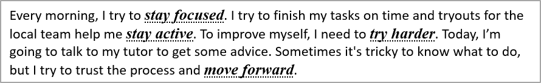

## **अवलोकन**

यह लेख Aspose.Slides for Python via .NET का उपयोग करके PowerPoint और OpenDocument प्रस्तुतियों में टेक्स्ट को फ़ॉर्मेट करने का तरीका दिखाता है। इसमें बैकग्राउंड रंग, पारदर्शिता, कैरेक्टर स्पेसिंग, फ़ॉन्ट प्रॉपर्टीज़, रोटेशन, पैराग्राफ स्पेसिंग, ऑटोफिट व्यवहार, टेक्स्ट एंकरिंग, टैब स्टॉप्स और भाषा सेटिंग्स शामिल हैं।

जब तक अलग से न बताया गया हो, उदाहरण [sample.pptx](sample.pptx) का उपयोग करते हैं। पहले स्लाइड पर पहला आकार एक टेक्स्ट बॉक्स है, और उसका पहला पैराग्राफ नीचे दिखाए गए टेक्स्ट को रखता है। स्लाइड और आकार दोनों के इंडेक्स शून्य-आधारित हैं। जो उदाहरण बोल्ड हिस्सों का चयन करते हैं वे प्रभावी फ़ॉर्मेटिंग का उपयोग करते हैं, जिसमें विरासत में मिली बोल्ड फ़ॉर्मेटिंग शामिल है:


जब आप लिटरल टेक्स्ट या रेगुलर‑एक्सप्रेशन मैच ढूँढना और हाइलाइट करना चाहते हैं, तो देखें [टेक्स्ट खोजें और बदलें](/slides/hi/python-net/search-and-replace-text/)।

## **टेक्स्ट बैकग्राउंड रंग सेट करें**

पैराग्राफ के लिए डिफ़ॉल्ट हाइलाइट रंग सेट करने के लिए [ParagraphFormat.default_portion_format](https://reference.aspose.com/slides/python-net/aspose.slides/paragraphformat/default_portion_format/) का उपयोग करें, या व्यक्तिगत टेक्स्ट भागों के लिए [BasePortionFormat.highlight_color](https://reference.aspose.com/slides/python-net/aspose.slides/baseportionformat/highlight_color/) का उपयोग करें।

निम्न उदाहरण पहले पैराग्राफ के लिए हल्का ग्रे हाइलाइट डिफ़ॉल्ट रूप में सेट करता है। व्यक्तिगत भागों पर स्पष्ट हाइलाइट रंग इस डिफ़ॉल्ट पर प्राथमिकता रखते हैं:

```python
import aspose.pydrawing as draw
import aspose.slides as slides

with slides.Presentation("sample.pptx") as presentation:
    slide = presentation.slides[0]

    auto_shape = slide.shapes[0]
    paragraph = auto_shape.text_frame.paragraphs[0]

    # पूर्ण पैराग्राफ के लिए हाइलाइट रंग सेट करें.
    paragraph.paragraph_format.default_portion_format.highlight_color.color = draw.Color.light_gray

    presentation.save("gray_paragraph.pptx", slides.export.SaveFormat.PPTX)
```

परिणाम:


नीचे दिया गया कोड उदाहरण दिखाता है कि **बोल्ड फ़ॉन्ट वाले टेक्स्ट भागों** के लिए बैकग्राउंड रंग कैसे सेट करें:

```python
import aspose.pydrawing as draw
import aspose.slides as slides

with slides.Presentation("sample.pptx") as presentation:
    slide = presentation.slides[0]

    auto_shape = slide.shapes[0]
    paragraph = auto_shape.text_frame.paragraphs[0]

    for portion in paragraph.portions:
        if portion.portion_format.get_effective().font_bold:
            # टेक्स्ट भाग के लिए हाइलाइट रंग सेट करें.
            portion.portion_format.highlight_color.color = draw.Color.light_gray

    presentation.save("gray_text_portions.pptx", slides.export.SaveFormat.PPTX)
```

परिणाम:


## **टेक्स्ट पैराग्राफ संरेखित करें**

टेक्स्ट फ्रेम के भीतर पैराग्राफ संरेखण सेट करने के लिए [ParagraphFormat.alignment](https://reference.aspose.com/slides/python-net/aspose.slides/paragraphformat/alignment/) का उपयोग करें। मान को मध्य, बाएँ‑संकुचित, दाएँ‑संकुचित, जस्टिफ़ाई आदि में से कोई भी हो सकता है।

निम्न कोड उदाहरण दिखाता है कि पैराग्राफ को **केंद्र** में कैसे संरेखित किया जाए:

```python
import aspose.slides as slides

with slides.Presentation("sample.pptx") as presentation:
    slide = presentation.slides[0]

    auto_shape = slide.shapes[0]
    paragraph = auto_shape.text_frame.paragraphs[0]

    # पैराग्राफ की संरेखण को केंद्र में सेट करें.
    paragraph.paragraph_format.alignment = slides.TextAlignment.CENTER

    presentation.save("aligned_paragraph.pptx", slides.export.SaveFormat.PPTX)
```

परिणाम:


## **लाइन में फ़ॉन्ट संरेखित करें**

लाइन के भीतर विभिन्न फ़ॉन्ट आकारों के टेक्स्ट भागों को ऊर्ध्वाधर रूप से संरेखित करने के लिए [ParagraphFormat.font_alignment](https://reference.aspose.com/slides/python-net/aspose.slides/paragraphformat/font_alignment/) का उपयोग करें। यह सेटिंग पूरे पैराग्राफ पर लागू होती है और उसकी प्रत्येक लाइन में संरेखण को नियंत्रित करती है।

निम्न स्वनिर्भरित उदाहरण एक स्लाइड पर चार लेबल वाले टेक्स्ट बॉक्स बनाता है। प्रत्येक पैराग्राफ में 18, 36, और 54 पॉइंट का समान टेक्स्ट होता है, लेकिन फ़ॉन्ट संरेखण अलग‑अलग है। यह Arial का उपयोग करता है, ऑटोफ़िट और रैपिंग को अक्षम करता है, और टेक्स्ट फ्रेम को एक पंक्ति के लिए पर्याप्त बड़ा रखता है।

```python
import aspose.pydrawing as draw
import aspose.slides as slides

with slides.Presentation() as presentation:
    slide = presentation.slides[0]

    alignments = [slides.FontAlignment.BASELINE, slides.FontAlignment.TOP, slides.FontAlignment.CENTER, slides.FontAlignment.BOTTOM]
    font_sizes = [18, 36, 54]

    for i, alignment in enumerate(alignments):
        shape = slide.shapes.add_auto_shape(slides.ShapeType.RECTANGLE, 30, 20 + i * 130, 660, 120)
        shape.fill_format.fill_type = slides.FillType.NO_FILL
        shape.line_format.fill_format.fill_type = slides.FillType.NO_FILL

        text_frame = shape.text_frame
        text_frame.text_frame_format.anchoring_type = slides.TextAnchorType.TOP
        text_frame.text_frame_format.autofit_type = slides.TextAutofitType.NONE
        text_frame.text_frame_format.wrap_text = slides.NullableBool.FALSE

        label = text_frame.paragraphs[0]
        label.text = alignment.name.title()
        label.paragraph_format.alignment = slides.TextAlignment.LEFT
        label.paragraph_format.default_portion_format.font_height = 14
        label.paragraph_format.default_portion_format.latin_font = slides.FontData("Arial")
        label.paragraph_format.default_portion_format.fill_format.fill_type = slides.FillType.SOLID
        label.paragraph_format.default_portion_format.fill_format.solid_fill_color.color = draw.Color.gray

        paragraph = slides.Paragraph()
        paragraph.paragraph_format.font_alignment = alignment
        paragraph.paragraph_format.alignment = slides.TextAlignment.LEFT
        paragraph.paragraph_format.default_portion_format.latin_font = slides.FontData("Arial")
        paragraph.paragraph_format.default_portion_format.fill_format.fill_type = slides.FillType.SOLID
        paragraph.paragraph_format.default_portion_format.fill_format.solid_fill_color.color = draw.Color.black

        for font_size in font_sizes:
            portion = slides.Portion("Ag ")
            portion.portion_format.font_height = font_size
            paragraph.portions.add(portion)

        text_frame.paragraphs.add(paragraph)

    presentation.save("font_alignment.pptx", slides.export.SaveFormat.PPTX)
```


फ़ॉन्ट संरेखण फ़ॉन्ट मेट्रिक्स का उपयोग करता है, इसलिए व्यक्तिगत अक्षरों के दृश्यमान किनारे बिल्कुल समान नहीं होते। उदाहरण में एक अपरकेस अक्षर और एक डिसेंडर दोनों शामिल हैं ताकि बेसलाइन और बॉटम संरेखण के बीच अंतर दिखाया जा सके। फ़ॉन्ट उपलब्धता और प्रतिस्थापन, उपयोग किए गए अक्षर, तथा फ़ॉन्ट आकारों का अंतर परिणाम को प्रभावित करता है। फ्रेम आयाम, मार्जिन, लाइन स्पेसिंग, रैपिंग, और ऑटोफ़िट भी लेआउट को प्रभावित करते हैं; मोड की तुलना करते समय समान फ़ॉन्ट और लेआउट सेटिंग्स का उपयोग करें।

यह सेटिंग [ParagraphFormat.alignment](https://reference.aspose.com/slides/python-net/aspose.slides/paragraphformat/alignment/) से अलग है, जो क्षैतिज पैराग्राफ संरेखण को नियंत्रित करती है, और [TextFrameFormat.anchoring_type](https://reference.aspose.com/slides/python-net/aspose.slides/textframeformat/anchoring_type/) से भी, जो आकार के भीतर टेक्स्ट ब्लॉक को ऊर्ध्वाधर रूप से स्थित करती है। [BasePortionFormat.escapement](https://reference.aspose.com/slides/python-net/aspose.slides/baseportionformat/escapement/) के माध्यम से सुपरसक्रिप्ट और सबस्क्रिप्ट फ़ॉर्मेटिंग व्यक्तिगत भागों को बेसलाइन के सापेक्ष शिफ्ट करती है, न कि पैराग्राफ की लाइनों के लिए फ़ॉन्ट संरेखण सेट करती है।

## **टेक्स्ट की पारदर्शिता सेट करें**

टेक्स्ट पारदर्शिता को उस रंग के अल्फा घटक के माध्यम से नियंत्रित किया जाता है जो [BasePortionFormat.fill_format](https://reference.aspose.com/slides/python-net/aspose.slides/baseportionformat/fill_format/) को सौंपा गया है। नीचे के उदाहरणों में, `alpha = 50` 0–255 स्केल पर एक ARGB अल्फा‑चैनल मान है, न कि पारदर्शिता प्रतिशत।

नीचे दिया गया कोड उदाहरण पूरे पैराग्राफ पर पारदर्शिता लागू करने का तरीका दिखाता है:

```python
import aspose.pydrawing as draw
import aspose.slides as slides

alpha = 50

with slides.Presentation("sample.pptx") as presentation:
    slide = presentation.slides[0]

    auto_shape = slide.shapes[0]
    paragraph = auto_shape.text_frame.paragraphs[0]

    # टेक्स्ट के लिए अर्धपारदर्शी काला फ़िल सेट करें.
    paragraph.paragraph_format.default_portion_format.fill_format.fill_type = slides.FillType.SOLID
    paragraph.paragraph_format.default_portion_format.fill_format.solid_fill_color.color = draw.Color.from_argb(alpha, draw.Color.black)

    presentation.save("transparent_paragraph.pptx", slides.export.SaveFormat.PPTX)
```

परिणाम:


निम्न कोड उदाहरण **बोल्ड फ़ॉन्ट वाले टेक्स्ट भागों** पर पारदर्शिता लागू करने का तरीका दिखाता है:

```python
import aspose.pydrawing as draw
import aspose.slides as slides

alpha = 50

with slides.Presentation("sample.pptx") as presentation:
    slide = presentation.slides[0]

    auto_shape = slide.shapes[0]
    paragraph = auto_shape.text_frame.paragraphs[0]

    for portion in paragraph.portions:
        if portion.portion_format.get_effective().font_bold:
            # टेक्स्ट भाग की पारदर्शिता सेट करें.
            portion.portion_format.fill_format.fill_type = slides.FillType.SOLID
            portion.portion_format.fill_format.solid_fill_color.color = draw.Color.from_argb(alpha, draw.Color.black)

    presentation.save("transparent_text_portions.pptx", slides.export.SaveFormat.PPTX)
```

परिणाम:


## **टेक्स्ट के लिए कैरेक्टर स्पेसिंग सेट करें**

टेक्स्ट बॉक्स में अक्षरों के बीच स्पेसिंग को विस्तृत या संकुचित करने के लिए [BasePortionFormat.spacing](https://reference.aspose.com/slides/python-net/aspose.slides/baseportionformat/spacing/) का उपयोग करें। उदाहरण 3 पॉइंट स्पेसिंग जोड़ते हैं; नकारात्मक मान टेक्स्ट को संकुचित करते हैं।

निम्न Python कोड पूरे पैराग्राफ में कैरेक्टर स्पेसिंग को विस्तारित करने का तरीका दिखाता है:

```python
import aspose.slides as slides

with slides.Presentation("sample.pptx") as presentation:
    slide = presentation.slides[0]

    auto_shape = slide.shapes[0]
    paragraph = auto_shape.text_frame.paragraphs[0]

    # ध्यान दें: अक्षर स्पेसिंग को संकुचित करने के लिए नकारात्मक मान उपयोग करें।
    paragraph.paragraph_format.default_portion_format.spacing = 3  # अक्षर स्पेसिंग का विस्तार करें।

    presentation.save("character_spacing_in_paragraph.pptx", slides.export.SaveFormat.PPTX)
```

परिणाम:


नीचे दिया गया कोड उदाहरण **बोल्ड फ़ॉन्ट वाले टेक्स्ट भागों** में कैरेक्टर स्पेसिंग को विस्तारित करने का तरीका दिखाता है:

```python
import aspose.slides as slides

with slides.Presentation("sample.pptx") as presentation:
    slide = presentation.slides[0]

    auto_shape = slide.shapes[0]
    paragraph = auto_shape.text_frame.paragraphs[0]

    for portion in paragraph.portions:
        if portion.portion_format.get_effective().font_bold:
            # नोट: अक्षर स्पेसिंग को संकुचित करने के लिए नकारात्मक मान उपयोग करें.
            portion.portion_format.spacing = 3  # अक्षर स्पेसिंग का विस्तार करें.

    presentation.save("character_spacing_in_text_portions.pptx", slides.export.SaveFormat.PPTX)
```

परिणाम:


### **विशिष्ट फ़ॉन्ट्स के लिए केरनिंग अक्षम करें**

कुछ मामलों में, Aspose.Slides द्वारा रेंडर किया गया टेक्स्ट PowerPoint में दिखाए गए टेक्स्ट से थोड़ा टाइट लग सकता है। यह इसलिए हो सकता है क्योंकि PowerPoint कुछ फ़ॉन्ट्स के लिए केरनिंग डेटा को अनदेखा करता है, भले ही फ़ॉन्ट में मान्य केरनिंग जानकारी हो और PowerPoint सेटिंग्स में केरनिंग सक्षम हो।

ऐसे मामलों में रेंडर आउटपुट को PowerPoint के करीब लाने के लिए आप उन टेक्स्ट भागों के लिए केरनिंग अक्षम कर सकते हैं जो प्रभावित फ़ॉन्ट का उपयोग करते हैं। वास्तविक फ़ॉन्ट आकार से बड़ा मान सेट करने के लिए [BasePortionFormat.kerning_minimal_size](https://reference.aspose.com/slides/python-net/aspose.slides/baseportionformat/kerning_minimal_size/) का प्रयोग करें। यह उदाहरण पहली स्लाइड पर पहला आकार एक टेक्स्ट बॉक्स वाला "presentation.pptx" आवश्यक करता है। यह प्रभावी फ़ॉन्ट नामों की जांच करता है, विरासत में मिले फ़ॉन्ट सहित, और Roboto के उपयोग वाले भागों के लिए 100‑पॉइंट थ्रेसहोल्ड सेट करता है। यह 100 पॉइंट से नीचे के फ़ॉन्ट आकार वाले मेल खाते भागों के लिए केरनिंग अक्षम करता है:

```python
import aspose.slides as slides

with slides.Presentation("presentation.pptx") as presentation:
    slide = presentation.slides[0]

    auto_shape = slide.shapes[0]
    target_font = "Roboto"

    for paragraph in auto_shape.text_frame.paragraphs:
        for portion in paragraph.portions:
            text_format = portion.portion_format.get_effective()
            fonts = (text_format.latin_font, text_format.east_asian_font, text_format.complex_script_font)
            uses_target_font = any(font is not None and font.font_name == target_font for font in fonts)

            if uses_target_font:
                portion.portion_format.kerning_minimal_size = 100

    presentation.save("output.pptx", slides.export.SaveFormat.PPTX)
```

थ्रेशहोल्ड से नीचे के मेल खाते टेक्स्ट के लिए यह सेटिंग केरनिंग को रोकती है और ऐसे फ़ॉन्ट्स के लिए Aspose.Slides की रेंडरिंग को PowerPoint के दृश्य आउटपुट के साथ संरेखित करने में मदद कर सकती है।

## **टेक्स्ट फ़ॉन्ट गुण प्रबंधित करें**

फ़ॉन्ट गुण पैराग्राफ स्तर पर [ParagraphFormat.default_portion_format](https://reference.aspose.com/slides/python-net/aspose.slides/paragraphformat/default_portion_format/) या व्यक्तिगत भागों पर [PortionFormat](https://reference.aspose.com/slides/python-net/aspose.slides/portionformat/) के माध्यम से सेट किए जा सकते हैं।

निम्न उदाहरण पहले पैराग्राफ की डिफ़ॉल्ट फ़ॉन्ट को 12‑पॉइंट Times New Roman, बोल्ड, इटैलिक और डॉटेड अंडरलाइन फ़ॉर्मेटिंग के साथ सेट करता है। व्यक्तिगत भागों पर स्पष्ट फ़ॉर्मेटिंग इन डिफ़ॉल्ट्स पर प्राथमिकता लेती है:

```python
import aspose.slides as slides

with slides.Presentation("sample.pptx") as presentation:
    slide = presentation.slides[0]

    auto_shape = slide.shapes[0]
    paragraph = auto_shape.text_frame.paragraphs[0]

    # पैराग्राफ के लिए फ़ॉन्ट गुण सेट करें.
    portion_format = paragraph.paragraph_format.default_portion_format
    portion_format.font_height = 12
    portion_format.font_bold = slides.NullableBool.TRUE
    portion_format.font_italic = slides.NullableBool.TRUE
    portion_format.font_underline = slides.TextUnderlineType.DOTTED
    portion_format.latin_font = slides.FontData("Times New Roman")

    presentation.save("font_properties_for_paragraph.pptx", slides.export.SaveFormat.PPTX)
```

परिणाम:


निम्न उदाहरण 13‑पॉइंट Times New Roman, इटैलिक फ़ॉर्मेटिंग और डॉटेड अंडरलाइन को उन भागों पर लागू करता है जिनकी प्रभावी फ़ॉर्मेटिंग बोल्ड है:

```python
import aspose.slides as slides

with slides.Presentation("sample.pptx") as presentation:
    slide = presentation.slides[0]

    auto_shape = slide.shapes[0]
    paragraph = auto_shape.text_frame.paragraphs[0]

    for portion in paragraph.portions:
        if portion.portion_format.get_effective().font_bold:
            # टेक्स्ट भाग के लिए फ़ॉन्ट गुण सेट करें.
            portion.portion_format.font_height = 13
            portion.portion_format.font_italic = slides.NullableBool.TRUE
            portion.portion_format.font_underline = slides.TextUnderlineType.DOTTED
            portion.portion_format.latin_font = slides.FontData("Times New Roman")

    presentation.save("font_properties_for_text_portions.pptx", slides.export.SaveFormat.PPTX)
```

परिणाम:



## **टेक्स्ट रोटेशन सेट करें**

शेप के भीतर एक पूर्वनिर्धारित टेक्स्ट ओरिएंटेशन सेट करने के लिए [TextFrameFormat.text_vertical_type](https://reference.aspose.com/slides/python-net/aspose.slides/textframeformat/text_vertical_type/) का उपयोग करें।

निम्न कोड उदाहरण शेम में टेक्स्ट ओरिएंटेशन को [TextVerticalType.VERTICAL270](https://reference.aspose.com/slides/python-net/aspose.slides/textverticaltype/) पर सेट करता है, जिससे टेक्स्ट **90 डिग्री प्रतिक्लॉकवाइस** घुमता है:

```python
import aspose.slides as slides

with slides.Presentation("sample.pptx") as presentation:
    slide = presentation.slides[0]

    auto_shape = slide.shapes[0]

    auto_shape.text_frame.text_frame_format.text_vertical_type = slides.TextVerticalType.VERTICAL270

    presentation.save("text_rotation.pptx", slides.export.SaveFormat.PPTX)
```

परिणाम:


## **टेक्स्ट फ्रेम के लिए कस्टम रोटेशन सेट करें**

[TextFrameFormat.rotation_angle](https://reference.aspose.com/slides/python-net/aspose.slides/textframeformat/rotation_angle/) का उपयोग करके आप किसी [TextFrame](https://reference.aspose.com/slides/python-net/aspose.slides/textframe/) के लिए कस्टम रोटेशन एंगल सेट कर सकते हैं।

निम्न कोड उदाहरण आकार के भीतर टेक्स्ट फ्रेम को 3 डिग्री घड़ी की दिशा में घुमाता है:

```python
import aspose.slides as slides

with slides.Presentation("sample.pptx") as presentation:
    slide = presentation.slides[0]

    auto_shape = slide.shapes[0]

    auto_shape.text_frame.text_frame_format.rotation_angle = 3

    presentation.save("custom_text_rotation.pptx", slides.export.SaveFormat.PPTX)
```

परिणाम:


## **पैराग्राफ की लाइन स्पेसिंग सेट करें**

Aspose.Slides पैराग्राफ स्पेसिंग को नियंत्रित करने के लिए [ParagraphFormat.space_after](https://reference.aspose.com/slides/python-net/aspose.slides/paragraphformat/space_after/), [ParagraphFormat.space_before](https://reference.aspose.com/slides/python-net/aspose.slides/paragraphformat/space_before/), और [ParagraphFormat.space_within](https://reference.aspose.com/slides/python-net/aspose.slides/paragraphformat/space_within/) प्रदान करता है। इन प्रॉपर्टीज़ का उपयोग इस प्रकार किया जाता है:

* सकारात्मक मान का उपयोग लाइन स्पेसिंग को लाइन की ऊँचाई के प्रतिशत के रूप में निर्दिष्ट करने के लिए करें।
* नकारात्मक मान का उपयोग लाइन स्पेसिंग को पॉइंट में निर्दिष्ट करने के लिए करें।

निम्न उदाहरण पहली पैराग्राफ के भीतर स्पेसिंग को लाइन की ऊँचाई के 200 % (डबल स्पेसिंग) पर सेट करता है:

```python
import aspose.slides as slides

with slides.Presentation("sample.pptx") as presentation:
    slide = presentation.slides[0]

    auto_shape = slide.shapes[0]
    paragraph = auto_shape.text_frame.paragraphs[0]

    paragraph.paragraph_format.space_within = 200

    presentation.save("line_spacing.pptx", slides.export.SaveFormat.PPTX)
```

परिणाम:


## **लाइन ब्रेकिंग नियंत्रित करें**

नैरो टेक्स्ट ब्लॉकों और लैटिन तथा ईस्ट एशियाई टेक्स्ट को मिश्रित करने वाली प्रस्तुतियों में पैराग्राफ लाइन‑ब्रेकिंग नियम उपयोगी होते हैं। निम्न प्रॉपर्टीज़ [ParagraphFormat](https://reference.aspose.com/slides/python-net/aspose.slides/paragraphformat/) से संबंधित हैं, इसलिए वे पूरे पैराग्राफ पर लागू होती हैं:

- [latin_line_break](https://reference.aspose.com/slides/python-net/aspose.slides/paragraphformat/latin_line_break/) लैटिन लाइन‑ब्रेकिंग नियमों को नियंत्रित करता है। मिश्रित टेक्स्ट में इसे बदलने से पड़ोसी ईस्ट एशियाई टेक्स्ट और विराम चिह्नों के रैपिंग स्थान भी बदल सकते हैं।
- [east_asian_line_break](https://reference.aspose.com/slides/python-net/aspose.slides/paragraphformat/east_asian_line_break/) ईस्ट एशियाई लाइन‑ब्रेकिंग नियमों को नियंत्रित करता है, जिसमें लाइन की शुरुआत और अंत में पात्रों पर पाबंदियों को शामिल किया गया है।

ये नियम [TextFrameFormat.wrap_text](https://reference.aspose.com/slides/python-net/aspose.slides/textframeformat/wrap_text/) को प्रतिस्थापित नहीं करते, जो टेक्स्ट फ्रेम के भीतर स्वचालित रैपिंग को सक्षम करता है। वे रैपिंग होने पर लेआउट को प्रभावित करते हैं; वे लाइन‑ब्रेक अक्षर नहीं डालते। एक स्पष्ट लाइन ब्रेक पैराग्राफ के भीतर नई पंक्ति को उपलब्ध चौड़ाई से स्वतंत्र रूप से बाध्य करता है।

निम्न स्वनिर्भरित उदाहरण एक संकीर्ण टेक्स्ट ब्लॉक बनाता है जिसमें चाइनीज़ और लैटिन टेक्स्ट दोनों होते हैं। यह दोनों लाइन‑ब्रेकिंग प्रॉपर्टीज़ को स्पष्ट रूप से सेट करता है और "line_breaking.pptx" संग्रहीत करता है। किसी भी नियम के साथ प्रयोग करने के लिए, उस प्रॉपर्टी का मान बदलें जबकि दूसरी सेटिंग को स्थिर रखें। उदाहरण 24‑पॉइंट Arial और SimSun का उपयोग 160‑पॉइंट फ्रेम चौड़ाई और शून्य क्षैतिज टेक्स्ट‑फ़्रेम मार्जिन के साथ करता है। [TextFrameFormat.autofit_type](https://reference.aspose.com/slides/python-net/aspose.slides/textframeformat/autofit_type/) को [TextAutofitType.NONE](https://reference.aspose.com/slides/python-net/aspose.slides/textautofittype/) पर सेट किया गया है ताकि टेक्स्ट आकार और फ्रेम आयाम स्थिर रहें।

```python
import aspose.pydrawing as draw
import aspose.slides as slides

with slides.Presentation() as presentation:
    slide = presentation.slides[0]

    shape = slide.shapes.add_auto_shape(slides.ShapeType.RECTANGLE, 50, 50, 160, 300)
    shape.fill_format.fill_type = slides.FillType.NO_FILL

    text_frame = shape.text_frame
    text_frame.text_frame_format.wrap_text = slides.NullableBool.TRUE
    text_frame.text_frame_format.autofit_type = slides.TextAutofitType.NONE
    text_frame.text_frame_format.margin_left = 0
    text_frame.text_frame_format.margin_right = 0

    paragraph = text_frame.paragraphs[0]
    paragraph.text = "中文排版测试，PowerPoint 中文演示。"

    paragraph_format = paragraph.paragraph_format
    paragraph_format.alignment = slides.TextAlignment.LEFT
    paragraph_format.default_portion_format.font_height = 24
    paragraph_format.default_portion_format.latin_font = slides.FontData("Arial")
    paragraph_format.default_portion_format.east_asian_font = slides.FontData("SimSun")
    paragraph_format.default_portion_format.fill_format.fill_type = slides.FillType.SOLID
    paragraph_format.default_portion_format.fill_format.solid_fill_color.color = draw.Color.black
    paragraph_format.latin_line_break = slides.NullableBool.FALSE
    paragraph_format.east_asian_line_break = slides.NullableBool.TRUE

    presentation.save("line_breaking.pptx", slides.export.SaveFormat.PPTX)
```

## **हैंगिंग पंचुयेशन नियंत्रित करें**

[ParagraphFormat.hanging_punctuation](https://reference.aspose.com/slides/python-net/aspose.slides/paragraphformat/hanging_punctuation/) योग्य पंचुयेशन को टेक्स्ट लाइन के दाएँ किनारे से आगे बढ़ने की अनुमति देता है, न कि अगले लाइन में कब्ज़ा करने देता है। यह पूरे पैराग्राफ पर लागू होता है और हैंगिंग इंडेंट से अलग है।

निम्न स्वनिर्भरित उदाहरण 100‑पॉइंट चौड़ी टेक्स्ट फ्रेम में हैंगिंग पंचुयेशन सक्षम करता है और "hanging_punctuation.pptx" संग्रहीत करता है। 24‑पॉइंट Arial और शून्य क्षैतिज टेक्स्ट‑फ़्रेम मार्जिन के साथ, अंतिम पूर्णविराम "sentence" के बाद रहता है और दाएँ टेक्स्ट किनारे से आगे बढ़ता है। तुलना के लिए प्रॉपर्टी को [NullableBool.FALSE](https://reference.aspose.com/slides/python-net/aspose.slides/nullablebool/) पर सेट करें: इन सेटिंग्स में पूर्णविराम अलग लाइन लेता है। रैपिंग सक्षम है और उपलब्ध चौड़ाई को स्थिर रखने के लिए ऑटोफ़िट अक्षम किया गया है।

```python
import aspose.pydrawing as draw
import aspose.slides as slides

with slides.Presentation() as presentation:
    slide = presentation.slides[0]

    shape = slide.shapes.add_auto_shape(slides.ShapeType.RECTANGLE, 50, 50, 100, 200)
    shape.fill_format.fill_type = slides.FillType.NO_FILL

    text_frame = shape.text_frame
    text_frame.text_frame_format.wrap_text = slides.NullableBool.TRUE
    text_frame.text_frame_format.autofit_type = slides.TextAutofitType.NONE
    text_frame.text_frame_format.margin_left = 0
    text_frame.text_frame_format.margin_right = 0

    paragraph = text_frame.paragraphs[0]
    paragraph.text = "Simple text, next sentence."

    paragraph_format = paragraph.paragraph_format
    paragraph_format.alignment = slides.TextAlignment.LEFT
    paragraph_format.default_portion_format.font_height = 24
    paragraph_format.default_portion_format.latin_font = slides.FontData("Arial")
    paragraph_format.default_portion_format.fill_format.fill_type = slides.FillType.SOLID
    paragraph_format.default_portion_format.fill_format.solid_fill_color.color = draw.Color.black
    paragraph_format.hanging_punctuation = slides.NullableBool.TRUE

    presentation.save("hanging_punctuation.pptx", slides.export.SaveFormat.PPTX)
```

हर पंचुयेशन चिह्न हैंग नहीं कर सकता। दिखाई देने वाला परिणाम [फ़ॉन्ट और लेआउट स्थितियों](#control-line-breaking) पर निर्भर करता है: फ़ॉन्ट, उपलब्ध चौड़ाई, मार्जिन या ऑटोफ़िट सेटिंग बदलने से दृश्यमान अंतर हट सकता है।

## **टेक्स्ट फ्रेम के लिए ऑटोफ़िट प्रकार सेट करें**

[TextFrameFormat.autofit_type](https://reference.aspose.com/slides/python-net/aspose.slides/textframeformat/autofit_type/) निर्धारित करता है कि जब टेक्स्ट कंटेनर की सीमा से अधिक हो जाए तो वह कैसे व्यवहार करता है। इसका उपयोग इस बात को नियंत्रित करने के लिए करें कि टेक्स्ट छोटा हो, ओवरफ़्लो करे, या आकार को स्वचालित रूप से पुनः आकारित करे। निम्न उदाहरण आकार को उसके टेक्स्ट को फिट करने के लिए रिसाइज़ करता है और परिणाम "autofit_type.pptx" में सहेजता है:

```python
import aspose.slides as slides

with slides.Presentation("sample.pptx") as presentation:
    slide = presentation.slides[0]

    auto_shape = slide.shapes[0]

    auto_shape.text_frame.text_frame_format.autofit_type = slides.TextAutofitType.SHAPE

    presentation.save("autofit_type.pptx", slides.export.SaveFormat.PPTX)
```

ऑटो रैपिंग के बाद लाइनों की गिनती करने और यह देखने के लिए कि टेक्स्ट या आकार की चौड़ाई परिवर्तन से परिणाम कैसे बदलता है, देखें [रेंडर लाइन गिनें](/slides/hi/python-net/manage-paragraph/)। केवल लाइन गिनती यह संकेत नहीं देती कि टेक्स्ट कंटेनर से बाहर है या नहीं।

## **टेक्स्ट फ्रेम का एंकर सेट करें**

[TextFrameFormat.anchoring_type](https://reference.aspose.com/slides/python-net/aspose.slides/textframeformat/anchoring_type/) परिभाषित करता है कि टेक्स्ट को आकार के भीतर ऊर्ध्वाधर रूप से कैसे स्थित किया जाए, उदाहरण के लिए ऊपर, मध्य या नीचे। निम्न उदाहरण टेक्स्ट को पहले आकार के नीचे एंकर करता है और परिणाम "text_anchor.pptx" में सहेजता है:

```python
import aspose.slides as slides

with slides.Presentation("sample.pptx") as presentation:
    slide = presentation.slides[0]

    auto_shape = slide.shapes[0]

    auto_shape.text_frame.text_frame_format.anchoring_type = slides.TextAnchorType.BOTTOM

    presentation.save("text_anchor.pptx", slides.export.SaveFormat.PPTX)
```

## **टेक्स्ट टैब्यूलेशन सेट करें**

पैराग्राफ में टैब स्टॉप को कॉन्फ़िगर करने के लिए [ParagraphFormat.default_tab_size](https://reference.aspose.com/slides/python-net/aspose.slides/paragraphformat/default_tab_size/) और [ParagraphFormat.tabs](https://reference.aspose.com/slides/python-net/aspose.slides/paragraphformat/tabs/) का उपयोग करें। निम्न उदाहरण डिफ़ॉल्ट टैब अंतराल को 100 पॉइंट सेट करता है और 30 पॉइंट पर एक बाएँ‑संकुचित टैब स्टॉप जोड़ता है। ये सेटिंग्स टैब कैरेक्टर वाले टेक्स्ट को प्रभावित करती हैं।

```python
import aspose.slides as slides

with slides.Presentation("sample.pptx") as presentation:
    slide = presentation.slides[0]

    auto_shape = slide.shapes[0]
    paragraph = auto_shape.text_frame.paragraphs[0]

    paragraph.paragraph_format.default_tab_size = 100
    paragraph.paragraph_format.tabs.add(30, slides.TabAlignment.LEFT)

    presentation.save("paragraph_tabs.pptx", slides.export.SaveFormat.PPTX)
```

परिणाम:


## **प्रूफ़िंग भाषा सेट करें**

Aspose.Slides [BasePortionFormat.language_id](https://reference.aspose.com/slides/python-net/aspose.slides/baseportionformat/language_id/) प्रदान करता है, जिससे आप टेक्स्ट भाग के लिए प्रूफ़िंग भाषा सेट कर सकते हैं। प्रूफ़िंग भाषा यह निर्धारित करती है कि PowerPoint में वर्तनी और व्याकरण जांच के लिए कौन सी भाषा उपयोग की जाती है।

निम्न उदाहरण "presentation.pptx" की आवश्यकता रखता है, जिसमें पहली स्लाइड पर पहला आकार एक टेक्स्ट बॉक्स है और कम से कम एक पैराग्राफ है। यह पहले पैराग्राफ की सामग्री को "1。" से बदलता है, फ़ॉन्ट को SimSun सेट करता है, और प्रूफ़िंग भाषा को Simplified Chinese (`zh-CN`) असाइन करता है। परिणाम "proofing_language.pptx" में सहेजा जाता है:

```python
import aspose.slides as slides

with slides.Presentation("presentation.pptx") as presentation:
    slide = presentation.slides[0]

    auto_shape = slide.shapes[0]

    paragraph = auto_shape.text_frame.paragraphs[0]
    paragraph.portions.clear()

    font = slides.FontData("SimSun")

    text_portion = slides.Portion()
    text_portion.portion_format.complex_script_font = font
    text_portion.portion_format.east_asian_font = font
    text_portion.portion_format.latin_font = font

    # प्रूफ़िंग भाषा को सरल चीनी पर सेट करें.
    text_portion.portion_format.language_id = "zh-CN"

    text_portion.text = "1。"
    paragraph.portions.add(text_portion)

    presentation.save("proofing_language.pptx", slides.export.SaveFormat.PPTX)
```

## **डिफ़ॉल्ट भाषा सेट करें**

[LoadOptions.default_text_language](https://reference.aspose.com/slides/python-net/aspose.slides/loadoptions/default_text_language/) का उपयोग करके आप प्रस्तुति लोड या बनाते समय बनाए गए टेक्स्ट की डिफ़ॉल्ट भाषा निर्धारित कर सकते हैं। निम्न उदाहरण डिफ़ॉल्ट टेक्स्ट भाषा के रूप में US English के साथ एक प्रस्तुति बनाता है, एक टेक्स्ट बॉक्स जोड़ता है, और उसके पहले टेक्स्ट भाग के लिए `en-US` प्रिंट करता है।

```python
import aspose.slides as slides

load_options = slides.LoadOptions()
load_options.default_text_language = "en-US"

with slides.Presentation(load_options) as presentation:
    slide = presentation.slides[0]

    # एक नया आयताकार आकार टेक्स्ट के साथ जोड़ें.
    shape = slide.shapes.add_auto_shape(slides.ShapeType.RECTANGLE, 20, 20, 150, 50)
    shape.text_frame.text = "Sample text"

    # पहले भाग की भाषा जाँचें.
    portion = shape.text_frame.paragraphs[0].portions[0]
    print(portion.portion_format.language_id)
```

## **डिफ़ॉल्ट टेक्स्ट स्टाइल सेट करें**

प्रस्तुति स्तर पर डिफ़ॉल्ट टेक्स्ट फ़ॉर्मेटिंग लागू करने के लिए [Presentation.default_text_style](https://reference.aspose.com/slides/python-net/aspose.slides/presentation/default_text_style/) का उपयोग करें।

निम्न उदाहरण नई प्रस्तुति में शीर्ष‑स्तर पैराग्राफ के लिए डिफ़ॉल्ट रूप में 14‑पॉइंट बोल्ड फ़ॉन्ट सेट करता है और इसे "default_text_style.pptx" में सहेजता है। टेक्स्ट इन डिफ़ॉल्ट्स को इनहेरिट कर सकता है जब तक कि अधिक विशिष्ट फ़ॉर्मेटिंग उन्हें ओवरराइड न करे।

```python
import aspose.slides as slides

with slides.Presentation() as presentation:
    # शीर्ष स्तर पैराग्राफ फ़ॉर्मेट प्राप्त करें.
    paragraph_format = presentation.default_text_style.get_level(0)

    if paragraph_format is not None:
        paragraph_format.default_portion_format.font_height = 14
        paragraph_format.default_portion_format.font_bold = slides.NullableBool.TRUE

    presentation.save("default_text_style.pptx", slides.export.SaveFormat.PPTX)
```

## **ऑल‑कैप्स इफ़ेक्ट के साथ टेक्स्ट निकालें**

PowerPoint में **ऑल‑कैप्स** फ़ॉन्ट इफ़ेक्ट लागू करने से टेक्स्ट स्लाइड पर बड़े अक्षरों में दिखता है भले ही वह मूल रूप से छोटे अक्षरों में टाइप किया गया हो। जब आप Aspose.Slides के साथ ऐसे टेक्स्ट भाग को पुनः प्राप्त करते हैं, तो लाइब्रेरी टेक्स्ट ठीक उसी तरह लौटाती है जैसा वह दर्ज किया गया था। प्रदर्शित टेक्स्ट से मेल खाने के लिए, [TextCapType](https://reference.aspose.com/slides/python-net/aspose.slides/textcaptype/) की जाँच करें और जब मान `ALL` हो तो लौटाए गए स्ट्रिंग को बड़े अक्षरों में बदलें।

यह उदाहरण "sample2.pptx" की आवश्यकता रखता है, जिसमें पहली स्लाइड पर पहला आकार एक टेक्स्ट बॉक्स है। इसके पहले पैराग्राफ के पहले भाग में "Hello, Aspose!" है जिसमें **ऑल‑कैप्स** इफ़ेक्ट लागू है, जैसा कि नीचे दिखाया गया है।


नीचे दिया गया कोड उदाहरण **ऑल‑कैप्स** इफ़ेक्ट लागू किए हुए टेक्स्ट को निकालने का तरीका दिखाता है:

```python
import aspose.slides as slides

with slides.Presentation("sample2.pptx") as presentation:
    slide = presentation.slides[0]

    auto_shape = slide.shapes[0]
    text_portion = auto_shape.text_frame.paragraphs[0].portions[0]

    print("Original text:", text_portion.text)

    text_format = text_portion.portion_format.get_effective()
    if text_format.text_cap_type == slides.TextCapType.ALL:
        text = text_portion.text.upper()
        print("All-Caps effect:", text)
```

आउटपुट:

```text
Original text: Hello, Aspose!
All-Caps effect: HELLO, ASPOSE!
```

## **अक्सर पूछे गए प्रश्न**

**मैं स्लाइड पर तालिका में टेक्स्ट कैसे बदल सकता हूँ?**

स्लाइड पर तालिका में टेक्स्ट को बदलने के लिए आप [Table](https://reference.aspose.com/slides/python-net/aspose.slides/table/) का उपयोग करें। कोशिकाओं पर इटररेट करें और प्रत्येक कोशिका को [Cell.text_frame](https://reference.aspose.com/slides/python-net/aspose.slides/cell/text_frame/) के माध्यम से अपडेट करें तथा पैराग्रफ़ फ़ॉर्मेटिंग को [Paragraph.paragraph_format](https://reference.aspose.com/slides/python-net/aspose.slides/paragraph/paragraph_format/) के माध्यम से करें।

**मैं PowerPoint स्लाइड पर टेक्स्ट पर ग्रेडिएंट कलर कैसे लागू करूँ?**

टेक्स्ट पर ग्रेडिएंट कलर लागू करने के लिए आप [BasePortionFormat.fill_format](https://reference.aspose.com/slides/python-net/aspose.slides/baseportionformat/fill_format/) का उपयोग करें। [FillFormat.fill_type](https://reference.aspose.com/slides/python-net/aspose.slides/fillformat/fill_type/) को [FillType.GRADIENT](https://reference.aspose.com/slides/python-net/aspose.slides/filltype/) पर सेट करें और ग्रेडिएंट स्टॉप्स, दिशा, तथा पारदर्शिता को कॉन्फ़िगर करें।