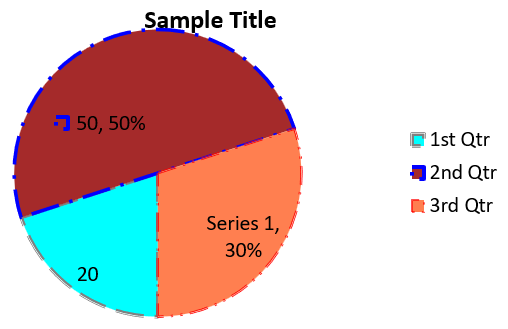

## **अवलोकन**

यह लेख बताता है कि कैसे Aspose.Slides for Python via .NET का उपयोग करके चार्ट बनाएं और अनुकूलित करें। आप सीखेंगे कि स्लाइड में चार्ट कैसे जोड़ें, उसे डेटा से भरें, और अपने डिजाइन आवश्यकताओं के अनुसार फ़ॉर्मेट करें। कोड उदाहरण प्रस्तुति और चार्ट बनाने, सीरीज़, एक्सिस और लेजेंड को कॉन्फ़िगर करने, और अपने एप्लिकेशन में चार्ट जेनरेशन को एकीकृत करने को कवर करते हैं।

## **चार्ट बनाएं**

चार्ट लोगों को डेटा को जल्दी से विज़ुअलाइज़ करने और उन अंतर्दृष्टियों को प्राप्त करने में मदद करते हैं जो तालिका या स्प्रेडशीट से तुरंत स्पष्ट नहीं होते।

**चार्ट क्यों बनाएं?**

चार्ट का उपयोग करके आप:

* प्रस्तुति में एकल स्लाइड पर बड़ी मात्रा में डेटा को संक्षिप्त, संकुचित या सारांशित कर सकते हैं;
* डेटा में पैटर्न और ट्रेंड को उजागर कर सकते हैं;
* समय के साथ या किसी विशिष्ट माप इकाई के संदर्भ में डेटा की दिशा और गति का निष्कर्ष निकाल सकते हैं;
* बाहरी मान, विसंगतियां, विचलन, त्रुटियां और असंगत डेटा को पहचान सकते हैं;
* जटिल डेटा को संप्रेषित या प्रस्तुत कर सकते हैं।

PowerPoint में आप *Insert* फ़ंक्शन के माध्यम से चार्ट बना सकते हैं, जो कई प्रकार के चार्ट डिज़ाइन करने के लिए टेम्प्लेट प्रदान करता है। Aspose.Slides का उपयोग करके आप नियमित चार्ट (लोकप्रिय चार्ट प्रकारों पर आधारित) और कस्टम चार्ट दोनों बना सकते हैं।

{}

[ChartType](https://reference.aspose.com/slides/hi/python-net/aspose.slides.charts/charttype/) एनेमरेशन का उपयोग करें, जो [Aspose.Slides.Charts](https://reference.aspose.com/slides/hi/python-net/aspose.slides.charts/) नेमस्पेस के तहत उपलब्ध है। इस एनेमरेशन के मान विभिन्न चार्ट प्रकारों से मेल खाते हैं।

{}

### **क्लस्टर्ड कॉलम चार्ट बनाएं**

यह अनुभाग Aspose.Slides for Python via .NET का उपयोग करके क्लस्टर्ड कॉलम चार्ट बनाने की प्रक्रिया बताता है। आप प्रस्तुति को इनिशियलाइज़ करना, चार्ट जोड़ना, और शीर्षक, डेटा, सीरीज़, कैटेगिरी और स्टाइल जैसे तत्वों को अनुकूलित करना सीखेंगे। नीचे दिए गए चरणों को फॉलो करके देखें कि एक मानक क्लस्टर्ड कॉलम चार्ट कैसे जनरेट किया जाता है:

1. [Presentation](https://reference.aspose.com/slides/hi/python-net/aspose.slides/presentation/) क्लास का एक इंस्टेंस बनाएं।
1. उसके इंडेक्स का उपयोग करके स्लाइड का रेफ़रेंस प्राप्त करें।
1. कुछ डेटा के साथ एक चार्ट जोड़ें और `ChartType.CLUSTERED_COLUMN` प्रकार निर्दिष्ट करें।
1. चार्ट में एक शीर्षक जोड़ें।
1. चार्ट की डेटा वर्कशीट तक पहुँचें।
1. सभी डिफ़ॉल्ट सीरीज़ और कैटेगिरी को साफ़ करें।
1. नई सीरीज़ और कैटेगिरी जोड़ें।
1. चार्ट सीरीज़ के लिए नया डेटा जोड़ें।
1. चार्ट सीरीज़ पर फ़िल रंग लागू करें।
1. चार्ट सीरीज़ में लेबल जोड़ें।
1. संशोधित प्रस्तुति को PPTX फ़ाइल के रूप में सहेजें।

यह Python कोड क्लस्टर्ड कॉलम चार्ट बनाने का तरीका दर्शाता है:

```py
import aspose.slides.charts as charts
import aspose.slides as slides
import aspose.pydrawing as draw

# PPTX फ़ाइल का प्रतिनिधित्व करने वाली Presentation क्लास का उदाहरण बनाएं।
with slides.Presentation() as presentation:

    # पहली स्लाइड तक पहुँचें।
    slide = presentation.slides[0]

    # डिफ़ॉल्ट डेटा के साथ एक क्लस्टर्ड कॉलम चार्ट जोड़ें।
    chart = slide.shapes.add_chart(charts.ChartType.CLUSTERED_COLUMN, 20, 20, 500, 300)

    # चार्ट शीर्षक सेट करें।
    chart.chart_title.add_text_frame_for_overriding("Sample Title")
    chart.chart_title.text_frame_for_overriding.text_frame_format.center_text = slides.NullableBool.TRUE
    chart.chart_title.height = 20
    chart.has_title = True

    # चार्ट डेटा शीट का इंडेक्स सेट करें।
    worksheet_index = 0

    # चार्ट डेटा वर्कबुक प्राप्त करें।
    workbook = chart.chart_data.chart_data_workbook

    # डिफ़ॉल्ट उत्पन्न सीरीज़ और श्रेणियों को हटाएँ।
    chart.chart_data.series.clear()
    chart.chart_data.categories.clear()

    # नई सीरीज़ जोड़ें।
    chart.chart_data.series.add(workbook.get_cell(worksheet_index, 0, 1, "Series 1"), chart.type)
    chart.chart_data.series.add(workbook.get_cell(worksheet_index, 0, 2, "Series 2"), chart.type)

    # नई श्रेणियाँ जोड़ें।
    chart.chart_data.categories.add(workbook.get_cell(worksheet_index, 1, 0, "Category 1"))
    chart.chart_data.categories.add(workbook.get_cell(worksheet_index, 2, 0, "Category 2"))
    chart.chart_data.categories.add(workbook.get_cell(worksheet_index, 3, 0, "Category 3"))

    # पहली चार्ट सीरीज़ प्राप्त करें।
    series = chart.chart_data.series[0]

    # सीरीज़ डेटा भरें।
    series.data_points.add_data_point_for_bar_series(workbook.get_cell(worksheet_index, 1, 1, 20))
    series.data_points.add_data_point_for_bar_series(workbook.get_cell(worksheet_index, 2, 1, 50))
    series.data_points.add_data_point_for_bar_series(workbook.get_cell(worksheet_index, 3, 1, 30))

    # सीरीज़ के लिए भराव रंग सेट करें।
    series.format.fill.fill_type = slides.FillType.SOLID
    series.format.fill.solid_fill_color.color = draw.Color.red

    # दूसरी चार्ट सीरीज़ प्राप्त करें।
    series = chart.chart_data.series[1]

    # सीरीज़ डेटा भरें।
    series.data_points.add_data_point_for_bar_series(workbook.get_cell(worksheet_index, 1, 2, 30))
    series.data_points.add_data_point_for_bar_series(workbook.get_cell(worksheet_index, 2, 2, 10))
    series.data_points.add_data_point_for_bar_series(workbook.get_cell(worksheet_index, 3, 2, 60))

    # सीरीज़ के लिए भराव रंग सेट करें।
    series.format.fill.fill_type = slides.FillType.SOLID
    series.format.fill.solid_fill_color.color = draw.Color.green

    # पहला लेबल सेट करें ताकि श्रेणी नाम दिखे।
    label = series.data_points[0].label
    label.data_label_format.show_category_name = True

    label = series.data_points[1].label
    label.data_label_format.show_series_name = True

    # तीसरे लेबल के लिए मान दिखाने हेतु सीरीज़ सेट करें।
    label = series.data_points[2].label
    label.data_label_format.show_value = True
    label.data_label_format.show_series_name = True
    label.data_label_format.separator = "/"
                
    # प्रस्तुति को डिस्क पर PPTX फ़ाइल के रूप में सहेजें।
    presentation.save("ClusteredColumnChart.pptx", slides.export.SaveFormat.PPTX)
```

परिणाम:


### **स्कैटर चार्ट बनाएं**

स्कैटर चार्ट (जिसे स्कैटर प्लॉट या x-y ग्राफ भी कहा जाता है) अक्सर दो वेरिएबल्स के बीच पैटर्न या संबंधों की जांच के लिए उपयोग किए जाते हैं।

स्कैटर चार्ट तब उपयोग करें जब:

* आपके पास युग्मित संख्यात्मक डेटा हो।
* दो वेरिएबल्स एक साथ अच्छी तरह से जुड़े हों।
* आप यह निर्धारित करना चाहते हों कि दो वेरिएबल्स संबंधित हैं या नहीं।
* आपके पास एक स्वतंत्र वेरिएबल हो जिसके कई मान एक निर्भर वेरिएबल के लिए हों।

यह Python कोड प्रत्येक सीरीज़ के लिए अलग-अलग मार्कर के साथ स्कैटर चार्ट बनाने को दर्शाता है:

```py
import aspose.slides.charts as charts
import aspose.slides as slides
import aspose.pydrawing as draw

# Presentation क्लास का उदाहरण बनाएं।
with slides.Presentation() as presentation:

    # पहली स्लाइड तक पहुंचें।
    slide = presentation.slides[0]

    # डिफ़ॉल्ट स्कैटर चार्ट बनाएं।
    chart = slide.shapes.add_chart(charts.ChartType.SCATTER_WITH_SMOOTH_LINES, 20, 20, 500, 300)

    # चार्ट डेटा शीट का इंडेक्स सेट करें।
    worksheet_index = 0

    # चार्ट डेटा वर्कबुक प्राप्त करें।
    workbook = chart.chart_data.chart_data_workbook

    # डिफ़ॉल्ट सीरीज़ हटाएँ।
    chart.chart_data.series.clear()

    # नई सीरीज़ जोड़ें।
    chart.chart_data.series.add(workbook.get_cell(worksheet_index, 1, 1, "Series 1"), chart.type)
    chart.chart_data.series.add(workbook.get_cell(worksheet_index, 1, 3, "Series 2"), chart.type)

    # पहली चार्ट सीरीज़ प्राप्त करें।
    series = chart.chart_data.series[0]

    # सीरीज़ में एक नया बिंदु (1:3) जोड़ें।
    series.data_points.add_data_point_for_scatter_series(workbook.get_cell(worksheet_index, 2, 1, 1), workbook.get_cell(worksheet_index, 2, 2, 3))

    # नया बिंदु (2:10) जोड़ें।
    series.data_points.add_data_point_for_scatter_series(workbook.get_cell(worksheet_index, 3, 1, 2), workbook.get_cell(worksheet_index, 3, 2, 10))

    # सीरीज़ प्रकार बदलें।
    series.type = charts.ChartType.SCATTER_WITH_STRAIGHT_LINES_AND_MARKERS

    # चार्ट सीरीज़ मार्कर बदलें।
    series.marker.size = 10
    series.marker.symbol = charts.MarkerStyleType.STAR

    # दूसरी चार्ट सीरीज़ प्राप्त करें।
    series = chart.chart_data.series[1]

    # चार्ट सीरीज़ में नया बिंदु (5:2) जोड़ें।
    series.data_points.add_data_point_for_scatter_series(workbook.get_cell(worksheet_index, 2, 3, 5), workbook.get_cell(worksheet_index, 2, 4, 2))

    # नया बिंदु (3:1) जोड़ें।
    series.data_points.add_data_point_for_scatter_series(workbook.get_cell(worksheet_index, 3, 3, 3), workbook.get_cell(worksheet_index, 3, 4, 1))

    # नया बिंदु (2:2) जोड़ें।
    series.data_points.add_data_point_for_scatter_series(workbook.get_cell(worksheet_index, 4, 3, 2), workbook.get_cell(worksheet_index, 4, 4, 2))

    # नया बिंदु (5:1) जोड़ें।
    series.data_points.add_data_point_for_scatter_series(workbook.get_cell(worksheet_index, 5, 3, 5), workbook.get_cell(worksheet_index, 5, 4, 1))

    # चार्ट सीरीज़ मार्कर बदलें।
    series.marker.size = 10
    series.marker.symbol = charts.MarkerStyleType.CIRCLE

    presentation.save("ScatterChart.pptx", slides.export.SaveFormat.PPTX)
```

परिणाम:


### **पाई चार्ट बनाएं**

पाई चार्ट डेटा में भाग-से-सम्पूर्ण संबंध दिखाने के लिए सबसे उपयुक्त होते हैं, विशेष रूप से जब डेटा में श्रेणीबद्ध लेबल्स के साथ संख्यात्मक मान हों। हालांकि, यदि आपके डेटा में बहुत सारे भाग या लेबल हों, तो आप बार चार्ट का उपयोग करने पर विचार कर सकते हैं।

1. [Presentation](https://reference.aspose.com/slides/hi/python-net/aspose.slides/presentation/) क्लास का एक इंस्टेंस बनाएं।
1. उसके इंडेक्स का उपयोग करके स्लाइड का रेफ़रेंस प्राप्त करें।
1. डिफ़ॉल्ट डेटा के साथ एक चार्ट जोड़ें और `ChartType.PIE` प्रकार निर्दिष्ट करें।
1. चार्ट की डेटा वर्कबुक ([ChartDataWorkbook](https://reference.aspose.com/slides/hi/python-net/aspose.slides.charts/chartdataworkbook/)) तक पहुँचें।
1. डिफ़ॉल्ट सीरीज़ और कैटेगिरी को साफ़ करें।
1. नई सीरीज़ और कैटेगिरी जोड़ें।
1. चार्ट सीरीज़ के लिए नया डेटा जोड़ें।
1. चार्ट में नए पॉइंट जोड़ें और पाई चार्ट की सेक्टर को कस्टम रंग लागू करें।
1. सीरीज़ के लिए लेबल सेट करें।
1. सीरीज़ लेबल के लिए लीडर लाइन्स सक्षम करें।
1. पाई चार्ट का रोटेशन एंगल सेट करें।
1. संशोधित प्रस्तुति को PPTX फ़ाइल के रूप में सहेजें।

यह Python कोड पाई चार्ट बनाने का तरीका दिखाता है:

```py
import aspose.slides.charts as charts
import aspose.slides as slides
import aspose.pydrawing as draw

# PPTX फ़ाइल का प्रतिनिधित्व करने वाली Presentation क्लास का उदाहरण बनाएं।
with slides.Presentation() as presentation:

    # पहली स्लाइड तक पहुँचें।
    slide = presentation.slides[0]

    # डिफ़ॉल्ट डेटा के साथ एक चार्ट जोड़ें।
    chart = slide.shapes.add_chart(charts.ChartType.PIE, 20, 20, 500, 300)

    # चार्ट शीर्षक सेट करें।
    chart.chart_title.add_text_frame_for_overriding("Sample Title")
    chart.chart_title.text_frame_for_overriding.text_frame_format.center_text = slides.NullableBool.TRUE
    chart.chart_title.height = 20
    chart.has_title = True

    # चार्ट डेटा शीट का इंडेक्स सेट करें।
    worksheet_index = 0

    # चार्ट डेटा वर्कबुक प्राप्त करें।
    workbook = chart.chart_data.chart_data_workbook

    # डिफ़ॉल्ट उत्पन्न सीरीज़ और श्रेणियों को हटाएँ।
    chart.chart_data.series.clear()
    chart.chart_data.categories.clear()

    # नई श्रेणियाँ जोड़ें।
    chart.chart_data.categories.add(workbook.get_cell(0, 1, 0, "First Qtr"))
    chart.chart_data.categories.add(workbook.get_cell(0, 2, 0, "2nd Qtr"))
    chart.chart_data.categories.add(workbook.get_cell(0, 3, 0, "3rd Qtr"))

    # नई सीरीज़ जोड़ें।
    series = chart.chart_data.series.add(workbook.get_cell(0, 0, 1, "Series 1"), chart.type)

    # सीरीज़ डेटा भरें।
    series.data_points.add_data_point_for_pie_series(workbook.get_cell(worksheet_index, 1, 1, 20))
    series.data_points.add_data_point_for_pie_series(workbook.get_cell(worksheet_index, 2, 1, 50))
    series.data_points.add_data_point_for_pie_series(workbook.get_cell(worksheet_index, 3, 1, 30))

    # सेक्टर का रंग सेट करें।
    chart.chart_data.series_groups[0].is_color_varied = True

    point = series.data_points[0]
    point.format.fill.fill_type = slides.FillType.SOLID
    point.format.fill.solid_fill_color.color = draw.Color.cyan

    # सेक्टर की बॉर्डर सेट करें।
    point.format.line.fill_format.fill_type = slides.FillType.SOLID
    point.format.line.fill_format.solid_fill_color.color = draw.Color.gray
    point.format.line.width = 3.0
    point.format.line.style = slides.LineStyle.THIN_THICK
    point.format.line.dash_style = slides.LineDashStyle.DASH_DOT

    point1 = series.data_points[1]
    point1.format.fill.fill_type = slides.FillType.SOLID
    point1.format.fill.solid_fill_color.color = draw.Color.brown

    # सेक्टर की बॉर्डर सेट करें।
    point1.format.line.fill_format.fill_type = slides.FillType.SOLID
    point1.format.line.fill_format.solid_fill_color.color = draw.Color.blue
    point1.format.line.width = 3.0
    point1.format.line.style = slides.LineStyle.SINGLE
    point1.format.line.dash_style = slides.LineDashStyle.LARGE_DASH_DOT

    point2 = series.data_points[2]
    point2.format.fill.fill_type = slides.FillType.SOLID
    point2.format.fill.solid_fill_color.color = draw.Color.coral

    # सेक्टर की बॉर्डर सेट करें।
    point2.format.line.fill_format.fill_type = slides.FillType.SOLID
    point2.format.line.fill_format.solid_fill_color.color = draw.Color.red
    point2.format.line.width = 2.0
    point2.format.line.style = slides.LineStyle.THIN_THIN
    point2.format.line.dash_style = slides.LineDashStyle.LARGE_DASH_DOT_DOT

    # नई सीरीज़ में प्रत्येक श्रेणी के लिए कस्टम लेबल बनाएं।
    label1 = series.data_points[0].label

    label1.data_label_format.show_value = True

    label2 = series.data_points[1].label
    label2.data_label_format.show_value = True
    label2.data_label_format.show_legend_key = True
    label2.data_label_format.show_percentage = True

    label3 = series.data_points[2].label
    label3.data_label_format.show_series_name = True
    label3.data_label_format.show_percentage = True

    # चार्ट के लिए लीडर लाइन्स दिखाने हेतु सीरीज़ सेट करें।
    series.labels.default_data_label_format.show_leader_lines = True

    # पाई चार्ट सेक्टरों के लिए रोटेशन एंगल सेट करें।
    chart.chart_data.series_groups[0].first_slice_angle = 180

    # प्रस्तुति को डिस्क पर PPTX फ़ाइल के रूप में सहेजें।
    presentation.save("PieChart.pptx", slides.export.SaveFormat.PPTX)
```

परिणाम:



### **लाइन चार्ट बनाएं**

लाइन चार्ट (जिसे लाइन ग्राफ भी कहा जाता है) उन स्थितियों में उपयोग किए जाते हैं जहाँ आप समय के साथ मूल्य परिवर्तन दिखाना चाहते हैं। लाइन चार्ट का उपयोग करके आप एक साथ बड़ी मात्रा में डेटा की तुलना कर सकते हैं, समय के साथ परिवर्तन और ट्रेंड को ट्रैक कर सकते हैं, डेटा सीरीज़ में विसंगतियों को उजागर कर सकते हैं, आदि।

1. [Presentation](https://reference.aspose.com/slides/hi/python-net/aspose.slides/presentation/) क्लास का एक इंस्टेंस बनाएं।
1. उसके इंडेक्स का उपयोग करके स्लाइड का रेफ़रेंस प्राप्त करें।
1. डिफ़ॉल्ट डेटा के साथ एक चार्ट जोड़ें और `ChartType.LINE` प्रकार निर्दिष्ट करें।
1. संशोधित प्रस्तुति को PPTX फ़ाइल के रूप में सहेजें।

यह Python कोड लाइन चार्ट बनाने का उदाहरण है:

```python
import aspose.slides as slides

with slides.Presentation() as presentation:
    line_chart = presentation.slides[0].shapes.add_chart(slides.charts.ChartType.LINE, 20, 20, 500, 300)
    
    presentation.save("LineChart.pptx", slides.export.SaveFormat.PPTX)
```

डिफ़ॉल्ट रूप से, लाइन चार्ट में पॉइंट्स को सीधी निरंतर रेखाओं से जोड़ा जाता है। यदि आप पॉइंट्स को डैश द्वारा जोड़ना चाहते हैं, तो आप अपनी पसंद के डैश प्रकार को इस प्रकार निर्दिष्ट कर सकते हैं:

```python
import aspose.slides as slides

with slides.Presentation() as presentation:
    line_chart = presentation.slides[0].shapes.add_chart(slides.charts.ChartType.LINE, 10, 50, 600, 350)

    for series in line_chart.chart_data.series:
        series.format.line.dash_style = slides.LineDashStyle.DASH

    presentation.save("LineChart.pptx", slides.export.SaveFormat.PPTX)
```

परिणाम:


### **ट्री मैप चार्ट बनाएं**

ट्री मैप चार्ट उन स्थितियों में सबसे उपयुक्त होते हैं जहाँ आप बिक्री डेटा को प्रदर्शित करना चाहते हैं और प्रत्येक श्रेणी के भीतर बड़े योगदानकर्ताओं को जल्दी से उजागर करना चाहते हैं।

1. [Presentation](https://reference.aspose.com/slides/hi/python-net/aspose.slides/presentation/) क्लास का एक इंस्टेंस बनाएं।
1. उसके इंडेक्स का उपयोग करके स्लाइड का रेफ़रेंस प्राप्त करें।
1. डिफ़ॉल्ट डेटा के साथ एक चार्ट जोड़ें और `ChartType.TREEMAP` प्रकार निर्दिष्ट करें।
1. चार्ट की डेटा वर्कबुक ([ChartDataWorkbook](https://reference.aspose.com/slides/hi/python-net/aspose.slides.charts/chartdataworkbook/)) तक पहुँचें।
1. डिफ़ॉल्ट सीरीज़ और कैटेगिरी को साफ़ करें।
1. नई सीरीज़ और कैटेगिरी जोड़ें।
1. चार्ट सीरीज़ के लिए नया डेटा जोड़ें।
1. संशोधित प्रस्तुति को PPTX फ़ाइल के रूप में सहेजें।

यह Python कोड ट्री मैप चार्ट बनाने को दर्शाता है:

```py
import aspose.slides.charts as charts
import aspose.slides as slides
import aspose.pydrawing as draw

with slides.Presentation() as presentation:
    chart = presentation.slides[0].shapes.add_chart(charts.ChartType.TREEMAP, 20, 20, 500, 300)
    chart.chart_data.categories.clear()
    chart.chart_data.series.clear()

    workbook = chart.chart_data.chart_data_workbook
    workbook.clear(0)

    # शाखा 1
    leaf = chart.chart_data.categories.add(workbook.get_cell(0, "C1", "Leaf1"))
    leaf.grouping_levels.set_grouping_item(1, "Stem1")
    leaf.grouping_levels.set_grouping_item(2, "Branch1")

    chart.chart_data.categories.add(workbook.get_cell(0, "C2", "Leaf2"))

    leaf = chart.chart_data.categories.add(workbook.get_cell(0, "C3", "Leaf3"))
    leaf.grouping_levels.set_grouping_item(1, "Stem2")

    chart.chart_data.categories.add(workbook.get_cell(0, "C4", "Leaf4"))

    # शाखा 2
    leaf = chart.chart_data.categories.add(workbook.get_cell(0, "C5", "Leaf5"))
    leaf.grouping_levels.set_grouping_item(1, "Stem3")
    leaf.grouping_levels.set_grouping_item(2, "Branch2")

    chart.chart_data.categories.add(workbook.get_cell(0, "C6", "Leaf6"))

    leaf = chart.chart_data.categories.add(workbook.get_cell(0, "C7", "Leaf7"))
    leaf.grouping_levels.set_grouping_item(1, "Stem4")

    chart.chart_data.categories.add(workbook.get_cell(0, "C8", "Leaf8"))

    series = chart.chart_data.series.add(charts.ChartType.TREEMAP)
    series.labels.default_data_label_format.show_category_name = True
    series.data_points.add_data_point_for_treemap_series(workbook.get_cell(0, "D1", 4))
    series.data_points.add_data_point_for_treemap_series(workbook.get_cell(0, "D2", 5))
    series.data_points.add_data_point_for_treemap_series(workbook.get_cell(0, "D3", 3))
    series.data_points.add_data_point_for_treemap_series(workbook.get_cell(0, "D4", 6))
    series.data_points.add_data_point_for_treemap_series(workbook.get_cell(0, "D5", 9))
    series.data_points.add_data_point_for_treemap_series(workbook.get_cell(0, "D6", 9))
    series.data_points.add_data_point_for_treemap_series(workbook.get_cell(0, "D7", 4))
    series.data_points.add_data_point_for_treemap_series(workbook.get_cell(0, "D8", 3))

    series.parent_label_layout = charts.ParentLabelLayoutType.OVERLAPPING

    presentation.save("TreeMap.pptx", slides.export.SaveFormat.PPTX)
```

परिणाम:


### **स्टॉक चार्ट बनाएं**

स्टॉक चार्ट वित्तीय डेटा जैसे ओपन, हाई, लो और क्लोज़ प्राइसेज को प्रदर्शित करने के लिए उपयोग किए जाते हैं, जिससे बाजार ट्रेंड और वोलैटिलिटी का विश्लेषण किया जा सके। ये चार्ट स्टॉक प्रदर्शन पर महत्वपूर्ण अंतर्दृष्टि प्रदान करते हैं, जिससे निवेशकों और विश्लेषकों को सूचित निर्णय लेने में सहायता मिलती है।

1. [Presentation](https://reference.aspose.com/slides/hi/python-net/aspose.slides/presentation/) क्लास का एक इंस्टेंस बनाएं।
1. उसके इंडेक्स का उपयोग करके स्लाइड का रेफ़रेंस प्राप्त करें।
1. डिफ़ॉल्ट डेटा के साथ एक चार्ट जोड़ें और `ChartType.OPEN_HIGH_LOW_CLOSE` प्रकार निर्दिष्ट करें।
1. चार्ट की डेटा वर्कबुक ([ChartDataWorkbook](https://reference.aspose.com/slides/hi/python-net/aspose.slides.charts/chartdataworkbook/)) तक पहुँचें।
1. डिफ़ॉल्ट सीरीज़ और कैटेगिरी को साफ़ करें।
1. नई सीरीज़ और कैटेगिरी जोड़ें।
1. चार्ट सीरीज़ के लिए नया डेटा जोड़ें।
1. हाई-लो लाइन्स फ़ॉर्मेट निर्दिष्ट करें।
1. संशोधित प्रस्तुति को PPTX फ़ाइल के रूप में सहेजें।

यह Python कोड स्टॉक चार्ट बनाने को दिखाता है:

```py
import aspose.slides.charts as charts
import aspose.slides as slides
import aspose.pydrawing as draw

with slides.Presentation() as presentation:
    chart = presentation.slides[0].shapes.add_chart(charts.ChartType.OPEN_HIGH_LOW_CLOSE, 20, 20, 500, 300, False)

    chart.chart_data.series.clear()
    chart.chart_data.categories.clear()

    workbook = chart.chart_data.chart_data_workbook

    chart.chart_data.categories.add(workbook.get_cell(0, 1, 0, "A"))
    chart.chart_data.categories.add(workbook.get_cell(0, 2, 0, "B"))
    chart.chart_data.categories.add(workbook.get_cell(0, 3, 0, "C"))

    chart.chart_data.series.add(workbook.get_cell(0, 0, 1, "Open"), chart.type)
    chart.chart_data.series.add(workbook.get_cell(0, 0, 2, "High"), chart.type)
    chart.chart_data.series.add(workbook.get_cell(0, 0, 3, "Low"), chart.type)
    chart.chart_data.series.add(workbook.get_cell(0, 0, 4, "Close"), chart.type)

    series = chart.chart_data.series[0]

    series.data_points.add_data_point_for_stock_series(workbook.get_cell(0, 1, 1, 72))
    series.data_points.add_data_point_for_stock_series(workbook.get_cell(0, 2, 1, 25))
    series.data_points.add_data_point_for_stock_series(workbook.get_cell(0, 3, 1, 38))

    series = chart.chart_data.series[1]
    series.data_points.add_data_point_for_stock_series(workbook.get_cell(0, 1, 2, 172))
    series.data_points.add_data_point_for_stock_series(workbook.get_cell(0, 2, 2, 57))
    series.data_points.add_data_point_for_stock_series(workbook.get_cell(0, 3, 2, 57))

    series = chart.chart_data.series[2]
    series.data_points.add_data_point_for_stock_series(workbook.get_cell(0, 1, 3, 12))
    series.data_points.add_data_point_for_stock_series(workbook.get_cell(0, 2, 3, 12))
    series.data_points.add_data_point_for_stock_series(workbook.get_cell(0, 3, 3, 13))

    series = chart.chart_data.series[3]
    series.data_points.add_data_point_for_stock_series(workbook.get_cell(0, 1, 4, 25))
    series.data_points.add_data_point_for_stock_series(workbook.get_cell(0, 2, 4, 38))
    series.data_points.add_data_point_for_stock_series(workbook.get_cell(0, 3, 4, 50))

    chart.chart_data.series_groups[0].up_down_bars.has_up_down_bars = True
    chart.chart_data.series_groups[0].hi_low_lines_format.line.fill_format.fill_type = slides.FillType.SOLID

    for ser in chart.chart_data.series:
        ser.format.line.fill_format.fill_type = slides.FillType.NO_FILL

    presentation.save("StockChart.pptx", slides.export.SaveFormat.PPTX)
```

परिणाम:


### **बॉक्स और whisker चार्ट बनाएं**

बॉक्स और whisker चार्ट डेटा वितरण को दर्शाते हैं, जिसमें माध्यिका, क्वार्टाइल और संभावित बाहरी मान जैसे प्रमुख सांख्यिकीय माप शामिल होते हैं। ये अन्वेषी डेटा विश्लेषण और सांख्यिकीय अध्ययनों में डेटा वैरिएबिलिटी को जल्दी समझने और विसंगतियों की पहचान करने में उपयोगी होते हैं।

1. [Presentation](https://reference.aspose.com/slides/hi/python-net/aspose.slides/presentation/) क्लास का एक इंस्टेंस बनाएं।
1. उसके इंडेक्स का उपयोग करके स्लाइड का रेफ़रेंस प्राप्त करें।
1. डिफ़ॉल्ट डेटा के साथ एक चार्ट जोड़ें और `ChartType.BOX_AND_WHISKER` प्रकार निर्दिष्ट करें।
1. चार्ट की डेटा वर्कबुक ([ChartDataWorkbook](https://reference.aspose.com/slides/hi/python-net/aspose.slides.charts/chartdataworkbook/)) तक पहुँचें।
1. डिफ़ॉल्ट सीरीज़ और कैटेगिरी को साफ़ करें।
1. नई सीरीज़ और कैटेगिरी जोड़ें।
1. चार्ट सीरीज़ के लिए नया डेटा जोड़ें।
1. संशोधित प्रस्तुति को PPTX फ़ाइल के रूप में सहेजें।

यह Python कोड बॉक्स और whisker चार्ट बनाने को प्रदर्शित करता है:

```py
import aspose.slides.charts as charts
import aspose.slides as slides
import aspose.pydrawing as draw

with slides.Presentation() as presentation:
    chart = presentation.slides[0].shapes.add_chart(charts.ChartType.BOX_AND_WHISKER, 20, 20, 500, 300)
    chart.chart_data.categories.clear()
    chart.chart_data.series.clear()

    workbook = chart.chart_data.chart_data_workbook
    workbook.clear(0)

    chart.chart_data.categories.add(workbook.get_cell(0, "A1", "Category 1"))
    chart.chart_data.categories.add(workbook.get_cell(0, "A2", "Category 1"))
    chart.chart_data.categories.add(workbook.get_cell(0, "A3", "Category 1"))
    chart.chart_data.categories.add(workbook.get_cell(0, "A4", "Category 1"))
    chart.chart_data.categories.add(workbook.get_cell(0, "A5", "Category 1"))
    chart.chart_data.categories.add(workbook.get_cell(0, "A6", "Category 1"))

    series = chart.chart_data.series.add(charts.ChartType.BOX_AND_WHISKER)

    series.quartile_method = charts.QuartileMethodType.EXCLUSIVE
    series.show_mean_line = True
    series.show_mean_markers = True
    series.show_inner_points = True
    series.show_outlier_points = True

    series.data_points.add_data_point_for_box_and_whisker_series(workbook.get_cell(0, "B1", 15))
    series.data_points.add_data_point_for_box_and_whisker_series(workbook.get_cell(0, "B2", 41))
    series.data_points.add_data_point_for_box_and_whisker_series(workbook.get_cell(0, "B3", 16))
    series.data_points.add_data_point_for_box_and_whisker_series(workbook.get_cell(0, "B4", 10))
    series.data_points.add_data_point_for_box_and_whisker_series(workbook.get_cell(0, "B5", 23))
    series.data_points.add_data_point_for_box_and_whisker_series(workbook.get_cell(0, "B6", 16))

    presentation.save("BoxAndWhiskerChart.pptx", slides.export.SaveFormat.PPTX)
```

### **फ़नल चार्ट बनाएं**

फ़नल चार्ट उन प्रक्रियाओं को विज़ुअलाइज़ करने के लिए उपयोग किए जाते हैं जिनमें क्रमिक चरण होते हैं, जहाँ डेटा की मात्रा एक चरण से अगले चरण तक घटती है। ये चार्ट रूपांतरण दरों का विश्लेषण, बॉटलनैक की पहचान, और बिक्री या मार्केटिंग प्रक्रियाओं की दक्षता को ट्रैक करने में मददगार होते हैं।

1. [Presentation](https://reference.aspose.com/slides/hi/python-net/aspose.slides/presentation/) क्लास का एक इंस्टेंस बनाएं।
1. उसके इंडेक्स का उपयोग करके स्लाइड का रेफ़रेंस प्राप्त करें।
1. डिफ़ॉल्ट डेटा के साथ एक चार्ट जोड़ें और `ChartType.FUNNEL` प्रकार निर्दिष्ट करें।
1. संशोधित प्रस्तुति को PPTX फ़ाइल के रूप में सहेजें।

यह Python कोड फ़नल चार्ट बनाने को दर्शाता है:

```py
import aspose.slides.charts as charts
import aspose.slides as slides
import aspose.pydrawing as draw

with slides.Presentation() as presentation:
    chart = presentation.slides[0].shapes.add_chart(charts.ChartType.FUNNEL, 50, 50, 500, 400)
    chart.chart_data.categories.clear()
    chart.chart_data.series.clear()

    workbook = chart.chart_data.chart_data_workbook
    workbook.clear(0)

    chart.chart_data.categories.add(workbook.get_cell(0, "A1", "Category 1"))
    chart.chart_data.categories.add(workbook.get_cell(0, "A2", "Category 2"))
    chart.chart_data.categories.add(workbook.get_cell(0, "A3", "Category 3"))
    chart.chart_data.categories.add(workbook.get_cell(0, "A4", "Category 4"))
    chart.chart_data.categories.add(workbook.get_cell(0, "A5", "Category 5"))
    chart.chart_data.categories.add(workbook.get_cell(0, "A6", "Category 6"))

    series = chart.chart_data.series.add(charts.ChartType.FUNNEL)

    series.data_points.add_data_point_for_funnel_series(workbook.get_cell(0, "B1", 50))
    series.data_points.add_data_point_for_funnel_series(workbook.get_cell(0, "B2", 100))
    series.data_points.add_data_point_for_funnel_series(workbook.get_cell(0, "B3", 200))
    series.data_points.add_data_point_for_funnel_series(workbook.get_cell(0, "B4", 300))
    series.data_points.add_data_point_for_funnel_series(workbook.get_cell(0, "B5", 400))
    series.data_points.add_data_point_for_funnel_series(workbook.get_cell(0, "B6", 500))

    presentation.save("FunnelChart.pptx", slides.export.SaveFormat.PPTX)
```

परिणाम:


### **सनबर्स्ट चार्ट बनाएं**

सनबर्स्ट चार्ट पदानुक्रमित डेटा को विज़ुअलाइज़ करने के लिए उपयोग किए जाते हैं, जहाँ स्तरों को गोलाकार रिंग्स के रूप में दर्शाया जाता है। ये भाग-से-सम्पूर्ण संबंधों को स्पष्ट और संक्षिप्त रूप में प्रदर्शित करने में मदद करते हैं, विशेषकर नेस्टेड श्रेणियों के लिए।

1. [Presentation](https://reference.aspose.com/slides/hi/python-net/aspose.slides/presentation/) क्लास का एक इंस्टेंस बनाएं।
1. उसके इंडेक्स का उपयोग करके स्लाइड का रेफ़रेंस प्राप्त करें।
1. डिफ़ॉल्ट डेटा के साथ एक चार्ट जोड़ें और `ChartType.SUNBURST` प्रकार निर्दिष्ट करें।
1. संशोधित प्रस्तुति को PPTX फ़ाइल के रूप में सहेजें।

यह Python कोड सनबर्स्ट चार्ट बनाने को दिखाता है:

```py
import aspose.slides.charts as charts
import aspose.slides as slides
import aspose.pydrawing as draw

with slides.Presentation() as presentation:
    chart = presentation.slides[0].shapes.add_chart(charts.ChartType.SUNBURST, 20, 20, 500, 300)
    chart.chart_data.categories.clear()
    chart.chart_data.series.clear()

    workbook = chart.chart_data.chart_data_workbook
    workbook.clear(0)

    # शाखा 1
    leaf = chart.chart_data.categories.add(workbook.get_cell(0, "C1", "Leaf1"))
    leaf.grouping_levels.set_grouping_item(1, "Stem1")
    leaf.grouping_levels.set_grouping_item(2, "Branch1")

    chart.chart_data.categories.add(workbook.get_cell(0, "C2", "Leaf2"))

    leaf = chart.chart_data.categories.add(workbook.get_cell(0, "C3", "Leaf3"))
    leaf.grouping_levels.set_grouping_item(1, "Stem2")

    chart.chart_data.categories.add(workbook.get_cell(0, "C4", "Leaf4"))

    # शाखा 2
    leaf = chart.chart_data.categories.add(workbook.get_cell(0, "C5", "Leaf5"))
    leaf.grouping_levels.set_grouping_item(1, "Stem3")
    leaf.grouping_levels.set_grouping_item(2, "Branch2")

    chart.chart_data.categories.add(workbook.get_cell(0, "C6", "Leaf6"))

    leaf = chart.chart_data.categories.add(workbook.get_cell(0, "C7", "Leaf7"))
    leaf.grouping_levels.set_grouping_item(1, "Stem4")

    chart.chart_data.categories.add(workbook.get_cell(0, "C8", "Leaf8"))

    series = chart.chart_data.series.add(charts.ChartType.SUNBURST)
    series.labels.default_data_label_format.show_category_name = True
    series.data_points.add_data_point_for_sunburst_series(workbook.get_cell(0, "D1", 4))
    series.data_points.add_data_point_for_sunburst_series(workbook.get_cell(0, "D2", 5))
    series.data_points.add_data_point_for_sunburst_series(workbook.get_cell(0, "D3", 3))
    series.data_points.add_data_point_for_sunburst_series(workbook.get_cell(0, "D4", 6))
    series.data_points.add_data_point_for_sunburst_series(workbook.get_cell(0, "D5", 9))
    series.data_points.add_data_point_for_sunburst_series(workbook.get_cell(0, "D6", 9))
    series.data_points.add_data_point_for_sunburst_series(workbook.get_cell(0, "D7", 4))
    series.data_points.add_data_point_for_sunburst_series(workbook.get_cell(0, "D8", 3))

    presentation.save("SunburstChart.pptx", slides.export.SaveFormat.PPTX)
```

परिणाम:


### **हिस्टोग्राम चार्ट बनाएं**

हिस्टोग्राम चार्ट संख्यात्मक डेटा के वितरण को रेंज या बिन में समूहित करके प्रदर्शित करते हैं। ये डेटा पैटर्न जैसे फ़्रीक्वेंसी, स्क्यूनेस और प्रसार को पहचानने, तथा डेटा सेट में बाहरी मानों को खोजने में विशेष रूप से उपयोगी होते हैं।

1. [Presentation](https://reference.aspose.com/slides/hi/python-net/aspose.slides/presentation/) क्लास का एक इंस्टेंस बनाएं।
1. उसके इंडेक्स का उपयोग करके स्लाइड का रेफ़रेंस प्राप्त करें।
1. कुछ डेटा के साथ एक चार्ट जोड़ें और `ChartType.HISTOGRAM` प्रकार निर्दिष्ट करें।
1. चार्ट डेटा वर्कबुक ([ChartDataWorkbook](https://reference.aspose.com/slides/hi/python-net/aspose.slides.charts/chartdataworkbook/)) तक पहुँचें।
1. डिफ़ॉल्ट सीरीज़ और कैटेगिरी को साफ़ करें।
1. एक नई सीरीज़ जोड़ें और उसे डेटा पॉइंट्स से भरें। हिस्टोग्राम में कोई कैटेगिरी नहीं होती; बिन्स मानों से गणना किए जाते हैं।
1. संशोधित प्रस्तुति को PPTX फ़ाइल के रूप में सहेजें।

यह Python कोड हिस्टोग्राम चार्ट बनाने को दर्शाता है:

```py
import aspose.slides.charts as charts
import aspose.slides as slides
import aspose.pydrawing as draw

with slides.Presentation() as presentation:
    chart = presentation.slides[0].shapes.add_chart(charts.ChartType.HISTOGRAM, 20, 20, 500, 300)
    chart.chart_data.categories.clear()
    chart.chart_data.series.clear()

    workbook = chart.chart_data.chart_data_workbook
    workbook.clear(0)

    series = chart.chart_data.series.add(charts.ChartType.HISTOGRAM)
    series.data_points.add_data_point_for_histogram_series(workbook.get_cell(0, "A1", 15))
    series.data_points.add_data_point_for_histogram_series(workbook.get_cell(0, "A2", -41))
    series.data_points.add_data_point_for_histogram_series(workbook.get_cell(0, "A3", 16))
    series.data_points.add_data_point_for_histogram_series(workbook.get_cell(0, "A4", 10))
    series.data_points.add_data_point_for_histogram_series(workbook.get_cell(0, "A5", -23))
    series.data_points.add_data_point_for_histogram_series(workbook.get_cell(0, "A6", 16))

    chart.axes.horizontal_axis.aggregation_type = charts.AxisAggregationType.AUTOMATIC

    presentation.save("HistogramChart.pptx", slides.export.SaveFormat.PPTX)
```

परिणाम:


### **रेडार चार्ट बनाएं**

रेडार चार्ट मल्टीवेरिएट डेटा को दो‑आयामी स्वरूप में प्रदर्शित करते हैं, जिससे कई वेरिएबल्स की एक साथ तुलना आसान हो जाती है। ये कई प्रदर्शन मीट्रिक या विशेषताओं के बीच पैटर्न, ताकत और कमजोरियों की पहचान करने में विशेष रूप से उपयोगी होते हैं।

1. [Presentation](https://reference.aspose.com/slides/hi/python-net/aspose.slides/presentation/) क्लास का एक इंस्टेंस बनाएं।
1. उसके इंडेक्स का उपयोग करके स्लाइड का रेफ़रेंस प्राप्त करें।
1. कुछ डेटा के साथ एक चार्ट जोड़ें और `ChartType.RADAR` प्रकार निर्दिष्ट करें।
1. संशोधित प्रस्तुति को PPTX फ़ाइल के रूप में सहेजें।

यह Python कोड रेडार चार्ट बनाने का उदाहरण है:

```python
import aspose.slides as slides

with slides.Presentation() as presentation:
    presentation.slides[0].shapes.add_chart(slides.charts.ChartType.RADAR, 20, 20, 500, 300)
    presentation.save("RadarChart.pptx", slides.export.SaveFormat.PPTX)
```

परिणाम:


### **मल्टी‑कैटेगोरी चार्ट बनाएं**

मल्टी‑कैटेगोरी चार्ट उन डेटा को प्रदर्शित करने के लिए उपयोग किए जाते हैं जिसमें एक से अधिक श्रेणीबद्ध समूह शामिल होते हैं, जिससे आप एक साथ कई आयामों में मानों की तुलना कर सकें। ये जटिल, बहु‑स्तरीय डेटा सेट में ट्रेंड और संबंधों के विश्लेषण में विशेष रूप से सहायक होते हैं।

1. [Presentation](https://reference.aspose.com/slides/hi/python-net/aspose.slides/presentation/) क्लास का एक इंस्टेंस बनाएं।
1. उसके इंडेक्स का उपयोग करके स्लाइड का रेफ़रेंस प्राप्त करें।
1. डिफ़ॉल्ट डेटा के साथ एक चार्ट जोड़ें और `ChartType.CLUSTERED_COLUMN` प्रकार निर्दिष्ट करें।
1. चार्ट की डेटा वर्कबुक ([ChartDataWorkbook](https://reference.aspose.com/slides/hi/python-net/aspose.slides.charts/chartdataworkbook/)) तक पहुँचें।
1. डिफ़ॉल्ट सीरीज़ और कैटेगिरी को साफ़ करें।
1. नई सीरीज़ और कैटेगिरी जोड़ें।
1. चार्ट सीरीज़ के लिए नया डेटा जोड़ें।
1. संशोधित प्रस्तुति को PPTX फ़ाइल के रूप में सहेजें।

यह Python कोड मल्टी‑कैटेगोरी चार्ट बनाने को दिखाता है:

```py
import aspose.slides.charts as charts
import aspose.slides as slides
import aspose.pydrawing as draw

with slides.Presentation() as presentation:
    slide = presentation.slides[0]

    chart = presentation.slides[0].shapes.add_chart(charts.ChartType.CLUSTERED_COLUMN, 20, 20, 500, 300)
    chart.chart_data.series.clear()
    chart.chart_data.categories.clear()

    workbook = chart.chart_data.chart_data_workbook
    workbook.clear(0)

    worksheet_index = 0

    category = chart.chart_data.categories.add(workbook.get_cell(0, "c2", "A"))
    category.grouping_levels.set_grouping_item(1, "Group1")
    category = chart.chart_data.categories.add(workbook.get_cell(0, "c3", "B"))

    category = chart.chart_data.categories.add(workbook.get_cell(0, "c4", "C"))
    category.grouping_levels.set_grouping_item(1, "Group2")
    category = chart.chart_data.categories.add(workbook.get_cell(0, "c5", "D"))

    category = chart.chart_data.categories.add(workbook.get_cell(0, "c6", "E"))
    category.grouping_levels.set_grouping_item(1, "Group3")
    category = chart.chart_data.categories.add(workbook.get_cell(0, "c7", "F"))

    category = chart.chart_data.categories.add(workbook.get_cell(0, "c8", "G"))
    category.grouping_levels.set_grouping_item(1, "Group4")
    category = chart.chart_data.categories.add(workbook.get_cell(0, "c9", "H"))

    # सीरीज़ जोड़ें।
    series = chart.chart_data.series.add(workbook.get_cell(0, "D1", "Series 1"), charts.ChartType.CLUSTERED_COLUMN)

    series.data_points.add_data_point_for_bar_series(workbook.get_cell(worksheet_index, "D2", 10))
    series.data_points.add_data_point_for_bar_series(workbook.get_cell(worksheet_index, "D3", 20))
    series.data_points.add_data_point_for_bar_series(workbook.get_cell(worksheet_index, "D4", 30))
    series.data_points.add_data_point_for_bar_series(workbook.get_cell(worksheet_index, "D5", 40))
    series.data_points.add_data_point_for_bar_series(workbook.get_cell(worksheet_index, "D6", 50))
    series.data_points.add_data_point_for_bar_series(workbook.get_cell(worksheet_index, "D7", 60))
    series.data_points.add_data_point_for_bar_series(workbook.get_cell(worksheet_index, "D8", 70))
    series.data_points.add_data_point_for_bar_series(workbook.get_cell(worksheet_index, "D9", 80))

    # चार्ट के साथ प्रस्तुति सहेजें।
    presentation.save("MultiCategoryChart.pptx", slides.export.SaveFormat.PPTX)
```

परिणाम:


### **मैप चार्ट बनाएं**

मैप चार्ट भौगोलिक डेटा को विशिष्ट स्थानों (जैसे देशों, राज्यों या शहरों) पर मैप करके विज़ुअलाइज़ करने के लिए उपयोग किए जाते हैं। ये क्षेत्रीय ट्रेंड, जनसांख्यिकीय डेटा और स्थानिक वितरण को स्पष्ट और आकर्षक तरीके से विश्लेषण करने में विशेष रूप से उपयोगी होते हैं।

यह Python कोड मैप चार्ट बनाने को दर्शाता है:

```python
import aspose.slides as slides

with slides.Presentation() as presentation:
    chart = presentation.slides[0].shapes.add_chart(slides.charts.ChartType.MAP, 20, 20, 500, 300)
    presentation.save("mapChart.pptx", slides.export.SaveFormat.PPTX)
```

परिणाम:


### **कंबिनेशन चार्ट बनाएं**

कंबिनेशन चार्ट (या कॉम्बो चार्ट) एक ही ग्राफ़ में दो या अधिक चार्ट प्रकारों को एक साथ जोड़ता है। इस चार्ट से आप दो या अधिक डेटा सेटों के बीच अंतर को उजागर, तुलना या जाँच सकते हैं, जिससे उनके बीच के संबंधों को पहचानना आसान हो जाता है।


नीचे दिया गया Python कोड ऊपर दिखाए गए कंबिनेशन चार्ट को PowerPoint प्रस्तुति में बनाने का तरीका दिखाता है:

```python
import aspose.slides.charts as charts
import aspose.pydrawing as draw
import aspose.slides as slides

def create_combo_chart():
    with slides.Presentation() as presentation:
        chart = create_chart_with_first_series(presentation.slides[0])

        add_second_series_to_chart(chart)
        add_third_series_to_chart(chart)

        set_primary_axes_format(chart)
        set_secondary_axes_format(chart)

        presentation.save("combo-chart.pptx", slides.export.SaveFormat.PPTX)


def create_chart_with_first_series(slide):
    chart = slide.shapes.add_chart(charts.ChartType.CLUSTERED_COLUMN, 50, 50, 600, 400)

    # चार्ट शीर्षक सेट करें।
    chart.has_title = True
    chart.chart_title.add_text_frame_for_overriding("Chart Title")
    chart.chart_title.overlay = False
    title_paragraph = chart.chart_title.text_frame_for_overriding.paragraphs[0]
    title_format = title_paragraph.paragraph_format.default_portion_format

    title_format.font_bold = slides.NullableBool.FALSE
    title_format.font_height = 18

    # चार्ट लेजेंड सेट करें।
    chart.legend.position = charts.LegendPositionType.BOTTOM
    chart.legend.text_format.portion_format.font_height = 12

    # डिफ़ॉल्ट जनरेट की गई सीरीज़ और श्रेणियों को हटाएँ।
    chart.chart_data.series.clear()
    chart.chart_data.categories.clear()

    worksheet_index = 0
    workbook = chart.chart_data.chart_data_workbook

    # नई श्रेणियां जोड़ें।
    chart.chart_data.categories.add(workbook.get_cell(worksheet_index, 1, 0, "Category 1"))
    chart.chart_data.categories.add(workbook.get_cell(worksheet_index, 2, 0, "Category 2"))
    chart.chart_data.categories.add(workbook.get_cell(worksheet_index, 3, 0, "Category 3"))
    chart.chart_data.categories.add(workbook.get_cell(worksheet_index, 4, 0, "Category 4"))

    # पहली सीरीज़ जोड़ें।
    series_name_cell = workbook.get_cell(worksheet_index, 0, 1, "Series 1")
    series = chart.chart_data.series.add(series_name_cell, chart.type)

    series.parent_series_group.overlap = -25
    series.parent_series_group.gap_width = 220

    series.data_points.add_data_point_for_bar_series(workbook.get_cell(worksheet_index, 1, 1, 4.3))
    series.data_points.add_data_point_for_bar_series(workbook.get_cell(worksheet_index, 2, 1, 2.5))
    series.data_points.add_data_point_for_bar_series(workbook.get_cell(worksheet_index, 3, 1, 3.5))
    series.data_points.add_data_point_for_bar_series(workbook.get_cell(worksheet_index, 4, 1, 4.5))

    return chart


def add_second_series_to_chart(chart):
    workbook = chart.chart_data.chart_data_workbook
    worksheet_index = 0

    series_name_cell = workbook.get_cell(worksheet_index, 0, 2, "Series 2")
    series = chart.chart_data.series.add(series_name_cell, charts.ChartType.CLUSTERED_COLUMN)

    series.parent_series_group.overlap = -25
    series.parent_series_group.gap_width = 220

    series.data_points.add_data_point_for_bar_series(workbook.get_cell(worksheet_index, 1, 2, 2.4))
    series.data_points.add_data_point_for_bar_series(workbook.get_cell(worksheet_index, 2, 2, 4.4))
    series.data_points.add_data_point_for_bar_series(workbook.get_cell(worksheet_index, 3, 2, 1.8))
    series.data_points.add_data_point_for_bar_series(workbook.get_cell(worksheet_index, 4, 2, 2.8))


def add_third_series_to_chart(chart):
    workbook = chart.chart_data.chart_data_workbook
    worksheet_index = 0

    series_name_cell = workbook.get_cell(worksheet_index, 0, 3, "Series 3")
    series = chart.chart_data.series.add(series_name_cell, charts.ChartType.LINE)

    series.data_points.add_data_point_for_line_series(workbook.get_cell(worksheet_index, 1, 3, 2.0))
    series.data_points.add_data_point_for_line_series(workbook.get_cell(worksheet_index, 2, 3, 2.0))
    series.data_points.add_data_point_for_line_series(workbook.get_cell(worksheet_index, 3, 3, 3.0))
    series.data_points.add_data_point_for_line_series(workbook.get_cell(worksheet_index, 4, 3, 5.0))

    series.plot_on_second_axis = True


def set_primary_axes_format(chart):
    # क्षैतिज अक्ष सेट करें।
    horizontal_axis = chart.axes.horizontal_axis
    horizontal_axis.text_format.portion_format.font_height = 12.0
    horizontal_axis.format.line.fill_format.fill_type = slides.FillType.NO_FILL

    set_axis_title(horizontal_axis, "X Axis")

    # लंबवत अक्ष सेट करें।
    vertical_axis = chart.axes.vertical_axis
    vertical_axis.text_format.portion_format.font_height = 12.0
    vertical_axis.format.line.fill_format.fill_type = slides.FillType.NO_FILL

    set_axis_title(vertical_axis, "Y Axis 1")

    # लंबवत प्रमुख ग्रिडलाइन का रंग सेट करें।
    major_grid_lines_format = vertical_axis.major_grid_lines_format.line.fill_format
    major_grid_lines_format.fill_type = slides.FillType.SOLID
    major_grid_lines_format.solid_fill_color.color = draw.Color.from_argb(217, 217, 217)


def set_secondary_axes_format(chart):
    # द्वितीयक क्षैतिज अक्ष सेट करें।
    secondary_horizontal_axis = chart.axes.secondary_horizontal_axis
    secondary_horizontal_axis.position = charts.AxisPositionType.BOTTOM
    secondary_horizontal_axis.cross_type = charts.CrossesType.MAXIMUM
    secondary_horizontal_axis.is_visible = False
    secondary_horizontal_axis.major_grid_lines_format.line.fill_format.fill_type = slides.FillType.NO_FILL
    secondary_horizontal_axis.minor_grid_lines_format.line.fill_format.fill_type = slides.FillType.NO_FILL

    # द्वितीयक लंबवत अक्ष सेट करें।
    secondary_vertical_axis = chart.axes.secondary_vertical_axis
    secondary_vertical_axis.position = charts.AxisPositionType.RIGHT
    secondary_vertical_axis.text_format.portion_format.font_height = 12.0
    secondary_vertical_axis.format.line.fill_format.fill_type = slides.FillType.NO_FILL
    secondary_vertical_axis.major_grid_lines_format.line.fill_format.fill_type = slides.FillType.NO_FILL
    secondary_vertical_axis.minor_grid_lines_format.line.fill_format.fill_type = slides.FillType.NO_FILL

    set_axis_title(secondary_vertical_axis, "Y Axis 2")


def set_axis_title(axis, axis_title):
    axis.has_title = True
    axis.title.overlay = False
    title_portion_format = axis.title.add_text_frame_for_overriding(axis_title).paragraphs[0].paragraph_format.default_portion_format
    title_portion_format.font_bold = slides.NullableBool.FALSE
    title_portion_format.font_height = 12.0
```

## **चार्ट अपडेट करें**

Aspose.Slides for Python via .NET आपको चार्ट डेटा, फ़ॉर्मेटिंग और स्टाइल को अपडेट करने की सुविधा देता है, जिससे आपका PowerPoint प्रस्तुति अपडेटेड बना रहे।

1. उस प्रस्तुति को खोलने के लिये [Presentation](https://reference.aspose.com/slides/hi/python-net/aspose.slides/presentation/) क्लास का एक इंस्टेंस बनाएं जिसमें चार्ट हो।
1. उसके इंडेक्स का उपयोग करके स्लाइड का रेफ़रेंस प्राप्त करें।
1. सभी शेप्स के माध्यम से ट्रैवर्स करें ताकि चार्ट मिल सके।
1. चार्ट की डेटा वर्कशीट तक पहुँचें।
1. सीरीज़ मान बदलकर चार्ट डेटा सीरीज़ को संशोधित करें।
1. एक नई सीरीज़ जोड़ें और उसका डेटा भरें।
1. संशोधित प्रस्तुति को PPTX फ़ाइल के रूप में सहेजें।

यह Python कोड चार्ट को अपडेट करने का तरीका दर्शाता है:

```py
import aspose.slides.charts as charts
import aspose.slides as slides
import aspose.pydrawing as draw

chart_name = "My chart"

# PPTX फ़ाइल का प्रतिनिधित्व करने वाली Presentation क्लास का उदाहरण बनाएं।
with slides.Presentation("ExistingChart.pptx") as presentation:

    # पहली स्लाइड तक पहुँचें।
    slide = presentation.slides[0]

    for shape in slide.shapes:
        if isinstance(shape, charts.Chart) and shape.name == chart_name:
            chart = shape

            # चार्ट डेटा शीट का इंडेक्स सेट करें।
            worksheet_index = 0

            # चार्ट डेटा वर्कबुक प्राप्त करें।
            workbook = chart.chart_data.chart_data_workbook

            # चार्ट की श्रेणी नाम बदलें।
            workbook.get_cell(worksheet_index, 1, 0, "Modified Category 1")
            workbook.get_cell(worksheet_index, 2, 0, "Modified Category 2")

            # पहली चार्ट सीरीज़ प्राप्त करें।
            series = chart.chart_data.series[0]

            # सीरीज़ डेटा अपडेट करें।
            workbook.get_cell(worksheet_index, 0, 1, "New_Series1")  # सीरीज़ का नाम बदल रहे हैं।
            series.data_points[0].value.data = 90
            series.data_points[1].value.data = 123
            series.data_points[2].value.data = 44

            # दूसरी चार्ट सीरीज़ प्राप्त करें।
            series = chart.chart_data.series[1]

            # सीरीज़ डेटा अपडेट करें।
            workbook.get_cell(worksheet_index, 0, 2, "New_Series2")  # सीरीज़ का नाम बदल रहे हैं।
            series.data_points[0].value.data = 23
            series.data_points[1].value.data = 67
            series.data_points[2].value.data = 99

            # नई सीरीज़ जोड़ें।
            series = chart.chart_data.series.add(workbook.get_cell(worksheet_index, 0, 3, "Series 3"), chart.type)

            # सीरीज़ डेटा भरें।
            series.data_points.add_data_point_for_bar_series(workbook.get_cell(worksheet_index, 1, 3, 20))
            series.data_points.add_data_point_for_bar_series(workbook.get_cell(worksheet_index, 2, 3, 50))
            series.data_points.add_data_point_for_bar_series(workbook.get_cell(worksheet_index, 3, 3, 30))

            chart.type = charts.ChartType.CLUSTERED_CYLINDER

            # चार्ट के साथ प्रस्तुति सहेजें।
            presentation.save("ModifiedChart.pptx", slides.export.SaveFormat.PPTX)
```

## **चार्ट के लिए डेटा रेंज सेट करें**

Aspose.Slides for Python via .NET आपको एक विशिष्ट वर्कशीट रेंज को चार्ट के डेटा स्रोत के रूप में उपयोग करने की अनुमति देता है। यह नियंत्रित करता है कि कौन से सेल्स चार्ट की सीरीज़ और कैटेगिरी को सप्लाई करेंगे और आपको वर्कशीट में परिवर्तन के अनुसार चार्ट को अपडेट करने देता है।

1. उस प्रस्तुति को खोलने के लिये [Presentation](https://reference.aspose.com/slides/hi/python-net/aspose.slides/presentation/) क्लास का एक इंस्टेंस बनाएं जिसमें चार्ट हो।
1. उसके इंडेक्स का उपयोग करके स्लाइड का रेफ़रेंस प्राप्त करें।
1. सभी शेप्स के माध्यम से ट्रैवर्स करें ताकि चार्ट मिल सके।
1. चार्ट डेटा तक पहुँचें और रेंज सेट करें।
1. संशोधित प्रस्तुति को PPTX फ़ाइल के रूप में सहेजें।

यह Python कोड चार्ट के लिए डेटा रेंज सेट करने को दर्शाता है:

```py
import aspose.slides.charts as charts
import aspose.slides as slides
import aspose.pydrawing as draw

chart_name = "My chart"

# PPTX फ़ाइल का प्रतिनिधित्व करने वाली Presentation क्लास का उदाहरण बनाएं।
with slides.Presentation("ExistingChart.pptx") as presentation:

    # पहली स्लाइड तक पहुँचें।
    slide = presentation.slides[0]

    for shape in slide.shapes:
        if isinstance(shape, charts.Chart) and shape.name == chart_name:
            chart = shape
            chart.chart_data.set_range("Sheet1!A1:B4")

    presentation.save("DataRange.pptx", slides.export.SaveFormat.PPTX)
```

## **चार्ट में डिफ़ॉल्ट मार्कर्स का उपयोग करें**

जब आप चार्ट में डिफ़ॉल्ट मार्कर्स का उपयोग करते हैं, तो प्रत्येक चार्ट सीरीज़ को स्वचालित रूप से एक अलग मार्कर सिम्बल मिल जाता है।

यह Python कोड चार्ट सीरीज़ मार्कर को स्वचालित रूप से सेट करने को दर्शाता है:

```py
import aspose.slides.charts as charts
import aspose.slides as slides
import aspose.pydrawing as draw

with slides.Presentation() as presentation:
    slide = presentation.slides[0]
    chart = slide.shapes.add_chart(charts.ChartType.LINE_WITH_MARKERS, 10, 10, 400, 400)

    chart.chart_data.series.clear()
    chart.chart_data.categories.clear()

    workbook = chart.chart_data.chart_data_workbook

    series = chart.chart_data.series.add(workbook.get_cell(0, 0, 1, "Series 1"), chart.type)

    chart.chart_data.categories.add(workbook.get_cell(0, 1, 0, "C1"))
    series.data_points.add_data_point_for_line_series(workbook.get_cell(0, 1, 1, 24))

    chart.chart_data.categories.add(workbook.get_cell(0, 2, 0, "C2"))
    series.data_points.add_data_point_for_line_series(workbook.get_cell(0, 2, 1, 23))

    chart.chart_data.categories.add(workbook.get_cell(0, 3, 0, "C3"))
    series.data_points.add_data_point_for_line_series(workbook.get_cell(0, 3, 1, -10))

    chart.chart_data.categories.add(workbook.get_cell(0, 4, 0, "C4"))
    series.data_points.add_data_point_for_line_series(workbook.get_cell(0, 4, 1, None))

    series2 = chart.chart_data.series.add(workbook.get_cell(0, 0, 2, "Series 2"), chart.type)

    # सीरीज़ डेटा भरें।
    series2.data_points.add_data_point_for_line_series(workbook.get_cell(0, 1, 2, 30))
    series2.data_points.add_data_point_for_line_series(workbook.get_cell(0, 2, 2, 10))
    series2.data_points.add_data_point_for_line_series(workbook.get_cell(0, 3, 2, 60))
    series2.data_points.add_data_point_for_line_series(workbook.get_cell(0, 4, 2, 40))

    chart.has_legend = True
    chart.legend.overlay = False

    presentation.save("DefaultMarkersInChart.pptx", slides.export.SaveFormat.PPTX)
```

## **अक्सर पूछे जाने वाले प्रश्न**

**Aspose.Slides for Python via .NET द्वारा कौन से चार्ट प्रकार समर्थित हैं?**

Aspose.Slides for Python via .NET बार, लाइन, पाई, एरिया, स्कैटर, हिस्टोग्राम, रेडार और कई अन्य सहित विस्तृत चार्ट प्रकारों को सपोर्ट करता है। यह लचीलापन आपको अपने डेटा विज़ुअलाइज़ेशन की आवश्यकताओं के अनुसार सबसे उपयुक्त चार्ट चुनने की अनुमति देता है।

**मैं स्लाइड में नया चार्ट कैसे जोड़ूँ?**

चार्ट जोड़ने के लिए, पहले आपको [Presentation](https://reference.aspose.com/slides/hi/python-net/aspose.slides/presentation/) क्लास का एक इंस्टेंस बनाना होगा, उसके बाद इंडेक्स से वांछित स्लाइड प्राप्त करनी होगी, और फिर चार्ट जोड़ने की मेथड को कॉल करके चार्ट प्रकार और प्रारंभिक डेटा निर्दिष्ट करना होगा। यह प्रक्रिया सीधे आपके प्रस्तुति में चार्ट को सम्मिलित करती है।