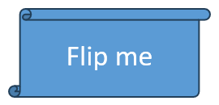

## **Overview**

Aspose.Slides for Python via .NET स्लाइड पर आकृतियों को क्रमबद्ध [ShapeCollection](https://reference.aspose.com/slides/hi/python-net/aspose.slides/shapecollection/) के रूप में दर्शाता है। यह संग्रह वह स्थान है जहाँ आप आकृतियों को खोजते और बदलते हैं तथा उनका स्टैक क्रम निर्धारित करता है: इंडेक्स `0` सबसे पीछे की आकृति है, जबकि अंतिम इंडेक्स सबसे आगे की आकृति है।

यह लेख इसी मॉडल का पालन करता है। पहले यह बताता है कि आकृति को विश्वसनीय रूप से कैसे पहचानें और पूर्व निर्धारित आकृति समायोजन बिंदुओं को कैसे संशोधित करें, फिर दिखाता है कि कैसे क्लोन, हटाएँ, छिपाएँ और पुनः क्रमबद्ध करें। अंतिम भाग लेआउट‑स्तर के स्वरूप, SVG निर्यात, संरेखण और फ्लिप सेटिंग्स को कवर करता है। प्रत्येक उदाहरण स्वतंत्र है, इसलिए आप केवल वही संचालन उपयोग कर सकते हैं जो आपके कार्य‑प्रवाह की आवश्यकता हैं।

## **Identify and Find Shapes**

संग्रह इंडेक्स ज्ञात फ़ाइल को प्रोसेस करते समय सुविधाजनक होते हैं, लेकिन वे स्थिर पहचानकर्ता नहीं होते। आकृति को जोड़ने, हटाने या पुनः क्रमबद्ध करने से उसका इंडेक्स बदल सकता है। प्रस्तुति के निर्माण और रखरखाव के अनुसार पहचानकर्ता चुनें:

- [Shape.name](https://reference.aspose.com/slides/hi/python-net/aspose.slides/shape/name/) डेवलपर‑नियंत्रित टेम्पलेट्स के लिए उपयोगी है और PowerPoint के Selection Pane में आसानी से देखा जा सकता है। नामों को संपादित किया जा सकता है और उनकी uniqueness की गारंटी नहीं है, इसलिए यदि कोड उन पर निर्भर करता है तो एक नामकरण नियम स्थापित करें।
- [Shape.alternative_text](https://reference.aspose.com/slides/hi/python-net/aspose.slides/shape/alternative_text/) तब उपयोगी है जब कोई एक्सेसिबिलिटी विवरण या लेखक‑द्वारा दिया गया टैग पहले से ही आकृति की पहचान करता हो। यह उपयोगकर्ताओं को दिखता है, स्थानीयकृत या एक्सेसिबिलिटी के लिए पुनर्लिखित किया जा सकता है, और इसकी uniqueness की गारंटी नहीं है। अर्थपूर्ण एक्सेसिबिलिटी टेक्स्ट को चुपचाप डेटाबेस कुंजी के रूप में पुनः उपयोग न करें।
- [Shape.office_interop_shape_id](https://reference.aspose.com/slides/hi/python-net/aspose.slides/shape/office_interop_shape_id/) एक पढ़‑only पहचानकर्ता है जो स्लाइड के भीतर अनूठा होता है और PowerPoint interop द्वारा उपयोग किए जाने वाले shape ID के समान है। PowerPoint के साथ एकीकरण या आकृति के जीवन‑काल के दौरान एक स्पष्ट संदर्भ की आवश्यकता होने पर इसका उपयोग करें। एक क्लोन या पुनः निर्मित आकृति अलग होती है और उसका अपना ID प्राप्त करती है।

संबंधित [Shape.unique_id](https://reference.aspose.com/slides/hi/python-net/aspose.slides/shape/unique_id/) प्रॉपर्टी का प्रस्तुति‑स्तर पर अर्थ है, लेकिन यह ऐड‑इन के लिए है और पुनः असाइन की जा सकती है। इसे स्थायी बाहरी कुंजी के रूप में नहीं माना जाना चाहिए। यदि दीर्घकालिक पहचान महत्वपूर्ण है, तो मैपिंग को एप्लिकेशन डेटा में रखें और सत्यापित करें कि अपेक्षित आकृति अभी भी मौजूद है।

निम्न उदाहरण `name` द्वारा सटीक तुलना से खोज करता है और स्लाइड‑स्कोप्ड interop ID रिपोर्ट करता है। जब टेम्पलेट में अपेक्षित आकृति नहीं मिलती, तो कोड उस परिणाम को रिपोर्ट करता है और गलत वस्तु के साथ आगे नहीं बढ़ता।

```python
import aspose.slides as slides

with slides.Presentation("input.pptx") as presentation:
    slide = presentation.slides[0]

    target_shape = None
    for shape in slide.shapes:
        if shape.name == "RevenueChart":
            target_shape = shape
            break

    if target_shape is None:
        print("The shape 'RevenueChart' was not found on slide 1.")
    else:
        print("Found {}; interop ID: {}".format(target_shape.name, target_shape.office_interop_shape_id))
```

जब कोई संचालन विशेष रूप से किसी आकृति प्रकार के लिए हो, तो प्रकार‑विशिष्ट सदस्य उपयोग करने से पहले प्रकार जाँचें। यह उदाहरण केवल तब टेक्स्ट और alternative text अपडेट करता है जब नामित वस्तु एक [AutoShape](https://reference.aspose.com/slides/hi/python-net/aspose.slides/autoshape/) हो।

```python
import aspose.slides as slides

with slides.Presentation("input.pptx") as presentation:
    slide = presentation.slides[0]

    candidate = None
    for shape in slide.shapes:
        if shape.name == "StatusLabel":
            candidate = shape
            break

    if isinstance(candidate, slides.AutoShape):
        candidate.text_frame.text = "Approved"
        candidate.alternative_text = "Approval status: approved"
        presentation.save("identified-shape.pptx", slides.export.SaveFormat.PPTX)
    else:
        print("'StatusLabel' is missing or is not an AutoShape.")
```

## **Identify and Modify Preset Shape Adjustments**

Preset geometry आकृतियों में समायोजन बिंदु हो सकते हैं जो कोने का आकार, तीर अनुपात, या आर्क कोण जैसी विशेषताओं को नियंत्रित करते हैं। इन्हें पढ़‑only [GeometryShape.adjustments](https://reference.aspose.com/slides/hi/python-net/aspose.slides/geometryshape/adjustments/) संग्रह के माध्यम से एक्सेस करें। संग्रह स्वयं आकृति द्वारा प्रदान किया जाता है, लेकिन प्रत्येक [AdjustValue](https://reference.aspose.com/slides/hi/python-net/aspose.slides/adjustvalue/) में एक मान होता है जिसे बदला जा सकता है।

केवल एक स्थिर संग्रह इंडेक्स पर निर्भर न रहें। समायोजनों पर इटररेट करें और पढ़‑only [AdjustValue.type](https://reference.aspose.com/slides/hi/python-net/aspose.slides/adjustvalue/type/) प्रॉपर्टी का निरीक्षण करें, जिसका [ShapeAdjustmentType](https://reference.aspose.com/slides/hi/python-net/aspose.slides/shapeadjustmenttype/) मान बताता है कि समायोजन किस चीज़ को नियंत्रित करता है। पढ़‑only [AdjustValue.name](https://reference.aspose.com/slides/hi/python-net/aspose.slides/adjustvalue/name/) प्रॉपर्टी अतिरिक्त पहचान जानकारी देती है और विशेष रूप से तब उपयोगी है जब एक preset में समान semantic type वाले कई समायोजन हों।

समायोजन के अर्थ के अनुसार मान प्रॉपर्टी का उपयोग करें:

| Adjustment type | Purpose | Value to change |
|---|---|---|
| `CORNER_SIZE` | गोल कोनों का आकार | [raw_value](https://reference.aspose.com/slides/hi/python-net/aspose.slides/adjustvalue/raw_value/) |
| `ARROW_TAIL_THICKNESS` | तीर के पूंछ की मोटाई | `raw_value` |
| `ARROWHEAD_LENGTH` | तीर की नोक की लंबाई | `raw_value` |
| `ARROWHEAD_WIDTH` | तीर की नोक की चौड़ाई | `raw_value` |
| `START_ANGLE` | पाई या आर्क का आरम्भिक कोण | [angle_value](https://reference.aspose.com/slides/hi/python-net/aspose.slides/adjustvalue/angle_value/) |
| `END_ANGLE` | पाई या आर्क का अंतिम कोण | `angle_value` |

`type` और `name` असाइन नहीं किए जा सकते। `raw_value` preset की मूल geometry इकाइयों में एक पढ़‑write पूर्णांक है, जबकि `angle_value` डिग्री में एक पढ़‑write कोण है। समायोजनों की संख्या, क्रम, अर्थ और मान्य श्रेणी preset के [GeometryShape.shape_type](https://reference.aspose.com/slides/hi/python-net/aspose.slides/geometryshape/shape_type/) पर निर्भर करती है। एक preset के लिए मान्य मान दूसरे preset में अमान्य या अलग प्रभाव डाल सकता है।

जब `type` `ShapeAdjustmentType.CUSTOM` हो, तो API मानक semantic अर्थ नहीं पहचानती। `name`, preset type, और मौजूदा मान की जाँच करें, और तब तक समायोजन को अपरिवर्तित रखें जब तक कि अपेक्षित अर्थ और श्रेणी ज्ञात न हो। पहचाने गए प्रकारों के लिए भी, यदि समान प्रकार अधिक बार आता है तो मान चुनने से पहले जाँचें। [Connector](/slides/hi/python-net/connector/) लेख इस स्थिति को connector bend adjustments के साथ दर्शाता है।

निम्न संपूर्ण उदाहरण तीन preset आकृतियों के डिफ़ॉल्ट और संशोधित संस्करण बनाता है। यह प्रत्येक समायोजन के माध्यम से इटररेट करता है, उसके `name` और `type` को रिपोर्ट करता है, आकार‑संबंधी मानों को `raw_value` से बदलता है, कोण को `angle_value` से बदलता है, और परिणाम सहेजता है। बाएँ कॉलम में डिफ़ॉल्ट geometry रहता है; दाएँ कॉलम में समायोजित rounded rectangle, चार‑मार्ग तीर, और pie दिखाए गए हैं।

```python
import aspose.slides as slides

with slides.Presentation() as presentation:
    slide = presentation.slides[0]

    # डिफ़ॉल्ट और समायोजित आकृति कॉलम के लिए शीर्षक जोड़ें।
    default_column_label = slide.shapes.add_auto_shape(slides.ShapeType.RECTANGLE, 40, 20, 250, 30)
    default_column_label.text_frame.text = "Default preset geometry"
    adjusted_column_label = slide.shapes.add_auto_shape(slides.ShapeType.RECTANGLE, 390, 20, 250, 30)
    adjusted_column_label.text_frame.text = "Modified adjustment values"

    slide.shapes.add_auto_shape(slides.ShapeType.ROUND_CORNER_RECTANGLE, 80, 70, 160, 70)
    modified_rounded_rectangle = slide.shapes.add_auto_shape(slides.ShapeType.ROUND_CORNER_RECTANGLE, 430, 70, 160, 70)
    modified_rounded_rectangle.name = "ModifiedRoundedRectangle"

    slide.shapes.add_auto_shape(slides.ShapeType.QUAD_ARROW, 80, 180, 160, 110)
    modified_arrow = slide.shapes.add_auto_shape(slides.ShapeType.QUAD_ARROW, 430, 180, 160, 110)
    modified_arrow.name = "ModifiedQuadArrow"

    slide.shapes.add_auto_shape(slides.ShapeType.PIE, 95, 330, 130, 130)
    modified_pie = slide.shapes.add_auto_shape(slides.ShapeType.PIE, 445, 330, 130, 130)
    modified_pie.name = "ModifiedPie"

    shapes_to_adjust = [modified_rounded_rectangle, modified_arrow, modified_pie]

    for shape in shapes_to_adjust:
        for adjustment in shape.adjustments:
            print("{} / {}: {}".format(shape.name, adjustment.name, adjustment.type.name))

            if adjustment.type == slides.ShapeAdjustmentType.CORNER_SIZE:
                adjustment.raw_value = 5000
            elif adjustment.type == slides.ShapeAdjustmentType.ARROW_TAIL_THICKNESS:
                adjustment.raw_value = 25000
            elif adjustment.type == slides.ShapeAdjustmentType.ARROWHEAD_LENGTH:
                adjustment.raw_value = 30000
            elif adjustment.type == slides.ShapeAdjustmentType.ARROWHEAD_WIDTH:
                adjustment.raw_value = 40000
            elif adjustment.type == slides.ShapeAdjustmentType.START_ANGLE:
                adjustment.angle_value = 30
            elif adjustment.type == slides.ShapeAdjustmentType.END_ANGLE:
                adjustment.angle_value = 300
            elif adjustment.type == slides.ShapeAdjustmentType.CUSTOM:
                print("Custom adjustment '{}' was not changed.".format(adjustment.name))

    presentation.save("preset-shape-adjustments.pptx", slides.export.SaveFormat.PPTX)
```

समर्थित प्रकार की जाँच करने के बाद मान बदलने से कोड का अभिप्राय स्पष्ट रहता है और यह मानने से बचता है कि विभिन्न preset आकृतियों में समान संग्रह इंडेक्स का अर्थ समान हो।

## **Modify the Shape Collection**

Add, clone, remove और reorder मेथड्स संग्रह पर तुरंत कार्य करते हैं। यदि कोई ऑपरेशन आकृतियों की संख्या या क्रम बदलता है, तो उस ऑपरेशन से पहले कैप्चर किए गए इंडेक्स पर निर्भर न रहें।

### **Clone a Shape**

[ShapeCollection.add_clone](https://reference.aspose.com/slides/hi/python-net/aspose.slides/shapecollection/add_clone/) एक स्वतंत्र कॉपी बनाता है और इसे लक्ष्य संग्रह में जोड़ता है। [ShapeCollection.insert_clone](https://reference.aspose.com/slides/hi/python-net/aspose.slides/shapecollection/insert_clone/) भी कॉपी बनाता है लेकिन निर्दिष्ट z‑order इंडेक्स पर रखता है। वह ओवरलोड जो निर्देशांक स्वीकार करता है, क्लोन को उसके आकार को बदले बिना ले जाता है; चौड़ाई और ऊँचाई वाले ओवरलोड इसे पुनः आकार भी दे सकते हैं।

यह उदाहरण एक गंतव्य स्लाइड बनाता है, लेबल वाले rectangle को आगे की ओर क्लोन करता है, और दूसरे क्लोन को पीछे डालता है। दोनों क्लोन में किए गए परिवर्तन मूल आकृति को नहीं बदलते।

```python
import aspose.slides as slides

with slides.Presentation() as presentation:
    source_slide = presentation.slides[0]
    source_shape = source_slide.shapes.add_auto_shape(slides.ShapeType.RECTANGLE, 40, 40, 180, 60)
    source_shape.name = "SourceLabel"
    source_shape.text_frame.text = "Source"

    blank_layout = presentation.masters[0].layout_slides.get_by_type(slides.SlideLayoutType.BLANK)
    destination_slide = presentation.slides.add_empty_slide(blank_layout)

    front_clone_shape = destination_slide.shapes.add_clone(source_shape, 80, 80)
    front_clone_shape.name = "FrontClone"
    if isinstance(front_clone_shape, slides.AutoShape):
        front_clone_shape.text_frame.text = "Front clone"
    else:
        print("The front clone is not an AutoShape; its text was not changed.")

    back_clone_shape = destination_slide.shapes.insert_clone(0, source_shape, 80, 180)
    back_clone_shape.name = "BackClone"
    if isinstance(back_clone_shape, slides.AutoShape):
        back_clone_shape.text_frame.text = "Back clone"
    else:
        print("The back clone is not an AutoShape; its text was not changed.")

    presentation.save("cloned-shapes.pptx", slides.export.SaveFormat.PPTX)
```

क्लोनिंग आकृति की सामग्री और फ़ॉर्मेटिंग कॉपी करता है, जिसमें उसका name और alternative text भी शामिल है। जब इन मानों को अद्वितीय होना आवश्यक हो तो क्लोन को नई तार्किक पहचानकर्ता सौंपें। जटिल आकृतियों द्वारा उपयोग किए गए संसाधनों को प्रस्तुति संभालती है, लेकिन क्लोन एक नया संग्रह आइटम है जिसके पास नई shape पहचान होती है।

### **Remove Shapes**

[ShapeCollection.remove](https://reference.aspose.com/slides/hi/python-net/aspose.slides/shapecollection/remove/) किसी विशिष्ट shape ऑब्जेक्ट को उसके संग्रह से हटाता है। कई मिलान को indexed iteration के दौरान हटाते समय अंत से traversal करें ताकि शेष प्रत्येक इंडेक्स वैध रहे।

यह उदाहरण निर्दिष्ट नाम वाली सभी आकृतियों को हटाता है। यह `slide.shapes[index]` पढ़ता है, न कि स्थिर संग्रह आइटम, और आकृति को अनावश्यक रूप से cast नहीं करता।

```python
import aspose.slides as slides

with slides.Presentation() as presentation:
    slide = presentation.slides[0]

    keep_shape = slide.shapes.add_auto_shape(slides.ShapeType.RECTANGLE, 40, 40, 140, 60)
    keep_shape.name = "Keep"

    first_temporary_shape = slide.shapes.add_auto_shape(slides.ShapeType.ELLIPSE, 220, 40, 80, 80)
    first_temporary_shape.name = "Temporary"

    second_temporary_shape = slide.shapes.add_auto_shape(slides.ShapeType.TRIANGLE, 340, 40, 100, 80)
    second_temporary_shape.name = "Temporary"

    for index in range(len(slide.shapes) - 1, -1, -1):
        shape = slide.shapes[index]
        if shape.name == "Temporary":
            slide.shapes.remove(shape)

    presentation.save("removed-shapes.pptx", slides.export.SaveFormat.PPTX)
```

हटाने के बाद, shape count और बाद की आकृतियों के इंडेक्स बदल जाते हैं। अपरिवर्तित आकृतियों को संदर्भित करना सहेजे गये इंडेक्स की तुलना में अधिक भरोसेमंद रहता है। कनेक्टर्स, एनीमेशन और अन्य प्रस्तुति सुविधाओं पर भी विचार करें जो हटाए गये ऑब्जेक्ट को संदर्भित कर सकते हैं; एक दृश्य आकृति को हटाने से स्लाइड की उपस्थिति से अधिक कुछ बदल सकता है।

### **Hide a Shape**

[Shape.hidden](https://reference.aspose.com/slides/hi/python-net/aspose.slides/shape/hidden/) को `True` पर सेट करने से आकृति संग्रह में रहती है लेकिन सामान्य स्लाइड शो में दिखाई नहीं देती। उसका इंडेक्स, फ़ॉर्मेटिंग और सामग्री कोड के लिये उपलब्ध रहती है, इसलिए छिपाना वैकल्पिक तत्वों के लिये उपयुक्त है जिन्हें बाद में पुनः सक्रिय किया जा सकता है।

```python
import aspose.slides as slides

with slides.Presentation() as presentation:
    slide = presentation.slides[0]

    visible_shape = slide.shapes.add_auto_shape(slides.ShapeType.RECTANGLE, 40, 40, 160, 60)
    visible_shape.name = "VisibleLabel"

    optional_shape = slide.shapes.add_auto_shape(slides.ShapeType.MOON, 240, 40, 100, 100)
    optional_shape.name = "OptionalDecoration"

    for shape in slide.shapes:
        if shape.name == "OptionalDecoration":
            shape.hidden = True

    presentation.save("hidden-shape.pptx", slides.export.SaveFormat.PPTX)
```

छिपाना विलोपन या सुरक्षा नहीं है। ऑब्जेक्ट अभी भी उपयोगकर्ता या कोड द्वारा खोजा और अनहिड किया जा सकता है, और यह प्रस्तुति फ़ाइल का हिस्सा बना रहता है।

### **Change the Z-Order**

ओवरलैपिंग आकृतियाँ संग्रह क्रम में पेंट की जाती हैं। [ShapeCollection.reorder](https://reference.aspose.com/slides/hi/python-net/aspose.slides/shapecollection/reorder/) मौजूदा आकृति को लक्ष्य इंडेक्स पर बिना क्लोन किए ले जाता है। इंडेक्स `0` पीछे है; `len(slide.shapes) - 1` आगे है।

```python
import aspose.pydrawing as draw
import aspose.slides as slides

with slides.Presentation() as presentation:
    slide = presentation.slides[0]

    blue_rectangle = slide.shapes.add_auto_shape(slides.ShapeType.RECTANGLE, 100, 100, 220, 120)
    blue_rectangle.name = "BlueRectangle"
    blue_rectangle.fill_format.fill_type = slides.FillType.SOLID
    blue_rectangle.fill_format.solid_fill_color.color = draw.Color.steel_blue

    orange_ellipse = slide.shapes.add_auto_shape(slides.ShapeType.ELLIPSE, 180, 140, 220, 120)
    orange_ellipse.name = "OrangeEllipse"
    orange_ellipse.fill_format.fill_type = slides.FillType.SOLID
    orange_ellipse.fill_format.solid_fill_color.color = draw.Color.orange

    slide.shapes.reorder(len(slide.shapes) - 1, blue_rectangle)
    presentation.save("reordered-shapes.pptx", slides.export.SaveFormat.PPTX)
```

पहले rectangle बनाया गया और प्रारंभ में ellipse के पीछे स्थित था। इसे अंतिम इंडेक्स पर ले जाने से वह आगे आ जाता है। सभी संबंधित आकृतियों को जोड़ने या क्लोन करने के बाद z‑order अंतिम रूप दें, क्योंकि ये संचालन नए संग्रह आइटम जोड़ते या डालते हैं और इच्छित स्टैक को बदल सकते हैं।

## **Inspect Shapes on Layout Slides**

सामान्य स्लाइड, layout स्लाइड, और master स्लाइड की अलग‑अलग shape संग्रह होते हैं। layout संग्रह में एक आकृति सामान्य स्लाइड की समान‑स्थिति वाली आकृति नहीं होती। जब आपको layout द्वारा प्रदान किए गए फ़ॉर्मेटिंग को समझने या बदलने की आवश्यकता हो, तो layout आकृतियों की जांच करें।

निम्न उदाहरण प्रत्येक layout shape के [Shape.fill_format](https://reference.aspose.com/slides/hi/python-net/aspose.slides/shape/fill_format/) और [Shape.line_format](https://reference.aspose.com/slides/hi/python-net/aspose.slides/shape/line_format/) को पढ़ता है, यह मानते हुए कि प्रत्येक shape `AutoShape` नहीं है।

```python
import aspose.slides as slides

with slides.Presentation("input.pptx") as presentation:
    for layout_slide in presentation.layout_slides:
        for shape in layout_slide.shapes:
            fill_type = shape.fill_format.fill_type
            line_width = shape.line_format.width
            print("{} / {}: fill={}, line width={}".format(layout_slide.name, shape.name, fill_type, line_width))
```

एक layout को संपादित करने से उसे उपयोग करने वाली कई स्लाइड प्रभावित हो सकती हैं। layout shape को बदलने से पहले यह निर्धारित करें कि सामान्य स्लाइड ऑब्जेक्ट को विरासत में मिला है या स्थानीय ओवरराइड है, और उस layout का उपयोग करने वाली प्रत्येक स्लाइड का परीक्षण करें।

## **Export a Shape to SVG**

[Shape.write_as_svg](https://reference.aspose.com/slides/hi/python-net/aspose.slides/shape/write_as_svg/) एक आकृति की रेंडर की गई सामग्री को स्ट्रीम में लिखता है। परिणाम में केवल वह आकृति होती है, न कि पूरी स्लाइड पृष्ठभूमि या आस‑पास की आकृतियाँ।

```python
import aspose.slides as slides

with slides.Presentation("input.pptx") as presentation:
    slide = presentation.slides[0]

    if len(slide.shapes) == 0:
        print("Slide 1 does not contain a shape to export.")
    else:
        shape = slide.shapes[0]
        with open("shape.svg", "wb") as svg_stream:
            shape.write_as_svg(svg_stream)
```

रेंडरिंग के दौरान प्रस्तुति खुली रखें। आउटपुट आकृति के फ़ॉर्मेटिंग तथा फ़ॉन्ट और इमेज जैसी संसाधनों पर निर्भर करता है। यदि पूरी रचना चाहिए तो स्लाइड को निर्यात करें, न कि व्यक्तिगत आकृति को। कॉलर स्ट्रीम का स्वामी होता है और उसे बंद करना आवश्यक है।

## **Align Shapes**

[SlideUtil.align_shapes](https://reference.aspose.com/slides/hi/python-net/aspose.slides.util/slideutil/align_shapes/) ओवरलोड सभी आकृतियों या चयनित संग्रह इंडेक्स को संरेखित करता है। [ShapesAlignmentType](https://reference.aspose.com/slides/hi/python-net/aspose.slides/shapesalignmenttype/) किनारा, केंद्र रेखा या वितरण मोड निर्दिष्ट करता है। `align_to_slide` को `True` सेट करने से स्लाइड किनारों का उपयोग होता है; `False` सेट करने से चयनित आकृतियों को एक‑दूसरे के सापेक्ष संरेखित किया जाता है।

यह उदाहरण तीन आकृतियों को स्लाइड के शीर्ष किनारे पर संरेखित करता है। उनके वर्तमान इंडेक्स संरेखण से ठीक पहले तय किए जाते हैं।

```python
import aspose.slides as slides

with slides.Presentation() as presentation:
    slide = presentation.slides[0]

    first_shape = slide.shapes.add_auto_shape(slides.ShapeType.RECTANGLE, 60, 80, 120, 50)
    second_shape = slide.shapes.add_auto_shape(slides.ShapeType.ELLIPSE, 240, 160, 120, 50)
    third_shape = slide.shapes.add_auto_shape(slides.ShapeType.TRIANGLE, 420, 240, 120, 50)
    first_shape.name = "FirstAlignedShape"
    second_shape.name = "SecondAlignedShape"
    third_shape.name = "ThirdAlignedShape"

    shape_indexes = [
        slide.shapes.index_of(first_shape),
        slide.shapes.index_of(second_shape),
        slide.shapes.index_of(third_shape)
    ]

    slides.util.SlideUtil.align_shapes(slides.ShapesAlignmentType.ALIGN_TOP, True, slide, shape_indexes)
    presentation.save("aligned-shapes.pptx", slides.export.SaveFormat.PPTX)
```

संरेखण स्थितियों को बदलता है, न कि z‑order को। सापेक्ष संरेखण के लिये सामान्यतः कम से कम दो आकृतियों की आवश्यकता होती है, जबकि क्षैतिज या ऊर्ध्वाधर वितरण के लिये पर्याप्त आकृतियों की आवश्यकता होती है ताकि अंतराल निर्धारित किया जा सके। मेथड कॉल करने से पहले यदि आप संग्रह को संशोधित करते हैं तो इंडेक्स को पुनः गणना करें।

## **Flip a Shape**

[ShapeFrame](https://reference.aspose.com/slides/hi/python-net/aspose.slides.shapeframe/) क्लास स्थिति, आकार, क्षैतिज और लंबवत flip सेटिंग तथा घूर्णन को रखता है। इसके `flip_h` और `flip_v` मान [NullableBool](https://reference.aspose.com/slides/hi/python-net/aspose.slides/nullablebool/) का उपयोग करते हैं: `TRUE` flip को सक्षम करता है, `FALSE` उसे निष्क्रिय करता है, और `NOT_DEFINED` अनिर्दिष्ट या डिफ़ॉल्ट स्थिति बनाए रखता है।

नीचे दी गई इनपुट प्रस्तुति में एक अनफ़्लिप्ड आकृति है।



उदाहरण सभी अन्य फ्रेम मानों को बरकरार रखता है और केवल दो flip सेटिंग को बदलता है। यह महत्वपूर्ण है क्योंकि नया [Shape.frame](https://reference.aspose.com/slides/hi/python-net/aspose.slides/shape/frame/) असाइन करने से पूरी फ्रेम बदल जाती है।

```python
import aspose.slides as slides

with slides.Presentation("sample.pptx") as presentation:
    shape = presentation.slides[0].shapes[0]
    frame = shape.frame

    print("Horizontal flip before change:", frame.flip_h)
    print("Vertical flip before change:", frame.flip_v)

    shape.frame = slides.ShapeFrame(
        frame.x, frame.y, frame.width, frame.height,
        slides.NullableBool.TRUE, slides.NullableBool.TRUE, frame.rotation)

    presentation.save("flipped-shape.pptx", slides.export.SaveFormat.PPTX)
```

सहेजी गई आकृति क्षैतिज और लंबवत दोनों दिशा में प्रतिबिंबित होती है, जबकि उसकी स्थिति, आकार और घूर्णन समान रहता है।


## **FAQ**

**Should I use a collection index as a shape identifier?**

केवल उन अल्पकालिक प्रोसेसिंग के लिये जहाँ संग्रह उपयोग से पहले नहीं बदलेगा। निर्मित टेम्पलेट्स के लिये `name` या `alternative_text` मानकों को प्राथमिकता दें, या slide‑स्कोप्ड interop कार्य के लिये `office_interop_shape_id` का उपयोग करें।

**Does hiding a shape remove it from the z-order?**

नहीं। एक hidden shape उसी इंडेक्स पर संग्रह में रहती है। इसे पाया, पुनः क्रमबद्ध, संपादित या फिर से दृश्यमान किया जा सकता है।

**Why did a cloned shape appear in front of another shape?**

`add_clone` क्लोन को संग्रह के अंत में जोड़ता है, जो z‑order का आगे का स्थान है। प्रारंभिक इंडेक्स चुनने के लिये `insert_clone` का प्रयोग करें या सभी आकृतियों के जोड़ने के बाद `reorder` करें।

**Can I use a fixed index to identify a preset shape adjustment?**

केवल तब जब आप सटीक preset और संग्रह लेआउट को वैध कर चुके हों। `GeometryShape.adjustments` पर इटररेट करना और `AdjustValue.type` की जाँच करना प्राथमिकता दें; जब समान semantic type कई बार आता है तो अतिरिक्त जानकारी के लिये `AdjustValue.name` का उपयोग करें।