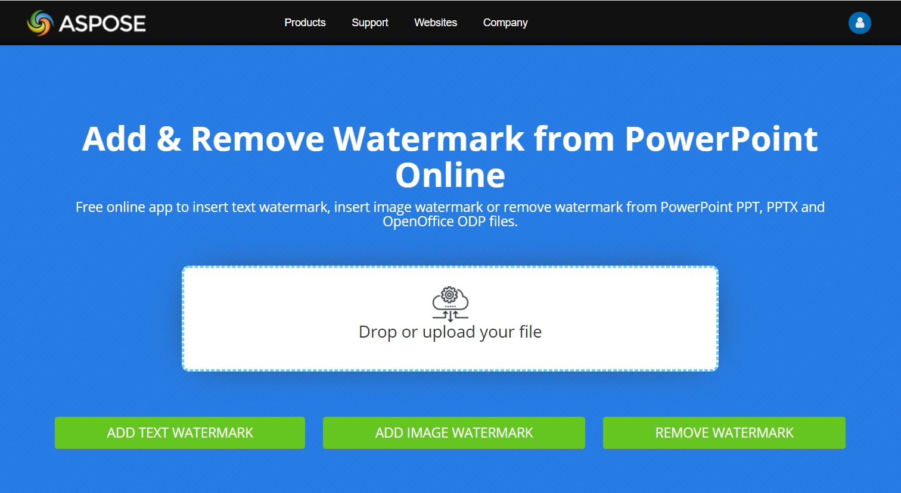

## **परिचय**

**एक वॉटरमार्क** प्रस्तुति में टेक्स्ट या इमेज़ स्टैम्प होता है जो स्लाइड पर या सभी स्लाइडों में उपयोग किया जाता है। आमतौर पर वॉटरमार्क यह दर्शाने के लिए प्रयोग किया जाता है कि प्रस्तुति ड्राफ्ट है (उदाहरण — "Draft" वॉटरमार्क), इसमें गोपनीय जानकारी है (उदाहरण — "Confidential" वॉटरमार्क), यह किस कंपनी की है (उदाहरण — "Company Name" वॉटरमार्क), प्रस्तुति के लेखक को पहचानने के लिए आदि। वॉटरमार्क यह संकेत देकर कॉपीराइट उल्लंघन को रोकने में मदद करता है कि प्रस्तुति को कॉपी नहीं किया जाना चाहिए। वॉटरमार्क PowerPoint और OpenOffice दोनों फॉर्मैट में उपयोग किए जाते हैं। Aspose.Slides में आप PowerPoint PPT, PPTX और OpenOffice ODP फ़ाइल फ़ॉर्मैट में वॉटरमार्क जोड़ सकते हैं।

[**Aspose.Slides**](https://products.aspose.com/slides/hi/python-net/) में कई तरीकों से आप PowerPoint या OpenOffice दस्तावेज़ों में वॉटरमार्क बना सकते हैं और उसके डिज़ाइन व व्यवहार को बदल सकते हैं। सामान्य बात यह है कि टेक्स्ट वॉटरमार्क जोड़ने के लिए आपको [TextFrame](https://reference.aspose.com/slides/hi/python-net/aspose.slides/textframe/) क्लास का उपयोग करना चाहिए, और इमेज वॉटरमार्क जोड़ने के लिए [PictureFrame](https://reference.aspose.com/slides/hi/python-net/aspose.slides/pictureframe/) क्लास या वॉटरमार्क शेप को इमेज से भरना चाहिए। `PictureFrame` [Shape](https://reference.aspose.com/slides/hi/python-net/aspose.slides/shape/) क्लास को इम्प्लीमेंट करती है, जिससे आप शैप ऑब्जेक्ट की सभी लचीली सेटिंग्स का उपयोग कर सकते हैं। चूँकि `TextFrame` शैप नहीं है और उसकी सेटिंग्स सीमित हैं, इसे एक [Shape](https://reference.aspose.com/slides/hi/python-net/aspose.slides/shape/) ऑब्जेक्ट में रैप किया जाता है।

वॉटरमार्क दो तरह से लागू किया जा सकता है: एकल स्लाइड पर या सभी स्लाइडों पर। सभी स्लाइडों पर वॉटरमार्क लगाने के लिए स्लाइड मास्टर का उपयोग किया जाता है — वॉटरमार्क स्लाइड मास्टर में जोड़ा जाता है, वहाँ पूरी तरह डिज़ाइन किया जाता है और सभी स्लाइडों पर लागू होता है बिना व्यक्तिगत स्लाइडों में वॉटरमार्क को संशोधित करने की अनुमति को प्रभावित किए।

वॉटरमार्क आमतौर पर अन्य उपयोगकर्ताओं द्वारा संपादन योग्य नहीं माना जाता। वॉटरमार्क (या वॉटरमार्क के पैरेंट शैप) को संपादन से बचाने के लिए Aspose.Slides शैप लॉकिंग फ़ंक्शन प्रदान करता है। एक विशिष्ट शैप को सामान्य स्लाइड या स्लाइड मास्टर पर लॉक किया जा सकता है। जब स्लाइड मास्टर पर वॉटरमार्क शैप लॉक हो जाता है, तो यह सभी प्रस्तुति स्लाइडों पर लॉक हो जाता है।

आप वॉटरमार्क को एक नाम दे सकते हैं ताकि भविष्य में इसे हटाना चाहें तो स्लाइड के शैप्स में नाम से खोज सकें।

आप वॉटरमार्क को किसी भी तरीके से डिज़ाइन कर सकते हैं; हालांकि, वॉटरमार्क में आमतौर पर कुछ सामान्य विशेषताएँ रहती हैं, जैसे केंद्र संरेखण, घुमाव, अग्रस्थिति आदि। नीचे दिए गए उदाहरणों में हम इनका उपयोग कैसे करें, देखेंगे।

## **टेक्स्ट वॉटरमार्क**

### **स्लाइड में टेक्स्ट वॉटरमार्क जोड़ना**

PPT, PPTX या ODP में टेक्स्ट वॉटरमार्क जोड़ने के लिए आप पहले स्लाइड में एक शैप जोड़ें, फिर उस शैप में एक टेक्स्ट फ़्रेम जोड़ें। टेक्स्ट फ़्रेम को [TextFrame](https://reference.aspose.com/slides/hi/python-net/aspose.slides/textframe/) क्लास द्वारा दर्शाया जाता है। यह क्लास [Shape](https://reference.aspose.com/slides/hi/python-net/aspose.slides/shape/) से विरासत में नहीं मिली है, इसलिए इसकी स्थितियों को लचीले ढंग से सेट करने के लिए पर्याप्त प्रॉपर्टी नहीं हैं। इसलिए [TextFrame](https://reference.aspose.com/slides/hi/python-net/aspose.slides/textframe/) ऑब्जेक्ट को एक [AutoShape](https://reference.aspose.com/slides/hi/python-net/aspose.slides/autoshape/) ऑब्जेक्ट में रैप किया जाता है। शैप में वॉटरमार्क टेक्स्ट जोड़ने के लिए नीचे दिखाए अनुसार [add_text_frame](https://reference.aspose.com/slides/hi/python-net/aspose.slides/autoshape/add_text_frame/#str) मेथड का उपयोग करें।

```py
watermark_text = "CONFIDENTIAL"

with Presentation() as presentation:
    slide = presentation.slides[0]

    watermark_shape = slide.shapes.add_auto_shape(ShapeType.RECTANGLE, 100, 100, 400, 40)
    watermark_frame = watermark_shape.add_text_frame(watermark_text)
```

{} 
- [How to Use the TextFrame Class](/slides/hi/python-net/text-formatting/)
{}

### **प्रेजेंटेशन में टेक्स्ट वॉटरमार्क जोड़ना**

यदि आप पूरे प्रेजेंटेशन (अर्थात सभी स्लाइडों) में टेक्स्ट वॉटरमार्क जोड़ना चाहते हैं, तो इसे [MasterSlide](https://reference.aspose.com/slides/hi/python-net/aspose.slides/masterslide/) में जोड़ें। बाकी लॉजिक एकल स्लाइड में वॉटरमार्क जोड़ने जैसा ही है — एक [AutoShape](https://reference.aspose.com/slides/hi/python-net/aspose.slides/autoshape/) ऑब्जेक्ट बनाएं और फिर [add_text_frame](https://reference.aspose.com/slides/hi/python-net/aspose.slides/autoshape/add_text_frame/#str) मेथड से वॉटरमार्क जोड़ें।

```py
watermark_text = "CONFIDENTIAL"

with Presentation() as presentation:
    master_slide = presentation.masters[0]

    watermark_shape = master_slide.shapes.add_auto_shape(ShapeType.RECTANGLE, 100, 100, 400, 40)
    watermark_frame = watermark_shape.add_text_frame(watermark_text)
```

{} 
- [How to Use the Slide Master](/slides/hi/python-net/slide-master/)
{}

### **वॉटरमार्क शैप की ट्रांसपैरेंसी सेट करना**

डिफ़ॉल्ट रूप से आयताकार शैप को भराव और लाइन रंग से स्टाइल किया गया है। नीचे दिया कोड शैप को पारदर्शी बनाता है।

```py
watermark_shape.fill_format.fill_type = FillType.NO_FILL
watermark_shape.line_format.fill_format.fill_type = FillType.NO_FILL
```

### **टेक्स्ट वॉटरमार्क के फ़ॉन्ट को सेट करना**

आप नीचे दिखाए अनुसार टेक्स्ट वॉटरमार्क का फ़ॉन्ट बदल सकते हैं।

```py
text_format = watermark_frame.paragraphs[0].paragraph_format.default_portion_format
text_format.latin_font = FontData("Arial")
text_format.font_height = 50
```

### **वॉटरमार्क टेक्स्ट का रंग सेट करना**

वॉटरमार्क टेक्स्ट का रंग सेट करने के लिए यह कोड उपयोग करें:

```py
alpha = 150
red = 200
green = 200
blue = 200

fill_format = watermark_frame.paragraphs[0].paragraph_format.default_portion_format.fill_format
fill_format.fill_type = FillType.SOLID
fill_format.solid_fill_color.color = drawing.Color.from_argb(alpha, red, green, blue)
```

### **टेक्स्ट वॉटरमार्क को केंद्र में रखना**

वॉटरमार्क को स्लाइड के केंद्र में लाने के लिए आप निम्न कार्य कर सकते हैं:

```py
slide_size = presentation.slide_size.size

watermark_width = 400
watermark_height = 40
watermark_x = (slide_size.width - watermark_width) / 2
watermark_y = (slide_size.height - watermark_height) / 2

watermark_shape = slide.shapes.add_auto_shape(
    ShapeType.RECTANGLE, watermark_x, watermark_y, watermark_width, watermark_height)

watermark_frame = watermark_shape.add_text_frame(watermark_text)
```

नीचे की छवि अंतिम परिणाम दर्शाती है।


## **इमेज वॉटरमार्क**

### **प्रेजेंटेशन में इमेज वॉटरमार्क जोड़ना**

प्रेजेंटेशन स्लाइड में इमेज वॉटरमार्क जोड़ने के लिए आप निम्न कार्य कर सकते हैं:

```py
with open("watermark.png", "rb") as image_stream:
    image = presentation.images.add_image(image_stream.read())

    watermark_shape.fill_format.fill_type = FillType.PICTURE
    watermark_shape.fill_format.picture_fill_format.picture.image = image
    watermark_shape.fill_format.picture_fill_format.picture_fill_mode = PictureFillMode.STRETCH
```

## **वॉटरमार्क को संपादन से लॉक करना**

यदि वॉटरमार्क को संपादन से बचाना आवश्यक है, तो शैप पर [AutoShape.auto_shape_lock](https://reference.aspose.com/slides/hi/python-net/aspose.slides/autoshape/auto_shape_lock/) प्रॉपर्टी का उपयोग करें। इस प्रॉपर्टी के माध्यम से आप शैप को चयन, आकार बदलना, पुनःस्थापित करना, अन्य तत्वों के साथ ग्रुप करना, टेक्स्ट को संपादन से लॉक करना आदि से बचा सकते हैं:

```py
# वॉटरमार्क शैप को संशोधित करने से लॉक करें
watermark_shape.auto_shape_lock.select_locked = True
watermark_shape.auto_shape_lock.size_locked = True
watermark_shape.auto_shape_lock.text_locked = True
watermark_shape.auto_shape_lock.position_locked = True
watermark_shape.auto_shape_lock.grouping_locked = True
```

## **वॉटरमार्क को अग्रभाग में लाना**

Aspose.Slides में शैप्स का Z‑order [ShapeCollection.reorder](https://reference.aspose.com/slides/hi/python-net/aspose.slides/ishapecollection/reorder/#int-ishape) मेथड के द्वारा सेट किया जा सकता है। ऐसा करने के लिए आप इस मेथड को प्रेजेंटेशन स्लाइड्स की सूची से कॉल करें और शैप रेफ़रेंस तथा उसका क्रमांक पास करें। इस तरह आप शैप को स्लाइड के अग्रभाग में ला सकते हैं या पीछे भेज सकते हैं। यह सुविधा विशेष रूप से तब उपयोगी होती है जब आपको वॉटरमार्क को प्रस्तुति की अग्रस्थिति में रखना हो:

```py
shape_count = len(slide.shapes)
slide.shapes.reorder(shape_count - 1, watermark_shape)
```

## **वॉटरमार्क का घुमाव सेट करना**

नीचे कोड उदाहरण दर्शाता है कि वॉटरमार्क का घुमाव कैसे ठीक किया जाए ताकि वह स्लाइड के विकर्ण में स्थित हो:

```py
diagonal_angle = math.atan(slide_size.height / slide_size.width) * 180 / math.pi

watermark_shape.rotation = float(diagonal_angle)
```

## **वॉटरमार्क के लिए नाम सेट करना**

Aspose.Slides आपको शैप का नाम सेट करने की अनुमति देता है। शैप नाम का प्रयोग करके आप भविष्य में इसे संशोधित या हटाने के लिए एक्सेस कर सकते हैं। वॉटरमार्क शैप का नाम सेट करने के लिए इसे [AutoShape.name](https://reference.aspose.com/slides/hi/python-net/aspose.slides/autoshape/name/) प्रॉपर्टी को असाइन करें:

```py
watermark_shape.name = "watermark"
```

## **वॉटरमार्क हटाना**

वॉटरमार्क शैप को हटाने के लिए [AutoShape.name](https://reference.aspose.com/slides/hi/python-net/aspose.slides/autoshape/name/) मेथड से स्लाइड के शैप्स में उसे खोजें। फिर वॉटरमार्क शैप को [ShapeCollection.remove](https://reference.aspose.com/slides/hi/python-net/aspose.slides/shapecollection/remove/#ishape) मेथड में पास करें:

```py
slide_shapes = list(slide.shapes)
for shape in slide_shapes:
    if shape.name == "watermark":
        slide.shapes.remove(watermark_shape)
```

## **एक लाइव उदाहरण**

आप **Aspose.Slides free** [Add Watermark](https://products.aspose.app/slides/hi/watermark) और [Remove Watermark](https://products.aspose.app/slides/hi/watermark/remove-watermark) ऑनलाइन टूल्स को देख सकते हैं।



## **FAQ**

**वॉटरमार्क क्या है और मुझे इसे क्यों उपयोग करना चाहिए?**

वॉटरमार्क टेक्स्ट या इमेज़ ओवरले है जिसे स्लाइडों पर लागू किया जाता है ताकि बौद्धिक संपदा की रक्षा, ब्रांड पहचान बढ़े या अनधिकृत उपयोग रोका जा सके।

**क्या मैं प्रेजेंटेशन की सभी स्लाइडों में वॉटरमार्क जोड़ सकता हूँ?**

हां, Aspose.Slides आपको प्रत्येक स्लाइड पर व्यक्तिगत रूप से वॉटरमार्क सेटिंग्स लागू करके सभी स्लाइडों में वॉटरमार्क जोड़ने की अनुमति देता है।

**मैं वॉटरमार्क की ट्रांसपैरेंसी कैसे समायोजित करूँ?**

आप शैप की भराव सेटिंग्स ([FillFormat](https://reference.aspose.com/slides/hi/python-net/aspose.slides/fillformat/)) को बदलकर वॉटरमार्क की ट्रांसपैरेंसी समायोजित कर सकते हैं। इस तरह वॉटरमार्क सूक्ष्म रहता है और स्लाइड सामग्री से ध्यान नहीं हटाता।

**वॉटरमार्क के लिए कौन से इमेज फ़ॉर्मैट समर्थित हैं?**

Aspose.Slides PNG, JPEG, GIF, BMP, SVG आदि जैसे विभिन्न इमेज फ़ॉर्मैट को सपोर्ट करता है।

**क्या मैं टेक्स्ट वॉटरमार्क के फ़ॉन्ट और शैली को कस्टमाइज़ कर सकता हूँ?**

हां, आप किसी भी फ़ॉन्ट, आकार और शैली को चुन सकते हैं जो आपकी प्रस्तुति के डिज़ाइन और ब्रांड स्थिरता के अनुरूप हो।

**मैं वॉटरमार्क की स्थिति या अभिविन्यास को कैसे बदलूँ?**

आप शैप के कोऑर्डिनेट, आकार और घुमाव प्रॉपर्टीज़ को संशोधित करके वॉटरमार्क की स्थिति और अभिविन्यास बदल सकते हैं।