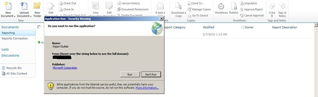

{} 

अब जब SharePoint RS सर्वर पर स्थापित और कॉन्फ़िगर हो चुका है और Reporting Services Configuration Manager के माध्यम से RS सेटअप हो चुका है, तो हम Central Admin में कॉन्फ़िगरेशन की ओर बढ़ सकते हैं। RS 2008 R2 ने इस प्रक्रिया को वास्तव में सरल बना दिया है। पहले आपको इसे काम करने के लिए 3‑स्टेप प्रक्रिया करनी पड़ती थी। अब केवल एक ही स्टेप है। 

हम Central Administrator वेबसाइट पर जाकर General Application Settings में जाना चाहते हैं। नीचे की ओर हम Reporting Services देखेंगे। 

{} 

**Figure 17**: SharePoint Configuration 

{} 

**Reporting Services Integration** पर क्लिक करें। 

{} 
## **वेब सेवा URL**
Reporting Services Configuration Manager में पाए गए Report Server का URL हम यहाँ प्रदान करेंगे। 
## **प्रमाणीकरण मोड**
हम एक Authentication Mode भी चुनेंगे। निम्नलिखित MSDN लिंक इनकी विस्तृत जानकारी देता है। 
[Security Overview for Reporting Services in SharePoint Integrated Mode](https://docs.microsoft.com/en-us/previous-versions/sql/sql-server-2008-r2/bb283324(v=sql.105)) 

संक्षेप में, यदि आपका साइट **Claims Authentication** उपयोग कर रहा है, तो आप यहाँ जो भी चुनें, हमेशा Trusted Authentication का उपयोग करेंगे। यदि आप विंडोज़ क्रेडेंशियल पास करना चाहते हैं, तो Windows Authentication चुनें। Trusted Authentication के लिए हम SPUser टोकन पास करेंगे और विंडोज़ क्रेडेंशियल पर निर्भर नहीं रहेंगे। 

यदि आपने अपने Classic Mode साइट को NTLM के लिए कॉन्फ़िगर किया है और RS भी NTLM के लिए सेट है, तो आप Trusted Authentication का उपयोग करेंगे। विंडोज़ Authentication और डेटा सोर्स के लिए पास करने हेतु Kerberos की आवश्यकता होगी। 

**Figure 18**: Setting Reporting Services Integration credentials
## **फ़ीचर सक्रिय करें**
यह आपको Reporting Services को सभी Site collections पर सक्रिय करने का विकल्प देता है, या आप उन साइटों को चुन सकते हैं जहाँ इसे सक्रिय करना है। यह मूल रूप से निर्धारित करता है कि कौन सी साइटें Reporting Services का उपयोग कर सकेंगी। 
जब यह पूरा हो जाए, तो आपको निम्नलिखित आकृति दिखेगी। 

**Figure 19**: Successful Integration of Reporting Services with the SharePoint environment 

Figure 14 में दिए गए Report Server URL पर वापस जाएँ, तो आपको नीचे दिखी गई आकृति जैसी कुछ दिखाई देगी। 

**Figure 20**: Successful Verification of Reporting Services with the SharePoint environment 

{} 

यदि आपका SharePoint साइट SSL के लिये कॉन्फ़िगर किया गया है, तो यह सूची में नहीं दिखेगा। यह ज्ञात समस्या है और इसका अर्थ यह नहीं है कि कोई त्रुटि है। आपके रिपोर्ट अभी भी काम करेंगे। 

{} 

अब हम SharePoint 2010 में Reporting Services का उपयोग करने के लिए तैयार हैं। पहले के संस्करण की तरह हमारे पास “Site Collection Feature” में एक फ़ीचर (Reporting Services Integration कॉन्फ़िगर करने पर सक्रिय) है। इंस्टॉलेशन ने हमारी साइट में जोड़ने के लिये 3 कंटेंट टाइप भी जोड़े। Figure 21 में हम दो कंटेंट टाइप देखें जो डॉक्यूमेंट लाइब्रेरी में जोड़कर कस्टम रिपोर्ट बनाते हैं, जैसा कि Figure 21 में दिखता है। 

**Figure 21**: Report Builder 

“**Reporter Builder**” एक ActiveX है जिसे हमें सर्वर पर डाउनलोड करना पड़ता है, जैसा कि Figure 22 में दिखाया गया है। 

**Figure 22**: Download and Install Report Builder 

डाउनलोड पूरा होने पर **“Report Builder”** चलाएँ। अब हम अपना पहला रिपोर्ट डिजाइन करने के लिए तैयार हैं, जैसा कि Figure 23 में दिखाया गया है। 

**Figure 23**: Report Builder New Report Generation Wizard 

रिपोर्ट बनाकर हम उसे उस डॉक्यूमेंट लाइब्रेरी में सहेज सकते हैं जिसे हमने SharePoint 2010 में रिपोर्ट रखने के लिये बनाया था। 

दूसरा कंटेंट टाइप शेयर किए गए कनेक्शन को डेटा सोर्स के रूप में बनाने और उन्हें SharePoint में डॉक्यूमेंट लाइब्रेरी में सहेजने के लिये उपयोग किया जाता है। हम एक डॉक्यूमेंट लाइब्रेरी बना सकते हैं, इस कंटेंट टाइप को जोड़ सकते हैं और फिर हमारे पास रिपोर्टों के डेटा सोर्स को बदलने के लिये उपलब्ध कनेक्शन हो जाएंगे। 

**Figure 24**: Successful export of report to Report Server