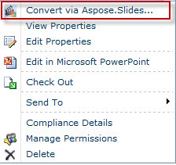

{} 

जब Aspose.Slides for SharePoint को SharePoint सर्वर पर स्थापित किया जाता है, तो यह प्रस्तुति के मेनू में **Convert via Aspose.Slides.SharePoint** विकल्प जोड़ता है, जैसा कि नीचे दिखाया गया है: 

**Aspose.Slides for SharePoint को स्थापित करने से दस्तावेज़ मेनुओं में Convert via Aspose.Slides विकल्प जोड़ता है** 

{} 
## **प्रेज़ेंटेशन को रूपांतरित करना**
SharePoint दस्तावेज़ लाइब्रेरी से Microsoft PowerPoint दस्तावेज़ को रूपांतरित करने के लिए: 

1. दस्तावेज़ लाइब्रेरी में एक Microsoft PowerPoint दस्तावेज़ चुनें।  
2. ड्रॉप-डाउन तीर पर क्लिक करके मेनू खोलें और **Convert via Aspose.Slides.SharePoint** पर क्लिक करें।  

   **Presentation 2 फ़ाइल का मेनू जो Convert via Aspose.Slides विकल्प दर्शाता है** 

3. फ़ॉर्म से इच्छित आउटपुट फ़ॉर्मेट चुनें। यदि चाहें, तो आउटपुट फ़ाइल का नाम और लक्ष्य फ़ोल्डर बदलें।  
4. फ़ाइल को रूपांतरित करने के लिए **Convert** पर क्लिक करें।  

   **रूपांतरण फ़ॉर्म आपको आउटपुट फ़ाइल फ़ॉर्मेट, नाम और गंतव्य चुनने की अनुमति देता है** 

5. रूपांतरण पूर्ण होने पर एक सफलता संदेश प्रदर्शित होता है।  

   **रूपांतरण सफल रहा** 

6. स्रोत निर्देशिका पर जाने के लिए **Source Library** पर क्लिक करें या वह निर्देशिका जहाँ फ़ाइल सहेजी गई है, उसके लिए **Destination Library** पर क्लिक करें।  

   रूपांतरित दस्तावेज़ दस्तावेज़ लाइब्रेरी में दिखाई देता है।  

   **रूपांतरित दस्तावेज़ वह लाइब्रेरी में दर्शाया गया जहाँ इसे सहेजा गया था** 

