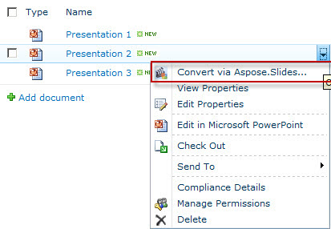

{}
जब Aspose.Slides for SharePoint को SharePoint सर्वर पर स्थापित किया जाता है और किसी साइट संग्रह के लिए सक्रिय किया जाता है, तो यह उसके दस्तावेज़ लाइब्रेरियों में दस्तावेज़ मेन्यू में **Convert via Aspose.Slides** आइटम जोड़ता है, जैसा कि नीचे दिखाया गया है। SharePoint 2007 पर, इस आइटम का नाम **Convert with Aspose.Slides** है।

**Aspose.Slides for SharePoint को स्थापित करने से Convert via Aspose.Slides आइटम दस्तावेज़ मेन्यू में जुड़ता है**

{}

## **एक प्रस्तुति को बदलना**

SharePoint दस्तावेज़ लाइब्रेरी से Microsoft PowerPoint प्रस्तुति (PPT या PPTX) को बदलने के लिए:

1. दस्तावेज़ लाइब्रेरी में एक Microsoft PowerPoint प्रस्तुति चुनें।
2. उसका मेन्यू खोलें और **Convert via Aspose.Slides** पर क्लिक करें।

   **Presentation 2 फ़ाइल का मेन्यू, जिसमें Convert via Aspose.Slides आइटम दिखाया गया है**

   

3. **Convert to** के तहत आउटपुट फ़ॉर्मेट चुनें। यदि चाहें, तो आउटपुट फ़ाइल नाम और लक्ष्य फ़ोल्डर बदलें।
4. **Convert** पर क्लिक करके फ़ाइल को बदलें।

   **परिवर्तन पृष्ठ आपको आउटपुट फ़ॉर्मेट, फ़ाइल नाम और लक्ष्य चुनने की अनुमति देता है**

   

5. जब परिवर्तन पूर्ण हो जाता है, तो एक सफलता संदेश प्रदर्शित होता है।

   **परिवर्तन सफल रहा**

   

6. **Source Library** (स्रोत फ़ोल्डर पर जाने के लिए) या **Destination Library** (उस फ़ोल्डर पर जाने के लिए जहाँ फ़ाइल सहेजी गई) पर क्लिक करें।

   परिवर्तित दस्तावेज़ दस्तावेज़ लाइब्रेरी में दिखाई देता है।

   **परिवर्तित दस्तावेज़ को उस लाइब्रेरी में दिखाया गया जहाँ इसे सहेजा गया**

   

{}
स्क्रीनशॉट्स एक पुरानी संस्करण के साथ लिए गए थे, जिसमें केवल PDF, TIFF और XPS फ़ॉर्मेट उपलब्ध थे। वर्तमान परिवर्तन पृष्ठ अधिक आउटपुट फ़ॉर्मेट प्रदान करता है; देखें [एकाधिक फ़ॉर्मेट समर्थन](/slides/hi/sharepoint/multiple-format-support/)।
{}

SharePoint 2010 और बाद में, आप लाइब्रेरी में एक या अधिक प्रस्तुतियों का चयन करके **Aspose Tools** रिबन टैब पर **Convert Slides** पर क्लिक कर सकते हैं। यह वही परिवर्तन पृष्ठ खोलता है।