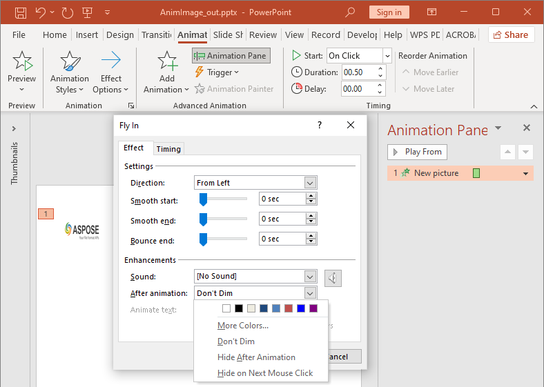

## **Bevezetés**

Az animációk vizuális effektusok, amelyeket szövegekre, képekre, alakzatokra vagy [diagramokra](https://docs.aspose.com/slides/hu/androidjava/animated-charts/) lehet alkalmazni. Életet lehelnek a bemutatókba vagy azok elemeibe.

## **Miért használjunk animációkat a bemutatókban?**

Az animációk segítségével

* az információ áramlásának irányítása
* a fontos pontok hangsúlyozása
* a közönség érdeklődésének vagy részvételének növelése
* a tartalom könnyebb olvasása, befogadása vagy feldolgozása
* a olvasók vagy nézők figyelmének felhívása a bemutató fontos részeire

A PowerPoint számos lehetőséget és eszközt biztosít az animációkhoz és animációs hatásokhoz a **belépés**, **kilépés**, **kiemelés** és **mozgásútvonalak** kategóriákban. 

## **Animációk az Aspose.Slides-ben**

* Az Aspose.Slides biztosítja a szükséges osztályokat és típusokat az animációkkal való munkához a `Aspose.Slides.Animation` névtérben,
* Az Aspose.Slides több mint **150 animációs hatást** biztosít a [EffectType](https://reference.aspose.com/slides/hu/androidjava/com.aspose.slides/effecttype) felsorolásban. Ezek a hatások lényegében megegyeznek (vagy ekvivalensek) a PowerPointban használtakkal.

## **Animáció alkalmazása szövegdobozra**

Az Aspose.Slides for Android Java használatával lehetővé válik animáció alkalmazása egy alakzat szövegére.

1. Hozzon létre egy példányt a [Presentation](https://reference.aspose.com/slides/hu/androidjava/com.aspose.slides/Presentation) osztályból.
2. Szerezzen be egy dia referenciát az indexe alapján.
3. Adjon hozzá egy `rectangle` [IAutoShape](https://reference.aspose.com/slides/hu/androidjava/com.aspose.slides/iautoshape) elemet.
4. Adjon szöveget a [IAutoShape.TextFrame](https://reference.aspose.com/slides/hu/androidjava/com.aspose.slides/IAutoShape#addTextFrame-java.lang.String-) elemhez.
5. Szerezze meg a fő effektussorozatot.
6. Adjon hozzá egy animációs hatást a [IAutoShape](https://reference.aspose.com/slides/hu/androidjava/com.aspose.slides/iautoshape) elemhez.
7. Állítsa be a `TextAnimation.BuildType` tulajdonságot a `BuildType` felsorolás értékére.
8. Írja a bemutatót lemezre PPTX fájlként.

Ez a Java kód bemutatja, hogyan alkalmazhatja a `Fade` hatást az AutoShape-re, és állíthatja a szöveganimációt *1. szintű bekezdések szerint* értékre:

```java
// Példányosít egy prezentáció osztályt, amely egy prezentáció fájlt képvisel.
Presentation pres = new Presentation();
try {
    ISlide sld = pres.getSlides().get_Item(0);

    // Új AutoShape-et ad hozzá szöveggel
    IAutoShape autoShape = sld.getShapes().addAutoShape(ShapeType.Rectangle, 20, 20, 150, 100);

    ITextFrame textFrame = autoShape.getTextFrame();
    textFrame.setText("First paragraph \nSecond paragraph \n Third paragraph");

    // Lekéri a dia fő sorozatát.
    ISequence sequence = sld.getTimeline().getMainSequence();

    // Fade animációs hatást ad a alakzathoz
    IEffect effect = sequence.addEffect(autoShape, EffectType.Fade, EffectSubtype.None, EffectTriggerType.OnClick);

    // Az alakzat szövegét az 1. szintű bekezdések szerint animálja
    effect.getTextAnimation().setBuildType(BuildType.ByLevelParagraphs1);

    // Mentse a PPTX fájlt lemezre
    pres.save(path + "AnimText_out.pptx", SaveFormat.Pptx);
} finally {
    if (pres != null) pres.dispose();
}
```

{} 

A szövegre alkalmazott animációk mellett animációkat alkalmazhat egyetlen [Paragraph](https://reference.aspose.com/slides/hu/androidjava/com.aspose.slides/iparagraph) elemre is. Lásd a [**Animált szöveg**](/slides/hu/androidjava/animated-text/) oldalt.

{} 

## **Animáció alkalmazása PictureFrame-re**

1. Hozzon létre egy példányt a [Presentation](https://reference.aspose.com/slides/hu/androidjava/com.aspose.slides/Presentation) osztályból.
2. Szerezzen be egy dia referenciát az indexe alapján.
3. Adjon hozzá vagy szerezzen be egy [PictureFrame](https://reference.aspose.com/slides/hu/androidjava/com.aspose.slides/pictureframe) elemet a diára.
4. Szerezze meg a fő hatássorozatot.
5. Adjon hozzá egy animációs hatást a [PictureFrame](https://reference.aspose.com/slides/hu/androidjava/com.aspose.slides/pictureframe) elemhez.
6. Írja a bemutatót lemezre PPTX fájlként.

Ez a Java kód bemutatja, hogyan alkalmazhatja a `Fly` hatást egy képkockára:

```java
// Példányosít egy prezentáció osztályt, amely egy prezentáció fájlt képvisel.
Presentation pres = new Presentation();
try {
    // Betölti a képet, amelyet a prezentáció képkollekciójába adunk hozzá
    IPPImage picture;
    IImage image = Images.fromFile("aspose-logo.jpg");
    try {
        picture = pres.getImages().addImage(image);
    } finally {
        if (image != null) image.dispose();
    }

    // Képkeretet ad a diára
    IPictureFrame picFrame = pres.getSlides().get_Item(0).getShapes().addPictureFrame(ShapeType.Rectangle, 50, 50, 100, 100, picture);

    // Lekéri a dia fő sorozatát.
    ISequence sequence = pres.getSlides().get_Item(0).getTimeline().getMainSequence();

    // Fly animációs hatást ad a balról a képkerethez
    IEffect effect = sequence.addEffect(picFrame, EffectType.Fly, EffectSubtype.Left, EffectTriggerType.OnClick);

    // Mentse a PPTX fájlt lemezre
    pres.save(path + "AnimImage_out.pptx", SaveFormat.Pptx);
} catch(IOException e) {
} finally {
    if (pres != null) pres.dispose();
}
```

## **Animáció alkalmazása alakzatra**

1. Hozzon létre egy példányt a [Presentation](https://reference.aspose.com/slides/hu/androidjava/com.aspose.slides/Presentation) osztályból.
2. Szerezzen be egy dia referenciát az indexe alapján.
3. Adjon hozzá egy `rectangle` [IAutoShape](https://reference.aspose.com/slides/hu/androidjava/com.aspose.slides/iautoshape) elemet.
4. Adjon hozzá egy `Bevel` [IAutoShape](https://reference.aspose.com/slides/hu/androidjava/com.aspose.slides/iautoshape) elemet (amikor ezt az objektumot rákattintják, az animáció lejátszásra kerül).
5. Hozzon létre egy hatássorozatot a bevel alakzaton.
6. Hozzon létre egy egyedi `UserPath`-t.
7. Adjon parancsokat a `UserPath`-ra való mozgáshoz.
8. Írja a bemutatót lemezre PPTX fájlként.

Ez a Java kód bemutatja, hogyan alkalmazhatja a `PathFootball` (path football) hatást egy alakzatra:

```java
// Példányosít egy Presentation osztályt, amely egy PPTX fájlt képvisel.
Presentation pres = new Presentation();
try {
    ISlide sld = pres.getSlides().get_Item(0);

    // Létrehozza a PathFootball hatást egy meglévő alakzatra a semmiből.
    IAutoShape ashp = sld.getShapes().addAutoShape(ShapeType.Rectangle, 150, 150, 250, 25);
    ashp.addTextFrame("Animated TextBox");

    // Hozzáadja a PathFootball animációs hatást
    pres.getSlides().get_Item(0).getTimeline().getMainSequence().addEffect(ashp, EffectType.PathFootball,
            EffectSubtype.None, EffectTriggerType.AfterPrevious);

    // Létrehoz valamilyen "gombot".
    IShape shapeTrigger = pres.getSlides().get_Item(0).getShapes().addAutoShape(ShapeType.Bevel, 10, 10, 20, 20);

    // Létrehoz egy hatássorozatot ehhez a gombhoz.
    ISequence seqInter = pres.getSlides().get_Item(0).getTimeline().getInteractiveSequences().add(shapeTrigger);

     // Létrehoz egy egyéni felhasználói útvonalat. Objektumunk csak a gomb megnyomása után lesz mozgatva.
    IEffect fxUserPath = seqInter.addEffect(ashp, EffectType.PathUser, EffectSubtype.None, EffectTriggerType.OnClick);

     // Hozzáad parancsokat a mozgáshoz, mivel a létrehozott útvonal üres.
    IMotionEffect motionBvh = ((IMotionEffect)fxUserPath.getBehaviors().get_Item(0));

    Point2D.Float[] pts = new Point2D.Float[1];
    pts[0] = new Point2D.Float(0.076f, 0.59f);
    motionBvh.getPath().add(MotionCommandPathType.LineTo, pts, MotionPathPointsType.Auto, true);
    pts[0] = new Point2D.Float(-0.076f, -0.59f);
    motionBvh.getPath().add(MotionCommandPathType.LineTo, pts, MotionPathPointsType.Auto, false);
    motionBvh.getPath().add(MotionCommandPathType.End, null, MotionPathPointsType.Auto, false);

     // Mentse a PPTX fájlt lemezre
    pres.save("AnimExample_out.pptx", SaveFormat.Pptx);
} finally {
    if (pres != null) pres.dispose();
}
```

## **Az alakzatra alkalmazott animációs hatások lekérése**

Az alábbi példák megmutatják, hogyan használhatja a `getEffectsByShape` metódust a [ISequence](https://reference.aspose.com/slides/hu/androidjava/com.aspose.slides/isequence/) interfészből, hogy lekérje az alakzatra alkalmazott összes animációs hatást.

**Példa 1: Az animációs hatások lekérése egy normál dián lévő alakzatra**

Korábban megtanulta, hogyan adhat animációs hatásokat alakzatokhoz PowerPoint bemutatókban. Az alábbi mintakód megmutatja, hogyan kérheti le az első alakzatra az első normál dián a `AnimExample_out.pptx` bemutatóban alkalmazott hatásokat.

```java
Presentation presentation = new Presentation("AnimExample_out.pptx");
try {
    ISlide firstSlide = presentation.getSlides().get_Item(0);

    // Lekéri a dia fő animációs sorozatát.
    ISequence sequence = firstSlide.getTimeline().getMainSequence();

    // Lekéri az első alakzatot az első dián.
    IShape shape = firstSlide.getShapes().get_Item(0);

    // Lekéri az alakzatra alkalmazott animációs hatásokat.
    IEffect[] shapeEffects = sequence.getEffectsByShape(shape);

    if (shapeEffects.length > 0)
        System.out.println("The shape " + shape.getName() + " has " + shapeEffects.length + " animation effects.");
} finally {
    if (presentation != null) presentation.dispose();
}
```

**Példa 2: Az összes animációs hatás lekérése, beleértve a helyőrzőkből örökölt hatásokat**

Ha egy normál dián lévő alakzatnak olyan helyőrzői vannak, amelyek a elrendezés dián és/vagy a mester dián találhatók, és animációs hatásokat adtak ezekhez a helyőrzőkhöz, akkor az alakzat összes hatása lejátszásra kerül a diavetítés során, beleértve a helyőrzőkből örökölt hatásokat.

Tegyük fel, hogy van egy `sample.pptx` nevű PowerPoint bemutató fájlunk, amely egyetlen diát tartalmaz, amelyen csak egy lábléc alakzat található a "Made with Aspose.Slides" szöveggel, és a **Random Bars** hatás van alkalmazva az alakzatra.


Tegyük fel továbbá, hogy a **Split** hatás van alkalmazva a lábléc helyőrzőre a **layout** dián.


Végül, a **Fly In** hatás van alkalmazva a lábléc helyőrzőre a **master** dián.


Az alábbi mintakód megmutatja, hogyan használhatja a `getBasePlaceholder` metódust a [IShape](https://reference.aspose.com/slides/hu/androidjava/com.aspose.slides/ishape/) interfészből a formahelyőrzők eléréséhez, és hogyan kérheti le a lábléc alakzatra alkalmazott animációs hatásokat, beleértve az elrendezés és a mester diákon elhelyezkedő helyőrzőkből örökölt hatásokat.

```java
Presentation presentation = new Presentation("sample.pptx");

ISlide slide = presentation.getSlides().get_Item(0);

// Get animation effects of the shape on the normal slide.
IShape shape = slide.getShapes().get_Item(0);
IEffect[] shapeEffects = slide.getTimeline().getMainSequence().getEffectsByShape(shape);

// Get animation effects of the placeholder on the layout slide.
IShape layoutShape = shape.getBasePlaceholder();
IEffect[] layoutShapeEffects = slide.getLayoutSlide().getTimeline().getMainSequence().getEffectsByShape(layoutShape);

// Get animation effects of the placeholder on the master slide.
IShape masterShape = layoutShape.getBasePlaceholder();
IEffect[] masterShapeEffects = slide.getLayoutSlide().getMasterSlide().getTimeline().getMainSequence().getEffectsByShape(masterShape);

System.out.println("Main sequence of shape effects:");
printEffects(masterShapeEffects);
printEffects(layoutShapeEffects);
printEffects(shapeEffects);

presentation.dispose();
```
```java
static void printEffects(IEffect[] effects)
{
    for (IEffect effect : effects)
    {
        String typeName = EffectType.getName(EffectType.class, effect.getType());
        String subtypeName = EffectSubtype.getName(EffectSubtype.class, effect.getSubtype());

        System.out.println(typeName + " " + subtypeName);
    }
}
```

Output:
```text
Main sequence of shape effects:
Fly Bottom
Split VerticalIn
RandomBars Horizontal
```

## **Az animációs hatás időzítési tulajdonságainak módosítása**

Az Aspose.Slides for Android Java segítségével módosíthatja egy animációs hatás időzítési tulajdonságait.

Ez a Microsoft PowerPoint Animation Timing ablaka:


A PowerPoint időzítés **Start** legördülő listája egyezik a [Effect.Timing.TriggerType](https://reference.aspose.com/slides/hu/androidjava/com.aspose.slides/ITiming#getTriggerType--) tulajdonsággal.
A PowerPoint időzítés **Duration** egyezik a [Effect.Timing.Duration](https://reference.aspose.com/slides/hu/androidjava/com.aspose.slides/ITiming#getDuration--) tulajdonsággal. Az animáció időtartama (másodpercben) az az összes idő, amit a animáció egy ciklus befejezéséhez igényel.
A PowerPoint időzítés **Delay** egyezik a [Effect.Timing.TriggerDelayTime](https://reference.aspose.com/slides/hu/androidjava/com.aspose.slides/ITiming#getTriggerDelayTime--) tulajdonsággal.

Ez a mód, ahogyan módosíthatja az Effect Timing tulajdonságokat:

1. Alkalmazza ([Apply](#apply-animation-to-shape)) vagy szerezze be az animációs hatást.
2. Állítson be új értékeket a szükséges [Effect.Timing](https://reference.aspose.com/slides/hu/androidjava/com.aspose.slides/IEffect#getTiming--) tulajdonságokra.
3. Mentse a módosított PPTX fájlt.

```java
// Példányosít egy prezentáció osztályt, amely egy prezentáció fájlt képvisel.
Presentation pres = new Presentation("AnimExample_out.pptx");
try {
    // Lekéri a dia fő sorozatát.
    ISequence sequence = pres.getSlides().get_Item(0).getTimeline().getMainSequence();

    // Lekéri a fő sorozat első hatását.
    IEffect effect = sequence.get_Item(0);

    // Módosítja a hatás TriggerType-ot kattintásra
    effect.getTiming().setTriggerType(EffectTriggerType.OnClick);

    // Módosítja a hatás időtartamát
    effect.getTiming().setDuration(3f);

    // Módosítja a hatás TriggerDelayTime-ot
    effect.getTiming().setTriggerDelayTime(0.5f);

    // Mentse a PPTX fájlt lemezre
    pres.save("AnimExample_changed.pptx", SaveFormat.Pptx);
} finally {
    if (pres != null) pres.dispose();
}
```

## **Animációs hatás hangja**

Az Aspose.Slides biztosítja ezeket a tulajdonságokat, hogy a hangokkal dolgozhasson animációs hatásokban: 

- [setSound(IAudio value)](https://reference.aspose.com/slides/hu/androidjava/com.aspose.slides/effect/#setSound-com.aspose.slides.IAudio-)
- [setStopPreviousSound(boolean value)](https://reference.aspose.com/slides/hu/androidjava/com.aspose.slides/effect/#setStopPreviousSound-boolean-)

### **Animációs hatás hangjának hozzáadása**

Ez a Java kód bemutatja, hogyan adhat hozzá egy animációs hatás hangot, és állítsa le, amikor a következő hatás elindul:

```java
Presentation pres = new Presentation("AnimExample_out.pptx");
try {
    // Hozzáad audiót a prezentáció audio gyűjteményéhez
    IAudio effectSound = pres.getAudios().addAudio(Files.readAllBytes(Paths.get("sampleaudio.wav")));

    ISlide firstSlide = pres.getSlides().get_Item(0);

    // Lekéri a dia fő sorozatát.
    ISequence sequence = firstSlide.getTimeline().getMainSequence();

    // Lekéri a fő sorozat első hatását
    IEffect firstEffect = sequence.get_Item(0);

    // Ellenőrzi a hatást "No Sound"
    if (!firstEffect.getStopPreviousSound() && firstEffect.getSound() == null)
    {
        // Hozzáad hangot az első hatáshoz
        firstEffect.setSound(effectSound);
    }

    // Lekéri a dia első interaktív sorozatát.
    ISequence interactiveSequence = firstSlide.getTimeline().getInteractiveSequences().get_Item(0);

    // Beállítja a hatás "Stop previous sound" jelzőjét
    interactiveSequence.get_Item(0).setStopPreviousSound(true);

    // Mentse a PPTX fájlt lemezre
    pres.save("AnimExample_Sound_out.pptx", SaveFormat.Pptx);
} finally {
    if (pres != null) pres.dispose();
}
```

### **Animációs hatás hangjának kinyerése**

1. Hozzon létre egy példányt a [Presentation](https://reference.aspose.com/slides/hu/androidjava/com.aspose.slides/presentation/) osztályból.
2. Szerezzen be egy dia referenciát az indexe alapján. 
3. Szerezze meg a fő hatássorozatot. 
4. Nyissa ki a [setSound(IAudio value)](https://reference.aspose.com/slides/hu/androidjava/com.aspose.slides/effect/#setSound-com.aspose.slides.IAudio-) minden animációs hatáshoz beágyazott hangot.

Ez a Java kód bemutatja, hogyan nyerheti ki a hangot, amely egy animációs hatáshoz van beágyazva:

```java
// Példányosít egy prezentáció osztályt, amely egy prezentáció fájlt képvisel.
Presentation presentation = new Presentation("EffectSound.pptx");
try {
    ISlide slide = presentation.getSlides().get_Item(0);

    // Lekéri a dia fő sorozatát.
    ISequence sequence = slide.getTimeline().getMainSequence();

    for (IEffect effect : sequence)
    {
        if (effect.getSound() == null)
            continue;

        // Kinyeri a hatás hangját bájt tömbként
        byte[] audio = effect.getSound().getBinaryData();
    }
} finally {
    if (presentation != null) presentation.dispose();
}
```

## **Animáció után**

Az Aspose.Slides for Android Java segítségével módosíthatja egy animációs hatás After animation tulajdonságát.



A PowerPoint Effect **After animation** legördülő listája egyezik ezekkel a tulajdonságokkal: 

- [setAfterAnimationType(int value)](https://reference.aspose.com/slides/hu/androidjava/com.aspose.slides/ieffect/#setAfterAnimationType-int-) tulajdonság, amely leírja az After animation típust :
  * A PowerPoint **More Colors** egyezik a [AfterAnimationType.Color](https://reference.aspose.com/slides/hu/androidjava/com.aspose.slides/afteranimationtype/#Color) típussal;
  * A PowerPoint **Don't Dim** listaelem egyezik a [AfterAnimationType.DoNotDim](https://reference.aspose.com/slides/hu/androidjava/com.aspose.slides/afteranimationtype/#DoNotDim) típussal (az alapértelmezett after animation típus);
  * A PowerPoint **Hide After Animation** elem egyezik a [AfterAnimationType.HideAfterAnimation](https://reference.aspose.com/slides/hu/androidjava/com.aspose.slides/afteranimationtype/#HideAfterAnimation) típussal;
  * A PowerPoint **Hide on Next Mouse Click** elem egyezik a [AfterAnimationType.HideOnNextMouseClick](https://reference.aspose.com/slides/hu/androidjava/com.aspose.slides/afteranimationtype/#HideOnNextMouseClick) típussal;
- [setAfterAnimationColor(IColorFormat value)](https://reference.aspose.com/slides/hu/androidjava/com.aspose.slides/ieffect/#setAfterAnimationColor-com.aspose.slides.IColorFormat-) tulajdonság, amely egy after animation színformátumot definiál. Ez a tulajdonság a [AfterAnimationType.Color](https://reference.aspose.com/slides/hu/androidjava/com.aspose.slides/afteranimationtype/#Color) típussal együtt működik. Ha a típust másikra változtatja, az after animation szín törlésre kerül.

Ez a Java kód megmutatja, hogyan változtathat egy after animation hatáson:

```java
// Példányosít egy prezentáció osztályt, amely egy prezentáció fájlt képvisel
Presentation pres = new Presentation("AnimImage_out.pptx");
try {
    ISlide firstSlide = pres.getSlides().get_Item(0);

    // Lekéri a fő sorozat első hatását
    IEffect firstEffect = firstSlide.getTimeline().getMainSequence().get_Item(0);

    // Megváltoztatja az after animation típust Color értékre
    firstEffect.setAfterAnimationType(AfterAnimationType.Color);

    // Beállítja az after animation halványítás színét
    firstEffect.getAfterAnimationColor().setColor(Color.BLUE);

    // Mentse a PPTX fájlt lemezre
    pres.save("AnimImage_AfterAnimation.pptx", SaveFormat.Pptx);
} finally {
    if (pres != null) pres.dispose();
}
```

## **Szöveg animálása**

Az Aspose.Slides biztosítja ezeket a tulajdonságokat, hogy a *Animate text* blokkot kezelje egy animációs hatásban:

- [setAnimateTextType(int value)](https://reference.aspose.com/slides/hu/androidjava/com.aspose.slides/ieffect/#setAnimateTextType-int-) amely leírja az animált szöveg típusát a hatásban. A forma szövege animálható:
  - Egyszerre ([AnimateTextType.AllAtOnce](https://reference.aspose.com/slides/hu/androidjava/com.aspose.slides/animatetexttype/#AllAtOnce) típus)
  - Szó szerint ([AnimateTextType.ByWord](https://reference.aspose.com/slides/hu/androidjava/com.aspose.slides/animatetexttype/#ByWord) típus)
  - Betű szerint ([AnimateTextType.ByLetter](https://reference.aspose.com/slides/hu/androidjava/com.aspose.slides/animatetexttype/#ByLetter) típus)
- [setDelayBetweenTextParts(float value)](https://reference.aspose.com/slides/hu/androidjava/com.aspose.slides/ieffect/#setDelayBetweenTextParts-float-) beállít egy késleltetést az animált szövegrészek (szavak vagy betűk) között. A pozitív érték a hatás időtartamának százalékát adja meg. A negatív érték másodpercben adja meg a késleltetést.

Ez a mód, ahogyan módosíthatja az Effect Animate text tulajdonságokat:

1. Alkalmazza ([Apply](#apply-animation-to-shape)) vagy szerezze be az animációs hatást.
2. Állítsa be a [setBuildType(int value)](https://reference.aspose.com/slides/hu/androidjava/com.aspose.slides/itextanimation/#setBuildType-int-) tulajdonságot a [BuildType.AsOneObject](https://reference.aspose.com/slides/hu/androidjava/com.aspose.slides/buildtype/#AsOneObject) értékre, hogy kikapcsolja a *By Paragraphs* animációs módot.
3. Állítson be új értékeket a [setAnimateTextType(int value)](https://reference.aspose.com/slides/hu/androidjava/com.aspose.slides/ieffect/#setAnimateTextType-int-) és a [setDelayBetweenTextParts(float value)](https://reference.aspose.com/slides/hu/androidjava/com.aspose.slides/ieffect/#setDelayBetweenTextParts-float-) tulajdonságokra.
4. Mentse a módosított PPTX fájlt.

```java
// Példányosít egy prezentáció osztályt, amely egy prezentáció fájlt képvisel.
Presentation pres = new Presentation("AnimTextBox_out.pptx");
try {
    ISlide firstSlide = pres.getSlides().get_Item(0);

    // Lekéri a fő sorozat első hatását
    IEffect firstEffect = firstSlide.getTimeline().getMainSequence().get_Item(0);

    // Megváltoztatja a hatás szöveganimáció típusát "As One Object" értékre
    firstEffect.getTextAnimation().setBuildType(BuildType.AsOneObject);

    // Megváltoztatja a hatás animált szöveg típusát "By word" értékre
    firstEffect.setAnimateTextType(AnimateTextType.ByWord);

    // Beállítja a szavak közötti késleltetést a hatás időtartamának 20%-ára
    firstEffect.setDelayBetweenTextParts(20f);

    // Mentse a PPTX fájlt lemezre
    pres.save("AnimTextBox_AnimateText.pptx", SaveFormat.Pptx);
} finally {
    if (pres != null) pres.dispose();
}
```

## **FAQ**

**Hogyan biztosíthatom, hogy az animációk megmaradjanak a prezentáció webre közzétételekor?**

[Export to HTML5](/slides/hu/androidjava/export-to-html5/) és engedélyezze az [options](https://reference.aspose.com/slides/hu/androidjava/com.aspose.slides/html5options/) beállításokat, amelyek a [shape](https://reference.aspose.com/slides/hu/androidjava/com.aspose.slides/html5options/#setAnimateShapes-boolean-) és [transition](https://reference.aspose.com/slides/hu/androidjava/com.aspose.slides/html5options/#setAnimateTransitions-boolean-) animációkat kezelik. A sima HTML nem játssza le a diák animációit, míg a HTML5 igen.

**Hogyan befolyásolja a z-sorrend (réteg sorrend) módosítása az animációt?**

Az animáció és a rajzolási sorrend független egymástól: egy hatás szabályozza a megjelenés/eltűnés időzítését és típusát, míg a [z-order](https://reference.aspose.com/slides/hu/androidjava/com.aspose.slides/shape/#getZOrderPosition--) határozza meg, mi takarja meg mi‑t. A látható eredményt a kombinációjuk határozza meg. (Ez a PowerPoint általános viselkedése; az Aspose.Slides hatás‑és‑alakzat modellje ugyanazt a logikát követi.)

**Vannak korlátozások az animációk videóra konvertálásakor bizonyos hatások esetén?**

Általánosságban a [animációk támogatottak](/slides/hu/androidjava/convert-powerpoint-to-video/), de ritka esetekben vagy bizonyos hatások esetén eltérő módon jelenhetnek meg. Javasolt tesztelni a használt hatásokat és a könyvtár verzióját.