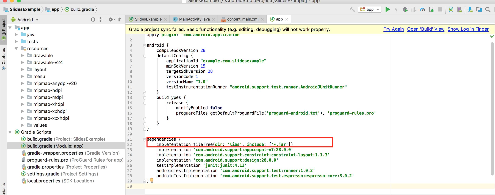

## **Áttekintés**

Ez a cikk elmagyarázza, hogyan telepítheti az Aspose.Slides for Android via Java‑t, és hogyan adhatja hozzá egy Android projekthez. Két telepítési lehetőséget mutat be: a Aspose.Slides JAR fájl manuális hozzáadása a projekthez, valamint a könyvtár telepítése a Maven tárolóból.

A cikk egy lépésről‑lépésre példát is tartalmaz, amely bemutatja, hogyan hozhat létre egy új Android alkalmazást az Android Studio‑ban, hivatkozhat az Aspose.Slides könyvtárra, programozottan létrehozhat PowerPoint prezentációt, és PPTX formátumban mentheti el. Emellett tartalmaz verziókezelési megjegyzéseket, és válaszol a gyakori kérdésekre az integráció ellenőrzésével, a memóriahasználat kezelésével és a végső JAR méret csökkentésével kapcsolatban.

## **Telepítés**
Korábban az Aspose.Slides for Android via Java egyetlen ZIP fájlban került terjesztésre, amely a JAR fájlt, a demókat és a termék dokumentációt tartalmazta. 

1. Ha a Aspose.Words for Android via Java 18.9‑nél régebbi verziót szeretne használni, ki kell csomagolnia az Aspose.Slides.Android.zip megfelelő verzióját a kívánt könyvtárba. 
1. Adja hozzá a kicsomagolt Jar fájlt az alkalmazásához a Build Path konfiguráció használatával. 
### **Hivatkozás hozzáadása az Aspose.Slides for Android via Java Jarfájlhoz**
1. Töltse le a legújabb verziót az [Aspose.Slides for Android via Java](https://downloads.aspose.com/slides/hu/androidjava) oldalról
1. Másolja az aspose‑slides‑18.9‑android.via.java.jar fájlt a projekt *libs/* mappájába



### **Aspose.Slides for Android via Java telepítése a Maven tárolóból**
1. Adja hozzá a Maven tárolót a build.gradle fájlhoz. 
1. Adjon hozzá egy [Aspose.Slides for Android via Java](https://releases.aspose.com/java/repo/com/aspose/aspose-slides/) JAR‑t függőségként.

``` java

 // 1. Adja hozzá a Maven tárolót a build.gradle fájlhoz 

repositories {

    mavenCentral()

    maven { url "https://releases.aspose.com/java/repo/" }

}

// 2. Adja hozzá az 'Aspose.Slides for Android via Java' JAR-t függőségként

dependencies {

    ...

    ...

    compile (group: 'com.aspose', name: 'aspose-slides', version: 'XX.XX', classifier: 'android.via.java')

}

```
## **Az első alkalmazás az Aspose.Slides for Android via Java használatával**
Ebben a részben megtanulja, hogyan kezdjen el dolgozni az Aspose.Slides for Android via Java‑val. Bemutatjuk, hogyan állíthat fel egy új Android projektet a semmiből, hogyan adhat hozzá hivatkozást az Aspose.Slides JAR‑ra, és hogyan hozhat létre egy új PowerPoint prezentációt, amely PPTX formátumban kerül mentésre a lemezen. A példa az [Android Studio](https://developer.android.com/studio/index.html) használatával készül, az alkalmazás pedig az Android Emulatoron fut. Az Aspose.Slides for Android via Java használatához kövesse ezt a lépésről‑lépésre útmutatót:

1. Töltse le és telepítse a [Android Studio](https://developer.android.com/studio/index.html) programot a kívánt helyre. 
1. Indítsa el az Android Studio‑t. 
1. Hozzon létre egy új Android Application Project‑et. 


1. Másolja az aspose‑slides‑XX.XX‑android.via.java.jar fájlt a projekt libs/mappájába


1. Válassza a Project Section‑t (a Fájl menüből) és kattintson a Dependencies fülre.  
   1. Kattintson a „+” gombra. Válassza a file dependency lehetőséget.  
   1. Válassza ki az Aspose.Slides könyvtárat a libs mappából, majd kattintson az OK‑ra.  


1. Szinkronizálja a projektet a gradle fájlokkal, ha szükséges.  


1. Az SD‑kártyához való hozzáféréshez speciális engedélyek szükségesek. Nyissa meg az AndroidManifest.xml fájlt, válassza az XML nézetet, és adja hozzá a következő sort: `<uses-permission android:name="android.permission.WRITE_EXTERNAL_STORAGE" />`


1. Navigáljon vissza az alkalmazás kódrészletéhez, és adja hozzá ezeket az importálásokat:  

``` java

 import java.io.File;

import com.aspose.slides.IAutoShape;

import com.aspose.slides.IParagraph;

import com.aspose.slides.IPortion;

import com.aspose.slides.ISlide;

import com.aspose.slides.ITextFrame;

import com.aspose.slides.Presentation;

import com.aspose.slides.SaveFormat;

import com.aspose.slides.ShapeType;

import android.os.Environment; 

```

Most illessze be a következő kódot az onCreate metódus törzsébe, hogy egy új Presentation‑t hozzon létre a semmiből az Aspose.Slides használatával, és PPTX formátumban mentse az SD‑kártyára.

``` java

 try

{

    // Példányosítsa a Presentation osztályt, amely PPTX-et képvisel
    Presentation pres = new Presentation();


    // Első dia elérése
    ISlide sld = pres.getSlides().get_Item(0);


    // Adjunk hozzá egy Rectangle típusú AutoShape-et
    IAutoShape ashp = sld.getShapes().addAutoShape(ShapeType.Rectangle, 150, 75, 150, 50);


    // Adjunk TextFrame-et a Rectangle-hez
    ashp.addTextFrame(" ");


    // A szövegkeret elérése
    ITextFrame txtFrame = ashp.getTextFrame();


    // Hozza létre a Paragraph objektumot a szövegkerethez
    IParagraph para = txtFrame.getParagraphs().get_Item(0);


    // Hozza létre a Portion objektumot a bekezdéshez
    IPortion portion = para.getPortions().get_Item(0);


    // Szöveg beállítása
    portion.setText("Aspose TextBox");


    // Mentse a PPTX-et a kártyára
    String sdCardPath = Environment.getExternalStorageDirectory().getPath() + File.separator;
    pres.save(sdCardPath + "Textbox.pptx",SaveFormat.Pptx);
}

catch (Exception e)

{
   e.printStackTrace();
}
```

A teljes kód a következőképpen néz ki:


1. Futtassa újra az alkalmazást. Ez alkalommal az Aspose.Slides kód a háttérben fut, és egy dokumentumot generál, amely az SD‑kártyára kerül mentésre.  


1. A létrehozott dokumentum megtekintéséhez lépjen a Tools menübe. Válassza az Android lehetőséget, majd az Android Device Monitor‑t.  


## **Verziókezelés**
2018 óta az Aspose.Slides for Android via Java verziókezelése megfelel az Aspose.Slides for Java verzióinak.  

## **GYIK**

**Hogyan ellenőrizhetem, hogy az Aspose.Slides megfelelően integrálva van?**

Építse fel a projektet, hozzon létre egy üres [Presentation](https://reference.aspose.com/slides/hu/androidjava/com.aspose.slides/presentation/) objektumot, és mentse el egy új név alatt. Ha a fájl kivétel nélkül létrejön, a könyvtár sikeresen integrálva lett.

**Hogyan korlátozhatom a memóriafogyasztást nagy prezentációk feldolgozásakor?**

Emelje a JVM memóriakorlátokat csak annyira, amennyire szükség van, és minden [Presentation](https://reference.aspose.com/slides/hu/androidjava/com.aspose.slides/presentation/) példányt zárjon le egy `finally` blokkban, hogy a gyorsítótár azonnal felszabaduljon. Ez megakadályozza a memóriakimerülési hibákat, és előre láthatóvá teszi a memóriahasználatot kötegelt műveletek során.

**Kizárhatók-e a nem kívánt exportformátumok a végső JAR méretének csökkentése érdekében?**

Az aktuális Aspose.Slides kiadások egyetlen monolitikus könyvtárként kerülnek szállításra, így a build időben nem tiltható le például a PDF vagy SVG exportáló.