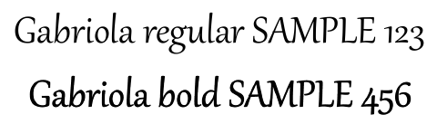

## **Áttekintés**

PowerPoint‑prezentációk (PPT, PPTX, ODP stb.) PDF formátumba konvertálása C++‑ban több előnnyel jár, többek között a különböző eszközök közötti kompatibilitással és a bemutató elrendezésének és formázásának megőrzésével. Ez az útmutató bemutatja, hogyan konvertálhatók a prezentációk PDF‑dokumentumokká, hogyan használhatók különböző beállítások a képminőség szabályozásához, hogyan lehet belefoglalni a rejtett diákat, jelszóval védeni a PDF‑fájlokat, észlelni a betűkészlet‑helyettesítéseket, kiválasztani a konvertálandó diákat, valamint alkalmazni a megfelelőségi szabványokat a kimeneti dokumentumokra.

## **PowerPoint PDF konverziók**

* **PPT**
* **PPTX**
* **ODP**

Egy prezentáció PDF‑be konvertálásához adja át a fájlnevet argumentumként a [Presentation](https://reference.aspose.com/slides/cpp/aspose.slides/presentation/) osztálynak, majd mentse a prezentációt PDF‑ként a [Save](https://reference.aspose.com/slides/cpp/aspose.slides/presentation/save/) metódussal. A [Presentation](https://reference.aspose.com/slides/cpp/aspose.slides/presentation/) osztály elérhetővé teszi a [Save](https://reference.aspose.com/slides/cpp/aspose.slides/presentation/save/) metódust, amelyet általában a prezentáció PDF‑be konvertálására használnak.

{}
Aspose.Slides for C++ beilleszti az API‑információkat és a verziószámot a kimeneti dokumentumokba. Például, amikor egy prezentációt PDF‑be konvertál, az Aspose.Slides kitölti az Application mezőt "*Aspose.Slides*" értékkel, és a PDF Producer mezőt "*Aspose.Slides v XX.XX*" formában. **Megjegyzés** hogy nem adhatók utasítások az Aspose.Slides‑nek, hogy megváltoztassa vagy eltávolítsa ezeket az információkat a kimeneti dokumentumokból.
{}

Aspose.Slides lehetővé teszi, hogy konvertáljon:

* Teljes prezentációk PDF‑be
* Specifikus diák egy prezentációból PDF‑be

Aspose.Slides exportálja a prezentációkat PDF‑be, biztosítva, hogy a kapott PDF‑ek szorosan megegyezzenek az eredeti prezentációkkal. Az elemek és attribútumok pontosan jelennek meg a konverzió során, többek között:

* Képek
* Szövegdobozok és alakzatok
* Szövegformázás
* Bekezdésformázás
* Hiperhivatkozások
* Fejléc és lábléc
* Felsorolások
* Táblázatok

## **PowerPoint PDF konvertálása**

A szabványos PowerPoint‑PDF konverziós folyamat alapértelmezett beállításokat használ. Ebben az esetben az Aspose.Slides megpróbálja a megadott prezentációt PDF‑be konvertálni a legoptimálisabb beállításokkal és a legmagasabb minőségi szinteken.

A következő példa betölt egy prezentációt, és az alapértelmezett export beállításokkal menti az összes látható diát PDF‑be.

```cpp
#include <DOM/Presentation.h>
#include <Export/SaveFormat.h>
#include <system/smart_ptr.h>

using namespace Aspose::Slides;
using namespace Aspose::Slides::Export;
using namespace System;

auto presentation = MakeObject<Presentation>(u"PowerPoint.ppt");
presentation->Save(u"PPT-to-PDF.pdf", SaveFormat::Pdf);
presentation->Dispose();
```

{}
Az Aspose ingyenes online [**PowerPoint PDF konverter**](https://products.aspose.app/slides/conversion/ppt-to-pdf) eszközt kínál, amely bemutatja a prezentáció‑PDF konverziós folyamatot. Tesztet futtathat ezen konverterrel a leírt eljárás élő megvalósításához.
{}

## **PowerPoint PDF konvertálása beállításokkal**

Az Aspose.Slides egyedi beállításokat—tulajdonságokat a [PdfOptions](https://reference.aspose.com/slides/cpp/aspose.slides.export/pdfoptions/) osztályban—biztosít, amelyekkel testreszabhatja a kapott PDF‑et, jelszóval zárolhatja, vagy meghatározhatja a konverziós folyamat menetét.

### **PowerPoint PDF konvertálása egyedi beállításokkal**

Egyedi konverziós beállítások használatával meghatározhatja a raster képek kívánt minőségi beállítását, megadhatja a metafájlok kezelését, beállíthatja a szöveg tömörítési szintjét, konfigurálhatja a képek DPI‑jét, és egyebeket.

A következő példa egy prezentációt exportál PDF 1.5 formátumba, JPEG minőséget 90‑re, képfelbontást 300 DPI‑re, a metafájlok PNG‑ként mentésével, és Flate szöveg tömörítéssel.

```cpp
#include <DOM/Presentation.h>
#include <Export/PdfCompliance.h>
#include <Export/PdfOptions.h>
#include <Export/PdfTextCompression.h>
#include <Export/SaveFormat.h>
#include <system/smart_ptr.h>

using namespace Aspose::Slides;
using namespace Aspose::Slides::Export;
using namespace System;

auto pdfOptions = MakeObject<PdfOptions>();
pdfOptions->set_JpegQuality(90);
pdfOptions->set_SufficientResolution(300);
pdfOptions->set_SaveMetafilesAsPng(true);
pdfOptions->set_TextCompression(PdfTextCompression::Flate);
pdfOptions->set_Compliance(PdfCompliance::Pdf15);

auto presentation = MakeObject<Presentation>(u"PowerPoint.pptx");
presentation->Save(u"PowerPoint-to-PDF.pdf", SaveFormat::Pdf, pdfOptions);
presentation->Dispose();
```

### **Beágyazott OLE fájlok megőrzése PDF mellékletekként**

Ha egy prezentáció beágyazott Excel munkafüzetet tartalmaz, előfordulhat, hogy a PDF‑címzetteknek is hozzá kell férniük a munkafüzet adataihoz, valamint megtekinteniük a diát. Hívja meg a [PdfOptions::set_IncludeOleData](https://reference.aspose.com/slides/cpp/aspose.slides.export/pdfoptions/set_includeoledata/) metódust `true` értékkel, hogy megőrizze a beágyazott OLE fájlokat mellékleteként a kapott PDF‑ben.

Az alapértelmezett érték `false`: az OLE objektum előnézeti képe vagy ikonja megjelenik a PDF oldalon, de a beágyazott fájl nem kerül mellékletként bele. Az `true` beállítás további fájladatokat is tartalmaz. Az előnézet továbbra is vizuális ábrázolás; a melléklet lehetővé teszi, hogy a címzettek külön is megnyissák vagy mentse a beágyazott fájlt. Az OLE objektum nem válik interaktív Excel munkalappá a PDF oldalon.

A következő példa betölt egy prezentációt, amely már tartalmaz beágyazott Excel munkafüzetet, és PDF‑be exportálja a munkafüzet mellékletként való csatolásával.

```cpp
#include <DOM/Presentation.h>
#include <Export/PdfOptions.h>
#include <Export/SaveFormat.h>
#include <system/smart_ptr.h>

using namespace Aspose::Slides;
using namespace Aspose::Slides::Export;
using namespace System;

auto pdfOptions = MakeObject<PdfOptions>();
pdfOptions->set_IncludeOleData(true);

auto presentation = MakeObject<Presentation>(u"presentation.pptx");
presentation->Save(u"presentation.pdf", SaveFormat::Pdf, pdfOptions);
presentation->Dispose();
```

1. Nyissa meg az exportált PDF‑et egy olyan megjelenítőben, amely támogatja a fájl mellékleteket, például az Adobe Acrobat Readerben.  
2. Nyissa meg a megjelenítő **Attachments** paneljét, és keresse meg a beágyazott munkafüzetet.  
3. Mentse a mellékletet, és nyissa meg Excelben az adatainak ellenőrzéséhez, vagy nyissa meg közvetlenül, ha a megjelenítő ezt engedélyezi. Az előnézet a PDF oldalon különálló a melléklettől.

{}
A PDF/A szabványok szigorú korlátozásokat alkalmaznak a mellékletekre: a PDF/A-1 tiltja a beágyazott fájlokat, a PDF/A-2 csak PDF/A mellékleteket engedélyez, a PDF/A-3 pedig más fájltípusokat is, beleértve az Excel munkafüzeteket. Ezek a szabványok követelményei, nem az Aspose.Slides‑re specifikus korlátozások. Ez a példa az alapértelmezett PDF megfelelőségi beállítást használja, és nem mutat be PDF/A exportot.
{}

### **PowerPoint PDF konvertálása rejtett diák kezelése**

Ha egy prezentáció rejtett diákat tartalmaz, a [set_ShowHiddenSlides](https://reference.aspose.com/slides/cpp/aspose.slides.export/pdfoptions/set_showhiddenslides/) metódust a [PdfOptions](https://reference.aspose.com/slides/cpp/aspose.slides.export/pdfoptions/) osztályból használhatja, hogy a rejtett diák a kapott PDF oldalai közé kerüljön.

A következő példa egy prezentációt exportál PDF‑be, beleértve az esetleges rejtett diákat.

```cpp
#include <DOM/Presentation.h>
#include <Export/PdfOptions.h>
#include <Export/SaveFormat.h>
#include <system/smart_ptr.h>

using namespace Aspose::Slides;
using namespace Aspose::Slides::Export;
using namespace System;

auto pdfOptions = MakeObject<PdfOptions>();
pdfOptions->set_ShowHiddenSlides(true);

auto presentation = MakeObject<Presentation>(u"PowerPoint.pptx");
presentation->Save(u"PowerPoint-to-PDF.pdf", SaveFormat::Pdf, pdfOptions);
presentation->Dispose();
```

### **PowerPoint PDF konvertálása jelszóval védett PDF‑be**

A következő példa egy prezentációt exportál egy PDF‑be, amelyhez a `password` jelszó szükséges a megnyitáshoz. A hozzáférési engedélyek engedélyezik a nyomtatást, beleértve a magas minőségű nyomtatást.

```cpp
#include <DOM/Presentation.h>
#include <Export/PdfAccessPermissions.h>
#include <Export/PdfOptions.h>
#include <Export/SaveFormat.h>
#include <system/smart_ptr.h>

using namespace Aspose::Slides;
using namespace Aspose::Slides::Export;
using namespace System;

auto pdfOptions = MakeObject<PdfOptions>();
pdfOptions->set_Password(u"password");
pdfOptions->set_AccessPermissions(PdfAccessPermissions::PrintDocument | PdfAccessPermissions::HighQualityPrint);

auto presentation = MakeObject<Presentation>(u"PowerPoint.pptx");
presentation->Save(u"PPTX-to-PDF.pdf", SaveFormat::Pdf, pdfOptions);
presentation->Dispose();
```

### **Betűkészlet helyettesítések észlelése**

Az Aspose.Slides a [set_WarningCallback](https://reference.aspose.com/slides/cpp/aspose.slides.export/saveoptions/set_warningcallback/) metódust biztosítja a [PdfOptions](https://reference.aspose.com/slides/cpp/aspose.slides.export/pdfoptions/) osztályban, amely lehetővé teszi a betűkészlet helyettesítések észlelését a prezentáció‑PDF konverziós folyamat során.

A következő példa egy prezentációt exportál PDF‑be, és a betűkészlet helyettesítési figyelmeztetéseket a konzolra írja ki. A figyelmeztetés csak akkor jelenik meg, ha egy nem elérhető betűkészlet helyettesítve van az export során.

```cpp
#include <DOM/Presentation.h>
#include <Export/PdfOptions.h>
#include <Export/SaveFormat.h>
#include <Warnings/IWarningCallback.h>
#include <Warnings/IWarningInfo.h>
#include <Warnings/ReturnAction.h>
#include <Warnings/WarningType.h>
#include <system/console.h>
#include <system/smart_ptr.h>

using namespace Aspose::Slides;
using namespace Aspose::Slides::Export;
using namespace Aspose::Slides::Warnings;
using namespace System;

class FontSubstitutionHandler : public IWarningCallback
{
public:
    ReturnAction Warning(SharedPtr<IWarningInfo> warning) override
    {
        if (warning->get_WarningType() == WarningType::DataLoss && warning->get_Description().StartsWith(u"Font will be substituted"))
        {
            Console::WriteLine(u"Font substitution warning: {0}", warning->get_Description());
        }

        return ReturnAction::Continue;
    }
};

auto pdfOptions = MakeObject<PdfOptions>();
auto warningHandler = MakeObject<FontSubstitutionHandler>();
pdfOptions->set_WarningCallback(warningHandler);

auto presentation = MakeObject<Presentation>(u"sample.pptx");
presentation->Save(u"output.pdf", SaveFormat::Pdf, pdfOptions);
presentation->Dispose();
```

{}
A betűkészlet helyettesítés részletes információjáért tekintse meg a [Betűkészlet helyettesítés](/slides/hu/cpp/font-substitution/) cikket.
{}

### **Betűtípusok kezelése dedikált félkövér változat nélkül**

Egy prezentáció képes félkövér formázást alkalmazni a szövegre, még akkor is, ha a betűtípusa nincs dedikált félkövér változatban. A szöveg szintetikus félkövérrel is megjelenhet, amely mesterségesen vastagabbá teszi a normál glifeket. Ha ez a szöveg túl nehéznek tűnik, vagy eltér a PDF‑ben kívánt megjelenéstől, próbálja meg meghívni a [PdfOptions::set_RasterizeUnsupportedFontStyles](https://reference.aspose.com/slides/cpp/aspose.slides.export/pdfoptions/set_rasterizeunsupportedfontstyles/) metódust `true` értékkel. Ez a beállítás a PDF‑export során bitmapként rendereli az érintett szöveget, és javíthatja megjelenését bizonyos betűtípusok esetén. Alapértelmezett értéke `false`.

A minta prezentáció két szövegdobozt tartalmaz: egyet normál szöveggel és egyet a ugyanarra a betűtípusra alkalmazott félkövér formázással, amelynek nincs dedikált félkövér változata. A következő példa betölti a prezentációt, engedélyezi a nem támogatott betűtípusstílusok raszterizálását, és PDF‑be exportálja:

```cpp
#include <DOM/Presentation.h>
#include <Export/PdfOptions.h>
#include <Export/SaveFormat.h>
#include <system/smart_ptr.h>

using namespace Aspose::Slides;
using namespace Aspose::Slides::Export;
using namespace System;

auto pdfOptions = MakeObject<PdfOptions>();
pdfOptions->set_RasterizeUnsupportedFontStyles(true);

auto presentation = MakeObject<Presentation>(u"unsupported-bold.pptx");
presentation->Save(u"rasterized.pdf", SaveFormat::Pdf, pdfOptions);
presentation->Dispose();
```

A következő előnézetek a letiltott és az engedélyezett kimenetet mutatják. Ebben a példában a félkövér szöveg vastagabb vonalakkal jelenik meg, ha a beállítás le van tiltva. Engedélyezve a vonalak vékonyabbak; a normál szöveg változatlan marad. Hasonlítsa össze az eredményeket, mielőtt beállítaná a prezentációhoz.

| Letiltott opció (`false`, alapértelmezett) | Engedélyezett opció (`true`) |
|---|---|
|  |  |

Ebben a példában a beállítás engedélyezése csak a félkövér szöveget bitmapté alakítja: nem lehet kijelölni, másolni vagy szövegként keresni OCR nélkül, és a szélei 800%-os nagyításnál lágyabbak. A normál szöveg továbbra is kereshető marad. A beállítás letiltásával mindkét karakterlánc szöveg marad.

Ez a beállítás raszterizálja a félkövérként formázott szöveget, ha a betűtípusnak nincs dedikált félkövér változata. A [Betűkészlet helyettesítés](/slides/hu/cpp/font-substitution/) ehelyett egy másik betűtípust választ, ha az eredeti nem érhető el.

## **Kijelölt diák konvertálása PowerPointból PDF‑be**

A következő példa egy prezentáció 1. és 3. diaját exportálja PDF‑be. Az ebben a tömbben szereplő diák számozása egy‑alapú, és a bemeneti prezentációnak legalább három diát kell tartalmaznia.

```cpp
#include <DOM/Presentation.h>
#include <Export/SaveFormat.h>
#include <system/array.h>
#include <system/smart_ptr.h>

using namespace Aspose::Slides;
using namespace Aspose::Slides::Export;
using namespace System;

auto presentation = MakeObject<Presentation>(u"PowerPoint.pptx");
auto slides = MakeArray<int32_t>({ 1, 3 });
presentation->Save(u"PPTX-to-PDF.pdf", slides, SaveFormat::Pdf);
presentation->Dispose();
```

## **PowerPoint PDF konvertálása egyedi diamérettel**

A következő példa az első diát egy prezentációból egy új prezentációba másolja 612 × 792 pont (8,5 × 11 hüvelyk) diamérettel. A diatartalmat átméretezi, hogy illeszkedjen, és a egyetlen diát PDF‑be exportálja.

```cpp
#include <DOM/ISlideCollection.h>
#include <DOM/ISlideSize.h>
#include <DOM/Presentation.h>
#include <DOM/SlideSizeScaleType.h>
#include <Export/SaveFormat.h>
#include <system/smart_ptr.h>

using namespace Aspose::Slides;
using namespace Aspose::Slides::Export;
using namespace System;

auto slideWidth = 612;
auto slideHeight = 792;

auto presentation = MakeObject<Presentation>(u"SelectedSlides.pptx");
auto resizedPresentation = MakeObject<Presentation>();

resizedPresentation->get_SlideSize()->SetSize(slideWidth, slideHeight, SlideSizeScaleType::EnsureFit);

auto slide = presentation->get_Slide(0);
resizedPresentation->get_Slides()->InsertClone(0, slide);

// Remove the blank slide that the new presentation was created with.
resizedPresentation->get_Slides()->RemoveAt(1);

resizedPresentation->Save(u"PDF_with_custom_slide_size.pdf", SaveFormat::Pdf);

resizedPresentation->Dispose();
presentation->Dispose();
```

## **PowerPoint PDF konvertálása jegyzet dia nézetben**

A következő példa egy prezentációt exportál PDF‑be, minden dia előadói jegyzeteit a dia alá helyezve. Használjon olyan prezentációt, amely előadói jegyzeteket tartalmaz, hogy lássa az eredményt.

```cpp
#include <DOM/Presentation.h>
#include <Export/NotesCommentsLayoutingOptions.h>
#include <Export/NotesPositions.h>
#include <Export/PdfOptions.h>
#include <Export/SaveFormat.h>
#include <system/smart_ptr.h>

using namespace Aspose::Slides;
using namespace Aspose::Slides::Export;
using namespace System;

auto notesOptions = MakeObject<NotesCommentsLayoutingOptions>();
notesOptions->set_NotesPosition(NotesPositions::BottomFull);

auto pdfOptions = MakeObject<PdfOptions>();
pdfOptions->set_SlidesLayoutOptions(notesOptions);

auto presentation = MakeObject<Presentation>(u"NotesFile.pptx");
presentation->Save(u"PDF_with_notes.pdf", SaveFormat::Pdf, pdfOptions);
presentation->Dispose();
```

## **PDF hozzáférhetőségi és megfelelőségi szabványok**

Az Aspose.Slides lehetővé teszi, hogy olyan konverziós eljárást használjon, amely megfelel a [Webtartalom‑hozzáférhetőségi irányelvek (**WCAG**)](https://www.w3.org/TR/WCAG-TECHS/pdf.html) szabványnak. A PowerPoint dokumentumot PDF‑be exportálhatja a következő megfelelőségi szabványok bármelyikével: **PDF/A1a**, **PDF/A1b**, és **PDF/UA**.

Ez a C++ kód bemutat egy PowerPoint‑PDF konverziós folyamatot, amely különböző megfelelőségi szabványok alapján több PDF‑et hoz létre:

```cpp
#include <DOM/Presentation.h>
#include <Export/PdfCompliance.h>
#include <Export/PdfOptions.h>
#include <Export/SaveFormat.h>
#include <system/smart_ptr.h>

using namespace Aspose::Slides;
using namespace Aspose::Slides::Export;
using namespace System;

auto presentation = MakeObject<Presentation>(u"pres.pptx");

auto pdfOptionsA1a = MakeObject<PdfOptions>();

pdfOptionsA1a->set_Compliance(PdfCompliance::PdfA1a);
presentation->Save(u"pres-a1a-compliance.pdf", SaveFormat::Pdf, pdfOptionsA1a);

auto pdfOptionsA1b = MakeObject<PdfOptions>();
pdfOptionsA1b->set_Compliance(PdfCompliance::PdfA1b);
presentation->Save(u"pres-a1b-compliance.pdf", SaveFormat::Pdf, pdfOptionsA1b);

auto pdfOptionsUa = MakeObject<PdfOptions>();
pdfOptionsUa->set_Compliance(PdfCompliance::PdfUa);

presentation->Save(u"pres-ua-compliance.pdf", SaveFormat::Pdf, pdfOptionsUa);

presentation->Dispose();
```

{}
Az Aspose.Slides támogatja a PDF‑konverziós műveleteket, lehetővé téve, hogy a PDF‑fájlokat népszerű formátumokba konvertálja. Végrehajthatja a [PDF HTML‑re](https://products.aspose.com/slides/cpp/conversion/pdf-to-html/), [PDF képre](https://products.aspose.com/slides/cpp/conversion/pdf-to-image/), [PDF JPG‑re](https://products.aspose.com/slides/cpp/conversion/pdf-to-jpg/), és [PDF PNG‑re](https://products.aspose.com/slides/cpp/conversion/pdf-to-png/) konverziókat. Más PDF konverziós műveletek speciális formátumokra—[PDF SVG‑re](https://products.aspose.com/slides/cpp/conversion/pdf-to-svg/), [PDF TIFF‑re](https://products.aspose.com/slides/cpp/conversion/pdf-to-tiff/), és [PDF XML‑re](https://products.aspose.com/slides/cpp/conversion/pdf-to-xml/)—szintén támogatottak.
{}

> **Megjegyzés:** PDF/UA exportálásakor az Aspose.Slides összetett grafikákat, például SmartArt, diagramok és képletek, egyetlen ábraként kezeli. Az egyedi útvonal elemek nem kerülnek megkülönböztetett tartalomként megőrzésre, és jelölhetők artefaktként; alternatív szöveg csak az egész ábrához kerül megadásra.

## **GYIK**

**Több PowerPoint fájlt tudok egyszerre PDF‑be konvertálni?**  
Igen, az Aspose.Slides támogatja a több PPT vagy PPTX fájl kötegelt PDF‑be konvertálását. A fájlokon iterálva programozott módon alkalmazhatja a konverziós folyamatot.

**Lehet a konvertált PDF‑et jelszóval védeni?**  
Igen. Használja a [PdfOptions](https://reference.aspose.com/slides/cpp/aspose.slides.export/pdfoptions/) osztályt, hogy beállítson jelsót és meghatározza a hozzáférési engedélyeket a konverzió során.

**Hogyan tudom a rejtett diákat belefoglalni a PDF‑be?**  
Használja a [set_ShowHiddenSlides](https://reference.aspose.com/slides/cpp/aspose.slides.export/pdfoptions/set_showhiddenslides/) metódust a [PdfOptions](https://reference.aspose.com/slides/cpp/aspose.slides.export/pdfoptions/) osztályban, hogy a rejtett diák a kapott PDF‑ben legyenek.

**Az Aspose.Slides képes magas képminőséget biztosítani a PDF‑ben?**  
Igen, a képminőséget a [set_JpegQuality](https://reference.aspose.com/slides/cpp/aspose.slides.export/pdfoptions/set_jpegquality/) és a [set_SufficientResolution](https://reference.aspose.com/slides/cpp/aspose.slides.export/pdfoptions/set_sufficientresolution/) metódusokkal a [PdfOptions](https://reference.aspose.com/slides/cpp/aspose.slides.export/pdfoptions/) osztályban szabályozhatja, hogy a PDF‑je magas minőségű képeket tartalmazzon.

**Az Aspose.Slides támogatja a PDF/A megfelelőségi szabványokat?**  
Igen, az Aspose.Slides lehetővé teszi, hogy olyan PDF‑eket exportáljon, amelyek megfelelnek különböző szabványoknak, beleértve a PDF/A1a, PDF/A1b és PDF/UA szabványokat, ezáltal biztosítva, hogy dokumentumai megfeleljenek a hozzáférhetőségi és archiválási követelményeknek.

## **További források**

- [Aspose.Slides C++ dokumentáció](/slides/hu/cpp/)
- [Aspose.Slides C++ API referencia](https://reference.aspose.com/slides/cpp/)
- [Aspose Ingyenes Online Konverterek](https://products.aspose.app/slides/conversion)