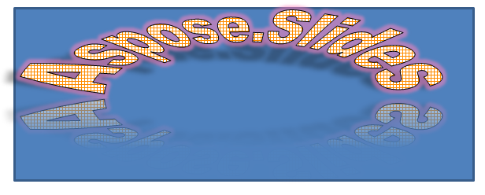

## **Áttekintés**

A WordArt effektusok lehetővé teszik, hogy vizuálisan vonzó, stilizált szöveget adjunk hozzá PowerPoint‑prezentációihoz. Az Aspose.Slides segítségével a fejlesztők programozottan hozhatnak létre, testreszabhatnak és kezelhetnek WordArt‑ot, akárcsak a Microsoft PowerPointben – az Office telepítése nélkül. Ez a cikk áttekintést nyújt a WordArt használatáról, beleértve a szövegrevonatkozó átalakítások, kitöltési stílusok, kontúrok, árnyékok és egyéb formázási lehetőségek alkalmazását, hogy a bemutató tartalma kifejezőbb és vonzóbb legyen. A WordArt lehetővé teszi, hogy a szöveget grafikus objektumként kezelje. Olyan hatásokat vagy különleges módosításokat jelent, amelyeket a szövegre alkalmaznak, hogy az vonzóbb vagy feltűnőbb legyen.

## **Egyszerű WordArt sablon létrehozása és szövegre alkalmazása**

**Az Aspose.Slides használatával** 

Először létrehozunk egy egyszerű szöveget a következő C++ kóddal: 

``` cpp 
#include <DOM/IAutoShape.h>
#include <DOM/IParagraph.h>
#include <DOM/IParagraphCollection.h>
#include <DOM/IPortion.h>
#include <DOM/IPortionCollection.h>
#include <DOM/IShapeCollection.h>
#include <DOM/ISlide.h>
#include <DOM/ISlideCollection.h>
#include <DOM/ITextFrame.h>
#include <DOM/Presentation.h>
#include <DOM/ShapeType.h>
using namespace Aspose::Slides;

auto pres = System::MakeObject<Presentation>();
auto slide = pres->get_Slides()->idx_get(0);
auto autoShape = slide->get_Shapes()->AddAutoShape(ShapeType::Rectangle, 200.0f, 200.0f, 400.0f, 200.0f);
auto textFrame = autoShape->get_TextFrame();

auto portion = textFrame->get_Paragraphs()->idx_get(0)->get_Portions()->idx_get(0);
portion->set_Text(u"Aspose.Slides");
```

Ezután a szöveg betűméretét nagyobb értékre állítjuk, hogy a hatás észrevehetőbb legyen, a következő kóddal:

``` cpp 
#include <DOM/Fonts/FontData.h>
#include <DOM/IAutoShape.h>
#include <DOM/IParagraph.h>
#include <DOM/IParagraphCollection.h>
#include <DOM/IPortion.h>
#include <DOM/IPortionCollection.h>
#include <DOM/IPortionFormat.h>
#include <DOM/IShapeCollection.h>
#include <DOM/ISlide.h>
#include <DOM/ISlideCollection.h>
#include <DOM/ITextFrame.h>
#include <DOM/Presentation.h>
#include <DOM/ShapeType.h>
using namespace Aspose::Slides;

auto pres = System::MakeObject<Presentation>();
auto slide = pres->get_Slides()->idx_get(0);
auto autoShape = slide->get_Shapes()->AddAutoShape(ShapeType::Rectangle, 200.0f, 200.0f, 400.0f, 200.0f);
auto textFrame = autoShape->get_TextFrame();
auto portion = textFrame->get_Paragraphs()->idx_get(0)->get_Portions()->idx_get(0);
portion->set_Text(u"Aspose.Slides");

auto fontData = System::MakeObject<FontData>(u"Arial Black");
portion->get_PortionFormat()->set_LatinFont(fontData);
portion->get_PortionFormat()->set_FontHeight(36.0f);
```

**A Microsoft PowerPoint használatával**

Nyissa meg a WordArt effektus menüt a Microsoft PowerPointben:


A jobb oldali menüből választhat előre definiált WordArt effektust. A bal oldali menüből adhatja meg az új WordArt beállításait. 

Az elérhető paraméterek vagy beállítások egy része:


**Az Aspose.Slides használatával**

Itt a SmallGrid minta színét alkalmazzuk a szövegre, és 1‑es szélességű fekete szövegszegélyt adunk hozzá a következő kóddal:

``` cpp 
#include <DOM/FillType.h>
#include <DOM/IAutoShape.h>
#include <DOM/IColorFormat.h>
#include <DOM/IFillFormat.h>
#include <DOM/ILineFillFormat.h>
#include <DOM/ILineFormat.h>
#include <DOM/IParagraph.h>
#include <DOM/IParagraphCollection.h>
#include <DOM/IPortion.h>
#include <DOM/IPortionCollection.h>
#include <DOM/IPortionFormat.h>
#include <DOM/IShapeCollection.h>
#include <DOM/ISlide.h>
#include <DOM/ISlideCollection.h>
#include <DOM/ITextFrame.h>
#include <DOM/IPatternFormat.h>
#include <DOM/PatternStyle.h>
#include <DOM/Presentation.h>
#include <DOM/ShapeType.h>
#include <drawing/color.h>
using namespace Aspose::Slides;
using namespace System::Drawing;

auto pres = System::MakeObject<Presentation>();
auto slide = pres->get_Slides()->idx_get(0);
auto autoShape = slide->get_Shapes()->AddAutoShape(ShapeType::Rectangle, 200.0f, 200.0f, 400.0f, 200.0f);
auto textFrame = autoShape->get_TextFrame();
auto portion = textFrame->get_Paragraphs()->idx_get(0)->get_Portions()->idx_get(0);
portion->set_Text(u"Aspose.Slides");

auto fillFormat = portion->get_PortionFormat()->get_FillFormat();
fillFormat->set_FillType(FillType::Pattern);
fillFormat->get_PatternFormat()->get_ForeColor()->set_Color(Color::get_DarkOrange());
fillFormat->get_PatternFormat()->get_BackColor()->set_Color(Color::get_White());
fillFormat->get_PatternFormat()->set_PatternStyle(PatternStyle::SmallGrid);

auto lineFillFormat = portion->get_PortionFormat()->get_LineFormat()->get_FillFormat();
lineFillFormat->set_FillType(FillType::Solid);
lineFillFormat->get_SolidFillColor()->set_Color(Color::get_Black());
```

Az eredményül kapott szöveg:


## **Egyéb WordArt hatások alkalmazása**

**A Microsoft PowerPoint használatával**

A program felületéről ezeket a hatásokat alkalmazhatja szövegre, szövegtömbre, alakzatra vagy hasonló elemre:


Például az Árnyék, Tükröződés és Ragyogás hatások szövegre, a 3D formátum és 3D forgatás hatások szövegtömbre, a Lágy szélek tulajdonság alakzatra alkalmazható (akkor is hat, ha nincs 3D formátum beállítva). 

### **Árnyék hatások alkalmazása szövegre**

Itt csak a szövegre vonatkozó tulajdonságokat állítjuk be. A szöveg árnyékhatását a következő C++ kóddal alkalmazzuk:

``` cpp 
#include <DOM/ColorTransformOperation.h>
#include <DOM/Effects/IOuterShadow.h>
#include <DOM/IAutoShape.h>
#include <DOM/IColorFormat.h>
#include <DOM/IColorOperationCollection.h>
#include <DOM/IEffectFormat.h>
#include <DOM/IParagraph.h>
#include <DOM/IParagraphCollection.h>
#include <DOM/IPortion.h>
#include <DOM/IPortionCollection.h>
#include <DOM/IPortionFormat.h>
#include <DOM/IShapeCollection.h>
#include <DOM/ISlide.h>
#include <DOM/ISlideCollection.h>
#include <DOM/ITextFrame.h>
#include <DOM/Presentation.h>
#include <DOM/ShapeType.h>
#include <drawing/color.h>
using namespace Aspose::Slides;
using namespace System::Drawing;

auto pres = System::MakeObject<Presentation>();
auto slide = pres->get_Slides()->idx_get(0);
auto autoShape = slide->get_Shapes()->AddAutoShape(ShapeType::Rectangle, 200.0f, 200.0f, 400.0f, 200.0f);
auto textFrame = autoShape->get_TextFrame();
auto portion = textFrame->get_Paragraphs()->idx_get(0)->get_Portions()->idx_get(0);
portion->set_Text(u"Aspose.Slides");

auto effectFormat = portion->get_PortionFormat()->get_EffectFormat();
effectFormat->EnableOuterShadowEffect();

auto outerShadowEffect = effectFormat->get_OuterShadowEffect();
outerShadowEffect->get_ShadowColor()->set_Color(Color::get_Black());
outerShadowEffect->set_ScaleHorizontal(100);
outerShadowEffect->set_ScaleVertical(65);
outerShadowEffect->set_BlurRadius(4.73);
outerShadowEffect->set_Direction(230.0f);
outerShadowEffect->set_Distance(2);
outerShadowEffect->set_SkewHorizontal(30);
outerShadowEffect->set_SkewVertical(0);
outerShadowEffect->get_ShadowColor()->get_ColorTransform()->Add(ColorTransformOperation::SetAlpha, 0.32f);
```

Az Aspose.Slides API háromféle árnyékot támogat: OuterShadow, InnerShadow és PresetShadow. 

A PresetShadow segítségével előre definiált értékekkel alkalmazhat árnyékot a szövegre. 

**A Microsoft PowerPoint használatával**

A PowerPointben egyféle árnyékot használhat. Egy példa:


**Az Aspose.Slides használatával**

Az Aspose.Slides valójában egyszerre kétféle árnyékot engedélyez: InnerShadow és PresetShadow.

**Megjegyzések:**

- Ha az OuterShadow és a PresetShadow együtt kerülnek alkalmazásra, csak az OuterShadow hatás lép érvénybe. 
- Ha az OuterShadow és az InnerShadow egyszerre kerülnek használatra, az alkalmazott hatás a PowerPoint verziójától függ. Például a PowerPoint 2013‑ban a hatás duplázódik, míg a PowerPoint 2007‑ben az OuterShadow hatása marad érvényben. 

### **Tükröződés hatások alkalmazása**

A szövegre tükröződést adunk a következő C++ kóddal:

``` cpp 
#include <DOM/Effects/IReflection.h>
#include <DOM/IAutoShape.h>
#include <DOM/IEffectFormat.h>
#include <DOM/IParagraph.h>
#include <DOM/IParagraphCollection.h>
#include <DOM/IPortion.h>
#include <DOM/IPortionCollection.h>
#include <DOM/IPortionFormat.h>
#include <DOM/IShapeCollection.h>
#include <DOM/ISlide.h>
#include <DOM/ISlideCollection.h>
#include <DOM/ITextFrame.h>
#include <DOM/Presentation.h>
#include <DOM/RectangleAlignment.h>
#include <DOM/ShapeType.h>
using namespace Aspose::Slides;

auto pres = System::MakeObject<Presentation>();
auto slide = pres->get_Slides()->idx_get(0);
auto autoShape = slide->get_Shapes()->AddAutoShape(ShapeType::Rectangle, 200.0f, 200.0f, 400.0f, 200.0f);
auto textFrame = autoShape->get_TextFrame();
auto portion = textFrame->get_Paragraphs()->idx_get(0)->get_Portions()->idx_get(0);
portion->set_Text(u"Aspose.Slides");

auto effectFormat = portion->get_PortionFormat()->get_EffectFormat();
effectFormat->EnableReflectionEffect();

auto reflectionEffect = effectFormat->get_ReflectionEffect();
reflectionEffect->set_BlurRadius(0.5);
reflectionEffect->set_Distance(4.72);
reflectionEffect->set_StartPosAlpha(0.f);
reflectionEffect->set_EndPosAlpha(60.f);
reflectionEffect->set_Direction(90.0f);
reflectionEffect->set_ScaleHorizontal(100);
reflectionEffect->set_ScaleVertical(-100);
reflectionEffect->set_StartReflectionOpacity(60.f);
reflectionEffect->set_EndReflectionOpacity(0.9f);
reflectionEffect->set_RectangleAlign(RectangleAlignment::BottomLeft);
```

### **Ragyogás hatások alkalmazása**

A szöveg ragyogás hatását a következő kóddal alkalmazzuk, hogy fényes vagy kiemelkedő legyen:

``` cpp 
#include <DOM/ColorTransformOperation.h>
#include <DOM/Effects/IGlow.h>
#include <DOM/IAutoShape.h>
#include <DOM/IColorFormat.h>
#include <DOM/IColorOperationCollection.h>
#include <DOM/IEffectFormat.h>
#include <DOM/IParagraph.h>
#include <DOM/IParagraphCollection.h>
#include <DOM/IPortion.h>
#include <DOM/IPortionCollection.h>
#include <DOM/IPortionFormat.h>
#include <DOM/IShapeCollection.h>
#include <DOM/ISlide.h>
#include <DOM/ISlideCollection.h>
#include <DOM/ITextFrame.h>
#include <DOM/Presentation.h>
#include <DOM/ShapeType.h>
using namespace Aspose::Slides;

auto pres = System::MakeObject<Presentation>();
auto slide = pres->get_Slides()->idx_get(0);
auto autoShape = slide->get_Shapes()->AddAutoShape(ShapeType::Rectangle, 200.0f, 200.0f, 400.0f, 200.0f);
auto textFrame = autoShape->get_TextFrame();
auto portion = textFrame->get_Paragraphs()->idx_get(0)->get_Portions()->idx_get(0);
portion->set_Text(u"Aspose.Slides");

auto effectFormat = portion->get_PortionFormat()->get_EffectFormat();
effectFormat->EnableGlowEffect();

auto glowEffect = effectFormat->get_GlowEffect();
glowEffect->get_Color()->set_R(255);
glowEffect->get_Color()->get_ColorTransform()->Add(ColorTransformOperation::SetAlpha, 0.54f);
glowEffect->set_Radius(7);
```

A művelet eredménye:


{} 
A szöveg árnyék, megjelenítés és ragyogás paramétereit külön‑külön beállíthatja. A hatások tulajdonságai a szöveg egyes részeire külön-külön vonatkoznak. 
{} 

### **Átalakítások használata WordArt‑ban**

A set_Transform metódust (amely az egész szövegtömbre vonatkozik) a következő kóddal használjuk:

``` cpp 
#include <DOM/IAutoShape.h>
#include <DOM/IShapeCollection.h>
#include <DOM/ISlide.h>
#include <DOM/ISlideCollection.h>
#include <DOM/ITextFrame.h>
#include <DOM/ITextFrameFormat.h>
#include <DOM/Presentation.h>
#include <DOM/ShapeType.h>
#include <DOM/TextShapeType.h>
using namespace Aspose::Slides;

auto pres = System::MakeObject<Presentation>();
auto slide = pres->get_Slides()->idx_get(0);
auto autoShape = slide->get_Shapes()->AddAutoShape(ShapeType::Rectangle, 200.0f, 200.0f, 400.0f, 200.0f);
auto textFrame = autoShape->get_TextFrame();
textFrame->set_Text(u"Aspose.Slides");

textFrame->get_TextFrameFormat()->set_Transform(TextShapeType::ArchUpPour);
```

Az eredmény:



{} 
A Microsoft PowerPoint és az Aspose.Slides for C++ egy bizonyos számú előre definiált átalakítási típust biztosít. 
{} 

**PowerPoint használatával**

Az előre definiált átalakítási típusok eléréséhez válassza a **Formátum** → **Szövegeffektus** → **Átalakítás** menüpontot. 

**Az Aspose.Slides használatával**

Az átalakítási típus kiválasztásához használja a TextShapeType enumerációt. 

### **3D hatások alkalmazása szövegre és alakzatokra**

A következő példakóddal 3D hatást állítunk be egy szöveges alakzatra:

``` cpp 
#include <DOM/BevelPresetType.h>
#include <DOM/CameraPresetType.h>
#include <DOM/IAutoShape.h>
#include <DOM/ICamera.h>
#include <DOM/IColorFormat.h>
#include <DOM/ILightRig.h>
#include <DOM/IShapeBevel.h>
#include <DOM/IShapeCollection.h>
#include <DOM/ISlide.h>
#include <DOM/ISlideCollection.h>
#include <DOM/ITextFrame.h>
#include <DOM/IThreeDFormat.h>
#include <DOM/LightRigPresetType.h>
#include <DOM/LightingDirection.h>
#include <DOM/MaterialPresetType.h>
#include <DOM/Presentation.h>
#include <DOM/ShapeType.h>
#include <drawing/color.h>
using namespace Aspose::Slides;
using namespace System::Drawing;

auto pres = System::MakeObject<Presentation>();
auto slide = pres->get_Slides()->idx_get(0);
auto autoShape = slide->get_Shapes()->AddAutoShape(ShapeType::Rectangle, 200.0f, 200.0f, 400.0f, 200.0f);
autoShape->get_TextFrame()->set_Text(u"Aspose.Slides");

auto threeDFormat = autoShape->get_ThreeDFormat();

threeDFormat->get_BevelBottom()->set_BevelType(BevelPresetType::Circle);
threeDFormat->get_BevelBottom()->set_Height(10.5);
threeDFormat->get_BevelBottom()->set_Width(10.5);

threeDFormat->get_BevelTop()->set_BevelType(BevelPresetType::Circle);
threeDFormat->get_BevelTop()->set_Height(12.5);
threeDFormat->get_BevelTop()->set_Width(11);

threeDFormat->get_ExtrusionColor()->set_Color(Color::get_Orange());
threeDFormat->set_ExtrusionHeight(6);

threeDFormat->get_ContourColor()->set_Color(Color::get_DarkRed());
threeDFormat->set_ContourWidth(1.5);

threeDFormat->set_Depth(3);

threeDFormat->set_Material(MaterialPresetType::Plastic);

threeDFormat->get_LightRig()->set_Direction(LightingDirection::Top);
threeDFormat->get_LightRig()->set_LightType(LightRigPresetType::Balanced);
threeDFormat->get_LightRig()->SetRotation(0.0f, 0.0f, 40.0f);

threeDFormat->get_Camera()->set_CameraType(CameraPresetType::PerspectiveContrastingRightFacing);
```

Az eredményül kapott szöveg és alakzata:


3D hatást a szövegre a következő C++ kóddal alkalmazzuk:

``` cpp 
#include <DOM/BevelPresetType.h>
#include <DOM/CameraPresetType.h>
#include <DOM/IAutoShape.h>
#include <DOM/ICamera.h>
#include <DOM/IColorFormat.h>
#include <DOM/ILightRig.h>
#include <DOM/IShapeBevel.h>
#include <DOM/IShapeCollection.h>
#include <DOM/ISlide.h>
#include <DOM/ISlideCollection.h>
#include <DOM/ITextFrame.h>
#include <DOM/ITextFrameFormat.h>
#include <DOM/IThreeDFormat.h>
#include <DOM/LightRigPresetType.h>
#include <DOM/LightingDirection.h>
#include <DOM/MaterialPresetType.h>
#include <DOM/Presentation.h>
#include <DOM/ShapeType.h>
#include <drawing/color.h>
using namespace Aspose::Slides;
using namespace System::Drawing;

auto pres = System::MakeObject<Presentation>();
auto slide = pres->get_Slides()->idx_get(0);
auto autoShape = slide->get_Shapes()->AddAutoShape(ShapeType::Rectangle, 200.0f, 200.0f, 400.0f, 200.0f);
auto textFrame = autoShape->get_TextFrame();
textFrame->set_Text(u"Aspose.Slides");

auto threeDFormat = textFrame->get_TextFrameFormat()->get_ThreeDFormat();

threeDFormat->get_BevelBottom()->set_BevelType(BevelPresetType::Circle);
threeDFormat->get_BevelBottom()->set_Height(3.5);
threeDFormat->get_BevelBottom()->set_Width(3.5);

threeDFormat->get_BevelTop()->set_BevelType(BevelPresetType::Circle);
threeDFormat->get_BevelTop()->set_Height(4);
threeDFormat->get_BevelTop()->set_Width(4);

threeDFormat->get_ExtrusionColor()->set_Color(Color::get_Orange());
threeDFormat->set_ExtrusionHeight(6);

threeDFormat->get_ContourColor()->set_Color(Color::get_DarkRed());
threeDFormat->set_ContourWidth(1.5);

threeDFormat->set_Depth(3);

threeDFormat->set_Material(MaterialPresetType::Plastic);

threeDFormat->get_LightRig()->set_Direction(LightingDirection::Top);
threeDFormat->get_LightRig()->set_LightType(LightRigPresetType::Balanced);
threeDFormat->get_LightRig()->SetRotation(0.0f, 0.0f, 40.0f);

threeDFormat->get_Camera()->set_CameraType(CameraPresetType::PerspectiveContrastingRightFacing);
```

A művelet eredménye:


{} 
A 3D hatások szövegre vagy azok alakzataira való alkalmazása és a hatások közötti kölcsönhatás bizonyos szabályokon alapul. 
Képzeljen el egy jelenetet, amely egy szöveget és azt tartalmazó alakzatot ábrázol. A 3D hatás tartalmazza a 3D objektum ábrázolását és a jelenetet, amelyre az objektum került. 

- Ha a jelenet mind a figura, mind a szöveg esetén be van állítva, a figura jelenetnek nagyobb prioritása van – a szöveg jelenete figyelmen kívül marad. 
- Ha a figura nincs saját jelenettel, de rendelkezik 3D ábrázolással, a szöveg jelenete kerül felhasználásra. 
- Egyébként – ha az alakzat eredetileg nem rendelkezik 3D hatással – az alakzat lapos, és a 3D hatás csak a szövegre kerül alkalmazásra. 

Ezek a leírások a ThreeDFormat.getLightRig() és a ThreeDFormat.getCamera() metódusokra vonatkoznak. 
{} 

## **Külső árnyék hatások alkalmazása alakzatokra**
Az Aspose.Slides for C++ a [**IOuterShadow**](https://reference.aspose.com/slides/hu/cpp/class/aspose.slides.effects.i_outer_shadow) és a [**IInnerShadow**](https://reference.aspose.com/slides/hu/cpp/class/aspose.slides.effects.i_inner_shadow) osztályokat biztosítja, amelyek lehetővé teszik árnyékhatások alkalmazását a TextFrame által tartott szövegre. Kövesse ezeket a lépéseket:

1. Hozzon létre egy példányt a [Presentation](https://reference.aspose.com/slides/hu/cpp/class/aspose.slides.presentation) osztályból.  
2. Szerezze be a diára mutató referenciát az indexének használatával.  
3. Adjon a diára egy Rectangle típusú AutoShape‑t.  
4. Hozzáférés a AutoShape‑hez tartozó TextFrame‑hez.  
5. Állítsa be az AutoShape FillType‑ját NoFill‑re.  
6. Hozzon létre egy OuterShadow példányt.  
7. Állítsa be az árnyék BlurRadius‑át.  
8. Állítsa be az árnyék Direction‑ját.  
9. Állítsa be az árnyék Distance‑át.  
10. Állítsa be a RectanglelAlign‑t TopLeft‑re.  
11. Állítsa be az árnyék PresetColor‑ját Black‑re.  
12. Írja ki a prezentációt PPTX fájlként.  

Ez a C++ példakód – a fenti lépések megvalósítása – bemutatja, hogyan alkalmazza a külső árnyék hatást egy szövegre:

``` cpp
#include <DOM/Effects/IOuterShadow.h>
#include <DOM/FillType.h>
#include <DOM/IAutoShape.h>
#include <DOM/IColorFormat.h>
#include <DOM/IEffectFormat.h>
#include <DOM/IFillFormat.h>
#include <DOM/IShapeCollection.h>
#include <DOM/ISlide.h>
#include <DOM/ISlideCollection.h>
#include <DOM/Presentation.h>
#include <DOM/PresetColor.h>
#include <DOM/RectangleAlignment.h>
#include <DOM/ShapeType.h>
#include <Export/SaveFormat.h>
using namespace Aspose::Slides;
using namespace Aspose::Slides::Effects;
using namespace Aspose::Slides::Export;

auto pres = System::MakeObject<Presentation>();
// A dia hivatkozásának lekérése
auto sld = pres->get_Slides()->idx_get(0);

// Hozzáadunk egy téglalap típusú AutoShape-et
auto ashp = sld->get_Shapes()->AddAutoShape(ShapeType::Rectangle, 150.0f, 75.0f, 150.0f, 50.0f);

// TextFrame hozzáadása a téglalaphoz
ashp->AddTextFrame(u"Aspose TextBox");

// Az alakzat kitöltésének letiltása abban az esetben, ha a szöveg árnyékát szeretnénk
ashp->get_FillFormat()->set_FillType(FillType::NoFill);

// Külső árnyék hozzáadása és az összes szükséges paraméter beállítása
ashp->get_EffectFormat()->EnableOuterShadowEffect();
auto shadow = ashp->get_EffectFormat()->get_OuterShadowEffect();
shadow->set_BlurRadius(4.0);
shadow->set_Direction(45.0f);
shadow->set_Distance(3);
shadow->set_RectangleAlign(RectangleAlignment::TopLeft);
shadow->get_ShadowColor()->set_PresetColor(PresetColor::Black);

// A prezentáció mentése a lemezre
pres->Save(u"pres_out.pptx", SaveFormat::Pptx);
```

## **Belső árnyék hatások alkalmazása alakzatokra**
Kövesse ezeket a lépéseket:

1. Hozzon létre egy példányt a [Presentation](https://reference.aspose.com/slides/hu/cpp/class/aspose.slides.presentation) osztályból.  
2. Szerezze be a dia referenciáját.  
3. Adjon hozzá egy Rectangle típusú AutoShape‑t.  
4. Engedélyezze az InnerShadowEffect‑et.  
5. Állítsa be az összes szükséges paramétert.  
6. Állítsa be a ColorType‑ot Scheme‑ként.  
7. Állítsa be a Scheme Color‑t.  
8. Írja ki a prezentációt [PPTX](https://docs.fileformat.com/presentation/pptx/) fájlként.  

Ez a példakód (a fenti lépések alapján) bemutatja, hogyan adjon csatlakozót két alakzat között C++‑ban:

``` cpp
#include <DOM/ColorType.h>
#include <DOM/Effects/IInnerShadow.h>
#include <DOM/FillType.h>
#include <DOM/IAutoShape.h>
#include <DOM/IColorFormat.h>
#include <DOM/IEffectFormat.h>
#include <DOM/IFillFormat.h>
#include <DOM/IParagraph.h>
#include <DOM/IParagraphCollection.h>
#include <DOM/IPortion.h>
#include <DOM/IPortionCollection.h>
#include <DOM/IPortionFormat.h>
#include <DOM/IShapeCollection.h>
#include <DOM/ISlide.h>
#include <DOM/ISlideCollection.h>
#include <DOM/ITextFrame.h>
#include <DOM/Presentation.h>
#include <DOM/SchemeColor.h>
#include <DOM/ShapeType.h>
#include <Export/SaveFormat.h>
using namespace Aspose::Slides;
using namespace Aspose::Slides::Export;

auto presentation = System::MakeObject<Presentation>();
// A dia hivatkozásának lekérése
auto slide = presentation->get_Slides()->idx_get(0);

// Téglalap típusú AutoShape hozzáadása
auto ashp = slide->get_Shapes()->AddAutoShape(ShapeType::Rectangle, 150.0f, 75.0f, 400.0f, 300.0f);
ashp->get_FillFormat()->set_FillType(FillType::NoFill);

// TextFrame hozzáadása a téglalaphoz
ashp->AddTextFrame(u"Aspose TextBox");
auto port = ashp->get_TextFrame()->get_Paragraphs()->idx_get(0)->get_Portions()->idx_get(0);
auto pf = port->get_PortionFormat();
pf->set_FontHeight(50.0f);

// Belső árnyék effektus engedélyezése    
auto ef = pf->get_EffectFormat();
ef->EnableInnerShadowEffect();

// Az összes szükséges paraméter beállítása
auto shadow = ef->get_InnerShadowEffect();
shadow->set_BlurRadius(8.0);
shadow->set_Direction(90.0F);
shadow->set_Distance(6.0);
shadow->get_ShadowColor()->set_B(189);

// ColorType beállítása Scheme-re
shadow->get_ShadowColor()->set_ColorType(ColorType::Scheme);

// Scheme szín beállítása
shadow->get_ShadowColor()->set_SchemeColor(SchemeColor::Accent1);

// Prezentáció mentése
presentation->Save(u"WordArt_out.pptx", SaveFormat::Pptx);
```

## **GYIK**

### Használhatok‑e WordArt hatásokat különböző betűtípusokkal vagy írásrendszerekkel (pl. arab, kínai)?

Igen, az Aspose.Slides támogatja a Unicode‑ot, és működik minden főbb betűtípussal és írásrendszerrel. A WordArt hatásokat – például árnyék, kitöltés és körvonal – a nyelvtől függetlenül alkalmazhatja, bár a betűtípus elérhetősége és a renderelés a rendszer betűtípusaitól függhet.

### Alkalmazhatok‑e WordArt hatásokat a diamester elemeire?

Igen, WordArt hatásokat alkalmazhat a mesterdiák alakzataira, beleértve a címhelyettesítőket, láblécet vagy háttérszöveget. A mesterelrendezésben végzett módosítások minden kapcsolódó diára kihatnak.

### Befolyásolják‑e a WordArt hatások a bemutató fájlméretét?

Enyhén. Az olyan WordArt hatások, mint az árnyékok, ragyogás és a színátmenetes kitöltések, kicsit megnövelhetik a fájlméretet a formázási metaadatok hozzáadása miatt, de a különbség általában elhanyagolható.

### Előnézhetem‑e a WordArt hatások eredményét a prezentáció mentése nélkül?

Igen, a WordArt‑ot tartalmazó diákat renderelheti képekké (például PNG, JPEG) a [IShape](https://reference.aspose.com/slides/hu/cpp/aspose.slides/ishape/) vagy [ISlide](https://reference.aspose.com/slides/hu/cpp/aspose.slides/islide/) interfész `GetImage` metódusával. Így a teljes prezentáció mentése vagy exportálása előtt memóriában vagy képernyőn tekintheti meg az eredményt.