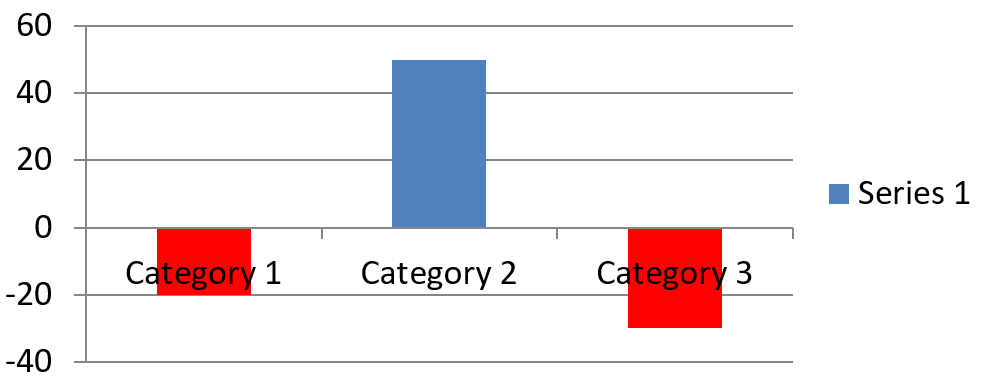

## **Áttekintés**

A diagram a megjelenített adatokat egy diagramadat‑munkafüzetben tárolja. Az [IChartSeries](https://reference.aspose.com/slides/cpp/aspose.slides.charts/ichartseries/) egy kapcsolódó értékekből álló halmazt képvisel, és a sorozat minden [IChartDataPoint](https://reference.aspose.com/slides/cpp/aspose.slides.charts/ichartdatapoint/) egy vagy több munkafüzet‑cellára hivatkozik. Az [IChartCategory](https://reference.aspose.com/slides/cpp/aspose.slides.charts/ichartcategory/) objektumok biztosítják a sorozatok által megosztott címkéket vagy csoportosítási értékeket. Így a sorozat neve, a kategóriák és a pontértékek az [IChartDataCell](https://reference.aspose.com/slides/cpp/aspose.slides.charts/ichartdatacell/) objektumokhoz kapcsolódnak, nem csak megjelenő szövegként tárolódnak.

A tipikus kategória diagram esetén az alapértelmezett munkafüzet a 0‑s sort a sorozatneveknek, a 0‑s oszlopot a kategórianévnek, a többi cellát pedig a sorozatértékeknek használja. A munkalap, sor és oszlop indexek, amelyeket az [IChartDataWorkbook::GetCell](https://reference.aspose.com/slides/cpp/aspose.slides.charts/ichartdataworkbook/getcell/) metódusnak adnak, nulláral kezdődnek. Ez az elrendezés hasznos, ha alapértelmezett adatokkal hoz létre diagramot, de ne feltételezze, hogy minden létező diagram ezt használja. Betöltött prezentáció esetén vizsgálja meg a sorozatok, kategóriák és adatpontok által hivatkozott cellákat, mielőtt módosítaná a munkafüzet értékeit.

Diagram beállítások három különböző hatókörrel rendelkeznek:

- Sorozatszintű beállítások, például az [IChartSeries::get_Format](https://reference.aspose.com/slides/cpp/aspose.slides.charts/ichartseries/get_format/), az egy sorozat összes pontjának alapértelmezett megjelenését biztosítják.
- Adatpont szintű beállítások, például az [IChartDataPoint::get_Format](https://reference.aspose.com/slides/cpp/aspose.slides.charts/ichartdatapoint/get_format/), felülírják a sorozat megjelenését egy pontnál.
- Csoportbeállítások a kompatibilis sorozatokra vonatkoznak, amelyek egy [IChartSeriesGroup](https://reference.aspose.com/slides/cpp/aspose.slides.charts/ichartseriesgroup/)‑hoz tartoznak. A csoportot az [IChartSeries::get_ParentSeriesGroup](https://reference.aspose.com/slides/cpp/aspose.slides.charts/ichartseries/get_parentseriesgroup/) segítségével érheti el, ha például átfedés vagy hézag szélesség beállítására van szükség.

Ha nincs explicit pont- vagy sorozatkitöltés beállítva, a diagram stílusa és témája határozza meg az automatikus megjelenést. Ha a sorozat és a pont formázása is meg van adva, a pont formázása lesz előnyben a kérdéses pontnál.


## **A diagram sorozat átfedésének beállítása**

Az [IChartSeries::get_Overlap](https://reference.aspose.com/slides/cpp/aspose.slides.charts/ichartseries/get_overlap/) megadja, hogy a sávok vagy oszlopok mennyire átfedik egymást egy 2D diagramon, -100 és 100 százalék között. Ez egy csak olvasható leképezése a szülő sorozatcsoport beállításának. Hívja az [IChartSeriesGroup::set_Overlap](https://reference.aspose.com/slides/cpp/aspose.slides.charts/ichartseriesgroup/set_overlap/) metódust a csoportban lévő összes kompatibilis sorozat frissítéséhez. Ez a lehetőség azoknál a diagramtípusoknál érvényes, amelyek csoportos sávokat vagy oszlopokat jelenítenek meg; nem érint egy kombinált diagram nem kapcsolódó sorozatcsoportjait.

A következő példa beállítja az átfedést az első sorozatot tartalmazó csoport számára:

```cpp
#include <cstdint>
#include <DOM/Chart/ChartType.h>
#include <DOM/Chart/IChartData.h>
#include <DOM/Chart/IChartSeries.h>
#include <DOM/Chart/IChartSeriesCollection.h>
#include <DOM/Chart/IChartSeriesGroup.h>
#include <DOM/IChart.h>
#include <DOM/IShapeCollection.h>
#include <DOM/ISlide.h>
#include <DOM/Presentation.h>
#include <Export/SaveFormat.h>
#include <system/shared_ptr.h>

using Aspose::Slides::Charts::ChartType;
using Aspose::Slides::Export::SaveFormat;
using Aspose::Slides::Presentation;

const int firstSlideIndex = 0;
const int firstSeriesIndex = 0;
const int8_t overlapPercent = 30;

auto presentation = System::MakeObject<Presentation>();
auto slide = presentation->get_Slide(firstSlideIndex);

// Az új diagram minta sorozatokat, kategóriákat és értékeket tartalmaz.
auto chart = slide->get_Shapes()->AddChart(ChartType::ClusteredColumn, 20.0f, 20.0f, 500.0f, 200.0f);

auto seriesCollection = chart->get_ChartData()->get_Series();
auto series = seriesCollection->idx_get(firstSeriesIndex);
series->get_ParentSeriesGroup()->set_Overlap(overlapPercent);

presentation->Save(u"series_overlap.pptx", SaveFormat::Pptx);
presentation->Dispose();
```

Az eredmény:


## **A sorozat kitöltőszínének módosítása**

Az [IChartSeries::get_Format](https://reference.aspose.com/slides/cpp/aspose.slides.charts/ichartseries/get_format/) használatával állíthatja be az egész sorozat alapértelmezett kitöltését. Ha egy pont már rendelkezik explicit kitöltéssel, annak [IChartDataPoint::get_Format](https://reference.aspose.com/slides/cpp/aspose.slides.charts/ichartdatapoint/get_format/) beállítása felülírja a sorozat kitöltését az adott pontnál.

A következő példa szilárd kék kitöltést alkalmaz az első sorozatra:

```cpp
#include <DOM/Chart/ChartType.h>
#include <DOM/Chart/IChartData.h>
#include <DOM/Chart/IChartSeries.h>
#include <DOM/Chart/IChartSeriesCollection.h>
#include <DOM/Chart/IFormat.h>
#include <DOM/FillType.h>
#include <DOM/IChart.h>
#include <DOM/IColorFormat.h>
#include <DOM/IFillFormat.h>
#include <DOM/IShapeCollection.h>
#include <DOM/ISlide.h>
#include <DOM/Presentation.h>
#include <Export/SaveFormat.h>
#include <drawing/color.h>
#include <system/shared_ptr.h>

using Aspose::Slides::Charts::ChartType;
using Aspose::Slides::Export::SaveFormat;
using Aspose::Slides::FillType;
using Aspose::Slides::Presentation;
using System::Drawing::Color;

const int firstSlideIndex = 0;
const int firstSeriesIndex = 0;

auto presentation = System::MakeObject<Presentation>();
auto slide = presentation->get_Slide(firstSlideIndex);

auto chart = slide->get_Shapes()->AddChart(ChartType::ClusteredColumn, 20.0f, 20.0f, 500.0f, 200.0f);

auto seriesCollection = chart->get_ChartData()->get_Series();
auto series = seriesCollection->idx_get(firstSeriesIndex);
auto seriesColor = Color::get_Blue();
series->get_Format()->get_Fill()->set_FillType(FillType::Solid);
series->get_Format()->get_Fill()->get_SolidFillColor()->set_Color(seriesColor);

presentation->Save(u"series_color.pptx", SaveFormat::Pptx);
presentation->Dispose();
```

Az eredmény:


## **A sorozat nevének módosítása**

A sorozat neve a diagramadat‑munkafüzetben kerül tárolásra, és általában a jelmagyarázatban jelenik meg. Az klaszterezett oszlopdiagramhoz létrehozott alapértelmezett munkafüzetben a B1 cella a 0‑s sorban, az 1‑es oszlopban helyezkedik el, és az első sorozat nevét tartalmazza. A következő példában szereplő névkonstansok explicit módon mutatják ezt a struktúrát:

```cpp
#include <DOM/Chart/ChartType.h>
#include <DOM/Chart/IChartData.h>
#include <DOM/Chart/IChartDataCell.h>
#include <DOM/Chart/IChartDataWorkbook.h>
#include <DOM/IChart.h>
#include <DOM/IShapeCollection.h>
#include <DOM/ISlide.h>
#include <DOM/Presentation.h>
#include <Export/SaveFormat.h>
#include <system/object_ext.h>
#include <system/shared_ptr.h>
#include <system/string.h>

using Aspose::Slides::Charts::ChartType;
using Aspose::Slides::Export::SaveFormat;
using Aspose::Slides::Presentation;
using System::ObjectExt;
using System::String;

const int firstSlideIndex = 0;
const int worksheetIndex = 0;
const int seriesNameRowIndex = 0;
const int firstSeriesColumnIndex = 1;

auto presentation = System::MakeObject<Presentation>();
auto slide = presentation->get_Slide(firstSlideIndex);

auto chart = slide->get_Shapes()->AddChart(ChartType::ClusteredColumn, 20.0f, 20.0f, 500.0f, 200.0f);

auto workbook = chart->get_ChartData()->get_ChartDataWorkbook();
auto seriesNameCell = workbook->GetCell(worksheetIndex, seriesNameRowIndex, firstSeriesColumnIndex);
auto seriesName = ObjectExt::Box<String>(u"Revenue");
seriesNameCell->set_Value(seriesName);

presentation->Save(u"series_name.pptx", SaveFormat::Pptx);
presentation->Dispose();
```

Az [IChartSeries::get_Name](https://reference.aspose.com/slides/cpp/aspose.slides.charts/ichartseries/get_name/) által már hivatkozott cellát is frissítheti. Ez a megközelítés elkerüli, hogy egy létező diagram esetén egy adott sorra és oszlopra vonatkozzon:

```cpp
#include <DOM/Chart/ChartType.h>
#include <DOM/Chart/IChartCellCollection.h>
#include <DOM/Chart/IChartData.h>
#include <DOM/Chart/IChartDataCell.h>
#include <DOM/Chart/IChartSeries.h>
#include <DOM/Chart/IChartSeriesCollection.h>
#include <DOM/Chart/IStringChartValue.h>
#include <DOM/IChart.h>
#include <DOM/IShapeCollection.h>
#include <DOM/ISlide.h>
#include <DOM/Presentation.h>
#include <Export/SaveFormat.h>
#include <system/object_ext.h>
#include <system/shared_ptr.h>
#include <system/string.h>

using Aspose::Slides::Charts::ChartType;
using Aspose::Slides::Export::SaveFormat;
using Aspose::Slides::Presentation;
using System::ObjectExt;
using System::String;

const int firstSlideIndex = 0;
const int firstSeriesIndex = 0;
const int firstNameCellIndex = 0;

auto presentation = System::MakeObject<Presentation>();
auto slide = presentation->get_Slide(firstSlideIndex);

auto chart = slide->get_Shapes()->AddChart(ChartType::ClusteredColumn, 20.0f, 20.0f, 500.0f, 200.0f);

auto seriesCollection = chart->get_ChartData()->get_Series();
auto series = seriesCollection->idx_get(firstSeriesIndex);
auto seriesNameCells = series->get_Name()->get_AsCells();
auto seriesNameCell = seriesNameCells->idx_get(firstNameCellIndex);
auto seriesName = ObjectExt::Box<String>(u"Revenue");
seriesNameCell->set_Value(seriesName);

presentation->Save(u"series_name.pptx", SaveFormat::Pptx);
presentation->Dispose();
```

Az eredmény:


### **Sorozat létrehozása több cellából származó névvel**

Összetett sorozatnév akkor hasznos, ha egy termék neve és a jelentési időszak külön munkafüzet‑cellákban van tárolva. Például a B1‑ben lévő `Product A` és a C1‑ben lévő `2026` értékeket egyetlen sorozatnévbe kombinálhatja, miközben mindkét rész továbbra is a forráscellához van kapcsolva.

Az [IChartDataWorkbook::GetCellCollection](https://reference.aspose.com/slides/cpp/aspose.slides.charts/ichartdataworkbook/getcellcollection/) segítségével kérje le a névtartományt, majd adja át ezt a gyűjteményt az [IChartSeriesCollection::Add](https://reference.aspose.com/slides/cpp/aspose.slides.charts/ichartseriescollection/add/) metódusnak. A `skipHiddenCells` argumentum határozza meg, hogy a rejtett cellák szerepelnek-e: a `true` kizárja őket, míg a `false` belefoglalja. Ez a példa a `false` értéket használja, hogy a névtartomány minden celláját bevonja.

A következő példa egy sorozattal és két adatponttal hoz létre prezentációt. A B1:C1 cellák csak a sorozat nevét szolgáltatják; az A2:A3 a kategóriacímkéket, a B2:B3 pedig a numerikus értékeket.

```cpp
#include <DOM/Chart/ChartType.h>
#include <DOM/Chart/IChartCategoryCollection.h>
#include <DOM/Chart/IChartCellCollection.h>
#include <DOM/Chart/IChartData.h>
#include <DOM/Chart/IChartDataCell.h>
#include <DOM/Chart/IChartDataPointCollection.h>
#include <DOM/Chart/IChartDataWorkbook.h>
#include <DOM/Chart/IChartSeries.h>
#include <DOM/Chart/IChartSeriesCollection.h>
#include <DOM/IChart.h>
#include <DOM/IShapeCollection.h>
#include <DOM/ISlide.h>
#include <DOM/Presentation.h>
#include <Export/SaveFormat.h>
#include <system/object_ext.h>
#include <system/shared_ptr.h>
#include <system/string.h>

using namespace Aspose::Slides;
using namespace Aspose::Slides::Charts;
using namespace Aspose::Slides::Export;
using System::ObjectExt;
using System::String;

auto presentation = System::MakeObject<Presentation>();
auto slide = presentation->get_Slide(0);

auto chart = slide->get_Shapes()->AddChart(ChartType::ClusteredColumn, 50.0f, 50.0f, 620.0f, 180.0f);
auto chartData = chart->get_ChartData();

chartData->get_Series()->Clear();
chartData->get_Categories()->Clear();
chart->set_HasLegend(true);

auto workbook = chartData->get_ChartDataWorkbook();
workbook->Clear(0);

// Ezek a két cella szolgáltatja a sorozat nevét.
auto productName = ObjectExt::Box<String>(u"Product A");
auto reportingPeriod = ObjectExt::Box<String>(u"2026");
workbook->GetCell(0, 0, 1, productName);
workbook->GetCell(0, 0, 2, reportingPeriod);
auto nameCells = workbook->GetCellCollection(u"Sheet1!$B$1:$C$1", false);
auto series = chartData->get_Series()->Add(nameCells, ChartType::ClusteredColumn);

// Különálló cellák szolgáltatják a kategóriákat és a numerikus adatpontokat.
auto northLabel = ObjectExt::Box<String>(u"North");
auto southLabel = ObjectExt::Box<String>(u"South");
auto northCategory = workbook->GetCell(0, 1, 0, northLabel);
auto southCategory = workbook->GetCell(0, 2, 0, southLabel);
chartData->get_Categories()->Add(northCategory);
chartData->get_Categories()->Add(southCategory);
auto northAmount = ObjectExt::Box<int>(120);
auto southAmount = ObjectExt::Box<int>(150);
auto northValue = workbook->GetCell(0, 1, 1, northAmount);
auto southValue = workbook->GetCell(0, 2, 1, southAmount);
series->get_DataPoints()->AddDataPointForBarSeries(northValue);
series->get_DataPoints()->AddDataPointForBarSeries(southValue);

presentation->Save(u"composite_series_name.pptx", SaveFormat::Pptx);
presentation->Dispose();
```

Az eredményül kapott sorozatnév `Product A 2026`, a két cellaérték között szóközzel. A jelmagyarázat ezt egy bejegyzésként jeleníti meg mindkét oszlopra. Az alábbi kép mutatja a végeredményt:


## **Az automatikus sorozat kitöltőszín lekérése**

Az [IChartSeries::GetAutomaticSeriesColor](https://reference.aspose.com/slides/cpp/aspose.slides.charts/ichartseries/getautomaticseriescolor/) a sorozat indexéből és a diagram stílusából számított színt adja vissza. Ez a szín akkor kerül felhasználásra, ha a sorozat kitöltését nem definiálták explicit módon. A metódus meghívása csak a kiszámított színt olvassa, nem állít be új kitöltést.

A következő példa kiírja minden alapértelmezett sorozat automatikus színét:

```cpp
#include <DOM/Chart/ChartType.h>
#include <DOM/Chart/IChartData.h>
#include <DOM/Chart/IChartSeries.h>
#include <DOM/Chart/IChartSeriesCollection.h>
#include <DOM/IChart.h>
#include <DOM/IShapeCollection.h>
#include <DOM/ISlide.h>
#include <DOM/Presentation.h>
#include <drawing/color.h>
#include <system/console.h>
#include <system/shared_ptr.h>
#include <system/string.h>

using Aspose::Slides::Charts::ChartType;
using Aspose::Slides::Presentation;
using System::Console;
using System::String;

const int firstSlideIndex = 0;

auto presentation = System::MakeObject<Presentation>();
auto slide = presentation->get_Slide(firstSlideIndex);

auto chart = slide->get_Shapes()->AddChart(ChartType::ClusteredColumn, 20.0f, 20.0f, 500.0f, 200.0f);

auto seriesCollection = chart->get_ChartData()->get_Series();
const int seriesCount = seriesCollection->get_Count();
for (int seriesIndex = 0; seriesIndex < seriesCount; seriesIndex++)
{
    auto series = seriesCollection->idx_get(seriesIndex);
    auto automaticColor = series->GetAutomaticSeriesColor();
    auto colorName = automaticColor.get_Name();
    auto outputLine = String::Format(u"Series {0}: {1}", seriesIndex, colorName);
    Console::WriteLine(outputLine);
}

presentation->Dispose();
```

Az alapértelmezett diagram stílusra vonatkozó példakimenet:

```text
Series 0: ff4f81bd
Series 1: ffc0504d
Series 2: ff9bbb59
```

A pontos színek a diagram stílusától és témájától függnek.

## **Inverz kitöltőszín beállítása diagram sorozathoz**

Sáv, oszlop és buborék sorozatok esetén az [IChartSeries::set_InvertIfNegative](https://reference.aspose.com/slides/cpp/aspose.slides.charts/ichartseries/set_invertifnegative/) negatív értékeket jeleníthet meg más színnel. Állítsa be a szabályos sorozatkitöltést szilárdra, engedélyezze az inverziót, és a negatív‑érték színét adja meg az [IChartSeries::get_InvertedSolidFillColor](https://reference.aspose.com/slides/cpp/aspose.slides.charts/ichartseries/get_invertedsolidfillcolor/) segítségével. A negatív számok a munkafüzetben változatlanok maradnak; csak a megjelenítési színük változik.

A következő példa a alapértelmezett diagram adatokat egy sorozattal helyettesíti. A 0‑s munkalap sor tartalmazza a sorozat nevét, a 0‑s oszlop a kategórianéveket, az 1‑es oszlop pedig az értékeket:

```cpp
#include <DOM/Chart/ChartType.h>
#include <DOM/Chart/IChartCategoryCollection.h>
#include <DOM/Chart/IChartData.h>
#include <DOM/Chart/IChartDataCell.h>
#include <DOM/Chart/IChartDataPointCollection.h>
#include <DOM/Chart/IChartDataWorkbook.h>
#include <DOM/Chart/IChartSeries.h>
#include <DOM/Chart/IChartSeriesCollection.h>
#include <DOM/Chart/IFormat.h>
#include <DOM/FillType.h>
#include <DOM/IChart.h>
#include <DOM/IColorFormat.h>
#include <DOM/IFillFormat.h>
#include <DOM/IShapeCollection.h>
#include <DOM/ISlide.h>
#include <DOM/Presentation.h>
#include <Export/SaveFormat.h>
#include <drawing/color.h>
#include <system/object_ext.h>
#include <system/shared_ptr.h>
#include <system/string.h>

using Aspose::Slides::Charts::ChartType;
using Aspose::Slides::Export::SaveFormat;
using Aspose::Slides::FillType;
using Aspose::Slides::Presentation;
using System::Drawing::Color;
using System::ObjectExt;
using System::String;

const int firstSlideIndex = 0;
const int worksheetIndex = 0;
const int headerRowIndex = 0;
const int categoryColumnIndex = 0;
const int firstSeriesColumnIndex = 1;
const int firstDataRowIndex = 1;
const int categoryCount = 3;

const String categoryNames[] = {u"Category 1", u"Category 2", u"Category 3"};
const int seriesValues[] = {-20, 50, -30};

auto presentation = System::MakeObject<Presentation>();
auto slide = presentation->get_Slide(firstSlideIndex);

auto chart = slide->get_Shapes()->AddChart(ChartType::ClusteredColumn, 20.0f, 20.0f, 500.0f, 200.0f);
auto chartData = chart->get_ChartData();
auto workbook = chartData->get_ChartDataWorkbook();

auto seriesCollection = chartData->get_Series();
seriesCollection->Clear();
chartData->get_Categories()->Clear();

auto seriesName = ObjectExt::Box<String>(u"Series 1");
auto seriesNameCell = workbook->GetCell(worksheetIndex, headerRowIndex, firstSeriesColumnIndex, seriesName);
auto chartType = chart->get_Type();
auto series = seriesCollection->Add(seriesNameCell, chartType);

for (int categoryIndex = 0; categoryIndex < categoryCount; categoryIndex++)
{
    const int dataRowIndex = firstDataRowIndex + categoryIndex;
    auto categoryName = categoryNames[categoryIndex];
    const int seriesValue = seriesValues[categoryIndex];

    auto boxedCategoryName = ObjectExt::Box<String>(categoryName);
    auto categoryCell = workbook->GetCell(worksheetIndex, dataRowIndex, categoryColumnIndex, boxedCategoryName);
    chartData->get_Categories()->Add(categoryCell);

    auto boxedSeriesValue = ObjectExt::Box<int>(seriesValue);
    auto valueCell = workbook->GetCell(worksheetIndex, dataRowIndex, firstSeriesColumnIndex, boxedSeriesValue);
    series->get_DataPoints()->AddDataPointForBarSeries(valueCell);
}

auto automaticSeriesColor = series->GetAutomaticSeriesColor();
auto invertedSeriesColor = Color::get_Red();
series->get_Format()->get_Fill()->set_FillType(FillType::Solid);
series->get_Format()->get_Fill()->get_SolidFillColor()->set_Color(automaticSeriesColor);
series->set_InvertIfNegative(true);
series->get_InvertedSolidFillColor()->set_Color(invertedSeriesColor);

presentation->Save(u"inverted_solid_fill_color.pptx", SaveFormat::Pptx);
presentation->Dispose();
```

Az eredmény:



Az inverzió egy pontnál is engedélyezhető az [IChartDataPoint::set_InvertIfNegative](https://reference.aspose.com/slides/cpp/aspose.slides.charts/ichartdatapoint/set_invertifnegative/) segítségével. A következő példában a sorozatnál le van tiltva az inverzió, csak a kiválasztott pontnál van engedélyezve. A pontnak negatív értéket is adunk, hogy a hatás látható legyen:

```cpp
#include <DOM/Chart/ChartType.h>
#include <DOM/Chart/IChartData.h>
#include <DOM/Chart/IChartDataCell.h>
#include <DOM/Chart/IChartDataPoint.h>
#include <DOM/Chart/IChartSeries.h>
#include <DOM/Chart/IChartSeriesCollection.h>
#include <DOM/Chart/IDoubleChartValue.h>
#include <DOM/Chart/IFormat.h>
#include <DOM/FillType.h>
#include <DOM/IChart.h>
#include <DOM/IColorFormat.h>
#include <DOM/IFillFormat.h>
#include <DOM/IShapeCollection.h>
#include <DOM/ISlide.h>
#include <DOM/Presentation.h>
#include <Export/SaveFormat.h>
#include <drawing/color.h>
#include <system/object_ext.h>
#include <system/shared_ptr.h>

using Aspose::Slides::Charts::ChartType;
using Aspose::Slides::Export::SaveFormat;
using Aspose::Slides::FillType;
using Aspose::Slides::Presentation;
using System::Drawing::Color;
using System::ObjectExt;

const int firstSlideIndex = 0;
const int firstSeriesIndex = 0;
const int targetDataPointIndex = 2;
const int negativeValue = -30;

auto presentation = System::MakeObject<Presentation>();
auto slide = presentation->get_Slide(firstSlideIndex);

auto chart = slide->get_Shapes()->AddChart(ChartType::ClusteredColumn, 20.0f, 20.0f, 500.0f, 200.0f);

auto seriesCollection = chart->get_ChartData()->get_Series();
auto series = seriesCollection->idx_get(firstSeriesIndex);
auto automaticSeriesColor = series->GetAutomaticSeriesColor();
auto invertedSeriesColor = Color::get_Red();
series->get_Format()->get_Fill()->set_FillType(FillType::Solid);
series->get_Format()->get_Fill()->get_SolidFillColor()->set_Color(automaticSeriesColor);
series->get_InvertedSolidFillColor()->set_Color(invertedSeriesColor);
series->set_InvertIfNegative(false);

auto dataPoint = series->get_DataPoint(targetDataPointIndex);
auto boxedNegativeValue = ObjectExt::Box<int>(negativeValue);
dataPoint->get_YValue()->get_AsCell()->set_Value(boxedNegativeValue);
dataPoint->set_InvertIfNegative(true);

presentation->Save(u"data_point_invert_color_if_negative.pptx", SaveFormat::Pptx);
presentation->Dispose();
```

## **Egy adott adatpont értékének törlése**

Egy pont üresnek tételéhez, a többi pont eltávolítása nélkül, állítsa a mögöttes munkafüzet‑cellát `nullptr`‑ra. Oszlopdiagram esetén a megjelenített érték a [IChartDataPoint::get_YValue](https://reference.aspose.com/slides/cpp/aspose.slides.charts/ichartdatapoint/get_yvalue/) segítségével érhető el. Az adatpont ugyanazon kategóriahelyen marad, de a diagram a beállításai szerint a értéket üresnek kezeli.

A következő példa csak a második pontot törli az első sorozatban:

```cpp
#include <DOM/Chart/ChartType.h>
#include <DOM/Chart/IChartData.h>
#include <DOM/Chart/IChartDataCell.h>
#include <DOM/Chart/IChartDataPoint.h>
#include <DOM/Chart/IChartSeries.h>
#include <DOM/Chart/IChartSeriesCollection.h>
#include <DOM/Chart/IDoubleChartValue.h>
#include <DOM/IChart.h>
#include <DOM/IShapeCollection.h>
#include <DOM/ISlide.h>
#include <DOM/Presentation.h>
#include <Export/SaveFormat.h>
#include <system/shared_ptr.h>

using Aspose::Slides::Charts::ChartType;
using Aspose::Slides::Export::SaveFormat;
using Aspose::Slides::Presentation;

const int firstSlideIndex = 0;
const int firstSeriesIndex = 0;
const int targetDataPointIndex = 1;

auto presentation = System::MakeObject<Presentation>();
auto slide = presentation->get_Slide(firstSlideIndex);

auto chart = slide->get_Shapes()->AddChart(ChartType::ClusteredColumn, 20.0f, 20.0f, 500.0f, 200.0f);

auto seriesCollection = chart->get_ChartData()->get_Series();
auto series = seriesCollection->idx_get(firstSeriesIndex);
auto dataPoint = series->get_DataPoint(targetDataPointIndex);
dataPoint->get_YValue()->get_AsCell()->set_Value(nullptr);

presentation->Save(u"clear_data_point_value.pptx", SaveFormat::Pptx);
presentation->Dispose();
```

A szórt diagramok külön X és Y cellákat használnak, a buborék diagramok méretcellát is. Törölje csak azt a cellát, amely a törlendő értéket tartalmazza. Ne hívja a [IChartDataPointCollection::Clear](https://reference.aspose.com/slides/cpp/aspose.slides.charts/ichartdatapointcollection/clear/) metódust, ha a többi pontot megtartani kívánja, mivel ez a metódus minden adatpontot eltávolít a gyűjteményből.

## **Üres cellák megjelenítésének vezérlése**

A rejtett, értéket tartalmazó cellák külön helyzetet jelentenek az üres celláktól. A rejtett munkalap‑sorok és -oszlopok adatainak bevonásához vagy kizárásához tekintse meg a [Include Data from Hidden Rows and Columns](/slides/hu/cpp/chart-workbook/#include-data-from-hidden-rows-and-columns) oldalt.

Egy üres munkafüzet‑cellát hiányzó adatként értelmeznek; a `0`‑t tartalmazó cella ismert numerikus értéket jelent. Hívja az [IChartDataCell::set_Value](https://reference.aspose.com/slides/cpp/aspose.slides.charts/ichartdatacell/set_value/) metódust `nullptr`‑val, hogy a cella üres legyen. A numerikus nulla továbbra is nulla marad a hiányzó‑cellá beállítástól függetlenül.

Az [IChart::set_DisplayBlanksAs](https://reference.aspose.com/slides/cpp/aspose.slides.charts/ichart/set_displayblanksas/) segítségével választhatja ki, hogy a diagram hogyan jelenítse meg az üres cellákat. Ez a beállítás a teljes diagramra vonatkozik. Megváltoztatja, hogyan ábrázolják a hiányzókat, anélkül, hogy az üres munkafüzet‑cellát nullával vagy interpolált értékkel töltené fel.

Az alábbi önálló példa egy vonaldiagramot hoz létre egy sorozattal, törli a 3. nap értékét, és a diagramot minden móddal elmenti. Bemeneti fájlra nincs szükség. Az [IChartDataWorkbook](https://reference.aspose.com/slides/cpp/aspose.slides.charts/ichartdataworkbook/) a 0‑s munkalapot, a 0‑s oszlopot a kategóriacímkéknek, az 1‑s oszlopot az értékeknek használja; a 0‑s sor a sorozat nevét tartalmazza. A végső adatok: `10, 20, empty, 30, 40`.

```cpp
#include <array>
#include <DOM/Chart/ChartType.h>
#include <DOM/Chart/DisplayBlanksAsType.h>
#include <DOM/Chart/IChartCategoryCollection.h>
#include <DOM/Chart/IChartData.h>
#include <DOM/Chart/IChartDataCell.h>
#include <DOM/Chart/IChartDataPointCollection.h>
#include <DOM/Chart/IChartDataWorkbook.h>
#include <DOM/Chart/IChartSeries.h>
#include <DOM/Chart/IChartSeriesCollection.h>
#include <DOM/IChart.h>
#include <DOM/IShapeCollection.h>
#include <DOM/ISlide.h>
#include <DOM/Presentation.h>
#include <Export/SaveFormat.h>
#include <system/object_ext.h>
#include <system/shared_ptr.h>
#include <system/string.h>

using namespace Aspose::Slides;
using namespace Aspose::Slides::Charts;
using namespace Aspose::Slides::Export;
using System::ObjectExt;
using System::String;

auto presentation = System::MakeObject<Presentation>();
auto slide = presentation->get_Slide(0);

auto chart = slide->get_Shapes()->AddChart(ChartType::LineWithMarkers, 40.0f, 40.0f, 640.0f, 400.0f);
auto chartData = chart->get_ChartData();
auto workbook = chartData->get_ChartDataWorkbook();

chartData->get_Series()->Clear();
chartData->get_Categories()->Clear();

auto seriesName = ObjectExt::Box<String>(u"Measurements");
auto seriesNameCell = workbook->GetCell(0, 0, 1, seriesName);
auto series = chartData->get_Series()->Add(seriesNameCell, chart->get_Type());
auto values = std::array<int, 5>{10, 20, 25, 30, 40};

for (auto i = 0; i < values.size(); i++)
{
    auto categoryName = String::Format(u"Day {0}", i + 1);
    auto boxedCategoryName = ObjectExt::Box<String>(categoryName);
    auto categoryCell = workbook->GetCell(0, i + 1, 0, boxedCategoryName);
    chartData->get_Categories()->Add(categoryCell);
    auto boxedValue = ObjectExt::Box<int>(values[i]);
    auto valueCell = workbook->GetCell(0, i + 1, 1, boxedValue);
    series->get_DataPoints()->AddDataPointForLineSeries(valueCell);
}

// Hagyja a 3. napot valóban üresen, miközben megtartja a kategóriáját és az adatpontot.
workbook->GetCell(0, 3, 1)->set_Value(nullptr);

auto modes = std::array<DisplayBlanksAsType, 3>{DisplayBlanksAsType::Gap, DisplayBlanksAsType::Zero, DisplayBlanksAsType::Span};
for (auto mode : modes)
{
    chart->set_DisplayBlanksAs(mode);
    auto outputPath = String::Format(u"empty_cells_{0}.pptx", mode);
    presentation->Save(outputPath, SaveFormat::Pptx);
}

presentation->Dispose();
```

Minden kimeneti fájl a mentés előtt beállított módot tárolja: `empty_cells_Gap.pptx`, `empty_cells_Zero.pptx` és `empty_cells_Span.pptx`. Ha csak egy verziót szeretne menteni, állítsa be a kívánt módot, és egyszer mentse a prezentációt a módok iterálása helyett.

Az alábbi összehasonlítás ugyanazt az adatot mutatja mindhárom fájlban. A 3. nap minden esetben üres a munkafüzetben:


A látható hatás a diagram típusától függ. A vonaldiagram könnyen összehasonlítható három módot is bemutat. Az oszlop‑ és sávdiagramok nem rendelkeznek vonallal, amely összekötné a hiányzó kategóriát, ezért a `Span` nem tudja létrehozni a fenti összekötő szegmenst; egy hiányzó oszlop és egy nulla magasságú oszlop is hasonlóan nézhet ki. Hasonlóképpen, egy csak jelölőkkel rendelkező szórt diagramnak nincs kapcsolódó vonala. Ne számítson három különböző eredményre minden diagramtípusnál; ellenőrizze a kimenetet a használt típushoz.

## **A sorozat hézag szélességének beállítása**

A hézag szélesség a szomszédos sáv‑ vagy oszlopcsoportok közötti távolság, a sáv vagy oszlop szélességének százalékában kifejezve. Az átfedéshez hasonlóan ez a szülő sorozatcsoporthoz tartozik, nem egyetlen sorozathoz. Hívja meg egyszer az [IChartSeriesGroup::set_GapWidth](https://reference.aspose.com/slides/cpp/aspose.slides.charts/ichartseriesgroup/set_gapwidth/) metódust a csoportra. A nagyobb érték több helyet hoz létre a csoportok között; a kisebb érték sűrűbbé teszi őket.

A következő példa módosítja a hézag szélességet, és csak a végső prezentációt menti:

```cpp
#include <cstdint>
#include <DOM/Chart/ChartType.h>
#include <DOM/Chart/IChartData.h>
#include <DOM/Chart/IChartSeries.h>
#include <DOM/Chart/IChartSeriesCollection.h>
#include <DOM/Chart/IChartSeriesGroup.h>
#include <DOM/IChart.h>
#include <DOM/IShapeCollection.h>
#include <DOM/ISlide.h>
#include <DOM/Presentation.h>
#include <Export/SaveFormat.h>
#include <system/shared_ptr.h>

using Aspose::Slides::Charts::ChartType;
using Aspose::Slides::Export::SaveFormat;
using Aspose::Slides::Presentation;

const int firstSlideIndex = 0;
const int firstSeriesIndex = 0;
const uint16_t gapWidthPercent = 30;

auto presentation = System::MakeObject<Presentation>();
auto slide = presentation->get_Slide(firstSlideIndex);

auto chart = slide->get_Shapes()->AddChart(ChartType::StackedColumn, 20.0f, 20.0f, 500.0f, 200.0f);

auto seriesCollection = chart->get_ChartData()->get_Series();
auto series = seriesCollection->idx_get(firstSeriesIndex);
series->get_ParentSeriesGroup()->set_GapWidth(gapWidthPercent);

presentation->Save(u"gap_width_30.pptx", SaveFormat::Pptx);
presentation->Dispose();
```

Az eredmény:


## **GYIK**

**Mely diagramtípusok támogatják az adat sorozatokat?**

Az összes diagramtípus, amelyet a [ChartType](https://reference.aspose.com/slides/cpp/aspose.slides.charts/charttype/) felsorolás képvisel, használ diagramadatot, de sorozataik nem egyforma értékstruktúrával vagy beállításokkal rendelkeznek. Például a kategória diagramok kategóriákat és értékeket, a szórt diagramok X és Y értékeket, a buborék diagramok pedig buborékméreteket használnak. Használja az adott sorozattípushoz illeszkedő adatpont‑létrehozási módszert. Az átfedés és hézag szélesség beállításai csak kompatibilis sáv‑ vagy oszlopcsoportokra vonatkoznak.

**Mi az a diagram sorozatcsoport?**

Az [IChartSeriesGroup](https://reference.aspose.com/slides/cpp/aspose.slides.charts/ichartseriesgroup/) kompatibilis sorozatokat tartalmaz, amelyek csoportszintű ábrázolási beállításokat osztanak meg. Egy kombinált diagram több csoportot is tartalmazhat, így egy sorozaton keresztül elérhető csoport módosítása nem feltétlenül változtat minden sorozaton a diagramon.

**Tartalmaz-e egy újonnan létrehozott diagram alapértelmezett adatokat?**

Igen. Alapértelmezés szerint az [IShapeCollection::AddChart](https://reference.aspose.com/slides/cpp/aspose.slides/ishapecollection/addchart/) minta sorozatot, kategóriát és értékeket hoz létre. Ezeket a cellákat szerkesztheti, vagy törölheti mind a sorozatot, mind a kategória‑gyűjteményeket, mielőtt teljesen egyedi adatkészletet adna hozzá. Egy overload segítségével létrehozható diagram alapértelmezett adat nélkül is.

**Hogyan kapcsolódnak a diagram objektumok a munkafüzet‑cellákhoz?**

A sorozatnevek, kategóriacímkék és adatpont‑értékek az [IChartDataWorkbook](https://reference.aspose.com/slides/cpp/aspose.slides.charts/ichartdataworkbook/) celláira hivatkoznak. Egy hivatkozott cella módosítása frissíti a megfelelő diagramelemet. Egyedi adatok felépítésekor tartsa a kategória‑sorokat és a sorozat‑érték‑sorokat összehangoltan, hogy minden pont a kívánt kategória alá kerüljön.

**Hogyan töröljek egy pontot a teljes sorozat helyett?**

Állítsa a megfelelő értécellát `nullptr`‑ra, hogy a pont kategóriahelye üres pontként megmaradjon. Hívja csak az [IChartDataPointCollection::Clear](https://reference.aspose.com/slides/cpp/aspose.slides.charts/ichartdatapointcollection/clear/) metódust, ha minden pontot el szeretne távolítani az adott sorozatból. Ha a kategóriákat is eltávolítja, frissítse minden sorozatot, hogy az értékek azonosak legyenek a kategória‑gyűjteménnyel.

**Hogyan jelennek meg az üres pontok?**

Az eredmény a diagram típusától és az [IChart::get_DisplayBlanksAs](https://reference.aspose.com/slides/cpp/aspose.slides.charts/ichart/get_displayblanksas/) beállítástól függ. A támogatott diagramok megjeleníthetik a hiányzókat szünetként, nulla értékként vagy a szomszédos pontok összekapcsolásával. Válassza ki a beállítást, amely a hiányzó adatok jelentését tükrözi a prezentációban. Tekintse meg a [Üres cellák megjelenítésének vezérlése](#control-the-display-of-empty-cells) szekciót a teljes példáért és vizuális összehasonlításért.

**Hogyan formázódnak a negatív értékek?**

A támogatott sáv‑, oszlop‑ és buborék sorozatok esetén hívja meg az [IChartSeries::set_InvertIfNegative](https://reference.aspose.com/slides/cpp/aspose.slides.charts/ichartseries/set_invertifnegative/) metódust, és állítsa be a színt az [IChartSeries::get_InvertedSolidFillColor](https://reference.aspose.com/slides/cpp/aspose.slides.charts/ichartseries/get_invertedsolidfillcolor/) segítségével. Egy egyedi pont viselkedését a [IChartDataPoint::set_InvertIfNegative](https://reference.aspose.com/slides/cpp/aspose.slides.charts/ichartdatapoint/set_invertifnegative/) segítségével felülbírálhatja. Ezek a metódusok a formázást befolyásolják, nem a tárolt numerikus értékeket.

**Melyik formázás nyer, ha a sorozat és a pont is formázva van?**

Az explicit adatpont‑formázás előnyt élvez a kérdéses pontnál. A többi pont továbbra is az explicit sorozat‑formátumot vagy, ha ez nincs definiálva, az automatikus diagram‑stílust és témát használja. A csoportbeállítások, mint az átfedés és a hézag‑szélesség, az elrendezést vezérlik, és nem pont‑szintű formázási felülírások.

**Van korlát a diagramban szereplő sorozatok számát illetően?**

Az Aspose.Slides nem alkalmaz külön, fix sorozatszámlimitet. Gyakorlatban a prezentáció‑fájl korlátai, a rendelkezésre álló memória, a renderelési idő és a diagram olvashatósága határozzák meg a használható felső határt.

**Mit kell változtatni, ha az oszlopok túl közel vagy túl távol vannak egymástól?**

Hívja meg az [IChartSeriesGroup::set_GapWidth](https://reference.aspose.com/slides/cpp/aspose.slides.charts/ichartseriesgroup/set_gapwidth/) metódust a megfelelő szülő sorozatcsoporton. Növelje az értéket a klaszterek közti távolság bővítéséhez, vagy csökkentse, hogy a klaszterek közelebb kerüljenek egymáshoz.