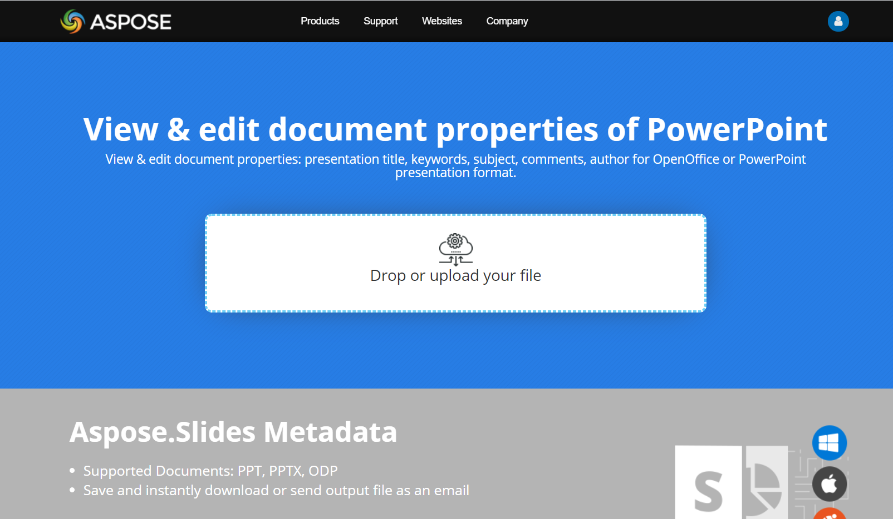

## **Bevezetés**

Az Aspose.Slides két típusú dokumentumtulajdonságot támogat: **Beépített** és **Egyéni**. Mindkét tulajdonságtípust könnyen el lehet érni és kezelni az Aspose.Slides API segítségével.

Az Aspose.Slides lehetővé teszi a prezentáció dokumentumtulajdonságokkal való munkát a [IDocumentProperties](https://reference.aspose.com/slides/hu/cpp/class/aspose.slides.i_document_properties) interfészen keresztül. Ennek az interfésznek egy példánya a [Presentation::get_DocumentProperties](https://reference.aspose.com/slides/hu/cpp/aspose.slides/presentation/get_documentproperties/) metódussal érhető vissza. Az alábbi példák bemutatják, hogyan kell olvasni, módosítani és kezelni ezeket a tulajdonságokat.

{} 
Kérjük, vegye figyelembe, hogy a **Application** és **Producer** mezők értékét nem állíthatja be, mert az Aspose Ltd. és az Aspose.Slides for C++ x.x.x jelenik meg ezeken a mezőkön. 
{} 

## **Prezentáció tulajdonságainak kezelése**

A Microsoft PowerPoint egy olyan funkciót biztosít, amely lehetővé teszi néhány tulajdonság hozzáadását a prezentáció fájlokhoz. Ezek a dokumentumtulajdonságok hasznos információkat tárolnak a dokumentumokkal (prezentáció fájlokkal) együtt. Kétféle dokumentumtulajdonság létezik:

- Rendszer által definiált (Beépített) tulajdonságok
- Felhasználó által definiált (Egyéni) tulajdonságok

A **Beépített** tulajdonságok általános információkat tartalmaznak a dokumentumról, például a dokumentum címét, a szerző nevét, statisztikákat stb. A **Egyéni** tulajdonságok a felhasználó által definiált **Név/Érték** párok, ahol mind a név, mind az érték felhasználó által meghatározott. Az Aspose.Slides for C++ segítségével a fejlesztők hozzáférhetnek és módosíthatják a beépített és az egyéni tulajdonságok értékeit is. A Microsoft PowerPoint 2007 lehetővé teszi a prezentáció fájlok dokumentumtulajdonságainak kezelését. Ehhez csak kattintson az Office ikonra, majd a **Prepare | Properties | Advanced Properties** menüpontra a Microsoft PowerPoint 2007-ben. A **Advanced Properties** menüpont kiválasztása után megjelenik egy párbeszédpanel, amely lehetővé teszi a PowerPoint fájl dokumentumtulajdonságainak kezelését. A **Properties Dialog** ablakban több lapfül látható, mint például **General**, **Summary**, **Statistics**, **Contents** és **Custom**. Ezek a lapok különféle információk konfigurálását teszik lehetővé a PowerPoint fájlokhoz. A **Custom** lap a PowerPoint fájlok egyéni tulajdonságainak kezelésére szolgál.

## **Beépített tulajdonságok elérése**

Az **IDocumentProperties** objektum által biztosított tulajdonságok: **Creator(Author)**, **Description**, **KeyWords**, **Created** (Létrehozás dátuma), **Modified** (Módosítás dátuma), **Printed** (Utolsó nyomtatás dátuma), **LastModifiedBy**, **Keywords**, **SharedDoc** (Meg van osztva különböző producerek között?), **PresentationFormat**, **Subject** és **Title**.



## **Beépített tulajdonságok módosítása**

A prezentáció fájlok beépített tulajdonságainak módosítása ugyanolyan egyszerű, mint azok elérése. Egyszerűen egy karakterlánc értéket adhat bármely kívánt tulajdonsághoz, és a tulajdonság értéke módosul. Az alább található példában bemutatjuk, hogyan módosítható egy prezentáció fájl beépített dokumentumtulajdonságai.



## **Egyéni prezentációtulajdonságok hozzáadása**

Az Aspose.Slides for C++ lehetővé teszi a fejlesztők számára, hogy egyéni értékeket adjanak a prezentáció dokumentumtulajdonságaihoz. Az alábbi példa bemutatja, hogyan állíthatók be egyéni tulajdonságok egy prezentációhoz.

``` cpp
// Példányosítja a Presentation osztályt
auto presentation = System::MakeObject<Presentation>();

// Dokumentumtulajdonságok lekérése
auto documentProperties = presentation->get_DocumentProperties();

// Egyéni tulajdonságok hozzáadása
documentProperties->idx_set(u"New Custom", ObjectExt::Box<int32_t>(12));
documentProperties->idx_set(u"My Name", ObjectExt::Box<String>(u"Mudassir"));
documentProperties->idx_set(u"Custom", ObjectExt::Box<int32_t>(124));

// Tulajdonság nevének lekérése egy adott indexnél
String getPropertyName = documentProperties->GetCustomPropertyName(2);

// Kijelölt tulajdonság eltávolítása
documentProperties->RemoveCustomProperty(getPropertyName);

// Prezentáció mentése
presentation->Save(u"CustomDocumentProperties_out.pptx", SaveFormat::Pptx);
```

## **Egyéni tulajdonságok elérése és módosítása**

Az Aspose.Slides for C++ lehetővé teszi a fejlesztők számára, hogy hozzáférjenek az egyéni tulajdonságok értékeihez. Az alábbi példa bemutatja, hogyan érheti el és módosíthatja ezeket az egyéni tulajdonságokat egy prezentációban.



## **Helyesírás-ellenőrzési nyelv beállítása**

Az Aspose.Slides a [LanguageId](https://reference.aspose.com/slides/hu/cpp/aspose.slides/baseportionformat/set_languageid/) tulajdonságot (amit a [PortionFormat](https://reference.aspose.com/slides/hu/cpp/aspose.slides/portionformat/) osztály biztosít) teszi elérhetővé, hogy beállíthassa a helyesírás-ellenőrzési nyelvet egy PowerPoint dokumentumhoz. A helyesírás-ellenőrzési nyelv az a nyelv, amelynek helyesírását és nyelvtanát a PowerPoint ellenőrzi.

Ez a C++ kód megmutatja, hogyan állítható be a helyesírás-ellenőrzési nyelv egy PowerPoint fájlhoz:

```c++
System::SharedPtr<Presentation> pres = System::MakeObject<Presentation>(pptxFileName);
System::SharedPtr<AutoShape> autoShape = System::ExplicitCast<AutoShape>(pres->get_Slide(0)->get_Shape(0));

System::SharedPtr<IParagraph> paragraph = autoShape->get_TextFrame()->get_Paragraph(0);
System::SharedPtr<IPortionCollection> portions = paragraph->get_Portions();
portions->Clear();

System::SharedPtr<Portion> newPortion = System::MakeObject<Portion>();

System::SharedPtr<IFontData> font = System::MakeObject<FontData>(u"SimSun");
System::SharedPtr<IPortionFormat> portionFormat = newPortion->get_PortionFormat();
portionFormat->set_ComplexScriptFont(font);
portionFormat->set_EastAsianFont(font);
portionFormat->set_LatinFont(font);

portionFormat->set_LanguageId(u"zh-CN");
// set the Id of a proofing language

newPortion->set_Text(u"1。");
portions->Add(newPortion);
```

## **Alapértelmezett nyelv beállítása**

Ez a C++ kód megmutatja, hogyan állítható be az alapértelmezett nyelv egy teljes PowerPoint prezentációhoz:

```c++
System::SharedPtr<LoadOptions> loadOptions = System::MakeObject<LoadOptions>();
loadOptions->set_DefaultTextLanguage(u"en-US");

System::SharedPtr<Presentation> pres = System::MakeObject<Presentation>(loadOptions);

// Új téglalap alakzat szöveggel
System::SharedPtr<IAutoShape> shp = pres->get_Slide(0)->get_Shapes()->AddAutoShape(ShapeType::Rectangle, 50.0f, 50.0f, 150.0f, 50.0f);
System::SharedPtr<ITextFrame> textFrame = shp->get_TextFrame();
textFrame->set_Text(u"New Text");

// Ellenőrzi az első rész nyelvét
System::Console::WriteLine(textFrame->get_Paragraph(0)->get_Portion(0)->get_PortionFormat()->get_LanguageId());
```

## **Élő példa**

Próbálja ki a [**Aspose.Slides Metadata**](https://products.aspose.app/slides/hu/metadata) online alkalmazást, hogy lássa, hogyan dolgozhat a dokumentumtulajdonságokkal az Aspose.Slides API segítségével:

[](https://products.aspose.app/slides/hu/metadata)

## ***GYIK**

**Hogyan távolíthatok el egy beépített tulajdonságot egy prezentációból?**

A beépített tulajdonságok a prezentáció szerves részei, és nem távolíthatók el teljesen. Azonban megváltoztathatja az értéküket, vagy ha a konkrét tulajdonság engedélyezi, üresre állíthatja őket.

**Mi történik, ha már létező egyéni tulajdonságot adok hozzá?**

Ha már létező egyéni tulajdonságot ad hozzá, a meglévő érték felül lesz írva az új értékkel. Nem szükséges előtte eltávolítani vagy ellenőrizni a tulajdonságot, mivel az Aspose.Slides automatikusan frissíti a tulajdonság értékét.

**Elérhetem a prezentáció tulajdonságait anélkül, hogy teljesen betölteném a prezentációt?**

Igen, a prezentáció tulajdonságait anélkül is elérheti, hogy teljesen betöltené a prezentációt, a `GetPresentationInfo` metódus használatával a [PresentationFactory](https://reference.aspose.com/slides/hu/cpp/aspose.slides/presentationfactory/) osztályból. Ezután a [IPresentationInfo](https://reference.aspose.com/slides/hu/cpp/aspose.slides/ipresentationinfo/) interfész `ReadDocumentProperties` metódusát használva hatékonyan olvashatja a tulajdonságokat, ami memóriát takarít meg és javítja a teljesítményt.