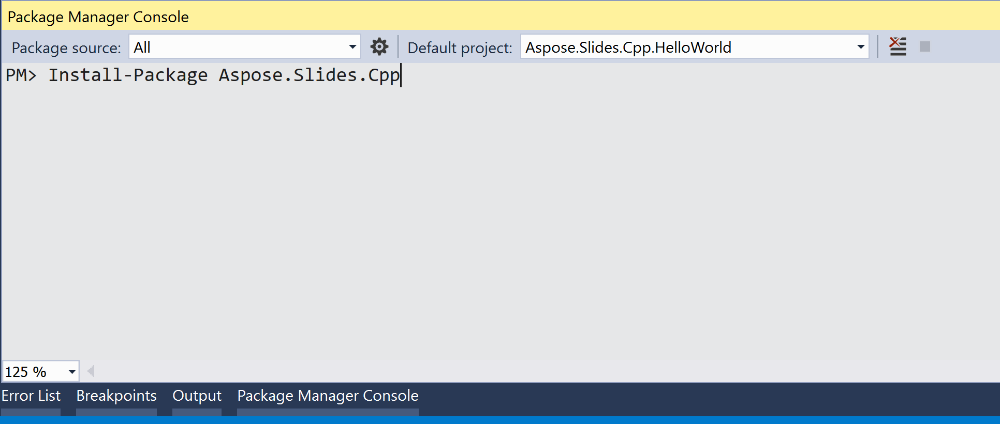

## **Áttekintés**

Az Aspose.Slides for C++ két formában érhető el:

| Formátum | Használati cél | Hol szerezhető be |
|---|---|---|
| NuGet csomagok: [Aspose.Slides.Cpp](https://www.nuget.org/packages/Aspose.Slides.Cpp/) (64-bit) és [Aspose.Slides.Cpp.x86](https://www.nuget.org/packages/Aspose.Slides.Cpp.x86/) (32-bit) | Visual Studio C++ projektek Windows rendszeren | NuGet |
| ZIP csomagok Windows, Linux és macOS számára | Építések NuGet nélkül, például CMake projektek | A [letöltési oldal](https://releases.aspose.com/slides/cpp/) |

Ez a cikk bemutatja, hogyan telepítsük a NuGet csomagot a Visual Studio-ban Windows rendszeren, valamint hogyan használjuk a ZIP csomagot CMake‑el Linuxon. Mindkét út ugyanazzal az ellenőrzéssel végződik: építsük és futtassuk az első példát a [Create Presentations](/slides/hu/cpp/create-presentation/) oldalon.

## **Windows**

Windows rendszeren adja hozzá a NuGet csomagot egy Visual Studio C++ projekthez. A csomag telepíti a függőséget, a CodePorting.Translator.Cs2Cpp.Framework‑et, és a programjának szükséges DLL‑eket a build kimeneti mappába másolja.

A csomagot a célplatform szerint válassza: **Aspose.Slides.Cpp** x64‑hez, és **Aspose.Slides.Cpp.x86** Win32‑hez (x86). Az Aspose.Slides.Cpp csomag nem alkalmazható Win32 buildhez, ezért a fordító nem találja a fejléceit.

A Windows ZIP csomag is elérhető a [letöltési oldalon](https://releases.aspose.com/slides/cpp/).

### **1. módszer: Az Aspose.Slides telepítése vagy frissítése a NuGet csomagkezelőből**

1. Nyissa meg a Microsoft Visual Studio‑t.  
2. Hozzon létre egy C++ **Console App** projektet, vagy nyisson meg egy meglévőt.  
3. A **Solution Explorer**‑ben kattintson a projektre jobb gombbal, és válassza a **Manage NuGet Packages** lehetőséget (vagy válassza a **Project** > **Manage NuGet Packages** menüt).  
4. A **Browse** lapon keressen rá a *Aspose.Slides.Cpp* kifejezésre.  
     
5. Kattintson a **Aspose.Slides.Cpp** (vagy **Aspose.Slides.Cpp.x86** 32‑bit buildhez) lehetőségre, majd a **Install** gombra.  
   * Ha már telepítve van az Aspose.Slides, és frissíteni szeretné, kattintson a **Update** gombra.

A csomag letöltődik, és hivatkozásként kerül a projektbe.

### **2. módszer: Az Aspose.Slides telepítése vagy frissítése a Package Manager konzol segítségével**

1. Nyissa meg a Microsoft Visual Studio‑t.  
2. Hozzon létre egy C++ **Console App** projektet, vagy nyisson meg egy meglévőt.  
3. Lépjen a **Tools** > **NuGet Package Manager** > **Package Manager Console** menüpontra.  
     
4. Futtassa ezt a parancsot:

   ```powershell
   Install-Package Aspose.Slides.Cpp
   ```

   32‑bit (Win32) buildhez telepítse helyette az x86 csomagot:

   ```powershell
   Install-Package Aspose.Slides.Cpp.x86
   ```

   

   A telepítés befejezésekor megjelennek a visszaigazoló üzenetek. A csomag az [Aspose EULA](https://about.aspose.com/legal/eula) alapján kerül terjesztésre.  
   

   A csomag frissítéséhez futtassa a `Update-Package Aspose.Slides.Cpp` (vagy `Update-Package Aspose.Slides.Cpp.x86`) parancsot a Package Manager Console‑ban.

### **Ellenőrizze a telepítést**

1. Cserélje le a projekt fő *.cpp* fájljának (a `main`‑t tartalmazó fájl) tartalmát az első példával a [Create Presentations](/slides/hu/cpp/create-presentation/) oldalon.  
2. Az eszköztáron válassza ki a **x64** platformot, vagy **x86**‑ot, ha az Aspose.Slides.Cpp.x86‑et telepítette.  
3. Nyomja meg a **Ctrl+F5**‑öt a program építéséhez és futtatásához.

A program a *hello.pptx* fájlt a projekt mappájába menti, ami a Visual Studio alapértelmezett munkakönyvtára, amikor programot futtat.

## **Linux**

Linuxon a Linux ZIP csomagot használja CMake‑kel. Ez tartalmazza az Aspose.Slides könyvtárat, annak függőségét a CodePorting.Translator.Cs2Cpp.Framework‑ot, valamint egy CMake konfigurációs fájlt mindegyikhez. A könyvtárak x86_64 Linuxra, glibc 2.23 vagy újabb verzióval épültek.

1. Telepítsen egy C++ fordítót, make‑t, CMake‑t, unzip‑et és a fontconfig könyvtárat, amelyre az Aspose.Slides könyvtárak támaszkodnak. Debian és Ubuntu esetén:  
   ```bash
   sudo apt-get update && sudo apt-get install -y g++ make cmake unzip libfontconfig1
   ```

2. Hozzon létre egy projekt mappát, és lépjen bele:  
   ```bash
   mkdir hello-slides
   cd hello-slides
   ```

3. Töltse le a Linux ZIP-et (**Aspose.Slides for C++ Linux**) a [letöltési oldalról](https://releases.aspose.com/slides/cpp/), a projekt mappába, majd csomagolja ki az *aspose-slides-cpp* almappába:  
   ```bash
   unzip aspose-slides-cpp-linux-*.zip -d aspose-slides-cpp
   ```

4. Hozzon létre egy *CMakeLists.txt* nevű fájlt a projekt mappában a következő tartalommal:  
   ```cmake
   cmake_minimum_required(VERSION 3.13)
   project(HelloSlides CXX)

   set(CMAKE_CXX_STANDARD 14)
   set(CMAKE_CXX_STANDARD_REQUIRED ON)

   set(ASPOSE_SLIDES_DIR "${CMAKE_CURRENT_SOURCE_DIR}/aspose-slides-cpp")
   find_package(CodePorting.Translator.Cs2Cpp.Framework REQUIRED CONFIG PATHS "${ASPOSE_SLIDES_DIR}" NO_DEFAULT_PATH)
   find_package(Aspose.Slides.Cpp REQUIRED CONFIG PATHS "${ASPOSE_SLIDES_DIR}" NO_DEFAULT_PATH)

   add_executable(hello main.cpp)
   target_link_libraries(hello PRIVATE Aspose.Slides.Cpp)
   ```

   A két `find_package` hívás betölti a kicsomagolt csomag CMake konfigurációs fájljait. A keretrendszer elsőként kerül megtalálásra, mivel az Aspose.Slides függ tőle. Az `Aspose.Slides.Cpp` célra történő hivatkozás hozzáadja a include mappákat és mindkét könyvtárat a buildhez.

5. Mentse el az első példát a [Create Presentations](/slides/hu/cpp/create-presentation/) oldalról *main.cpp* néven a projekt mappába.  
6. Építse és futtassa a programot:  
   ```bash
   cmake -S . -B build -DCMAKE_BUILD_TYPE=Release
   cmake --build build
   ./build/hello
   ```

A program a *hello.pptx* fájlt az aktuális mappában menti. A CMake rögzíti a könyvtárak helyét a programban, így nem szükséges beállítani a `LD_LIBRARY_PATH` változót, amíg az *aspose-slides-cpp* mappa helyben marad.

A bemutatókban használt betűtípusokat, vagy megfelelő helyettesítőket, a rendszerre telepíteni kell, hogy a szöveg helyesen jelenjen meg a diák PDF‑re vagy képekre konvertálásakor.

## **Gyakran Ismételt Kérdések**

**Van ingyenes verzió vagy próbaidőkorlát?**

Igen. Licenc nélkül az Aspose.Slides értékelő módban működik: minden mentett dia vízjelet kap, és a bemutatókból beolvasott szöveget levágja. Ezeknek a korlátozásoknak a megszüntetéséhez alkalmazzon érvényes [licencet](/slides/hu/cpp/licensing/).

**Miért jelzi a fordító, hogy nem tudja megnyitni a *DOM/Presentation.h* fájlt?**

A telepített csomag nem illeszkedik a build platformjához. Az Aspose.Slides.Cpp csak x64 buildhez alkalmazható, az Aspose.Slides.Cpp.x86 csak Win32 buildhez. Válassza ki a megfelelő platformot a Visual Studio-ban, vagy telepítse a másik csomagot.