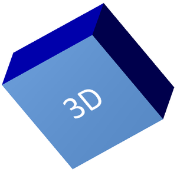
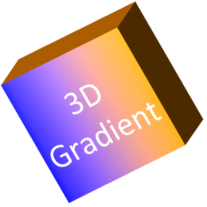

## **Áttekintés**

Az Aspose.Slides for Java képes létrehozni, szerkeszteni, megőrizni és renderelni a PowerPoint‑stílusú 3D formázást alakzatokhoz és szöveghez. Ez a cikk a 3D hatásokat, például a forgatást, extrudálást, levágásokat, megvilágítást, anyagot, színátmenetes vagy képpel kitöltést, valamint a 3D szöveget tárgyalja.

{}
Ez a cikk a PowerPoint alakzatokra és szövegre vonatkozó 3D formázási hatásokról szól. Nem a különálló 3D modellfájlok beszúrásáról vagy szerkesztéséről szól. Amikor egy diát képre, PDF‑re vagy HTML‑re exportál, az Aspose.Slides ezeket a 3D hatásokat a exportált 2D kimenetbe rendereli.
{}

## **3D formázási koncepciók**

Használja a [IShape](https://reference.aspose.com/slides/hu/java/com.aspose.slides/ishape/).`getThreeDFormat()` metódust 3D formátum alkalmazásához egy alakzatra. A visszaadott formátumobjektum vezérli az adott alakzat 3D jelenetét.

Szöveghez használja a [ITextFrameFormat](https://reference.aspose.com/slides/hu/java/com.aspose.slides/itextframeformat/).`getThreeDFormat()`. Ez a szövegkeretre alkalmaz 3D formázást az alakzat testének helyett.

A legfontosabb API tagok a következők:

| API tag | Mit vezérel | Mikor használja |
|---|---|---|
| [getCamera](https://reference.aspose.com/slides/hu/java/com.aspose.slides/ithreedformat/#getCamera--) | Nézőpont, előre beállított kamera típus, forgatás, nagyítás és perspektíva. | Az objektum forgatása 3D térben vagy egy PowerPoint 3D forgatási előbeállítás illesztése. |
| [getLightRig](https://reference.aspose.com/slides/hu/java/com.aspose.slides/ithreedformat/#getLightRig--) | Fény előbeállítás, irány és fényforgatás. | Megváltoztatja, hogy a kiemelések és árnyékok hogyan jelennek meg a 3D felületen. |
| [getMaterial](https://reference.aspose.com/slides/hu/java/com.aspose.slides/ithreedformat/#getMaterial--) és [setMaterial](https://reference.aspose.com/slides/hu/java/com.aspose.slides/ithreedformat/#setMaterial-int-) | Felületi anyag, mint például lapos, matt, műanyag vagy fém. | Ugyanazon geometria laposabbá, puhábbá, fényesebbé vagy fémesebbé tétele. |
| [getExtrusionHeight](https://reference.aspose.com/slides/hu/java/com.aspose.slides/ithreedformat/#getExtrusionHeight--) és [setExtrusionHeight](https://reference.aspose.com/slides/hu/java/com.aspose.slides/ithreedformat/#setExtrusionHeight-double-) | Milyen távolságra nyúlik ki az alakzat hátrafelé az első felületétől. | Lap alakzatot láthatóan vastag 3D objektummá alakít. |
| [getExtrusionColor](https://reference.aspose.com/slides/hu/java/com.aspose.slides/ithreedformat/#getExtrusionColor--) | Az extrudált oldalak színe. | A mélység láthatóvá tétele vagy az oldal színének összehangolása az első kitöltéssel. |
| [getDepth](https://reference.aspose.com/slides/hu/java/com.aspose.slides/ithreedformat/#getDepth--) és [setDepth](https://reference.aspose.com/slides/hu/java/com.aspose.slides/ithreedformat/#setDepth-double-) | További 3D mélység, amelyet a PowerPoint 3D formázás használ. | Finomhangolja a mélységet alakzatoknál vagy szövegnél, különösen a bevel és anyag beállításokkal együtt. |
| [getBevelTop](https://reference.aspose.com/slides/hu/java/com.aspose.slides/ithreedformat/#getBevelTop--) és [getBevelBottom](https://reference.aspose.com/slides/hu/java/com.aspose.slides/ithreedformat/#getBevelBottom--) | Emelt vagy lekerekített élek az első és hátsó felületeken. | Lágy vagy formázott él hozzáadása egy éles, lapos felület helyett. |
| [getContourColor](https://reference.aspose.com/slides/hu/java/com.aspose.slides/ithreedformat/#getContourColor--), [getContourWidth](https://reference.aspose.com/slides/hu/java/com.aspose.slides/ithreedformat/#getContourWidth--), és [setContourWidth](https://reference.aspose.com/slides/hu/java/com.aspose.slides/ithreedformat/#setContourWidth-double-) | Körvonal a 3D objektum körül. | Kiemeli az objektum határát a renderelt kimenetben. |

## **3D alakzat létrehozása**

- Kamera beállítások, mivel az alapértelmezett előnézet elrejtheti az extrudálást.  
- Világítás beállítások, mivel a megvilágítás teszi olvashatóvá az felületeket és oldalakat.  
- Anyag beállítások, mivel a felület befolyásolja a fény megjelenítését.  
- Extrudálás vagy mélység beállítások, mivel egy lapos alakzatnak szüksége van vastagságra.

Az alábbi példa egy téglalapot hoz létre, szöveget ad az első felületéhez, 3D formázást alkalmaz, PPTX‑ként menti a prezentációt, és a diát PNG képre rendereli.

```java
import com.aspose.slides.*;
import java.awt.Color;

final float imageScale = 2;

Presentation presentation = new Presentation();
try {
    ISlide slide = presentation.getSlides().get_Item(0);
    IAutoShape shape = slide.getShapes().addAutoShape(ShapeType.Rectangle, 200, 150, 200, 200);
    shape.getTextFrame().setText("3D");
    shape.getTextFrame().getParagraphs().get_Item(0).getParagraphFormat().getDefaultPortionFormat().setFontHeight(64);

    shape.getFillFormat().setFillType(FillType.Solid);
    shape.getFillFormat().getSolidFillColor().setColor(Color.BLUE);

    shape.getThreeDFormat().getCamera().setCameraType(CameraPresetType.OrthographicFront);
    shape.getThreeDFormat().getCamera().setRotation(20, 30, 40);
    shape.getThreeDFormat().getLightRig().setLightType(LightRigPresetType.Flat);
    shape.getThreeDFormat().getLightRig().setDirection(LightingDirection.Top);
    shape.getThreeDFormat().setMaterial(MaterialPresetType.Flat);
    shape.getThreeDFormat().setExtrusionHeight(100);
    shape.getThreeDFormat().getExtrusionColor().setColor(Color.BLUE);

    IImage thumbnail = slide.getImage(imageScale, imageScale);
    try {
        thumbnail.save("shape_3d.png", ImageFormat.Png);
    } finally {
        thumbnail.dispose();
    }

    presentation.save("shape_3d.pptx", SaveFormat.Pptx);
} finally {
    presentation.dispose();
}
```

A renderelt dia kép a téglalapot mint vastag 3D blokkot mutatja:



## **Alakzat forgatása a kamerával**

PowerPoint‑ban a 3D forgatás a „3‑D Rotation” panelen állítható be. Az X, Y és Z forgatási értékek megfelelnek a kamera API‑n keresztül beállított forgatásnak.


Aspose.Slides‑ban a kamera típusát és forgatását a `shape.getThreeDFormat()` által visszaadott 3D formátumon keresztül állíthatja be:

```java
import com.aspose.slides.*;

Presentation presentation = new Presentation();
try {
    ISlide slide = presentation.getSlides().get_Item(0);
    IAutoShape shape = slide.getShapes().addAutoShape(ShapeType.Rectangle, 200, 150, 200, 200);

    shape.getThreeDFormat().getCamera().setCameraType(CameraPresetType.OrthographicFront);
    shape.getThreeDFormat().getCamera().setRotation(20, 30, 40);
} finally {
    presentation.dispose();
}
```

Használja a kamerát, amikor meg kell változtatni, hogy a néző hogyan látja az objektumot. Nem változtatja meg a 2D alakzat geometriáját a dián. A 3D nézőpontot változtatja meg, amelyet a PowerPoint és az Aspose.Slides a rendereléskor használ.

## **Extrudálás és mélység hozzáadása**

Az extrudálás egy alakzatot vastagnak mutat azáltal, hogy kinyújtja a front felülete mögé. PowerPoint‑ban a mélység szabályozó állítja be ezt a látható vastagságot, a szín szabályozó pedig az oldal felületek színét.


Állítsa be az extrudálás magasságát a vastagsághoz és az extrudálás színét az oldal színéhez:

```java
import com.aspose.slides.*;
import java.awt.Color;

Presentation presentation = new Presentation();
try {
    ISlide slide = presentation.getSlides().get_Item(0);
    IAutoShape shape = slide.getShapes().addAutoShape(ShapeType.Rectangle, 200, 150, 200, 200);

    Color extrusionColor = new Color(128, 0, 128);

    shape.getThreeDFormat().getCamera().setRotation(20, 30, 40);
    shape.getThreeDFormat().setExtrusionHeight(100);
    shape.getThreeDFormat().getExtrusionColor().setColor(extrusionColor);
} finally {
    presentation.dispose();
}
```

Használja a mélység beállítást, amikor közvetlenül a PowerPoint mélységértékével kell dolgozni, vagy a mélységet bevel, anyag és szöveghatásokkal kombinálni. Sok alakzati esetben az extrudálás magassága egyértelműbb beállítás, mert közvetlenül kifejezi a látható extrudálást.

## **Színátmenetes vagy kép kitöltések használata 3D hatásokkal**

A 3D formázás független az alakzat kitöltésétől. Alkalmazhat egy egyszínű, színátmenetes, mintás vagy képes kitöltést az első felületre, miközben ugyanazt a kamerát, fényt, anyagot és extrudálást használja.

Ez a példa színátmenetes kitöltést alkalmaz az alakzatra és sötétebb extrudálás színt az oldalakon:

```java
import com.aspose.slides.*;
import java.awt.Color;

final float imageScale = 2;

Presentation presentation = new Presentation();
try {
    ISlide slide = presentation.getSlides().get_Item(0);
    IAutoShape shape = slide.getShapes().addAutoShape(ShapeType.Rectangle, 200, 150, 250, 250);
    shape.getTextFrame().setText("3D Gradient");
    shape.getTextFrame().getParagraphs().get_Item(0).getParagraphFormat().getDefaultPortionFormat().setFontHeight(64);

    shape.getFillFormat().setFillType(FillType.Gradient);
    shape.getFillFormat().getGradientFormat().getGradientStops().add(0, Color.BLUE);
    shape.getFillFormat().getGradientFormat().getGradientStops().add(100, Color.ORANGE);

    shape.getThreeDFormat().getCamera().setCameraType(CameraPresetType.OrthographicFront);
    shape.getThreeDFormat().getCamera().setRotation(10, 20, 30);
    shape.getThreeDFormat().getLightRig().setLightType(LightRigPresetType.Flat);
    shape.getThreeDFormat().getLightRig().setDirection(LightingDirection.Top);
    shape.getThreeDFormat().setMaterial(MaterialPresetType.Flat);
    Color extrusionColor = new Color(255, 140, 0);
    shape.getThreeDFormat().setExtrusionHeight(150);
    shape.getThreeDFormat().getExtrusionColor().setColor(extrusionColor);

    IImage thumbnail = slide.getImage(imageScale, imageScale);
    try {
        thumbnail.save("gradient_3d.png", ImageFormat.Png);
    } finally {
        thumbnail.dispose();
    }
} finally {
    presentation.dispose();
}
```

A renderelt kimenet megőrzi a színátmenetet az első felületen, és külön rendereli az extrudálást:



Ha kép kitöltést szeretne használni, adja hozzá a képet a prezentációhoz, és rendelje hozzá az alakzat kitöltéséhez:

```java
import com.aspose.slides.*;
import java.awt.Color;

Presentation presentation = new Presentation();
try {
    ISlide slide = presentation.getSlides().get_Item(0);
    IAutoShape shape = slide.getShapes().addAutoShape(ShapeType.Rectangle, 200, 150, 250, 250);

    java.nio.file.Path imagePath = java.nio.file.Paths.get("image.jpg");
    byte[] imageData = java.nio.file.Files.readAllBytes(imagePath);
    IPPImage image = presentation.getImages().addImage(imageData);

    shape.getFillFormat().setFillType(FillType.Picture);
    shape.getFillFormat().getPictureFillFormat().getPicture().setImage(image);
    shape.getFillFormat().getPictureFillFormat().setPictureFillMode(PictureFillMode.Stretch);

    Color extrusionColor = new Color(255, 140, 0);
    shape.getThreeDFormat().getCamera().setRotation(10, 20, 30);
    shape.getThreeDFormat().setExtrusionHeight(150);
    shape.getThreeDFormat().getExtrusionColor().setColor(extrusionColor);
} finally {
    presentation.dispose();
}
```

A képet az első felületen rendereli, míg az extrudálást a 3D oldal felületként:


## **3D formázás alkalmazása szövegre**

Az alakzat 3D formázása az alakzat testére hat. A szöveg 3D formázása a szövegkeretre. Ez hasznos WordArt‑szerű hatásokhoz, ahol a betűknek is szükségük van extrudálásra, anyagra, megvilágításra és kamera beállításokra.

Az alábbi példa szöveget hoz létre mintás kitöltéssel, WordArt átalakítást alkalmaz, és 3D beállításokat konfigurál a [ITextFrameFormat](https://reference.aspose.com/slides/hu/java/com.aspose.slides/itextframeformat/)-on:

```java
import com.aspose.slides.*;
import java.awt.Color;

final float imageScale = 2;

Presentation presentation = new Presentation();
try {
    ISlide slide = presentation.getSlides().get_Item(0);
    IAutoShape shape = slide.getShapes().addAutoShape(ShapeType.Rectangle, 200, 150, 250, 250);
    shape.getFillFormat().setFillType(FillType.NoFill);
    shape.getLineFormat().getFillFormat().setFillType(FillType.NoFill);
    shape.getTextFrame().setText("3D Text");

    IPortion portion = shape.getTextFrame().getParagraphs().get_Item(0).getPortions().get_Item(0);
    portion.getPortionFormat().getFillFormat().setFillType(FillType.Pattern);
    Color patternColor = new Color(255, 140, 0);
    portion.getPortionFormat().getFillFormat().getPatternFormat().getForeColor().setColor(patternColor);
    portion.getPortionFormat().getFillFormat().getPatternFormat().getBackColor().setColor(Color.WHITE);
    portion.getPortionFormat().getFillFormat().getPatternFormat().setPatternStyle(PatternStyle.LargeGrid);

    shape.getTextFrame().getParagraphs().get_Item(0).getParagraphFormat().getDefaultPortionFormat().setFontHeight(128);

    ITextFrameFormat textFrameFormat = shape.getTextFrame().getTextFrameFormat();
    textFrameFormat.setTransform(TextShapeType.ArchUp);
    textFrameFormat.getThreeDFormat().setExtrusionHeight(3.5f);
    textFrameFormat.getThreeDFormat().setDepth(3);
    textFrameFormat.getThreeDFormat().setMaterial(MaterialPresetType.Plastic);
    textFrameFormat.getThreeDFormat().getLightRig().setDirection(LightingDirection.Top);
    textFrameFormat.getThreeDFormat().getLightRig().setLightType(LightRigPresetType.Balanced);
    textFrameFormat.getThreeDFormat().getLightRig().setRotation(0, 0, 40);
    textFrameFormat.getThreeDFormat().getCamera().setCameraType(CameraPresetType.PerspectiveContrastingRightFacing);

    IImage thumbnail = slide.getImage(imageScale, imageScale);
    try {
        thumbnail.save("text_3d.png", ImageFormat.Png);
    } finally {
        thumbnail.dispose();
    }

    presentation.save("text_3d.pptx", SaveFormat.Pptx);
} finally {
    presentation.dispose();
}
```

A szöveg íves, extrudált 3D betűként renderelődik:


## **Exportálási és renderelési viselkedés**

Az Aspose.Slides megőrzi a 3D formázást a PowerPoint formátumokba, például PPTX‑be mentéskor. Amikor rögzített elrendezésű formátumokba renderel vagy exportál, a 3D jelenet raszterizálódik vagy a kimenetbe 2D eredményként kerül. Ez akkor is érvényes, amikor a diákot a [PNG](/slides/hu/java/convert-powerpoint-to-png/)-ra rendereli, a [PDF](/slides/hu/java/convert-powerpoint-to-pdf/)-ra exportál, a [HTML](/slides/hu/java/convert-powerpoint-to-html/)-ra exportál, vagy a [videó konverzió](/slides/hu/java/convert-powerpoint-to-video/) kereteit generálja.

Tartsa szem előtt a következőket:

- Az exportált képek és PDF‑ek nem interaktívak. Az objektumot a néző nem tudja forgatni az export után.  
- A végső megjelenés a kamera, fény, anyag, extrudálás, kitöltés és dia méretezés kombinációjától függ.  
- Ha meg kell vizsgálni az örökölt vagy téma‑alapú formázási értékeket, olvassa a [effective shape properties](/slides/hu/java/shape-effective-properties/)-t.  
- Egyes kimeneti formátumok nem tudják tárolni a szerkeszthető PowerPoint 3D formázást. Ezekben a formátumokban a vizuális eredmény renderelve van, nem szerkeszthető 3D beállításként.

## **GYIK**

### Készíthet‑e az Aspose.Slides interaktív 3D prezentációkat?

Az Aspose.Slides PowerPoint 3D hatásokat hoz létre és renderel alakzatokra és szövegre. Nem tesz interaktív 3D jeleneteket exportált képek, PDF‑ek vagy HTML‑oldalak esetén, amelyeket a néző forgathat. PPTX‑ben a 3D formázás szerkeszthető marad a PowerPoint‑ban, ahol a formátum támogatja.

### Mi a különbség a 3D modell és a 3D effektus között?

A 3D modell egy különálló 3D objektum, amelyet a prezentációba szúrnak be. A 3D effektus egy szabványos PowerPoint alakzatra vagy szövegre alkalmazott formázás, például forgatás, extrudálás, bevel, megvilágítás és anyag. Ez a cikk a 3D effektusokat tárgyalja.

### Mely beállítások szükségesek egy látható 3D alakzathoz?

Legalább egy kamera forgatást, valamint extrudálást vagy mélységet kell beállítani. Gyakorlati szempontból érdemes továbbá fényriget és anyagot is beállítani, hogy a renderelt felületeknek legyenek tiszta kiemelések és árnyékok.

### Alkalmazhatok‑e 3D hatásokat alakzatokra és szövegre egyaránt?

Igen. Használja a [IShape](https://reference.aspose.com/slides/hu/java/com.aspose.slides/ishape/).`getThreeDFormat()`‑t az alakzat testére, és a [ITextFrameFormat](https://reference.aspose.com/slides/hu/java/com.aspose.slides/itextframeformat/).`getThreeDFormat()`‑t a szövegre.

### Megjelennek‑e a 3D hatások exportáláskor képekre, PDF‑re, HTML‑re vagy videoképkockákra?

Igen. Az Aspose.Slides 3D hatásokat renderel, amikor dia képeket, PDF‑kimenetet, HTML‑kimenetet és a videó konverzióhoz használt képkockákat állít elő. Az exportált kimenet a renderelt megjelenést tartalmazza, nem szerkeszthető 3D objektumot.

### Kiolvashatom‑e a végső 3D értékeket, miután az öröklődés és a téma beállítások alkalmazásra kerültek?

Igen. Használja az effektív formázási API‑kat, amelyeket a [Shape Effective Properties](/slides/hu/java/shape-effective-properties/) leír. Ez lehetővé teszi a végső kamera, fényrig, bevel és kapcsolódó 3D értékek kiolvasását.