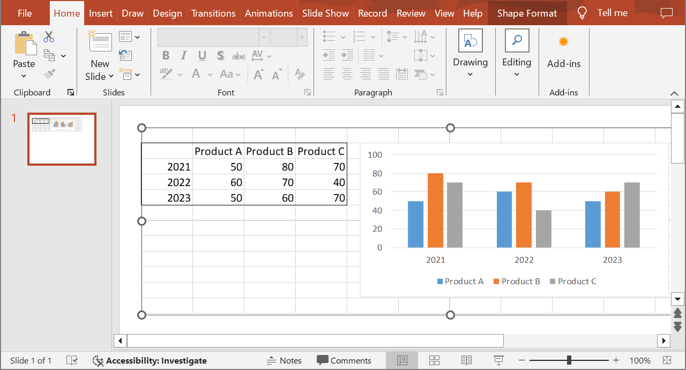

## **Bevezetés**

Az Aspose.Slides for Java használatával, amikor egy [OleObjectFrame](https://reference.aspose.com/slides/hu/java/com.aspose.slides/oleobjectframe/) keretet adsz egy diára, egy "EMBEDDED OLE OBJECT" üzenet jelenik meg a kimeneti dián. Ez az üzenet szándékos, és NEM hiba.

További információért az OLE objektumok kezeléséről, lásd a [Manage OLE](/slides/hu/java/manage-ole/) oldalt. 

## **Magyarázat és megoldás**

Az Aspose.Slides a "EMBEDDED OLE OBJECT" üzenetet jeleníti meg, hogy értesítsen arról, hogy az OLE objektum módosult, és a előnézeti képet frissíteni kell. 

Például, ha egy Microsoft Excel diagramot adsz hozzá egy [OleObjectFrame](https://reference.aspose.com/slides/hu/java/com.aspose.slides/oleobjectframe/) keretként egy diára (további részletekért lásd a "Manage OLE" cikket), majd a prezentációt megnyitod a Microsoft PowerPointban, ezt a képet fogod látni a dián:


Ha ellenőrizni és megerősíteni szeretnéd, hogy az OLE objektumod hozzá lett adva a diához, duplán kattints a "EMBEDDED OLE OBJECT" üzenetre, vagy jobb‑kattintással a **Object > Edit** lehetőséget válaszd.


A PowerPoint ekkor megnyitja a beágyazott OLE objektumot.


A dia megtarthatja a "EMBEDDED OLE OBJECT" üzenetet. Miután rákattintasz az OLE objektumra, a dia előnézete frissül, és a "EMBEDDED OLE OBJECT" üzenet helyére az OLE objektum tényleges képe kerül. 



Most előfordulhat, hogy el akarod menteni a prezentációt, hogy biztosítsd az OLE objektum képének megfelelő frissítését. Így a prezentáció mentése után, amikor újra megnyitod, NEM fogod látni a "EMBEDDED OLE OBJECT" üzenetet. 

## **Egyéb megoldás**

Ha nem szeretnéd eltávolítani a "EMBEDDED OLE OBJECT" üzenetet a prezentáció PowerPointban történő megnyitásával és mentésével, akkor helyettesítheted az üzenetet a kívánt előnézeti képpel. Az alábbi kódsorok mutatják a folyamatot:

```java
import com.aspose.slides.*;

Presentation presentation = new Presentation("embeddedOLE.pptx");
try {
    ISlide slide = presentation.getSlides().get_Item(0);
    IOleObjectFrame oleFrame = (IOleObjectFrame) slide.getShapes().get_Item(0);

    // Képet ad a prezentáció erőforrásaihoz.
    IImage image = Images.fromFile("myImage.png");
    IPPImage oleImage = presentation.getImages().addImage(image);

    // Beállít egy címet és a képet az OLE objektum előnézetéhez.
    oleFrame.setSubstitutePictureTitle("My title");
    oleFrame.getSubstitutePictureFormat().getPicture().setImage(oleImage);
    oleFrame.setObjectIcon(false);

    presentation.save("embeddedOLE-newImage.pptx", SaveFormat.Pptx);
} finally {
    if (presentation != null) presentation.dispose();    
}
```

Ezután a `OleObjectFrame`‑t tartalmazó dia így néz ki:

