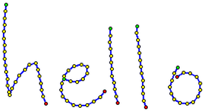

## **Bevezetés**

A PowerPoint biztosítja a tinta funkciót, amely lehetővé teszi nem szabványos alakzatok rajzolását, amelyek felhasználhatók más objektumok kiemelésére, kapcsolatok és folyamatok bemutatására, illetve egyes diák elemeire való figyelem felhívására. 

Az Aspose.Slides minden szükséges tinta típust (például a [Ink](https://reference.aspose.com/slides/hu/java/com.aspose.slides/ink/) osztályt) biztosít a tintaobjektumok létrehozásához és kezeléséhez. 

## **Különbségek a szabályos objektumok és a tintaobjektumok között**

A PowerPoint diáján lévő objektumokat általában alakzatobjektumok képviselik. Egy alakzatobjektum legegyszerűbben egy tároló, amely meghatározza magának az objektumnak a területét (keretét) és a tulajdonságait. Ez magában foglalja a tároló területének méretét, a tároló alakját, a tároló háttérszínét stb. További információkért lásd a [Shape Layout Format](https://docs.aspose.com/slides/hu/java/shape-manipulations/#access-layout-formats-for-shape) oldalt.

Azonban amikor a PowerPoint tintaobjektummal dolgozik, figyelmen kívül hagyja a keret (tároló) minden tulajdonságát, kivéve annak méretét. A tároló területének mérete a szabványos `width` és `height` értékekkel határozható meg:


## **Tintaforma nyomvonalak**

A nyomvonal (trace) egy alapvető elem vagy szabvány, amely a toll mozgásának útvonalát rögzíti, amikor a felhasználó digitális tintát ír. A nyomvonalak olyan felvételek, amelyek összekapcsolt pontok sorozatát írják le. 

A legegyszerűbb kódolási forma minden mintapont X és Y koordinátáit adja meg. Ha az összekapcsolt pontok megjelennek, az alábbi képet eredményezik:



## **Ecset tulajdonságok a rajzoláshoz**

Ecsettel vonalakat rajzolhat, amelyek összekötik a nyomvonal elemek pontjait. Az ecset saját színnel és mérettel rendelkezik, amelyek a `Brush.Color` és `Brush.Size` tulajdonságoknak felelnek meg. 

### **Állítsa be a tinta ecset színét**

Ez a Java kód bemutatja, hogyan állítható be egy ecset színe:

```java
Presentation pres = new Presentation("pres.pptx");
try {
    IInk ink = (IInk)pres.getSlides().get_Item(0).getShapes().get_Item(0);
    IInkTrace[] traces = ink.getTraces();
    IInkBrush brush = traces[0].getBrush();
    Color brushColor = brush.getColor();
    brush.setColor(Color.RED);
} finally {
    if (pres != null) pres.dispose();
}
```

### **Állítsa be a tinta ecset méretét**

Ez a Java kód bemutatja, hogyan állítható be egy ecset mérete:

```java
Presentation pres = new Presentation("pres.pptx");
try {
    IInk ink = (IInk)pres.getSlides().get_Item(0).getShapes().get_Item(0);
    IInkTrace[] traces = ink.getTraces();
    IInkBrush brush = traces[0].getBrush();
    Dimension2D brushSize = brush.getSize();
    brush.setSize(new Dimension(5, 10));
} finally {
    if (pres != null) pres.dispose();
}
```

Általában egy ecset szélessége és magassága nem egyezik, ezért a PowerPoint nem jeleníti meg az ecset méretét (az adat-szakasz szürke). Ha azonban az ecset szélessége és magassága megegyezik, a PowerPoint a méretet a következő módon jeleníti meg:


Az érthetőség kedvéért növeljük meg a tintaobjektum magasságát, és tekintsük át a fontos méreteket: 


A tároló (keret) nem veszi figyelembe az ecsetek méretét – mindig úgy számítja, hogy a vonal vastagsága nulla (lásd az utolsó képet). 

Ezért a teljes tintaobjektum látható területének meghatározásához figyelembe kell venni a nyomvonal objektumok ecsetméretét. Itt a célnak megfelelő objektum (a kézírásos szöveg nyomvonal objektuma) a tároló (keret) méretéhez lett skálázva. Amikor a tároló (keret) mérete változik, az ecsetméret állandó marad, és fordítva. 


A PowerPoint hasonló viselkedést mutat a szövegekkel is:


**További olvasmányok**

* Az alakzatokról általánosságban a [PowerPoint Shapes](https://docs.aspose.com/slides/hu/java/powerpoint-shapes/) szekcióban olvashat. 
* A hatékony értékekkel kapcsolatos további információkért lásd a [Shape Effective Properties](https://docs.aspose.com/slides/hu/java/shape-effective-properties/#getting-effective-font-height-value) oldalt.